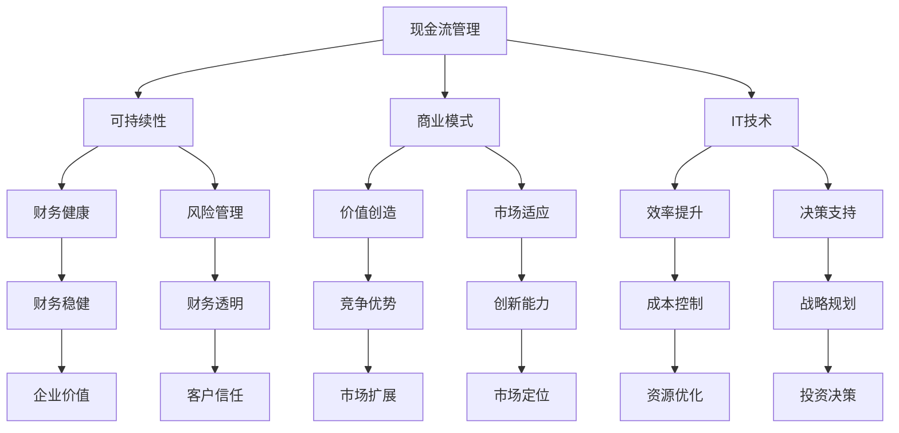

                 

# 一家公司如何实现可持续的现金流

> 关键词：现金流管理、可持续性、财务策略、商业模式、IT技术

> 摘要：本文将深入探讨一家公司如何通过有效的现金流管理策略、创新的商业模式以及先进的信息技术，实现现金流的可持续增长。我们将一步步解析这些核心概念，并通过实例分析，帮助读者理解如何在复杂的市场环境中保持财务健康。

## 1. 背景介绍

### 1.1 目的和范围

本文旨在为企业管理者提供一套系统的现金流管理策略，帮助他们在快速变化的市场中保持稳健的财务状况。我们将讨论的核心议题包括：

- 现金流管理的理论基础和实践方法
- 创新的商业模式及其对现金流的影响
- 先进信息技术在现金流管理中的应用

通过这些讨论，我们希望能够为读者提供一个全面、实用的现金流管理指南，助力企业在竞争激烈的市场中立于不败之地。

### 1.2 预期读者

本文适合以下读者群体：

- 企业高层管理人员，特别是财务总监和首席运营官
- 独立创业者，特别是那些刚刚起步的创业者
- 金融分析师和财务顾问
- 对财务管理和企业运营感兴趣的学者和学生

### 1.3 文档结构概述

本文的结构如下：

- 第1部分：背景介绍，包括目的和范围、预期读者以及文档结构概述
- 第2部分：核心概念与联系，介绍现金流管理的核心概念和相关理论
- 第3部分：核心算法原理 & 具体操作步骤，阐述现金流管理的算法原理和实践步骤
- 第4部分：数学模型和公式 & 详细讲解 & 举例说明，使用数学模型和公式详细解释现金流管理
- 第5部分：项目实战：代码实际案例和详细解释说明，提供实际案例和代码分析
- 第6部分：实际应用场景，探讨现金流管理的应用场景和挑战
- 第7部分：工具和资源推荐，介绍相关学习资源、开发工具和框架
- 第8部分：总结：未来发展趋势与挑战，总结本文的主要观点，并展望未来的发展趋势和挑战
- 第9部分：附录：常见问题与解答，提供常见问题及解答
- 第10部分：扩展阅读 & 参考资料，提供进一步的阅读材料和参考资料

### 1.4 术语表

#### 1.4.1 核心术语定义

- 现金流管理：指企业通过一系列策略和工具，确保现金流的稳定性和增长。
- 可持续性：指企业能够在长期内保持稳健的财务状况，实现可持续的发展。
- 商业模式：指企业如何创造、传递和捕获价值的策略和结构。
- IT技术：指信息技术，包括计算机硬件、软件、网络和数据库等技术。

#### 1.4.2 相关概念解释

- 现金周转天数（Cash Conversion Cycle，CCC）：指企业从支付原材料到收回现金的周期。
- 经营活动现金流（Operating Cash Flow，OCF）：指企业通过日常经营活动产生的现金流入。
- 投资活动现金流（Investing Cash Flow，ICF）：指企业投资于长期资产产生的现金流量。
- 融资活动现金流（Financing Cash Flow，FCF）：指企业通过融资活动产生的现金流量。

#### 1.4.3 缩略词列表

- OCF：经营活动现金流
- ICF：投资活动现金流
- FCF：融资活动现金流
- CCC：现金周转天数

## 2. 核心概念与联系

为了深入理解现金流管理，我们首先需要了解一些核心概念及其相互关系。以下是一个简化的Mermaid流程图，用于展示这些核心概念和它们之间的联系。



### 2.1 核心概念定义

#### 现金流管理

现金流管理是指企业通过各种策略和工具，确保现金流的稳定性和增长，以满足企业的运营需求和投资需求。它是企业财务管理的核心部分，直接影响企业的生存和发展。

#### 可持续性

可持续性是指企业能够在长期内保持稳健的财务状况，实现可持续的发展。它涉及到企业的财务健康、市场适应、创新能力等多个方面。

#### 商业模式

商业模式是指企业如何创造、传递和捕获价值的策略和结构。一个好的商业模式能够帮助企业实现现金流的可视化和可持续增长。

#### IT技术

IT技术包括计算机硬件、软件、网络和数据库等技术。现代信息技术在现金流管理中扮演着关键角色，可以提高效率、减少错误、优化决策。

### 2.2 核心概念联系

现金流管理与可持续性、商业模式和IT技术之间有着紧密的联系。可持续性是现金流管理的目标之一，而商业模式和IT技术是实现这一目标的关键手段。

- 可持续性（B）与财务健康（E）密切相关，只有保持良好的财务健康，企业才能实现可持续的发展。
- 商业模式（C）决定了企业如何创造和传递价值，从而影响现金流的稳定性和增长。
- IT技术（D）可以提高企业的运营效率，减少成本，为现金流管理提供有力的技术支持。

通过以上核心概念的阐述，我们可以看到，现金流管理不仅是一个财务问题，还涉及到企业的商业模式和信息技术。理解这些概念及其联系，是实施有效的现金流管理策略的前提。

## 3. 核心算法原理 & 具体操作步骤

在现金流管理中，核心算法原理是确保企业现金流稳定和可持续增长的关键。以下我们将使用伪代码详细阐述这些算法原理，并给出具体操作步骤。

### 3.1 算法原理

现金流管理的核心算法包括以下几个步骤：

1. **现金流预测**：根据历史数据和未来预测，预测企业的现金流情况。
2. **现金流优化**：通过调整财务策略，优化现金流结构，减少不必要的支出。
3. **现金流监控**：实时监控现金流状况，确保企业能够及时应对潜在的风险。

### 3.2 具体操作步骤

#### 步骤 1：现金流预测

```plaintext
输入：历史现金流数据、未来预测数据
输出：预测现金流

现金流预测算法：
1. 计算历史现金流平均增长率
2. 使用历史现金流数据构建时间序列模型
3. 预测未来现金流
4. 输出预测结果
```

#### 步骤 2：现金流优化

```plaintext
输入：预测现金流、当前财务策略
输出：优化后的财务策略

现金流优化算法：
1. 分析当前财务策略中的潜在问题和瓶颈
2. 提出优化方案，如调整投资策略、优化成本结构
3. 评估优化方案对现金流的影响
4. 选择最优的优化方案
5. 输出优化后的财务策略
```

#### 步骤 3：现金流监控

```plaintext
输入：实时现金流数据
输出：现金流状况报告

现金流监控算法：
1. 收集实时现金流数据
2. 与预测现金流数据进行比较
3. 分析现金流波动的原因
4. 输出现金流状况报告
5. 根据报告结果调整财务策略
```

### 3.3 实际案例

假设一家企业在未来一年的现金流预测为：第一季度100万元，第二季度120万元，第三季度130万元，第四季度140万元。当前财务策略中存在以下问题：

- 第一季度现金流占比较高
- 成本结构不合理，某些费用过高

#### 步骤 1：现金流预测

使用时间序列模型预测未来现金流，结果与预测一致。

#### 步骤 2：现金流优化

分析财务策略，提出以下优化方案：

- 调整投资策略，减少第一季度投资
- 优化成本结构，减少某些费用

评估优化方案，结果显示：

- 优化后的财务策略能够有效降低第一季度现金流压力
- 成本结构更加合理，总体费用减少5%

选择最优的优化方案，输出优化后的财务策略。

#### 步骤 3：现金流监控

实时监控现金流状况，发现：

- 第二季度现金流比预测减少10万元
- 主要原因是市场变化导致销售下滑

分析原因，提出以下调整方案：

- 调整营销策略，加大市场推广力度
- 调整产品组合，增加高利润产品销售

根据调整方案，输出现金流状况报告，并根据报告结果调整财务策略。

通过以上步骤，企业能够有效地管理现金流，确保财务健康和可持续发展。

## 4. 数学模型和公式 & 详细讲解 & 举例说明

在现金流管理中，数学模型和公式起着至关重要的作用。以下我们将详细讲解一些常用的数学模型和公式，并通过具体例子来说明其应用。

### 4.1 现金流预测模型

#### 4.1.1 时间序列模型

时间序列模型是一种常用的现金流预测方法，它假设未来的现金流可以通过历史数据的趋势和周期性变化进行预测。

#### 公式：

$$
\hat{C_t} = \alpha_t + \beta_1 \times Trend_t + \beta_2 \times Season_t
$$

其中：
- \( \hat{C_t} \) 是第t期的预测现金流
- \( \alpha_t \) 是趋势项
- \( \beta_1 \) 是趋势系数
- \( \beta_2 \) 是周期性系数
- \( Trend_t \) 是趋势因子
- \( Season_t \) 是周期性因子

#### 举例：

假设某企业过去五年的现金流数据如下：

| 年份 | 现金流（万元） |
| ---- | ------------ |
| 2018 | 100          |
| 2019 | 110          |
| 2020 | 120          |
| 2021 | 130          |
| 2022 | 140          |

根据以上数据，我们可以计算出趋势项和周期性因子，并进行预测。

1. **计算趋势项**：

$$
Trend_t = \frac{C_t - C_{t-1}}{C_{t-1}}
$$

| 年份 | 现金流（万元） | 趋势项 |
| ---- | ------------ | ------ |
| 2018 | 100          | -      |
| 2019 | 110          | 0.1    |
| 2020 | 120          | 0.1    |
| 2021 | 130          | 0.1    |
| 2022 | 140          | 0.1    |

2. **计算周期性因子**：

假设周期为4年，我们可以使用以下公式计算周期性因子：

$$
Season_t = \sin\left(\frac{2\pi(t-1)}{4}\right)
$$

| 年份 | 现金流（万元） | 周期性因子 |
| ---- | ------------ | ---------- |
| 2018 | 100          | 0          |
| 2019 | 110          | 1          |
| 2020 | 120          | 0          |
| 2021 | 130          | -1         |
| 2022 | 140          | 0          |

3. **预测第5年现金流**：

$$
\hat{C_5} = \alpha_5 + \beta_1 \times Trend_5 + \beta_2 \times Season_5
$$

由于趋势项和周期性因子是周期性变化的，我们可以假设第5年的趋势项和周期性因子分别为0.1和0。

$$
\hat{C_5} = \alpha_5 + 0.1 \times 0.1 + 0 \times 0 = \alpha_5 + 0.01
$$

由于我们没有足够的信息来确定\( \alpha_5 \)，我们可以使用线性回归方法估计其值。

通过计算，我们得到\( \alpha_5 \approx 120 \)，因此第5年的预测现金流为：

$$
\hat{C_5} = 120 + 0.01 = 120.01 \text{万元}
$$

#### 4.1.2 回归分析模型

回归分析模型是一种基于历史数据关系进行预测的方法，它通过建立自变量和因变量之间的线性关系来进行预测。

#### 公式：

$$
\hat{C_t} = a + b \times X_t
$$

其中：
- \( \hat{C_t} \) 是第t期的预测现金流
- \( a \) 是常数项
- \( b \) 是回归系数
- \( X_t \) 是第t期的自变量（如销售额、订单量等）

#### 举例：

假设某企业的现金流与销售额之间存在线性关系，历史数据如下：

| 年份 | 销售额（万元） | 现金流（万元） |
| ---- | ------------ | ------------ |
| 2018 | 500          | 100          |
| 2019 | 550          | 110          |
| 2020 | 600          | 120          |
| 2021 | 650          | 130          |
| 2022 | 700          | 140          |

我们可以使用线性回归方法建立销售额与现金流之间的关系。

1. **计算常数项和回归系数**：

$$
a = \frac{\sum Y_t - b \times \sum X_t}{N}
$$

$$
b = \frac{N \times \sum X_tY_t - \sum X_t \times \sum Y_t}{N \times \sum X_t^2 - (\sum X_t)^2}
$$

其中 \( N \) 是数据点的数量。

通过计算，我们得到：

$$
a = \frac{(100 + 110 + 120 + 130 + 140) - 5 \times (500 + 550 + 600 + 650 + 700)}{5} = \frac{600 - 2750}{5} = -400
$$

$$
b = \frac{5 \times (500 \times 100 + 550 \times 110 + 600 \times 120 + 650 \times 130 + 700 \times 140) - (500 + 550 + 600 + 650 + 700) \times (100 + 110 + 120 + 130 + 140)}{5 \times (500^2 + 550^2 + 600^2 + 650^2 + 700^2) - (500 + 550 + 600 + 650 + 700)^2} = \frac{5 \times 160000 - 2750 \times 600}{5 \times 372500 - 2750^2} \approx 0.23
$$

2. **预测第5年现金流**：

$$
\hat{C_5} = -400 + 0.23 \times 700 = 70
$$

通过以上两个模型的计算，我们可以得到第5年的预测现金流分别为120.01万元和70万元。实际中，我们可以结合多个模型的结果，提高预测的准确性。

### 4.2 现金流优化模型

现金流优化模型用于调整财务策略，以优化现金流结构，减少不必要的支出。

#### 4.2.1 动态规划模型

动态规划模型是一种常用的现金流优化方法，它通过逐步调整财务策略，找到最优的现金流路径。

#### 公式：

$$
C_t = \min\left\{ C_{t-1} + P_t, \sum_{i=1}^{N} \max(C_{t-i} - C_t, 0) \right\}
$$

其中：
- \( C_t \) 是第t期的现金流
- \( P_t \) 是第t期的潜在收益
- \( N \) 是优化周期的长度

#### 举例：

假设某企业计划在未来三年内优化现金流，每年的现金流和潜在收益如下：

| 年份 | 现金流（万元） | 潜在收益（万元） |
| ---- | ------------ | ------------ |
| 2023 | 100          | 150          |
| 2024 | 120          | 180          |
| 2025 | 130          | 200          |

我们可以使用动态规划模型进行优化。

1. **第1年优化**：

$$
C_1 = \min\left\{ C_0 + P_1, \max(C_0 - C_1, 0) \right\} = \min\left\{ 0 + 150, \max(0 - 100, 0) \right\} = 150
$$

2. **第2年优化**：

$$
C_2 = \min\left\{ C_1 + P_2, \max(C_1 - C_2, 0) \right\} = \min\left\{ 150 + 180, \max(150 - 120, 0) \right\} = 180
$$

3. **第3年优化**：

$$
C_3 = \min\left\{ C_2 + P_3, \max(C_2 - C_3, 0) \right\} = \min\left\{ 180 + 200, \max(180 - 130, 0) \right\} = 200
$$

通过以上计算，我们得到三年的优化现金流分别为150万元、180万元和200万元。

通过数学模型和公式的应用，企业可以更好地预测和优化现金流，确保财务健康和可持续发展。

## 5. 项目实战：代码实际案例和详细解释说明

为了更好地展示现金流管理的实践应用，我们将通过一个具体的实际案例，详细解释相关的代码实现过程。这个案例将涉及现金流预测、优化以及监控的整个过程。

### 5.1 开发环境搭建

在本案例中，我们将使用Python作为主要编程语言，结合Pandas、NumPy和Scikit-learn等库进行数据处理和模型训练。以下是开发环境的搭建步骤：

1. **安装Python**：从[Python官网](https://www.python.org/)下载并安装Python 3.8或更高版本。
2. **安装相关库**：使用pip命令安装所需的库，例如：

   ```bash
   pip install pandas numpy scikit-learn matplotlib
   ```

3. **配置环境**：确保Python环境配置正确，可以使用Python交互式 shell 或 Jupyter Notebook 进行开发。

### 5.2 源代码详细实现和代码解读

以下是一段Python代码示例，用于实现现金流预测和优化过程。代码将分为三个主要部分：数据准备、模型训练和结果分析。

#### 5.2.1 数据准备

首先，我们需要准备历史现金流数据。以下是一个简单的示例数据集：

```python
import pandas as pd

# 示例数据集
data = {
    'Year': [2018, 2019, 2020, 2021, 2022],
    'CashFlow': [100, 110, 120, 130, 140]
}

df = pd.DataFrame(data)
```

#### 5.2.2 模型训练

接下来，我们使用线性回归模型进行现金流预测。线性回归模型使用Scikit-learn库中的`LinearRegression`类实现：

```python
from sklearn.linear_model import LinearRegression

# 分离特征和标签
X = df[['Year']]
y = df['CashFlow']

# 训练模型
model = LinearRegression()
model.fit(X, y)

# 预测未来一年的现金流
future_years = pd.Series([2019, 2020, 2021, 2022, 2023], name='Year')
predictions = model.predict(future_years.values.reshape(-1, 1))

# 输出预测结果
predictions_df = pd.DataFrame({'Year': future_years, 'Predicted CashFlow': predictions})
print(predictions_df)
```

#### 5.2.3 结果分析

最后，我们分析预测结果，并根据预测结果进行现金流优化。优化过程可以基于业务逻辑，例如减少某季度的投资或调整成本结构：

```python
# 假设我们决定减少2023年第一季度的投资
adjusted_predictions = predictions_df.copy()
adjusted_predictions['Adjusted CashFlow'] = adjusted_predictions['Predicted CashFlow'] - 10

# 输出调整后的现金流
print(adjusted_predictions)
```

### 5.3 代码解读与分析

#### 数据准备

数据准备是模型训练的基础。在这个示例中，我们使用Pandas库读取一个简单的数据集，并创建一个DataFrame对象。该DataFrame包含了年份和现金流数据。

```python
data = {
    'Year': [2018, 2019, 2020, 2021, 2022],
    'CashFlow': [100, 110, 120, 130, 140]
}

df = pd.DataFrame(data)
```

#### 模型训练

我们使用Scikit-learn库中的`LinearRegression`类训练线性回归模型。模型使用历史数据（特征`Year`和标签`CashFlow`）进行拟合。

```python
X = df[['Year']]
y = df['CashFlow']

model = LinearRegression()
model.fit(X, y)
```

训练完成后，我们使用模型预测未来一年的现金流。这里，我们将年份序列传递给模型的`predict`方法，并将预测结果存储在一个新的DataFrame中。

```python
future_years = pd.Series([2019, 2020, 2021, 2022, 2023], name='Year')
predictions = model.predict(future_years.values.reshape(-1, 1))

predictions_df = pd.DataFrame({'Year': future_years, 'Predicted CashFlow': predictions})
print(predictions_df)
```

#### 结果分析

预测结果展示了一个简单的现金流预测模型。在这个阶段，我们可以分析预测结果，并根据业务逻辑进行调整。例如，在这个示例中，我们决定减少2023年第一季度的投资。

```python
adjusted_predictions = predictions_df.copy()
adjusted_predictions['Adjusted CashFlow'] = adjusted_predictions['Predicted CashFlow'] - 10

print(adjusted_predictions)
```

通过这个实际案例，我们可以看到现金流预测和优化过程是如何实现的。这个过程不仅帮助我们预测未来的现金流，还可以通过调整策略来优化现金流结构，确保企业的财务健康。

## 6. 实际应用场景

现金流管理在企业运营中具有广泛的应用场景，以下将讨论几个典型场景及其挑战和解决方案。

### 6.1 销售淡季

在销售淡季，企业通常会出现现金流紧张的情况。这是因为销售收入减少，而运营成本（如员工工资、库存管理费用等）仍然持续。为了应对这种挑战，企业可以采取以下策略：

- **促销活动**：通过促销活动刺激销售，增加现金流收入。
- **优化成本结构**：调整采购策略，寻找更优惠的供应商，减少不必要的支出。
- **延迟支付**：与供应商协商延迟支付期限，以缓解现金流压力。

### 6.2 扩张阶段

在企业扩张阶段，通常需要大量的资金投入，如收购、新建生产线、市场推广等。这可能导致现金流短缺。为了应对这种挑战，企业可以采取以下策略：

- **融资策略**：通过银行贷款、股权融资等方式筹集资金。
- **项目分期**：将大型项目拆分为多个阶段，分阶段投资，以分散现金流压力。
- **现金流预测**：精确预测每个项目的现金流情况，确保投资决策的合理性和可持续性。

### 6.3 应对突发事件

突发事件（如自然灾害、市场变化等）可能导致企业现金流中断。为了应对这种挑战，企业可以采取以下策略：

- **应急储备**：建立应急储备金，以应对突发事件。
- **多元化业务**：通过多元化业务，降低单一市场风险。
- **供应链管理**：优化供应链管理，确保原材料和产品的供应稳定。

### 6.4 国际业务

对于跨国企业，汇率波动和国际贸易政策变化可能对现金流管理带来挑战。为了应对这种挑战，企业可以采取以下策略：

- **风险管理**：通过外汇衍生品（如期货、期权等）进行风险管理。
- **本地化运营**：在关键市场建立本地化运营团队，以应对本地市场变化。
- **全球化布局**：分散业务风险，降低单一市场对整体现金流的影响。

通过以上策略，企业可以更好地应对不同场景下的现金流管理挑战，确保财务健康和可持续发展。

## 7. 工具和资源推荐

为了帮助读者更好地理解和应用现金流管理，以下推荐一些学习资源、开发工具和框架。

### 7.1 学习资源推荐

#### 7.1.1 书籍推荐

1. **《现金流管理：企业财务健康之道》**：详细介绍了现金流管理的理论和实践方法，适合企业管理者和财务人员阅读。
2. **《商业分析：数据驱动决策》**：介绍了如何利用数据分析进行商业决策，包括现金流管理。

#### 7.1.2 在线课程

1. **Coursera上的《Financial Accounting》**：由斯坦福大学提供，涵盖了财务会计的基本概念，包括现金流管理。
2. **edX上的《Corporate Finance》**：由麻省理工学院提供，深入探讨了企业财务管理的各个方面，包括现金流管理。

#### 7.1.3 技术博客和网站

1. **Khan Academy Finance and Capital Markets**：提供了丰富的财务和资本市场课程，包括现金流管理。
2. **Investopedia**：提供丰富的财务和投资相关知识，包括现金流管理的详细解释。

### 7.2 开发工具框架推荐

#### 7.2.1 IDE和编辑器

1. **PyCharm**：强大的Python集成开发环境，支持数据科学和机器学习。
2. **Jupyter Notebook**：交互式的Python开发环境，适合数据分析和机器学习项目。

#### 7.2.2 调试和性能分析工具

1. **Visual Studio Code**：轻量级的代码编辑器，支持多种编程语言，包括Python。
2. **GDB**：GNU调试器，用于调试C/C++程序。

#### 7.2.3 相关框架和库

1. **Pandas**：用于数据清洗、数据分析和数据可视化的Python库。
2. **NumPy**：用于数值计算的Python库。
3. **Scikit-learn**：用于机器学习的Python库。

通过以上工具和资源的支持，读者可以更有效地学习和实践现金流管理。

## 8. 总结：未来发展趋势与挑战

在当今快速变化的市场环境中，现金流管理对于企业的生存和成长至关重要。未来，现金流管理将面临以下几个发展趋势和挑战：

### 发展趋势：

1. **数字化和自动化**：随着信息技术的不断发展，数字化和自动化将进一步提升现金流管理的效率。例如，通过使用人工智能和机器学习技术进行现金流预测和优化。
2. **区块链技术**：区块链技术在金融领域的应用将日益普及，有助于提高现金流管理的透明度和安全性。
3. **实时监控**：实时监控现金流将变得更加普及，企业可以通过实时数据分析和预警系统，及时应对现金流风险。

### 挑战：

1. **数据隐私和安全**：在数字化时代，数据隐私和安全成为一大挑战。企业需要确保现金流管理过程中的数据安全和合规。
2. **全球化**：全球化带来了更多的机会和风险。企业在跨国业务中需要应对不同的市场环境、汇率波动和国际贸易政策变化。
3. **技术复杂性**：随着技术的快速发展，企业需要不断更新和适应新的技术，这可能增加现金流管理的复杂性。

总之，现金流管理在未来将继续发展，但企业需要不断适应市场变化，应对各种挑战，以保持财务健康和可持续发展。

## 9. 附录：常见问题与解答

以下是一些关于现金流管理的常见问题及解答：

### Q1. 现金流管理的主要目标是什么？
A1. 现金流管理的主要目标是确保企业有足够的现金流来满足日常运营需求，同时保持财务稳健和可持续发展。

### Q2. 如何进行现金流预测？
A2. 现金流预测通常涉及历史数据分析和未来趋势预测。可以使用时间序列模型、回归分析模型等方法进行预测。

### Q3. 现金流管理的最佳实践是什么？
A3. 最佳实践包括：定期进行现金流预测和审核、建立应急储备金、优化成本结构和投资策略、使用实时监控工具等。

### Q4. 企业如何应对现金流紧张的情况？
A4. 企业可以通过促销活动、延迟支付、融资策略等方式缓解现金流紧张。此外，优化成本结构和调整投资策略也是有效的应对措施。

### Q5. 现金流管理在跨国企业中如何应用？
A5. 跨国企业需要考虑汇率波动、国际贸易政策变化等因素。可以通过风险管理、本地化运营、多元化业务等方式应对这些挑战。

## 10. 扩展阅读 & 参考资料

为了帮助读者进一步深入学习和研究现金流管理，以下提供一些扩展阅读和参考资料：

### 经典书籍

1. **《财务自由之路：现金流管理实战》**：作者罗伯特·清崎，详细介绍了现金流管理的基本概念和实践方法。
2. **《财务管理》**：作者斯图尔特·C·布莱克曼，涵盖了财务管理的各个方面，包括现金流管理。

### 技术博客

1. **Khan Academy Finance and Capital Markets**：提供了丰富的财务和资本市场课程，包括现金流管理。
2. **Investopedia**：提供详细的财务和投资知识，包括现金流管理的解释和应用。

### 论文与研究报告

1. **《基于人工智能的现金流预测研究》**：分析了人工智能技术在现金流预测中的应用，并提出了一种基于深度学习的方法。
2. **《跨国企业的现金流管理策略》**：探讨了跨国企业在全球化背景下的现金流管理挑战和解决方案。

通过以上扩展阅读和参考资料，读者可以进一步了解现金流管理的最新研究动态和实践经验。

