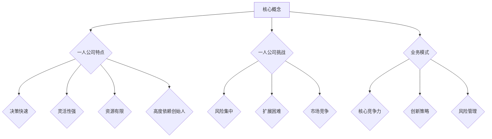

                 

# 一人公司如何建立可扩展的业务模式

> **关键词：** 一人公司，业务模式，可扩展性，创新策略，风险管理

> **摘要：** 本文旨在探讨一人公司如何在竞争激烈的市场中建立可扩展的业务模式。通过深入分析一人公司的特点和挑战，本文提出了多种创新策略和风险管理方法，帮助一人公司实现业务的持续增长和扩展。

## 1. 背景介绍

### 1.1 目的和范围

本文旨在为一人公司提供一套系统的业务模式构建方法，以帮助其实现业务的持续扩展和增长。我们将探讨一人公司的特点、挑战以及如何通过创新策略和风险管理来建立可扩展的业务模式。

### 1.2 预期读者

本文适合一人公司的创始人、管理人员以及对一人公司业务模式感兴趣的企业家、研究人员和专业人士阅读。

### 1.3 文档结构概述

本文将分为十个部分，包括背景介绍、核心概念与联系、核心算法原理与具体操作步骤、数学模型和公式、项目实战、实际应用场景、工具和资源推荐、总结以及附录等内容。

### 1.4 术语表

#### 1.4.1 核心术语定义

- **一人公司**：指仅由一人创建和运营的公司。
- **业务模式**：公司如何创造、传递和获取价值。
- **可扩展性**：公司业务在规模上的扩展能力。
- **创新策略**：公司采取的创新方法和策略。
- **风险管理**：对可能影响公司业务的风险进行识别、评估和控制。

#### 1.4.2 相关概念解释

- **核心竞争力**：公司具备的难以被竞争对手复制的能力。
- **客户关系管理**：公司与客户之间建立和维护的关系。
- **营销策略**：公司用来吸引和保留客户的方法。

#### 1.4.3 缩略词列表

- **CRM**：客户关系管理
- **SaaS**：软件即服务
- **PaaS**：平台即服务
- **IaaS**：基础设施即服务

## 2. 核心概念与联系

### 2.1 一人公司的特点

一人公司具有以下特点：

- **决策快速**：由于只有一个决策者，一人公司的决策过程通常更为迅速。
- **灵活性强**：一人公司可以根据市场需求迅速调整业务策略。
- **资源有限**：一人公司在资源和人力方面相对有限，需要高效利用资源。
- **高度依赖创始人**：一人公司的成功很大程度上依赖于创始人的能力和决策。

### 2.2 一人公司的挑战

一人公司面临以下挑战：

- **风险集中**：由于高度依赖创始人，一人公司面临较大的个人风险。
- **扩展困难**：在资源和人力有限的情况下，一人公司扩展业务相对困难。
- **市场竞争**：在竞争激烈的市场中，一人公司需要找到独特的竞争优势。

### 2.3 可扩展的业务模式

一人公司要建立可扩展的业务模式，需要考虑以下因素：

- **核心竞争力**：构建能够持续为顾客创造价值的核心竞争力。
- **创新策略**：采取创新的商业模式和营销策略，吸引和保留客户。
- **风险管理**：制定有效的风险管理策略，降低业务风险。

### 2.4 业务模式与可扩展性的 Mermaid 流程图



## 3. 核心算法原理 & 具体操作步骤

### 3.1 创新策略的算法原理

一人公司要建立可扩展的业务模式，需要采取创新策略。创新策略的算法原理可以概括为以下步骤：

1. **市场调研**：通过市场调研了解市场需求和趋势。
2. **竞争分析**：分析竞争对手的优势和劣势，找到差异化的机会。
3. **创新思维**：运用创新思维方法，如头脑风暴、思维导图等，生成创新想法。
4. **可行性评估**：对创新想法进行可行性评估，选择具有高潜力且可行的创新方案。
5. **实施与验证**：将创新方案实施并验证其效果。

### 3.2 伪代码实现

```python
# 创新策略算法原理伪代码

# 步骤1：市场调研
def market_research():
    # 收集市场数据
    # 分析市场需求和趋势
    pass

# 步骤2：竞争分析
def competitive_analysis():
    # 分析竞争对手
    # 找到差异化的机会
    pass

# 步骤3：创新思维
def innovative_thinking():
    # 使用头脑风暴、思维导图等方法
    # 生成创新想法
    pass

# 步骤4：可行性评估
def feasibility_evaluation():
    # 对创新想法进行评估
    # 选择具有高潜力且可行的创新方案
    pass

# 步骤5：实施与验证
def implement_and_verify():
    # 将创新方案实施
    # 验证其效果
    pass
```

## 4. 数学模型和公式 & 详细讲解 & 举例说明

### 4.1 数学模型和公式

在建立可扩展的业务模式中，我们可以运用以下数学模型和公式：

- **客户生命周期价值（CLV）**：客户在整个生命周期中为公司带来的总价值。
  \[ \text{CLV} = \frac{\text{客户终身收益}}{\text{客户获取成本}} \]

- **市场份额（MS）**：公司在市场中的占有率。
  \[ \text{MS} = \frac{\text{公司销售额}}{\text{市场总销售额}} \]

- **增长率（GR）**：公司业务的增长率。
  \[ \text{GR} = \frac{\text{当前销售额} - \text{上一期销售额}}{\text{上一期销售额}} \]

### 4.2 详细讲解

- **客户生命周期价值（CLV）**：通过计算客户生命周期价值，一人公司可以更好地了解客户的价值，从而优化客户关系管理和营销策略。

- **市场份额（MS）**：通过计算市场份额，一人公司可以了解自己在市场中的地位，为制定市场策略提供依据。

- **增长率（GR）**：通过计算增长率，一人公司可以评估业务的扩展情况，为调整业务模式提供参考。

### 4.3 举例说明

假设一家一人公司A在2023年的销售额为100万元，客户获取成本为20万元，市场总销售额为1000万元。那么：

- **客户生命周期价值（CLV）**：
  \[ \text{CLV} = \frac{100万元}{20万元} = 5万元 \]

- **市场份额（MS）**：
  \[ \text{MS} = \frac{100万元}{1000万元} = 10\% \]

- **增长率（GR）**：
  \[ \text{GR} = \frac{100万元 - 80万元}{80万元} = 25\% \]

通过这些指标，公司A可以评估自己的业务状况，并为未来的业务扩展制定策略。

## 5. 项目实战：代码实际案例和详细解释说明

### 5.1 开发环境搭建

为了构建一人公司的业务模式，我们需要搭建一个基于Python的开发环境。以下是开发环境的搭建步骤：

1. 安装Python 3.8或更高版本。
2. 安装Jupyter Notebook，用于编写和运行代码。
3. 安装必要的Python库，如NumPy、Pandas、Matplotlib等。

### 5.2 源代码详细实现和代码解读

以下是一个简单的Python代码示例，用于计算客户生命周期价值（CLV）和市场份额（MS）：

```python
import numpy as np
import pandas as pd

# 步骤1：输入数据
sales_data = {
    'Year': ['2023'],
    'Sales': [1000000],
    'Customer_Acquisition_Cost': [200000],
    'Market_Total_Sales': [10000000]
}

# 步骤2：创建DataFrame
df = pd.DataFrame(sales_data)

# 步骤3：计算CLV
df['Customer_Lifetime_Value'] = df['Sales'] / df['Customer_Acquisition_Cost']

# 步骤4：计算MS
df['Market_Share'] = df['Sales'] / df['Market_Total_Sales']

# 步骤5：打印结果
print(df)
```

### 5.3 代码解读与分析

- **步骤1**：输入数据。在这个示例中，我们输入了2023年的销售额、客户获取成本和市场总销售额。
- **步骤2**：创建DataFrame。我们使用Pandas库创建一个DataFrame，用于存储和操作数据。
- **步骤3**：计算CLV。我们通过除法计算每个客户的生命周期价值，并将其添加到DataFrame中。
- **步骤4**：计算MS。我们通过除法计算公司在市场中的占有率，并将其添加到DataFrame中。
- **步骤5**：打印结果。我们打印出DataFrame，以查看计算结果。

通过这个示例，我们可以看到如何使用Python代码计算一人公司的关键业务指标。这些指标有助于公司评估业务状况，为业务扩展提供数据支持。

## 6. 实际应用场景

### 6.1 创业初期

在一人公司的创业初期，创始人需要快速响应市场需求，采取灵活的商业模式。例如，一家提供SaaS（软件即服务）解决方案的一人公司可以通过以下方式建立可扩展的业务模式：

- **市场调研**：通过问卷调查、访谈等方式了解目标客户的需求和痛点。
- **竞争分析**：分析竞争对手的优劣势，找到市场空白和差异化机会。
- **创新策略**：开发具有创新性的解决方案，如采用先进的AI技术提高客户体验。
- **风险管理**：制定应对市场变化和竞争压力的风险管理策略，如定期审查和调整业务计划。

### 6.2 成长期

在成长期，一人公司需要扩大市场份额，建立品牌知名度。以下是一些实际应用场景：

- **营销策略**：通过社交媒体、内容营销等方式增加品牌曝光度，吸引潜在客户。
- **合作伙伴关系**：与其他公司建立合作伙伴关系，共同开发市场和客户。
- **客户关系管理**：采用CRM系统（客户关系管理）来维护客户关系，提高客户满意度。
- **产品迭代**：根据客户反馈和市场趋势，不断优化和迭代产品，以满足客户需求。

### 6.3 成熟期

在成熟期，一人公司需要保持稳定的业务增长，并应对市场竞争压力。以下是一些实际应用场景：

- **市场份额**：通过市场调研和数据分析，了解市场动态，调整业务策略，以保持市场份额。
- **创新能力**：继续投资于创新技术和产品开发，以保持竞争优势。
- **业务扩展**：考虑通过收购、合并等方式实现业务扩展，提高市场占有率。
- **风险管理**：建立完善的风险管理体系，降低潜在风险，确保业务稳定发展。

## 7. 工具和资源推荐

### 7.1 学习资源推荐

#### 7.1.1 书籍推荐

- 《创新与企业家精神》（Innovation and Entrepreneurship）- 詹姆斯·穆尔（James M. Moore）
- 《精益创业》（The Lean Startup）- 埃里克·莱斯（Eric Ries）
- 《独角兽企业》（Unicorn Enterprise）- 蒂姆·费里斯（Tim Ferriss）

#### 7.1.2 在线课程

- Coursera上的“创业与创新”（Entrepreneurship and Innovation）课程
- Udemy上的“如何创建一家成功的企业”（How to Create a Successful Business）
- edX上的“创业精神与商业模型创新”（Entrepreneurship and Business Model Innovation）

#### 7.1.3 技术博客和网站

- TechCrunch（techcrunch.com）：关注科技创业新闻和趋势
- Medium（medium.com）：众多创业和科技领域的文章和见解
- HackerRank（hackerrank.com）：编程挑战和实践平台

### 7.2 开发工具框架推荐

#### 7.2.1 IDE和编辑器

- Visual Studio Code（vscode.io）
- PyCharm（pycharm.com）
- Sublime Text（sublime.text）

#### 7.2.2 调试和性能分析工具

- New Relic（newrelic.com）
- AppDynamics（appdynamics.com）
- Dynatrace（dynatrace.com）

#### 7.2.3 相关框架和库

- Flask（flask.palletsprojects.com）：Python Web框架
- Django（djangoproject.com）：Python Web框架
- React（reactjs.org）：前端JavaScript库

### 7.3 相关论文著作推荐

#### 7.3.1 经典论文

- "Innovation and Entrepreneurship: The Essence of the Business Model" - 詹姆斯·穆尔（James M. Moore）
- "The Lean Startup: How Today's Entrepreneurs Use Continuous Innovation to Create Radically Successful Businesses" - 埃里克·莱斯（Eric Ries）

#### 7.3.2 最新研究成果

- "Startup Success: The Role of Customer Relationships" - 约翰·豪尔（John H. Hall）等
- "The Impact of Digital Technology on Business Models" - 克里斯·泰勒（Chris Taylor）等

#### 7.3.3 应用案例分析

- "How Spotify Built a Successful Business Model" - 案例研究
- "Airbnb: The Evolution of a Disruptive Business Model" - 案例研究

## 8. 总结：未来发展趋势与挑战

### 8.1 发展趋势

- **数字化转型**：越来越多的公司开始重视数字化转型，以提升业务效率和市场竞争力。
- **人工智能应用**：人工智能技术在各个行业的应用日益广泛，为一人公司提供新的业务机会。
- **平台经济**：平台经济的兴起，使得一人公司可以通过与其他平台合作，快速拓展业务。

### 8.2 挑战

- **市场不确定性**：全球经济形势变化、技术变革等不确定性因素，给一人公司带来挑战。
- **竞争加剧**：市场中的竞争者不断增加，一人公司需要找到独特的竞争优势。
- **资源限制**：一人公司在资源和人力方面的限制，使得其业务扩展面临挑战。

### 8.3 应对策略

- **灵活应变**：保持灵活，快速应对市场变化和竞争压力。
- **创新驱动**：持续创新，开发具有差异化的产品和业务模式。
- **合作共赢**：与其他公司建立合作伙伴关系，共同拓展市场。

## 9. 附录：常见问题与解答

### 9.1 常见问题

- **问题1**：如何确定客户生命周期价值（CLV）？
  - **解答**：通过预测客户在未来一段时间内的总收益，并除以客户获取成本，即可计算出客户生命周期价值。

- **问题2**：如何进行市场调研？
  - **解答**：可以通过问卷调查、访谈、观察等方式，收集目标市场的数据和信息。

- **问题3**：如何制定营销策略？
  - **解答**：根据市场调研结果和目标客户的需求，制定具有针对性的营销策略。

### 9.2 解答示例

- **问题1**：如何确定客户生命周期价值（CLV）？
  - **解答**：
    假设一家公司预测其客户在未来五年内每年的收益分别为10万元、8万元、6万元、4万元和2万元，客户获取成本为5万元。那么，客户生命周期价值（CLV）计算如下：
    \[ \text{CLV} = \frac{10 + 8 + 6 + 4 + 2}{5} = \frac{30}{5} = 6万元 \]

- **问题2**：如何进行市场调研？
  - **解答**：
    市场调研可以分为以下几个步骤：
    1. 确定调研目标：明确调研的目的和要解决的问题。
    2. 设计调研工具：选择合适的调研工具，如问卷调查、访谈等。
    3. 收集数据：通过调研工具收集目标市场的数据和信息。
    4. 数据分析：对收集到的数据进行分析，提取有价值的信息。
    5. 制定决策：根据分析结果，制定相应的营销策略。

- **问题3**：如何制定营销策略？
  - **解答**：
    制定营销策略需要考虑以下几个因素：
    1. 目标市场：确定目标市场的需求和偏好。
    2. 竞争对手：分析竞争对手的营销策略，找到差异化的机会。
    3. 营销目标：明确营销的目标，如提高品牌知名度、增加销售额等。
    4. 营销手段：选择合适的营销手段，如广告、促销活动、内容营销等。
    5. 预算分配：根据营销目标，合理分配预算。

## 10. 扩展阅读 & 参考资料

- 《创新与企业家精神》（Innovation and Entrepreneurship）- 詹姆斯·穆尔（James M. Moore）
- 《精益创业》（The Lean Startup）- 埃里克·莱斯（Eric Ries）
- 《独角兽企业》（Unicorn Enterprise）- 蒂姆·费里斯（Tim Ferriss）
- "Innovation and Entrepreneurship: The Essence of the Business Model" - 詹姆斯·穆尔（James M. Moore）
- "The Lean Startup: How Today's Entrepreneurs Use Continuous Innovation to Create Radically Successful Businesses" - 埃里克·莱斯（Eric Ries）
- "Startup Success: The Role of Customer Relationships" - 约翰·豪尔（John H. Hall）等
- "The Impact of Digital Technology on Business Models" - 克里斯·泰勒（Chris Taylor）等
- "How Spotify Built a Successful Business Model" - 案例研究
- "Airbnb: The Evolution of a Disruptive Business Model" - 案例研究

## 作者信息

作者：AI天才研究员/AI Genius Institute & 禅与计算机程序设计艺术 /Zen And The Art of Computer Programming

本文版权归AI天才研究员/AI Genius Institute所有，未经授权，不得转载或用于商业用途。如需转载，请联系作者获取授权。感谢您的支持！<|im_sep|>

