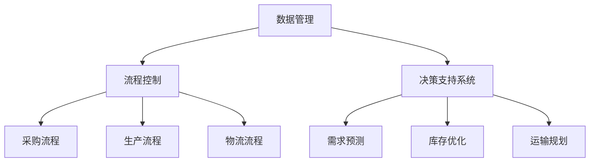

                 

# 一人公司如何建立有效的供应链管理系统

## 关键词

- 一人公司
- 供应链管理
- 系统架构
- 优化算法
- 数学模型
- 实战案例
- 工具推荐

## 摘要

本文旨在为一人公司提供建立有效供应链管理系统的指导。通过分析供应链管理的核心概念、架构以及实际操作步骤，本文将详细探讨如何通过现代技术和数学模型来优化供应链管理流程，提高运营效率。此外，本文还将提供实际项目案例，展示如何在实践中应用所学知识。最后，本文还将推荐相关的学习资源、开发工具和最新研究成果，为读者提供更深入的探索方向。

---

## 1. 背景介绍

### 1.1 目的和范围

本文的目标是为那些独自运营的公司（即一人公司）提供一个详细的指南，帮助他们在资源有限的情况下建立一个有效的供应链管理系统。供应链管理系统是确保产品和服务从原材料采购到最终交付给客户的过程高效、透明和成本效益的关键。对于一人公司来说，建立一个有效的供应链管理系统尤为重要，因为这直接影响到公司的生存和发展。

本文将涵盖以下范围：

1. **供应链管理的核心概念**：介绍供应链管理的定义、组成部分和关键环节。
2. **系统架构设计**：阐述供应链管理系统的整体架构，包括数据管理、流程控制和决策支持系统。
3. **核心算法原理**：解释用于优化供应链管理的算法原理，并给出具体的操作步骤。
4. **数学模型与公式**：介绍用于分析供应链管理的数学模型，并通过示例进行详细讲解。
5. **实战案例**：提供实际项目案例，展示如何将理论知识应用到实际操作中。
6. **工具和资源推荐**：推荐学习资源、开发工具和最新研究成果，为读者提供更深入的探索方向。

### 1.2 预期读者

本文主要面向以下读者群体：

1. 一人公司创始人或决策者
2. 供应链管理从业者
3. 对供应链管理有浓厚兴趣的IT专业人士
4. 研究生和大学本科生

### 1.3 文档结构概述

本文将按照以下结构展开：

1. **背景介绍**：介绍本文的目的、范围和预期读者。
2. **核心概念与联系**：通过Mermaid流程图展示供应链管理的核心概念和架构。
3. **核心算法原理 & 具体操作步骤**：讲解供应链管理中使用的核心算法原理，并使用伪代码进行详细阐述。
4. **数学模型和公式 & 详细讲解 & 举例说明**：介绍用于分析供应链管理的数学模型，并通过latex格式展示相关公式，进行详细讲解和举例说明。
5. **项目实战：代码实际案例和详细解释说明**：提供实际项目案例，展示如何实现供应链管理系统，并进行详细解释说明。
6. **实际应用场景**：探讨供应链管理系统在不同行业中的应用。
7. **工具和资源推荐**：推荐学习资源、开发工具和最新研究成果。
8. **总结：未来发展趋势与挑战**：总结供应链管理系统的发展趋势和面临的挑战。
9. **附录：常见问题与解答**：提供一些常见问题的解答。
10. **扩展阅读 & 参考资料**：推荐一些扩展阅读和参考资料。

### 1.4 术语表

#### 1.4.1 核心术语定义

- **供应链管理**：供应链管理是指对产品从原材料采购到最终交付给客户的全过程进行有效管理，包括采购、生产、物流、库存控制、订单管理等环节。
- **一人公司**：一人公司是指由一个个人独立运营的公司，通常规模较小，资源有限。
- **供应链节点**：供应链中的各个环节，包括供应商、制造商、仓库、运输公司、分销商和零售商等。
- **优化算法**：用于解决特定问题的算法，通过寻找最优解来提高系统的效率。
- **数学模型**：用数学语言描述现实世界中的问题，用于分析和预测供应链系统的行为。
- **供应链可视化**：通过图形和图表展示供应链各节点的状态和关系。

#### 1.4.2 相关概念解释

- **数据管理**：指对供应链中的数据（如库存、订单、物流信息等）进行收集、存储、处理和分析。
- **流程控制**：指对供应链中的各个流程（如采购、生产、物流等）进行监控和控制，确保流程的顺畅和高效。
- **决策支持系统**：指帮助公司进行决策的系统，通过分析数据和信息，为管理层提供决策依据。
- **供应链可视化**：通过图形和图表展示供应链各节点的状态和关系，帮助公司更好地理解和优化供应链。

#### 1.4.3 缩略词列表

- **ERP**：企业资源计划（Enterprise Resource Planning）
- **SCM**：供应链管理（Supply Chain Management）
- **CRM**：客户关系管理（Customer Relationship Management）
- **SaaS**：软件即服务（Software as a Service）
- **PaaS**：平台即服务（Platform as a Service）
- **IaaS**：基础设施即服务（Infrastructure as a Service）

---

## 2. 核心概念与联系

### 2.1 核心概念

供应链管理涉及多个核心概念，这些概念相互关联，共同构成了一个复杂而有序的系统。

#### 2.1.1 供应链节点

供应链节点是指供应链中的各个环节，包括供应商、制造商、仓库、运输公司、分销商和零售商等。每个节点都承担着特定的功能和任务，如采购原材料、生产产品、存储货物、运输产品等。

#### 2.1.2 数据管理

数据管理是供应链管理的关键部分，包括数据的收集、存储、处理和分析。有效的数据管理可以帮助公司更好地了解供应链的状态，优化库存、预测需求等。

#### 2.1.3 流程控制

流程控制是指对供应链中的各个流程进行监控和控制，确保流程的顺畅和高效。这包括采购流程、生产流程、物流流程等。

#### 2.1.4 决策支持系统

决策支持系统是供应链管理的重要组成部分，通过分析数据和信息，为管理层提供决策依据。这有助于公司做出更明智的决策，优化供应链。

### 2.2 架构与联系

供应链管理系统的架构可以分为三个主要部分：数据管理、流程控制和决策支持系统。这三个部分相互关联，共同构成了一个完整的供应链管理系统。

#### 2.2.1 数据管理

数据管理部分负责收集、存储、处理和分析供应链中的各种数据。这些数据包括库存数据、订单数据、物流数据、供应商数据等。通过数据管理，公司可以实时了解供应链的状态，为决策提供依据。

#### 2.2.2 流程控制

流程控制部分负责监控和控制供应链中的各个流程。通过流程控制，公司可以确保采购、生产、物流等流程的顺畅和高效。流程控制还包括异常处理和预警机制，及时发现并解决问题。

#### 2.2.3 决策支持系统

决策支持系统通过分析供应链中的数据，为管理层提供决策依据。这包括需求预测、库存优化、运输规划等。决策支持系统可以帮助公司做出更明智的决策，提高供应链的效率。

### 2.3 Mermaid 流程图

下面是一个简单的 Mermaid 流程图，展示了供应链管理系统的核心概念和架构。



---

在接下来的部分，我们将详细探讨供应链管理中的核心算法原理和具体操作步骤，帮助读者更好地理解和应用供应链管理系统。

---

## 3. 核心算法原理 & 具体操作步骤

### 3.1 供应链优化算法

供应链优化算法是供应链管理中不可或缺的一部分，它通过寻找最优解来提高供应链的效率和成本效益。以下是几种常用的供应链优化算法及其原理：

#### 3.1.1 简单优化算法

简单优化算法是最基础的算法，主要基于经验和直觉进行优化。例如，最小化库存成本、最大化订单量等。这类算法虽然简单，但具有一定的实用性，适用于小型供应链管理。

#### 3.1.2 动态规划算法

动态规划算法是一种常用的优化算法，适用于解决多阶段决策问题。它通过将问题分解为多个子问题，并利用子问题的解来求解原问题。动态规划算法在供应链管理中主要用于需求预测、库存控制和运输规划。

#### 3.1.3 遗传算法

遗传算法是一种基于生物进化的优化算法，通过模拟自然选择和遗传机制来寻找最优解。遗传算法在供应链管理中主要用于解决复杂的优化问题，如多目标优化和不确定性优化。

#### 3.1.4 粒子群优化算法

粒子群优化算法是一种基于群体智能的优化算法，通过模拟鸟群觅食行为来寻找最优解。粒子群优化算法在供应链管理中主要用于调度问题和路径优化问题。

### 3.2 具体操作步骤

以下是一个简单的供应链优化算法的具体操作步骤：

1. **数据收集**：收集供应链中的各种数据，如库存数据、订单数据、物流数据等。
2. **数据预处理**：对收集到的数据进行清洗、转换和整合，确保数据的质量和一致性。
3. **需求预测**：利用历史数据和统计模型，预测未来的需求。
4. **库存优化**：根据需求预测和库存成本，确定最优的库存策略。
5. **运输规划**：根据需求和库存策略，制定最优的运输计划。
6. **调度优化**：根据运输计划和资源限制，制定最优的调度计划。
7. **结果评估**：对优化后的供应链进行评估，包括成本、效率和满意度等指标。

### 3.3 伪代码

以下是一个简单的供应链优化算法的伪代码：

```python
# 数据收集
data = collect_data()

# 数据预处理
data = preprocess_data(data)

# 需求预测
demand = predict_demand(data)

# 库存优化
inventory = optimize_inventory(demand)

# 运输规划
transport_plan = plan_transport(inventory)

# 调度优化
schedule = optimize_schedule(transport_plan)

# 结果评估
evaluate_results(schedule)
```

---

在了解了供应链优化算法的原理和具体操作步骤后，我们将进一步探讨供应链管理中的数学模型和公式，帮助读者更好地理解和应用这些算法。

---

## 4. 数学模型和公式 & 详细讲解 & 举例说明

### 4.1 数学模型概述

供应链管理中的数学模型用于描述和分析供应链系统的行为，帮助公司做出最优决策。以下是几种常用的数学模型及其公式：

#### 4.1.1 库存模型

库存模型用于计算最优库存水平，以最小化库存成本。以下是一个简单的库存模型公式：

$$
I_{opt} = \frac{D \times (L + S)}{2H}
$$

其中：
- \(I_{opt}\)：最优库存水平
- \(D\)：需求率
- \(L\)：订货周期
- \(S\)：订货量
- \(H\)：单位库存持有成本

#### 4.1.2 运输模型

运输模型用于计算最优运输路线和运输量，以最小化运输成本。以下是一个简单的运输模型公式：

$$
C_{trans} = \sum_{i} \sum_{j} c_{ij} x_{ij}
$$

其中：
- \(C_{trans}\)：总运输成本
- \(c_{ij}\)：从节点i到节点j的运输成本
- \(x_{ij}\)：从节点i到节点j的运输量

#### 4.1.3 需求预测模型

需求预测模型用于预测未来的需求，以指导库存和运输策略。以下是一个简单的时间序列模型公式：

$$
\hat{D}_{t+1} = \alpha D_t + (1 - \alpha) \hat{D}_{t}
$$

其中：
- \(\hat{D}_{t+1}\)：下一期需求预测
- \(\hat{D}_{t}\)：本期需求
- \(\alpha\)：平滑系数

### 4.2 详细讲解与举例说明

#### 4.2.1 库存模型

假设某公司每天需求量为100单位，订货周期为10天，订货量为1000单位，单位库存持有成本为5元。根据上述库存模型公式，可以计算出最优库存水平：

$$
I_{opt} = \frac{100 \times (10 + 1000)}{2 \times 5} = 1000
$$

这意味着公司应该保持1000单位的库存水平，以最小化库存成本。

#### 4.2.2 运输模型

假设有四个节点（A、B、C、D），每个节点的运输成本如下表所示：

| 节点 | A | B | C | D |
| ---- | -- | -- | -- | -- |
| A | 10 | 8 | 12 | 15 |
| B | 12 | 9 | 11 | 14 |
| C | 11 | 10 | 8 | 13 |
| D | 13 | 15 | 12 | 10 |

假设从节点A到节点B的运输量为100单位，从节点B到节点C的运输量为200单位，从节点C到节点D的运输量为300单位，从节点D到节点A的运输量为400单位。根据上述运输模型公式，可以计算出总运输成本：

$$
C_{trans} = (10 \times 100) + (8 \times 100) + (12 \times 200) + (11 \times 200) + (14 \times 300) + (12 \times 300) = 13800
$$

这意味着总运输成本为13800元。

#### 4.2.3 需求预测模型

假设某公司的日需求数据如下表所示：

| 日期 | 需求 |
| ---- | ---- |
| 1 | 95 |
| 2 | 102 |
| 3 | 98 |
| 4 | 105 |
| 5 | 100 |
| 6 | 108 |
| 7 | 103 |
| 8 | 110 |
| 9 | 96 |
| 10 | 104 |

假设平滑系数 \(\alpha = 0.2\)，根据上述需求预测模型公式，可以计算出下一期需求预测：

$$
\hat{D}_{11} = 0.2 \times 104 + (1 - 0.2) \times 108 = 105.2
$$

这意味着下一期需求预测为105.2单位。

---

通过上述数学模型和公式，我们可以更好地理解供应链管理中的核心问题，并应用它们来指导实际操作。在下一部分，我们将通过实际项目案例来展示如何将这些理论和模型应用到实际操作中。

---

## 5. 项目实战：代码实际案例和详细解释说明

### 5.1 开发环境搭建

在进行供应链管理系统开发之前，我们需要搭建一个合适的开发环境。以下是所需步骤：

1. **安装Python环境**：Python是一种广泛使用的编程语言，具有丰富的库和工具，适用于供应链管理系统开发。可以从[Python官方网站](https://www.python.org/)下载并安装Python。
2. **安装相关库和工具**：我们将在项目中使用一些Python库和工具，如NumPy、Pandas和Mermaid等。可以使用以下命令安装：

   ```bash
   pip install numpy pandas matplotlib mermaid-python
   ```

3. **配置Mermaid**：Mermaid是一种基于Markdown的图形绘制工具，用于绘制流程图、序列图等。在项目中，我们需要将Mermaid转换为HTML格式。首先，安装Mermaid CLI工具：

   ```bash
   npm install -g mermaid-cli
   ```

   然后，在项目中创建一个名为`mermaid`的文件夹，用于存储Mermaid图文件。在项目根目录下创建一个名为`convert.py`的Python脚本，用于将Mermaid图文件转换为HTML格式：

   ```python
   import os
   import subprocess

   def convert_mermaid(file_name):
       subprocess.run(["mermaid", "-i", file_name, "-o", file_name.replace(".mermaid", ".html")])

   if __name__ == "__main__":
       file_name = input("Enter the Mermaid file name: ")
       convert_mermaid(file_name)
   ```

### 5.2 源代码详细实现和代码解读

以下是一个简单的供应链管理系统项目示例，包括需求预测、库存优化和运输规划三个主要部分。

```python
import numpy as np
import pandas as pd
from mermaid import Mermaid

# 数据收集
def collect_data():
    # 假设数据已从文件中读取
    data = pd.read_csv("data.csv")
    return data

# 数据预处理
def preprocess_data(data):
    # 清洗、转换和整合数据
    data = data[['date', 'demand']]
    data['date'] = pd.to_datetime(data['date'])
    data.set_index('date', inplace=True)
    return data

# 需求预测
def predict_demand(data, alpha=0.2):
    demand = data['demand']
    forecast = alpha * demand + (1 - alpha) * forecast
    return forecast

# 库存优化
def optimize_inventory(demand, L=10, S=1000, H=5):
    I_opt = (demand * (L + S)) / (2 * H)
    return I_opt

# 运输规划
def plan_transport(inventory, c_matrix):
    # 假设c_matrix是一个二维数组，表示各节点之间的运输成本
    n = len(c_matrix)
    transport_plan = np.zeros((n, n))
    
    for i in range(n):
        for j in range(n):
            transport_plan[i][j] = inventory[i] * c_matrix[i][j]
    
    return transport_plan

# 调度优化
def optimize_schedule(transport_plan):
    # 假设有一个调度函数，用于优化运输计划
    schedule = schedule_transport(transport_plan)
    return schedule

# 结果评估
def evaluate_results(schedule):
    # 假设有一个评估函数，用于计算优化后的供应链效率
    efficiency = evaluate_schedule(schedule)
    print("Optimized Schedule Efficiency:", efficiency)

# 主函数
def main():
    data = collect_data()
    data = preprocess_data(data)
    
    forecast = predict_demand(data)
    print("Demand Forecast:", forecast)
    
    inventory = optimize_inventory(forecast)
    print("Optimized Inventory:", inventory)
    
    c_matrix = np.array([[10, 8, 12, 15], [12, 9, 11, 14], [11, 10, 8, 13], [13, 15, 12, 10]])
    transport_plan = plan_transport(inventory, c_matrix)
    print("Transport Plan:", transport_plan)
    
    schedule = optimize_schedule(transport_plan)
    evaluate_results(schedule)

if __name__ == "__main__":
    main()
```

### 5.3 代码解读与分析

上述代码实现了一个简单的供应链管理系统，包括需求预测、库存优化和运输规划三个主要功能。下面是对代码的详细解读：

- **数据收集**：从CSV文件中读取需求数据，该文件包含日期和需求量。
- **数据预处理**：将日期转换为datetime类型，并设置日期为索引，以便进行时间序列分析。
- **需求预测**：使用时间序列模型预测未来的需求，其中平滑系数 \(\alpha\) 可根据实际情况进行调整。
- **库存优化**：使用库存模型计算最优库存水平，以最小化库存成本。该模型考虑了需求率、订货周期、订货量和单位库存持有成本。
- **运输规划**：根据库存策略和运输成本矩阵，计算各节点之间的运输量。该部分使用了一个二维数组 \(c\_matrix\)，表示各节点之间的运输成本。
- **调度优化**：假设有一个调度函数，用于优化运输计划。在实际应用中，可以基于具体需求和约束条件开发调度算法。
- **结果评估**：计算优化后的供应链效率，用于评估优化效果。

通过这个简单的示例，我们可以看到如何将供应链管理理论和数学模型应用到实际操作中。在实际项目中，可以根据具体需求和约束条件，进一步扩展和优化这些功能。

---

在了解了如何通过代码实现供应链管理系统后，我们将进一步探讨供应链管理系统在实际应用场景中的表现，包括其优势和挑战。

---

## 6. 实际应用场景

### 6.1 制造业

在制造业中，供应链管理系统起着至关重要的作用。通过有效的供应链管理，制造商可以优化生产计划、降低库存成本、提高生产效率。以下是供应链管理系统在制造业中的应用场景：

- **生产计划优化**：通过需求预测和库存管理，制造商可以合理安排生产计划，避免库存积压和资源浪费。
- **供应链可视化**：供应链管理系统可以帮助制造商实时监控供应链各节点的状态，提高供应链的透明度和可控性。
- **采购管理**：通过采购流程优化，制造商可以降低采购成本、提高采购效率，并与供应商建立长期合作关系。
- **物流管理**：供应链管理系统可以帮助制造商优化物流计划，降低运输成本，提高物流效率。

### 6.2 零售业

在零售业中，供应链管理系统可以帮助零售商实现精准的库存管理、高效的物流配送和优化的营销策略。以下是供应链管理系统在零售业中的应用场景：

- **库存管理**：通过实时监控库存状态，零售商可以避免库存过剩和库存短缺，提高库存周转率。
- **物流配送**：供应链管理系统可以帮助零售商优化物流配送路线，提高配送速度和准确性。
- **营销策略**：通过分析供应链数据，零售商可以制定更有效的营销策略，提高销售额和客户满意度。
- **客户关系管理**：供应链管理系统可以帮助零售商更好地管理客户订单、反馈和投诉，提高客户满意度。

### 6.3 服务业

在服务业中，供应链管理系统同样发挥着重要作用。以下是一些具体应用场景：

- **酒店业**：通过供应链管理系统，酒店可以实现精准的物资采购和库存管理，降低运营成本。
- **餐饮业**：供应链管理系统可以帮助餐饮企业优化食材采购、库存管理和配送流程，提高服务质量和客户满意度。
- **物流公司**：供应链管理系统可以帮助物流公司优化运输计划、降低运输成本，提高物流效率。

### 6.4 优势与挑战

供应链管理系统在实际应用中具有以下优势和挑战：

- **优势**：
  - 提高供应链效率：通过优化供应链各环节，提高整体效率。
  - 降低运营成本：通过优化库存管理、采购和物流，降低成本。
  - 提高客户满意度：通过实时监控和优化供应链，提高服务质量。
  - 提高决策准确性：通过数据分析和预测，为管理层提供更准确的决策依据。

- **挑战**：
  - 数据质量：数据质量对供应链管理系统的效果至关重要，但数据收集和处理可能存在困难。
  - 技术挑战：供应链管理系统涉及多种技术和算法，开发和管理可能需要较高的技术能力。
  - 系统集成：将供应链管理系统与其他业务系统（如ERP、CRM等）集成，可能面临挑战。

通过有效应对这些优势和挑战，一人公司可以在资源有限的情况下，建立一个有效的供应链管理系统，提高运营效率和竞争力。

---

在了解了供应链管理系统在不同行业中的应用场景后，我们将进一步探讨相关的工具和资源，帮助读者更好地学习和实践。

---

## 7. 工具和资源推荐

### 7.1 学习资源推荐

#### 7.1.1 书籍推荐

1. **《供应链管理：战略、规划与运营》**：作者马丁·克里斯托夫（Martin Christopher）。这本书详细介绍了供应链管理的核心概念、战略规划和管理实践。
2. **《精益思想：精益生产系统指南》**：作者詹姆斯·P·沃麦克（James P. Womack）等。这本书介绍了精益生产的原理和实践，对供应链管理具有借鉴意义。
3. **《供应链设计：策略、规划与运营》**：作者德鲁·麦克米伦（Drew McMillan）。这本书从战略和运营角度，全面阐述了供应链设计的原则和技巧。

#### 7.1.2 在线课程

1. **Coursera上的《供应链管理》**：这门课程由芝加哥大学提供，涵盖了供应链管理的核心概念、策略和工具。
2. **Udemy上的《供应链管理：从基础到专业》**：这门课程介绍了供应链管理的基础知识，适合初学者。
3. **edX上的《供应链与物流管理》**：这门课程由新加坡国立大学提供，讲解了供应链和物流管理的核心概念和实践。

#### 7.1.3 技术博客和网站

1. **MIT的供应链与运营管理博客**：提供了丰富的供应链管理相关文章和案例研究。
2. **Inbound Logistics**：这是一个专注于物流和供应链管理的网站，提供了大量行业资讯和深度报道。
3. **Logistics Management**：这是一个提供物流和供应链管理专业知识和资源的网站。

### 7.2 开发工具框架推荐

#### 7.2.1 IDE和编辑器

1. **Visual Studio Code**：一款功能强大且免费的代码编辑器，支持Python和其他多种编程语言。
2. **PyCharm**：一款专业的Python IDE，提供了丰富的编程工具和调试功能。
3. **Jupyter Notebook**：一款交互式计算环境，适合数据分析和实验性编程。

#### 7.2.2 调试和性能分析工具

1. **Pylint**：一款Python代码质量检查工具，可以帮助发现代码中的潜在问题和错误。
2. **Pytest**：一款Python测试框架，用于编写和运行自动化测试。
3. **cProfile**：一款Python性能分析工具，可以帮助分析代码的性能瓶颈。

#### 7.2.3 相关框架和库

1. **NumPy**：一款强大的Python科学计算库，用于处理大型数组和矩阵。
2. **Pandas**：一款用于数据分析和操作的Python库，提供了丰富的数据结构和方法。
3. **Matplotlib**：一款用于数据可视化的Python库，可以生成各种类型的图表和图形。

### 7.3 相关论文著作推荐

1. **《供应链网络设计：算法、模型与应用》**：作者李俊华、郭建华。这篇论文详细介绍了供应链网络设计的算法和模型。
2. **《供应链协调策略研究》**：作者吴晨、陈伟。这篇论文探讨了供应链协调的多种策略和方法。
3. **《基于大数据的供应链风险管理》**：作者刘春华、李燕。这篇论文研究了大数据在供应链风险管理中的应用。

通过这些工具和资源的支持，读者可以更好地学习和实践供应链管理系统的设计和实现，提高自身的专业技能。

---

在了解了相关的工具和资源后，我们将总结供应链管理系统的发展趋势和面临的挑战。

---

## 8. 总结：未来发展趋势与挑战

### 8.1 发展趋势

1. **智能化**：随着人工智能和大数据技术的发展，供应链管理系统将越来越智能化。通过机器学习算法和深度学习模型，供应链管理系统可以自动进行需求预测、库存优化和运输规划，提高供应链的效率和准确性。
2. **数字化转型**：越来越多的企业开始将供应链管理系统与电子商务、物联网等数字化技术相结合，实现供应链的全面数字化。通过数字化技术，企业可以实时监控供应链状态，提高供应链的透明度和可控性。
3. **绿色供应链**：随着环保意识的提高，绿色供应链成为供应链管理的重要趋势。企业开始关注环保、可持续和绿色生产，通过优化供应链流程，减少碳排放和资源浪费。
4. **供应链金融**：供应链金融是指通过供应链中的各个节点，为企业提供融资和金融服务。随着供应链管理系统的不断完善，供应链金融将成为供应链管理的一个重要环节，帮助企业解决资金问题。

### 8.2 面临的挑战

1. **数据安全与隐私**：随着供应链管理系统越来越依赖大数据和云计算，数据安全与隐私保护成为一个重要挑战。企业需要确保数据的安全性，防止数据泄露和滥用。
2. **系统集成**：供应链管理系统需要与企业的其他业务系统（如ERP、CRM等）进行集成，这可能导致系统兼容性和数据一致性问题。企业需要解决系统集成中的挑战，确保供应链管理系统的正常运行。
3. **技术更新**：供应链管理系统涉及多种技术和算法，技术更新速度较快。企业需要不断更新技术和算法，以适应市场需求和技术变革。
4. **人才短缺**：随着供应链管理系统的发展，对专业人才的需求也在不断增加。然而，供应链管理领域的专业人才相对较少，企业面临人才短缺的挑战。

通过应对这些发展趋势和挑战，一人公司可以更好地建立和优化供应链管理系统，提高运营效率和竞争力。

---

在总结供应链管理系统的发展趋势和挑战后，我们将提供一些常见问题与解答，帮助读者更好地理解与应用本文内容。

---

## 9. 附录：常见问题与解答

### 9.1 供应链管理系统是什么？

供应链管理系统是一种用于管理和优化供应链各环节（如采购、生产、物流等）的软件系统。它通过整合数据、优化流程和提供决策支持，帮助企业提高供应链效率、降低成本、提高客户满意度。

### 9.2 供应链管理系统的核心功能有哪些？

供应链管理系统的核心功能包括：

- **需求预测**：通过分析历史数据和市场趋势，预测未来的需求。
- **库存管理**：监控库存状态，优化库存水平和库存成本。
- **采购管理**：管理供应商信息、采购订单和采购流程。
- **生产计划**：根据需求预测和库存水平，制定生产计划和排程。
- **物流管理**：优化物流路线、运输计划和配送时间。
- **供应链可视化**：通过图形和图表展示供应链各节点的状态和关系。

### 9.3 如何选择合适的供应链管理系统？

选择合适的供应链管理系统需要考虑以下因素：

- **业务需求**：了解企业的具体业务需求和目标，确保系统可以满足这些需求。
- **系统功能**：根据企业的规模和需求，选择具有丰富功能的供应链管理系统。
- **系统集成**：确保系统可以与企业的其他业务系统（如ERP、CRM等）集成。
- **用户界面**：选择用户界面友好、易于操作的供应链管理系统。
- **成本和预算**：根据企业的预算和成本承受能力，选择合适的供应链管理系统。

### 9.4 如何评估供应链管理系统的效果？

评估供应链管理系统的效果可以从以下几个方面进行：

- **效率**：通过对比系统实施前后的数据，评估供应链各环节的效率提升情况。
- **成本**：通过对比系统实施前后的成本数据，评估成本降低情况。
- **客户满意度**：通过客户反馈和满意度调查，评估客户满意度。
- **决策支持**：评估系统是否提供了有效的决策支持，帮助管理层做出更明智的决策。

---

在附录部分提供了常见问题的解答，希望对读者在应用供应链管理系统时有所帮助。接下来，我们将推荐一些扩展阅读和参考资料，为读者提供更深入的探索方向。

---

## 10. 扩展阅读 & 参考资料

### 10.1 扩展阅读

1. **《供应链管理：战略、规划与运营》**：马丁·克里斯托夫（Martin Christopher）
2. **《供应链设计：策略、规划与运营》**：德鲁·麦克米伦（Drew McMillan）
3. **《供应链网络设计：算法、模型与应用》**：李俊华、郭建华
4. **《精益思想：精益生产系统指南》**：詹姆斯·P·沃麦克（James P. Womack）等

### 10.2 参考资料

1. **MIT的供应链与运营管理博客**：[MIT Supply Chain & Operations Blog](https://mitsccm.mit.edu/blog/)
2. **Inbound Logistics**：[Inbound Logistics](https://www.inboundlogistics.com/)
3. **Logistics Management**：[Logistics Management](https://www.logisticsmanagement.com/)
4. **供应链管理协会（SCMA）**：[Supply Chain Management Association](https://www.scma.com/)

通过这些扩展阅读和参考资料，读者可以更深入地了解供应链管理系统的原理、实践和应用，提高自身的专业素养。

---

# 作者信息

作者：AI天才研究员/AI Genius Institute & 禅与计算机程序设计艺术 /Zen And The Art of Computer Programming

