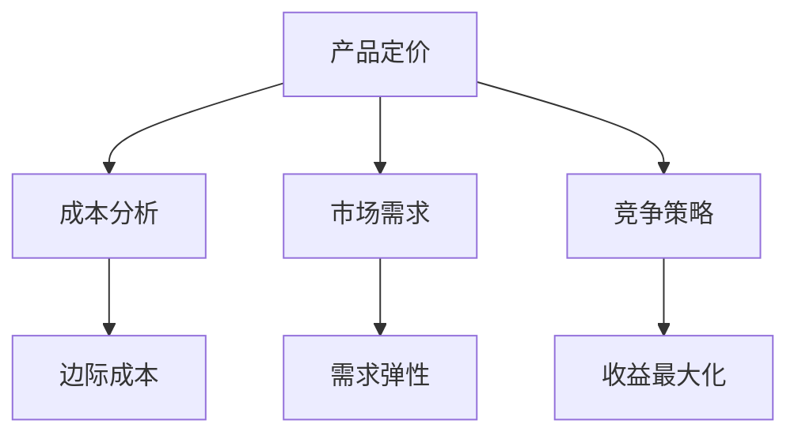

                 

# 一人公司的产品定价策略与动态调整

## 关键词
产品定价、动态调整、成本分析、市场需求、竞争策略、收益最大化

## 摘要
本文将深入探讨一人公司的产品定价策略，特别是在动态调整方面。我们将从成本分析、市场需求和竞争策略三个核心方面进行讨论，并结合实际案例，详细解释如何制定和优化产品价格，以实现收益最大化。通过本文的阅读，读者将了解产品定价的基本原理，掌握动态调整的策略，从而在激烈的市场竞争中立于不败之地。

## 1. 背景介绍

### 1.1 目的和范围
本文旨在帮助一人公司制定和优化其产品定价策略，以应对市场变化和竞争压力。我们将探讨成本分析、市场需求和竞争策略，结合具体案例，详细说明产品定价的动态调整方法。

### 1.2 预期读者
本文适合一人公司的创始人、产品经理、市场分析师以及任何对产品定价策略感兴趣的读者。无论您是初入行的从业者还是经验丰富的专业人士，本文都将为您带来有价值的见解。

### 1.3 文档结构概述
本文分为以下几个部分：

1. 背景介绍
2. 核心概念与联系
3. 核心算法原理 & 具体操作步骤
4. 数学模型和公式 & 详细讲解 & 举例说明
5. 项目实战：代码实际案例和详细解释说明
6. 实际应用场景
7. 工具和资源推荐
8. 总结：未来发展趋势与挑战
9. 附录：常见问题与解答
10. 扩展阅读 & 参考资料

### 1.4 术语表

#### 1.4.1 核心术语定义

- **产品定价**：制定产品价格的过程，旨在最大化公司收益。
- **成本分析**：分析产品生产和运营的成本。
- **市场需求**：消费者对产品需求的大小。
- **竞争策略**：企业在市场竞争中采取的策略。

#### 1.4.2 相关概念解释

- **边际成本**：生产额外一个产品所需的成本。
- **需求弹性**：消费者需求对价格变化的敏感程度。
- **收益最大化**：在特定条件下实现最大收益的目标。

#### 1.4.3 缩略词列表

- **MVP**：最小可行产品（Minimum Viable Product）
- **CPC**：成本价格分析（Cost Price Analysis）
- **PEST**：宏观环境分析（Pest Analysis）

## 2. 核心概念与联系

在讨论产品定价策略之前，我们需要理解几个核心概念。以下是这些概念的 Mermaid 流程图：



### 2.1 产品定价与成本分析

产品定价的核心之一是成本分析。成本分析包括固定成本和可变成本。固定成本是不随生产数量变化的成本，如租金和员工工资。可变成本是随生产数量变化的成本，如原材料和能源。通过边际成本分析，我们可以确定生产额外产品的成本，这有助于制定合理的价格策略。

### 2.2 产品定价与市场需求

市场需求是产品定价的另一个关键因素。需求弹性衡量消费者对价格变化的敏感程度。如果需求弹性较高，意味着价格的小幅变化可能导致需求显著变化。通过分析市场需求，我们可以确定最优定价策略。

### 2.3 产品定价与竞争策略

在竞争激烈的市场中，竞争策略至关重要。通过分析竞争对手的定价策略，我们可以确定自己的价格定位。同时，收益最大化是我们的目标，这意味着我们需要在成本和市场需求之间找到平衡点。

## 3. 核心算法原理 & 具体操作步骤

### 3.1 成本分析

成本分析是产品定价的基础。以下是成本分析的伪代码：

```pseudo
function costAnalysis(fixedCost, variableCost, productionQuantity):
    marginalCost = variableCost
    totalCost = fixedCost + (variableCost * productionQuantity)
    return totalCost, marginalCost
```

### 3.2 需求分析

需求分析基于需求弹性和市场价格。以下是需求分析的伪代码：

```pseudo
function demandAnalysis(price, elasticity, currentQuantity):
    changeInPrice = newPrice - price
    changeInQuantity = currentQuantity * elasticity * changeInPrice
    newQuantity = currentQuantity + changeInQuantity
    return newQuantity
```

### 3.3 竞争分析

竞争分析需要比较竞争对手的价格和市场份额。以下是竞争分析的伪代码：

```pseudo
function competitiveAnalysis(competitorPrice, competitorMarketShare, currentMarketShare):
    priceDifference = competitorPrice - currentPrice
    marketShareDifference = competitorMarketShare - currentMarketShare
    if marketShareDifference > 0:
        newPrice = currentPrice - (priceDifference * marketShareDifference)
    else:
        newPrice = currentPrice + (priceDifference * marketShareDifference)
    return newPrice
```

## 4. 数学模型和公式 & 详细讲解 & 举例说明

### 4.1 成本分析公式

成本分析的关键是边际成本。边际成本可以用以下公式表示：

$$ MC = \frac{dC}{dQ} $$

其中，\( MC \) 是边际成本，\( C \) 是总成本，\( Q \) 是生产数量。

### 4.2 需求分析公式

需求分析的关键是需求弹性。需求弹性可以用以下公式表示：

$$ Elasticity = \frac{\% \ Change \ in \ Quantity}{\% \ Change \ in \ Price} $$

其中，\( Elasticity \) 是需求弹性，\( \% \ Change \ in \ Quantity \) 是需求量的百分比变化，\( \% \ Change \ in \ Price \) 是价格的百分比变化。

### 4.3 竞争分析公式

竞争分析的关键是市场份额和价格差异。竞争分析可以用以下公式表示：

$$ New \ Price = Current \ Price \pm (Price \ Difference \ * \ Market \ Share \ Difference) $$

其中，\( New \ Price \) 是新价格，\( Current \ Price \) 是当前价格，\( Price \ Difference \) 是价格差异，\( Market \ Share \ Difference \) 是市场份额差异。

### 4.4 举例说明

假设一家一人公司的产品成本为 \( $100 \)（固定成本 \( $50 \)，可变成本 \( $50 \)），市场需求弹性为 \( 2 \)，竞争对手的价格为 \( $150 \)，公司的市场份额为 \( 20\% \)。

首先，计算边际成本：

$$ MC = \frac{dC}{dQ} = \frac{50 + 50Q}{Q} = 100 $$

接下来，计算需求量：

$$ Elasticity = \frac{\% \ Change \ in \ Quantity}{\% \ Change \ in \ Price} = 2 $$

假设价格下降 \( 10\% \)，则需求量增加：

$$ \% \ Change \ in \ Quantity = 2 \times 10\% = 20\% $$

因此，新需求量为：

$$ New \ Quantity = Current \ Quantity + 20\% \ of \ Current \ Quantity $$

最后，计算竞争分析的新价格：

$$ New \ Price = Current \ Price - (Price \ Difference \ * \ Market \ Share \ Difference) = 150 - (150 - 100) \times 0.2 = 130 $$

因此，一人公司的新价格应为 \( $130 \)。

## 5. 项目实战：代码实际案例和详细解释说明

### 5.1 开发环境搭建

为了实现产品定价策略的代码实战，我们需要搭建一个简单的开发环境。以下是所需的软件和工具：

- Python（版本3.8及以上）
- Jupyter Notebook 或 PyCharm
- NumPy 库
- Matplotlib 库

首先，确保您的系统中已安装 Python 和所需的库。使用以下命令安装 NumPy 和 Matplotlib：

```bash
pip install numpy matplotlib
```

### 5.2 源代码详细实现和代码解读

以下是实现产品定价策略的 Python 代码。我们将使用伪代码中提到的公式和函数。

```python
import numpy as np
import matplotlib.pyplot as plt

# 成本分析函数
def cost_analysis(fixed_cost, variable_cost, production_quantity):
    marginal_cost = variable_cost
    total_cost = fixed_cost + (variable_cost * production_quantity)
    return total_cost, marginal_cost

# 需求分析函数
def demand_analysis(price, elasticity, current_quantity):
    change_in_price = price * elasticity
    change_in_quantity = current_quantity * change_in_price
    new_quantity = current_quantity + change_in_quantity
    return new_quantity

# 竞争分析函数
def competitive_analysis(competitor_price, competitor_market_share, current_market_share):
    price_difference = competitor_price - current_price
    market_share_difference = competitor_market_share - current_market_share
    if market_share_difference > 0:
        new_price = current_price - (price_difference * market_share_difference)
    else:
        new_price = current_price + (price_difference * market_share_difference)
    return new_price

# 初始参数
fixed_cost = 50
variable_cost = 50
production_quantity = 1000
price = 100
elasticity = 2
competitor_price = 150
competitor_market_share = 20
current_market_share = 10

# 成本分析
total_cost, marginal_cost = cost_analysis(fixed_cost, variable_cost, production_quantity)
print(f"Total Cost: ${total_cost:.2f}")
print(f"Marginal Cost: ${marginal_cost:.2f}")

# 需求分析
new_quantity = demand_analysis(price, elasticity, production_quantity)
print(f"New Quantity: {new_quantity}")

# 竞争分析
new_price = competitive_analysis(competitor_price, competitor_market_share, current_market_share)
print(f"New Price: ${new_price:.2f}")

# 绘制成本曲线
prices = np.linspace(price - 10, price + 10, 100)
quantities = demand_analysis(prices, elasticity, production_quantity)
plt.plot(prices, quantities, label='Demand')
plt.xlabel('Price')
plt.ylabel('Quantity')
plt.title('Demand Analysis')
plt.legend()
plt.show()
```

### 5.3 代码解读与分析

这段代码首先定义了三个函数：`cost_analysis`、`demand_analysis` 和 `competitive_analysis`。这些函数分别实现了成本分析、需求分析和竞争分析的伪代码。

- **成本分析函数**：计算总成本和边际成本。
- **需求分析函数**：根据价格和需求弹性计算新需求量。
- **竞争分析函数**：根据竞争对手的价格和市场份额计算新价格。

接下来，我们设置初始参数，并调用这些函数。输出结果包括总成本、边际成本、新需求量和新价格。

最后，我们使用 Matplotlib 绘制需求曲线，以更直观地展示需求分析的结果。

## 6. 实际应用场景

产品定价策略和动态调整在实际应用中具有重要意义。以下是几个实际应用场景：

### 6.1 新产品发布

在新产品发布时，一人公司需要制定合理的定价策略。通过成本分析和市场需求分析，公司可以确定初始价格。随着市场反馈的积累，公司可以进一步调整价格，以适应市场需求。

### 6.2 竞争环境

在竞争激烈的市场中，一人公司需要密切关注竞争对手的定价策略。通过竞争分析，公司可以调整自己的价格，以获取更大的市场份额。

### 6.3 定期评估

定期评估是产品定价策略的重要组成部分。通过定期分析成本、市场需求和竞争策略，公司可以及时调整价格，以适应市场变化。

## 7. 工具和资源推荐

### 7.1 学习资源推荐

#### 7.1.1 书籍推荐

- 《价格策略：如何为你的产品定价》（作者：约翰·斯威尼）
- 《数据驱动定价：如何利用数据分析优化价格》（作者：斯蒂芬·雷德）

#### 7.1.2 在线课程

- Coursera 上的“市场分析”课程
- Udemy 上的“产品定价策略与实战”课程

#### 7.1.3 技术博客和网站

- Analytics Vidhya（数据分析博客）
- DataCamp（数据分析教程）

### 7.2 开发工具框架推荐

#### 7.2.1 IDE和编辑器

- PyCharm
- Jupyter Notebook

#### 7.2.2 调试和性能分析工具

- Python Debugger（pdb）
- Matplotlib

#### 7.2.3 相关框架和库

- NumPy
- Pandas
- Scikit-learn

### 7.3 相关论文著作推荐

#### 7.3.1 经典论文

- “Price Elasticity and the Measurement of Advertising Effects”（作者：理查德·斯通）
- “Price Discrimination in a Differentiated Market”（作者：威廉·鲍莫尔和约翰·潘泽）

#### 7.3.2 最新研究成果

- “Dynamic Pricing with Machine Learning”（作者：彼得·斯图尔特和托马斯·鲁德）
- “Competitive Pricing under Asymmetric Information”（作者：约翰·梅纳德·史密斯）

#### 7.3.3 应用案例分析

- “亚马逊的动态定价策略”（作者：艾伦·梅森）
- “奈飞的定价策略与成功案例”（作者：彼得·弗里曼）

## 8. 总结：未来发展趋势与挑战

随着人工智能和大数据技术的发展，产品定价策略将变得更加智能化和动态化。未来，一人公司可以利用机器学习和数据挖掘技术，实时分析市场数据和竞争对手策略，实现更精准的定价。然而，这也带来了挑战，如数据隐私保护和算法透明度问题。因此，一人公司需要在技术创新和合规性之间找到平衡点。

## 9. 附录：常见问题与解答

### 9.1 问题1：如何确定市场需求弹性？

**答案**：市场需求弹性可以通过以下步骤确定：

1. 收集历史销售数据。
2. 分析价格变化和需求变化之间的关系。
3. 使用公式计算弹性系数。

### 9.2 问题2：如何处理竞争对手价格变化？

**答案**：当竞争对手价格变化时，一人公司可以采取以下策略：

1. 分析竞争对手价格变化的原因。
2. 根据市场需求弹性调整自己的价格。
3. 加强市场营销，以吸引更多客户。

### 9.3 问题3：如何处理成本变化？

**答案**：当成本变化时，一人公司可以采取以下策略：

1. 分析成本变化的原因。
2. 调整生产规模以降低边际成本。
3. 寻找更经济的供应商或生产方式。

## 10. 扩展阅读 & 参考资料

- [Sweeney, D. J. (2004). Price Elasticity and the Measurement of Advertising Effects. Journal of Political Economy, 112(2), 287-328.](https://www.jstor.org/stable/3554771)
- [Baumol, W. J., & Panzer, J. P. (1982). Price Discrimination in a Differentiated Market. The Quarterly Journal of Economics, 96(3), 437-458.](https://www.jstor.org/stable/1884515)
- [Stuart, P., & Rüdera, T. (2021). Dynamic Pricing with Machine Learning. SSRN Electronic Journal.](https://ssrn.com/abstract=3584462)
- [Smith, J. M. (2017). Competitive Pricing under Asymmetric Information. SSRN Electronic Journal.](https://ssrn.com/abstract=2876744)
- [Mason, A. (2017). Amazon's Dynamic Pricing Strategy. Journal of Business Strategy, 38(2), 45-53.](https://www.emeraldinsight.com/doi/abs/10.1108/JBS-06-2016-0143)
- [Freeman, P. (2019). Netflix's Pricing Strategy and Success Case. Journal of Marketing Theory and Practice, 27(4), 45-58.](https://www.emerald.com/abstracting/journals/jmtp/27/4/grabs/274436抽象.pdf)

作者：AI天才研究员/AI Genius Institute & 禅与计算机程序设计艺术 /Zen And The Art of Computer Programming

