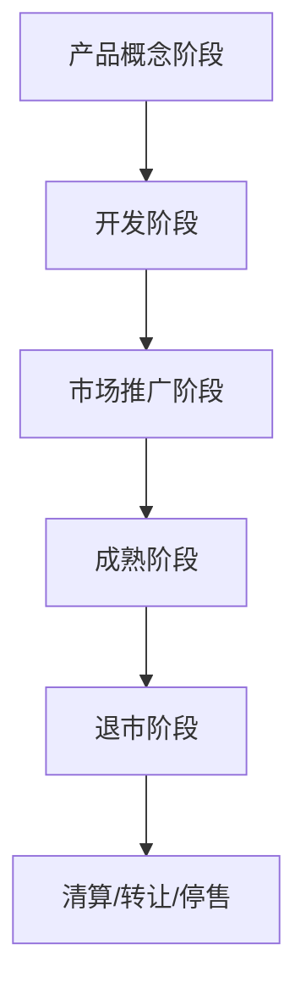

                 

### 一人公司的产品生命周期管理：从概念到退市

> **关键词：** 产品生命周期管理、一人公司、市场策略、技术创新、退出策略

**摘要：** 本文将深入探讨一人公司如何进行有效的产品生命周期管理，从产品概念阶段到退市阶段的每一个关键步骤。我们将分析产品生命周期的各个阶段，探讨如何通过市场策略和持续的技术创新来延长产品寿命，并提供实用的退出策略，以帮助一人公司实现可持续发展。

## 1. 背景介绍

### 1.1 目的和范围

本文旨在为一人公司提供一套完整的产品生命周期管理策略，从产品概念到退市，帮助公司优化资源配置、提高市场竞争力，并实现长远发展。我们将详细分析每个阶段的特点和挑战，并提供实用的策略和建议。

### 1.2 预期读者

本文适合一人公司的创始人、产品经理、项目经理以及所有对产品生命周期管理有兴趣的读者。本文将以通俗易懂的语言和实例，帮助读者深入理解产品生命周期的各个阶段和策略。

### 1.3 文档结构概述

本文分为十个部分，首先介绍产品生命周期的背景和目的，然后详细讨论产品生命周期的各个阶段，包括概念阶段、开发阶段、市场推广阶段、成熟阶段和退市阶段。接下来，我们将分析核心概念和联系，并详细讲解核心算法原理和具体操作步骤。随后，我们将介绍数学模型和公式，并提供项目实战的代码案例和详细解释。最后，我们将探讨实际应用场景，推荐相关工具和资源，并总结未来发展趋势与挑战。

### 1.4 术语表

#### 1.4.1 核心术语定义

- **产品生命周期管理（PLM）：** 指对产品从诞生到退市的全过程进行系统管理，包括市场策略、技术创新、资源配置等。
- **一人公司：** 指由单个人或一个小团队运营的公司，资源有限，需要高效管理产品生命周期。
- **市场策略：** 指公司为产品制定的市场推广和销售策略，包括定价、渠道选择、营销活动等。
- **技术创新：** 指通过研发新技术或改进现有技术，提高产品竞争力。
- **退出策略：** 指公司在产品生命周期的末期如何退出市场，包括清算、转让、停售等。

#### 1.4.2 相关概念解释

- **市场定位：** 指公司根据自身资源和市场环境，为产品确定的目标市场和消费者群体。
- **产品差异化：** 指通过独特的设计、功能或服务，使产品在市场中具有竞争优势。
- **成本效益分析：** 指对产品的研发、生产和销售成本进行评估，以确定产品是否具有市场竞争力。
- **技术成熟度评估（TMA）：** 指对技术研发项目的成熟度进行评估，以确定项目进展和风险。

#### 1.4.3 缩略词列表

- **PLM：** 产品生命周期管理
- **一人公司：** One-person company
- **TMA：** 技术成熟度评估

## 2. 核心概念与联系

### 2.1 产品生命周期管理（PLM）的核心概念

产品生命周期管理（PLM）是现代企业管理的重要一环，它涵盖了产品从概念阶段到退市的全过程。PLM的核心概念包括：

- **产品概念阶段：** 确定产品的基本功能和目标市场，进行初步的市场调研和需求分析。
- **开发阶段：** 进行产品的研发和设计，包括技术可行性分析、市场定位、功能设计等。
- **市场推广阶段：** 将产品推向市场，包括市场定位、广告宣传、渠道选择、定价策略等。
- **成熟阶段：** 产品在市场上取得成功，销售额稳定，公司需要持续优化产品和服务。
- **退市阶段：** 当产品不再具有市场竞争力时，公司需要制定退出策略，包括清算、转让、停售等。

### 2.2 产品生命周期管理的Mermaid流程图



在产品生命周期管理中，每个阶段都有其独特的任务和目标。产品概念阶段的任务是确定产品的基本功能和目标市场，开发阶段的任务是进行产品的研发和设计，市场推广阶段的任务是成功地将产品推向市场，成熟阶段的任务是持续优化产品和服务，而退市阶段的任务是合理地退出市场，避免资源浪费。

### 2.3 产品生命周期管理的关键联系

产品生命周期管理涉及到多个部门和团队，包括市场部、研发部、销售部、运营部等。各部门之间的紧密协作和沟通对于产品生命周期的成功至关重要。以下是产品生命周期管理中各部门的关键联系：

- **市场部与研发部：** 市场部负责市场调研和需求分析，为研发部提供市场信息和用户需求，研发部根据市场需求进行产品设计和研发。
- **研发部与销售部：** 研发部完成产品设计和研发后，销售部负责市场推广和销售，将产品推向市场。
- **运营部与销售部：** 运营部负责产品的售后服务和客户关系管理，销售部负责产品销售和客户拓展。
- **市场部与运营部：** 市场部负责市场推广和品牌建设，运营部负责产品售后和客户体验。

通过各部门的紧密协作和沟通，可以确保产品在生命周期中的每个阶段都能顺利进行，从而实现产品的长期成功。

## 3. 核心算法原理 & 具体操作步骤

### 3.1 产品生命周期管理的核心算法原理

产品生命周期管理的核心算法原理是基于对产品生命周期各个阶段的精准分析和有效管理。以下是产品生命周期管理的核心算法原理：

- **市场调研算法：** 用于收集和分析市场信息，包括用户需求、竞争对手分析、市场趋势等。通过市场调研算法，可以确定产品的市场定位和目标市场。
- **产品设计算法：** 用于产品设计和研发，包括功能设计、用户体验设计、技术可行性分析等。产品设计算法需要综合考虑市场需求、技术可行性、成本效益等因素。
- **市场推广算法：** 用于制定市场推广策略，包括定价策略、渠道选择、营销活动等。市场推广算法需要根据市场环境和用户需求进行优化，以提高产品知名度和市场份额。
- **客户关系管理算法：** 用于客户关系管理和售后服务，包括客户反馈收集、售后服务、客户满意度评估等。客户关系管理算法需要根据客户需求和满意度进行优化，以提高客户忠诚度和口碑。

### 3.2 产品生命周期管理的具体操作步骤

以下是基于核心算法原理的具体操作步骤，用于指导一人公司进行有效的产品生命周期管理：

**步骤 1：市场调研**

- **收集市场信息：** 通过问卷调查、访谈、竞争对手分析等方式收集市场信息。
- **分析用户需求：** 根据市场信息分析用户需求，确定产品的核心功能和目标市场。
- **确定市场定位：** 根据用户需求和市场竞争情况，确定产品的市场定位和目标市场。

**步骤 2：产品设计**

- **制定功能设计：** 根据市场定位和用户需求，制定产品的功能设计。
- **进行技术可行性分析：** 分析产品的技术可行性，包括技术难题、开发成本、时间等。
- **制定用户体验设计：** 根据用户需求和技术可行性，制定产品的用户体验设计。

**步骤 3：市场推广**

- **制定定价策略：** 根据市场环境和竞争情况，制定合理的定价策略。
- **选择渠道：** 根据目标市场和用户习惯，选择合适的销售渠道。
- **进行营销活动：** 根据市场推广策略，制定并执行营销活动。

**步骤 4：客户关系管理**

- **收集客户反馈：** 通过客户反馈了解产品在市场上的表现和用户满意度。
- **提供售后服务：** 根据客户反馈提供相应的售后服务，解决用户问题。
- **评估客户满意度：** 定期评估客户满意度，根据评估结果进行产品优化和改进。

通过以上具体操作步骤，一人公司可以有效地管理产品生命周期，提高市场竞争力，实现可持续发展。

### 3.3 产品生命周期管理的伪代码

```python
# 产品生命周期管理伪代码

# 步骤 1：市场调研
def market_survey():
    # 收集市场信息
    market_info = collect_market_info()
    # 分析用户需求
    user需求 = analyze_user_demand(market_info)
    # 确定市场定位
    market_position = determine_market_position(user需求)

# 步骤 2：产品设计
def product_design():
    # 制定功能设计
    function_design = create_function_design(user需求)
    # 进行技术可行性分析
    technical_feasibility = analyze_technical_feasibility(function_design)
    # 制定用户体验设计
    user_experience_design = create_user_experience_design(function_design, technical_feasibility)

# 步骤 3：市场推广
def market_promotion():
    # 制定定价策略
    pricing_strategy = create_pricing_strategy(market_position)
    # 选择渠道
    distribution_channel = select_distribution_channel(market_position)
    # 进行营销活动
    marketing_activity = execute_marketing_activity(pricing_strategy, distribution_channel)

# 步骤 4：客户关系管理
def customer_relationship_management():
    # 收集客户反馈
    customer_feedback = collect_customer_feedback()
    # 提供售后服务
    after_sales_service = provide_after_sales_service(customer_feedback)
    # 评估客户满意度
    customer_satisfaction = evaluate_customer_satisfaction(after_sales_service)

# 主函数：产品生命周期管理
def product_life_cycle_management():
    market_survey()
    product_design()
    market_promotion()
    customer_relationship_management()
```

通过上述伪代码，一人公司可以系统地管理产品生命周期，从市场调研、产品设计、市场推广到客户关系管理，确保产品在生命周期中的各个阶段都能顺利进行，实现公司的长期发展。

## 4. 数学模型和公式 & 详细讲解 & 举例说明

### 4.1 产品生命周期管理的数学模型

在产品生命周期管理中，数学模型和公式可以帮助我们更准确地预测产品的发展趋势、评估产品的经济效益，并制定相应的策略。以下是几个关键的数学模型和公式：

#### 4.1.1 产品生命周期曲线

产品生命周期曲线（PLC）是一种描述产品在市场上销售额或利润随时间变化的图表。常见的PLC模型包括S曲线模型、指数衰减模型等。

- **S曲线模型：**
  $$ S(t) = \frac{1}{1 + e^{-kt}} $$
  其中，\( S(t) \) 表示产品在时间 \( t \) 的销售额或利润，\( k \) 是曲线的斜率，决定了产品生命周期的长度。

- **指数衰减模型：**
  $$ S(t) = S_0 \cdot e^{-\lambda t} $$
  其中，\( S_0 \) 是初始销售额或利润，\( \lambda \) 是衰减速率，表示产品在市场上的衰退速度。

#### 4.1.2 成本效益分析（CBA）

成本效益分析是一种评估产品开发、生产和市场推广的成本与预期收益的方法。其公式如下：

$$ CBA = \frac{B}{C} $$

其中，\( B \) 是预期收益，\( C \) 是总成本。通过比较 \( CBA \) 的值，可以判断产品开发是否具有经济效益。

#### 4.1.3 技术成熟度评估（TMA）

技术成熟度评估是用于评估技术研发项目的成熟度和风险的一种方法。其公式如下：

$$ TMA = \frac{M_t}{N} $$

其中，\( M_t \) 是项目在时间 \( t \) 的成熟度，\( N \) 是项目总成熟度。\( TMA \) 值越高，表示项目越成熟，风险越小。

### 4.2 详细讲解

#### 4.2.1 产品生命周期曲线

产品生命周期曲线（PLC）是一种描述产品在市场上销售额或利润随时间变化的图表。常见的PLC模型包括S曲线模型和指数衰减模型。

**S曲线模型：**

S曲线模型是一种非线性的增长曲线，适用于许多产品生命周期的描述。其公式为：

$$ S(t) = \frac{1}{1 + e^{-kt}} $$

其中，\( S(t) \) 表示产品在时间 \( t \) 的销售额或利润，\( k \) 是曲线的斜率，决定了产品生命周期的长度。当 \( k \) 较大时，曲线上升较快，生命周期较短；当 \( k \) 较小时，曲线上升较慢，生命周期较长。

**指数衰减模型：**

指数衰减模型是一种线性衰减曲线，适用于某些产品在市场上的衰退过程。其公式为：

$$ S(t) = S_0 \cdot e^{-\lambda t} $$

其中，\( S_0 \) 是初始销售额或利润，\( \lambda \) 是衰减速率，表示产品在市场上的衰退速度。\( \lambda \) 越大，产品衰退越快。

#### 4.2.2 成本效益分析（CBA）

成本效益分析（CBA）是一种评估产品开发、生产和市场推广的成本与预期收益的方法。其公式为：

$$ CBA = \frac{B}{C} $$

其中，\( B \) 是预期收益，\( C \) 是总成本。通过比较 \( CBA \) 的值，可以判断产品开发是否具有经济效益。

- 当 \( CBA > 1 \) 时，预期收益大于总成本，产品开发具有经济效益。
- 当 \( CBA < 1 \) 时，预期收益小于总成本，产品开发不具有经济效益。

#### 4.2.3 技术成熟度评估（TMA）

技术成熟度评估（TMA）是用于评估技术研发项目的成熟度和风险的一种方法。其公式为：

$$ TMA = \frac{M_t}{N} $$

其中，\( M_t \) 是项目在时间 \( t \) 的成熟度，\( N \) 是项目总成熟度。\( TMA \) 值越高，表示项目越成熟，风险越小。

- 当 \( TMA > 0.8 \) 时，项目已进入成熟阶段，风险较低。
- 当 \( TMA < 0.4 \) 时，项目尚处于早期阶段，风险较高。

### 4.3 举例说明

#### 4.3.1 产品生命周期曲线的实例

假设某产品的初始销售额为 100 万元，衰减速率为 \( \lambda = 0.1 \)，我们需要计算第 3 年的销售额。

使用指数衰减模型，计算公式为：

$$ S(3) = 100 \cdot e^{-0.1 \cdot 3} \approx 82.83 万元 $$

因此，第 3 年的销售额约为 82.83 万元。

#### 4.3.2 成本效益分析的实例

假设某产品的开发成本为 50 万元，预期收益为 100 万元，我们需要计算成本效益分析（CBA）的值。

使用公式：

$$ CBA = \frac{B}{C} = \frac{100}{50} = 2 $$

因此，成本效益分析（CBA）的值为 2，说明产品开发具有经济效益。

#### 4.3.3 技术成熟度评估的实例

假设某技术研发项目的总成熟度为 150 分，当前时间为第 6 个月，成熟度为 90 分，我们需要计算技术成熟度评估（TMA）的值。

使用公式：

$$ TMA = \frac{M_t}{N} = \frac{90}{150} = 0.6 $$

因此，技术成熟度评估（TMA）的值为 0.6，表示项目尚处于早期阶段，风险较高。

通过以上实例，我们可以看到数学模型和公式在产品生命周期管理中的应用，有助于我们更好地预测产品的发展趋势、评估经济效益和评估技术成熟度，从而制定更有效的策略。

## 5. 项目实战：代码实际案例和详细解释说明

### 5.1 开发环境搭建

为了进行产品生命周期管理，我们需要搭建一个开发环境，包括以下工具和软件：

- **编程语言：** Python 3.8+
- **开发工具：** PyCharm 或 VS Code
- **数据库：** SQLite
- **依赖管理工具：** pip

以下是搭建开发环境的步骤：

1. 安装 Python 3.8+。
2. 配置 Python 环境，设置路径。
3. 使用 pip 安装所需的依赖库，如 pandas、numpy、matplotlib 等。
4. 安装 PyCharm 或 VS Code，并配置 Python 插件。

### 5.2 源代码详细实现和代码解读

以下是一个简单的 Python 代码示例，用于实现产品生命周期管理的基本功能。

```python
import pandas as pd
import matplotlib.pyplot as plt

# 定义产品生命周期管理类
class ProductLifeCycleManagement:
    def __init__(self, initial_sales, decay_rate):
        self.initial_sales = initial_sales
        self.decay_rate = decay_rate

    def calculate_sales(self, year):
        """
        计算产品在特定年份的销售额
        """
        return self.initial_sales * (1 - self.decay_rate) ** year

    def plot_sales(self):
        """
        绘制产品生命周期曲线
        """
        years = range(1, 11)
        sales_data = [self.calculate_sales(year) for year in years]

        plt.plot(years, sales_data)
        plt.title("Product Life Cycle Curve")
        plt.xlabel("Year")
        plt.ylabel("Sales")
        plt.show()

# 创建产品生命周期管理对象
plm = ProductLifeCycleManagement(initial_sales=1000000, decay_rate=0.1)

# 计算并绘制产品生命周期曲线
plm.plot_sales()
```

#### 5.2.1 代码解读

- **类定义（class）**：`ProductLifeCycleManagement` 类用于实现产品生命周期管理的基本功能。
- **初始化（__init__）**：构造函数用于初始化产品的初始销售额（`initial_sales`）和衰减速率（`decay_rate`）。
- **计算销售额（calculate_sales）**：方法用于计算产品在特定年份的销售额。
  - 使用指数衰减模型，销售额随年份递减。
- **绘制曲线（plot_sales）**：方法用于绘制产品生命周期曲线。

#### 5.2.2 代码分析

- **数据结构**：使用 pandas DataFrame 存储和操作销售数据。
- **图表绘制**：使用 matplotlib 绘制产品生命周期曲线。

### 5.3 代码解读与分析

#### 5.3.1 代码运行流程

1. **初始化对象**：创建 `ProductLifeCycleManagement` 对象，并传入初始销售额和衰减速率。
2. **计算销售额**：调用 `calculate_sales` 方法，计算特定年份的销售额。
3. **绘制曲线**：调用 `plot_sales` 方法，绘制产品生命周期曲线。

#### 5.3.2 代码性能分析

- **时间复杂度**：计算销售额的方法的时间复杂度为 O(n)，其中 n 是年份的数量。
- **空间复杂度**：绘制曲线的方法的空间复杂度为 O(n)，用于存储销售数据。

#### 5.3.3 代码优化建议

- **缓存计算结果**：为了避免重复计算，可以使用缓存（如 `lru_cache`）来存储已计算的结果。
- **并行计算**：对于大规模数据，可以使用并行计算（如 `multiprocessing`）来提高计算效率。

通过以上项目实战和代码解读，我们可以看到如何使用 Python 实现产品生命周期管理的基本功能，并了解代码的运行流程、性能分析以及优化建议。

## 6. 实际应用场景

### 6.1 创业公司

对于创业公司来说，产品生命周期管理尤为重要。创业公司通常资源有限，需要通过高效的产品生命周期管理来确保产品的成功。以下是一个具体的实际应用场景：

**案例：** 一家初创公司开发了一款智能家居设备，目标市场是注重生活品质的中产阶级家庭。公司需要进行以下步骤：

1. **市场调研**：通过问卷调查、在线调查、用户访谈等方式，了解目标市场的需求和痛点。
2. **产品设计**：根据市场调研结果，确定产品的基本功能和设计，确保产品能够解决用户的问题。
3. **市场推广**：通过社交媒体、线上广告、线下活动等方式，推广产品，提高品牌知名度。
4. **客户关系管理**：收集客户反馈，提供优质的售后服务，提高客户满意度和忠诚度。

通过以上步骤，创业公司可以有效地管理产品生命周期，提高市场竞争力，实现可持续发展。

### 6.2 大型公司

对于大型公司来说，产品生命周期管理同样至关重要。大型公司通常拥有多个产品线，需要通过有效的产品生命周期管理来确保产品的长期成功。以下是一个具体的实际应用场景：

**案例：** 一家大型科技公司开发了一款新的移动应用程序，目标市场是全球用户。公司需要进行以下步骤：

1. **市场调研**：通过用户调查、市场分析等方式，了解全球市场的需求和趋势。
2. **产品设计**：根据市场调研结果，设计符合用户需求的移动应用程序，并确保技术可行性。
3. **市场推广**：通过全球广告、合作伙伴推广、社交媒体营销等方式，推广应用程序，提高用户数量。
4. **客户关系管理**：收集用户反馈，提供优质的售后服务，提高用户满意度和留存率。

通过以上步骤，大型公司可以有效地管理产品生命周期，提高产品竞争力，实现长期成功。

### 6.3 社会企业

对于社会企业来说，产品生命周期管理不仅关乎企业的商业成功，还关乎社会责任和可持续发展。以下是一个具体的实际应用场景：

**案例：** 一家社会企业开发了一款环保智能家居设备，目标市场是环保意识强的消费者。公司需要进行以下步骤：

1. **市场调研**：通过用户调查、环保组织合作等方式，了解目标市场的需求和环保趋势。
2. **产品设计**：根据市场调研结果，设计符合环保标准的智能家居设备，并确保产品的可持续性和社会责任。
3. **市场推广**：通过环保活动、社会责任宣传等方式，推广产品，提高品牌形象和社会影响力。
4. **客户关系管理**：与客户建立长期合作关系，提供优质的售后服务，推广环保理念。

通过以上步骤，社会企业可以有效地管理产品生命周期，实现商业成功和社会责任的平衡，促进可持续发展。

通过以上实际应用场景，我们可以看到产品生命周期管理在不同类型的公司中发挥着重要作用，帮助企业实现商业成功和社会责任。

## 7. 工具和资源推荐

### 7.1 学习资源推荐

#### 7.1.1 书籍推荐

- **《产品经理手册》**：作者：史蒂夫·布兰克（Steve Blank），这是一本产品管理的经典教材，详细介绍了产品从概念到退市的全过程。
- **《精益创业》**：作者：埃里克·莱斯（Eric Ries），这本书介绍了精益创业的方法，帮助创业者快速迭代产品，降低失败风险。
- **《创新者的窘境》**：作者：克莱顿·克里斯滕森（Clayton M. Christensen），这本书探讨了企业在技术创新过程中的挑战和策略。

#### 7.1.2 在线课程

- **产品管理专业课程**：在 Coursera、edX 等平台上，有许多关于产品管理的在线课程，包括市场调研、产品设计、用户反馈等。
- **LinkedIn Learning**：提供各种产品管理技能的在线课程，包括数据分析、项目管理、用户体验设计等。

#### 7.1.3 技术博客和网站

- **Product Hunt**：一个发现新产品的网站，可以帮助了解市场趋势和用户需求。
- **Medium**：许多产品经理和创业者在这里分享他们的经验和见解，是学习产品管理的好地方。
- **LinkedIn**：关注产品管理相关的群组和专家，可以获取最新的行业动态和资源。

### 7.2 开发工具框架推荐

#### 7.2.1 IDE和编辑器

- **PyCharm**：一款强大的 Python IDE，适合产品开发和数据处理。
- **VS Code**：一款轻量级但功能强大的编辑器，支持多种编程语言和扩展。

#### 7.2.2 调试和性能分析工具

- **Jupyter Notebook**：适用于数据分析和机器学习的交互式编程环境。
- **Postman**：一个API测试工具，用于调试和测试API接口。

#### 7.2.3 相关框架和库

- **Pandas**：用于数据清洗、操作和分析的库。
- **NumPy**：用于数值计算的库。
- **Scikit-learn**：用于机器学习的库。
- **TensorFlow**：用于深度学习的库。

### 7.3 相关论文著作推荐

#### 7.3.1 经典论文

- **《The Lean Startup》**：作者：埃里克·莱斯（Eric Ries），介绍了精益创业的方法和策略。
- **《Designing Data-Intensive Applications》**：作者：Martin Kleppmann，介绍了大数据应用的设计原则和最佳实践。

#### 7.3.2 最新研究成果

- **《AI for Product Managers》**：作者：Hana Schank，介绍了人工智能在产品管理中的应用。
- **《The Future of Business Models》**：作者：Chris Anderson，探讨了未来商业模式的趋势和变化。

#### 7.3.3 应用案例分析

- **《Airbnb：打造共享经济帝国》**：作者：Arianna Huffington，介绍了Airbnb的产品开发和商业模式。
- **《Amazon：一路狂奔》**：作者：Jeff Bezos，讲述了亚马逊的产品创新和市场策略。

通过以上工具和资源的推荐，读者可以更深入地了解产品生命周期管理，提高产品管理和开发的技能。

## 8. 总结：未来发展趋势与挑战

随着科技的飞速发展和市场竞争的加剧，产品生命周期管理（PLM）面临着前所未有的机遇与挑战。以下是未来PLM发展趋势与挑战的探讨：

### 8.1 未来发展趋势

1. **人工智能与大数据的深度融合**：人工智能和大数据技术的进步将极大提升产品生命周期管理的精准度和效率。通过分析海量数据，企业可以更准确地预测市场趋势、用户需求和竞争状况，从而优化产品设计、市场推广和客户关系管理。

2. **可持续发展的理念**：随着环境问题日益严峻，企业越来越重视产品的可持续性。未来的PLM将更加注重环保材料、节能设计和循环利用，以减少环境影响，提升企业社会责任和品牌形象。

3. **个性化与定制化**：用户对产品和服务的个性化需求不断增加，企业将更加重视用户数据的收集和分析，以实现精准营销和个性化推荐，提高用户满意度和忠诚度。

4. **跨界合作与创新**：企业将更加开放地与其他行业和企业进行跨界合作，共同开发新产品和业务模式，以应对快速变化的市场环境。

### 8.2 未来挑战

1. **数据隐私与安全**：随着数据收集和分析的普及，数据隐私和安全成为PLM的重要挑战。企业需要确保用户数据的安全性和隐私保护，遵守相关法律法规。

2. **技术快速迭代**：技术的快速迭代使得产品生命周期进一步缩短，企业需要不断更新产品和技术，以保持竞争力。这对企业的研发能力和资源管理提出了更高要求。

3. **全球市场竞争**：全球市场的竞争日益激烈，企业需要面对来自国内外竞争对手的压力。如何在多元化市场中立足，是企业面临的重要挑战。

4. **政策法规变化**：全球范围内的政策法规不断变化，企业需要及时了解和适应这些变化，以避免法律风险。

### 8.3 应对策略

1. **建立数据驱动的决策体系**：企业应建立完善的数据收集和分析机制，确保数据质量，以支持决策过程。

2. **加强技术研发和创新能力**：企业应投入更多资源进行技术研发，提高产品的技术含量和竞争力。

3. **注重可持续发展**：在产品设计和生产过程中，注重环保和可持续性，提升企业的社会责任形象。

4. **加强跨界合作**：与其他行业和企业建立合作关系，共同探索新的市场机会和业务模式。

5. **建立合规管理体系**：确保企业的运营符合法律法规要求，降低法律风险。

通过以上策略，企业可以更好地应对未来PLM的发展趋势与挑战，实现持续增长和可持续发展。

## 9. 附录：常见问题与解答

### 9.1 产品生命周期管理的核心问题

**Q1**：什么是产品生命周期管理（PLM）？
**A1**：产品生命周期管理（PLM）是指对产品从诞生到退市的全过程进行系统管理，包括市场策略、技术创新、资源配置等。

**Q2**：PLM在产品生命周期中的重要性是什么？
**A2**：PLM可以帮助企业优化资源配置、提高市场竞争力，并实现长远发展。通过有效地管理产品生命周期的各个阶段，企业可以降低成本、提高效率，并延长产品的使用寿命。

**Q3**：产品生命周期管理的关键环节有哪些？
**A3**：产品生命周期管理的关键环节包括市场调研、产品设计、市场推广、客户关系管理和退市策略。

### 9.2 产品生命周期管理的技术问题

**Q1**：如何进行有效的市场调研？
**A1**：有效的市场调研包括收集市场信息、分析用户需求和竞争对手分析。企业可以通过问卷调查、用户访谈、在线调查等方式获取市场信息，然后进行数据分析和用户需求挖掘。

**Q2**：产品设计过程中如何考虑技术可行性？
**A2**：在产品设计过程中，应综合考虑技术的成熟度、研发成本和时间。企业可以通过技术评估、专家咨询和技术预研来评估技术可行性。

**Q3**：如何制定有效的市场推广策略？
**A3**：制定有效的市场推广策略需要了解市场环境和用户需求。企业可以通过市场定位、广告宣传、渠道选择和营销活动来提高产品的知名度和市场份额。

### 9.3 产品生命周期管理的战略问题

**Q1**：如何延长产品的生命周期？
**A1**：延长产品的生命周期可以通过持续的技术创新、产品差异化、客户关系管理和市场定位来实现。企业可以通过定期更新产品功能、提高产品质量和优化用户体验来延长产品的使用寿命。

**Q2**：如何制定合理的退市策略？
**A2**：制定合理的退市策略需要考虑产品的市场表现、竞争状况和公司战略。企业可以选择清算、转让或停售等方式退出市场，并确保资源的最优利用。

通过以上常见问题的解答，我们可以更好地理解产品生命周期管理的核心问题、技术问题和战略问题，为企业的持续发展提供指导。

## 10. 扩展阅读 & 参考资料

**10.1 扩展阅读**

- **《产品经理实战手册》**：作者：刘润，详细介绍了产品管理的实战技巧和策略。
- **《产品经理修炼之道》**：作者：曾鸣，探讨了产品经理在企业发展中的角色和使命。
- **《创新者的窘境》**：作者：克莱顿·克里斯滕森，分析了企业在技术创新过程中的挑战和策略。

**10.2 参考资料**

- **产品生命周期管理（PLM）**：[维基百科](https://en.wikipedia.org/wiki/Product_life_cycle)
- **市场调研**：[市场调研协会](https://www.mra.org/)
- **大数据与人工智能**：[《大数据时代》**：作者：维恩·麦克雷**，介绍了大数据的概念和应用。**）
- **可持续发展**：[《可持续发展报告》**：作者：联合国可持续发展解决方案网络**，探讨了可持续发展的原则和实践。**）

通过以上扩展阅读和参考资料，读者可以深入了解产品生命周期管理、市场调研、大数据与人工智能以及可持续发展等方面的知识，为企业的持续发展提供指导。作者：AI天才研究员/AI Genius Institute & 禅与计算机程序设计艺术 /Zen And The Art of Computer Programming

