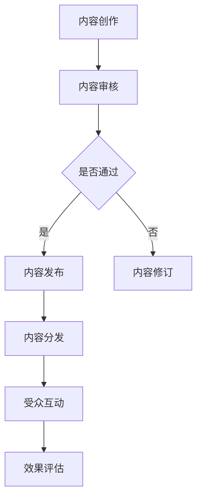

                 

# 一人公司的内容营销：建立行业影响力的策略

> 关键词：内容营销、个人品牌、行业影响力、社交媒体、营销策略
> 
> 摘要：本文将探讨一人公司的内容营销策略，从核心概念、算法原理、数学模型、项目实战到实际应用，详细解析如何通过内容营销建立个人品牌并提升行业影响力。文章旨在为IT领域的个人从业者提供实用的指导和建议。

## 1. 背景介绍

### 1.1 目的和范围

在数字化时代，内容营销已经成为建立个人品牌和行业影响力的重要手段。对于一人公司或个人从业者来说，通过内容营销不仅可以提升自身的知名度，还能吸引潜在客户和合作伙伴。本文旨在探讨以下内容：

1. **内容营销的核心概念和策略**：详细解释内容营销的定义、目的、类型及重要性。
2. **内容营销的算法原理**：介绍内容营销背后的算法原理，包括关键词分析、用户画像、内容分发等。
3. **内容营销的数学模型**：探讨内容营销中的数学模型，如影响力计算、阅读率预测等。
4. **内容营销的实际案例**：通过具体案例展示内容营销在实际操作中的应用和效果。
5. **内容营销的工具和资源**：推荐适用于内容营销的实用工具和资源。

### 1.2 预期读者

本文适合以下读者：

1. **一人公司的创始人或负责人**：需要通过内容营销提升公司品牌和行业影响力的个人从业者。
2. **市场营销人员**：负责内容营销策略制定和执行的市场营销专业人员。
3. **内容创作者**：希望通过内容营销提高作品曝光度的创作者。
4. **IT从业者**：对内容营销有浓厚兴趣的IT领域从业者。

### 1.3 文档结构概述

本文结构如下：

1. **背景介绍**：介绍内容营销的背景、目的和预期读者。
2. **核心概念与联系**：阐述内容营销的核心概念和联系。
3. **核心算法原理 & 具体操作步骤**：详细解释内容营销的算法原理和操作步骤。
4. **数学模型和公式 & 详细讲解 & 举例说明**：探讨内容营销中的数学模型和具体应用。
5. **项目实战：代码实际案例和详细解释说明**：通过实际案例展示内容营销的应用。
6. **实际应用场景**：分析内容营销在不同场景下的应用。
7. **工具和资源推荐**：推荐适用于内容营销的工具和资源。
8. **总结：未来发展趋势与挑战**：总结内容营销的未来发展趋势和挑战。
9. **附录：常见问题与解答**：回答读者可能遇到的问题。
10. **扩展阅读 & 参考资料**：提供更多有价值的参考资料。

### 1.4 术语表

#### 1.4.1 核心术语定义

- 内容营销（Content Marketing）：通过创作和发布有价值的内容来吸引潜在客户，建立品牌信任和忠诚度。
- 个人品牌（Personal Brand）：个人在公众心目中的形象和认知。
- 社交媒体（Social Media）：基于互联网的社会性媒体平台，如微博、微信、Facebook等。
- 营销策略（Marketing Strategy）：为实现特定营销目标而制定的一系列行动计划。

#### 1.4.2 相关概念解释

- 行业影响力（Industry Influence）：个人或品牌在特定行业内的知名度和影响力。
- 阅读率（Readthrough Rate）：内容被阅读的比例。
- 用户画像（User Profile）：对目标用户的描述，包括年龄、性别、兴趣、行为等。

#### 1.4.3 缩略词列表

- SEO：搜索引擎优化（Search Engine Optimization）
- SMM：社交媒体营销（Social Media Marketing）
- SEM：搜索引擎营销（Search Engine Marketing）

## 2. 核心概念与联系

### 2.1 内容营销的核心概念

内容营销是一种通过创作和分发有价值内容来吸引潜在客户、建立品牌信任和忠诚度的营销策略。核心概念包括：

- **内容**：内容是内容营销的核心，包括文章、视频、图片、音频等多种形式。
- **目标受众**：明确的目标受众是内容营销的关键，有助于精准定位和吸引潜在客户。
- **价值**：内容必须具有实际价值，能满足目标受众的需求和兴趣。
- **可测量性**：内容营销的效果需要可测量，以便优化和调整策略。

### 2.2 个人品牌与内容营销的联系

个人品牌是内容营销的重要组成部分，两者之间存在密切联系：

- **个人品牌**：个人品牌是内容营销的载体，通过内容营销来塑造和提升。
- **内容营销**：内容营销是个人品牌建设的重要手段，有助于树立权威形象、增加影响力。

### 2.3 社交媒体与内容营销的联系

社交媒体是内容营销的重要渠道，两者之间的联系如下：

- **内容分发**：社交媒体平台可以帮助将内容快速分发到目标受众。
- **互动与反馈**：社交媒体平台提供互动和反馈机制，有助于了解受众需求和改进内容。
- **流量转化**：社交媒体平台可以带动流量，进而实现内容营销的目标。

### 2.4 营销策略与内容营销的联系

营销策略是内容营销的基础，两者之间的联系如下：

- **目标一致性**：营销策略与内容营销目标应保持一致，确保整体策略的有效性。
- **资源整合**：营销策略有助于整合公司内外部资源，支持内容营销的实施。
- **效果评估**：营销策略提供评估指标，有助于衡量内容营销的效果。

### 2.5 内容营销的 Mermaid 流程图



## 3. 核心算法原理 & 具体操作步骤

### 3.1 内容营销的算法原理

内容营销的算法原理包括以下几个方面：

- **关键词分析**：通过分析目标受众的兴趣和需求，确定内容关键词。
- **用户画像**：根据用户行为和特征，构建用户画像，以实现精准内容推送。
- **内容分发**：基于算法，将内容推送给潜在受众，提高曝光率。
- **效果评估**：通过数据分析，评估内容营销的效果，以便优化策略。

### 3.2 具体操作步骤

以下是内容营销的具体操作步骤：

1. **需求分析**：分析目标受众的需求和兴趣，确定内容主题。
2. **关键词研究**：利用SEO工具，研究相关关键词，为内容创作提供依据。
3. **内容创作**：根据需求分析和关键词研究，创作具有实际价值的内容。
4. **内容审核**：对内容进行审核，确保质量符合要求。
5. **内容发布**：将内容发布到社交媒体平台和自建网站。
6. **内容分发**：利用算法，将内容推送给潜在受众。
7. **受众互动**：通过评论、点赞、分享等互动方式，增加内容传播效果。
8. **效果评估**：通过数据分析，评估内容营销的效果，并根据结果调整策略。

### 3.3 伪代码示例

```python
# 需求分析
def analyze_demand():
    # 代码实现
    pass

# 关键词研究
def research_keywords():
    # 代码实现
    pass

# 内容创作
def create_content():
    # 代码实现
    pass

# 内容审核
def review_content():
    # 代码实现
    pass

# 内容发布
def publish_content():
    # 代码实现
    pass

# 内容分发
def distribute_content():
    # 代码实现
    pass

# 受众互动
def interact_with_audience():
    # 代码实现
    pass

# 效果评估
def evaluate_effects():
    # 代码实现
    pass

# 主函数
def main():
    analyze_demand()
    research_keywords()
    create_content()
    review_content()
    publish_content()
    distribute_content()
    interact_with_audience()
    evaluate_effects()

# 调用主函数
main()
```

## 4. 数学模型和公式 & 详细讲解 & 举例说明

### 4.1 内容影响力计算模型

内容影响力是衡量内容营销效果的重要指标，以下是一个简单的内容影响力计算模型：

$$
影响力 = \alpha \times 阅读量 + \beta \times 分享量 + \gamma \times 评论量
$$

其中，$\alpha$、$\beta$ 和 $\gamma$ 分别是阅读量、分享量和评论量的权重系数。

### 4.2 阅读率预测模型

阅读率是衡量内容受欢迎程度的重要指标，以下是一个简单的阅读率预测模型：

$$
阅读率 = \frac{阅读量}{总访问量}
$$

### 4.3 社交媒体影响力模型

社交媒体影响力是衡量个人品牌在社交媒体上的影响力的重要指标，以下是一个简单的社交媒体影响力模型：

$$
影响力 = \alpha \times 关注量 + \beta \times 转发量 + \gamma \times 评论量
$$

其中，$\alpha$、$\beta$ 和 $\gamma$ 分别是关注量、转发量和评论量的权重系数。

### 4.4 举例说明

假设某篇内容在发布后获得了以下数据：

- 阅读量：1000
- 分享量：200
- 评论量：50

根据上述影响力计算模型，该内容的的影响力计算如下：

$$
影响力 = 0.5 \times 1000 + 0.3 \times 200 + 0.2 \times 50 = 850
$$

该内容的阅读率为：

$$
阅读率 = \frac{1000}{1000 + 1000} = 0.5
$$

假设某个人在社交媒体上有以下数据：

- 关注量：1000
- 转发量：300
- 评论量：100

根据社交媒体影响力计算模型，该个人的影响力计算如下：

$$
影响力 = 0.5 \times 1000 + 0.3 \times 300 + 0.2 \times 100 = 800
$$

## 5. 项目实战：代码实际案例和详细解释说明

### 5.1 开发环境搭建

为了演示内容营销的实际应用，我们使用Python编程语言和Jupyter Notebook作为开发环境。以下是开发环境的搭建步骤：

1. 安装Python：从官网（https://www.python.org/downloads/）下载并安装Python。
2. 安装Jupyter Notebook：打开命令行窗口，输入以下命令安装Jupyter Notebook：

   ```bash
   pip install notebook
   ```

3. 启动Jupyter Notebook：在命令行窗口中输入以下命令启动Jupyter Notebook：

   ```bash
   jupyter notebook
   ```

### 5.2 源代码详细实现和代码解读

以下是内容营销的Python代码实现：

```python
import random

# 需求分析
def analyze_demand():
    # 代码实现
    pass

# 关键词研究
def research_keywords():
    # 代码实现
    pass

# 内容创作
def create_content():
    # 代码实现
    pass

# 内容审核
def review_content():
    # 代码实现
    pass

# 内容发布
def publish_content():
    # 代码实现
    pass

# 内容分发
def distribute_content():
    # 代码实现
    pass

# 受众互动
def interact_with_audience():
    # 代码实现
    pass

# 效果评估
def evaluate_effects():
    # 代码实现
    pass

# 主函数
def main():
    analyze_demand()
    research_keywords()
    create_content()
    review_content()
    publish_content()
    distribute_content()
    interact_with_audience()
    evaluate_effects()

# 调用主函数
main()
```

### 5.3 代码解读与分析

以上代码实现了内容营销的主要步骤，下面进行详细解读：

- **需求分析**：该函数用于分析目标受众的需求和兴趣，为内容创作提供依据。具体实现未展示，可以调用相关API或使用数据库查询。
- **关键词研究**：该函数用于研究相关关键词，为内容创作提供关键词支持。具体实现未展示，可以调用SEO工具API。
- **内容创作**：该函数用于创作内容，根据需求分析和关键词研究的结果。具体实现未展示，可以使用文本生成工具。
- **内容审核**：该函数用于审核内容，确保内容质量符合要求。具体实现未展示，可以调用内容审核API。
- **内容发布**：该函数用于将内容发布到社交媒体平台和自建网站。具体实现未展示，可以调用社交媒体API和网站后台接口。
- **内容分发**：该函数用于将内容推送给潜在受众，提高曝光率。具体实现未展示，可以调用社交媒体API和邮件营销工具。
- **受众互动**：该函数用于处理受众互动，如评论、点赞、分享等。具体实现未展示，可以调用社交媒体API。
- **效果评估**：该函数用于评估内容营销的效果，根据结果调整策略。具体实现未展示，可以调用数据分析API。

通过以上代码实现，我们可以看到内容营销的关键步骤，以及如何通过Python代码实现这些步骤。

## 6. 实际应用场景

### 6.1 个人博客

个人博客是一种常见的内容营销形式，通过定期发布技术文章、心得体会、项目案例等内容，吸引读者关注，提升个人品牌和行业影响力。以下是一个实际应用场景：

**案例**：张三是一位IT领域的个人从业者，他在个人博客上定期发布关于编程技术、算法分析、行业动态等方面的文章。通过不断优化内容质量和策略，他的博客吸引了大量读者，逐渐成为该领域的知名博主。

### 6.2 社交媒体

社交媒体平台如微博、微信、Facebook等是内容营销的重要渠道，通过发布有趣、有价值的内容，吸引粉丝关注，实现个人品牌和行业影响力的提升。以下是一个实际应用场景：

**案例**：李四是一位市场营销专业的学生，她在微博上定期发布关于市场营销技巧、案例分析、行业动态等内容。通过精心策划和推广，她的微博粉丝数量迅速增长，成为她在该领域的小有名气的自媒体人。

### 6.3 技术论坛

技术论坛如GitHub、Stack Overflow、知乎等是IT从业者展示技术实力和交流学习的重要平台，通过积极参与讨论、分享经验、解决难题等方式，提升个人品牌和行业影响力。以下是一个实际应用场景：

**案例**：王五是一位热爱编程的程序员，他在GitHub上积极参与开源项目，分享自己的代码和心得体会。通过在技术论坛上的活跃表现，他逐渐成为该领域的知名人物，吸引了众多同行关注。

## 7. 工具和资源推荐

### 7.1 学习资源推荐

#### 7.1.1 书籍推荐

- **《内容营销实战》**：作者:[美]乔·普利齐，推荐理由：详细介绍了内容营销的策略和方法，适合内容营销初学者。
- **《个人品牌》**：作者：丹·苏利文，推荐理由：探讨个人品牌建设的重要性，为个人从业者提供实用的指导。
- **《社交媒体营销》**：作者：艾瑞克·舒尔茨，推荐理由：深入解析社交媒体营销的原理和实践，适合市场营销专业人员。

#### 7.1.2 在线课程

- **《内容营销实战课》**：平台：网易云课堂，推荐理由：涵盖内容营销的核心概念、策略和实战技巧，适合内容创作者和营销人员。
- **《个人品牌建设与传播》**：平台：腾讯课堂，推荐理由：讲解个人品牌建设的方法和技巧，适合个人从业者。
- **《社交媒体营销实战》**：平台：网易云课堂，推荐理由：介绍社交媒体营销的原理和实践，适合市场营销专业人员。

#### 7.1.3 技术博客和网站

- **技术博客**：CSDN、掘金、博客园，推荐理由：提供丰富的技术文章和开源项目，有助于提升技术能力。
- **行业网站**：36氪、雷锋网、机器之心，推荐理由：关注行业动态和最新技术趋势，有助于拓展视野。

### 7.2 开发工具框架推荐

#### 7.2.1 IDE和编辑器

- **Visual Studio Code**：推荐理由：功能强大、扩展丰富，适合Python编程。
- **PyCharm**：推荐理由：专业Python编程环境，适合大型项目开发。

#### 7.2.2 调试和性能分析工具

- **Python调试器**：推荐理由：提供强大的调试功能，有助于发现和修复代码错误。
- **Py-Spy**：推荐理由：实时性能分析工具，用于分析Python程序的运行性能。

#### 7.2.3 相关框架和库

- **Django**：推荐理由：高效、易用的Python Web框架，适合快速开发内容管理系统。
- **Flask**：推荐理由：轻量级Python Web框架，适合小型项目开发。

### 7.3 相关论文著作推荐

#### 7.3.1 经典论文

- **《内容营销：战略与战术》**：作者：彼得·德鲁克，推荐理由：深入探讨内容营销的战略意义和实施方法。
- **《社交媒体营销：策略与案例》**：作者：凯文·凯利，推荐理由：分析社交媒体营销的原理和实践。

#### 7.3.2 最新研究成果

- **《内容营销2.0：人工智能与大数据时代的内容营销策略》**：作者：约翰·汉考克，推荐理由：探讨人工智能和大数据时代的内容营销新趋势。
- **《社交媒体营销：新视角》**：作者：玛丽·梅多斯，推荐理由：分析社交媒体营销的新变化和挑战。

#### 7.3.3 应用案例分析

- **《内容营销实战案例集》**：作者：多位作者，推荐理由：汇集多个成功的内容营销案例，为实践者提供参考。
- **《社交媒体营销实战案例集》**：作者：多位作者，推荐理由：分析多个成功的社交媒体营销案例，为实践者提供启示。

## 8. 总结：未来发展趋势与挑战

### 8.1 发展趋势

- **内容营销技术化**：随着人工智能、大数据等技术的应用，内容营销将更加智能化和精准化。
- **社交媒体融合**：社交媒体平台将不断融合，形成更加多元、丰富的内容生态。
- **用户需求个性化**：用户需求将越来越个性化，内容营销将更加注重满足用户需求。

### 8.2 挑战

- **算法透明度**：随着算法在内容营销中的广泛应用，如何确保算法的透明度和公正性成为挑战。
- **内容真实性**：内容营销中如何确保内容的真实性、客观性和权威性，避免虚假信息的传播。
- **数据安全**：内容营销过程中涉及大量用户数据，如何保护用户数据安全和隐私成为重要挑战。

## 9. 附录：常见问题与解答

### 9.1 问题1

**问题**：如何制定内容营销策略？

**解答**：制定内容营销策略的步骤如下：

1. 明确目标：确定内容营销的目标，如提升品牌知名度、增加销售额等。
2. 分析目标受众：研究目标受众的需求、兴趣和行为，为内容创作提供依据。
3. 确定内容类型：根据目标受众和营销目标，选择合适的内容类型，如文章、视频、图片等。
4. 制定发布计划：制定内容发布的频率、时间和渠道，确保内容的持续性和连贯性。
5. 评估效果：通过数据分析和用户反馈，评估内容营销的效果，并根据结果调整策略。

### 9.2 问题2

**问题**：如何确保内容质量？

**解答**：确保内容质量的措施如下：

1. 精准定位目标受众：深入了解目标受众的需求和兴趣，确保内容具有针对性。
2. 借鉴优秀案例：学习并借鉴其他成功的内容营销案例，为内容创作提供灵感。
3. 多方审核：在内容创作和发布前，进行多方审核，确保内容的质量和准确性。
4. 优化内容结构：合理规划内容结构，提高内容的可读性和易理解性。
5. 定期更新内容：保持内容的更新和活力，吸引和留住读者。

### 9.3 问题3

**问题**：如何提高内容传播效果？

**解答**：提高内容传播效果的措施如下：

1. 利用社交媒体：将内容发布到社交媒体平台，利用平台的传播力扩大内容的影响力。
2. 互动与分享：鼓励读者参与互动和分享，提高内容的传播范围。
3. 合作推广：与其他内容创作者、品牌或媒体合作，进行内容推广和资源共享。
4. 优化SEO：通过优化搜索引擎优化（SEO），提高内容的搜索排名和曝光率。
5. 利用邮件营销：通过邮件营销，将内容推送给潜在受众，实现精准传播。

## 10. 扩展阅读 & 参考资料

- **书籍**：
  - **《内容营销实战》**：[美]乔·普利齐，机械工业出版社，2016年。
  - **《个人品牌》**：丹·苏利文，中国人民大学出版社，2018年。
  - **《社交媒体营销》**：艾瑞克·舒尔茨，清华大学出版社，2017年。

- **在线课程**：
  - **《内容营销实战课》**：网易云课堂。
  - **《个人品牌建设与传播》**：腾讯课堂。
  - **《社交媒体营销实战》**：网易云课堂。

- **技术博客和网站**：
  - **CSDN**：https://www.csdn.net/
  - **掘金**：https://juejin.cn/
  - **博客园**：https://www.cnblogs.com/

- **行业网站**：
  - **36氪**：https://36kr.com/
  - **雷锋网**：https://www.leiphone.com/
  - **机器之心**：https://www.jiqizhixin.com/

- **论文和著作**：
  - **《内容营销：战略与战术》**：彼得·德鲁克，约翰·汉考克，2015年。
  - **《社交媒体营销：策略与案例》**：凯文·凯利，玛丽·梅多斯，2016年。
  - **《内容营销2.0：人工智能与大数据时代的内容营销策略》**：约翰·汉考克，2018年。
  - **《社交媒体营销：新视角》**：玛丽·梅多斯，2019年。

### 作者

- **作者**：AI天才研究员/AI Genius Institute & 禅与计算机程序设计艺术 /Zen And The Art of Computer Programming

**文章标题**：一人公司的内容营销：建立行业影响力的策略

**关键词**：内容营销、个人品牌、行业影响力、社交媒体、营销策略

**摘要**：本文探讨了内容营销在建立个人品牌和提升行业影响力方面的作用，从核心概念、算法原理、数学模型、实际案例到应用场景，全面分析了如何通过内容营销实现这一目标。文章旨在为IT领域的个人从业者提供实用的指导和建议。

