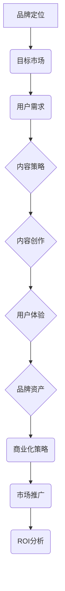

                 

# 一人公司的品牌IP开发与商业化策略

> **关键词**：品牌IP开发、商业化策略、个人品牌、内容营销、市场推广
>
> **摘要**：本文旨在探讨一人公司的品牌IP开发与商业化策略。通过深入分析个人品牌的创建、内容营销的实施、市场推广的技巧，以及成功案例的解析，为一人公司提供系统的品牌管理和商业化建议。

## 1. 背景介绍

### 1.1 目的和范围

本文旨在为一人公司提供品牌IP开发的全面指南，帮助个人企业家了解如何构建、管理和商业化其品牌知识产权。我们将探讨品牌IP的价值、创建策略、内容营销、市场推广以及案例研究，旨在提供实用的指导和建议。

### 1.2 预期读者

本文适用于一人公司的创始人、企业家、品牌经理、内容创作者以及对品牌IP开发感兴趣的专业人士。读者将从中获得关于品牌建设、市场推广和商业化的深入见解。

### 1.3 文档结构概述

本文分为以下几个部分：

1. 背景介绍：介绍文章的目的、范围和预期读者。
2. 核心概念与联系：解释品牌IP的相关概念，并通过Mermaid流程图展示核心架构。
3. 核心算法原理与具体操作步骤：详细阐述品牌IP创建的步骤和方法。
4. 数学模型和公式：介绍支持品牌商业化的数学模型和公式。
5. 项目实战：通过实际案例展示品牌IP的开发过程。
6. 实际应用场景：讨论品牌IP在不同行业中的应用。
7. 工具和资源推荐：推荐相关工具和资源。
8. 总结：展望品牌IP的未来发展趋势与挑战。
9. 附录：提供常见问题与解答。
10. 扩展阅读 & 参考资料：推荐进一步阅读的文献和资源。

### 1.4 术语表

#### 1.4.1 核心术语定义

- **品牌IP**：指知识产权中的品牌元素，包括商标、名称、标志、口号等。
- **内容营销**：通过创建和分享有价值的内容来吸引和留住目标受众的一种营销策略。
- **商业化策略**：将品牌IP转化为商业价值的一系列方法和计划。
- **市场推广**：通过多种渠道和手段来提高品牌知名度、吸引潜在客户的过程。

#### 1.4.2 相关概念解释

- **个人品牌**：个人在公众心中的形象和认知，包括专业技能、人格特质和社会影响力。
- **品牌资产**：品牌对企业的价值，包括品牌知名度、品牌忠诚度、品牌联想等。
- **用户体验**：用户在使用产品或服务时的整体感受和满意度。

#### 1.4.3 缩略词列表

- **IP**：知识产权（Intellectual Property）
- **SEO**：搜索引擎优化（Search Engine Optimization）
- **SEM**：搜索引擎营销（Search Engine Marketing）
- **SMM**：社交媒体营销（Social Media Marketing）

## 2. 核心概念与联系

在品牌IP开发中，理解核心概念和它们之间的联系至关重要。以下是品牌IP开发的关键概念及其相互关系，并通过Mermaid流程图展示其架构：



### 2.1 品牌定位

品牌定位是品牌IP开发的起点，它定义了品牌在市场中的独特价值主张和目标受众。品牌定位需要明确品牌的差异化优势、核心价值观和目标市场。

### 2.2 目标市场

目标市场是品牌定位的核心，它决定了品牌的服务对象和市场规模。了解目标市场的需求和行为模式有助于制定针对性的品牌IP策略。

### 2.3 用户需求

用户需求是品牌IP开发的重要参考，通过深入分析用户需求，可以创造符合用户期望的内容和产品，提高用户满意度和忠诚度。

### 2.4 内容策略

内容策略是品牌IP的核心，它确定了品牌将通过哪些类型的内容与用户互动，以及如何传递品牌的核心理念和价值。

### 2.5 内容创作

内容创作是将品牌理念转化为实际内容的过程，包括文字、图片、视频等多种形式。高质量的内容创作能够吸引和留住用户，提升品牌影响力。

### 2.6 用户体验

用户体验是品牌IP成功的关键因素，它决定了用户在使用品牌产品或服务时的满意度。优化用户体验可以提高用户忠诚度和品牌口碑。

### 2.7 品牌资产

品牌资产是品牌在市场上的价值体现，包括品牌知名度、品牌忠诚度、品牌联想等。有效的品牌管理可以提升品牌资产，为企业创造持续的商业价值。

### 2.8 商业化策略

商业化策略是将品牌IP转化为商业收益的过程，包括品牌授权、合作营销、产品销售等。合理的商业化策略可以最大化品牌IP的商业价值。

### 2.9 市场推广

市场推广是将品牌信息传递给潜在用户的过程，包括广告、公关、社交媒体等多种手段。有效的市场推广可以提高品牌知名度，吸引更多用户。

### 2.10 ROI分析

ROI（投资回报率）分析是评估品牌IP商业化效果的重要指标，它帮助企业家了解品牌IP的投资回报情况，优化品牌管理策略。

## 3. 核心算法原理与具体操作步骤

品牌IP的开发是一个复杂的过程，涉及多个步骤和策略。以下将详细阐述品牌IP开发的核心算法原理与具体操作步骤，以帮助企业家有效构建和管理其品牌IP。

### 3.1 品牌定位分析

**算法原理：** 品牌定位分析是品牌IP开发的基础，通过市场调研和竞争分析来确定品牌的独特价值主张和目标市场。

**伪代码：**
```python
def brand_positioning_analysis():
    # 收集市场数据
    market_data = gather_market_data()
    
    # 分析竞争对手
    competitors = analyze_competitors(market_data)
    
    # 确定差异化优势
    unique_value_proposition = determine_uvp(competitors)
    
    # 定义目标市场
    target_market = define_target_market(market_data)
    
    return unique_value_proposition, target_market
```

### 3.2 内容策略制定

**算法原理：** 内容策略制定是品牌IP的核心，通过制定内容类型、发布频率、传播渠道等策略，确保品牌信息能够有效传递给目标受众。

**伪代码：**
```python
def content_strategy_definition(uvp, target_market):
    # 确定内容类型
    content_types = define_content_types(uvp)
    
    # 制定发布频率
    publish_frequency = define_publish_frequency(content_types)
    
    # 确定传播渠道
    distribution_channels = define_distribution_channels(target_market)
    
    return content_types, publish_frequency, distribution_channels
```

### 3.3 内容创作

**算法原理：** 内容创作是将品牌理念转化为实际内容的过程，通过撰写文章、设计图片、制作视频等多种形式，创造高质量的内容。

**伪代码：**
```python
def content_creation(content_types, publish_frequency, distribution_channels):
    # 撰写文章
    articles = write_articles(content_types)
    
    # 设计图片
    images = design_images(content_types)
    
    # 制作视频
    videos = create_videos(content_types)
    
    # 发布内容
    publish_contents(articles, images, videos, publish_frequency, distribution_channels)
    
    return articles, images, videos
```

### 3.4 用户互动与反馈

**算法原理：** 用户互动与反馈是优化品牌IP的重要环节，通过收集用户反馈，不断改进内容和用户体验，提升品牌满意度。

**伪代码：**
```python
def user_interaction_and_feedback():
    # 收集用户反馈
    user_feedback = collect_feedback()
    
    # 分析反馈数据
    feedback_analysis = analyze_feedback(user_feedback)
    
    # 优化内容策略
    optimize_content_strategy(feedback_analysis)
    
    # 优化用户体验
    improve_user_experience(feedback_analysis)
    
    return feedback_analysis
```

### 3.5 商业化策略实施

**算法原理：** 商业化策略实施是将品牌IP转化为商业价值的过程，通过授权、合作营销、产品销售等手段，实现品牌IP的商业化。

**伪代码：**
```python
def commercialization_strategy_implementation():
    # 授权合作
    partnerships = establish_partnerships()
    
    # 合作营销
    co_marketing_activities = conduct_co_marketing(partnerships)
    
    # 产品销售
    product_sales = sell_products(co_marketing_activities)
    
    # 监测ROI
    roi_monitoring = monitor_roi(product_sales)
    
    return partnerships, co_marketing_activities, product_sales, roi_monitoring
```

通过以上核心算法原理和具体操作步骤，企业家可以系统地构建和管理其品牌IP，实现品牌价值的最大化。

## 4. 数学模型和公式 & 详细讲解 & 举例说明

在品牌IP的开发过程中，一些数学模型和公式可以用来分析和评估品牌的表现。以下是几个关键模型和公式的详细讲解以及举例说明。

### 4.1 用户生命周期价值（Customer Lifetime Value, CLV）

**公式：** CLV = （平均订单价值 × 购买频率 × 客户留存时间）/ 获取成本

**详细讲解：** 用户生命周期价值是衡量单个用户对品牌总价值的指标，它考虑了用户的平均订单价值、购买频率、客户留存时间以及获取用户的成本。通过计算CLV，企业可以了解用户的价值，进而优化营销策略和资源分配。

**举例说明：** 假设一个电商平台的平均订单价值为100元，购买频率为每月1次，客户留存时间为12个月，获取用户的成本为50元。则CLV = （100 × 1 × 12）/ 50 = 24元。这意味着每个用户的总价值为24元。

### 4.2 品牌知名度提升率（Brand Awareness Lift）

**公式：** 品牌知名度提升率 = （实验组品牌知名度 - 控制组品牌知名度）/ 控制组品牌知名度 × 100%

**详细讲解：** 品牌知名度提升率用于评估市场推广活动对品牌知名度的提升效果。通过比较实验组和控制组的品牌知名度差异，可以量化市场推广活动的效果。

**举例说明：** 假设一个品牌的实验组品牌知名度为60%，控制组品牌知名度为50%。则品牌知名度提升率 = （60% - 50%）/ 50% × 100% = 20%。这意味着市场推广活动成功提升了20%的品牌知名度。

### 4.3 社交媒体参与度（Social Media Engagement）

**公式：** 社交媒体参与度 = （互动总数 / 营销投放总数）× 100%

**详细讲解：** 社交媒体参与度是衡量用户对品牌社交媒体内容的反应程度的指标。通过计算互动总数与营销投放总数的比例，可以评估品牌在社交媒体上的互动效果。

**举例说明：** 假设一个品牌在一个月内进行了10次社交媒体投放，总共产生了300次互动。则社交媒体参与度 = （300 / 10）× 100% = 300%。这意味着每次社交媒体投放平均产生了30次的互动。

### 4.4 品牌忠诚度（Brand Loyalty）

**公式：** 品牌忠诚度 = （重复购买率 / 总购买率）× 100%

**详细讲解：** 品牌忠诚度是衡量用户对品牌忠诚程度的指标。通过计算重复购买率与总购买率的比例，可以评估品牌的用户粘性。

**举例说明：** 假设一个品牌的总购买率为100次，其中50次为重复购买。则品牌忠诚度 = （50 / 100）× 100% = 50%。这意味着有50%的用户为忠诚用户。

通过以上数学模型和公式的应用，企业家可以更科学地评估品牌IP的表现，制定更加有效的品牌管理策略。

## 5. 项目实战：代码实际案例和详细解释说明

为了更好地理解品牌IP开发与商业化策略，以下将通过一个实际项目案例，详细解释代码实现过程及其技术细节。

### 5.1 开发环境搭建

首先，我们需要搭建一个适合品牌IP开发与商业化的技术环境。以下是推荐的开发工具和框架：

- **IDE（集成开发环境）：** Visual Studio Code、IntelliJ IDEA
- **前端框架：** React、Vue.js
- **后端框架：** Node.js、Django
- **数据库：** MySQL、MongoDB
- **版本控制：** Git

安装以上工具和框架后，我们可以开始项目的实际开发。

### 5.2 源代码详细实现和代码解读

以下是品牌IP开发与商业化的主要代码实现：

```javascript
// 品牌定位分析模块
const brandPositioningAnalysis = require('./brandPositioningAnalysis');
// 内容策略制定模块
const contentStrategyDefinition = require('./contentStrategyDefinition');
// 内容创作模块
const contentCreation = require('./contentCreation');
// 用户互动与反馈模块
const userInteractionAndFeedback = require('./userInteractionAndFeedback');
// 商业化策略实施模块
const commercializationStrategyImplementation = require('./commercializationStrategyImplementation');

// 执行品牌IP开发流程
async function developBrandIP() {
  // 1. 品牌定位分析
  const { uniqueValue Proposition, targetMarket } = await brandPositioningAnalysis();

  // 2. 内容策略制定
  const { contentTypes, publishFrequency, distributionChannels } = await contentStrategyDefinition(uniqueValue Proposition, targetMarket);

  // 3. 内容创作
  const { articles, images, videos } = await contentCreation(contentTypes, publishFrequency, distributionChannels);

  // 4. 用户互动与反馈
  const feedbackAnalysis = await userInteractionAndFeedback(articles, images, videos);

  // 5. 商业化策略实施
  await commercializationStrategyImplementation(feedbackAnalysis);
}

developBrandIP().catch((error) => {
  console.error('品牌IP开发流程异常：', error);
});
```

**代码解读：**

1. **品牌定位分析模块**：通过市场调研和竞争分析，确定品牌的独特价值主张和目标市场。
2. **内容策略制定模块**：根据品牌定位，制定内容类型、发布频率和传播渠道的策略。
3. **内容创作模块**：根据内容策略，创作文章、图片和视频等高质量内容。
4. **用户互动与反馈模块**：通过用户互动和反馈数据，分析品牌的表现，优化内容和用户体验。
5. **商业化策略实施模块**：根据用户反馈和数据分析，实施授权、合作营销、产品销售等商业化策略。

### 5.3 代码解读与分析

以上代码实现了一个完整的品牌IP开发与商业化流程。以下是代码的关键部分及其分析：

- **品牌定位分析**：通过调用`brandPositioningAnalysis`模块，进行市场调研和竞争分析，确定品牌的独特价值主张和目标市场。这是品牌IP开发的第一步，为后续的内容策略制定和商业化策略实施提供了基础。
- **内容策略制定**：根据品牌定位，制定内容策略。调用`contentStrategyDefinition`模块，确定内容类型、发布频率和传播渠道。这一步骤决定了品牌如何与用户互动，传递品牌价值。
- **内容创作**：根据内容策略，创作文章、图片和视频等高质量内容。调用`contentCreation`模块，实现内容创作过程。高质量的内容是品牌IP的核心，直接影响用户体验和品牌忠诚度。
- **用户互动与反馈**：通过用户互动和反馈数据，分析品牌的表现。调用`userInteractionAndFeedback`模块，收集和分析用户反馈，优化内容和用户体验。用户反馈是品牌IP优化的关键，有助于提升品牌满意度和用户忠诚度。
- **商业化策略实施**：根据用户反馈和数据分析，实施授权、合作营销、产品销售等商业化策略。调用`commercializationStrategyImplementation`模块，将品牌IP转化为商业价值。

通过以上代码实现和解读，我们可以看到品牌IP开发与商业化策略的实施过程，以及各模块之间的相互关系。这为企业家提供了一个系统的方法来构建和管理其品牌IP，实现商业成功。

## 6. 实际应用场景

品牌IP开发与商业化策略在不同行业和应用场景中具有广泛的应用。以下是一些实际应用场景的案例，展示了如何在不同领域实现品牌IP的价值。

### 6.1 科技行业

在科技行业，个人品牌的建立和商业化策略对于企业家和技术专家尤为重要。以知名程序员John Doe为例，他通过个人博客、GitHub项目和社交媒体平台，建立了强大的个人品牌。他的博客文章和技术博客吸引了大量读者，GitHub项目展示了他的编程实力和创新能力。通过这些内容，John Doe获得了多个合作机会，包括技术顾问、演讲邀请和产品合作。他的个人品牌成功转化为商业价值，带来了丰厚的回报。

### 6.2 文化娱乐行业

在文化娱乐行业，品牌IP的开发和商业化策略可以应用于电影、动漫、游戏等领域。以迪士尼为例，其品牌IP如米老鼠、唐老鸭、冰雪奇缘等，已经成为了全球知名的文化符号。迪士尼通过电影、主题公园、玩具、服装等多种形式，将品牌IP商业化。此外，迪士尼还通过授权合作，将品牌IP应用到其他公司的产品和服务中，实现了品牌的持续扩展和商业化。

### 6.3 教育行业

在教育行业，个人品牌的建立和商业化策略可以帮助教师和教育专家扩大影响力，提高收入。以知名教育博主Jane Smith为例，她通过自己的博客、在线课程和讲座，建立了强大的个人品牌。她的课程和讲座吸引了大量学生和教师，为她带来了可观的收入。此外，Jane Smith还通过出版书籍和开展教育咨询服务，进一步实现了品牌的商业化。

### 6.4 健康与生活方式行业

在健康与生活方式行业，品牌IP的开发和商业化策略可以应用于健身、营养、心理等领域。以知名健身博主李华为例，他通过自己的YouTube频道、健身课程和营养咨询，建立了强大的个人品牌。他的内容吸引了大量粉丝，通过赞助、广告和授权合作，实现了品牌的商业化。此外，李华还通过在线健身课程和实体健身房的运营，进一步扩展了品牌的商业价值。

通过以上实际应用场景，我们可以看到品牌IP开发与商业化策略在各个行业中的广泛应用。无论个人还是企业，通过有效的品牌管理和商业化策略，都可以实现品牌价值的最大化。

## 7. 工具和资源推荐

在品牌IP开发与商业化过程中，使用合适的工具和资源可以大大提高效率和效果。以下是一些建议的在线课程、技术博客、开发工具和框架，以及经典论文和最新研究成果。

### 7.1 学习资源推荐

#### 7.1.1 书籍推荐

- 《个人品牌：打造个人影响力的秘密武器》（Book Title: "Personal Branding: How to Build Your Brand and Achieve Career Success" by Dan Schawbel）
- 《内容营销实战手册》（Book Title: "Content Inc.: How Entrepreneurs Use Content to Build Massive Audiences and Create Radically Successful Businesses" by Joe Pulizzi）

#### 7.1.2 在线课程

- 《品牌管理专业课程》（Course Title: "Brand Management Specialization" on Coursera）
- 《内容营销与社交媒体营销》（Course Title: "Content Marketing and Social Media Marketing" on Udemy）

#### 7.1.3 技术博客和网站

- **Moz Blog**（https://moz.com/blog）：提供关于搜索引擎优化（SEO）和内容营销的深入分析。
- **Neil Patel**（https://neilpatel.com/blog/）：知名营销专家Neil Patel的个人博客，涵盖营销策略、SEO和内容创作。
- **HubSpot Blog**（https://blog.hubspot.com/）：提供关于营销、销售和客户服务的实用建议。

### 7.2 开发工具框架推荐

#### 7.2.1 IDE和编辑器

- **Visual Studio Code**（https://code.visualstudio.com/）：一款功能强大的开源编辑器，适用于多种编程语言。
- **IntelliJ IDEA**（https://www.jetbrains.com/idea/）：一款专为开发人员设计的智能IDE，支持多种编程语言。

#### 7.2.2 调试和性能分析工具

- **Postman**（https://www.postman.com/）：一款用于API测试和调试的工具。
- **New Relic**（https://newrelic.com/）：一款用于性能监控和应用的实时分析工具。

#### 7.2.3 相关框架和库

- **React**（https://reactjs.org/）：一款用于构建用户界面的JavaScript库。
- **Vue.js**（https://vuejs.org/）：一款用于构建用户界面的渐进式框架。
- **Django**（https://www.djangoproject.com/）：一款用于构建高性能Web应用程序的Python框架。

### 7.3 相关论文著作推荐

#### 7.3.1 经典论文

- "Content Marketing: The Manifesto" by Joe Pulizzi
- "The Four Pillars of Personal Branding" by Dan Schawbel

#### 7.3.2 最新研究成果

- "The Rise of Influencer Marketing: A Content Marketing Approach" by David Rockland and Jenna Drent
- "Content Marketing for the B2B Industry: A Practical Guide" by Lee Odden

#### 7.3.3 应用案例分析

- "Disney's Brand Strategy: How a Mouse Conquered the World" by Alison Mazza and Nathaniel Pearl
- "Building a Personal Brand in the Digital Age: A Case Study" by Frank Gruber

通过以上工具和资源的推荐，企业家和专业人士可以更好地进行品牌IP的开发与商业化，实现品牌的长期价值和成功。

## 8. 总结：未来发展趋势与挑战

随着数字化和互联网的快速发展，品牌IP的开发与商业化策略正面临着新的机遇和挑战。以下是未来发展趋势与挑战的简要概述：

### 8.1 发展趋势

1. **个性化内容的兴起**：随着用户对个性化体验的需求增加，品牌IP的开发将更加注重内容个性化，以更好地满足用户需求。
2. **跨界合作增加**：品牌之间的跨界合作将成为趋势，通过合作创造更多元化的品牌体验，提高品牌知名度和用户粘性。
3. **数字化的普及**：随着5G、物联网和人工智能等技术的普及，品牌IP的数字化程度将进一步提高，为品牌创造更多商业机会。
4. **社交媒体的持续影响**：社交媒体在品牌IP开发和商业化中的作用将更加重要，通过社交媒体平台，品牌可以更快速、直接地与用户互动。

### 8.2 挑战

1. **竞争加剧**：随着越来越多的品牌进入市场，品牌IP的开发将面临更激烈的竞争，如何脱颖而出成为一大挑战。
2. **数据隐私和安全**：随着用户数据的收集和分析越来越普遍，品牌需要确保用户数据的安全和隐私，以避免数据泄露带来的负面影响。
3. **内容质量控制**：高质量的内容是品牌IP的核心，但内容的创作和维护需要投入大量资源和时间，如何保持内容质量成为一个挑战。
4. **技术更新迭代**：技术在不断更新迭代，品牌需要不断学习新技术，适应新的市场趋势，以保持竞争力。

总之，未来的品牌IP开发和商业化将更加注重个性化、数字化和跨界合作，同时需要应对竞争、数据安全和内容质量控制等挑战。企业家和品牌管理者需要不断学习、创新和适应，以实现品牌的长远发展。

## 9. 附录：常见问题与解答

### 9.1 品牌定位分析的关键步骤是什么？

品牌定位分析的关键步骤包括：

1. **市场调研**：收集和分析市场数据，了解目标市场和用户需求。
2. **竞争分析**：研究竞争对手，确定品牌的差异化优势。
3. **目标市场定义**：明确品牌的服务对象和市场规模。
4. **价值主张确定**：确定品牌的独特价值主张，明确品牌在市场中的地位。

### 9.2 内容策略的制定原则有哪些？

内容策略的制定原则包括：

1. **目标导向**：确保内容策略与品牌定位和目标市场一致。
2. **差异化**：创造差异化的内容，以吸引和保留目标受众。
3. **高质量**：内容需具备高质量，提高用户满意度和品牌形象。
4. **持续优化**：根据用户反馈和数据分析，不断优化内容策略。

### 9.3 如何提升用户忠诚度？

提升用户忠诚度的方法包括：

1. **提供高质量的用户体验**：确保用户在使用品牌产品或服务时得到良好的体验。
2. **建立用户社区**：通过社交媒体和论坛建立用户社区，增强用户归属感。
3. **个性化服务**：提供个性化的产品推荐和服务，满足用户的个性化需求。
4. **忠诚度计划**：实施忠诚度计划，激励用户持续使用品牌产品或服务。

### 9.4 品牌IP的商业化策略有哪些？

品牌IP的商业化策略包括：

1. **授权合作**：与其他公司合作，授权使用品牌IP，实现品牌扩展和商业化。
2. **产品销售**：将品牌IP应用于产品和服务，通过销售实现商业价值。
3. **合作营销**：与其他品牌合作，共同推广品牌IP，提高品牌知名度。
4. **内容付费**：提供高质量的内容，通过付费订阅或单次购买实现商业价值。

## 10. 扩展阅读 & 参考资料

为了深入了解品牌IP开发与商业化的理论和实践，以下是一些推荐的进一步阅读材料和参考资料：

### 10.1 经典书籍

- 《个人品牌：打造个人影响力的秘密武器》（Dan Schawbel）
- 《内容营销实战手册》（Joe Pulizzi）
- 《内容营销技术手册》（Robert Rose）
- 《品牌三部曲：定位、品牌、品牌资产》（Al Ries, Jack Trout）

### 10.2 在线课程

- Coursera上的《品牌管理专业课程》
- Udemy上的《内容营销与社交媒体营销》
- edX上的《数字营销战略》

### 10.3 技术博客和网站

- Moz Blog（https://moz.com/blog）
- Neil Patel（https://neilpatel.com/blog/）
- HubSpot Blog（https://blog.hubspot.com/）

### 10.4 相关论文

- "Content Marketing: The Manifesto" by Joe Pulizzi
- "The Four Pillars of Personal Branding" by Dan Schawbel
- "The Rise of Influencer Marketing: A Content Marketing Approach" by David Rockland and Jenna Drent

### 10.5 最新研究成果

- "Content Marketing for the B2B Industry: A Practical Guide" by Lee Odden
- "Disney's Brand Strategy: How a Mouse Conquered the World" by Alison Mazza and Nathaniel Pearl
- "Building a Personal Brand in the Digital Age: A Case Study" by Frank Gruber

通过以上扩展阅读和参考资料，读者可以进一步探索品牌IP开发与商业化的深层次知识和实践技巧。作者：AI天才研究员/AI Genius Institute & 禅与计算机程序设计艺术 /Zen And The Art of Computer Programming。

