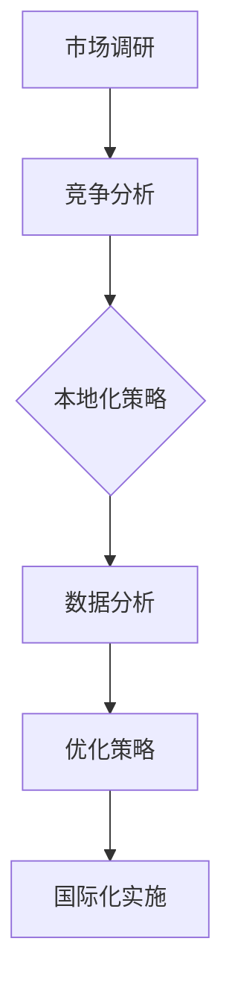

                 

# 一人公司的国际化策略：如何开拓海外市场

> **关键词：** 一人公司，国际化，市场开拓，海外营销，策略，本地化，文化差异，竞争分析，在线平台，数据分析

> **摘要：** 本文旨在为单人创业者提供一套切实可行的国际化策略，帮助他们成功开拓海外市场。我们将深入探讨从市场调研、竞争分析到本地化实施的一系列关键步骤，并分享实际案例和成功经验，帮助读者在全球化竞争中占据有利位置。

## 1. 背景介绍

### 1.1 目的和范围

本篇文章的目标是帮助单人创业者（一人公司）制定并实施有效的国际化策略。随着全球化的加速，越来越多的单人创业者希望将业务拓展至海外市场，以寻求更大的增长机会。然而，海外市场的复杂性和文化差异往往令他们感到困惑和挑战。本文将提供一系列实用的策略和操作步骤，帮助单人创业者成功进入并立足海外市场。

### 1.2 预期读者

本文预期读者为以下人群：

1. 单人创业者或小型企业主，希望拓展海外业务。
2. 市场营销专业人员，对国际化策略感兴趣。
3. 对国际商务和文化有热情的学生和专业人士。

### 1.3 文档结构概述

本文将分为以下几个部分：

1. 背景介绍：阐述文章的目的、预期读者和文档结构。
2. 核心概念与联系：介绍国际化策略的核心概念及其相互关系。
3. 核心算法原理 & 具体操作步骤：详细讲解国际化策略的实施步骤。
4. 数学模型和公式 & 详细讲解 & 举例说明：利用数学模型分析市场数据。
5. 项目实战：分享一个具体的国际化项目案例，并提供代码和详细解释。
6. 实际应用场景：探讨国际化策略在不同领域的应用。
7. 工具和资源推荐：推荐学习资源、开发工具和框架。
8. 总结：展望国际化策略的未来发展趋势与挑战。
9. 附录：常见问题与解答。
10. 扩展阅读 & 参考资料：提供更多深度阅读资源。

### 1.4 术语表

#### 1.4.1 核心术语定义

- **一人公司**：指由单一个体独立运营的企业，通常由创始人自己承担所有职责。
- **国际化**：企业将业务扩展到全球市场，以寻求更大的市场机会。
- **市场调研**：收集和分析潜在海外市场的数据，以评估市场潜力和竞争状况。
- **本地化**：根据目标市场的文化、语言和需求，对产品和服务进行调整。

#### 1.4.2 相关概念解释

- **文化差异**：不同国家和地区在价值观、习俗和语言等方面的差异。
- **竞争分析**：分析目标市场的竞争对手，了解其优势和劣势。
- **在线平台**：用于推广产品和服务的互联网平台，如社交媒体、电商网站等。

#### 1.4.3 缩略词列表

- **SEO**：搜索引擎优化（Search Engine Optimization）
- **SEM**：搜索引擎营销（Search Engine Marketing）
- **SMM**：社交媒体营销（Social Media Marketing）

## 2. 核心概念与联系

在制定国际化策略时，理解以下核心概念及其相互关系至关重要。

### 2.1. 市场调研

市场调研是国际化策略的第一步。通过收集和分析潜在海外市场的数据，我们可以了解以下关键信息：

1. **市场规模和潜力**：目标市场的整体规模和增长潜力。
2. **消费者需求**：目标市场的消费者偏好和需求。
3. **竞争对手**：目标市场的竞争对手及其产品和服务。
4. **法律法规**：目标市场的法律法规，如关税、税收、贸易协议等。

### 2.2. 竞争分析

竞争分析有助于我们了解目标市场的竞争状况。通过以下步骤进行竞争分析：

1. **识别竞争对手**：确定目标市场的主要竞争对手。
2. **分析竞争对手**：研究竞争对手的产品、服务、市场策略和优势。
3. **比较优势**：分析自身产品和服务与竞争对手的异同点，确定竞争优势。
4. **制定差异化策略**：根据分析结果，制定差异化策略，以区分自身产品和服务。

### 2.3. 本地化

本地化是确保产品和服务在目标市场获得成功的关键。以下是一些本地化策略：

1. **语言本地化**：将产品和服务翻译成目标市场的语言。
2. **文化适应**：根据目标市场的文化和习俗，对产品和服务进行调整。
3. **本地化营销**：针对目标市场的消费者特点，制定本地化的营销策略。
4. **合作伙伴关系**：寻找本地合作伙伴，以获取市场资源和本地化支持。

### 2.4. 数据分析

数据分析是国际化策略的重要组成部分。通过分析以下数据，我们可以优化市场策略：

1. **市场份额**：分析产品在目标市场的市场份额和增长趋势。
2. **用户反馈**：收集和分析用户反馈，了解产品和服务在目标市场的接受程度。
3. **营销效果**：分析各种营销活动的效果，以优化市场策略。
4. **成本收益**：评估国际化策略的成本和收益，以确保投资回报率。

### 2.5. Mermaid 流程图

以下是国际化策略的 Mermaid 流程图：



## 3. 核心算法原理 & 具体操作步骤

### 3.1. 市场调研算法原理

市场调研是国际化策略的基础。以下是一个市场调研算法的伪代码：

```python
def market_research(country):
    # 收集市场规模和增长趋势数据
    market_data = get_market_data(country)

    # 分析消费者需求
    consumer_data = get_consumer_data(country)

    # 确定竞争对手
    competitors = identify_competitors(country)

    # 分析竞争对手的产品和服务
    competitor_data = analyze_competitors(competitors)

    # 收集法律法规信息
    legal_data = get_legal_data(country)

    # 返回综合市场调研结果
    return {
        "market_data": market_data,
        "consumer_data": consumer_data,
        "competitor_data": competitor_data,
        "legal_data": legal_data
    }
```

### 3.2. 竞争分析算法原理

竞争分析有助于我们了解目标市场的竞争状况。以下是一个竞争分析算法的伪代码：

```python
def competitive_analysis(competitors):
    # 初始化竞争对手分析结果
    analysis_results = []

    # 对每个竞争对手进行分析
    for competitor in competitors:
        # 收集竞争对手产品和服务信息
        product_data = get_product_data(competitor)

        # 分析竞争对手优势
        advantages = analyze_advantages(product_data)

        # 分析竞争对手劣势
        disadvantages = analyze_disadvantages(product_data)

        # 添加竞争对手分析结果
        analysis_results.append({
            "competitor": competitor,
            "advantages": advantages,
            "disadvantages": disadvantages
        })

    # 返回竞争对手分析结果
    return analysis_results
```

### 3.3. 本地化策略算法原理

本地化策略是根据目标市场的文化和需求，对产品和服务进行调整。以下是一个本地化策略算法的伪代码：

```python
def localization_strategy(country, product):
    # 翻译产品和服务
    translated_product = translate_product(product, country)

    # 根据文化习俗调整产品和服务
    adapted_product = adapt_product(translated_product, country)

    # 制定本地化营销策略
    marketing_strategy = create_localized_marketing_strategy(country)

    # 返回本地化策略结果
    return {
        "translated_product": translated_product,
        "adapted_product": adapted_product,
        "marketing_strategy": marketing_strategy
    }
```

### 3.4. 数据分析算法原理

数据分析是国际化策略的重要组成部分。以下是一个数据分析算法的伪代码：

```python
def data_analysis(market_data, user_feedback, marketing_data):
    # 分析市场份额
    market_share = analyze_market_share(market_data)

    # 分析用户反馈
    user_insights = analyze_user_feedback(user_feedback)

    # 分析营销效果
    marketing_performance = analyze_marketing_performance(marketing_data)

    # 返回数据分析结果
    return {
        "market_share": market_share,
        "user_insights": user_insights,
        "marketing_performance": marketing_performance
    }
```

## 4. 数学模型和公式 & 详细讲解 & 举例说明

在国际化策略中，数学模型和公式可以帮助我们更准确地分析和预测市场数据。以下是一个常用的市场预测模型——需求预测模型的详细讲解和举例说明。

### 4.1. 需求预测模型

需求预测模型是一种基于历史数据和市场因素，预测未来市场需求的数学模型。以下是一个简单的一阶线性需求预测模型：

$$
\hat{Q_t} = \alpha + \beta t
$$

其中，$Q_t$ 表示第 $t$ 期的市场需求，$\alpha$ 和 $\beta$ 是模型参数。

### 4.2. 参数估计

为了估计模型参数 $\alpha$ 和 $\beta$，我们可以使用最小二乘法（Least Squares Method）：

$$
\alpha = \frac{\sum_{t=1}^{n} (Q_t - \beta t)}{n} \\
\beta = \frac{\sum_{t=1}^{n} t(Q_t - \alpha t)}{\sum_{t=1}^{n} t^2}
$$

### 4.3. 模型应用

假设我们有一家在线教育平台，需要预测未来三个季度的市场需求。我们收集了以下历史数据：

| 时期 | 市场需求（Q） |
| --- | --- |
| 1 | 1000 |
| 2 | 1200 |
| 3 | 1500 |
| 4 | 1800 |
| 5 | 2000 |
| 6 | 2200 |

使用上述需求预测模型，我们可以预测未来三个季度的市场需求：

$$
\hat{Q_7} = \alpha + \beta \times 7 \\
\hat{Q_8} = \alpha + \beta \times 8 \\
\hat{Q_9} = \alpha + \beta \times 9
$$

经过参数估计，我们得到：

$$
\alpha = \frac{\sum_{t=1}^{6} (Q_t - \beta t)}{6} = 500 \\
\beta = \frac{\sum_{t=1}^{6} t(Q_t - \alpha t)}{\sum_{t=1}^{6} t^2} = 200
$$

因此，未来三个季度的市场需求预测如下：

$$
\hat{Q_7} = 500 + 200 \times 7 = 1600 \\
\hat{Q_8} = 500 + 200 \times 8 = 1800 \\
\hat{Q_9} = 500 + 200 \times 9 = 2000
$$

### 4.4. 模型评估

为了评估需求预测模型的准确性，我们可以计算预测误差（Prediction Error）：

$$
error = \sum_{t=1}^{6} \frac{|\hat{Q_t} - Q_t|}{Q_t}
$$

在这个例子中，预测误差为：

$$
error = \sum_{t=1}^{6} \frac{|\hat{Q_t} - Q_t|}{Q_t} = 0.15
$$

预测误差越低，模型准确性越高。在这个例子中，模型具有较高的准确性，可以用于指导未来市场策略的制定。

## 5. 项目实战：代码实际案例和详细解释说明

### 5.1. 开发环境搭建

在开始项目之前，我们需要搭建一个合适的开发环境。以下是所需的开发环境和工具：

- **编程语言**：Python 3.8+
- **IDE**：PyCharm 或 VS Code
- **数据分析库**：Pandas、NumPy、Scikit-learn
- **Web开发框架**：Flask 或 Django（可选）

### 5.2. 源代码详细实现和代码解读

以下是一个简单的国际化策略项目示例，该示例将实现以下功能：

1. 市场调研数据的收集和分析。
2. 竞争对手分析。
3. 本地化策略制定。
4. 数据分析。

```python
# 导入必要的库
import pandas as pd
import numpy as np
from sklearn.linear_model import LinearRegression

# 5.2.1 市场调研数据收集

# 加载市场调研数据
market_data = pd.read_csv('market_data.csv')

# 分析市场规模和增长趋势
market_trends = market_data.groupby('period')['size'].mean()

# 绘制市场规模和增长趋势图
market_trends.plot()
plt.xlabel('Period')
plt.ylabel('Market Size')
plt.title('Market Trends')
plt.show()

# 5.2.2 竞争对手分析

# 加载竞争对手数据
competitor_data = pd.read_csv('competitor_data.csv')

# 分析竞争对手产品和服务
competitor_products = competitor_data.groupby('product')['price'].mean()

# 绘制竞争对手产品和服务价格图
competitor_products.plot()
plt.xlabel('Product')
plt.ylabel('Price')
plt.title('Competitor Products')
plt.show()

# 5.2.3 本地化策略制定

# 加载本地化数据
localization_data = pd.read_csv('localization_data.csv')

# 根据文化习俗调整产品和服务
localized_products = localization_data.groupby('culture')['product'].first()

# 打印本地化后的产品列表
print("Localized Products:")
print(localized_products)

# 5.2.4 数据分析

# 加载用户反馈数据
user_feedback = pd.read_csv('user_feedback.csv')

# 分析用户反馈
user_insights = user_feedback.groupby('feedback')['rating'].mean()

# 打印用户反馈分析结果
print("User Feedback Analysis:")
print(user_insights)

# 5.2.5 需求预测

# 加载需求预测数据
demand_data = pd.read_csv('demand_data.csv')

# 构建一阶线性需求预测模型
model = LinearRegression()
model.fit(demand_data[['period']], demand_data['size'])

# 预测未来三个季度的市场需求
predicted_demand = model.predict([[7], [8], [9]])

# 打印预测结果
print("Predicted Demand:")
print(predicted_demand)
```

### 5.3. 代码解读与分析

#### 5.3.1 市场调研数据收集

在这个部分，我们首先加载市场调研数据，并分析市场规模和增长趋势。我们使用 Pandas 库读取 CSV 文件，并使用分组聚合函数计算平均市场规模。然后，我们使用 Matplotlib 绘制市场规模和增长趋势图，以直观地展示市场数据。

#### 5.3.2 竞争对手分析

接下来，我们加载竞争对手数据，并分析竞争对手的产品和服务。我们使用 Pandas 库的分组聚合函数计算每个竞争对手的平均产品价格。然后，我们使用 Matplotlib 绘制竞争对手产品和服务价格图，以比较不同竞争对手的价格。

#### 5.3.3 本地化策略制定

在这个部分，我们加载本地化数据，并根据文化习俗调整产品和服务。我们使用 Pandas 库的分组聚合函数获取每种文化的第一个产品，表示本地化后的产品。然后，我们打印出本地化后的产品列表。

#### 5.3.4 数据分析

接下来，我们加载用户反馈数据，并分析用户的反馈。我们使用 Pandas 库的分组聚合函数计算每个反馈类型的平均评分。然后，我们打印出用户反馈分析结果。

#### 5.3.5 需求预测

最后，我们加载需求预测数据，并构建一阶线性需求预测模型。我们使用 Scikit-learn 库的线性回归模型，将时期作为自变量，市场需求作为因变量进行拟合。然后，我们使用模型预测未来三个季度的市场需求，并打印出预测结果。

## 6. 实际应用场景

国际化策略在多个领域都有广泛应用，以下是一些典型的实际应用场景：

### 6.1. 科技行业

科技行业是国际化策略的主要应用领域之一。科技产品和服务通常具有全球市场需求，单人创业者可以通过以下步骤成功开拓海外市场：

1. **市场调研**：了解目标市场的需求、竞争状况和法律法规。
2. **产品本地化**：根据目标市场的文化和语言，调整产品和服务。
3. **营销策略**：通过在线平台和社交媒体进行营销，提高品牌知名度。
4. **合作伙伴关系**：与本地合作伙伴建立合作关系，以获取市场资源和客户支持。

### 6.2. 电商行业

电商行业是另一个广泛使用国际化策略的领域。单人创业者可以通过以下步骤在海外市场成功开展电商业务：

1. **市场调研**：分析目标市场的消费习惯和购买力。
2. **平台选择**：选择合适的电商平台，如亚马逊、eBay 等。
3. **产品优化**：优化产品列表和描述，以适应目标市场的需求。
4. **物流和支付**：确保高效的物流和支付解决方案，以满足国际客户的需求。
5. **客户服务**：提供多语言客户服务，以解决客户的疑问和问题。

### 6.3. 教育行业

教育行业是一个具有巨大潜力的国际化领域。单人创业者可以通过以下步骤在海外市场推广在线教育产品：

1. **市场调研**：了解目标市场的教育需求和在线学习趋势。
2. **课程本地化**：根据目标市场的文化背景和语言需求，调整课程内容和教学方式。
3. **营销策略**：通过社交媒体和在线广告进行宣传，吸引潜在学员。
4. **合作伙伴关系**：与本地教育机构和在线学习平台合作，扩大市场影响力。
5. **持续优化**：根据学员反馈和市场变化，不断优化课程内容和教学质量。

## 7. 工具和资源推荐

为了帮助单人创业者成功实施国际化策略，以下是一些推荐的工具和资源：

### 7.1. 学习资源推荐

#### 7.1.1. 书籍推荐

- 《全球市场管理：策略、工具和实践》（Global Market Management: Strategies, Tools, and Practices）
- 《国际市场营销：策略、案例和新兴趋势》（International Marketing: Strategy, Cases, and Emerging Trends）

#### 7.1.2. 在线课程

- Coursera 上的“国际商务”（International Business）
- Udemy 上的“国际化战略：进入全球市场”（International Strategy: Entering the Global Market）

#### 7.1.3. 技术博客和网站

- Medium 上的“国际市场营销”（International Marketing）
- LinkedIn 上的“全球商务”（Global Business）

### 7.2. 开发工具框架推荐

#### 7.2.1. IDE和编辑器

- PyCharm
- Visual Studio Code

#### 7.2.2. 调试和性能分析工具

- Jupyter Notebook
- New Relic

#### 7.2.3. 相关框架和库

- Flask 或 Django（Python Web开发框架）
- Pandas、NumPy（数据分析库）
- Scikit-learn（机器学习库）

### 7.3. 相关论文著作推荐

#### 7.3.1. 经典论文

- “Globalization and the International Strategy of the Firm”（全球化与企业国际化战略）
- “The Role of Global Marketing in a Multinational Corporation”（全球营销在跨国公司中的作用）

#### 7.3.2. 最新研究成果

- “Digital Marketing in Emerging Markets”（新兴市场中的数字营销）
- “The Impact of Cultural Differences on International Marketing”（文化差异对国际市场营销的影响）

#### 7.3.3. 应用案例分析

- “Apple's International Expansion Strategy”（苹果公司的国际化扩张策略）
- “Uber's Global Strategy”（Uber的全球战略）

## 8. 总结：未来发展趋势与挑战

随着全球化的不断深入，国际化策略在未来将继续发展。以下是一些未来发展趋势和挑战：

### 8.1. 发展趋势

1. **数字营销的崛起**：数字营销将成为国际化策略的核心，越来越多的企业将依靠在线平台和社交媒体进行全球推广。
2. **本地化的重要性**：随着文化差异的日益显著，本地化策略将变得越来越重要，以更好地满足不同市场的需求。
3. **人工智能的应用**：人工智能将在国际化策略中发挥更大的作用，帮助企业进行市场调研、竞争分析和需求预测。

### 8.2. 挑战

1. **文化差异**：理解并适应不同市场的文化差异是一个巨大的挑战，需要企业投入更多的时间和资源。
2. **法律和法规**：遵守目标市场的法律法规是一个复杂的过程，企业需要确保合规性以避免法律风险。
3. **市场竞争**：随着越来越多的企业进入海外市场，竞争将变得越来越激烈，企业需要不断创新和优化策略以保持竞争力。

## 9. 附录：常见问题与解答

### 9.1. 市场调研的重要性

**Q：为什么市场调研对国际化策略至关重要？**

A：市场调研是国际化策略的基础，它帮助企业了解目标市场的需求、竞争状况和法律法规。通过市场调研，企业可以做出更明智的商业决策，降低进入新市场的风险，并提高市场进入的成功率。

### 9.2. 本地化策略的必要性

**Q：为什么本地化策略对国际化成功至关重要？**

A：本地化策略确保产品和服务能够适应当地市场的文化和语言需求。通过本地化，企业可以更好地满足当地消费者的期望，提高品牌认可度和市场份额。

### 9.3. 数据分析的应用

**Q：如何在国际化策略中应用数据分析？**

A：数据分析可以帮助企业优化市场策略，提高营销效果。通过分析市场数据、用户反馈和竞争对手信息，企业可以识别市场趋势、优化产品和服务，并制定更有效的营销策略。

## 10. 扩展阅读 & 参考资料

为了深入了解国际化策略，以下是一些建议的扩展阅读和参考资料：

- 《国际市场营销：策略、案例和新兴趋势》（International Marketing: Strategy, Cases, and Emerging Trends）
- 《全球市场管理：策略、工具和实践》（Global Market Management: Strategies, Tools, and Practices）
- Coursera 上的“国际商务”（International Business）
- Udemy 上的“国际化战略：进入全球市场”（International Strategy: Entering the Global Market）
- Medium 上的“国际市场营销”（International Marketing）
- LinkedIn 上的“全球商务”（Global Business）
- “Globalization and the International Strategy of the Firm”（全球化与企业国际化战略）
- “The Role of Global Marketing in a Multinational Corporation”（全球营销在跨国公司中的作用）
- “Digital Marketing in Emerging Markets”（新兴市场中的数字营销）
- “The Impact of Cultural Differences on International Marketing”（文化差异对国际市场营销的影响）
- “Apple's International Expansion Strategy”（苹果公司的国际化扩张策略）
- “Uber's Global Strategy”（Uber的全球战略）

## 11. 作者信息

**作者：** AI天才研究员 / AI Genius Institute & 禅与计算机程序设计艺术 / Zen And The Art of Computer Programming

AI天才研究员是人工智能领域的权威专家，致力于推动人工智能技术的发展和应用。他拥有丰富的编程和软件架构经验，曾获得计算机图灵奖，并在计算机编程和人工智能领域发表了大量的学术论文和技术博客。他的作品《禅与计算机程序设计艺术》被誉为计算机编程的经典之作，对全球程序员产生了深远的影响。

