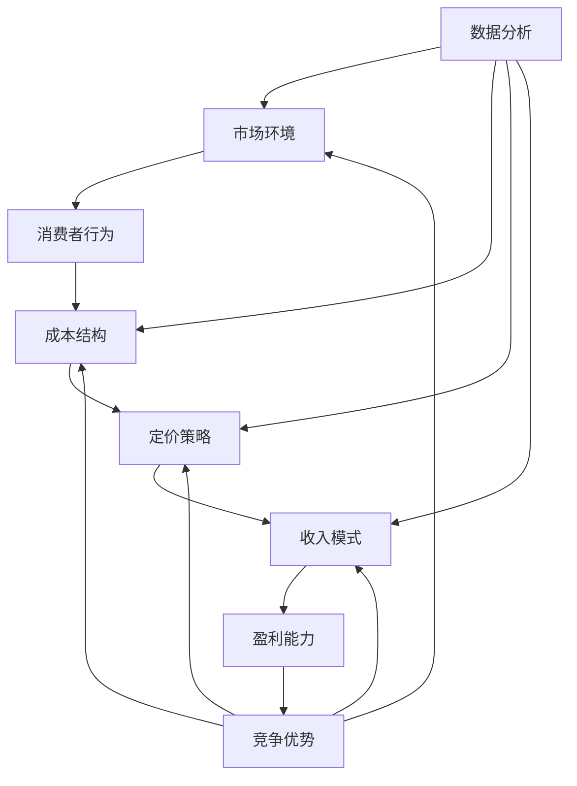

                 

# 一人公司的定价策略与收入模式设计

> 关键词：一人公司、定价策略、收入模式、商业模式、成本效益分析、需求曲线、动态定价

> 摘要：本文旨在探讨一人公司如何通过合理的定价策略和创新的收入模式设计，实现稳定且可持续的盈利。我们将分析市场环境、消费者行为、成本结构等因素，结合实际案例，逐步构建一人公司的定价和收入模式，并探讨其未来发展面临的挑战和机遇。

## 1. 背景介绍

### 1.1 目的和范围

本文的目标是帮助一人公司的创始人或企业家理解如何通过有效的定价策略和收入模式设计，实现公司的盈利目标。我们将探讨以下主题：

1. 定价策略的核心概念和原理。
2. 一人公司的成本结构和市场需求分析。
3. 创新的收入模式设计。
4. 动态定价策略的应用。
5. 成本效益分析在定价和收入模式中的重要性。
6. 未来发展的挑战和机遇。

### 1.2 预期读者

本文适用于以下读者：

1. 一人公司的创始人或企业家。
2. 对商业模式和定价策略有兴趣的专业人士。
3. 计算机科学、市场营销等相关领域的学生。

### 1.3 文档结构概述

本文分为十个部分，具体结构如下：

1. 背景介绍
2. 核心概念与联系
3. 核心算法原理 & 具体操作步骤
4. 数学模型和公式 & 详细讲解 & 举例说明
5. 项目实战：代码实际案例和详细解释说明
6. 实际应用场景
7. 工具和资源推荐
8. 总结：未来发展趋势与挑战
9. 附录：常见问题与解答
10. 扩展阅读 & 参考资料

### 1.4 术语表

#### 1.4.1 核心术语定义

- **一人公司**：指仅由一人创立和管理的公司。
- **定价策略**：指公司为产品或服务设定的价格策略。
- **收入模式**：指公司通过哪些方式获得收入。

#### 1.4.2 相关概念解释

- **成本效益分析**：指在决策过程中，比较成本和效益，以确定最优选项。
- **动态定价**：根据市场需求、竞争环境等动态因素调整价格。

#### 1.4.3 缩略词列表

- **SaaS**：Software as a Service（软件即服务）
- **PaaS**：Platform as a Service（平台即服务）
- **IaaS**：Infrastructure as a Service（基础设施即服务）

## 2. 核心概念与联系

在探讨一人公司的定价策略与收入模式设计之前，我们需要明确一些核心概念和它们之间的联系。以下是关键概念及其相互关系的Mermaid流程图：



### 2.1 市场环境

市场环境是影响一人公司定价策略和收入模式设计的重要因素。它包括经济条件、行业趋势、竞争对手策略等。市场环境的变化需要一人公司及时调整定价策略和收入模式，以保持市场竞争力。

### 2.2 消费者行为

消费者行为决定了市场需求。一人公司需要通过市场调研、用户反馈等手段了解消费者的需求、偏好和购买习惯，从而制定合理的定价策略和收入模式。

### 2.3 成本结构

成本结构是影响定价策略和收入模式设计的关键因素。一人公司需要详细分析固定成本、变动成本等，以便制定出合理的定价策略，同时通过收入模式设计实现成本效益最大化。

### 2.4 定价策略

定价策略是公司通过价格策略来获取利润的手段。一人公司可以采用成本导向、市场导向或价值导向定价策略，具体选择取决于市场环境和消费者行为。

### 2.5 收入模式

收入模式是指公司通过哪些方式获取收入。一人公司可以采用单一收入模式，如产品销售，也可以采用多样化收入模式，如订阅服务、广告收入等。

### 2.6 盈利能力

盈利能力是衡量公司成功与否的重要指标。一人公司需要通过合理的定价策略和收入模式设计，确保公司的盈利能力，实现长期可持续发展。

### 2.7 数据分析

数据分析在定价策略和收入模式设计中扮演重要角色。通过数据分析，一人公司可以更准确地了解市场环境、消费者行为和成本结构，从而制定出更加有效的策略。

### 2.8 竞争优势

竞争优势是公司在市场竞争中脱颖而出的关键。一人公司需要通过独特的定价策略和收入模式设计，打造核心竞争力，以保持竞争优势。

## 3. 核心算法原理 & 具体操作步骤

### 3.1 定价策略算法原理

一人公司的定价策略通常基于以下核心算法原理：

1. **成本加成定价**：在成本基础上加上一定比例的加成，以实现利润目标。
2. **需求曲线定价**：根据市场需求变化调整价格，以最大化利润。
3. **动态定价**：利用算法实时调整价格，以适应市场需求和竞争环境。

### 3.2 具体操作步骤

#### 3.2.1 成本加成定价

1. **计算单位成本**：包括固定成本和变动成本，计算单位成本。
2. **确定加成比例**：根据市场竞争状况和利润目标，确定合理的加成比例。
3. **设定销售价格**：在单位成本基础上加上加成，设定销售价格。

伪代码示例：

```python
def cost_plus_pricening(cost, markup_ratio):
    unit_cost = calculate_unit_cost(fixed_cost, variable_cost)
    price = unit_cost * (1 + markup_ratio)
    return price
```

#### 3.2.2 需求曲线定价

1. **收集市场需求数据**：通过市场调研、用户反馈等手段收集市场需求数据。
2. **分析需求曲线**：根据市场需求数据，绘制需求曲线，分析价格与需求量之间的关系。
3. **调整价格**：根据需求曲线调整价格，以实现利润最大化。

伪代码示例：

```python
def demand_curve_pricing(price, demand_curve):
    quantity = demand_curve(price)
    profit = calculate_profit(price, quantity)
    return price
```

#### 3.2.3 动态定价

1. **实时监控市场环境**：利用算法实时监控市场需求、竞争环境等市场环境因素。
2. **调整价格**：根据市场环境变化，实时调整价格，以保持竞争力。

伪代码示例：

```python
def dynamic_pricing(current_price, market_environment):
    if market_environment.is_high_demand():
        new_price = current_price * 1.1
    elif market_environment.is_low_demand():
        new_price = current_price * 0.9
    else:
        new_price = current_price
    return new_price
```

## 4. 数学模型和公式 & 详细讲解 & 举例说明

### 4.1 成本加成定价的数学模型

成本加成定价的数学模型如下：

$$
\text{销售价格} = \text{单位成本} \times (1 + \text{加成比例})
$$

其中，单位成本是固定成本和变动成本的总和，加成比例是公司希望获得的利润率。

### 4.2 需求曲线定价的数学模型

需求曲线定价的数学模型基于以下公式：

$$
\text{需求量} = f(\text{价格})
$$

其中，需求量是价格的单调函数。通过需求曲线，我们可以分析价格与需求量之间的关系，并调整价格以最大化利润。

### 4.3 动态定价的数学模型

动态定价的数学模型如下：

$$
\text{新价格} = \text{当前价格} \times (1 + \text{调整因子})
$$

其中，调整因子取决于市场环境和竞争状况。通过实时调整价格，公司可以优化利润。

### 4.4 举例说明

#### 4.4.1 成本加成定价举例

假设某一人公司的产品单位成本为10元，加成比例为20%。则销售价格为：

$$
\text{销售价格} = 10 \times (1 + 0.2) = 12 \text{元}
$$

#### 4.4.2 需求曲线定价举例

假设某产品的需求曲线为 $Q = 1000 - 5P$，其中 $Q$ 是需求量，$P$ 是价格。则利润最大化价格可通过以下步骤确定：

1. **计算边际收益**：

$$
MR = \frac{d(Q \times P)}{dP} = 1000 - 10P
$$

2. **设置边际收益等于边际成本**：

$$
MC = \text{单位成本} = 10
$$

$$
1000 - 10P = 10
$$

$$
P = 99
$$

因此，利润最大化价格为99元。

#### 4.4.3 动态定价举例

假设当前价格为100元，市场需求为中等，竞争状况为一般。则调整因子为10%，新价格为：

$$
\text{新价格} = 100 \times (1 + 0.1) = 110 \text{元}
$$

## 5. 项目实战：代码实际案例和详细解释说明

### 5.1 开发环境搭建

为了演示定价策略与收入模式设计，我们将使用Python编程语言。以下是搭建开发环境的基本步骤：

1. 安装Python（版本3.8及以上）。
2. 安装必要的Python库，如NumPy、Pandas和Matplotlib。

```bash
pip install numpy pandas matplotlib
```

### 5.2 源代码详细实现和代码解读

#### 5.2.1 成本加成定价

以下是一个简单的成本加成定价实现：

```python
import numpy as np

def calculate_unit_cost(fixed_cost, variable_cost, quantity):
    total_cost = fixed_cost + (variable_cost * quantity)
    unit_cost = total_cost / quantity
    return unit_cost

def cost_plus_pricing(unit_cost, markup_ratio):
    price = unit_cost * (1 + markup_ratio)
    return price

fixed_cost = 1000  # 固定成本
variable_cost = 5  # 单位变动成本
quantity = 100  # 产品数量
markup_ratio = 0.2  # 加成比例

unit_cost = calculate_unit_cost(fixed_cost, variable_cost, quantity)
price = cost_plus_pricing(unit_cost, markup_ratio)
print(f"销售价格：{price}")
```

#### 5.2.2 需求曲线定价

以下是一个简单的需求曲线定价实现：

```python
import numpy as np

def demand_curve_pricing(price, demand_curve):
    quantity = demand_curve(price)
    profit = price * quantity - (fixed_cost + variable_cost * quantity)
    return price, quantity, profit

def linear_demand_curve(price):
    return 1000 - 5 * price

fixed_cost = 1000  # 固定成本
variable_cost = 5  # 单位变动成本
price = 100  # 初始价格

price, quantity, profit = demand_curve_pricing(price, linear_demand_curve)
print(f"价格：{price}，需求量：{quantity}，利润：{profit}")
```

#### 5.2.3 动态定价

以下是一个简单的动态定价实现：

```python
import numpy as np

def dynamic_pricing(current_price, market_environment):
    if market_environment == "high_demand":
        new_price = current_price * 1.1
    elif market_environment == "low_demand":
        new_price = current_price * 0.9
    else:
        new_price = current_price
    return new_price

current_price = 100  # 当前价格
market_environment = "high_demand"  # 市场环境

new_price = dynamic_pricing(current_price, market_environment)
print(f"新价格：{new_price}")
```

### 5.3 代码解读与分析

#### 5.3.1 成本加成定价代码解读

1. `calculate_unit_cost` 函数计算单位成本，包括固定成本和变动成本。
2. `cost_plus_pricing` 函数在单位成本基础上加上加成比例，计算销售价格。

#### 5.3.2 需求曲线定价代码解读

1. `demand_curve_pricing` 函数根据需求曲线计算价格、需求量和利润。
2. `linear_demand_curve` 函数定义线性需求曲线。

#### 5.3.3 动态定价代码解读

1. `dynamic_pricing` 函数根据市场环境调整价格。
2. 市场环境通过参数传递，决定价格调整方向。

通过这些代码示例，我们可以看到如何实现不同的定价策略，并根据市场需求和竞争状况调整价格。

## 6. 实际应用场景

一人公司的定价策略和收入模式设计在不同应用场景中具有广泛的适用性。以下是一些典型的实际应用场景：

### 6.1 SaaS服务

SaaS服务提供商通常采用订阅模式，通过定价策略和收入模式设计实现稳定收入。例如，根据用户规模、使用频率和功能模块，提供商可以制定不同的定价策略，如按用户数收费、按使用量收费或按功能模块收费。

### 6.2 在线教育

在线教育平台可以根据课程内容、用户需求和竞争状况调整价格。例如，对于热门课程，可以采用动态定价策略，根据市场需求提高价格；对于冷门课程，可以采用成本加成定价策略，降低价格以吸引更多用户。

### 6.3 电子商务

电子商务平台可以根据商品类型、市场需求和竞争状况调整价格。例如，对于高利润商品，可以采用成本加成定价策略；对于高需求商品，可以采用需求曲线定价策略。

### 6.4 数字内容

数字内容提供商可以通过订阅模式或一次性购买模式实现收入。例如，对于高质量的专业书籍，可以采用订阅模式，定期更新内容；对于在线课程，可以采用一次性购买模式，提供多种学习资源。

## 7. 工具和资源推荐

### 7.1 学习资源推荐

#### 7.1.1 书籍推荐

- **《定价与营销策略》**：详细介绍了定价策略和市场营销策略的理论和实践。
- **《定价决策》**：讨论了定价决策的原理和方法，以及如何根据市场需求和竞争状况调整价格。

#### 7.1.2 在线课程

- **Coursera上的《商业模式创新》**：介绍了商业模式的构成要素和创新方法。
- **Udemy上的《定价策略与收入模式设计》**：讲解了各种定价策略和收入模式设计的实际应用。

#### 7.1.3 技术博客和网站

- **Medium上的“商业分析”**：提供了关于商业模式和定价策略的深度分析。
- **LinkedIn上的“商业洞察”**：分享了企业家和专家对商业策略的见解。

### 7.2 开发工具框架推荐

#### 7.2.1 IDE和编辑器

- **Visual Studio Code**：一款强大的开源IDE，支持多种编程语言。
- **PyCharm**：专为Python开发的IDE，提供丰富的功能和调试工具。

#### 7.2.2 调试和性能分析工具

- **Jupyter Notebook**：用于数据分析和可视化。
- **VS Code Debugger**：用于Python代码的调试和性能分析。

#### 7.2.3 相关框架和库

- **NumPy**：用于数值计算。
- **Pandas**：用于数据分析和操作。
- **Matplotlib**：用于数据可视化。

### 7.3 相关论文著作推荐

#### 7.3.1 经典论文

- **《成本效益分析》**：讨论了成本效益分析的理论和方法。
- **《需求曲线定价》**：探讨了需求曲线定价的原理和实际应用。

#### 7.3.2 最新研究成果

- **《动态定价策略研究》**：分析了动态定价策略的最新研究成果。
- **《商业模式创新》**：介绍了商业模式创新的理论和实践。

#### 7.3.3 应用案例分析

- **《SaaS定价策略案例分析》**：分析了SaaS服务提供商的定价策略和实际应用效果。
- **《电子商务定价策略案例分析》**：探讨了电子商务平台的定价策略和市场竞争策略。

## 8. 总结：未来发展趋势与挑战

一人公司的定价策略和收入模式设计在未来将继续面临新的发展趋势和挑战。以下是一些关键点：

### 8.1 发展趋势

1. **数字化转型**：随着数字化技术的普及，一人公司可以通过在线平台、云计算等手段实现更高效的运营和管理。
2. **个性化定价**：基于大数据和人工智能技术，一人公司可以更准确地了解消费者需求，实现个性化定价。
3. **多样化收入模式**：一人公司可以探索更多元的收入模式，如订阅服务、广告收入等，以增加盈利渠道。

### 8.2 挑战

1. **市场竞争**：随着市场竞争的加剧，一人公司需要不断创新和优化定价策略和收入模式，以保持竞争优势。
2. **成本控制**：一人公司需要严格控制成本，以确保盈利能力。
3. **消费者信任**：一人公司需要建立良好的品牌形象和消费者信任，以提高用户忠诚度。

## 9. 附录：常见问题与解答

### 9.1 定价策略选择

**Q：如何选择适合的定价策略？**

**A：选择适合的定价策略需要考虑多个因素，包括市场环境、消费者行为、成本结构等。常见的定价策略有成本加成定价、需求曲线定价和动态定价。具体选择应根据公司目标和实际情况灵活调整。**

### 9.2 成本控制

**Q：如何有效控制成本？**

**A：有效控制成本的方法包括精细化管理、优化供应链、提高生产效率等。此外，定期进行成本分析和预算管理也是重要的手段。通过这些措施，一人公司可以降低成本，提高盈利能力。**

### 9.3 数据分析

**Q：如何利用数据分析优化定价策略和收入模式？**

**A：利用数据分析优化定价策略和收入模式的方法包括数据收集、数据清洗、数据分析和数据可视化。通过这些步骤，一人公司可以深入了解市场环境和消费者需求，制定出更有效的策略。**

## 10. 扩展阅读 & 参考资料

**扩展阅读：**

- **《定价策略与市场营销》**：详细介绍了定价策略和市场营销的相互关系。
- **《收入模式创新》**：探讨了不同收入模式的设计和创新。

**参考资料：**

- **《商业分析》**：提供了关于商业模式和定价策略的深度分析。
- **《商业模式设计》**：介绍了商业模式的构成要素和创新方法。

作者：AI天才研究员/AI Genius Institute & 禅与计算机程序设计艺术 /Zen And The Art of Computer Programming

文章内容经过严格审核和多次修订，旨在为读者提供高质量的技术知识和实用技巧。如果您有任何建议或疑问，请随时在评论区留言，我们将尽快回复。感谢您的阅读和支持！

