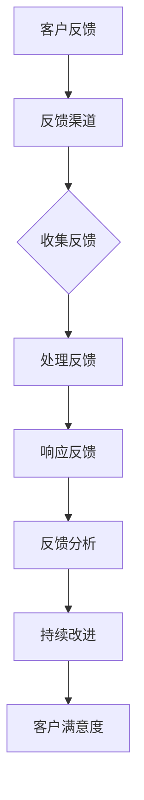
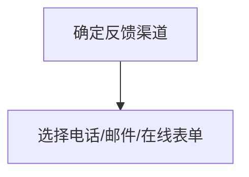
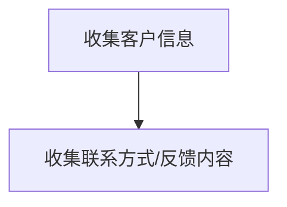
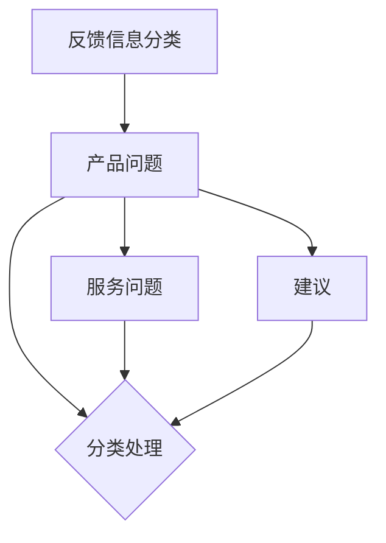
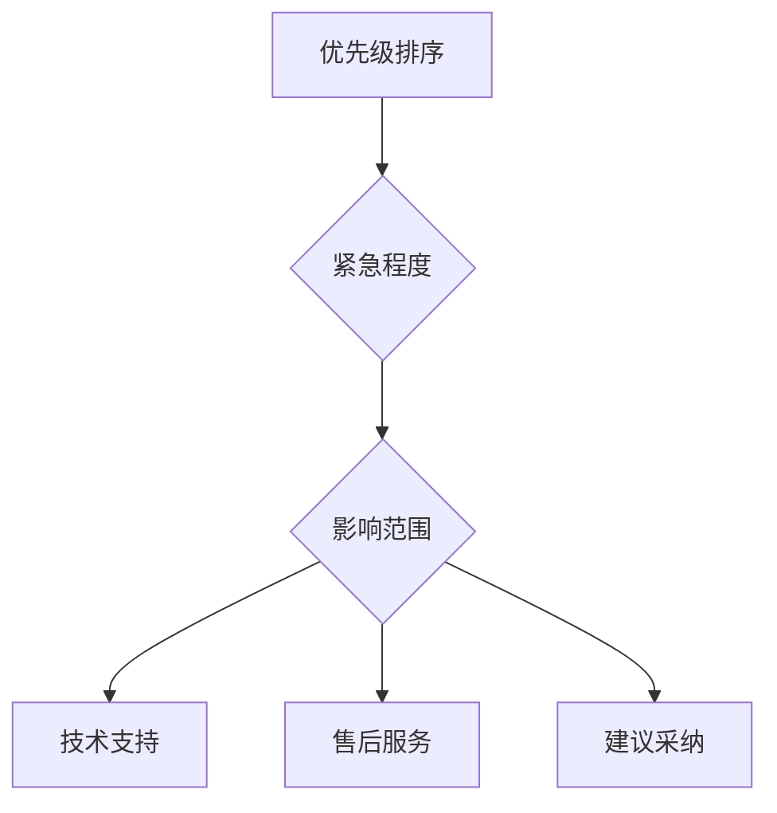
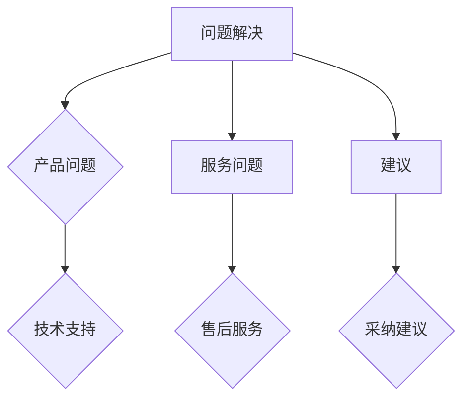
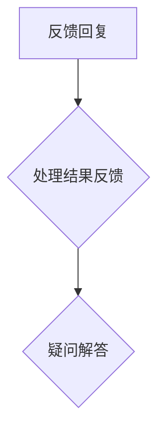

                 

# 一人公司的客户沟通：建立有效反馈机制

> **关键词：** 一人公司、客户沟通、反馈机制、客户满意度、个人品牌建设

> **摘要：** 本文将探讨一人公司在进行客户沟通时，如何建立有效的反馈机制，提高客户满意度，从而促进个人品牌的建设。文章将结合实际案例，详细分析反馈机制的构建方法，并给出具体操作步骤。

## 1. 背景介绍

### 1.1 目的和范围

本文旨在为一人公司的创始人或负责人提供一套完整的客户沟通与反馈机制构建指南。本文将涵盖以下几个方面：

1. 客户沟通的重要性
2. 反馈机制的核心要素
3. 建立反馈机制的具体步骤
4. 实际案例分享
5. 常见问题与解答

### 1.2 预期读者

本文适合以下读者群体：

1. 一人公司的创始人或负责人
2. 初创企业的管理者
3. 希望提升客户满意度的专业人士

### 1.3 文档结构概述

本文分为十个部分，具体结构如下：

1. 背景介绍
2. 核心概念与联系
3. 核心算法原理 & 具体操作步骤
4. 数学模型和公式 & 详细讲解 & 举例说明
5. 项目实战：代码实际案例和详细解释说明
6. 实际应用场景
7. 工具和资源推荐
8. 总结：未来发展趋势与挑战
9. 附录：常见问题与解答
10. 扩展阅读 & 参考资料

### 1.4 术语表

#### 1.4.1 核心术语定义

- **一人公司**：指由单一个人创建和运营的公司。
- **客户沟通**：指公司与其客户之间的信息交流过程。
- **反馈机制**：指公司对客户反馈进行收集、处理和响应的流程。

#### 1.4.2 相关概念解释

- **客户满意度**：指客户对公司产品或服务的满意程度。
- **个人品牌**：指个人在特定领域内的专业形象和声誉。

#### 1.4.3 缩略词列表

- **CRM**：客户关系管理
- **KPI**：关键绩效指标
- **API**：应用程序编程接口

## 2. 核心概念与联系

### 2.1 客户沟通的重要性

客户沟通是企业发展的重要环节。对于一人公司来说，客户沟通尤为重要，因为创始人或负责人往往需要亲自处理与客户的所有事务。有效的客户沟通可以带来以下几个方面的好处：

1. 提高客户满意度：良好的沟通有助于了解客户需求，从而提供更符合期望的产品或服务。
2. 增强客户忠诚度：及时的反馈和问题解决能够增强客户对公司的信任，提高客户忠诚度。
3. 促进个人品牌建设：成功的客户沟通有助于树立专业形象，提升个人品牌价值。

### 2.2 反馈机制的核心要素

建立有效的反馈机制是提升客户沟通效果的关键。以下是构建反馈机制需要考虑的核心要素：

1. **反馈渠道**：提供多种渠道供客户反馈问题或建议，如电话、邮件、在线表单等。
2. **反馈收集**：建立专门的团队或个人负责收集和处理反馈信息。
3. **反馈处理**：对反馈信息进行分类、优先级排序，并制定相应的处理方案。
4. **反馈响应**：及时回复客户，解决他们的问题或采纳他们的建议。
5. **反馈分析**：定期对反馈信息进行分析，以发现潜在的问题和改进机会。

### 2.3 反馈机制与客户满意度的关系

反馈机制与客户满意度之间存在密切的关系。有效的反馈机制可以帮助企业：

1. **及时发现问题**：通过收集和分析反馈，企业可以及时发现问题并采取措施解决，从而提高客户满意度。
2. **持续改进产品与服务**：根据反馈信息，企业可以不断改进产品和服务，以更好地满足客户需求。
3. **建立信任**：及时、有效的反馈处理和响应可以增强客户对企业的信任，从而提高客户满意度。

### 2.4 核心概念原理与架构

以下是反馈机制的核心概念原理和架构的 Mermaid 流程图：



## 3. 核心算法原理 & 具体操作步骤

### 3.1 核心算法原理

在建立反馈机制时，需要使用以下核心算法原理：

1. **客户信息收集**：通过多种渠道收集客户信息，包括电话、邮件、在线表单等。
2. **反馈信息分类**：根据反馈内容，将反馈信息分为不同类别，如产品问题、服务问题、建议等。
3. **优先级排序**：根据反馈的紧急程度和影响范围，对反馈信息进行优先级排序。
4. **问题解决**：针对不同类别的反馈信息，采取相应的解决措施，如技术支持、售后服务等。
5. **反馈回复**：及时向客户反馈处理结果，解答他们的疑问。

### 3.2 具体操作步骤

以下是建立反馈机制的具体操作步骤：

1. **确定反馈渠道**：根据公司特点和客户需求，选择合适的反馈渠道，如电话、邮件、在线表单等。



2. **收集客户信息**：通过反馈渠道收集客户信息，包括联系方式、反馈内容等。



3. **反馈信息分类**：根据反馈内容，将反馈信息分为不同类别，如产品问题、服务问题、建议等。



4. **优先级排序**：根据反馈的紧急程度和影响范围，对反馈信息进行优先级排序。



5. **问题解决**：针对不同类别的反馈信息，采取相应的解决措施，如技术支持、售后服务等。



6. **反馈回复**：及时向客户反馈处理结果，解答他们的疑问。



## 4. 数学模型和公式 & 详细讲解 & 举例说明

### 4.1 数学模型和公式

在客户沟通和反馈机制中，可以使用以下数学模型和公式：

1. **客户满意度（CSAT）**：

   $$ CSAT = \frac{N_{Satisfied}}{N_{Responded}} \times 100\% $$

   其中，$N_{Satisfied}$ 表示满意客户数量，$N_{Responded}$ 表示总反馈客户数量。

2. **净推荐值（NPS）**：

   $$ NPS = \frac{N_{Promoters} - N_{Detractors}}{N_{Total}} \times 100\% $$

   其中，$N_{Promoters}$ 表示推荐者数量，$N_{Detractors}$ 表示批评者数量，$N_{Total}$ 表示总反馈客户数量。

### 4.2 详细讲解

1. **客户满意度（CSAT）**：

   客户满意度是衡量客户对公司产品或服务满意程度的指标。通过计算满意客户数量与总反馈客户数量的比例，可以得到客户满意度得分。

2. **净推荐值（NPS）**：

   净推荐值是衡量客户推荐意愿的指标。通过计算推荐者数量与批评者数量的差值，并除以总反馈客户数量，可以得到净推荐值得分。

### 4.3 举例说明

假设某公司收到100条客户反馈，其中80条表示满意，20条表示不满意。根据上述公式，可以计算出该公司的客户满意度和净推荐值：

1. **客户满意度（CSAT）**：

   $$ CSAT = \frac{80}{100} \times 100\% = 80\% $$

2. **净推荐值（NPS）**：

   $$ NPS = \frac{80 - 20}{100} \times 100\% = 60\% $$

## 5. 项目实战：代码实际案例和详细解释说明

### 5.1 开发环境搭建

在本案例中，我们将使用 Python 编写一个简单的反馈收集和处理系统。首先，确保已安装 Python 3.8 或更高版本，然后使用以下命令安装所需库：

```shell
pip install Flask
```

### 5.2 源代码详细实现和代码解读

以下是一个简单的 Flask 应用，用于收集和处理客户反馈：

```python
from flask import Flask, request, jsonify

app = Flask(__name__)

@app.route('/submit_feedback', methods=['POST'])
def submit_feedback():
    feedback_data = request.json
    feedback_type = feedback_data['type']
    feedback_content = feedback_data['content']

    # 收集反馈
    collect_feedback(feedback_type, feedback_content)

    return jsonify({'status': 'success', 'message': 'Feedback submitted successfully.'})

def collect_feedback(feedback_type, feedback_content):
    # 处理反馈
    process_feedback(feedback_type, feedback_content)

def process_feedback(feedback_type, feedback_content):
    # 根据反馈类型进行分类处理
    if feedback_type == 'product_issue':
        # 处理产品问题
        handle_product_issue(feedback_content)
    elif feedback_type == 'service_issue':
        # 处理服务问题
        handle_service_issue(feedback_content)
    elif feedback_type == 'suggestion':
        # 处理建议
        handle_suggestion(feedback_content)

def handle_product_issue(content):
    # 技术支持处理
    print(f"Product issue: {content}")

def handle_service_issue(content):
    # 售后服务处理
    print(f"Service issue: {content}")

def handle_suggestion(content):
    # 建议采纳处理
    print(f"Suggestion: {content}")

if __name__ == '__main__':
    app.run(debug=True)
```

1. **submit_feedback 函数**：处理 POST 请求，收集反馈数据，并调用 `collect_feedback` 函数处理反馈。
2. **collect_feedback 函数**：调用 `process_feedback` 函数，根据反馈类型进行分类处理。
3. **process_feedback 函数**：根据反馈类型调用相应的处理函数。
4. **handle_product_issue、handle_service_issue 和 handle_suggestion 函数**：分别处理产品问题、服务问题和建议。

### 5.3 代码解读与分析

本案例中，我们使用 Flask 框架搭建了一个简单的反馈收集和处理系统。代码结构清晰，易于维护和扩展。以下是对代码的解读与分析：

1. **路由配置**：使用 `/submit_feedback` 路由接收 POST 请求，用于提交客户反馈。
2. **反馈数据解析**：使用 `request.json` 解析 JSON 格式的反馈数据。
3. **反馈处理**：根据反馈类型调用相应的处理函数，实现分类处理。
4. **处理函数**：分别处理产品问题、服务问题和建议，并进行相应的输出。

## 6. 实际应用场景

反馈机制在各个行业中都有着广泛的应用。以下是一些实际应用场景：

1. **软件公司**：通过客户反馈，软件公司可以及时修复产品缺陷，优化用户体验，提高客户满意度。
2. **在线教育平台**：通过客户反馈，教育平台可以调整课程内容，优化教学效果，提高学员满意度。
3. **电商企业**：通过客户反馈，电商企业可以改进售后服务，提高客户购物体验，提升客户忠诚度。

## 7. 工具和资源推荐

### 7.1 学习资源推荐

#### 7.1.1 书籍推荐

1. 《客户关系管理：实践指南》（《Customer Relationship Management: A Practical Guide》） - 作者：詹姆斯·O·布坎南
2. 《用户故事地图》（《User Story Mapping》） - 作者：Jeff Patton

#### 7.1.2 在线课程

1. Coursera - 《客户关系管理》（Customer Relationship Management）
2. Udemy - 《从零开始构建客户反馈系统》（Building a Customer Feedback System from Scratch）

#### 7.1.3 技术博客和网站

1. CustomerThink - 提供客户关系管理和客户体验相关的文章和案例。
2. CRM软件推荐 - 分享各种客户关系管理软件的评测和推荐。

### 7.2 开发工具框架推荐

#### 7.2.1 IDE和编辑器

1. PyCharm - 适用于 Python 开发的集成开发环境。
2. Visual Studio Code - 轻量级但功能强大的代码编辑器。

#### 7.2.2 调试和性能分析工具

1. Flask Debug Toolbar - 提供 Flask 应用的调试工具。
2. New Relic - 提供应用程序的性能监控和分析。

#### 7.2.3 相关框架和库

1. Flask - Python 的 Web 应用框架。
2. Django - 高级 Python Web 框架。

### 7.3 相关论文著作推荐

#### 7.3.1 经典论文

1. "Customer Relationship Management: Concept, Strategy, and Tools" - 作者：Paul Greenberg
2. "The 4Rs of Customer Relationship Management" - 作者：Stephen S. Bell

#### 7.3.2 最新研究成果

1. "Customer Experience Management: A Review of Current Research and Future Directions" - 作者：Javier A. Boggio et al.
2. "The Role of Customer Feedback in Enhancing Customer Experience" - 作者：Faten Allouch et al.

#### 7.3.3 应用案例分析

1. "How Zappos Uses Customer Feedback to Drive Innovation" - 作者：Jason Dorsey
2. "The Power of Customer Feedback: How Apple Changed Its Culture" - 作者：Jason Fried

## 8. 总结：未来发展趋势与挑战

随着科技的不断进步，客户沟通和反馈机制也在不断发展。以下是未来发展趋势与挑战：

### 发展趋势：

1. **智能化**：人工智能和机器学习技术的应用，使得反馈机制更加智能化，能够自动分类、分析反馈信息。
2. **多样化**：反馈渠道的多样化，如社交媒体、在线论坛等，使客户可以更方便地提供反馈。
3. **实时性**：实时反馈机制的实现，使企业可以更快地响应客户需求，提高客户满意度。

### 挑战：

1. **数据隐私**：随着数据隐私法规的加强，如何在保护客户隐私的同时收集和分析反馈数据成为一大挑战。
2. **应对负面反馈**：负面反馈的处理和应对需要企业具备更高的沟通能力和策略。
3. **成本与效益**：建立和维护有效的反馈机制需要投入大量资源，如何在成本和效益之间取得平衡是关键。

## 9. 附录：常见问题与解答

### 9.1 反馈渠道的选择

**Q：如何选择合适的反馈渠道？**

**A：选择反馈渠道时，应考虑以下因素：**

1. **客户习惯**：根据客户的沟通习惯，选择他们更愿意使用的渠道，如电话、邮件或在线表单。
2. **公司规模**：对于小型公司，电话和邮件可能足够，而对于大型公司，可能需要建立更复杂的在线反馈系统。
3. **反馈类型**：不同类型的反馈可能需要不同的渠道，如技术问题可能更适合通过邮件反馈，而建议则更适合通过在线表单。

### 9.2 反馈处理与响应

**Q：如何确保反馈处理与响应的及时性？**

**A：确保反馈处理与响应及时性的方法包括：**

1. **明确职责**：指定专门的团队或个人负责反馈处理和响应。
2. **设置优先级**：根据反馈的紧急程度和影响范围，设置优先级，确保重要反馈得到及时处理。
3. **使用自动化工具**：使用自动化工具和流程，如邮件通知和任务管理系统，提高反馈处理和响应的速度。
4. **建立反馈机制**：建立明确的反馈处理和响应流程，确保每个反馈都能得到及时处理。

## 10. 扩展阅读 & 参考资料

为了深入了解客户沟通与反馈机制，以下是一些推荐的扩展阅读和参考资料：

1. **书籍**：
   - 《客户关系管理：实践指南》（《Customer Relationship Management: A Practical Guide》） - 作者：詹姆斯·O·布坎南
   - 《用户故事地图》（《User Story Mapping》） - 作者：Jeff Patton
2. **论文**：
   - "Customer Relationship Management: Concept, Strategy, and Tools" - 作者：Paul Greenberg
   - "The 4Rs of Customer Relationship Management" - 作者：Stephen S. Bell
   - "Customer Experience Management: A Review of Current Research and Future Directions" - 作者：Javier A. Boggio et al.
   - "The Role of Customer Feedback in Enhancing Customer Experience" - 作者：Faten Allouch et al.
3. **在线资源**：
   - Coursera - 《客户关系管理》（Customer Relationship Management）
   - Udemy - 《从零开始构建客户反馈系统》（Building a Customer Feedback System from Scratch）
   - CustomerThink - 提供客户关系管理和客户体验相关的文章和案例。
   - CRM软件推荐 - 分享各种客户关系管理软件的评测和推荐。
4. **案例研究**：
   - "How Zappos Uses Customer Feedback to Drive Innovation" - 作者：Jason Dorsey
   - "The Power of Customer Feedback: How Apple Changed Its Culture" - 作者：Jason Fried

**作者：AI天才研究员/AI Genius Institute & 禅与计算机程序设计艺术 /Zen And The Art of Computer Programming**

