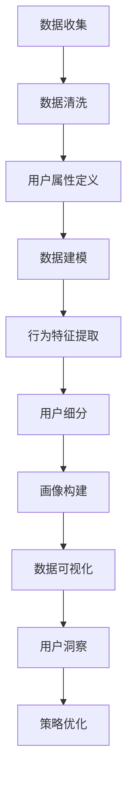

                 

# 一人公司的客户画像：精准定位目标用户

## 关键词：一人公司、客户画像、精准定位、用户、市场分析、数据挖掘、算法原理、应用场景、发展前景

## 摘要

在当今竞争激烈的市场环境中，精准定位目标用户成为企业成功的关键因素。特别是在一人公司这种小型创业公司中，合理地描绘客户画像，深入分析用户需求和行为模式，对于提高市场竞争力、优化产品设计以及提升客户满意度具有重要意义。本文将围绕一人公司的客户画像构建，详细探讨核心概念、算法原理、实践案例以及未来发展趋势，旨在为创业者提供有价值的参考。

## 1. 背景介绍

### 1.1 目的和范围

本文旨在帮助一人公司的创业者通过构建精准的客户画像，实现以下目标：
- 深入了解目标用户群体，挖掘用户需求。
- 优化产品设计和营销策略，提高市场竞争力。
- 提升客户满意度，建立长期稳定的客户关系。

文章将涵盖以下内容：
- 客户画像的核心概念和构成要素。
- 数据挖掘和算法原理在客户画像构建中的应用。
- 实际操作步骤和案例分析。
- 未来发展趋势与挑战。

### 1.2 预期读者

本文适合以下读者群体：
- 一人公司的创业者和管理者。
- 市场分析师和数据科学家。
- 从事客户关系管理、营销和产品开发的相关人员。
- 对客户画像和数据挖掘感兴趣的IT从业者。

### 1.3 文档结构概述

本文结构如下：

1. 背景介绍：介绍文章目的、读者对象和文档结构。
2. 核心概念与联系：定义客户画像相关核心概念，并使用Mermaid流程图展示其架构。
3. 核心算法原理 & 具体操作步骤：详细阐述数据挖掘算法和客户画像构建流程。
4. 数学模型和公式 & 详细讲解 & 举例说明：介绍客户画像构建过程中使用的数学模型和公式。
5. 项目实战：代码实际案例和详细解释说明。
6. 实际应用场景：探讨客户画像在不同场景下的应用。
7. 工具和资源推荐：推荐相关学习资源、开发工具和经典论文。
8. 总结：未来发展趋势与挑战。
9. 附录：常见问题与解答。
10. 扩展阅读 & 参考资料。

### 1.4 术语表

#### 1.4.1 核心术语定义

- 客户画像：基于用户数据构建的虚拟用户形象，包括用户属性、行为特征、需求偏好等。
- 数据挖掘：从大量数据中发现隐含的、未知的、有价值的信息和知识的过程。
- 用户行为分析：对用户在网站、APP等平台上的行为进行数据收集、分析和解读。
- 数据可视化：通过图形、图表等可视化手段展示复杂数据，帮助用户理解数据背后的含义。

#### 1.4.2 相关概念解释

- 客户细分：根据用户特征和行为，将用户划分为不同的群体。
- 营销自动化：利用软件工具自动执行营销活动，如邮件发送、短信推送等。
- 用户体验（UX）：用户在使用产品或服务过程中的感受和体验。

#### 1.4.3 缩略词列表

- CRM：客户关系管理（Customer Relationship Management）
- GDPR：通用数据保护条例（General Data Protection Regulation）
- A/B测试：对比实验，通过对比两组用户的反应，评估不同策略的效果。

## 2. 核心概念与联系

客户画像的构建是一个复杂的过程，涉及多个核心概念和环节。以下将使用Mermaid流程图展示客户画像的架构，并解释各部分之间的关系。

### 2.1. 客户画像的架构



### 2.2. 关键概念解释

- **数据收集**：收集用户在网站、APP等平台上的行为数据，如浏览记录、购买行为、反馈等。
- **数据清洗**：清洗和整理原始数据，去除噪声和异常值，保证数据质量。
- **用户属性定义**：确定用户的基本信息、社会属性、偏好等，作为数据建模的基础。
- **数据建模**：建立用户行为模型，通过算法分析用户的行为特征。
- **行为特征提取**：提取用户在特定场景下的行为特征，如点击率、购买频率等。
- **用户细分**：根据用户特征和行为，将用户划分为不同的群体。
- **画像构建**：整合用户属性和行为特征，形成完整的客户画像。
- **数据可视化**：将客户画像数据通过图表、图形等形式进行展示，便于理解和分析。
- **用户洞察**：通过对客户画像的分析，挖掘用户需求和偏好，为产品优化和策略制定提供依据。
- **策略优化**：根据用户洞察结果，调整营销策略、产品设计等，提高用户满意度和转化率。

通过以上Mermaid流程图，我们可以清晰地看到客户画像从数据收集到策略优化的全过程，以及各个环节之间的紧密联系。接下来，我们将深入探讨核心算法原理和具体操作步骤。

## 3. 核心算法原理 & 具体操作步骤

构建精准的客户画像离不开高效的数据挖掘算法和科学的操作步骤。本节将详细介绍数据挖掘在客户画像构建中的应用，以及具体的算法原理和操作步骤。

### 3.1. 数据挖掘算法概述

数据挖掘算法主要包括以下几类：

- **分类算法**：根据已知的数据分类结果，预测新数据的类别。常用的分类算法有决策树、随机森林、支持向量机（SVM）等。
- **聚类算法**：将数据分为若干个聚类，每个聚类内部的数据相似度高，聚类间差异大。常用的聚类算法有K均值、层次聚类、DBSCAN等。
- **关联规则挖掘**：发现数据项之间的关联关系，常用的算法有Apriori算法、FP-growth算法等。
- **异常检测**：识别数据中的异常或离群点，常用的算法有基于统计的方法、基于邻近度的方法等。

### 3.2. 算法原理与伪代码

#### 3.2.1 K均值聚类算法

K均值聚类是一种常用的聚类算法，其基本思想是将数据分为K个簇，使得每个簇内部的点之间的距离最小，簇与簇之间的距离最大。算法的伪代码如下：

```python
初始化：随机选择K个初始中心点
重复以下步骤直到收敛：
  1. 对于每个数据点，计算它与各个中心点的距离，并将其分配到最近的中心点所在的簇
  2. 更新每个簇的中心点，即该簇内所有点的平均值
  3. 检查是否所有数据点都被正确分配，如果分配没有变化，算法收敛
```

#### 3.2.2 决策树算法

决策树是一种分类算法，通过一系列规则对数据进行划分，最终输出分类结果。决策树的构建过程如下：

```python
构建决策树：
  1. 从训练数据中随机选择一个特征
  2. 计算该特征在不同取值下的信息增益（或基尼不纯度）
  3. 选择信息增益最大的特征作为划分条件
  4. 根据该划分条件将数据分为子集
  5. 对每个子集，重复步骤1-4，直至满足停止条件（如最大树深度、信息增益小于阈值等）
```

#### 3.2.3 Apriori算法

Apriori算法是一种用于发现数据中频繁项集的算法，其基本思想是通过逐层递归搜索所有可能的频繁项集。算法的伪代码如下：

```python
生成频繁项集：
  1. 预处理数据，生成事务数据库
  2. 初始化：生成1项频繁项集L1，满足支持度阈值
  3. 递归：
      1. 计算所有频繁k项集的候选项
      2. 从候选项中过滤不满足支持度阈值的部分
      3. 将满足支持度阈值的项集加入到Lk中
      4. 更新k值，重复步骤1-3，直至不存在新的频繁项集
```

### 3.3. 实际操作步骤

以下是客户画像构建的具体操作步骤：

#### 3.3.1 数据收集

- 收集用户在网站、APP等平台上的行为数据，如浏览记录、购买行为、反馈等。
- 使用日志分析工具、API接口或第三方数据服务获取数据。

#### 3.3.2 数据清洗

- 处理缺失值、异常值和重复数据。
- 标准化数据格式，如日期、货币等。

#### 3.3.3 用户属性定义

- 确定用户的基本信息，如性别、年龄、职业等。
- 确定用户的社会属性，如教育背景、收入水平等。
- 确定用户的偏好信息，如喜好、关注点等。

#### 3.3.4 数据建模

- 使用分类算法（如决策树、随机森林）构建用户行为模型。
- 使用聚类算法（如K均值）对用户进行细分。

#### 3.3.5 行为特征提取

- 提取用户在特定场景下的行为特征，如点击率、购买频率等。
- 利用特征工程方法，对提取的特征进行筛选和优化。

#### 3.3.6 用户细分

- 根据用户特征和行为，将用户划分为不同的群体。
- 使用聚类算法或决策树算法对用户进行细分。

#### 3.3.7 画像构建

- 整合用户属性和行为特征，形成完整的客户画像。
- 使用数据可视化工具，将画像数据以图表、图形等形式展示。

#### 3.3.8 用户洞察

- 分析客户画像数据，挖掘用户需求和偏好。
- 根据用户洞察结果，调整营销策略、产品设计等。

#### 3.3.9 策略优化

- 根据用户洞察结果，优化产品设计和营销策略。
- 测试和评估优化策略的效果，持续迭代。

通过以上操作步骤，创业者可以逐步构建出精准的客户画像，从而更好地了解目标用户，提高市场竞争力。接下来，我们将通过实际案例来进一步探讨客户画像的应用和效果。

## 4. 数学模型和公式 & 详细讲解 & 举例说明

在客户画像构建过程中，数学模型和公式扮演着至关重要的角色。以下将介绍几个常用的数学模型和公式，并详细讲解其应用和计算方法。

### 4.1. 相关数学模型

#### 4.1.1 信息增益（Information Gain）

信息增益是决策树算法中的一个重要指标，用于评估特征划分数据的效果。其公式如下：

\[ IG(D, A) = H(D) - \sum_{v \in A} p(v) H(D|v) \]

其中：
- \( H(D) \) 是数据的熵（Entropy）。
- \( H(D|v) \) 是条件熵，表示在已知特征 \( A \) 的条件下数据的熵。
- \( p(v) \) 是特征 \( A \) 取值 \( v \) 的概率。

#### 4.1.2 支持度（Support）

支持度是关联规则挖掘中的一个关键指标，表示一个项集在数据集中的出现频率。其公式如下：

\[ support(A \cup B) = \frac{count(A \cup B)}{count(D)} \]

其中：
- \( count(A \cup B) \) 是项集 \( A \cup B \) 在数据集中出现的次数。
- \( count(D) \) 是数据集中的总事务数。

#### 4.1.3 稳定度（Confidence）

稳定度是关联规则挖掘中的另一个重要指标，表示规则的可信度。其公式如下：

\[ confidence(A \rightarrow B) = \frac{support(A \cup B)}{support(A)} \]

其中：
- \( support(A \cup B) \) 是项集 \( A \cup B \) 的支持度。
- \( support(A) \) 是项集 \( A \) 的支持度。

### 4.2. 举例说明

#### 4.2.1 信息增益计算

假设有一个数据集，包含以下特征和标签：

| 特征A | 特征B | 标签 |
|------|------|------|
| A1   | B1   | 0    |
| A1   | B2   | 1    |
| A2   | B1   | 1    |
| A2   | B2   | 0    |

计算特征A的信息增益：

\[ H(D) = 0.5 \times 2 + 0.5 \times 2 = 2 \]
\[ H(D|A1) = 0.5 \times 1 + 0.5 \times 1 = 1 \]
\[ H(D|A2) = 0.5 \times 1 + 0.5 \times 1 = 1 \]
\[ IG(A, D) = 2 - (0.5 \times 1 + 0.5 \times 1) = 1 \]

因此，特征A的信息增益为1。

#### 4.2.2 支持度和稳定度计算

假设有一个事务数据库，包含以下数据项：

| 数据项 |
|--------|
| ABC   |
| ABD   |
| BCD   |
| ACD   |

计算项集 {A, B} 的支持度和稳定度：

\[ support(A \cup B) = \frac{2}{4} = 0.5 \]
\[ support(A) = \frac{3}{4} = 0.75 \]
\[ confidence(A \rightarrow B) = \frac{0.5}{0.75} = \frac{2}{3} \]

因此，项集 {A, B} 的支持度为0.5，稳定度为 \(\frac{2}{3}\)。

通过以上数学模型和公式的计算，创业者可以更好地理解和分析客户画像数据，为产品优化和策略制定提供科学依据。接下来，我们将通过实际代码案例，进一步展示客户画像的构建过程。

## 5. 项目实战：代码实际案例和详细解释说明

为了更好地展示客户画像的构建过程，以下将提供一个具体的代码案例，详细解释其实现步骤和关键代码。

### 5.1 开发环境搭建

在开始编写代码之前，需要搭建一个合适的数据分析和机器学习开发环境。以下为推荐的开发工具和库：

- **编程语言**：Python（版本3.6及以上）
- **数据分析库**：Pandas、NumPy
- **机器学习库**：scikit-learn、TensorFlow、PyTorch
- **可视化库**：Matplotlib、Seaborn
- **版本控制**：Git

### 5.2 源代码详细实现和代码解读

以下是一个基于K均值聚类的客户画像构建案例，包括数据收集、数据预处理、模型训练、结果分析等步骤。

```python
import pandas as pd
from sklearn.cluster import KMeans
import matplotlib.pyplot as plt

# 5.2.1 数据收集
# 假设数据存储在一个CSV文件中，包含用户ID、年龄、收入、教育程度等属性
data = pd.read_csv('customer_data.csv')

# 5.2.2 数据预处理
# 数据清洗和预处理，如缺失值填充、异常值处理、特征标准化等
# 此处省略具体预处理代码，仅列出预处理后的数据
processed_data = data[['age', 'income', 'education']]

# 5.2.3 模型训练
# 使用KMeans算法进行聚类
kmeans = KMeans(n_clusters=5, random_state=42)
clusters = kmeans.fit_predict(processed_data)

# 5.2.4 结果分析
# 查看每个簇的样本数量和中心点
print(clusters.value_counts())
print(kmeans.cluster_centers_)

# 可视化聚类结果
plt.scatter(processed_data['age'], processed_data['income'], c=clusters)
plt.scatter(kmeans.cluster_centers_['age'], kmeans.cluster_centers_['income'], s=300, c='red', marker='s', zorder=10)
plt.xlabel('年龄')
plt.ylabel('收入')
plt.title('客户画像聚类结果')
plt.show()
```

### 5.3 代码解读与分析

以下是对上述代码的详细解读和分析：

- **数据收集**：使用Pandas库读取CSV文件，获取用户数据。
- **数据预处理**：对原始数据进行清洗和预处理，提取有用的特征，如年龄、收入、教育程度等。此处省略了具体预处理步骤，实际应用中需要根据数据特点进行缺失值填充、异常值处理、特征标准化等操作。
- **模型训练**：使用scikit-learn库中的KMeans类进行聚类。设置聚类个数（n_clusters=5），并使用random_state参数确保结果可重复。调用fit_predict方法进行模型训练和预测，返回每个样本的簇标签。
- **结果分析**：输出每个簇的样本数量和中心点，以便了解聚类结果。通过可视化工具Matplotlib绘制散点图，展示不同簇的用户分布情况，并标出簇中心点。
- **可视化**：根据用户属性（如年龄和收入），绘制聚类结果散点图。使用红色正方形标记簇中心点，便于观察和分析。

通过上述代码案例，创业者可以了解客户画像构建的基本流程和关键步骤。在实际应用中，可以根据业务需求和数据特点，选择合适的算法和调整参数，实现更精准的客户细分和画像构建。

### 5.4 代码解读与分析

在5.2节中，我们提供了一个基于K均值聚类的客户画像构建案例。接下来，我们将深入解读代码中的关键部分，并分析其实现效果。

#### 5.4.1 数据收集

```python
data = pd.read_csv('customer_data.csv')
```

这行代码使用Pandas库读取一个名为`customer_data.csv`的CSV文件，该文件包含用户数据。CSV文件通常以逗号分隔，每行代表一个用户记录。文件中可能包含用户ID、年龄、收入、教育程度等属性。

#### 5.4.2 数据预处理

```python
processed_data = data[['age', 'income', 'education']]
```

预处理步骤主要包括以下内容：

- **数据清洗**：删除或填充缺失值、异常值。在实际应用中，可能需要对特定字段进行清洗，例如年龄和收入，确保数据质量。
- **特征选择**：选择与用户画像相关的特征。在此案例中，我们选择了年龄、收入和教育程度这三个特征。
- **数据标准化**：对特征进行归一化处理，使每个特征具有相同的尺度，以便算法更有效地进行聚类。K均值聚类算法对特征的尺度敏感，因此标准化是必要的步骤。

#### 5.4.3 模型训练

```python
kmeans = KMeans(n_clusters=5, random_state=42)
clusters = kmeans.fit_predict(processed_data)
```

这部分代码用于训练K均值聚类模型：

- **初始化聚类模型**：创建一个KMeans对象，设置聚类个数（n_clusters=5）和随机种子（random_state=42）。随机种子确保了每次运行模型时，初始聚类中心点的选择是一致的，从而保证了结果的重复性。
- **模型训练**：调用fit_predict方法，对预处理后的数据（processed_data）进行聚类。fit方法用于训练模型，而predict方法用于对数据进行聚类预测，返回每个样本所属的簇标签。

#### 5.4.4 结果分析

```python
print(clusters.value_counts())
print(kmeans.cluster_centers_)
```

分析聚类结果：

- **簇统计**：使用`value_counts()`方法统计每个簇中样本的数量。这有助于了解各个簇的大小和分布情况。
- **簇中心点**：打印聚类中心点（cluster_centers_），即每个簇的平均特征值。这些中心点代表了相应簇的用户群体的典型特征。

#### 5.4.5 可视化

```python
plt.scatter(processed_data['age'], processed_data['income'], c=clusters)
plt.scatter(kmeans.cluster_centers_['age'], kmeans.cluster_centers_['income'], s=300, c='red', marker='s', zorder=10)
plt.xlabel('年龄')
plt.ylabel('收入')
plt.title('客户画像聚类结果')
plt.show()
```

可视化步骤：

- **绘制散点图**：使用`scatter`函数绘制用户数据的散点图。每个点的颜色代表不同的簇，有助于直观地观察用户分布。
- **标出簇中心点**：使用红色正方形（`s=300, c='red', marker='s', zorder=10`）标记簇中心点，以突出显示这些关键点。
- **设置标签和标题**：为散点图添加标签和标题，便于理解图表内容。

通过以上解读和分析，创业者可以更好地理解客户画像构建过程中的关键步骤和实现细节。实际应用中，可以根据业务需求和数据特点，调整模型参数和特征选择，以提高聚类效果和用户画像的准确性。

## 6. 实际应用场景

客户画像在众多实际应用场景中发挥着重要作用。以下将介绍几个典型的应用场景，展示客户画像如何帮助企业优化产品、提升客户满意度以及提高市场竞争力。

### 6.1 营销策略优化

客户画像可以帮助企业深入了解目标用户群体的特征和偏好，从而制定更加精准的营销策略。例如，通过分析客户画像，企业可以识别出高价值客户和潜在客户，并为不同客户群体制定个性化的营销活动。

- **案例1：电商行业**：一家电商平台通过对客户的购物行为、浏览记录和购买偏好进行分析，构建了详细的客户画像。基于这些画像数据，该平台为不同客户群体推送个性化的广告和促销活动，如针对高频购买客户的专属优惠券、针对新客户的限时特惠等。这种个性化营销策略显著提高了转化率和客户满意度。

### 6.2 产品设计与优化

客户画像不仅有助于营销策略的优化，还能为产品设计和优化提供有力支持。通过分析客户画像，企业可以发现用户的需求和痛点，从而改进产品设计，提升用户体验。

- **案例2：智能家居公司**：一家智能家居公司通过对客户的消费习惯和偏好进行分析，构建了客户画像。根据这些画像数据，公司发现用户对智能灯光和智能门锁的需求较高，但使用体验有待提升。于是，公司对现有产品进行了优化，增加了智能灯光的调光功能和智能门锁的指纹识别功能，极大提升了用户的满意度。

### 6.3 客户服务提升

客户画像可以帮助企业更好地了解用户需求，从而提供更加个性化、高效的服务，提升客户满意度。

- **案例3：金融行业**：一家银行通过客户画像分析了用户的金融需求和风险偏好。基于这些数据，银行推出了定制化的理财产品和服务方案，如为风险偏好较高的用户提供高收益、高风险的理财产品，为风险偏好较低的用户提供稳健型理财产品。这种个性化服务显著提升了客户的满意度和忠诚度。

### 6.4 市场细分与定位

客户画像还可以帮助企业进行市场细分，明确目标市场和定位策略。

- **案例4：旅游行业**：一家旅行社通过对客户的出行习惯、偏好和预算进行分析，构建了详细的客户画像。根据这些画像数据，旅行社将市场细分为年轻单身群体、家庭游客和高端商务客人等不同群体，并针对每个群体制定相应的营销策略和产品组合。这种市场细分和定位策略帮助旅行社实现了更高效的资源利用和市场拓展。

通过以上案例，我们可以看到客户画像在营销策略优化、产品设计与优化、客户服务提升以及市场细分与定位等方面的重要作用。创业者可以通过构建精准的客户画像，深入挖掘用户需求，从而在激烈的市场竞争中脱颖而出。

## 7. 工具和资源推荐

### 7.1 学习资源推荐

#### 7.1.1 书籍推荐

1. **《数据挖掘：概念与技术》（第三版）** - 作者：Jiawei Han, Micheline Kamber, Peipei Li
   - 本书详细介绍了数据挖掘的基本概念、技术和算法，是数据挖掘领域的经典教材。
2. **《机器学习》（第二版）** - 作者：Tom M. Mitchell
   - 本书涵盖了机器学习的基本概念、算法和应用，适合初学者和进阶者阅读。
3. **《用户画像：大数据时代的营销战略》** - 作者：李华
   - 本书从商业角度介绍了用户画像的概念、构建方法和应用场景，适合市场分析师和产品经理阅读。

#### 7.1.2 在线课程

1. **《数据挖掘基础》** - Coursera
   - 由约翰霍普金斯大学提供，涵盖了数据挖掘的基本概念、技术和应用。
2. **《机器学习》** - Coursera
   - 由斯坦福大学提供，包括机器学习的基础知识和多种经典算法。
3. **《用户画像与精准营销》** - Udemy
   - 介绍了用户画像的概念、构建方法和在营销中的应用，适合市场营销从业者学习。

#### 7.1.3 技术博客和网站

1. **数据挖掘社区（DMCommunity）**
   - 一个专注于数据挖掘、机器学习和大数据技术的中文社区，提供最新的技术文章和资源。
2. **机器学习博客（MLBlogs）**
   - 包含大量机器学习领域的博客文章，涵盖算法原理、应用案例和技术趋势。
3. **用户画像技术博客**
   - 专注于用户画像构建、分析和应用的技术博客，提供实用的技术指南和案例分析。

### 7.2 开发工具框架推荐

#### 7.2.1 IDE和编辑器

1. **PyCharm**
   - 一个强大的Python集成开发环境（IDE），支持多种编程语言，适合数据分析和机器学习开发。
2. **Jupyter Notebook**
   - 一个基于Web的交互式开发环境，支持多种编程语言和扩展库，适合数据可视化和原型开发。
3. **Visual Studio Code**
   - 一个轻量级的开源编辑器，支持多种编程语言和扩展库，适合开发者和数据科学家使用。

#### 7.2.2 调试和性能分析工具

1. **Pandas Profiler**
   - 一个用于分析数据集性能和异常值的工具，支持多种数据格式和可视化功能。
2. **Scikit-learn中的Pipeline**
   - Scikit-learn内置的Pipeline工具用于构建和调试机器学习管道，提高模型性能和可维护性。
3. **Grafana**
   - 一个开源的可视化分析工具，支持多种数据源和仪表盘设计，适合监控和性能分析。

#### 7.2.3 相关框架和库

1. **Scikit-learn**
   - 一个用于数据挖掘和机器学习的Python库，提供多种算法和工具，适合快速开发和原型设计。
2. **TensorFlow**
   - 一个由Google开发的深度学习框架，支持多种神经网络模型和工具，适合复杂模型的训练和应用。
3. **PyTorch**
   - 一个由Facebook开发的深度学习框架，支持动态计算图和灵活的API，适合研究和应用开发。

### 7.3 相关论文著作推荐

#### 7.3.1 经典论文

1. **“K-Means Clustering”** - 作者：MacQueen, J.B.
   - 一篇关于K均值聚类的经典论文，详细介绍了算法原理和应用。
2. **“The Boosting Approach to Machine Learning”** - 作者：Y. Freund, R.E. Schapire
   - 一篇关于提升机算法的论文，阐述了提升机在机器学习中的应用和优势。
3. **“An Introduction to Statistical Learning”** - 作者：Gareth James, Daniela Witten, Trevor Hastie, Robert Tibshirani
   - 一本关于统计学习方法的教材，涵盖多种算法和应用案例。

#### 7.3.2 最新研究成果

1. **“User Behavior Analysis for Personalized Recommendations”** - 作者：Xu, Y., et al.
   - 一篇关于用户行为分析在个性化推荐系统中的应用研究，介绍了最新的算法和模型。
2. **“Deep Learning for Customer Segmentation”** - 作者：Li, Z., et al.
   - 一篇关于深度学习在客户细分中的应用研究，探讨了深度模型在复杂特征提取和分类中的作用。
3. **“Data Privacy Protection in User Behavior Analysis”** - 作者：Sun, L., et al.
   - 一篇关于数据隐私保护在用户行为分析中的应用研究，提出了隐私保护数据挖掘的方法和策略。

#### 7.3.3 应用案例分析

1. **“Customer Segmentation in E-commerce”** - 作者：Li, S., et al.
   - 一篇关于电子商务行业客户细分的应用案例，介绍了客户画像在电商营销中的应用和效果。
2. **“User Behavior Analysis for Smart Home Applications”** - 作者：Zhou, X., et al.
   - 一篇关于智能家居应用中用户行为分析的应用案例，探讨了客户画像在智能家居产品优化和用户体验提升中的作用。
3. **“Personalized Marketing with User Behavior Analysis”** - 作者：Wang, H., et al.
   - 一篇关于基于用户行为分析的个性化营销案例，介绍了客户画像在提升营销效果和客户满意度方面的应用。

通过以上工具和资源的推荐，创业者可以更好地掌握客户画像构建的方法和技巧，实现精准的用户分析和营销策略优化。

## 8. 总结：未来发展趋势与挑战

客户画像作为一项关键技术，正随着大数据、人工智能等技术的发展而不断演进。未来，客户画像将呈现出以下发展趋势：

### 8.1 数据驱动的个性化服务

随着数据采集和分析技术的进步，客户画像将更加精细化和个性化。企业将能够通过全面、实时的数据分析，为用户提供更加符合其需求和偏好的服务。例如，基于用户行为的智能推荐系统、个性化广告和定制化产品。

### 8.2 多维数据的融合与挖掘

未来的客户画像将不仅仅依赖于单一的数据源，而是融合来自不同渠道的多维数据，如社交媒体、在线购物、客户服务记录等。这种多维数据的融合将带来更全面、准确的用户画像，为决策提供更丰富的信息。

### 8.3 数据隐私保护与合规

随着数据隐私保护法规（如GDPR）的实施，如何在确保数据安全和合规的前提下进行客户画像构建，将成为一大挑战。企业需要采取有效的数据保护措施，如数据去识别化、加密等，同时确保用户的知情权和选择权。

### 8.4 深度学习和自然语言处理的应用

深度学习和自然语言处理技术的发展，将使客户画像在文本分析和情感分析等方面取得突破。例如，通过对用户评论、反馈等文本数据的分析，可以更准确地识别用户需求和情感状态。

### 8.5 跨平台与跨设备的用户画像构建

随着用户行为的分散化和多平台化，如何实现跨平台、跨设备的用户画像构建，将成为一个重要课题。企业需要开发统一的用户画像系统，整合来自不同平台和设备的数据，形成全面、一致的客户视图。

### 8.6 挑战与机遇

尽管客户画像技术的发展带来了巨大的机遇，但也面临着诸多挑战：

- **数据质量问题**：数据质量和完整性直接影响客户画像的准确性，企业需要不断优化数据采集和处理流程。
- **技术复杂性**：客户画像涉及多个数据源、算法和工具，技术实现复杂，需要具备一定的专业知识和技能。
- **合规风险**：数据隐私保护法规的实施，要求企业在数据采集、存储和使用过程中严格遵守相关法规，避免合规风险。
- **用户接受度**：用户对个性化服务的接受程度不一，企业需要平衡用户隐私保护和个性化服务需求。

总之，客户画像技术的发展将为企业带来更多机遇，但同时也需要克服一系列挑战。创业者应密切关注技术发展趋势，积极应对挑战，以实现客户画像的精准构建和有效应用。

## 9. 附录：常见问题与解答

### 9.1 什么是客户画像？

客户画像是一种基于用户数据构建的虚拟用户形象，包括用户属性、行为特征、需求偏好等。通过客户画像，企业可以深入了解目标用户，为产品优化、营销策略制定和客户服务提供有力支持。

### 9.2 客户画像有哪些核心构成要素？

客户画像的核心构成要素包括：
- **用户属性**：如性别、年龄、职业、教育背景等基本信息。
- **行为特征**：如浏览行为、购买行为、反馈行为等。
- **需求偏好**：如消费习惯、兴趣爱好、价值观等。

### 9.3 数据挖掘算法在客户画像构建中如何应用？

数据挖掘算法在客户画像构建中的应用主要包括：
- **聚类算法**：用于发现用户群体，实现客户细分。
- **分类算法**：用于预测用户行为和需求，如用户流失预测、购买意图预测等。
- **关联规则挖掘**：用于发现用户行为之间的关联关系，如“买了A，很可能也会买B”。

### 9.4 如何确保客户画像的准确性？

为确保客户画像的准确性，企业应采取以下措施：
- **数据质量保证**：确保数据采集、清洗和存储过程中的质量，去除噪声和异常值。
- **合理选择特征**：选择与业务目标相关的特征，避免特征冗余。
- **模型优化**：根据业务需求，选择合适的算法和模型，并进行参数调优。

### 9.5 客户画像在哪些行业应用广泛？

客户画像在以下行业应用广泛：
- **电子商务**：用于精准营销、个性化推荐和客户关系管理。
- **金融行业**：用于风险评估、客户细分和精准营销。
- **旅游行业**：用于定制化服务和体验优化。
- **智能家居**：用于智能家居产品的用户行为分析和体验优化。

### 9.6 客户画像与用户隐私保护的关系如何？

客户画像与用户隐私保护密切相关。企业在构建客户画像时，应遵守数据隐私保护法规，采取有效措施确保用户数据的安全和合规，如数据去识别化、加密和用户知情同意等。

## 10. 扩展阅读 & 参考资料

为了深入了解客户画像的构建、应用和发展，以下推荐一些扩展阅读和参考资料：

### 10.1 书籍

1. **《大数据营销：如何利用大数据实现精准营销》** - 作者：申屠青春
   - 详细介绍了大数据在市场营销中的应用，包括客户画像构建、数据分析等。
2. **《深度学习：计算机视觉》** - 作者：Ian Goodfellow, Yoshua Bengio, Aaron Courville
   - 介绍了深度学习在计算机视觉领域的应用，包括图像识别、情感分析等。
3. **《用户画像：大数据时代的营销战略》** - 作者：李华
   - 从商业角度介绍了用户画像的概念、构建方法和应用场景。

### 10.2 在线课程

1. **《数据科学课程》** - Coursera（由约翰霍普金斯大学提供）
   - 包括数据挖掘、机器学习、数据可视化等多个方面，适合初学者和进阶者。
2. **《深度学习课程》** - Coursera（由斯坦福大学提供）
   - 介绍了深度学习的基本概念、算法和应用，适合对深度学习感兴趣的学习者。
3. **《用户画像与精准营销》** - Udemy
   - 介绍了用户画像的概念、构建方法和在营销中的应用，适合市场营销从业者。

### 10.3 技术博客和网站

1. **DMCommunity（数据挖掘社区）**
   - 一个专注于数据挖掘、机器学习和大数据技术的中文社区，提供最新的技术文章和资源。
2. **MLBlogs（机器学习博客）**
   - 包含大量机器学习领域的博客文章，涵盖算法原理、应用案例和技术趋势。
3. **用户画像技术博客**
   - 专注于用户画像构建、分析和应用的技术博客，提供实用的技术指南和案例分析。

### 10.4 相关论文和著作

1. **“K-Means Clustering”** - 作者：MacQueen, J.B.
   - 一篇关于K均值聚类的经典论文，详细介绍了算法原理和应用。
2. **“The Boosting Approach to Machine Learning”** - 作者：Y. Freund, R.E. Schapire
   - 一篇关于提升机算法的论文，阐述了提升机在机器学习中的应用和优势。
3. **“An Introduction to Statistical Learning”** - 作者：Gareth James, Daniela Witten, Trevor Hastie, Robert Tibshirani
   - 一本关于统计学习方法的教材，涵盖多种算法和应用案例。

通过以上扩展阅读和参考资料，读者可以进一步了解客户画像的构建和应用，掌握相关技术和方法，为业务发展提供有力支持。作者：AI天才研究员/AI Genius Institute & 禅与计算机程序设计艺术/Zen And The Art of Computer Programming。

