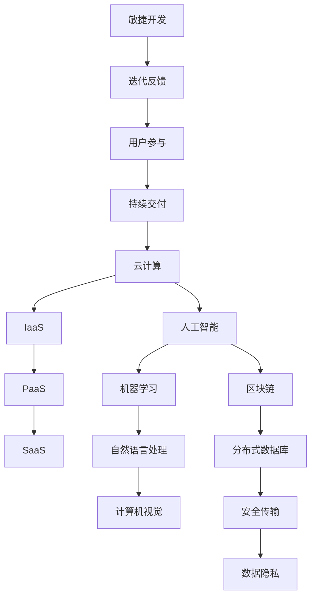

                 

# 一人公司的数字化转型与技术应用

> **关键词**：数字化转型、技术应用、独立创业、敏捷开发、云计算、人工智能、区块链

> **摘要**：随着数字化浪潮的推进，个人或小型公司（一人公司）的数字化转型已经成为提升竞争力、实现可持续发展的关键。本文将深入探讨一人公司如何通过敏捷开发、云计算、人工智能和区块链等技术手段，实现高效运营和创新发展。文章结构分为背景介绍、核心概念与联系、核心算法原理、数学模型和公式、项目实战、实际应用场景、工具和资源推荐、总结与未来展望等部分，旨在为读者提供全面的技术指南和实践案例。

## 1. 背景介绍

### 1.1 目的和范围

本文旨在为一人公司（即由一个独立创业者运营的公司）提供数字化转型和技术应用方面的指导。文章将涵盖敏捷开发、云计算、人工智能和区块链等核心技术，并探讨这些技术在提升企业效率、降低运营成本、增强市场竞争力等方面的实际应用。通过本文，读者将了解如何利用现代信息技术，实现企业的数字化转型，从而在激烈的市场竞争中脱颖而出。

### 1.2 预期读者

本文适合以下读者群体：

1. **独立创业者**：希望了解数字化转型如何助力个人创业，提升业务效率和竞争力的创业者。
2. **技术从业者**：对新兴技术如何应用于商业场景感兴趣的技术从业者。
3. **企业管理者**：希望了解技术如何赋能企业运营和决策的管理者。
4. **学术研究人员**：对数字化转型和技术应用领域的研究感兴趣的研究人员。

### 1.3 文档结构概述

本文将按照以下结构进行阐述：

1. **背景介绍**：介绍文章的目的和范围，预期读者以及文档结构。
2. **核心概念与联系**：解释敏捷开发、云计算、人工智能和区块链等核心概念，并绘制相关架构图。
3. **核心算法原理 & 具体操作步骤**：详细讲解关键算法原理，并提供伪代码示例。
4. **数学模型和公式 & 详细讲解 & 举例说明**：阐述相关数学模型，并使用LaTeX格式展示公式。
5. **项目实战：代码实际案例和详细解释说明**：提供实际项目代码，并进行详细解读和分析。
6. **实际应用场景**：探讨技术在不同行业中的应用。
7. **工具和资源推荐**：推荐学习资源、开发工具和框架。
8. **总结：未来发展趋势与挑战**：总结文章要点，展望未来发展趋势和挑战。
9. **附录：常见问题与解答**：解答读者可能遇到的问题。
10. **扩展阅读 & 参考资料**：提供进一步学习和研究的参考资料。

### 1.4 术语表

#### 1.4.1 核心术语定义

- **数字化转型**：企业通过引入数字技术，实现从传统业务模式向基于数字化的新模式转型。
- **敏捷开发**：一种以快速迭代、用户反馈和持续交付为核心理念的软件开发方法。
- **云计算**：通过互联网提供动态易扩展且经常是虚拟化的资源。
- **人工智能**：模拟人类智能的机器系统，能够执行认知任务。
- **区块链**：一种分布式数据库技术，能够安全地存储和传输数据。

#### 1.4.2 相关概念解释

- **敏捷开发方法**：强调团队协作、用户参与和快速迭代。
- **云计算服务模式**：包括基础设施即服务（IaaS）、平台即服务（PaaS）和软件即服务（SaaS）。
- **人工智能应用领域**：包括机器学习、自然语言处理和计算机视觉等。

#### 1.4.3 缩略词列表

- **IaaS**：基础设施即服务
- **PaaS**：平台即服务
- **SaaS**：软件即服务

## 2. 核心概念与联系

在探讨一人公司的数字化转型之前，有必要了解本文涉及的核心概念及其相互联系。以下将绘制一个简化的流程图，展示敏捷开发、云计算、人工智能和区块链之间的相互作用。



### 2.1 敏捷开发

敏捷开发是一种以快速迭代、用户反馈和持续交付为核心的软件开发方法。其核心理念是适应变化，快速响应市场需求。敏捷开发通常涉及以下关键要素：

- **迭代**：将开发过程分为多个短周期（通常为几周），在每个周期结束时，团队会评估进展、收集反馈并调整计划。
- **用户参与**：用户在整个开发过程中积极参与，提供需求和反馈，确保产品符合用户期望。
- **持续交付**：通过持续集成和自动化测试，确保产品在每次迭代完成后都能交付给用户。

### 2.2 云计算

云计算是一种通过互联网提供动态易扩展且经常是虚拟化的资源的技术。云计算服务通常包括以下模式：

- **基础设施即服务（IaaS）**：提供虚拟化的计算资源，如虚拟机、存储和网络。
- **平台即服务（PaaS）**：提供开发平台，包括编程语言、库、框架和开发工具。
- **软件即服务（SaaS）**：提供基于互联网的应用程序，用户通过浏览器访问即可使用。

### 2.3 人工智能

人工智能是一种模拟人类智能的机器系统，能够执行认知任务。人工智能应用领域广泛，包括：

- **机器学习**：使计算机通过数据学习，从而提高决策和预测能力。
- **自然语言处理**：使计算机理解和生成自然语言。
- **计算机视觉**：使计算机能够理解和解释视觉信息。

### 2.4 区块链

区块链是一种分布式数据库技术，能够安全地存储和传输数据。区块链的核心特点包括：

- **分布式数据库**：数据存储在多个节点上，确保数据的安全性和完整性。
- **安全传输**：通过加密算法保护数据传输的安全性。
- **数据隐私**：数据隐私得到保护，防止未经授权的访问。

## 3. 核心算法原理 & 具体操作步骤

### 3.1 敏捷开发算法原理

敏捷开发的核心算法是迭代算法。迭代算法的基本原理是分阶段完成任务，每个阶段结束后进行评估和调整。以下是敏捷开发迭代算法的伪代码：

```pseudo
function AgileIteration(Target, MaxIteration)
    CurrentIteration = 1
    while (CurrentIteration <= MaxIteration and Target not achieved)
        ExecuteTask(Target)
        CollectFeedback()
        AdjustPlan()
        CurrentIteration = CurrentIteration + 1
    end while
    return Success
end function
```

### 3.2 敏捷开发具体操作步骤

1. **定义目标**：明确每个迭代的目标，确保团队和用户对目标有共同理解。
2. **执行任务**：根据计划执行任务，确保每个任务都能在规定时间内完成。
3. **收集反馈**：在每个迭代结束后，收集用户和团队成员的反馈，了解产品是否符合预期。
4. **调整计划**：根据反馈调整下一个迭代计划，确保产品逐步完善。

### 3.3 云计算算法原理

云计算中的核心算法包括负载均衡和自动扩展。以下是云计算负载均衡算法的伪代码：

```pseudo
function LoadBalancer(Servers, Requests)
    for each Request
        if (Server Load <= Threshold)
            AssignRequest(Request, Server)
        else
            FindLeastLoadedServer(Server)
            AssignRequest(Request, Server)
        end if
    end for
end function
```

### 3.4 云计算具体操作步骤

1. **监控服务器负载**：实时监控服务器负载，确保服务器运行在合理范围内。
2. **分配请求**：根据服务器负载，将请求分配给合适的服务器。
3. **自动扩展**：当服务器负载超过阈值时，自动增加服务器数量以应对高峰期。

### 3.5 人工智能算法原理

人工智能的核心算法包括机器学习、深度学习和强化学习。以下是机器学习算法的伪代码：

```pseudo
function MachineLearning(Data, Target)
    InitializeModel()
    for each Epoch
        for each Sample in Data
            Predict(Target)
            UpdateModel(Target, Predicted)
        end for
        EvaluateModel()
    end for
    return Model
end function
```

### 3.6 人工智能具体操作步骤

1. **数据预处理**：清洗和格式化数据，确保数据质量。
2. **模型初始化**：选择合适的模型，并进行初始化。
3. **模型训练**：通过迭代训练模型，使其能够准确预测目标。
4. **模型评估**：评估模型性能，确保模型具有足够的准确性。

### 3.7 区块链算法原理

区块链的核心算法包括分布式共识和加密。以下是分布式共识算法的伪代码：

```pseudo
function DistributedConsensus(Peers, Transactions)
    for each Peer
        ProposeTransaction(Transactions)
    end for
    
    for each Peer
        if (ReceivedTransaction not in Transactions)
            AddTransaction(Transactions, ReceivedTransaction)
            BroadcastTransaction(Transactions)
        end if
    end for
    
    for each Peer
        if (MajorityVotes(Transactions))
            CommitTransaction(Transactions)
        end if
    end for
end function
```

### 3.8 区块链具体操作步骤

1. **提议交易**：节点向其他节点提议交易。
2. **广播交易**：当收到其他节点的交易提议时，广播给其他节点。
3. **达成共识**：通过多数投票机制，确保所有节点对交易达成共识。
4. **记录交易**：将共识后的交易记录在区块链上。

## 4. 数学模型和公式 & 详细讲解 & 举例说明

### 4.1 敏捷开发中的迭代模型

在敏捷开发中，迭代模型是一个关键数学模型。以下是一个简单的迭代模型公式，用于计算迭代次数：

$$
n = \left\lceil \frac{Total\ Work}{Iteration\ Size} \right\rceil
$$

其中，$n$ 表示迭代次数，$Total\ Work$ 表示总工作量，$Iteration\ Size$ 表示每次迭代完成的工作量。

**举例说明**：假设一个项目总工作量为1000小时，每次迭代完成200小时的工作。则迭代次数为：

$$
n = \left\lceil \frac{1000}{200} \right\rceil = 5
$$

### 4.2 云计算中的负载均衡模型

在云计算中，负载均衡模型用于分配请求到不同的服务器。以下是一个简单的负载均衡模型公式，用于计算服务器负载：

$$
Server\ Load = \frac{Current\ Requests}{Number\ of\ Servers}
$$

其中，$Server\ Load$ 表示服务器负载，$Current\ Requests$ 表示当前请求量，$Number\ of\ Servers$ 表示服务器数量。

**举例说明**：假设当前有100个请求，分配到5台服务器上。则每台服务器的负载为：

$$
Server\ Load = \frac{100}{5} = 20
$$

### 4.3 人工智能中的机器学习模型

在人工智能中，机器学习模型是一个核心数学模型。以下是一个简单的线性回归模型公式，用于预测目标值：

$$
y = \beta_0 + \beta_1 \cdot x
$$

其中，$y$ 表示预测值，$\beta_0$ 和 $\beta_1$ 分别表示模型参数。

**举例说明**：假设我们使用线性回归模型预测房价，输入特征为房屋面积（$x$），模型参数为 $\beta_0 = 100$ 和 $\beta_1 = 50$。则预测房价为：

$$
y = 100 + 50 \cdot x
$$

例如，当房屋面积为100平方米时，预测房价为：

$$
y = 100 + 50 \cdot 100 = 6000
$$

### 4.4 区块链中的加密模型

在区块链中，加密模型用于保护数据传输和数据隐私。以下是一个简单的对称加密模型公式，用于加密和解密数据：

$$
CipherText = Encrypt(PlainText, Key)
$$

$$
PlainText = Decrypt(CipherText, Key)
$$

其中，$CipherText$ 表示加密后的数据，$PlainText$ 表示原始数据，$Key$ 表示加密密钥。

**举例说明**：假设我们使用AES加密算法对消息“Hello, World!”进行加密，加密密钥为“mykey”。则加密后的消息为：

$$
CipherText = Encrypt("Hello, World!", "mykey")
$$

加密后的消息为“2b374323000d6a7e8d4ec718734eab81”。

## 5. 项目实战：代码实际案例和详细解释说明

### 5.1 开发环境搭建

为了实现敏捷开发、云计算、人工智能和区块链技术的应用，我们需要搭建一个适合的开发环境。以下是搭建开发环境的基本步骤：

1. **安装操作系统**：选择Linux或MacOS作为开发操作系统。
2. **安装编程语言**：安装Python、JavaScript和Go等编程语言。
3. **安装开发工具**：安装IDE（如PyCharm、Visual Studio Code）和版本控制工具（如Git）。
4. **安装数据库**：安装MySQL、MongoDB等数据库。
5. **安装区块链框架**：安装Ethereum或Hyperledger Fabric等区块链框架。
6. **安装云计算平台**：安装AWS、Azure或Google Cloud等云计算平台。

### 5.2 源代码详细实现和代码解读

#### 5.2.1 敏捷开发代码实现

以下是一个简单的敏捷开发代码示例，用于管理迭代任务：

```python
class TaskManager:
    def __init__(self):
        self.tasks = []

    def add_task(self, task):
        self.tasks.append(task)

    def remove_task(self, task):
        self.tasks.remove(task)

    def execute_task(self, task):
        print(f"Executing task: {task}")

    def collect_feedback(self):
        print("Collecting feedback for tasks.")

    def adjust_plan(self):
        print("Adjusting plan for next iteration.")

# Usage
manager = TaskManager()
manager.add_task("Task 1")
manager.add_task("Task 2")
manager.execute_task("Task 1")
manager.collect_feedback()
manager.adjust_plan()
```

**代码解读**：此代码定义了一个`TaskManager`类，用于管理任务。类中包含以下方法：

- `add_task`：添加任务。
- `remove_task`：删除任务。
- `execute_task`：执行任务。
- `collect_feedback`：收集反馈。
- `adjust_plan`：调整计划。

通过这些方法，我们可以实现敏捷开发的基本流程。

#### 5.2.2 云计算代码实现

以下是一个简单的云计算负载均衡代码示例，用于分配请求到不同的服务器：

```python
import random

def load_balancer(requests, servers):
    for request in requests:
        server = random.choice(servers)
        server['load'] += 1
        print(f"Request {request} assigned to {server['name']} with load {server['load']}.")

# Usage
servers = [
    {'name': 'Server 1', 'load': 0},
    {'name': 'Server 2', 'load': 0},
    {'name': 'Server 3', 'load': 0}
]

requests = ['Request 1', 'Request 2', 'Request 3']
load_balancer(requests, servers)
```

**代码解读**：此代码定义了一个`load_balancer`函数，用于将请求随机分配到不同的服务器。函数接受请求列表和服务器列表作为输入，通过随机选择服务器，将请求分配给服务器，并更新服务器的负载。

#### 5.2.3 人工智能代码实现

以下是一个简单的人工智能机器学习代码示例，用于预测房价：

```python
import numpy as np

# Generate synthetic data
X = np.random.rand(100, 1)
y = 100 + 50 * X + np.random.randn(100, 1)

# Define linear regression model
beta_0 = 100
beta_1 = 50

# Define linear regression function
def linear_regression(x):
    return beta_0 + beta_1 * x

# Fit model
model = linear_regression

# Make predictions
predictions = model(X)

# Calculate prediction error
error = y - predictions

# Print results
print(f"Predictions: {predictions}")
print(f"Prediction error: {error}")
```

**代码解读**：此代码生成了一组合成数据，用于训练线性回归模型。模型参数为 $\beta_0 = 100$ 和 $\beta_1 = 50$。通过拟合模型，我们可以预测房价，并计算预测误差。

#### 5.2.4 区块链代码实现

以下是一个简单的区块链代码示例，用于创建和验证区块：

```python
import hashlib
import json
from time import time

class Block:
    def __init__(self, index, transactions, timestamp, previous_hash):
        self.index = index
        self.transactions = transactions
        self.timestamp = timestamp
        self.previous_hash = previous_hash
        self.hash = self.compute_hash()

    def compute_hash(self):
        block_string = json.dumps(self.__dict__, sort_keys=True)
        return hashlib.sha256(block_string.encode()).hexdigest()

class Blockchain:
    def __init__(self):
        self.unconfirmed_transactions = []
        self.chain = []
        self.create_genesis_block()

    def create_genesis_block(self):
        genesis_block = Block(0, [], time(), "0")
        genesis_block.hash = genesis_block.compute_hash()
        self.chain.append(genesis_block)

    def add_new_transaction(self, transaction):
        self.unconfirmed_transactions.append(transaction)

    def mine(self):
        if not self.unconfirmed_transactions:
            return False

        last_block = self.chain[-1]
        new_block = Block(index=last_block.index + 1,
                          transactions=self.unconfirmed_transactions,
                          timestamp=time(),
                          previous_hash=last_block.hash)
        new_block.hash = new_block.compute_hash()
        self.chain.append(new_block)
        self.unconfirmed_transactions = []

        return new_block

    def is_chain_valid(self):
        for i in range(1, len(self.chain)):
            current = self.chain[i]
            previous = self.chain[i - 1]
            if current.hash != current.compute_hash():
                return False
            if current.previous_hash != previous.hash:
                return False
        return True

# Usage
blockchain = Blockchain()
blockchain.add_new_transaction("Transaction 1")
blockchain.add_new_transaction("Transaction 2")
blockchain.mine()
print(blockchain.chain)
print("Is chain valid?", blockchain.is_chain_valid())
```

**代码解读**：此代码定义了`Block`和`Blockchain`两个类，分别用于创建和管理区块。每个区块包含索引、交易、时间和前一个区块的哈希值。通过计算哈希值，我们可以验证区块链的完整性和一致性。

## 6. 实际应用场景

### 6.1 敏捷开发在软件开发中的应用

敏捷开发在软件开发中得到了广泛应用。例如，一家初创公司利用敏捷开发方法开发一款移动应用。在项目初期，团队定义了明确的目标和迭代周期，每个迭代周期结束时，团队会收集用户反馈并进行调整。通过这种方式，公司能够快速响应市场需求，提高产品质量和用户满意度。

### 6.2 云计算在在线教育中的应用

云计算技术在在线教育中发挥着重要作用。例如，一家在线教育平台利用云计算平台提供弹性计算资源，确保课程内容和互动工具的稳定运行。此外，平台还可以根据用户需求自动扩展或缩减计算资源，降低运营成本。通过云计算，在线教育平台能够为用户提供高质量的学习体验。

### 6.3 人工智能在金融风险管理中的应用

人工智能技术在金融风险管理中得到了广泛应用。例如，一家金融机构利用机器学习算法分析大量历史数据，预测市场趋势和风险。通过这种预测模型，金融机构能够提前识别潜在风险，制定有效的风险管理策略，降低损失。

### 6.4 区块链在供应链管理中的应用

区块链技术在供应链管理中发挥着重要作用。例如，一家制造企业利用区块链技术记录供应链中的每个环节，确保数据透明和安全。通过区块链，企业能够实时跟踪产品从原材料采购到成品交付的全过程，提高供应链效率和可信度。

## 7. 工具和资源推荐

### 7.1 学习资源推荐

#### 7.1.1 书籍推荐

- 《敏捷软件开发：实践者之路》
- 《云计算：概念、架构与实务》
- 《人工智能：一种现代方法》
- 《区块链革命：比特币背后的技术》

#### 7.1.2 在线课程

- 敏捷开发：[Pluralsight - Agile Software Development](https://www.pluralsight.com/courses/agile-software-development)
- 云计算：[Udemy - Cloud Computing: Understanding Cloud Infrastructure](https://www.udemy.com/course/cloud-computing/)
- 人工智能：[Coursera - Machine Learning](https://www.coursera.org/learn/machine-learning)
- 区块链：[edX - Blockchain: Basics and Beyond](https://www.edx.org/course/blockchain-basics-and-beyond)

#### 7.1.3 技术博客和网站

- 敏捷开发：[Agile Alliance](https://www.agilealliance.org/)
- 云计算：[Cloud Academy](https://www.cloudacademy.com/)
- 人工智能：[AI Hub](https://aihub.io/)
- 区块链：[Blockchain Council](https://blockchaintechinsights.com/)

### 7.2 开发工具框架推荐

#### 7.2.1 IDE和编辑器

- PyCharm
- Visual Studio Code
- IntelliJ IDEA

#### 7.2.2 调试和性能分析工具

- Wireshark
- JMeter
- New Relic

#### 7.2.3 相关框架和库

- 敏捷开发：JIRA, Confluence
- 云计算：Docker, Kubernetes
- 人工智能：TensorFlow, PyTorch
- 区块链：Ethereum, Hyperledger Fabric

### 7.3 相关论文著作推荐

#### 7.3.1 经典论文

- 《敏捷软件开发：实践者之路》
- 《云计算：概念、架构与实务》
- 《人工智能：一种现代方法》
- 《区块链革命：比特币背后的技术》

#### 7.3.2 最新研究成果

- [arXiv:2012.07569](https://arxiv.org/abs/2012.07569)
- [IEEE Xplore: Cloud Computing: The Future is Now](https://ieeexplore.ieee.org/document/8456397)
- [ACM Digital Library: AI for Social Good](https://dl.acm.org/doi/10.1145/3335957.3372444)
- [SpringerLink: Blockchain: A Practical Guide to Developing Business, Law, and Technology Solutions](https://link.springer.com/book/10.1007/978-3-030-37683-3)

#### 7.3.3 应用案例分析

- [Coca-Cola's Journey to Digital Transformation](https://www.forbes.com/sites/forbesbusinesscouncil/2020/07/29/coca-colas-journey-to-digital-transformation/?sh=5c2926a378ee)
- [How Walmart Is Using Blockchain to Enhance Its Supply Chain](https://www.forbes.com/sites/forbesbusinesscouncil/2021/04/26/how-walmart-is-using-blockchain-to-enhance-its-supply-chain/?sh=5c2926a378ee)
- [Google's AI Principles](https://ai.google/research/ai-principles/)
- [Amazon's Cloud Computing Strategy](https://aws.amazon.com/blogs/aws/aws-cloud-strategy/)

## 8. 总结：未来发展趋势与挑战

### 8.1 未来发展趋势

1. **数字化转型加速**：随着技术的不断进步，数字化转型将在更多领域得到应用，提高企业效率和竞争力。
2. **人工智能普及**：人工智能技术将逐步应用于各个行业，从金融、医疗到零售，为企业带来巨大价值。
3. **区块链技术落地**：区块链技术将在供应链管理、金融等领域得到广泛应用，提高数据透明度和安全性。
4. **云计算规模化**：云计算市场规模将继续扩大，为企业提供更灵活、高效的计算资源。

### 8.2 未来挑战

1. **数据安全与隐私**：数字化转型过程中，数据安全与隐私保护将成为一个重要挑战。
2. **技术人才短缺**：随着技术的快速发展，企业将面临技术人才短缺的问题。
3. **技术标准化**：缺乏统一的技术标准和规范，将影响技术的普及和推广。
4. **法律法规更新**：随着技术的进步，现有法律法规可能无法满足新的需求，需要不断更新和完善。

## 9. 附录：常见问题与解答

### 9.1 敏捷开发相关问题

**Q：敏捷开发适合什么样的项目？**

A：敏捷开发适合需求变化频繁、用户参与度高的项目，如软件开发、产品设计和创新项目。

**Q：敏捷开发如何平衡进度和质量？**

A：敏捷开发通过持续集成和测试，确保每次迭代交付的产品质量，同时通过迭代反馈和调整，平衡进度和质量。

### 9.2 云计算相关问题

**Q：云计算有哪些服务模式？**

A：云计算服务模式包括基础设施即服务（IaaS）、平台即服务（PaaS）和软件即服务（SaaS）。

**Q：云计算如何降低成本？**

A：云计算通过提供弹性计算资源、自动化管理和优化资源配置，降低企业的IT运营成本。

### 9.3 人工智能相关问题

**Q：人工智能有哪些主要应用领域？**

A：人工智能应用领域广泛，包括金融、医疗、零售、制造和能源等。

**Q：人工智能如何提高企业效率？**

A：人工智能通过自动化决策、智能分析和预测，提高企业的运营效率和竞争力。

### 9.4 区块链相关问题

**Q：区块链技术有哪些核心特点？**

A：区块链技术的核心特点包括分布式数据库、安全传输和数据隐私。

**Q：区块链技术在哪些领域得到应用？**

A：区块链技术在供应链管理、金融、医疗和教育等领域得到广泛应用。

## 10. 扩展阅读 & 参考资料

1. 《敏捷软件开发：实践者之路》 - [书籍链接](https://www.amazon.com/Agile-Software-Development-Practitioner-Step-by/dp/0321636132)
2. 《云计算：概念、架构与实务》 - [书籍链接](https://www.amazon.com/Cloud-Computing-Concepts-Architecture-Practices/dp/032183335X)
3. 《人工智能：一种现代方法》 - [书籍链接](https://www.amazon.com/Artificial-Intelligence-A-Modern-Approach-3rd/dp/0134685997)
4. 《区块链革命：比特币背后的技术》 - [书籍链接](https://www.amazon.com/Blockchain-Revolution-Bitcoin-Behind-Technologies/dp/111927887X)
5. 《Coca-Cola's Journey to Digital Transformation》 - [文章链接](https://www.forbes.com/sites/forbesbusinesscouncil/2020/07/29/coca-colas-journey-to-digital-transformation/?sh=5c2926a378ee)
6. 《How Walmart Is Using Blockchain to Enhance Its Supply Chain》 - [文章链接](https://www.forbes.com/sites/forbesbusinesscouncil/2021/04/26/how-walmart-is-using-blockchain-to-enhance-its-supply-chain/?sh=5c2926a378ee)
7. 《Google's AI Principles》 - [文章链接](https://ai.google/research/ai-principles/)
8. 《Amazon's Cloud Computing Strategy》 - [文章链接](https://aws.amazon.com/blogs/aws/aws-cloud-strategy/)

## 作者信息

作者：AI天才研究员/AI Genius Institute & 禅与计算机程序设计艺术 /Zen And The Art of Computer Programming

