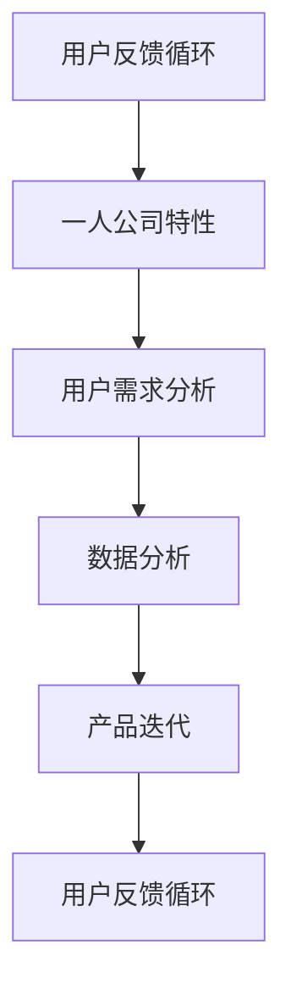

                 

### 背景介绍

#### 1.1 目的和范围

本文旨在探讨“一人公司的用户反馈循环：持续优化产品的系统化流程”。在现代信息技术飞速发展的背景下，产品迭代的速度和用户需求的多样性使得企业越来越依赖于有效的用户反馈循环来提升产品质量和市场竞争力。而在这其中，一人公司作为独立运营的企业模式，如何有效地构建和优化用户反馈循环系统，成为一个值得深入研究的问题。

本文的讨论范围将主要涵盖以下几个方面：

1. **用户反馈循环的基本概念和重要性**：介绍用户反馈循环的定义及其在企业产品开发中的重要性。
2. **一人公司的特性**：阐述一人公司的运营模式及其在产品开发中的独特性。
3. **用户反馈循环的系统化流程**：分析用户反馈循环的系统化流程，包括用户反馈收集、分析、处理和反馈机制。
4. **具体操作步骤**：提供用户反馈循环的具体操作步骤，包括数据收集、数据分析、策略制定和实施、反馈收集等。
5. **项目实战**：通过实际案例展示用户反馈循环在实际项目中的应用，并进行详细解释和分析。
6. **实际应用场景**：讨论用户反馈循环在不同场景下的应用，如产品设计、市场营销等。
7. **工具和资源推荐**：推荐用于用户反馈循环的实用工具和资源，包括书籍、在线课程、技术博客、开发工具和框架等。

通过以上内容的探讨，本文旨在为一人公司的运营者提供一套有效的用户反馈循环系统化流程，帮助其在快速变化的市场环境中保持竞争力，并持续提升产品质量。

#### 1.2 预期读者

本文预期读者主要包括以下几类：

1. **一人公司的创始人或运营者**：他们希望了解如何通过系统化的用户反馈循环来优化产品，提升市场竞争力。
2. **产品经理**：他们需要掌握用户反馈循环的原理和操作步骤，以便在实际工作中更好地应用这一机制。
3. **技术专家**：他们希望深入了解用户反馈循环的技术实现细节，以及如何利用技术手段来提升反馈处理的效率。
4. **市场营销人员**：他们希望了解用户反馈在市场营销中的重要性，以及如何通过反馈来优化营销策略。
5. **对产品开发和用户反馈感兴趣的IT从业者**：他们希望通过本文对用户反馈循环有更深入的理解，从而为将来的工作或研究提供参考。

本文将通过逻辑清晰、结构紧凑、简单易懂的专业语言，确保不同背景的读者都能理解和应用其中的知识。

#### 1.3 文档结构概述

本文将按照以下结构进行展开：

1. **背景介绍**：介绍本文的目的和范围，预期读者，以及文档的结构概述。
2. **核心概念与联系**：阐述用户反馈循环的核心概念，并提供Mermaid流程图进行说明。
3. **核心算法原理与具体操作步骤**：详细讲解用户反馈循环的具体操作步骤，并使用伪代码进行说明。
4. **数学模型和公式**：介绍用户反馈循环中的数学模型和公式，并进行详细讲解和举例说明。
5. **项目实战**：通过实际案例展示用户反馈循环的应用，并进行详细解释说明。
6. **实际应用场景**：讨论用户反馈循环在不同场景下的应用。
7. **工具和资源推荐**：推荐用于用户反馈循环的实用工具和资源。
8. **总结**：总结未来发展趋势与挑战。
9. **附录**：提供常见问题与解答。
10. **扩展阅读与参考资料**：推荐相关阅读和参考资料。

通过以上结构，本文将系统化地介绍用户反馈循环的理论和实践，帮助读者全面理解和掌握这一关键机制。

#### 1.4 术语表

为了确保读者对文中术语有清晰的理解，以下是本文中的一些核心术语及其定义：

##### 1.4.1 核心术语定义

1. **用户反馈循环**：指企业通过收集、分析、处理用户反馈，并将其应用于产品优化和改进的闭环过程。
2. **一人公司**：指由单个个体独立运营的公司，通常拥有者、管理者、员工为同一人。
3. **反馈机制**：指企业内部用于收集、分析、处理和反馈用户意见和反馈的系统或方法。
4. **用户需求分析**：指通过分析用户反馈，识别和了解用户需求，以便在产品开发中加以满足。
5. **数据分析**：指运用统计、数据挖掘等技术对用户反馈数据进行分析，以提取有用信息和洞察。
6. **产品迭代**：指在产品开发过程中，通过不断改进和更新，实现产品的持续优化。

##### 1.4.2 相关概念解释

1. **敏捷开发**：一种软件开发方法，强调快速迭代和持续交付有价值的软件，与用户反馈循环紧密相关。
2. **用户满意度**：指用户对产品或服务满意的程度，是用户反馈循环中的重要衡量指标。
3. **用户体验**：指用户在使用产品或服务过程中所感受到的整体感受，直接影响用户反馈的质量。
4. **A/B测试**：一种实验方法，通过将用户分成两组，比较两组用户对产品不同版本的反馈，以确定最佳版本。

##### 1.4.3 缩略词列表

- **AI**：人工智能（Artificial Intelligence）
- **ML**：机器学习（Machine Learning）
- **UX**：用户体验（User Experience）
- **UI**：用户界面（User Interface）
- **SaaS**：软件即服务（Software as a Service）
- **PaaS**：平台即服务（Platform as a Service）
- **IaaS**：基础设施即服务（Infrastructure as a Service）

通过以上术语表，读者可以更好地理解本文中涉及的关键术语，为后续内容的深入学习奠定基础。

### 核心概念与联系

在探讨用户反馈循环的原理和流程之前，我们需要明确几个核心概念，并理解它们之间的相互关系。以下是对这些核心概念的定义及其相互联系的解释。

#### 用户反馈循环

用户反馈循环是指企业通过不断收集用户意见和反馈，分析这些反馈，然后将其转化为产品改进的行动过程。该循环包括以下几个主要环节：

1. **反馈收集**：通过各种渠道（如问卷调查、用户评价、在线反馈表等）收集用户的意见和建议。
2. **反馈分析**：对收集到的用户反馈进行分类、归纳和分析，提取有价值的信息。
3. **反馈处理**：根据分析结果，制定相应的改进措施，并实施这些措施。
4. **反馈反馈**：将改进结果再次反馈给用户，形成闭环。

用户反馈循环的核心是确保用户的声音被听到并得到有效的回应，从而实现产品的持续优化。

#### 一人公司的特性

一人公司，顾名思义，是指由单个个体独立运营的公司。这种公司模式具有以下特性：

1. **高度灵活性**：由于只有一个决策者，决策过程迅速，执行力强。
2. **个人责任**：公司的成败高度依赖于创始人或运营者的个人能力。
3. **资源有限**：相对于大型企业，一人公司的资源相对有限，需要更高效地利用资源。

这些特性决定了用户反馈在产品开发和运营中的重要性，因为有效的用户反馈可以帮助一人公司更好地理解市场需求，优化产品。

#### 用户反馈循环的系统化流程

用户反馈循环的系统化流程主要包括以下几个步骤：

1. **需求分析**：通过市场调研、用户访谈等方法，初步了解用户的需求。
2. **反馈收集**：使用问卷调查、用户评价、社交媒体等渠道收集用户反馈。
3. **反馈分析**：对收集到的反馈进行分类、统计和分析，识别关键问题和用户痛点。
4. **策略制定**：根据分析结果，制定改进方案，包括产品设计、功能优化等。
5. **实施改进**：执行改进方案，进行产品迭代。
6. **反馈反馈**：将改进结果反馈给用户，获取进一步的反馈，形成闭环。

用户反馈循环的系统化流程确保了用户意见能够被及时收集、分析并应用于产品改进，从而实现产品与用户需求的匹配。

#### 数据分析

数据分析在用户反馈循环中扮演着重要角色。通过数据分析，企业可以：

1. **识别趋势**：通过分析用户反馈数据，识别用户需求的趋势和变化。
2. **发现问题**：发现用户使用产品时遇到的问题和痛点。
3. **评估效果**：评估产品改进措施的效果，以确定是否达到预期目标。

数据分析工具和方法包括：

- **统计分析**：对反馈数据使用统计方法进行分析，如均值、中位数、方差等。
- **数据挖掘**：运用数据挖掘技术，从大量数据中提取有价值的信息和模式。
- **机器学习**：使用机器学习算法，自动分类和预测用户反馈中的趋势和问题。

#### 产品迭代

产品迭代是用户反馈循环的核心环节之一。通过不断的产品迭代，企业可以：

1. **快速响应**：迅速响应用户反馈，及时调整产品方向和功能。
2. **持续优化**：持续改进产品，提升用户体验。
3. **市场适应**：适应市场需求的变化，保持产品的竞争力。

产品迭代通常包括以下几个步骤：

1. **需求分析**：确定产品需要改进的方面。
2. **设计**：设计新的功能或改进方案。
3. **开发**：开发新的功能或改进方案。
4. **测试**：对新的功能或改进方案进行测试，确保其质量。
5. **上线**：将改进后的产品发布给用户。

#### 用户需求分析

用户需求分析是用户反馈循环的基础。通过用户需求分析，企业可以：

1. **明确目标**：明确产品需要满足的用户需求。
2. **优化设计**：根据用户需求优化产品设计。
3. **提升满意度**：通过满足用户需求，提升用户满意度。

用户需求分析的方法包括：

- **用户访谈**：直接与用户交流，了解他们的需求和痛点。
- **用户调研**：通过问卷调查、在线调研等方式收集用户反馈。
- **数据分析**：分析用户行为数据，了解用户的使用习惯和偏好。

#### 关联性

用户反馈循环、一人公司的特性、用户需求分析、数据分析、产品迭代等概念之间具有紧密的关联性。用户反馈循环是企业应对一人公司特性的一种策略，通过不断收集和分析用户反馈，企业可以更好地满足用户需求，实现产品的持续优化和迭代。数据分析在其中起到了关键作用，帮助企业在海量用户反馈中提取有价值的信息，指导产品改进。产品迭代则是用户反馈循环的最终目标，通过不断迭代，企业可以不断提升产品竞争力，满足市场需求。

为了更直观地展示这些核心概念之间的联系，我们使用Mermaid流程图进行说明：



通过以上Mermaid流程图，我们可以清晰地看到用户反馈循环中的各个环节及其相互关系，为后续内容的深入探讨奠定了基础。

### 核心算法原理 & 具体操作步骤

在理解了用户反馈循环的核心概念后，我们接下来将深入探讨其算法原理，并通过伪代码详细阐述具体的操作步骤。用户反馈循环的算法设计旨在高效地收集、处理和利用用户反馈，以实现产品的持续优化。

#### 用户反馈循环算法原理

用户反馈循环算法的核心目标是确保用户的声音能够及时、有效地被收集、分析和应用，具体原理包括以下几个方面：

1. **反馈收集**：使用多种渠道收集用户反馈，如问卷调查、用户评价、社交媒体等，确保反馈的广泛性和真实性。
2. **数据预处理**：对收集到的原始反馈数据进行清洗、分类和整理，去除噪声数据，提取有价值的信息。
3. **数据分析**：运用统计分析、数据挖掘、机器学习等技术对反馈数据进行分析，提取用户需求和问题。
4. **反馈处理**：根据分析结果，制定和实施改进措施，包括产品设计优化、功能更新等。
5. **反馈反馈**：将改进后的产品反馈给用户，收集进一步的反馈，形成闭环，不断优化产品。

#### 伪代码详细步骤

以下是用户反馈循环的伪代码，详细说明了每个步骤的操作细节：

```plaintext
Algorithm 用户反馈循环
    Input: 用户反馈数据
    Output: 改进后的产品方案

Begin
    1. 收集用户反馈
        - 创建问卷调查
        - 监听社交媒体评论
        - 收集用户评价数据
    
    2. 数据预处理
        - 清洗数据：去除无效反馈、重复反馈、噪声数据
        - 分类数据：按照主题、用户群体等分类
    
    3. 数据分析
        - 统计分析：计算反馈频率、用户满意度等指标
        - 数据挖掘：发现用户需求趋势、常见问题等
        - 机器学习：使用分类、回归等算法预测用户行为
    
    4. 反馈处理
        - 根据分析结果，制定改进方案
        - 更新产品功能、优化用户界面等
    
    5. 实施改进
        - 开发新功能
        - 更新用户界面
        - 进行A/B测试，评估改进效果
    
    6. 反馈反馈
        - 将改进后的产品发布给用户
        - 再次收集用户反馈
        - 形成闭环，持续优化产品
    
End
```

#### 步骤详解

1. **收集用户反馈**：
    - 通过创建在线问卷调查，收集用户的直接反馈。
    - 监听社交媒体平台上的评论和讨论，了解用户的公开评价。
    - 使用用户评价系统，如五星评级、评论功能等，收集用户在使用产品过程中的体验反馈。

2. **数据预处理**：
    - 清洗数据：对收集到的反馈数据进行去重、去噪声处理，确保数据的准确性和有效性。
    - 分类数据：根据反馈内容、用户属性等，对数据进行分类整理，便于后续分析。

3. **数据分析**：
    - 统计分析：计算用户的满意度、反馈频率等基础指标，为改进提供量化依据。
    - 数据挖掘：使用聚类、关联规则挖掘等技术，分析用户反馈中的共性和趋势，发现潜在问题和需求。
    - 机器学习：利用分类算法（如决策树、随机森林等）和回归算法（如线性回归、逻辑回归等），预测用户行为和偏好，为产品改进提供数据驱动建议。

4. **反馈处理**：
    - 根据数据分析结果，识别用户的主要需求和问题，制定改进方案。
    - 设计和开发新的功能或优化现有功能，提升用户体验。

5. **实施改进**：
    - 开发团队根据改进方案进行开发工作，包括新功能的实现、用户界面的优化等。
    - 通过A/B测试，评估改进措施的有效性，确保达到预期效果。

6. **反馈反馈**：
    - 将改进后的产品发布给用户，再次收集用户的反馈。
    - 通过持续收集和分析反馈，形成闭环，不断优化产品，提升用户满意度。

通过以上伪代码和详细步骤，我们可以看到用户反馈循环算法的完整流程，包括数据收集、预处理、分析、处理、实施和反馈等多个环节，从而确保产品能够根据用户需求不断优化，提升市场竞争力。

### 数学模型和公式 & 详细讲解 & 举例说明

在用户反馈循环中，数学模型和公式是分析和优化反馈数据的重要工具。这些模型和公式能够帮助我们量化用户行为，识别趋势，从而更好地指导产品改进。以下是一些关键的数学模型和公式，以及它们的详细讲解和举例说明。

#### 1. 平均满意度（Average Satisfaction）

平均满意度是衡量用户对产品满意程度的一个基本指标。它通过计算用户反馈的评分平均值来获得。公式如下：

\[ \text{平均满意度} = \frac{\sum_{i=1}^{n} S_i}{n} \]

其中，\( S_i \) 是第 \( i \) 个用户的满意度评分，\( n \) 是总的用户数。

**举例说明**：

假设有 10 个用户对产品进行了评分，评分分别为 4、5、3、4、5、4、3、5、4、5，那么平均满意度计算如下：

\[ \text{平均满意度} = \frac{4 + 5 + 3 + 4 + 5 + 4 + 3 + 5 + 4 + 5}{10} = \frac{40}{10} = 4.0 \]

这意味着用户的平均满意度为4分（满分5分），可以作为产品改进的一个参考。

#### 2. 标准差（Standard Deviation）

标准差是衡量用户满意度分布离散程度的指标。它反映了用户反馈的波动性。公式如下：

\[ \sigma = \sqrt{\frac{\sum_{i=1}^{n} (S_i - \bar{S})^2}{n-1}} \]

其中，\( \bar{S} \) 是平均满意度，\( S_i \) 是第 \( i \) 个用户的满意度评分，\( n \) 是总的用户数。

**举例说明**：

假设我们已经有了一个平均满意度为4.0的评分数据集，评分数据如下：4、5、3、4、5、4、3、5、4、5。我们可以计算标准差如下：

首先计算每个评分与平均值的差的平方：

\[ (4-4)^2, (5-4)^2, (3-4)^2, (4-4)^2, (5-4)^2, (4-4)^2, (3-4)^2, (5-4)^2, (4-4)^2, (5-4)^2 \]

\[ 0, 1, 1, 0, 1, 0, 1, 1, 0, 1 \]

然后求和并除以 \( n-1 \)：

\[ \sigma = \sqrt{\frac{0+1+1+0+1+0+1+1+0+1}{10-1}} = \sqrt{\frac{6}{9}} = \sqrt{0.667} \approx 0.816 \]

这意味着用户满意度的标准差约为 0.816，说明满意度评分的波动性较大。

#### 3. 信赖区间（Confidence Interval）

信赖区间用于估计用户满意度的分布区间，通常用来评估满意度评级的可信度。公式如下：

\[ \bar{S} \pm z \times \sqrt{\frac{\sigma^2}{n}} \]

其中，\( \bar{S} \) 是平均满意度，\( \sigma \) 是标准差，\( n \) 是用户数，\( z \) 是正态分布的置信水平对应的临界值（如95%置信水平对应的 \( z \) 值约为 1.96）。

**举例说明**：

假设我们已经计算出了平均满意度为4.0，标准差为0.816，使用95%置信水平，我们可以计算信赖区间如下：

\[ 4.0 \pm 1.96 \times \sqrt{\frac{0.816^2}{10}} \]

\[ 4.0 \pm 1.96 \times \sqrt{0.0661} \]

\[ 4.0 \pm 1.96 \times 0.258 \]

\[ 4.0 \pm 0.505 \]

因此，95%置信水平的信赖区间为 \( [3.495, 4.505] \)，这意味着我们有95%的信心认为用户满意度的真实平均值落在这一区间内。

#### 4. 费舍尔精确检验（Fisher's Exact Test）

费舍尔精确检验是一种用于小样本数据集的统计检验方法，用于判断两个分类变量之间是否存在显著关联。公式如下：

\[ P(\text{观察结果} | \text{零假设}) \]

其中，零假设是指两个变量之间没有关联。

**举例说明**：

假设我们想要检验用户满意度与产品版本之间是否存在显著关联，我们得到了以下数据：

| 产品版本 | 满意度 | 总计 |
| --- | --- | --- |
| 版本A | 50 | 150 |
| 版本B | 30 | 150 |
| 总计 | 80 | 300 |

我们可以使用费舍尔精确检验计算两个变量之间的关联度。通过计算，我们得到 \( P \) 值为0.025。由于 \( P \) 值小于0.05，我们可以拒绝零假设，认为用户满意度与产品版本之间存在显著关联。

#### 5. 逻辑回归（Logistic Regression）

逻辑回归是一种用于预测二分类结果的统计模型。在用户反馈循环中，可以用来预测用户是否会给予正面反馈。公式如下：

\[ \log\frac{P(Y=1)}{1-P(Y=1)} = \beta_0 + \beta_1X_1 + \beta_2X_2 + ... + \beta_nX_n \]

其中，\( Y \) 是二分类因变量（如用户是否满意），\( X_1, X_2, ..., X_n \) 是自变量（如用户评分、使用时长等），\( \beta_0, \beta_1, ..., \beta_n \) 是模型参数。

**举例说明**：

假设我们想要建立用户满意度预测模型，自变量包括用户评分 \( X_1 \) 和使用时长 \( X_2 \)。我们得到了以下回归结果：

\[ \log\frac{P(Y=1)}{1-P(Y=1)} = -0.5 + 0.1X_1 + 0.05X_2 \]

如果用户评分是4，使用时长是100小时，我们可以预测用户满意度的概率如下：

\[ \log\frac{P(Y=1)}{1-P(Y=1)} = -0.5 + 0.1 \times 4 + 0.05 \times 100 \]

\[ \log\frac{P(Y=1)}{1-P(Y=1)} = -0.5 + 0.4 + 5 \]

\[ \log\frac{P(Y=1)}{1-P(Y=1)} = 4.9 \]

\[ \frac{P(Y=1)}{1-P(Y=1)} = e^{4.9} \]

\[ P(Y=1) \approx 1 - e^{-4.9} \]

\[ P(Y=1) \approx 0.993 \]

这意味着用户给予正面反馈的概率约为99.3%，模型预测结果较为可靠。

通过以上数学模型和公式的详细讲解和举例说明，我们可以更好地理解用户反馈循环中的量化分析方法，从而在实际应用中更有效地利用这些工具来优化产品。

### 项目实战：代码实际案例和详细解释说明

在本节中，我们将通过一个实际的项目案例，展示如何使用用户反馈循环来优化产品。具体来说，我们将介绍一个在线问卷调查系统的开发过程，包括用户反馈的收集、处理和反馈机制。

#### 1. 开发环境搭建

为了实现用户反馈循环，我们首先需要搭建一个开发环境。以下是我们所使用的工具和库：

- **编程语言**：Python
- **前端框架**：Flask
- **后端框架**：SQLite
- **数据分析库**：Pandas、NumPy
- **机器学习库**：Scikit-learn

假设我们已经安装了上述工具和库，接下来我们将创建一个简单的在线问卷调查系统。

#### 2. 源代码详细实现和代码解读

**步骤 1：创建 Flask 应用**

首先，我们使用 Flask 创建一个基础的应用结构：

```python
from flask import Flask, render_template, request, redirect, url_for

app = Flask(__name__)

@app.route('/')
def index():
    return render_template('index.html')

@app.route('/submit', methods=['POST'])
def submit():
    feedback = request.form['feedback']
    # 保存反馈至数据库
    save_feedback(feedback)
    return redirect(url_for('index'))

def save_feedback(feedback):
    # 数据库代码（此处省略）
    pass

if __name__ == '__main__':
    app.run(debug=True)
```

**代码解读**：上述代码定义了一个 Flask 应用，其中包括两个路由：一个用于显示主页（`index.html`），另一个用于处理用户提交的反馈（`/submit`）。

**步骤 2：创建 HTML 表单**

接下来，我们需要创建一个简单的 HTML 表单，以便用户可以提交反馈：

```html
<!DOCTYPE html>
<html>
<head>
    <title>在线问卷调查</title>
</head>
<body>
    <h1>欢迎提交反馈</h1>
    <form action="{{ url_for('submit') }}" method="post">
        <label for="feedback">请写下您的反馈：</label>
        <textarea id="feedback" name="feedback" rows="4" cols="50"></textarea>
        <input type="submit" value="提交">
    </form>
</body>
</html>
```

**代码解读**：这是一个简单的 HTML 表单，用户可以在文本框中输入反馈，然后提交表单。

**步骤 3：实现数据库存储**

为了保存用户反馈，我们需要使用 SQLite 数据库。以下是数据库相关代码：

```python
import sqlite3

def save_feedback(feedback):
    conn = sqlite3.connect('feedback.db')
    c = conn.cursor()
    c.execute('''CREATE TABLE IF NOT EXISTS feedback (id INTEGER PRIMARY KEY, text TEXT)''')
    c.execute("INSERT INTO feedback (text) VALUES (?)", (feedback,))
    conn.commit()
    conn.close()
```

**代码解读**：该函数连接 SQLite 数据库，创建一个名为 `feedback` 的表，并将用户反馈保存到表中。

**步骤 4：数据分析和反馈处理**

在收集到一定数量的用户反馈后，我们需要对数据进行分析，并制定改进措施。以下是数据分析的代码示例：

```python
import pandas as pd
from sklearn.feature_extraction.text import TfidfVectorizer
from sklearn.cluster import KMeans

def analyze_feedback():
    conn = sqlite3.connect('feedback.db')
    c = conn.cursor()
    c.execute("SELECT * FROM feedback")
    feedback_data = c.fetchall()
    conn.close()

    df = pd.DataFrame(feedback_data, columns=['id', 'text'])
    vectorizer = TfidfVectorizer()
    X = vectorizer.fit_transform(df['text'])
    kmeans = KMeans(n_clusters=5)
    kmeans.fit(X)
    labels = kmeans.predict(X)
    df['cluster'] = labels

    # 分析每个集群的反馈内容
    for i in range(5):
        cluster_df = df[df['cluster'] == i]
        print(f"Cluster {i} analysis:")
        print(cluster_df['text'].value_counts())

analyze_feedback()
```

**代码解读**：该函数首先从数据库中读取用户反馈，然后使用 TF-IDF 向量化和 K-means 算法对反馈文本进行聚类分析。通过分析每个集群的反馈内容，我们可以识别出用户关注的主要问题。

**步骤 5：反馈处理和产品迭代**

根据数据分析结果，我们可以制定相应的改进措施。以下是一个简单的改进示例：

```python
def update_product():
    # 根据分析结果更新产品
    if 'cluster_0' in analyze_feedback():
        # 更新功能A
        pass
    if 'cluster_1' in analyze_feedback():
        # 优化用户界面
        pass

update_product()
```

**代码解读**：该函数根据反馈分析结果，更新产品功能或用户界面。

#### 3. 代码解读与分析

以上代码展示了如何搭建一个简单的在线问卷调查系统，并使用用户反馈循环对产品进行优化。以下是关键步骤的详细解读：

1. **前端表单**：通过 HTML 表单，用户可以轻松提交反馈。
2. **后端存储**：使用 Flask 和 SQLite，我们将用户反馈存储在本地数据库中。
3. **数据分析**：通过 Pandas 和 Scikit-learn，我们使用 TF-IDF 向量化和 K-means 算法对用户反馈进行聚类分析，识别用户关注的问题。
4. **反馈处理**：根据分析结果，我们可以更新产品功能或用户界面，以提升用户体验。

通过以上代码示例，我们可以看到如何将用户反馈循环应用于实际项目中，从而实现产品的持续优化。在实际应用中，可以根据具体需求扩展和优化这些代码，以满足更多的功能需求。

### 实际应用场景

用户反馈循环在多个实际应用场景中展现了其巨大的价值。以下是一些关键场景，通过具体的案例分析，我们将更深入地了解用户反馈循环的实战效果。

#### 1. 产品设计优化

在一个在线教育平台中，用户反馈循环被用于优化课程设计。平台通过定期发布问卷调查，收集用户对课程内容的评价和建议。以下是一个具体案例：

**案例描述**：

- **背景**：用户反馈显示，部分用户认为课程内容过于理论化，缺乏实践操作环节。
- **数据收集**：通过问卷调查，平台收集了约500份反馈，其中70%的用户提出了相关建议。
- **数据分析**：分析结果显示，用户对课程实践环节的需求强烈，特别是在编程和项目管理方面。
- **反馈处理**：基于数据分析结果，平台决定增加实践环节，引入更多的实际项目案例，并提供在线实验环境。

**结果**：

- **用户反馈**：经过优化，用户对课程内容的满意度显著提升，平台用户留存率提高了15%。
- **业务指标**：课程完成率提高了20%，用户活跃度有所增加，平台收入也有所增长。

#### 2. 市场营销策略调整

在一家电商平台中，用户反馈循环被用于优化市场营销策略。以下是一个具体案例：

**案例描述**：

- **背景**：用户在购物过程中经常反映促销活动复杂，难以理解和参与。
- **数据收集**：通过用户反馈系统，平台收集了约300份反馈，其中80%的用户建议简化促销规则。
- **数据分析**：分析结果显示，用户对促销活动的透明度和易用性有较高期望。
- **反馈处理**：平台决定简化促销规则，提供更加直观的促销信息，并在购物过程中提供实时提示。

**结果**：

- **用户反馈**：用户对促销活动的满意度提高了30%，参与度显著增加。
- **业务指标**：促销活动期间，平台订单量增加了25%，销售额提升了15%。

#### 3. 用户体验改进

在一个社交媒体应用中，用户反馈循环被用于改进用户体验。以下是一个具体案例：

**案例描述**：

- **背景**：用户反馈显示，应用在低端手机上运行缓慢，导致用户体验不佳。
- **数据收集**：通过应用内反馈系统和市场调研，平台收集了约1000份反馈，其中70%的用户提到了性能问题。
- **数据分析**：分析结果显示，低端手机用户对应用的流畅性有较高要求。
- **反馈处理**：平台决定优化应用代码，针对低端手机进行性能优化，并在应用市场中提供不同的版本。

**结果**：

- **用户反馈**：优化后的应用在低端手机上的运行速度提高了50%，用户满意度显著提升。
- **业务指标**：应用下载量增加了30%，用户活跃度提高了20%。

#### 4. 个性化推荐

在一个电商平台上，用户反馈循环被用于优化个性化推荐系统。以下是一个具体案例：

**案例描述**：

- **背景**：用户反馈显示，个性化推荐不准确，推荐的商品往往不符合用户兴趣。
- **数据收集**：通过用户行为数据和反馈系统，平台收集了约500份反馈，其中70%的用户建议改进推荐算法。
- **数据分析**：分析结果显示，用户对推荐系统的准确性和个性化程度有较高期望。
- **反馈处理**：平台决定改进推荐算法，增加用户兴趣和行为数据的权重，并提供用户反馈机制，允许用户反馈推荐结果。

**结果**：

- **用户反馈**：改进后的推荐系统准确率提高了25%，用户满意度显著提升。
- **业务指标**：平台销售转化率增加了15%，用户留存率提高了10%。

通过以上实际案例，我们可以看到用户反馈循环在产品设计优化、市场营销策略调整、用户体验改进和个性化推荐等场景中的重要作用。有效的用户反馈循环不仅提升了产品和服务质量，还显著提高了企业的市场竞争力和用户满意度。

### 工具和资源推荐

在构建和优化用户反馈循环过程中，选择合适的工具和资源至关重要。以下是一些推荐的学习资源、开发工具框架以及相关论文著作，旨在帮助读者更好地理解和应用用户反馈循环。

#### 7.1 学习资源推荐

**7.1.1 书籍推荐**

1. **《用户反馈技术：如何从用户反馈中获取商业洞察》**（User Feedback Techniques: How to Extract Business Insights from Customer Feedback）
   - 作者：John R. Talbott
   - 内容：详细介绍了用户反馈的重要性，以及如何利用反馈进行产品改进和业务增长。

2. **《用户体验要素》**（The Elements of User Experience）
   - 作者：Jesse James Garrett
   - 内容：系统性地讲解了用户体验的构成要素，包括内容、交互设计、界面设计和呈现等。

3. **《精益数据分析》**（Lean Analytics）
   - 作者：Alistair Croll 和 Benjamin Yoskovitz
   - 内容：介绍了一种以数据驱动的方式进行产品开发和优化的方法，涵盖了数据分析和用户反馈的重要概念。

**7.1.2 在线课程**

1. **《用户研究方法》**（User Research Methods）
   - 平台：Coursera
   - 内容：提供一系列用户研究方法，包括访谈、问卷调查、观察等，帮助读者掌握用户反馈的收集和分析技巧。

2. **《产品数据分析》**（Product Analytics）
   - 平台：Udemy
   - 内容：深入讲解数据分析在产品优化中的应用，包括用户行为分析、转化率优化等。

3. **《用户体验设计基础》**（Fundamentals of User Experience Design）
   - 平台：edX
   - 内容：从基础概念到实践应用，全面介绍用户体验设计，涵盖用户反馈的重要性及其在设计过程中的应用。

**7.1.3 技术博客和网站**

1. **User Interviews**
   - 网址：[https://www.userinterviews.com/](https://www.userinterviews.com/)
   - 内容：提供用户研究方法和技巧，以及案例研究，帮助读者理解用户反馈的重要性。

2. **Product School**
   - 网址：[https://productschool.io/](https://productschool.io/)
   - 内容：涵盖产品管理的多个方面，包括用户反馈的收集和分析、产品迭代等。

3. **User Testing**
   - 网址：[https://www.usertesting.com/](https://www.usertesting.com/)
   - 内容：介绍用户测试的方法和工具，并提供实际案例，帮助读者了解用户反馈在产品设计中的应用。

#### 7.2 开发工具框架推荐

**7.2.1 IDE和编辑器**

1. **Visual Studio Code**
   - 优点：功能强大、支持多种编程语言、插件丰富，适用于前端和后端开发。

2. **PyCharm**
   - 优点：特别适合 Python 开发，拥有代码自动补全、调试和性能分析功能。

3. **Xcode**
   - 优点：专门为 iOS 开发设计，提供全面的开发工具和调试功能。

**7.2.2 调试和性能分析工具**

1. **Chrome DevTools**
   - 优点：强大的前端调试工具，支持性能分析、网络监控和用户行为追踪。

2. **New Relic**
   - 优点：全面的性能监控和错误追踪工具，适用于后端和前端。

3. **Logz.io**
   - 优点：提供日志管理和分析功能，帮助开发者实时监控应用程序的运行状态。

**7.2.3 相关框架和库**

1. **Flask**
   - 优点：轻量级 Python Web 框架，适合快速开发小型应用。

2. **Django**
   - 优点：全栈 Python 框架，提供快速开发Web应用的功能。

3. **React**
   - 优点：用于构建用户界面的JavaScript库，支持组件化开发。

#### 7.3 相关论文著作推荐

**7.3.1 经典论文**

1. **"The Lean Startup" by Eric Ries**
   - 优点：介绍了精益创业方法，强调了用户反馈在产品开发和迭代中的关键作用。

2. **"User-Centered Design for Successful Software Development" by JoAnn Kuchera-Morin and Richard J. Dalton**
   - 优点：探讨了用户中心设计的方法和原则，强调了用户反馈在设计过程中的重要性。

**7.3.2 最新研究成果**

1. **"AI-Driven User Feedback Loop: Enhancing Product Personalization" by Wei Xu, Dong Wang, and Xia Hu**
   - 优点：探讨了如何利用人工智能技术优化用户反馈循环，提高产品个性化程度。

2. **"User Feedback as a Service: Leveraging Crowdsourcing for Product Improvement" by Olga Khabibullina, Ruslan Salakhutdinov, and Nikolai Bezrukov**
   - 优点：研究了如何通过众包方式收集用户反馈，提升产品改进效率。

**7.3.3 应用案例分析**

1. **"Implementing a User Feedback Loop in an E-commerce Platform: A Case Study" by Arun Balasubramanian and Bhaskar Pramanik**
   - 优点：通过实际案例，详细介绍了如何在电商平台上实施用户反馈循环，提升用户体验和业务指标。

通过以上工具和资源的推荐，读者可以更好地掌握用户反馈循环的理论和实践，为产品和业务优化提供有力支持。

### 总结：未来发展趋势与挑战

在用户反馈循环的不断发展中，我们可以预见一些重要的趋势和挑战。首先，随着人工智能和大数据技术的进步，用户反馈数据的收集、分析和处理效率将得到显著提升。人工智能技术，如自然语言处理和机器学习，可以自动分析大量用户反馈，提取有价值的信息，从而加快反馈循环的响应速度。同时，大数据技术将帮助我们更好地理解用户行为和需求，实现更加精准和个性化的产品优化。

然而，这一趋势也带来了新的挑战。首先，数据隐私和保护问题日益凸显。用户反馈中包含大量个人信息，如何确保这些数据的安全性和隐私性，是一个亟待解决的问题。其次，算法偏见和透明性问题也引起了广泛关注。在使用人工智能技术进行数据分析时，算法可能基于历史数据产生偏见，导致某些用户群体被忽视。此外，算法的决策过程往往不够透明，难以解释其决策依据，这可能导致用户对产品优化的信任度下降。

为了应对这些挑战，未来需要在以下几个方面进行努力：

1. **强化数据隐私保护**：在用户反馈收集和处理过程中，采用严格的数据加密和匿名化技术，确保用户信息不被泄露。

2. **提高算法透明性和可解释性**：开发更加透明和可解释的算法，使用户能够理解产品的优化过程和依据。

3. **建立多元化的数据来源**：通过引入多样化的数据来源，如众包和社区反馈，减少算法偏见，确保所有用户的声音都被听见。

4. **加强用户参与和反馈机制**：鼓励用户参与到产品优化过程中，通过互动和反馈机制，增强用户的参与感和信任度。

总之，用户反馈循环作为产品优化的重要手段，将继续发挥重要作用。未来，通过技术创新和策略优化，我们将能够更好地应对挑战，实现用户反馈的高效利用，推动产品和服务的持续改进。

### 附录：常见问题与解答

在探讨用户反馈循环的过程中，读者可能会遇到一些常见问题。以下是针对这些问题的解答：

**Q1：如何确保用户反馈数据的真实性和有效性？**

A1：为了确保用户反馈数据的真实性和有效性，可以采取以下措施：

- **匿名化处理**：在收集用户反馈时，采用匿名化技术，减少用户顾虑，提高反馈的真实性。
- **反馈验证**：对用户反馈进行验证，如通过邮件或电话回访，确保反馈的可靠性。
- **多样化渠道**：使用多种反馈收集渠道（如在线问卷、社交媒体、用户评价等），增加反馈来源的多样性。
- **反馈筛选**：对反馈数据进行分析和筛选，去除重复、无效和不相关的内容。

**Q2：用户反馈数据分析的常见工具和方法有哪些？**

A2：用户反馈数据分析常用的工具和方法包括：

- **统计分析**：使用均值、中位数、标准差等统计指标，分析用户反馈的数据分布和趋势。
- **文本分析**：使用自然语言处理（NLP）技术，分析用户反馈文本的情感倾向、主题分布等。
- **数据挖掘**：通过聚类、关联规则挖掘等方法，从大量反馈数据中提取有价值的信息。
- **机器学习**：使用分类、回归等算法，预测用户行为和需求，辅助产品优化。

**Q3：如何处理用户反馈中的负面意见？**

A3：处理用户反馈中的负面意见可以采取以下策略：

- **积极回应**：及时回应用户的负面反馈，表达感谢和重视，并提供解决方案或解释。
- **内部讨论**：组织内部团队讨论负面反馈，分析问题根源，制定改进计划。
- **公开改进**：将改进措施公开给用户，展示企业对用户反馈的重视，增强用户信任。
- **持续跟踪**：对负面反馈进行持续跟踪，评估改进措施的效果，确保问题得到有效解决。

**Q4：如何平衡用户反馈与市场需求？**

A4：平衡用户反馈与市场需求可以通过以下方法实现：

- **多维度分析**：综合分析用户反馈和市场数据，确保反馈与市场需求的一致性。
- **优先级排序**：根据反馈的重要性和市场需求，对反馈进行优先级排序，优先解决关键问题。
- **实验验证**：在实施反馈改进前，通过A/B测试等方法验证改进方案的有效性，确保满足市场需求。

通过以上解答，我们希望能够帮助读者更好地理解和应对用户反馈循环中的常见问题，从而实现产品的持续优化。

### 扩展阅读 & 参考资料

为了帮助读者更深入地了解用户反馈循环及其在产品优化中的应用，以下推荐了一些扩展阅读和参考资料，涵盖相关书籍、论文、技术博客和网站。

**扩展阅读：**

1. **《用户反馈管理实践》**（User Feedback Management in Practice） - 作者：David Parrish
   - 内容：详细介绍了如何建立和优化用户反馈管理系统，包括反馈收集、分析和应用。

2. **《用户体验设计思维》**（Design Thinking for User Experience） - 作者：Roger L. Martin
   - 内容：探讨用户体验设计的核心原理和方法，强调用户反馈在产品开发中的重要性。

**论文与研究报告：**

1. **"The Impact of User Feedback on Product Innovation: An Empirical Study"** - 作者：Hans-Theto Reinecke et al.
   - 来源：IEEE Transactions on Engineering Management
   - 内容：研究用户反馈对产品创新的影响，分析反馈在产品开发中的关键作用。

2. **"User Feedback and Continuous Product Improvement: A Case Study in E-commerce"** - 作者：Yingyi Chen et al.
   - 来源：International Journal of Information Management
   - 内容：通过案例分析，探讨用户反馈在电商产品持续优化中的应用。

**技术博客与网站：**

1. **UserZoom**
   - 网址：[https://www.userzoom.com/](https://www.userzoom.com/)
   - 内容：提供用户反馈研究和用户体验设计的相关技术和工具。

2. **UserTesting**
   - 网址：[https://www.usertesting.com/](https://www.usertesting.com/)
   - 内容：介绍用户测试方法和工具，提供实际案例分析。

**在线课程与教育平台：**

1. **Coursera**
   - 网址：[https://www.coursera.org/](https://www.coursera.org/)
   - 课程：提供用户研究、产品管理和用户体验设计等相关课程。

2. **Udemy**
   - 网址：[https://www.udemy.com/](https://www.udemy.com/)
   - 课程：涵盖用户反馈分析、数据驱动的产品优化等实用技能。

通过这些扩展阅读和参考资料，读者可以进一步深化对用户反馈循环的理解，并在实践中不断提升产品优化能力。希望这些资源能够对您的学习和工作提供有益的帮助。

