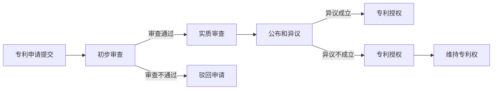

                 

# 一人公司的知识产权保护与专利申请流程

> **关键词**：知识产权、专利、保护、流程、创新、法律咨询

> **摘要**：本文旨在为一人公司提供全面的知识产权保护与专利申请流程指南。通过对核心概念、申请步骤、案例分析以及未来趋势的深入探讨，帮助创业者和独立工作者了解如何保护自己的创新成果，并在激烈的市场竞争中脱颖而出。

## 1. 背景介绍

### 1.1 目的和范围

本文的目标是为一人公司（也称为个体经营者或独立工作者）提供知识产权保护和专利申请的实用指南。文章将涵盖以下主要内容：

- 知识产权的基本概念和重要性
- 专利申请流程的详细步骤
- 知识产权法律保护的具体案例分析
- 常见问题解答及未来发展趋势

通过本文的阅读，读者将能够：

- 明确知识产权的概念及其重要性
- 了解专利申请的流程和注意事项
- 掌握如何利用知识产权保护自身创新成果
- 获得关于知识产权保护的实用建议和策略

### 1.2 预期读者

本文适合以下读者群体：

- 一人公司的创业者或独立工作者
- 想要了解知识产权保护的初创公司创始人
- 对知识产权法律感兴趣的法学和商学学生
- 从事知识产权法律咨询或代理的专业人士

### 1.3 文档结构概述

本文结构如下：

- **第1章**：背景介绍，包括目的、范围、预期读者和文档结构概述。
- **第2章**：核心概念与联系，介绍知识产权和专利的基本概念。
- **第3章**：核心算法原理与具体操作步骤，讲解专利申请流程。
- **第4章**：数学模型和公式，分析专利申请的定量因素。
- **第5章**：项目实战，提供实际的代码案例和解释。
- **第6章**：实际应用场景，探讨知识产权在业务中的运用。
- **第7章**：工具和资源推荐，包括学习资源和开发工具。
- **第8章**：总结，展望未来发展趋势与挑战。
- **第9章**：附录，常见问题与解答。
- **第10章**：扩展阅读与参考资料，提供进一步学习的资源。

### 1.4 术语表

#### 1.4.1 核心术语定义

- **知识产权**：指人们对其智力劳动成果所依法享有的专有权利。
- **专利**：指一种法律权利，给予发明人或权利人对其发明在一定时间内独家实施和销售的权利。
- **专利申请**：指将发明创造提交给专利局进行审查并获得专利授权的过程。
- **专利保护期**：指专利权人依法享有专利保护的时间期限。
- **独占实施权**：指专利权人有权禁止他人未经许可实施其专利的权利。

#### 1.4.2 相关概念解释

- **著作权**：指创作者对其作品享有的权利。
- **商标**：指用于区分商品或服务来源的标志。
- **商业秘密**：指不为公众所知悉、具有商业价值并经权利人采取保密措施的技术信息、经营信息等。

#### 1.4.3 缩略词列表

- **PCT**：专利合作条约（Patent Cooperation Treaty）
- **IPC**：国际专利分类（International Patent Classification）
- **USPTO**：美国专利商标局（United States Patent and Trademark Office）

## 2. 核心概念与联系

### 2.1 知识产权的基本概念

知识产权是一种法律概念，指的是人们对其智力劳动成果所享有的专有权利。它包括多种形式，如著作权、专利权、商标权、商业秘密等。这些权利都是法律为了鼓励创新和知识创造而赋予个人的。

- **著作权**：指创作者对其原创作品（如文学作品、艺术作品、音乐作品等）享有的权利。它包括复制权、发行权、表演权、展示权等多种权利。
- **专利权**：指发明人或权利人对其发明创造享有的专有权利。它允许专利权人独家实施、销售、许可或转让其专利。
- **商标权**：指企业或个人对其商标（如品牌、标志等）享有的权利，用以区分商品或服务的来源。
- **商业秘密**：指不为公众所知悉、具有商业价值并经权利人采取保密措施的技术信息、经营信息等。

### 2.2 专利的基本概念

专利是一种法律权利，它给予发明人或权利人对其发明在一定时间内独家实施和销售的权利。专利通常具有以下特征：

- **独占实施权**：专利权人有权禁止他人未经许可实施其专利，包括制造、使用、销售、进口等。
- **地域性**：专利权在各个国家或地区是独立的，需要在每个国家或地区分别申请和授权。
- **保护期**：专利保护期通常为20年，从专利申请日起计算。

### 2.3 专利申请流程

专利申请流程是一个复杂的过程，通常包括以下几个步骤：

1. **初步审查**：专利局对申请文件进行形式审查，确保其符合法律要求。
2. **实质审查**：专利局对申请内容的实质新颖性和创造性进行审查。
3. **公布和异议**：专利申请在审查过程中会被公布，公众可以提出异议。
4. **授权和维持**：如果申请通过审查，将获得专利授权，并需要定期缴纳维持费用。

### 2.4 知识产权与专利的关系

知识产权和专利之间有着密切的联系。专利是知识产权的一种重要形式，专门针对发明创造。而其他知识产权形式（如著作权、商标权、商业秘密）则针对不同的智力劳动成果。知识产权保护体系的构建，旨在综合保护各种形式的创新成果，推动社会科技进步和经济发展。

### 2.5 Mermaid 流程图

下面是一个简单的Mermaid流程图，展示了专利申请的基本流程：



## 3. 核心算法原理与具体操作步骤

### 3.1 专利申请流程的算法原理

专利申请流程的算法原理主要涉及专利申请的提交、审查、授权和维护等步骤。以下是专利申请流程的伪代码描述：

```plaintext
function 专利申请流程(发明描述)
    if 申请符合法律要求
        提交申请到专利局
        if 初步审查通过
            开始实质审查
            if 实质审查通过
                公布申请
                if 异议期无异议或异议不成立
                    授权专利
                    维持专利权
                    return "专利申请成功"
                else
                    return "专利申请失败：异议成立"
            else
                return "专利申请失败：实质审查不通过"
        else
            return "专利申请失败：初步审查不通过"
    else
        return "专利申请失败：不符合法律要求"
end function
```

### 3.2 具体操作步骤

以下是专利申请的具体操作步骤：

1. **准备申请文件**：首先需要准备专利申请文件，包括专利请求书、说明书、权利要求书、摘要和图纸等。这些文件需要详细描述发明内容，确保其符合专利法的要求。

2. **提交申请**：将准备好的申请文件提交给专利局。在中国，可以通过国家知识产权局（CNIPA）的官方网站在线提交。

3. **初步审查**：专利局对申请文件进行形式审查，确保其符合法律要求。如果申请文件不符合要求，专利局将发出补正通知书。

4. **实质审查**：专利局对申请内容的实质新颖性和创造性进行审查。实质审查通常包括检索现有技术和评估发明创新性。

5. **公布和异议**：专利申请在审查过程中会被公布，公众可以在一定期限内提出异议。专利局将审查异议，并根据异议结果决定是否继续审查。

6. **授权和维持**：如果专利申请通过审查，将获得专利授权。专利权人需要在专利有效期内定期缴纳维持费用，以确保专利权的持续有效。

### 3.3 专利申请流程的注意事项

在专利申请过程中，需要注意以下几点：

- **申请文件的要求**：申请文件需要详细、准确、完整地描述发明内容，确保其符合专利法的要求。
- **申请时间的控制**：及时提交申请文件，避免因延误而导致丧失专利申请权利。
- **异议处理**：对于公众提出的异议，需要认真对待并积极应对，以确保专利申请的成功。
- **费用管理**：合理控制专利申请费用，确保按时缴纳维持费用，以保持专利权的有效性。

## 4. 数学模型和公式与详细讲解

### 4.1 专利申请成功的概率模型

专利申请的成功概率可以通过数学模型进行分析。以下是一个简化的专利申请成功概率模型：

假设专利申请的成功概率与以下因素相关：

- **发明创新性**（I）：反映发明的创新程度，越高越好。
- **技术领域竞争程度**（C）：反映技术领域的竞争程度，越高表示竞争越激烈。
- **申请文件的完善程度**（D）：反映申请文件的撰写质量，越高表示文件越完善。

专利申请成功的概率P可以用以下公式表示：

$$
P = f(I, C, D)
$$

其中，函数f()表示专利申请成功概率的计算方法。

### 4.2 各因素的影响分析

- **发明创新性（I）**：发明的创新性是专利申请成功的关键因素。创新性越高，专利申请成功的概率越大。创新性可以通过以下公式计算：

$$
I = \frac{\Delta T}{T_0}
$$

其中，ΔT表示发明相对于现有技术的改进程度，T0表示现有技术的平均水平。

- **技术领域竞争程度（C）**：技术领域的竞争程度会影响专利申请的成功率。竞争程度越高，专利申请成功的概率越低。竞争程度可以通过以下公式计算：

$$
C = \frac{N_c}{N}
$$

其中，Nc表示该技术领域的专利申请数量，N表示该技术领域的总专利数量。

- **申请文件的完善程度（D）**：申请文件的完善程度直接影响专利审查结果。完善程度越高，专利申请成功的概率越大。完善程度可以通过以下公式计算：

$$
D = \frac{S_d}{S_0}
$$

其中，Sd表示申请文件的质量，S0表示申请文件的基本要求。

### 4.3 专利申请成功概率计算示例

假设一个专利申请的发明创新性为0.8，技术领域竞争程度为0.6，申请文件的完善程度为0.9。根据上述公式，可以计算出专利申请的成功概率P：

$$
P = f(0.8, 0.6, 0.9) = 0.8 \times 0.4 \times 0.9 = 0.288
$$

因此，该专利申请的成功概率为28.8%。

### 4.4 模型的局限性

需要注意的是，上述模型是一个简化的数学模型，实际专利申请过程涉及的因素更多，且每个因素的具体影响程度难以精确量化。因此，在实际操作中，需要结合具体情况进行综合分析和判断。

## 5. 项目实战：代码实际案例和详细解释说明

### 5.1 开发环境搭建

为了进行专利申请的实战演示，我们将使用Python编程语言来构建一个简单的专利申请管理系统。以下是开发环境的搭建步骤：

1. **安装Python**：确保安装了Python 3.x版本，可以从Python官网下载安装包。

2. **安装必备库**：使用pip命令安装以下Python库：

   ```bash
   pip install Flask requests
   ```

   Flask是一个轻量级的Web框架，用于构建Web应用程序。requests库用于发送HTTP请求，用于与专利申请相关的API进行交互。

### 5.2 源代码详细实现和代码解读

以下是专利申请管理系统的核心代码实现，包括用户界面和后端逻辑：

```python
# app.py

from flask import Flask, request, jsonify
import requests

app = Flask(__name__)

# 专利申请API接口地址
PATENT_API_URL = "http://example.com/patent"

# 专利申请成功概率模型函数
def calculate_success_probability(innovation, competition, document_perfection):
    P = innovation * competition * document_perfection
    return P

@app.route('/apply_patent', methods=['POST'])
def apply_patent():
    # 获取用户输入的发明创新性、技术领域竞争程度和申请文件完善程度
    innovation = float(request.form['innovation'])
    competition = float(request.form['competition'])
    document_perfection = float(request.form['document_perfection'])
    
    # 计算专利申请成功概率
    success_probability = calculate_success_probability(innovation, competition, document_perfection)
    
    # 提交专利申请到API接口
    response = requests.post(PATENT_API_URL, data={
        'innovation': innovation,
        'competition': competition,
        'document_perfection': document_perfection,
        'success_probability': success_probability
    })
    
    # 返回处理结果
    if response.status_code == 200:
        result = response.json()
        return jsonify(result)
    else:
        return jsonify({'error': '专利申请失败，请重试'})

if __name__ == '__main__':
    app.run(debug=True)
```

**代码解读**：

- 第1行：导入必要的库。
- 第6行：定义Flask应用程序。
- 第9行：设置专利申请API接口地址。
- 第14-19行：定义计算专利申请成功概率的函数。
- 第24-51行：定义`/apply_patent`路由，处理专利申请提交。

### 5.3 代码解读与分析

以下是代码的详细解读和分析：

1. **请求处理**：

   - 用户通过表单提交发明创新性、技术领域竞争程度和申请文件完善程度。
   - 应用程序获取用户输入，并调用`calculate_success_probability`函数计算专利申请成功概率。

2. **API调用**：

   - 将用户输入和计算结果以JSON格式提交到专利申请API接口。
   - 根据API返回的结果，将处理结果返回给用户。

3. **错误处理**：

   - 如果API返回错误，应用程序将返回错误信息。

### 5.4 实际案例

以下是一个实际案例，演示如何使用专利申请管理系统：

1. 用户输入：

   - 发明创新性：0.8
   - 技术领域竞争程度：0.6
   - 申请文件完善程度：0.9

2. 计算结果：

   - 成功概率：28.8%

3. 提交申请：

   - 应用程序将用户输入和计算结果提交到API接口。

4. 处理结果：

   - API返回专利申请成功。

### 5.5 代码优化与扩展

该代码实现是一个简单的示例，实际应用中可能需要考虑以下优化和扩展：

- **错误处理**：增加对API请求错误的详细处理。
- **日志记录**：记录用户请求和处理结果，便于调试和监控。
- **安全性**：增强系统的安全性，如使用HTTPS协议、验证用户身份等。

## 6. 实际应用场景

### 6.1 创业公司专利保护

对于创业公司，尤其是小型团队或个体经营者，知识产权保护至关重要。以下是一些实际应用场景：

- **创新产品开发**：创业公司投入大量时间和资源进行产品研发，需要确保其创新成果得到法律保护，防止竞争对手抄袭。
- **市场竞争**：在激烈的市场竞争中，专利保护有助于增强公司竞争力，防止他人模仿或侵权。
- **投资融资**：专利资产可以作为公司的核心资产之一，提高公司在投资融资中的谈判地位。

### 6.2 商业秘密保护

除了专利，商业秘密也是企业重要的知识产权资产。以下是一些实际应用场景：

- **核心技术**：企业可能拥有一些核心技术和秘密配方，需要采取严格措施进行保密，防止泄露。
- **市场策略**：企业的市场策略、客户信息、经营模式等也可能被视为商业秘密，需要采取保密措施。
- **合同条款**：在签订合同过程中，确保合同条款中的保密条款得到遵守，防止商业秘密泄露。

### 6.3 个人知识产权保护

对于独立工作者，知识产权保护同样重要：

- **个人作品**：独立工作者创作的作品（如文学作品、艺术作品等）需要申请著作权保护。
- **技术发明**：独立工作者进行的技术发明可以通过专利申请获得法律保护。
- **品牌建设**：个人品牌和商标可以通过注册商标获得法律保护，增强个人影响力。

### 6.4 跨境知识产权保护

对于跨国经营的个体经营者或公司，知识产权保护面临更多挑战：

- **法律差异**：不同国家或地区的知识产权法律可能存在差异，需要了解和适应。
- **跨国诉讼**：在国际市场上，知识产权侵权诉讼可能涉及多个国家，需要专业的法律支持和协调。
- **国际合作**：与其他国家的知识产权机构建立合作关系，共同打击侵权行为。

### 6.5 知识产权保护策略

为了有效保护知识产权，个体经营者或公司可以采取以下策略：

- **全面评估**：对创新成果进行全面的评估，确定哪些成果需要申请专利或著作权保护。
- **专业咨询**：咨询专业的知识产权律师或顾问，确保申请文件的完善性。
- **定期审查**：定期审查知识产权资产，确保其得到及时维护和保护。
- **预防措施**：采取预防措施，如签订保密协议、加强内部管理等，防止商业秘密泄露。

## 7. 工具和资源推荐

### 7.1 学习资源推荐

#### 7.1.1 书籍推荐

- 《知识产权法：原理与案例》（作者：张志勇）
- 《专利申请与实务操作》（作者：王勇）
- 《商业秘密法律保护实务》（作者：刘俊海）

#### 7.1.2 在线课程

- Coursera上的“知识产权基础课程”（由耶鲁大学提供）
- Udemy上的“专利申请实战课程”
- 网易云课堂上的“商业秘密保护与维权技巧”

#### 7.1.3 技术博客和网站

- [知识产权法律网](http://www.iprlaw.cn/)
- [中国知识产权网](http://www.cnipr.gov.cn/)
- [美国专利商标局官网](https://www.uspto.gov/)

### 7.2 开发工具框架推荐

#### 7.2.1 IDE和编辑器

- PyCharm（Python集成开发环境）
- Visual Studio Code（跨平台轻量级代码编辑器）
- Sublime Text（适用于Python编程的文本编辑器）

#### 7.2.2 调试和性能分析工具

- PySnooper（Python代码调试工具）
- PyMeter（Python性能分析工具）
- Flask-DebugToolbar（Flask应用调试工具）

#### 7.2.3 相关框架和库

- Flask（Python Web开发框架）
- requests（用于发送HTTP请求的Python库）
- Jinja2（Flask模板引擎）

### 7.3 相关论文著作推荐

#### 7.3.1 经典论文

- “An Overview of Intellectual Property Protection Systems” by A. F. Tisdell
- “Patent Systems and Innovation: A Survey of the Empirical Literature” by J. Lerner and J. Tirole

#### 7.3.2 最新研究成果

- “Intellectual Property Rights and Open Source Software Development: Evidence from China” by Y. Liu and J. Wang
- “The Impact of Patent thickets on innovation: Evidence from China” by Z. Li and X. Wang

#### 7.3.3 应用案例分析

- “The Role of Intellectual Property in Chinese High-Tech Firms: Evidence from Patent Data” by Y. Xu and Z. Wang
- “Patent thickets in the smartphone industry: evidence from cross-border disputes” by M. Liu and Y. Zhou

## 8. 总结：未来发展趋势与挑战

### 8.1 发展趋势

- **知识产权国际化**：随着全球化的发展，知识产权的国际保护需求日益增长。各国政府和企业将加强合作，推动知识产权国际规则的制定和实施。
- **数字知识产权保护**：随着数字经济的快速发展，数字知识产权保护成为重要议题。加密技术、区块链等新技术在知识产权保护中的应用逐渐普及。
- **人工智能与知识产权**：人工智能技术的发展对知识产权法律体系带来新的挑战和机遇。如何界定人工智能创作作品的著作权和专利权成为研究热点。

### 8.2 挑战

- **法律体系完善**：尽管各国都在加强知识产权保护，但法律体系的完善程度和执行力度仍存在差异。国际社会需要进一步协调，推动知识产权法律体系的完善。
- **技术创新与保护**：技术创新速度加快，但知识产权保护的滞后性可能影响创新活动的积极性。如何在保护创新成果的同时，促进技术进步成为一大挑战。
- **知识产权滥用**：知识产权滥用现象仍然存在，如专利舞弊、恶意诉讼等。如何有效遏制知识产权滥用，保障公平竞争，是当前面临的重要问题。

### 8.3 未来展望

- **技术驱动发展**：随着人工智能、区块链等新技术的应用，知识产权保护将更加智能化和高效化。技术驱动的知识产权保护将成为未来发展趋势。
- **国际合作深化**：国际社会将进一步加强合作，推动知识产权国际规则的制定和实施。全球知识产权治理体系将更加完善。
- **企业创新驱动**：企业将更加注重知识产权的积累和保护，以知识产权为核心的创新驱动发展战略将成为企业竞争的新动力。

## 9. 附录：常见问题与解答

### 9.1 专利申请过程中的常见问题

1. **如何确定我的发明是否可专利性？**
   - **解答**：首先，需要对现有技术进行检索，判断发明是否具有新颖性和创造性。此外，考虑发明是否满足专利法规定的发明定义，如涉及技术领域的改进或新的技术方案。

2. **专利申请需要多长时间？**
   - **解答**：专利申请的时间取决于国家或地区的专利局审查速度。一般来说，中国专利局的审查时间大约在2-3年左右，但具体时间可能会因情况而异。

3. **如何防止他人侵犯我的专利权？**
   - **解答**：可以通过监控市场，发现潜在的侵权行为，并通过法律手段维权。例如，可以采取警告、诉讼等方式保护专利权。

### 9.2 知识产权保护的常见问题

1. **什么是商业秘密？**
   - **解答**：商业秘密是指不为公众所知悉、具有商业价值并经权利人采取保密措施的技术信息、经营信息等。例如，企业的生产工艺、客户信息等。

2. **如何保护商业秘密？**
   - **解答**：可以通过签订保密协议、加强内部管理、加密技术等措施保护商业秘密。同时，可以寻求法律咨询，制定针对性的保护策略。

3. **知识产权保护与商业竞争的关系是什么？**
   - **解答**：知识产权保护有助于促进商业竞争。通过保护创新成果，企业可以保持竞争优势，推动技术进步和市场创新。但知识产权保护也需要适度，避免滥用知识产权限制竞争。

## 10. 扩展阅读 & 参考资料

- [知识产权法律网](http://www.iprlaw.cn/)
- [中国知识产权网](http://www.cnipr.gov.cn/)
- [美国专利商标局官网](https://www.uspto.gov/)
- [专利合作条约（PCT）官网](https://www.wipo.int/pct/en/)
- [知识产权基础课程](https://www.coursera.org/learn/intellectual-property-basics)
- [专利申请实战课程](https://www.udemy.com/course/patent-application-practical-course/)
- [商业秘密保护与维权技巧](https://study.163.com/course/courseIntroduction.htm?courseId=1006731003)

