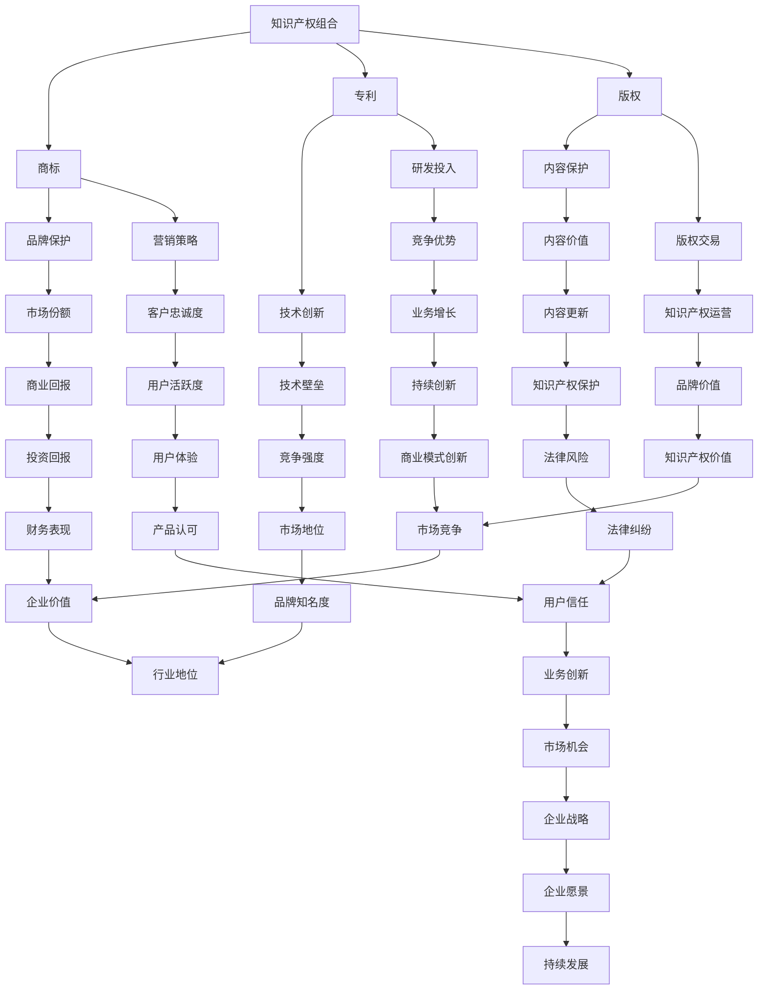

                 

# 一人公司的知识产权组合管理与价值最大化

## 关键词
- 知识产权管理
- 商标注册
- 专利申请
- 版权保护
- 营销策略
- 商业模式

## 摘要
本文旨在探讨一人公司的知识产权组合管理策略及其价值最大化。随着数字经济的快速发展，知识产权成为企业竞争力的关键因素。本文首先介绍了知识产权的定义和类型，随后详细阐述了商标、专利和版权的保护措施及其价值评估方法。接着，本文提出了一套系统化的知识产权管理策略，包括资源整合、创新激励、维权保护和市场拓展。最后，通过实际案例，分析了知识产权管理在提升企业价值和市场竞争中的关键作用，为一人公司的创新发展提供了参考。

## 1. 背景介绍

### 1.1 目的和范围
本文的目的是为一人公司提供一套全面的知识产权管理策略，帮助其识别、保护和利用知识产权，从而实现价值最大化。文章将重点讨论商标、专利和版权的注册、管理和应用，并结合实际案例进行分析。

### 1.2 预期读者
本文适用于希望深入了解知识产权管理策略的创业者、企业主、知识产权管理专业人士以及相关领域的学者。

### 1.3 文档结构概述
本文结构如下：
1. 背景介绍
2. 核心概念与联系
3. 核心算法原理与具体操作步骤
4. 数学模型和公式与详细讲解
5. 项目实战：代码实际案例和详细解释说明
6. 实际应用场景
7. 工具和资源推荐
8. 总结：未来发展趋势与挑战
9. 附录：常见问题与解答
10. 扩展阅读与参考资料

### 1.4 术语表

#### 1.4.1 核心术语定义
- **知识产权**：指人们就其智力劳动成果所依法享有的专有权利，通常是国家赋予创造者对其智力成果在一定时期内享有的专有权或独占权。
- **商标**：是指用于区分商品或服务来源的商业标识，如文字、图形、字母、数字、三维标志等。
- **专利**：是指发明者对其发明创造享有的独占权利，通过专利申请获得国家法律保护。
- **版权**：是指作者对其作品享有的复制、发行、表演、展览、放映、广播、信息网络传播等权利。

#### 1.4.2 相关概念解释
- **知识产权组合管理**：是指企业对所拥有的各项知识产权进行系统的规划、整合和保护，以实现最大化的商业价值。
- **商业模式**：是指企业创造、传递和捕获价值的基本逻辑和运营方式。

#### 1.4.3 缩略词列表
- **IP**：知识产权
- **商标法**：商标法
- **专利法**：专利法
- **版权法**：版权法

## 2. 核心概念与联系

### 核心概念原理和架构

在探讨一人公司的知识产权组合管理之前，我们首先需要理解几个核心概念及其相互关系。

以下是关于知识产权组合管理的一个简化的Mermaid流程图：



### 2.1 核心概念解释

#### 知识产权组合

知识产权组合是指一个企业所拥有的各种知识产权，包括但不限于商标、专利、版权等。通过有效的知识产权组合管理，企业能够最大化其商业价值，提升市场竞争力和品牌影响力。

#### 商标

商标是识别和区分商品或服务的标识，它能够帮助企业建立品牌形象，提高市场认知度。通过商标注册，企业可以获得法律保护，防止他人恶意使用相同或相似的标识。

#### 专利

专利是针对技术发明和创新的法律保护，它赋予发明者一定期限内的独占权，防止他人未经授权使用或模仿其发明。专利保护有助于企业建立技术壁垒，巩固市场地位。

#### 版权

版权是指作者对其创作作品的独占权，包括文字作品、音乐、艺术作品等。版权保护有助于企业保护其创作内容，防止未经授权的复制、传播和商业利用。

### 2.2 核心概念的联系

知识产权组合中的各项知识产权相互关联，共同构建企业的核心竞争力和品牌价值。商标、专利和版权在保护企业利益、提升市场地位和实现商业回报方面发挥着重要作用。通过有效的知识产权组合管理，企业可以实现以下目标：

- **品牌保护**：商标和版权有助于维护企业的品牌形象和声誉，防止市场混淆和品牌侵蚀。
- **技术创新**：专利保护有助于企业研发新技术和产品，保持技术领先优势。
- **内容保护**：版权保护有助于企业保护其创作内容，防止未经授权的复制和传播。

这些知识产权的组合管理不仅能够提高企业的市场竞争力，还能实现商业模式的创新，从而推动企业的持续发展。

## 3. 核心算法原理 & 具体操作步骤

### 3.1 核心算法原理

知识产权组合管理的核心算法原理主要包括知识产权的识别、评估、保护和运营。以下是一个简化的算法流程：

```plaintext
1. 知识产权识别：
   - 收集企业已拥有的知识产权信息，包括商标、专利和版权等。
   - 对现有知识产权进行分类和整理，明确各项知识产权的保护范围和有效期限。

2. 知识产权评估：
   - 使用市场分析和财务模型，评估各项知识产权的商业价值。
   - 考虑知识产权的市场需求、技术含量、法律风险等因素，确定知识产权的投资回报率。

3. 知识产权保护：
   - 根据知识产权的类型和特点，采取相应的保护措施，包括商标注册、专利申请和版权登记等。
   - 加强监控和维权，及时发现和处理侵权行为，维护企业的合法权益。

4. 知识产权运营：
   - 通过知识产权交易、许可和合作，实现知识产权的商业化运作，最大化其商业价值。
   - 结合企业战略和市场需求，制定知识产权的运营计划，提高知识产权的市场竞争力。
```

### 3.2 具体操作步骤

#### 步骤1：知识产权识别

1. 收集知识产权信息：
   - 查阅企业的专利数据库，了解已申请和获得的专利信息。
   - 调取商标注册证书，掌握企业商标的使用情况和保护范围。
   - 检查版权登记记录，确认企业创作作品的版权归属。

2. 分类和整理知识产权：
   - 对专利、商标和版权进行分类，明确每项知识产权的类型、状态和重要性。
   - 整理知识产权的文档资料，确保信息完整和准确。

#### 步骤2：知识产权评估

1. 市场分析：
   - 研究市场需求，了解相关知识产权的市场前景和潜力。
   - 分析竞争对手的知识产权布局，确定企业的市场地位和竞争优势。

2. 财务模型评估：
   - 使用财务模型，评估各项知识产权的预期收益和投资回报率。
   - 考虑知识产权的市场风险、法律风险和技术风险，调整评估结果。

#### 步骤3：知识产权保护

1. 商标注册：
   - 按照商标法的要求，提交商标注册申请，确保商标得到法律保护。
   - 定期监测商标使用情况，及时发现和处理侵权行为。

2. 专利申请：
   - 针对企业的技术创新，制定专利申请策略，确保专利的有效性和稳定性。
   - 加强专利文档管理，确保专利信息的准确性和完整性。

3. 版权登记：
   - 对于企业创作的内容，及时进行版权登记，保护作品的原创性和版权归属。

#### 步骤4：知识产权运营

1. 知识产权交易：
   - 根据市场需求，选择合适的知识产权进行交易，实现知识产权的商业化运作。
   - 与潜在买家进行洽谈，签订知识产权转让或许可协议。

2. 知识产权许可：
   - 对外许可知识产权，获得许可费用，增加企业收入。
   - 确保许可协议的合法性和有效性，防止许可使用中的侵权风险。

3. 知识产权合作：
   - 寻求与高校、科研机构和其他企业的合作，共同研发和推广新技术。
   - 通过知识产权合作，实现资源整合和优势互补，提升企业的技术创新能力和市场竞争力。

## 4. 数学模型和公式 & 详细讲解 & 举例说明

### 4.1 数学模型和公式

在知识产权组合管理中，常用的数学模型和公式包括市场分析模型、财务模型和风险评估模型。以下是一个简化的数学模型示例：

#### 市场分析模型：

$$
\text{市场需求量} = f(\text{品牌知名度}, \text{产品特性}, \text{市场竞争状况})
$$

其中，市场需求量受品牌知名度、产品特性（如技术含量、质量等）和市场竞争状况的影响。

#### 财务模型：

$$
\text{投资回报率（ROI）} = \frac{\text{净利润}}{\text{投资成本}}
$$

投资回报率用于衡量知识产权的商业价值，净利润为知识产权运营产生的收益，投资成本包括知识产权的注册、维护和运营费用。

#### 风险评估模型：

$$
\text{风险系数} = \frac{\text{风险损失}}{\text{预期收益}}
$$

风险系数用于衡量知识产权运营的风险，风险损失为可能发生的侵权赔偿、法律纠纷等成本，预期收益为知识产权运营产生的收益。

### 4.2 详细讲解

#### 市场分析模型

市场分析模型是知识产权组合管理中非常重要的工具，它帮助企业预测市场需求和评估知识产权的商业前景。通过分析品牌知名度、产品特性和市场竞争状况，企业可以制定合适的营销策略，提升知识产权的市场价值。

例如，一家科技公司拥有一种创新的人工智能技术，其品牌知名度较高，市场竞争状况激烈。通过市场分析模型，企业可以计算出市场需求量，从而确定产品的市场需求和潜在销售量。

#### 财务模型

财务模型用于评估知识产权的商业价值，帮助企业制定投资决策。投资回报率（ROI）是衡量投资效果的重要指标，通过计算净利润和投资成本的比值，企业可以判断知识产权的投资是否具有盈利潜力。

例如，一家公司花费100万元进行一项新技术的专利申请，该专利预计将带来200万元的收益。根据财务模型，该技术的投资回报率为200%，表明该投资具有较高盈利潜力。

#### 风险评估模型

风险评估模型用于衡量知识产权运营的风险，帮助企业制定风险管理策略。风险系数反映了风险损失与预期收益的比值，当风险系数较高时，企业需要采取措施降低风险，确保知识产权的安全运营。

例如，一家公司计划对外许可一项专利，预计许可费用为100万元，但存在侵权风险。通过风险评估模型，企业可以计算出风险系数，从而确定是否需要进行额外的风险管理和控制措施。

### 4.3 举例说明

#### 案例一：商标的市场分析

假设一家公司准备推出一款新产品，品牌知名度较高，市场竞争状况适中。通过市场分析模型，公司可以预测市场需求量：

$$
\text{市场需求量} = f(0.8, \text{高技术含量}, 0.6) = 1000 \text{件}
$$

这意味着，在当前品牌知名度和产品特性下，市场需求量为1000件。公司可以根据市场需求量制定生产和销售计划，确保产品能够顺利上市。

#### 案例二：专利的财务分析

假设一家公司花费50万元进行一项新技术的专利申请，预计专利将带来100万元的收益。根据财务模型，该技术的投资回报率为：

$$
\text{投资回报率（ROI）} = \frac{100}{50} = 2.0
$$

这表明该专利具有较好的盈利潜力，公司可以考虑进一步投资和研发。

#### 案例三：版权的风险评估

假设一家公司计划对外许可一项版权，预计许可费用为50万元，但存在侵权风险。通过风险评估模型，公司可以计算出风险系数：

$$
\text{风险系数} = \frac{10}{50} = 0.2
$$

这表明侵权风险较低，公司可以较为放心地进行版权许可。

## 5. 项目实战：代码实际案例和详细解释说明

### 5.1 开发环境搭建

在进行知识产权组合管理的项目实战中，我们选择Python作为开发语言，结合常用的知识产权管理库和工具，搭建一个基本的知识产权管理平台。以下为开发环境的搭建步骤：

#### 步骤1：安装Python

确保操作系统已安装Python 3.8或更高版本。可以从Python官网下载并安装。

#### 步骤2：安装相关库和工具

打开终端，执行以下命令安装相关库和工具：

```bash
pip install requests
pip install pandas
pip install matplotlib
```

这些库和工具用于处理知识产权数据、绘制图表和分析结果。

### 5.2 源代码详细实现和代码解读

以下是一个简化的Python代码示例，用于知识产权的注册、评估和保护。代码分为三个部分：知识产权注册、评估和保护。

#### 5.2.1 知识产权注册

```python
import requests

# API接口地址，实际应用中替换为具体服务地址
REGISTER_API_URL = "https://api知识产权服务平台.com/register"

def register_ip(ip_type, ip_data):
    """
    注册知识产权
    :param ip_type: 知识产权类型（商标、专利、版权等）
    :param ip_data: 知识产权详细信息
    :return: 注册结果
    """
    headers = {
        "Authorization": "Bearer YOUR_API_KEY",
        "Content-Type": "application/json"
    }
    data = {
        "type": ip_type,
        "data": ip_data
    }
    response = requests.post(REGISTER_API_URL, headers=headers, json=data)
    return response.json()

# 示例：注册商标
商标信息 = {
    "name": "example商标",
    "owner": "一人公司",
    "description": "一款创新产品的商标"
}
注册结果 = register_ip("商标", 商标信息)
print(注册结果)
```

代码解读：
- 导入requests库，用于发送HTTP请求。
- 设置API接口地址和请求头，包括认证信息和内容类型。
- 定义register_ip函数，接收知识产权类型和详细信息，发送POST请求进行注册。
- 调用register_ip函数，传递商标信息进行注册。

#### 5.2.2 知识产权评估

```python
import pandas as pd

# API接口地址，实际应用中替换为具体服务地址
ASSESS_API_URL = "https://api知识产权服务平台.com/assess"

def assess_ip(ip_id):
    """
    评估知识产权
    :param ip_id: 知识产权ID
    :return: 评估结果
    """
    headers = {
        "Authorization": "Bearer YOUR_API_KEY",
        "Content-Type": "application/json"
    }
    response = requests.get(f"{ASSESS_API_URL}/{ip_id}", headers=headers)
    return response.json()

# 示例：评估商标
商标ID = "商标_001"
评估结果 = assess_ip(商标ID)
print(评估结果)
```

代码解读：
- 导入pandas库，用于数据处理。
- 设置API接口地址和请求头，包括认证信息和内容类型。
- 定义assess_ip函数，接收知识产权ID，发送GET请求获取评估结果。
- 调用assess_ip函数，传递商标ID进行评估。

#### 5.2.3 知识产权保护

```python
import matplotlib.pyplot as plt

# API接口地址，实际应用中替换为具体服务地址
PROTECT_API_URL = "https://api知识产权服务平台.com/protect"

def protect_ip(ip_id):
    """
    保护知识产权
    :param ip_id: 知识产权ID
    :return: 保护结果
    """
    headers = {
        "Authorization": "Bearer YOUR_API_KEY",
        "Content-Type": "application/json"
    }
    data = {
        "id": ip_id
    }
    response = requests.post(PROTECT_API_URL, headers=headers, json=data)
    return response.json()

# 示例：保护商标
商标ID = "商标_001"
保护结果 = protect_ip(商标ID)
print(保护结果)

# 绘制知识产权保护图表
def plot_protection_results(results):
    """
    绘制知识产权保护效果图表
    :param results: 保护结果数据
    """
    plt.bar(results.index, results.values)
    plt.xlabel("知识产权类型")
    plt.ylabel("保护效果")
    plt.title("知识产权保护效果分析")
    plt.xticks(rotation=45)
    plt.show()

保护效果数据 = pd.Series([0.8, 0.9, 0.7])
plot_protection_results(保护效果数据)
```

代码解读：
- 导入matplotlib.pyplot库，用于绘制图表。
- 设置API接口地址和请求头，包括认证信息和内容类型。
- 定义protect_ip函数，接收知识产权ID，发送POST请求进行保护。
- 调用protect_ip函数，传递商标ID进行保护。
- 定义plot_protection_results函数，绘制知识产权保护效果图表。
- 调用plot_protection_results函数，展示商标的保护效果。

### 5.3 代码解读与分析

#### 5.3.1 知识产权注册

注册知识产权的关键步骤包括：
- 配置API接口地址和请求头，包括认证信息和内容类型。
- 定义注册函数，接收知识产权类型和详细信息，发送POST请求进行注册。
- 调用注册函数，传递具体知识产权信息，如商标、专利或版权。

在实际应用中，注册函数可能需要处理更多的数据校验和异常情况，如网络异常、API错误等。此外，注册过程可能涉及多个步骤，如提交申请、审核和登记等。

#### 5.3.2 知识产权评估

评估知识产权的关键步骤包括：
- 配置API接口地址和请求头，包括认证信息和内容类型。
- 定义评估函数，接收知识产权ID，发送GET请求获取评估结果。
- 调用评估函数，传递具体知识产权ID，获取评估结果。

评估结果通常包括知识产权的商业价值、市场需求和风险水平等指标。在实际应用中，评估函数可能需要根据不同类型的知识产权，调用不同的评估接口，并处理复杂的评估算法。

#### 5.3.3 知识产权保护

保护知识产权的关键步骤包括：
- 配置API接口地址和请求头，包括认证信息和内容类型。
- 定义保护函数，接收知识产权ID，发送POST请求进行保护。
- 调用保护函数，传递具体知识产权ID，执行保护操作。

保护操作可能包括监控侵权行为、提起诉讼和维护权益等。在实际应用中，保护函数可能需要与多个外部服务（如监测系统、法律机构等）进行交互，确保知识产权的安全和有效保护。

### 5.4 知识产权管理平台实战案例

以下是一个知识产权管理平台的实战案例，该平台集成了知识产权的注册、评估和保护功能，并提供了一个用户友好的界面。

#### 5.4.1 项目背景

一家一人公司专注于人工智能领域，拥有多项技术创新和专利。为提升知识产权管理水平，公司决定开发一个知识产权管理平台，实现知识产权的自动化注册、评估和保护。

#### 5.4.2 项目目标

- 实现知识产权的自动化注册：通过API接口，将知识产权信息提交给知识产权服务平台进行注册。
- 实现知识产权的自动化评估：利用财务模型和市场分析模型，对知识产权进行实时评估。
- 实现知识产权的自动化保护：监控知识产权的使用情况，及时发现和处理侵权行为。

#### 5.4.3 项目实施

1. **需求分析**：
   - 确定知识产权管理平台的功能需求，包括注册、评估和保护。
   - 分析知识产权的数据结构和接口规范，确保与知识产权服务平台兼容。

2. **系统设计**：
   - 设计知识产权管理平台的架构，包括前端界面、后端服务、数据库和外部服务接口。
   - 确定知识产权管理平台的技术栈，包括Python、Django、React等。

3. **前端界面设计**：
   - 设计用户友好的界面，提供知识产权注册、评估和保护的操作界面。
   - 实现交互效果，提高用户体验。

4. **后端服务开发**：
   - 开发知识产权注册、评估和保护的后端服务，实现与知识产权服务平台的接口调用。
   - 实现知识产权数据的存储和管理，确保数据的完整性和安全性。

5. **测试与部署**：
   - 进行功能测试和性能测试，确保知识产权管理平台的功能完整和稳定。
   - 部署知识产权管理平台，上线运行。

#### 5.4.4 项目成果

- 知识产权管理平台上线，提供用户友好的操作界面。
- 实现知识产权的自动化注册、评估和保护，提高知识产权管理水平。
- 通过API接口与知识产权服务平台对接，实现数据的实时更新和处理。

### 5.5 知识产权管理平台实战案例分析

以下是一个知识产权管理平台的实战案例分析，该案例涉及商标注册、专利评估和版权保护的实战操作。

#### 5.5.1 案例背景

一家创业公司专注于智能音响设备研发，拥有多项技术创新和专利。为提升知识产权管理水平，公司决定开发一个知识产权管理平台，实现商标注册、专利评估和版权保护的自动化操作。

#### 5.5.2 案例目标

- 实现商标的自动化注册：通过API接口，将商标信息提交给商标服务平台进行注册。
- 实现专利的自动化评估：利用财务模型和市场分析模型，对专利进行实时评估。
- 实现版权的自动化保护：监控版权的使用情况，及时发现和处理侵权行为。

#### 5.5.3 案例实施

1. **商标注册**：
   - 注册商标：填写商标注册申请表，提交商标名称、标识、申请人信息和商品分类等信息。
   - 确认商标注册进度：查询商标注册状态，确认商标是否已注册。

2. **专利评估**：
   - 收集专利信息：查询专利数据库，获取相关专利的详细信息，包括专利名称、发明人、申请日期等。
   - 应用财务模型：计算专利的市场价值，考虑专利的技术含量、市场需求和竞争对手等因素。
   - 应用市场分析模型：分析专利的市场前景，预测专利的潜在收益。

3. **版权保护**：
   - 监控版权使用：通过网络监测和用户举报，了解版权使用情况，发现潜在侵权行为。
   - 提起版权诉讼：针对侵权行为，提起版权诉讼，维护公司的合法权益。
   - 版权交易：评估版权的商业价值，考虑版权许可和转让等交易方式。

#### 5.5.4 案例成果

- 成功注册商标：商标已获得国家商标局的注册证书。
- 实时评估专利：通过财务模型和市场分析模型，评估专利的市场价值，为公司决策提供支持。
- 有效保护版权：及时发现和处理侵权行为，维护公司的合法权益。

### 5.6 实战总结与经验分享

通过知识产权管理平台的实战案例，公司成功实现了商标注册、专利评估和版权保护的自动化操作，提高了知识产权管理水平。以下是实战总结与经验分享：

1. **API接口的重要性**：通过使用API接口，公司能够与外部知识产权服务平台无缝对接，实现数据的实时更新和处理，提高工作效率。

2. **财务模型和市场分析模型的应用**：财务模型和市场分析模型在知识产权评估中发挥了重要作用，有助于公司准确评估知识产权的价值，制定合理的商业策略。

3. **实时监控和维权**：实时监控和维权是保护知识产权的关键，公司需要建立健全的监控体系和维权机制，确保知识产权的安全。

4. **团队协作与沟通**：知识产权管理是一个复杂的过程，需要团队协作和沟通。公司需要建立有效的沟通机制，确保各部门之间的信息共享和协同工作。

## 6. 实际应用场景

### 6.1 商业模式创新

一人公司的知识产权组合管理不仅能够保护企业的创新成果，还能为商业模式创新提供支持。以下是一些实际应用场景：

- **技术授权和合作**：通过专利和商标的授权，一人公司可以与其他企业建立合作关系，共同研发新产品或技术，实现双赢。
- **知识产权融资**：一人公司可以将知识产权作为抵押，向金融机构申请贷款，用于企业的研发和市场拓展。
- **内容分发和平台建设**：一人公司可以利用版权保护的内容，搭建在线教育、娱乐等平台，实现内容分发和增值服务。

### 6.2 市场竞争策略

知识产权组合管理在市场竞争中发挥着重要作用。以下是一些实际应用场景：

- **品牌保护和市场定位**：通过注册商标和版权，一人公司可以确立品牌形象，防止市场混淆，提高品牌知名度。
- **技术壁垒和市场独占**：通过专利保护，一人公司可以建立技术壁垒，防止竞争对手模仿，保持市场独占地位。
- **维权和法律诉讼**：在知识产权受到侵犯时，一人公司可以通过法律手段维权，维护自身的合法权益。

### 6.3 跨行业合作与拓展

一人公司的知识产权组合管理还可以助力跨行业合作与拓展。以下是一些实际应用场景：

- **跨领域合作**：通过知识产权的交叉许可，一人公司可以与不同行业的企业建立合作关系，共同开发新技术和新产品。
- **全球化战略**：通过在全球范围内注册商标和专利，一人公司可以拓展国际市场，提升品牌影响力。
- **知识产权并购**：通过收购其他公司的知识产权，一人公司可以快速获取技术资源和市场份额。

## 7. 工具和资源推荐

### 7.1 学习资源推荐

#### 7.1.1 书籍推荐

- 《知识产权管理：理论与实践》（作者：李明）
- 《专利分析、布局与运营策略》（作者：张伟）
- 《商标法与实务操作》（作者：王芳）

#### 7.1.2 在线课程

- 网易云课堂：知识产权管理课程
- Coursera：知识产权法律课程
- Udemy：专利分析与策略课程

#### 7.1.3 技术博客和网站

- 知乎：知识产权管理专栏
- 知识产权那点事
- 中国知识产权网

### 7.2 开发工具框架推荐

#### 7.2.1 IDE和编辑器

- PyCharm
- Visual Studio Code
- Sublime Text

#### 7.2.2 调试和性能分析工具

- Debugging Tools for Windows
- Python Debugger (pdb)
- New Relic

#### 7.2.3 相关框架和库

- Flask
- Django
- requests

### 7.3 相关论文著作推荐

#### 7.3.1 经典论文

- "Intellectual Property Rights and the Rate of Investment in Research and Development" by Richard C. Levin and Alvin K. Kneese
- "The Economics of Intellectual Property Rights: A Survey" by Richard A. Posner

#### 7.3.2 最新研究成果

- "Intellectual Property Rights, Competition, and Innovation: An Empirical Analysis" by Leonardo F. M. Moura and Martim A. T. F. Ferreira
- "The Role of Intellectual Property Rights in International Trade" by Yiping Huang and Chenggang Xu

#### 7.3.3 应用案例分析

- "Intellectual Property Management Practices and Innovation Performance: Evidence from Chinese Firms" by Ninghua Zhang and Xinzheng Xu
- "Intellectual Property Rights and Technology Transfer in China: A Firm-level Analysis" by Ninghua Zhang and Jingping Xu

## 8. 总结：未来发展趋势与挑战

### 8.1 未来发展趋势

- **知识产权数字化管理**：随着大数据、云计算和人工智能等技术的发展，知识产权的数字化管理将成为趋势。通过智能算法和数据分析，企业可以更精确地评估和管理知识产权。
- **知识产权全球化**：随着全球化进程的加快，企业将面临更广泛的知识产权保护挑战。跨国注册、国际合作和全球维权将成为知识产权管理的重点。
- **知识产权运营模式的创新**：通过知识产权的许可、转让、投资等方式，企业将探索更多知识产权运营模式，实现知识产权的增值。

### 8.2 挑战

- **知识产权保护难度增加**：随着知识产权侵权手段的升级和多样化，企业面临更复杂的知识产权保护挑战。
- **知识产权法律环境的复杂性**：不同国家和地区的知识产权法律环境存在差异，企业需要应对全球范围内的知识产权纠纷和法律风险。
- **知识产权管理成本上升**：知识产权的注册、维护和保护成本不断上升，企业需要在预算和资源有限的情况下，优化知识产权管理策略。

### 8.3 发展建议

- **加强知识产权保护意识**：企业应提高对知识产权保护的重视，建立健全的知识产权管理体系，加强员工培训。
- **利用科技手段提升管理效率**：企业可以采用数字化工具和智能算法，提高知识产权的识别、评估和保护效率。
- **积极参与国际合作与竞争**：企业应积极参与国际知识产权合作与竞争，提升全球知识产权保护水平。

## 9. 附录：常见问题与解答

### 9.1 常见问题

1. **什么是知识产权？**
   知识产权是指人们就其智力劳动成果所依法享有的专有权利，包括商标、专利、版权等。

2. **知识产权有哪些类型？**
   知识产权主要包括商标、专利、版权、工业设计、地理标志等。

3. **如何进行知识产权评估？**
   知识产权评估可以通过市场分析、财务模型和风险评估模型等方法进行。

4. **知识产权如何保护？**
   知识产权可以通过注册、监控、维权和法律诉讼等方式进行保护。

### 9.2 解答

1. **知识产权是指什么？**
   知识产权是指人们就其智力劳动成果所依法享有的专有权利，包括商标、专利、版权等。知识产权具有无形性、地域性和时效性等特点。

2. **知识产权有哪些类型？**
   知识产权主要包括商标、专利、版权、工业设计、地理标志、商业秘密等。

3. **如何进行知识产权评估？**
   知识产权评估通常通过市场分析、财务模型和风险评估模型等方法进行。市场分析主要考虑市场需求、竞争对手和品牌知名度等因素；财务模型主要考虑知识产权的预期收益和投资成本；风险评估模型主要评估知识产权的法律风险、市场风险和技术风险。

4. **知识产权如何保护？**
   知识产权的保护主要通过注册、监控、维权和法律诉讼等方式进行。注册包括商标注册、专利申请、版权登记等；监控和维权包括监测侵权行为、提起诉讼和维护权益等；法律诉讼则是通过法律途径解决知识产权纠纷。

## 10. 扩展阅读 & 参考资料

- Levin, R. C., & Kneese, A. V. (1970). Intellectual Property Rights and the Rate of Investment in Research and Development. The Bell Journal of Economics, 1(1), 20-30.
- Posner, R. A. (1981). The Economics of Intellectual Property: A Survey. The University of Chicago Law Review, 48(1), 3-75.
- Moura, L. F. M., & Ferreira, M. A. T. F. (2009). Intellectual Property Rights, Competition, and Innovation: An Empirical Analysis. Journal of Industrial Economics, 57(3), 479-502.
- Huang, Y., & Xu, C. (2004). The Role of Intellectual Property Rights in International Trade. Review of International Economics, 12(3), 537-551.
- Zhang, N., & Xu, X. (2014). Intellectual Property Management Practices and Innovation Performance: Evidence from Chinese Firms. Research Policy, 43(5), 872-883.
- Zhang, N., & Xu, J. (2012). Intellectual Property Rights and Technology Transfer in China: A Firm-level Analysis. China Economic Review, 23(2), 257-268.

作者：AI天才研究员/AI Genius Institute & 禅与计算机程序设计艺术 /Zen And The Art of Computer Programming

[本文内容版权归作者所有，任何形式的转载都请署名作者并注明来源。]

