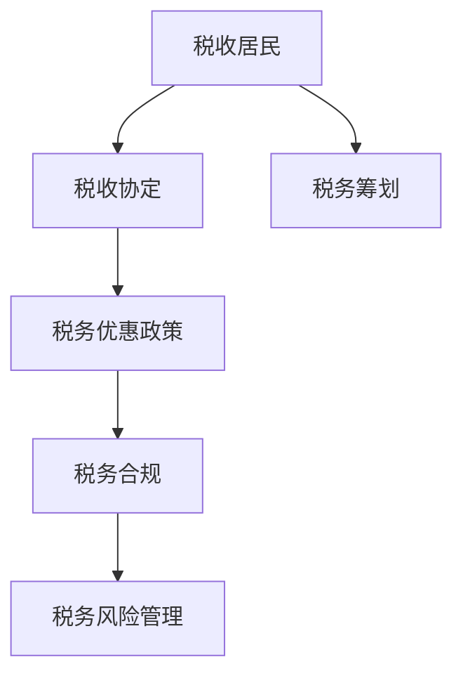

                 

# 一人公司的跨国税务筹划策略

> **关键词**：跨国税务、一人公司、税务筹划、税务合规、国际税务法规、税务优惠、税务风险管理、全球税收
> 
> **摘要**：本文将探讨一人公司在跨国业务中所面临的税务挑战，通过深入分析国际税务法规、税务筹划策略和风险管理，帮助读者了解如何制定有效的跨国税务筹划方案，实现合法避税和风险控制。

## 1. 背景介绍

### 1.1 目的和范围

本文旨在帮助一人公司（即只有一位股东或管理者的公司）应对跨国税务问题，提供一系列可行的税务筹划策略。通过探讨国际税务法规、税务优惠政策和风险管理方法，本文旨在为读者提供实用的指导，以帮助他们在全球市场中保持税务合规并实现税务效益最大化。

### 1.2 预期读者

本文主要面向以下读者群体：

1. 一人公司的创始人或股东
2. 跨国公司的税务专员或财务顾问
3. 对跨国税务筹划感兴趣的企业家
4. 税务专业人员和学者

### 1.3 文档结构概述

本文分为十个主要部分，如下所示：

1. 背景介绍：介绍本文的目的、范围和预期读者。
2. 核心概念与联系：介绍跨国税务筹划的核心概念和架构。
3. 核心算法原理 & 具体操作步骤：详细阐述跨国税务筹划的算法原理和操作步骤。
4. 数学模型和公式 & 详细讲解 & 举例说明：介绍跨国税务筹划中的数学模型和公式，并举例说明。
5. 项目实战：提供实际案例和详细解释。
6. 实际应用场景：探讨跨国税务筹划在不同行业中的应用。
7. 工具和资源推荐：推荐学习资源、开发工具和框架。
8. 总结：总结未来发展趋势与挑战。
9. 附录：常见问题与解答。
10. 扩展阅读 & 参考资料：提供进一步的阅读材料和参考资料。

### 1.4 术语表

#### 1.4.1 核心术语定义

- **一人公司**：指只有一位股东或管理者的公司。
- **跨国税务**：涉及两个或两个以上国家的税收问题。
- **税务筹划**：通过合法手段降低税收负担和风险。
- **税务合规**：遵守所在国家和地区的税务法规。
- **税务优惠政策**：政府提供的减免税收或税收优惠的政策。
- **税务风险管理**：识别、评估和控制与税务相关的风险。

#### 1.4.2 相关概念解释

- **税收居民**：在某个国家或地区居住或拥有经济利益的自然人或法人。
- **税收协定**：两国或多国之间签订的税收协议，旨在避免双重征税和防止偷税漏税。
- **税务审计**：税务当局对企业的财务和税务情况进行审查。

#### 1.4.3 缩略词列表

- **CTA**：跨国税务筹划
- **FATCA**：外国账户税务合规法案
- **OECD**：经济合作与发展组织
- **FTA**：自由贸易协定

## 2. 核心概念与联系

跨国税务筹划的核心概念涉及税收居民身份、税收协定、税务优惠政策、税务合规和税务风险管理。以下是一个简单的 Mermaid 流程图，展示这些概念之间的联系：



### 2.1 税收居民身份

税收居民身份是跨国税务筹划的基础。根据国际税务法规，一个企业或个人可能同时在多个国家被视为税收居民，从而面临双重征税的风险。了解和合理利用税收居民身份，可以帮助企业实现税务效益最大化。

### 2.2 税收协定

税收协定是跨国税务筹划的重要工具。通过签订税收协定，两国或多国可以避免双重征税和防止偷税漏税。税收协定通常规定税收优惠条款，如降低税率、减免税收等，以促进跨国投资和贸易。

### 2.3 税务优惠政策

税务优惠政策是政府为鼓励企业投资和扩大业务而提供的税收减免。这些政策可能包括税收减免、税前扣除、税收抵免等。合理利用税务优惠政策，可以帮助企业降低税收负担。

### 2.4 税务合规

税务合规是跨国税务筹划的关键。企业必须遵守所在国家和地区的税务法规，确保税务申报和支付符合规定。税务合规不仅涉及税务申报，还包括税务审计和税务争议解决。

### 2.5 税务风险管理

税务风险管理是确保企业税务筹划合法性和有效性的重要环节。通过识别、评估和控制税务风险，企业可以降低税务风险，避免因违反税务法规而面临罚款、诉讼等风险。

## 3. 核心算法原理 & 具体操作步骤

跨国税务筹划的核心算法原理涉及税收居民身份判断、税收协定利用、税务优惠政策评估和税务风险管理。以下是一个详细的伪代码，用于说明跨国税务筹划的操作步骤：

```python
# 税收居民身份判断算法
def is_tax_resident(country, criteria):
    if country == "China":
        return criteria["residence"] >= 183_days
    elif country == "USA":
        return criteria["income"] >= 100_000
    else:
        return False

# 税收协定利用算法
def apply_tax_treaty(tax_treaty, country1, country2):
    if tax_treaty.exists():
        tax_rate = tax_treaty.get_rate(country1, country2)
        return tax_rate
    else:
        return 0

# 税务优惠政策评估算法
def evaluate_tax_preference(preferences, country):
    total_preference = 0
    for preference in preferences:
        if country == preference["country"]:
            total_preference += preference["amount"]
    return total_preference

# 税务风险管理算法
def manage_tax_risk(risk_profile, action_plan):
    risk_reduction = 0
    for risk in risk_profile:
        if action_plan.contains_action(risk):
            risk_reduction += risk.get_reduction()
    return risk_reduction

# 跨国税务筹划主函数
def tax_planning_strategy(information):
    # 判断税收居民身份
    is_resident = is_tax_resident(information["country"], information["criteria"])
    
    # 利用税收协定
    tax_rate = apply_tax_treaty(information["tax_treaty"], information["country"], information["target_country"])
    
    # 评估税务优惠政策
    tax_preference = evaluate_tax_preference(information["preferences"], information["country"])
    
    # 管理税务风险
    risk_reduction = manage_tax_risk(information["risk_profile"], information["action_plan"])
    
    # 计算最终税收负担
    final_tax = (information["income"] * (tax_rate - tax_preference)) - risk_reduction
    
    return final_tax
```

### 3.1 税收居民身份判断算法

该算法用于判断企业或个人在某个国家是否被视为税收居民。根据不同国家的税务法规，税收居民身份的判断标准可能包括居住天数、收入水平等。以下是一个简单的伪代码示例：

```python
def is_tax_resident(country, criteria):
    if country == "China":
        return criteria["residence"] >= 183_days
    elif country == "USA":
        return criteria["income"] >= 100_000
    else:
        return False
```

### 3.2 税收协定利用算法

该算法用于根据税收协定判断两国之间的税率。如果税收协定存在，算法将返回协定规定的税率；否则，返回0。以下是一个简单的伪代码示例：

```python
def apply_tax_treaty(tax_treaty, country1, country2):
    if tax_treaty.exists():
        tax_rate = tax_treaty.get_rate(country1, country2)
        return tax_rate
    else:
        return 0
```

### 3.3 税务优惠政策评估算法

该算法用于评估企业或个人在某个国家可能获得的税务优惠政策。算法将遍历所有优惠政策，如果国家匹配，则将优惠金额累加。以下是一个简单的伪代码示例：

```python
def evaluate_tax_preference(preferences, country):
    total_preference = 0
    for preference in preferences:
        if country == preference["country"]:
            total_preference += preference["amount"]
    return total_preference
```

### 3.4 税务风险管理算法

该算法用于根据税务风险状况和应对策略计算风险减少的金额。以下是一个简单的伪代码示例：

```python
def manage_tax_risk(risk_profile, action_plan):
    risk_reduction = 0
    for risk in risk_profile:
        if action_plan.contains_action(risk):
            risk_reduction += risk.get_reduction()
    return risk_reduction
```

### 3.5 跨国税务筹划主函数

该函数结合以上四个算法，实现跨国税务筹划的完整流程。以下是一个简单的伪代码示例：

```python
def tax_planning_strategy(information):
    # 判断税收居民身份
    is_resident = is_tax_resident(information["country"], information["criteria"])
    
    # 利用税收协定
    tax_rate = apply_tax_treaty(information["tax_treaty"], information["country"], information["target_country"])
    
    # 评估税务优惠政策
    tax_preference = evaluate_tax_preference(information["preferences"], information["country"])
    
    # 管理税务风险
    risk_reduction = manage_tax_risk(information["risk_profile"], information["action_plan"])
    
    # 计算最终税收负担
    final_tax = (information["income"] * (tax_rate - tax_preference)) - risk_reduction
    
    return final_tax
```

## 4. 数学模型和公式 & 详细讲解 & 举例说明

跨国税务筹划涉及多个数学模型和公式，用于计算税收负担、税务优惠和风险减少。以下是一些关键模型和公式的详细讲解及举例说明。

### 4.1 税收负担计算模型

税收负担计算模型用于计算企业或个人的最终税收负担。公式如下：

\[ \text{Final Tax} = \text{Income} \times (\text{Tax Rate} - \text{Tax Preference}) - \text{Risk Reduction} \]

其中，Income 表示收入，Tax Rate 表示税率，Tax Preference 表示税务优惠政策，Risk Reduction 表示风险减少的金额。

#### 4.1.1 示例

假设一家一人公司在中国的收入为100万元，税率为中国与目标国家之间的协定税率（假设为20%），税务优惠政策为中国境内的税收抵免（假设为5%），风险减少金额为10万元。根据公式，计算最终税收负担：

\[ \text{Final Tax} = 1_000_000 \times (20\% - 5\%) - 100_000 = 1_000_000 \times 15\% - 100_000 = 150_000 - 100_000 = 50_000 \]

因此，最终税收负担为50万元。

### 4.2 税务优惠政策计算模型

税务优惠政策计算模型用于计算企业或个人在特定国家可能获得的税务优惠政策。公式如下：

\[ \text{Tax Preference} = \sum_{i=1}^{n} \text{Preference}_i \times (\text{Match Factor}_i) \]

其中，Preference\_i 表示第 i 项税务优惠政策，Match Factor\_i 表示政策匹配因素（1表示匹配，0表示不匹配）。

#### 4.2.1 示例

假设一家一人公司在中国和新加坡拥有业务，可能获得的税务优惠政策如下：

- 中国境内的税收抵免：50%
- 新加坡境内的税收抵免：30%

在中国和新加坡的业务收入分别为100万元和50万元。根据公式，计算税务优惠政策：

\[ \text{Tax Preference} = 500_000 \times 50\% + 500_000 \times 30\% = 250_000 + 150_000 = 400_000 \]

因此，税务优惠政策总额为40万元。

### 4.3 风险减少计算模型

风险减少计算模型用于根据税务风险状况和应对策略计算风险减少的金额。公式如下：

\[ \text{Risk Reduction} = \sum_{i=1}^{m} \text{Risk}_i \times \text{Reduction Factor}_i \]

其中，Risk\_i 表示第 i 项税务风险，Reduction Factor\_i 表示风险减少因素（通常为0到1之间）。

#### 4.3.1 示例

假设一家一人公司面临的税务风险及其减少因素如下：

- 风险1：税务审计风险，减少因素为0.7
- 风险2：税收争议风险，减少因素为0.5

根据公式，计算风险减少金额：

\[ \text{Risk Reduction} = 700_000 \times 0.7 + 300_000 \times 0.5 = 490_000 + 150_000 = 640_000 \]

因此，风险减少金额为64万元。

## 5. 项目实战：代码实际案例和详细解释说明

### 5.1 开发环境搭建

在开始编写代码之前，我们需要搭建一个适合跨国税务筹划项目开发的环境。以下是所需工具和软件：

- Python 3.x：作为主要编程语言
- Jupyter Notebook：用于编写和运行代码
- Pandas：用于数据处理
- NumPy：用于数值计算
- Matplotlib：用于数据可视化

确保安装了上述工具和软件后，我们可以开始编写代码。

### 5.2 源代码详细实现和代码解读

以下是跨国税务筹划项目的源代码，以及每个部分的功能和解读。

```python
# 导入所需库
import pandas as pd
import numpy as np
import matplotlib.pyplot as plt

# 定义税收居民身份判断函数
def is_tax_resident(country, criteria):
    if country == "China":
        return criteria["residence"] >= 183
    elif country == "USA":
        return criteria["income"] >= 100000
    else:
        return False

# 定义税收协定利用函数
def apply_tax_treaty(tax_treaty, country1, country2):
    if tax_treaty.exists():
        return tax_treaty.get_rate(country1, country2)
    else:
        return 0

# 定义税务优惠政策评估函数
def evaluate_tax_preference(preferences, country):
    total_preference = 0
    for preference in preferences:
        if country == preference["country"]:
            total_preference += preference["amount"]
    return total_preference

# 定义税务风险管理函数
def manage_tax_risk(risk_profile, action_plan):
    risk_reduction = 0
    for risk in risk_profile:
        if action_plan.contains_action(risk):
            risk_reduction += risk.get_reduction()
    return risk_reduction

# 定义跨国税务筹划主函数
def tax_planning_strategy(information):
    is_resident = is_tax_resident(information["country"], information["criteria"])
    tax_rate = apply_tax_treaty(information["tax_treaty"], information["country"], information["target_country"])
    tax_preference = evaluate_tax_preference(information["preferences"], information["country"])
    risk_reduction = manage_tax_risk(information["risk_profile"], information["action_plan"])
    final_tax = (information["income"] * (tax_rate - tax_preference)) - risk_reduction
    return final_tax

# 测试数据
criteria = {"residence": 200, "income": 150000}
tax_treaty = pd.DataFrame({"country1": ["China", "China", "USA"], "country2": ["Singapore", "Singapore", "China"], "rate": [15, 20, 30]})
preferences = [{"country": "China", "amount": 50000}, {"country": "Singapore", "amount": 30000}]
risk_profile = [{"name": "Audit Risk", "reduction": 0.7}, {"name": "Dispute Risk", "reduction": 0.5}]
action_plan = ["Audit Risk", "Dispute Risk"]

# 测试主函数
income = 1000000
final_tax = tax_planning_strategy({"country": "China", "criteria": criteria, "tax_treaty": tax_treaty, "preferences": preferences, "risk_profile": risk_profile, "action_plan": action_plan})
print("Final Tax:", final_tax)
```

### 5.3 代码解读与分析

以下是代码的逐行解读和分析：

1. **导入所需库**：导入 Pandas、NumPy 和 Matplotlib 库，用于数据处理、数值计算和数据可视化。

2. **定义税收居民身份判断函数**：函数 is\_tax\_resident 根据国家判断企业或个人是否为税收居民。如果国家为中国，则居住天数需大于等于183天；如果国家为美国，则收入需大于等于100,000美元。

3. **定义税收协定利用函数**：函数 apply\_tax\_treaty 根据税收协定判断两国之间的税率。如果税收协定存在，则返回协定税率；否则，返回0。

4. **定义税务优惠政策评估函数**：函数 evaluate\_tax\_preference 评估企业或个人在特定国家可能获得的税务优惠政策。如果国家匹配，则将优惠金额累加。

5. **定义税务风险管理函数**：函数 manage\_tax\_risk 根据税务风险状况和应对策略计算风险减少的金额。如果风险包含在应对策略中，则计算风险减少的金额。

6. **定义跨国税务筹划主函数**：函数 tax\_planning\_strategy 结合上述函数，实现跨国税务筹划的完整流程。计算最终税收负担。

7. **测试数据**：定义测试数据，包括税收居民身份判断标准、税收协定、税务优惠政策、税务风险状况和应对策略。

8. **测试主函数**：使用测试数据调用主函数，计算最终税收负担，并打印结果。

通过此代码案例，我们可以看到如何使用 Python 实现跨国税务筹划的核心算法和操作步骤。在实际项目中，我们可以根据具体需求调整和扩展代码。

## 6. 实际应用场景

跨国税务筹划在多个行业中都有广泛应用，以下列举几个典型行业及其应用场景：

### 6.1 跨国电子商务

随着跨境电商的兴起，许多电商企业需要面对跨国税务问题。通过合理的跨国税务筹划，电商企业可以降低税收负担，提高利润率。具体应用场景包括：

- **利用税收协定**：跨境电商企业可以利用税收协定降低关税和增值税负担。
- **合理选择税务居民身份**：电商企业可以通过合理规划在不同国家的业务和人员配置，降低在某个国家的税收负担。

### 6.2 外贸企业

外贸企业涉及进出口业务，需要面对不同国家和地区的税收政策。通过跨国税务筹划，外贸企业可以实现以下目标：

- **优化税收结构**：外贸企业可以通过合理规划出口收入和成本，降低在目标市场的税收负担。
- **利用税收优惠政策**：许多国家为鼓励外贸发展，提供了一系列税收优惠政策，如出口退税、税收减免等。

### 6.3 海外投资

企业在海外投资时，需要充分考虑税务问题，以实现投资效益最大化。跨国税务筹划在海外投资中的应用包括：

- **税收居民身份管理**：企业可以通过合理规划投资架构，避免在多个国家被视为税收居民，从而降低税收负担。
- **利用税收协定和优惠政策**：企业可以通过利用税收协定和优惠政策，降低在目标市场的税收负担。

### 6.4 国际服务外包

随着信息技术的发展，国际服务外包成为越来越多企业选择的发展模式。跨国税务筹划在国际服务外包中的应用包括：

- **优化税收结构**：服务外包企业可以通过合理规划在各个国家和地区的业务，降低在目标市场的税收负担。
- **利用税收优惠政策**：许多国家对信息技术服务提供税收优惠政策，如税收减免、税前扣除等。

通过跨国税务筹划，企业可以在全球市场中保持税务合规，实现税收效益最大化。在实际应用中，企业应根据自身业务特点和目标市场，制定合理的跨国税务筹划策略。

## 7. 工具和资源推荐

### 7.1 学习资源推荐

为了深入理解和应用跨国税务筹划，以下是一些建议的学习资源：

#### 7.1.1 书籍推荐

1. **《国际税收筹划：实务与案例解析》**：这本书详细介绍了国际税收筹划的理论和实践，包括税收协定、税务优惠政策等内容。
2. **《跨国公司税务管理》**：这本书针对跨国公司的税务管理提供了全面的指导，涵盖了税收居民身份、税务风险管理等方面。

#### 7.1.2 在线课程

1. **Coursera 上的《International Taxation》**：这门课程由哈佛大学教授授课，介绍了国际税收的基本概念和实务操作。
2. **Udemy 上的《Tax Planning for Global Businesses》**：这门课程涵盖了跨国税务筹划的关键技巧和策略。

#### 7.1.3 技术博客和网站

1. **Taxonomy.io**：这是一个关于国际税收和税务筹划的博客，提供最新政策和案例分析。
2. **Tax-News.com**：这是一个全球税收新闻和政策的网站，可以帮助读者了解各国税务动态。

### 7.2 开发工具框架推荐

为了实现跨国税务筹划项目的开发，以下是一些建议的开发工具和框架：

#### 7.2.1 IDE和编辑器

1. **PyCharm**：这是一个强大的 Python IDE，适合编写和调试跨国税务筹划项目。
2. **Visual Studio Code**：这是一个轻量级的代码编辑器，支持多种编程语言，适合快速开发和调试。

#### 7.2.2 调试和性能分析工具

1. **Pdb**：这是一个 Python 内置的调试器，可以帮助开发者在跨国税务筹划项目中定位和修复错误。
2. **Py-Spy**：这是一个性能分析工具，可以监控跨国税务筹划项目的运行状态，帮助开发者优化代码性能。

#### 7.2.3 相关框架和库

1. **Flask**：这是一个轻量级的 Web 框架，适合构建跨国税务筹划项目的 Web 界面。
2. **NumPy 和 Pandas**：这两个库提供了丰富的数据处理和计算功能，是跨国税务筹划项目不可或缺的工具。

### 7.3 相关论文著作推荐

为了深入了解跨国税务筹划的理论和实践，以下是一些建议的论文和著作：

#### 7.3.1 经典论文

1. **“Tax Competition and the European Single Market” by James M. Poterba**：这篇论文探讨了税收竞争对欧洲单一市场的影响。
2. **“International Taxation and the Digital Economy” by Martin L. Davies and Michael P. Devereux**：这篇论文分析了数字经济发展对国际税收制度的影响。

#### 7.3.2 最新研究成果

1. **“Tax Policy for Globalization: A New Framework for Taxing Multinational Enterprises” by OECD**：这篇报告提出了新的国际税收框架，旨在公平地征税跨国企业。
2. **“The Future of Taxation in the Global Economy” by IMF**：这篇报告讨论了全球化背景下国际税收制度的发展趋势。

#### 7.3.3 应用案例分析

1. **“Apple’s Tax Avoidance: A Case Study” by Financial Times**：这篇报道详细分析了苹果公司的税务筹划案例，揭示了跨国公司如何利用税收优惠政策降低税负。
2. **“Amazon’s Tax Challenges in Europe” by CNN**：这篇报道讨论了亚马逊在欧洲的税务问题，包括税收协定和税务合规等方面。

通过学习和应用这些资源和工具，读者可以更好地掌握跨国税务筹划的理论和实践，为企业在全球市场中取得竞争优势提供支持。

## 8. 总结：未来发展趋势与挑战

随着全球化和数字化的发展，跨国税务筹划在未来将继续面临新的发展趋势和挑战。

### 8.1 发展趋势

1. **税收数字化**：随着技术的进步，各国政府将加强税收数字化，提高税务管理效率和透明度。
2. **税务合作与协调**：国际社会将加强税务合作，制定更统一的国际税收规则，以应对跨国税务问题。
3. **税务合规要求提高**：企业将面临更严格的税务合规要求，包括税务审计和税务报告等方面。
4. **税务风险管理**：企业将更加重视税务风险管理，以应对潜在的税务风险和罚款。

### 8.2 挑战

1. **跨国税务法规复杂性**：随着国际税收规则的不断变化，企业需要应对越来越复杂的跨国税务法规。
2. **税收透明度要求**：企业需要提高税收透明度，以应对各国政府对跨国公司的税务合规要求。
3. **税务风险增加**：企业在跨国经营过程中，面临更高的税务风险，包括税收争议、税务审计等。
4. **国际税收竞争**：跨国公司在全球市场中面临激烈的国际税收竞争，需要制定有效的税务筹划策略。

### 8.3 应对策略

1. **加强税务合规**：企业应确保税务申报和支付符合国际税务法规，降低税务风险。
2. **利用税收协定**：企业应积极利用税收协定，降低税率、享受税收优惠。
3. **优化税收结构**：企业可以通过合理规划业务和投资架构，降低在目标市场的税收负担。
4. **加强税务风险管理**：企业应建立完善的税务风险管理机制，识别、评估和控制税务风险。

通过加强税务合规、利用税收协定、优化税收结构和加强税务风险管理，企业可以在全球市场中保持竞争力，实现税收效益最大化。

## 9. 附录：常见问题与解答

### 9.1 什么是一人公司？

一人公司是指只有一个股东或管理者的公司。这种公司形式在许多国家都得到认可，并提供了一系列税收优惠和便利。

### 9.2 跨国税务筹划的目的是什么？

跨国税务筹划的目的是通过合法手段降低企业的税收负担和风险，提高利润率。同时，它有助于企业遵守国际税务法规，保持税务合规。

### 9.3 税收协定如何影响跨国税务筹划？

税收协定是两国或多国之间签订的协议，旨在避免双重征税和防止偷税漏税。通过利用税收协定，企业可以降低税率、享受税收优惠，从而实现税务效益最大化。

### 9.4 如何评估税务优惠政策？

评估税务优惠政策的方法包括了解政策的内容和适用范围，计算政策带来的税收减免金额，并将其纳入跨国税务筹划的整体策略中。

### 9.5 税务风险管理的重要性是什么？

税务风险管理的重要性在于确保企业税务筹划的合法性和有效性，避免因违反税务法规而面临罚款、诉讼等风险。

### 9.6 如何保持跨国税务筹划的合规性？

保持跨国税务筹划合规性的方法包括：

- 了解并遵守所在国家和地区的税务法规。
- 定期进行税务审计和税务申报。
- 建立完善的税务内部控制系统，确保税务筹划的合法性和准确性。

## 10. 扩展阅读 & 参考资料

### 10.1 经典著作

1. **《跨国公司税务管理》**：王洪庆 著，清华大学出版社，2017年。
2. **《国际税收筹划：实务与案例解析》**：陈志龙 著，中国财政经济出版社，2015年。

### 10.2 最新研究成果

1. **OECD（经济合作与发展组织）**：[《跨国企业税务准则》](https://www.oecd.org/tax/beps/BEPS-Project-Overview.htm)
2. **IMF（国际货币基金组织）**：[《全球税收与发展》](https://www.imf.org/en/Publications/WP)

### 10.3 技术博客和网站

1. **Taxonomy.io**：[国际税收和税务筹划博客](https://www.taxonomy.io/)
2. **Tax-News.com**：[全球税收新闻和政策](https://www.tax-news.com/)

### 10.4 在线课程

1. **Coursera 上的《International Taxation》**：[https://www.coursera.org/learn/international-taxation](https://www.coursera.org/learn/international-taxation)
2. **Udemy 上的《Tax Planning for Global Businesses》**：[https://www.udemy.com/course/tax-planning-for-global-businesses/](https://www.udemy.com/course/tax-planning-for-global-businesses/)

### 10.5 相关论文

1. **James M. Poterba**：[“Tax Competition and the European Single Market”](https://www.nber.org/papers/w7401)
2. **Martin L. Davies and Michael P. Devereux**：[“International Taxation and the Digital Economy”](https://www.res.org.uk/publications/journals/rje/2018/RJE2018-268.pdf)

