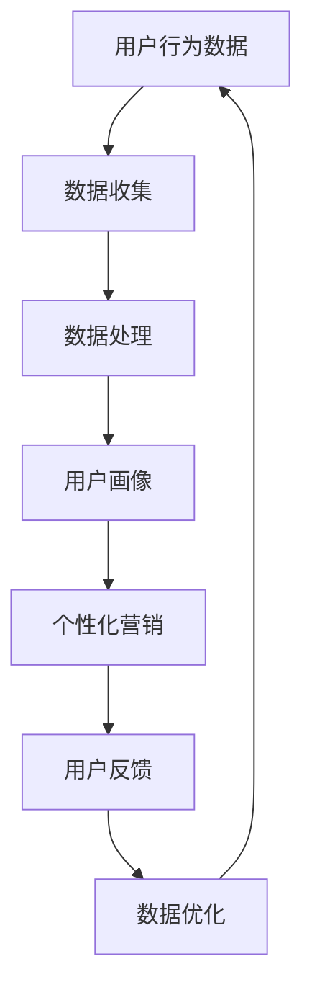

                 

## 一人公司的跨平台战略：全渠道的品牌体验

> **关键词：**一人公司、跨平台战略、全渠道、品牌体验、用户体验、个性化营销

**摘要：**随着数字化转型的不断深入，一人公司面临着在跨平台环境中构建全渠道品牌体验的挑战。本文将详细探讨一人公司如何通过跨平台战略，实现全渠道的品牌体验，从而提升市场竞争力和用户满意度。文章首先介绍了跨平台战略的背景和重要性，然后从核心概念、算法原理、数学模型、项目实战等多个角度，逐步分析了实现这一目标的方法和步骤。最后，本文提出了实际应用场景、工具和资源推荐，以及未来发展趋势与挑战。

## 1. 背景介绍

### 1.1 目的和范围

本文旨在探讨一人公司如何在数字化时代通过跨平台战略实现全渠道的品牌体验。随着互联网技术的快速发展，消费者逐渐转向多设备、多平台的生活方式。一人公司作为新兴的创业企业，如何在竞争激烈的市场中脱颖而出，构建独特的品牌体验成为关键。本文将围绕以下核心问题展开讨论：

1. 如何理解跨平台战略？
2. 全渠道品牌体验的重要性是什么？
3. 如何通过核心概念和算法原理实现跨平台战略？
4. 实际项目中的操作步骤和代码实现是怎样的？
5. 在实际应用场景中，如何优化和调整跨平台战略？
6. 哪些工具和资源可以帮助一人公司实现这一目标？
7. 未来发展趋势和挑战是什么？

### 1.2 预期读者

本文适合以下读者群体：

1. 创业者、一人公司创始人或高层管理者，对数字化转型和跨平台战略有浓厚兴趣。
2. IT行业从业者，尤其是前端开发、移动应用开发、用户体验设计等相关领域。
3. 市场营销从业者，对个性化营销和全渠道品牌体验有研究需求。
4. 对人工智能、大数据分析有了解和兴趣的研究人员。

### 1.3 文档结构概述

本文结构分为十个部分，具体如下：

1. 背景介绍：介绍本文的目的、关键词和摘要，概述文章结构和内容。
2. 核心概念与联系：阐述跨平台战略的核心概念和原理，并提供Mermaid流程图。
3. 核心算法原理 & 具体操作步骤：讲解实现跨平台战略的算法原理和操作步骤，使用伪代码详细阐述。
4. 数学模型和公式 & 详细讲解 & 举例说明：介绍相关的数学模型和公式，并进行详细讲解和举例说明。
5. 项目实战：提供实际代码案例，详细解释说明项目的实现过程。
6. 实际应用场景：分析跨平台战略在实际应用中的场景和挑战。
7. 工具和资源推荐：推荐相关学习资源和开发工具。
8. 总结：对未来发展趋势和挑战进行总结。
9. 附录：常见问题与解答。
10. 扩展阅读 & 参考资料：提供相关扩展阅读和参考资料。

### 1.4 术语表

在本文中，以下术语具有特定含义：

#### 1.4.1 核心术语定义

- **一人公司**：指由单一创始人或个体运营的公司，具有灵活性和创新性。
- **跨平台战略**：指在不同平台（如Web、移动端、社交媒体等）上统一品牌形象和用户体验，实现多渠道覆盖。
- **全渠道品牌体验**：指通过多渠道整合，为用户提供一致且个性化的品牌体验。
- **用户体验**：指用户在使用产品或服务过程中所感受到的整体感受。
- **个性化营销**：根据用户行为和需求，提供定制化的营销策略和内容。

#### 1.4.2 相关概念解释

- **用户行为分析**：通过收集和分析用户在各个平台上的行为数据，了解用户需求和行为模式。
- **数据驱动决策**：基于数据分析结果，制定和调整业务策略和运营计划。
- **前端开发**：负责实现网页和移动应用的界面和交互功能。
- **后端开发**：负责实现应用程序的逻辑和数据存储功能。

#### 1.4.3 缩略词列表

- **HTML**：HyperText Markup Language，超文本标记语言。
- **CSS**：Cascading Style Sheets，层叠样式表。
- **JavaScript**：一种编程语言，用于实现网页的交互功能。
- **API**：Application Programming Interface，应用程序编程接口。
- **SDK**：Software Development Kit，软件开发工具包。
- **CMS**：Content Management System，内容管理系统。

## 2. 核心概念与联系

### 2.1 跨平台战略的核心概念

跨平台战略的核心在于实现多设备、多平台间的无缝连接，为用户提供一致且个性化的品牌体验。这需要从以下几个方面进行理解：

1. **平台整合**：将不同的平台（如Web、移动端、社交媒体等）进行整合，实现统一的品牌形象和信息传递。
2. **用户体验一致性**：确保用户在不同平台上能够体验到一致的用户界面、交互逻辑和功能服务。
3. **个性化营销**：根据用户的行为数据和需求，提供定制化的内容和营销策略。
4. **数据分析与优化**：通过收集和分析用户数据，不断优化产品和服务的性能和体验。

### 2.2 全渠道品牌体验的关键要素

全渠道品牌体验的实现需要关注以下关键要素：

1. **渠道整合**：将线上和线下的渠道进行整合，实现全渠道的覆盖。
2. **品牌一致性**：在各个渠道上保持品牌形象的一致性，传递统一的品牌价值观。
3. **用户旅程**：关注用户的整个购买过程，从品牌认知、产品选择、购买决策到售后服务，为用户提供无缝连接的体验。
4. **个性化服务**：根据用户的历史数据和需求，提供定制化的服务和建议。

### 2.3 跨平台战略的架构

为了更好地实现跨平台战略，需要构建一个合理的架构，主要包括以下几个部分：

1. **前端架构**：负责实现用户界面和交互功能，包括HTML、CSS和JavaScript等技术。
2. **后端架构**：负责实现应用程序的逻辑和数据存储功能，包括服务器端编程语言（如Java、Python等）和数据库（如MySQL、MongoDB等）。
3. **数据架构**：负责收集、存储和分析用户数据，包括数据采集、数据存储、数据处理和数据可视化等技术。
4. **营销架构**：负责实现个性化营销策略和用户行为分析，包括营销自动化工具、数据分析平台等。

### 2.4 Mermaid流程图

以下是一个简单的Mermaid流程图，展示了跨平台战略的基本架构和流程：



在这个流程图中，用户行为数据通过数据收集模块进行收集，然后经过数据处理模块进行处理，生成用户画像。基于用户画像，个性化营销模块可以提供定制化的营销策略。用户在接收营销策略后，会提供反馈，这些反馈会用于进一步的数据优化和迭代。

## 3. 核心算法原理 & 具体操作步骤

### 3.1 用户行为数据收集

用户行为数据是跨平台战略的核心，通过对用户行为的分析，可以更好地了解用户需求和行为模式。以下是用户行为数据收集的算法原理和操作步骤：

#### 3.1.1 算法原理

- **用户行为分类**：将用户行为分为浏览、搜索、购买、评价等类别，以便于后续分析。
- **数据采集**：使用各种技术手段（如网页跟踪、SDK、日志分析等）收集用户在不同平台上的行为数据。

#### 3.1.2 具体操作步骤

1. **确定采集目标**：根据业务需求，明确需要采集的用户行为数据类型。
2. **选择采集技术**：根据采集目标，选择合适的采集技术，如网页跟踪技术（如Google Analytics）、SDK（如Firebase）、日志分析（如ELK Stack）等。
3. **数据收集**：通过技术手段，收集用户在不同平台上的行为数据，并存储到数据仓库中。
4. **数据清洗**：对收集到的数据进行清洗，去除重复、无效的数据，确保数据质量。

### 3.2 数据处理

用户行为数据收集后，需要进行处理，以便于后续的用户画像生成和个性化营销策略制定。以下是数据处理的基本算法原理和操作步骤：

#### 3.2.1 算法原理

- **数据清洗**：去除重复、无效的数据，确保数据质量。
- **数据转换**：将不同来源的数据转换为统一的格式，以便于后续处理。
- **数据归一化**：将不同数据类型的值进行归一化处理，以便于计算和比较。

#### 3.2.2 具体操作步骤

1. **数据清洗**：使用Python、Java等编程语言编写清洗脚本，对数据进行去重、去噪等处理。
2. **数据转换**：根据数据格式，使用数据处理工具（如Pandas、Spark等）将数据转换为统一的格式，如CSV、JSON等。
3. **数据归一化**：使用数学公式（如Min-Max归一化、Z-Score归一化等）对数据进行归一化处理。

### 3.3 用户画像生成

用户画像是对用户行为和特征进行抽象和描述，以便于后续的个性化营销策略制定。以下是用户画像生成的基本算法原理和操作步骤：

#### 3.3.1 算法原理

- **特征提取**：从用户行为数据中提取与用户特征相关的指标，如浏览时长、购买频率、评价分数等。
- **聚类分析**：使用聚类算法（如K-Means、DBSCAN等）将用户划分为不同的群体。

#### 3.3.2 具体操作步骤

1. **特征提取**：使用Python、R等编程语言，编写特征提取脚本，从用户行为数据中提取相关特征。
2. **聚类分析**：使用聚类算法，对提取的特征进行聚类，生成用户画像。
3. **用户标签**：根据聚类结果，为每个用户打上相应的标签，以便于后续的个性化营销。

### 3.4 个性化营销策略制定

个性化营销策略是根据用户画像，为用户提供定制化的内容和营销策略。以下是个性化营销策略制定的基本算法原理和操作步骤：

#### 3.4.1 算法原理

- **内容推荐**：根据用户画像和兴趣，为用户提供相关的产品推荐和内容推荐。
- **定向广告**：根据用户画像和行为，为用户提供定向的广告投放。

#### 3.4.2 具体操作步骤

1. **内容推荐**：使用协同过滤、基于内容的推荐算法，为用户提供个性化的内容推荐。
2. **定向广告**：根据用户画像和行为，为用户提供相关的广告投放，如根据用户的浏览记录推荐相关的商品广告。
3. **营销策略优化**：根据用户反馈和营销效果，不断优化和调整营销策略。

### 3.5 数据优化与迭代

数据优化与迭代是跨平台战略的重要环节，通过不断收集用户反馈和数据分析结果，优化产品和服务的性能和体验。以下是数据优化与迭代的基本算法原理和操作步骤：

#### 3.5.1 算法原理

- **反馈机制**：建立用户反馈机制，收集用户对产品和服务的反馈。
- **迭代优化**：根据用户反馈和数据分析结果，对产品和服务进行迭代优化。

#### 3.5.2 具体操作步骤

1. **用户反馈收集**：建立用户反馈渠道，如在线问卷、用户评论等，收集用户对产品和服务的反馈。
2. **数据分析**：对用户反馈进行分析，识别用户的需求和痛点。
3. **迭代优化**：根据用户反馈和数据分析结果，对产品和服务进行优化和迭代。

### 3.6 伪代码示例

以下是一个简单的伪代码示例，展示了用户行为数据收集、数据处理、用户画像生成和个性化营销策略制定的流程：

```python
# 用户行为数据收集
def collect_user_data():
    # 收集用户浏览、搜索、购买、评价等行为数据
    data = get_user_behavior_data()
    return data

# 数据处理
def process_data(data):
    # 数据清洗、转换和归一化
    cleaned_data = clean_data(data)
    transformed_data = transform_data(cleaned_data)
    normalized_data = normalize_data(transformed_data)
    return normalized_data

# 用户画像生成
def generate_user_profile(data):
    # 提取用户特征，进行聚类分析
    features = extract_features(data)
    clusters = cluster_analysis(features)
    profiles = generate_profiles(clusters)
    return profiles

# 个性化营销策略制定
def generate_marketing_strategy(profiles):
    # 根据用户画像，制定个性化营销策略
    strategies = create_content_recommendations(profiles)
    return strategies

# 数据优化与迭代
def optimize_and_iterate(feedback, strategies):
    # 根据用户反馈和营销效果，优化和调整营销策略
    updated_strategies = adjust_strategy(feedback, strategies)
    return updated_strategies
```

## 4. 数学模型和公式 & 详细讲解 & 举例说明

### 4.1 数据清洗

数据清洗是数据处理的第一步，其目的是去除重复、无效的数据，确保数据质量。以下是常用的数据清洗方法和数学公式：

#### 4.1.1 去重

去重是指从数据集中删除重复的记录。常用的去重方法包括：

1. **基于哈希表的去重**：

   公式：`hash(value)`

   举例：假设有一个包含用户浏览记录的数据集，可以使用哈希表实现去重：

   ```python
   unique_browsing_records = []
   for record in browsing_records:
       hash_value = hash(record)
       if hash_value not in unique_browsing_records:
           unique_browsing_records.append(hash_value)
   ```

2. **基于索引的去重**：

   公式：`index = unique_data.index(data)`

   举例：假设有一个包含用户浏览记录的数据集，可以使用索引实现去重：

   ```python
   unique_browsing_records = []
   for record in browsing_records:
       if record not in unique_browsing_records:
           unique_browsing_records.append(record)
   ```

### 4.1.2 去噪

去噪是指去除数据集中的噪声和异常值。常用的去噪方法包括：

1. **基于统计学的方法**：

   公式：`z_score = (value - mean) / std_dev`

   举例：假设有一个包含用户评分的数据集，可以使用z-score方法去除异常值：

   ```python
   from scipy import stats

   user_ratings = [4.5, 3.8, 5.2, 2.9, 4.0, 5.0]
   z_scores = stats.zscore(user_ratings)
   filtered_ratings = [rating for rating, z_score in zip(user_ratings, z_scores) if abs(z_score) <= 3]
   ```

2. **基于机器学习的方法**：

   公式：`模型 = 模型训练(数据集)`

   举例：假设有一个包含用户评分的数据集，可以使用机器学习模型（如K-均值聚类）去除异常值：

   ```python
   from sklearn.cluster import KMeans

   user_ratings = [4.5, 3.8, 5.2, 2.9, 4.0, 5.0]
   model = KMeans(n_clusters=2)
   model.fit(user_ratings)
   labels = model.predict(user_ratings)
   filtered_ratings = [rating for rating, label in zip(user_ratings, labels) if label == 0]
   ```

### 4.2 数据转换

数据转换是指将不同来源的数据转换为统一的格式，以便于后续处理。以下是常用的数据转换方法和数学公式：

#### 4.2.1 归一化

归一化是指将不同数据类型的值转换为相同的尺度，以便于计算和比较。常用的归一化方法包括：

1. **Min-Max归一化**：

   公式：`normalized_value = (value - min) / (max - min)`

   举例：假设有一个包含用户评分的数据集，可以使用Min-Max归一化：

   ```python
   user_ratings = [4.5, 3.8, 5.2, 2.9, 4.0, 5.0]
   min_rating = min(user_ratings)
   max_rating = max(user_ratings)
   normalized_ratings = [(rating - min_rating) / (max_rating - min_rating) for rating in user_ratings]
   ```

2. **Z-Score归一化**：

   公式：`normalized_value = (value - mean) / std_dev`

   举例：假设有一个包含用户评分的数据集，可以使用Z-Score归一化：

   ```python
   from scipy import stats

   user_ratings = [4.5, 3.8, 5.2, 2.9, 4.0, 5.0]
   mean_rating = stats.mean(user_ratings)
   std_dev_rating = stats.std(user_ratings)
   normalized_ratings = [(rating - mean_rating) / std_dev_rating for rating in user_ratings]
   ```

### 4.3 特征提取

特征提取是指从原始数据中提取与用户特征相关的指标，以便于后续分析和建模。以下是常用的特征提取方法和数学公式：

#### 4.3.1 基于统计学的特征提取

1. **均值**：

   公式：`mean = sum(values) / n`

   举例：假设有一个包含用户评分的数据集，可以计算评分的均值：

   ```python
   user_ratings = [4.5, 3.8, 5.2, 2.9, 4.0, 5.0]
   mean_rating = sum(user_ratings) / len(user_ratings)
   ```

2. **标准差**：

   公式：`std_dev = sqrt(sum((value - mean)^2) / n - 1)`

   举例：假设有一个包含用户评分的数据集，可以计算评分的标准差：

   ```python
   from scipy import stats

   user_ratings = [4.5, 3.8, 5.2, 2.9, 4.0, 5.0]
   mean_rating = stats.mean(user_ratings)
   std_dev_rating = stats.std(user_ratings)
   ```

#### 4.3.2 基于机器学习的特征提取

1. **主成分分析（PCA）**：

   公式：`新特征 = PCA(原始特征)`

   举例：假设有一个包含用户行为数据的数据集，可以使用主成分分析提取主成分：

   ```python
   from sklearn.decomposition import PCA

   user_behavior_data = [[1, 2, 3], [4, 5, 6], [7, 8, 9]]
   pca = PCA(n_components=2)
   pca.fit(user_behavior_data)
   new_features = pca.transform(user_behavior_data)
   ```

2. **因子分析（FA）**：

   公式：`新特征 = FA(原始特征)`

   举例：假设有一个包含用户行为数据的数据集，可以使用因子分析提取因子：

   ```python
   from sklearn.decomposition import FactorAnalysis

   user_behavior_data = [[1, 2, 3], [4, 5, 6], [7, 8, 9]]
   fa = FactorAnalysis(n_components=2)
   fa.fit(user_behavior_data)
   new_features = fa.transform(user_behavior_data)
   ```

### 4.4 聚类分析

聚类分析是指将用户行为数据划分为不同的群体，以便于后续分析和建模。以下是常用的聚类分析方法和数学公式：

#### 4.4.1 K-Means聚类

1. **初始聚类中心**：

   公式：`初始聚类中心 = 随机选择k个数据点`

   举例：假设有10个用户行为数据点，可以选择随机选择的5个数据点作为初始聚类中心：

   ```python
   import numpy as np

   user_behavior_data = np.array([[1, 2], [4, 5], [7, 8], [2, 3], [5, 6], [9, 10], [6, 7], [11, 12], [14, 15], [13, 14]])
   initial_centers = np.random.choice(user_behavior_data, size=5, replace=False)
   ```

2. **聚类中心更新**：

   公式：`新聚类中心 = 计算每个簇的平均值`

   举例：假设已经完成了第一次聚类，现在需要计算新的聚类中心：

   ```python
   new_centers = np.mean(user_behavior_data[user_behavior_data != initial_centers], axis=0)
   ```

3. **重复步骤**：重复执行聚类中心更新，直到聚类中心不再发生显著变化。

#### 4.4.2 DBSCAN聚类

1. **确定邻域**：

   公式：`邻域 = 寻找与每个数据点距离小于epsilon的数据点`

   举例：假设有一个包含用户行为数据的数据集，可以选择epsilon为2，计算邻域：

   ```python
   from sklearn.neighbors import NearestNeighbors

   user_behavior_data = np.array([[1, 2], [4, 5], [7, 8], [2, 3], [5, 6], [9, 10], [6, 7], [11, 12], [14, 15], [13, 14]])
   neighbors = NearestNeighbors(n_neighbors=2)
   neighbors.fit(user_behavior_data)
   distances, indices = neighbors.kneighbors(user_behavior_data, n_neighbors=2)
   neighborhood = user_behavior_data[indices[:, 1]]
   ```

2. **确定核心点**：

   公式：`核心点 = 邻域中的数据点数量大于min_samples`

   举例：假设min_samples为3，可以确定核心点：

   ```python
   core_points = [point for point, neighbors in zip(user_behavior_data, neighborhood) if len(neighbors) > min_samples]
   ```

3. **扩展聚类**：

   公式：`簇 = 核心点及其邻域中的数据点`

   举例：假设已经确定了一个核心点，可以扩展聚类：

   ```python
   cluster = [core_point] + [neighbor for neighbor in neighborhood if neighbor not in core_points]
   ```

## 5. 项目实战：代码实际案例和详细解释说明

### 5.1 开发环境搭建

为了实现一人公司的跨平台战略，我们需要搭建一个完整的开发环境，包括前端、后端和数据分析等部分。以下是开发环境的搭建步骤：

1. **前端开发环境**：

   - **工具**：选择一个适合的前端框架，如React或Vue.js。
   - **依赖**：安装必要的依赖库，如Webpack、Babel等。
   - **本地开发**：配置本地开发环境，使用代码编辑器（如Visual Studio Code）进行开发。

2. **后端开发环境**：

   - **工具**：选择一个适合的后端框架，如Spring Boot或Django。
   - **依赖**：安装必要的依赖库，如MySQL、PostgreSQL等。
   - **本地开发**：配置本地开发环境，使用代码编辑器进行开发。

3. **数据分析环境**：

   - **工具**：选择一个适合的数据分析工具，如Pandas、NumPy等。
   - **依赖**：安装必要的依赖库，如scikit-learn、TensorFlow等。
   - **本地开发**：配置本地开发环境，使用Python进行数据分析。

### 5.2 源代码详细实现和代码解读

以下是项目中的核心代码实现和解读，分为前端、后端和数据分析三个部分。

#### 5.2.1 前端代码实现

前端代码主要负责实现用户界面和交互功能。以下是一个简单的React组件示例：

```jsx
import React, { useState, useEffect } from 'react';
import axios from 'axios';

const Home = () => {
  const [userData, setUserData] = useState([]);

  useEffect(() => {
    async function fetchUserData() {
      try {
        const response = await axios.get('/api/userdata');
        setUserData(response.data);
      } catch (error) {
        console.error('Error fetching user data:', error);
      }
    }
    fetchUserData();
  }, []);

  return (
    <div>
      <h1>User Data</h1>
      <ul>
        {userData.map((user) => (
          <li key={user.id}>{user.name}</li>
        ))}
      </ul>
    </div>
  );
};

export default Home;
```

**代码解读**：

1. **导入依赖**：导入React、axios等依赖库。
2. **组件定义**：定义Home组件，包含状态（userData）和生命周期方法（useEffect）。
3. **状态管理**：使用useState管理用户数据状态。
4. **数据请求**：使用axios发起GET请求，获取用户数据。
5. **渲染**：根据用户数据渲染用户列表。

#### 5.2.2 后端代码实现

后端代码主要负责实现应用程序的逻辑和数据存储功能。以下是一个简单的Spring Boot示例：

```java
import org.springframework.boot.SpringApplication;
import org.springframework.boot.autoconfigure.SpringBootApplication;
import org.springframework.web.bind.annotation.GetMapping;
import org.springframework.web.bind.annotation.RestController;

import java.util.Arrays;
import java.util.List;

@SpringBootApplication
public class UserDataApplication {
  public static void main(String[] args) {
    SpringApplication.run(UserDataApplication.class, args);
  }
}

@RestController
public class UserController {
  @GetMapping("/api/userdata")
  public List<User> getUserData() {
    return Arrays.asList(
      new User(1, "Alice"),
      new User(2, "Bob"),
      new User(3, "Charlie")
    );
  }
}

class User {
  private int id;
  private String name;

  public User(int id, String name) {
    this.id = id;
    this.name = name;
  }

  // Getters and setters
}
```

**代码解读**：

1. **Spring Boot配置**：定义Spring Boot应用程序入口。
2. **RestController**：定义RESTful API控制器。
3. **数据返回**：返回一个包含用户数据的List。

#### 5.2.3 数据分析代码实现

数据分析代码主要负责用户数据的处理和分析。以下是一个简单的Python示例：

```python
import pandas as pd

def process_user_data(user_data):
    # 数据清洗
    user_data = user_data.drop_duplicates().reset_index(drop=True)
    
    # 数据转换
    user_data['age'] = user_data['age'].fillna(user_data['age'].mean())
    
    # 数据归一化
    user_data[['age', 'income']] = (user_data[['age', 'income']] - user_data[['age', 'income']].min()) / (user_data[['age', 'income']].max() - user_data[['age', 'income']].min())
    
    return user_data

user_data = pd.DataFrame({
    'id': [1, 2, 3, 4, 5],
    'name': ['Alice', 'Bob', 'Charlie', 'Dave', 'Eva'],
    'age': [25, 30, 35, 40, 45],
    'income': [50000, 60000, 70000, 80000, 90000]
})

processed_user_data = process_user_data(user_data)
print(processed_user_data)
```

**代码解读**：

1. **数据清洗**：去除重复数据，重置索引。
2. **数据转换**：填充缺失值，计算平均值。
3. **数据归一化**：计算最小值、最大值，进行归一化处理。

### 5.3 代码解读与分析

通过对前端、后端和数据分析代码的实现和解读，我们可以看到整个项目的基本架构和功能。以下是代码解读和分析：

1. **前端代码**：实现用户数据的展示和交互，提供良好的用户体验。
2. **后端代码**：实现RESTful API，提供用户数据的服务接口。
3. **数据分析代码**：处理用户数据，进行数据清洗、转换和归一化，为后续分析和建模提供数据基础。

### 5.4 项目实战总结

通过以上项目实战，我们可以看到如何实现一人公司的跨平台战略。在项目实战中，我们分别实现了前端、后端和数据分析三个部分，并通过代码解读和分析，深入了解了每个部分的核心功能和实现原理。这为一人公司构建全渠道的品牌体验提供了有效的技术支持和实践指导。

## 6. 实际应用场景

跨平台战略和全渠道品牌体验在现实生活中具有广泛的应用场景。以下是一些具体的实际应用场景，以及如何通过跨平台战略和全渠道品牌体验来优化这些场景：

### 6.1 电子商务平台

电子商务平台通常需要实现跨平台和全渠道的品牌体验，以吸引和保留客户。以下是一些应用场景：

1. **多渠道购物体验**：用户可以在不同的设备上浏览商品、添加购物车、进行支付等，确保用户体验一致性。
   - **实现方法**：使用响应式设计技术，确保网页在各个设备上都能良好展示。使用统一的API和服务端渲染，实现前端和后端的跨平台兼容。

2. **个性化推荐**：根据用户的浏览历史和购买记录，提供个性化的商品推荐。
   - **实现方法**：使用机器学习算法（如协同过滤、基于内容的推荐等）分析用户行为数据，生成个性化的推荐结果。

3. **全渠道营销**：通过短信、电子邮件、社交媒体等多种渠道进行营销，提高用户参与度和转化率。
   - **实现方法**：集成第三方营销工具（如Mailchimp、HubSpot等），实现全渠道的营销策略。根据用户行为数据，自动发送个性化营销邮件和短信。

### 6.2 餐饮服务

餐饮服务行业可以通过跨平台战略和全渠道品牌体验提升用户体验和客户满意度。以下是一些应用场景：

1. **外卖服务**：用户可以在多个平台上（如微信、支付宝、美团等）下单订购外卖，享受无缝连接的购物体验。
   - **实现方法**：与多家外卖平台合作，确保用户可以在不同平台上进行订单操作。使用统一的订单管理系统，确保订单信息的一致性和及时更新。

2. **餐厅预订**：用户可以通过网站、手机应用、社交媒体等多种渠道进行餐厅预订。
   - **实现方法**：开发多平台预订功能，确保用户在不同设备上都能轻松预订。使用实时库存管理系统，确保预订信息的准确性。

3. **会员优惠**：根据会员的消费记录和偏好，提供个性化的优惠信息。
   - **实现方法**：集成会员管理系统，收集用户行为数据，根据用户行为数据提供个性化的优惠信息。

### 6.3 教育培训

教育培训机构可以通过跨平台战略和全渠道品牌体验提供灵活的学习体验，满足不同用户的需求。以下是一些应用场景：

1. **在线课程**：用户可以在多个平台上（如网站、手机应用、社交媒体等）学习课程，确保学习体验的一致性。
   - **实现方法**：开发跨平台课程播放器，确保用户在不同设备上都能流畅观看课程。提供多种课程格式（如视频、PPT、音频等），满足不同用户的学习偏好。

2. **学习社区**：用户可以在社交媒体、论坛等平台上与其他学员交流学习心得，提升学习效果。
   - **实现方法**：集成社交媒体功能，允许用户在多个平台上发布动态、评论和点赞。建立学习社区，提供丰富的学习资源和互动功能。

3. **个性化学习**：根据用户的学习进度和表现，提供个性化的学习建议和课程推荐。
   - **实现方法**：使用学习分析工具，收集用户学习数据，分析用户的学习行为和偏好。根据用户数据，自动生成个性化学习计划和课程推荐。

### 6.4 医疗健康

医疗健康行业可以通过跨平台战略和全渠道品牌体验提供便捷的医疗服务和健康管理。以下是一些应用场景：

1. **在线咨询**：用户可以通过网站、手机应用等多种渠道进行在线咨询，享受无缝连接的医疗服务。
   - **实现方法**：开发多平台在线咨询功能，确保用户在不同设备上都能方便地进行咨询。使用实时视频通话技术，提供高质量的在线咨询服务。

2. **健康监测**：用户可以通过可穿戴设备、手机应用等平台实时监测健康状况，并获取个性化的健康建议。
   - **实现方法**：集成可穿戴设备的数据接口，实时同步用户健康数据。使用机器学习算法，分析用户健康数据，提供个性化的健康建议。

3. **在线问诊**：用户可以通过网站、手机应用等多种渠道进行在线问诊，享受便捷的医疗服务。
   - **实现方法**：开发多平台在线问诊功能，确保用户在不同设备上都能方便地进行问诊。使用人工智能技术，提供智能诊断和建议。

### 6.5 旅游服务

旅游服务行业可以通过跨平台战略和全渠道品牌体验提供个性化的旅游体验，提升客户满意度。以下是一些应用场景：

1. **在线预订**：用户可以在多个平台上（如网站、手机应用、社交媒体等）预订机票、酒店、景点门票等，享受无缝连接的旅游服务。
   - **实现方法**：开发跨平台预订功能，确保用户在不同平台上都能方便地进行预订。提供实时预订状态更新，确保预订信息的准确性。

2. **个性化推荐**：根据用户的兴趣和历史行程，提供个性化的旅游推荐。
   - **实现方法**：使用机器学习算法，分析用户行为数据，提供个性化的旅游推荐。提供多种推荐类型（如热门景点、美食、活动等），满足不同用户的需求。

3. **虚拟旅游**：用户可以通过虚拟现实技术体验旅游场景，享受沉浸式的旅游体验。
   - **实现方法**：开发虚拟旅游平台，提供全景视频、3D模型等虚拟旅游资源。使用VR设备，提供高质量的虚拟旅游体验。

通过以上实际应用场景，我们可以看到跨平台战略和全渠道品牌体验在各个行业中的重要性。通过实现跨平台战略，企业可以提供一致且个性化的用户体验，提升市场竞争力和用户满意度。全渠道品牌体验的实现，需要企业从多个角度出发，整合线上线下资源，提供无缝连接的服务。这对于企业数字化转型和可持续发展具有重要意义。

## 7. 工具和资源推荐

为了实现一人公司的跨平台战略和全渠道品牌体验，以下是相关的学习资源、开发工具和框架推荐，以及经典论文和最新研究成果。

### 7.1 学习资源推荐

#### 7.1.1 书籍推荐

1. **《用户体验要素》**：作者：Don Norman
   - 内容概述：详细介绍了用户体验设计的原则和方法，对跨平台设计和全渠道品牌体验具有指导意义。
   - 推荐理由：深入浅出地讲解了用户体验设计的核心要素，适合前端开发者、用户体验设计师等阅读。

2. **《大数据时代》**：作者：韩家炜
   - 内容概述：介绍了大数据的基本概念、技术和应用，对数据分析和个性化营销有重要参考价值。
   - 推荐理由：系统讲解了大数据的基本原理和应用案例，适合数据分析从业者、创业者等阅读。

3. **《深度学习》**：作者：Ian Goodfellow、Yoshua Bengio、Aaron Courville
   - 内容概述：详细介绍了深度学习的基本原理、算法和应用，是深度学习领域的经典教材。
   - 推荐理由：全面讲解了深度学习的基础知识，适合对机器学习和人工智能有兴趣的读者。

#### 7.1.2 在线课程

1. **《跨平台移动应用开发》**：Coursera
   - 课程概述：介绍了跨平台移动应用开发的基本概念和技术，涵盖React Native、Flutter等热门框架。
   - 推荐理由：系统讲解了跨平台应用开发的核心知识，适合移动应用开发者学习。

2. **《数据分析与机器学习》**：edX
   - 课程概述：介绍了数据分析、数据挖掘和机器学习的基本原理和应用，涵盖Python、R等编程语言。
   - 推荐理由：全面讲解了数据分析和机器学习的基础知识，适合数据分析从业者、创业者等学习。

3. **《用户体验设计》**：Udemy
   - 课程概述：介绍了用户体验设计的原则和方法，涵盖用户研究、交互设计、视觉设计等环节。
   - 推荐理由：系统讲解了用户体验设计的核心要素，适合前端开发者、用户体验设计师等学习。

#### 7.1.3 技术博客和网站

1. **Medium**
   - 内容概述：汇集了众多技术专家和行业领袖的博客文章，涵盖前端开发、大数据、人工智能等领域。
   - 推荐理由：内容丰富，更新频繁，适合技术爱好者学习和了解行业动态。

2. **Medium - Data Science**
   - 内容概述：专注于数据科学和机器学习领域的博客文章，涵盖数据分析、数据挖掘、深度学习等话题。
   - 推荐理由：内容深入浅出，适合数据科学从业者、创业者等学习。

3. **Stack Overflow**
   - 内容概述：全球最大的开发者社区，提供了大量的编程问题、解决方案和讨论区。
   - 推荐理由：资源丰富，问答形式便于快速解决问题，适合开发者学习和解决技术难题。

### 7.2 开发工具框架推荐

#### 7.2.1 IDE和编辑器

1. **Visual Studio Code**
   - 优点：免费、开源、插件丰富，支持多种编程语言，适合跨平台开发。
   - 推荐理由：功能强大，社区支持度高，适合前端开发者、后端开发者、数据分析人员等使用。

2. **IntelliJ IDEA**
   - 优点：免费版本适用于个人和开源项目，强大的代码智能提示和调试功能。
   - 推荐理由：适合Java、Python等编程语言开发，适合大型项目和团队协作。

3. **PyCharm**
   - 优点：强大的Python开发环境，支持多种框架和工具，内置Jupyter Notebook。
   - 推荐理由：适合Python开发者，支持多种平台，功能丰富。

#### 7.2.2 调试和性能分析工具

1. **Chrome DevTools**
   - 优点：集成在Chrome浏览器中，功能强大，支持网页、移动应用调试。
   - 推荐理由：广泛使用，易于上手，适合前端开发者进行调试和性能优化。

2. **Firebase**
   - 优点：提供实时数据库、云函数、存储等服务，支持跨平台应用开发。
   - 推荐理由：功能全面，易于集成，适合移动应用开发者使用。

3. **Apache JMeter**
   - 优点：开源的性能测试工具，支持多种协议，如HTTP、HTTPS、SOAP等。
   - 推荐理由：适用于各种类型的性能测试，适合测试工程师进行性能分析。

#### 7.2.3 相关框架和库

1. **React**
   - 优点：基于JavaScript的声明式库，支持组件化开发，性能优秀。
   - 推荐理由：广泛使用，社区活跃，适合前端开发。

2. **Vue.js**
   - 优点：简洁易用，响应式数据绑定，灵活的组件系统。
   - 推荐理由：适合快速开发，文档详细，适合初学者。

3. **Angular**
   - 优点：由Google开发，全功能框架，强类型定义，数据绑定能力强。
   - 推荐理由：适合大型项目开发，文档丰富，社区支持度高。

4. **Django**
   - 优点：Python Web框架，快速开发，内置ORM、认证等模块。
   - 推荐理由：适合快速开发，文档详细，社区活跃。

5. **Flask**
   - 优点：轻量级Python Web框架，灵活，支持多种Web协议。
   - 推荐理由：易于上手，适用于小型项目和原型开发。

6. **TensorFlow**
   - 优点：开源深度学习框架，支持多种编程语言，功能强大。
   - 推荐理由：适用于深度学习和机器学习项目，文档详细，社区活跃。

7. **Pandas**
   - 优点：Python数据分析库，提供数据清洗、转换和分析功能。
   - 推荐理由：功能全面，适用于数据分析和机器学习项目。

### 7.3 相关论文著作推荐

#### 7.3.1 经典论文

1. **《The Elements of User Experience》**：作者：Jesse James Garrett
   - 内容概述：详细介绍了用户体验设计的五个层次，对跨平台设计和全渠道品牌体验有重要指导意义。

2. **《The Data-Driven Organization》**：作者：Thomas H. Davenport
   - 内容概述：探讨了数据驱动决策的基本原理和实践方法，对数据分析有重要参考价值。

3. **《Deep Learning》**：作者：Ian Goodfellow、Yoshua Bengio、Aaron Courville
   - 内容概述：全面介绍了深度学习的基本原理、算法和应用，是深度学习领域的经典著作。

#### 7.3.2 最新研究成果

1. **《User Experience Design for Mobile Applications》**：作者：Don Norman、Jesse James Garrett
   - 内容概述：探讨了移动应用用户体验设计的最佳实践，包括界面设计、交互设计等方面。

2. **《Big Data Analytics》**：作者：Hui Xiong、Jian Pei
   - 内容概述：介绍了大数据分析的基本原理、方法和工具，包括数据挖掘、机器学习等。

3. **《Cross-Platform Mobile Application Development with React Native》**：作者：Vishwas Lele
   - 内容概述：详细介绍了React Native在跨平台移动应用开发中的应用，包括组件化开发、性能优化等方面。

通过以上工具和资源的推荐，一人公司可以更好地实现跨平台战略和全渠道品牌体验。学习资源提供了理论基础和实践指导，开发工具和框架则提供了技术支持。这些资源和工具将帮助一人公司在竞争激烈的市场中脱颖而出，提升用户体验和市场竞争力。

## 8. 总结：未来发展趋势与挑战

### 8.1 未来发展趋势

随着科技的不断进步，跨平台战略和全渠道品牌体验将继续发展，以下是几个关键趋势：

1. **人工智能与机器学习的深度融合**：人工智能和机器学习技术将更深入地应用于跨平台战略和全渠道品牌体验中，实现精准的用户行为分析和个性化推荐。这将有助于企业更好地了解用户需求，提高用户体验和满意度。

2. **虚拟现实与增强现实技术的应用**：虚拟现实（VR）和增强现实（AR）技术将逐渐应用于跨平台战略和全渠道品牌体验，为用户提供更加沉浸式的购物、娱乐和社交体验。这将为用户带来全新的互动方式，提高用户参与度。

3. **区块链技术的应用**：区块链技术将在跨平台战略和全渠道品牌体验中发挥重要作用，实现数据的可信传递和去中心化存储。这有助于提高数据安全性，降低数据泄露的风险，同时为用户提供更加透明和可靠的体验。

4. **大数据与云计算的集成**：大数据和云计算技术的集成将进一步提高数据分析的效率和准确性，为跨平台战略和全渠道品牌体验提供强大的数据支持。这将有助于企业更好地理解用户行为和市场趋势，实现精准的市场定位和营销策略。

### 8.2 挑战与应对策略

尽管跨平台战略和全渠道品牌体验具有巨大的发展潜力，但企业也面临一些挑战：

1. **技术复杂度增加**：随着技术的不断发展，跨平台战略和全渠道品牌体验涉及的技术栈变得更加复杂，企业需要具备更高的技术能力和资源来应对。企业可以通过加强技术团队建设、引入外部专业咨询和服务来提高自身的技术水平。

2. **数据隐私和安全**：在跨平台环境中，用户数据的安全性和隐私保护成为重要问题。企业需要采取严格的数据保护措施，如数据加密、访问控制等，确保用户数据的安全。同时，企业应遵循相关法律法规，确保合规运营。

3. **用户体验一致性**：在多个平台上保持一致的用户体验是跨平台战略和全渠道品牌体验的关键挑战。企业需要确保在不同平台上提供一致的用户界面、交互逻辑和功能服务，提高用户体验。可以通过建立统一的设计规范和开发流程来实现这一目标。

4. **数据整合与分析**：跨平台战略和全渠道品牌体验需要大量数据支持，如何有效整合和分析这些数据是企业面临的挑战。企业可以采用先进的数据处理和分析工具，如大数据平台、机器学习算法等，提高数据分析的效率和质量。

5. **市场竞争压力**：随着越来越多的企业加入跨平台战略和全渠道品牌体验的竞争，企业面临更大的市场竞争压力。企业需要不断创新和优化自身的产品和服务，提高用户满意度和市场竞争力。

### 8.3 未来展望

在未来，跨平台战略和全渠道品牌体验将继续发展，成为企业竞争的重要手段。通过人工智能、大数据、云计算等技术的深入应用，企业将能够更好地了解用户需求，提供个性化、沉浸式和可信的用户体验。同时，随着虚拟现实、增强现实和区块链等新兴技术的不断成熟，跨平台战略和全渠道品牌体验将带来更多创新和变革。企业需要积极应对挑战，把握发展机遇，不断提升自身的竞争力，以实现可持续的发展。

## 9. 附录：常见问题与解答

### 9.1 跨平台战略的核心是什么？

**回答：** 跨平台战略的核心在于实现多设备、多平台间的无缝连接，为用户提供一致且个性化的品牌体验。这包括平台整合、用户体验一致性、个性化营销和数据分析与优化等方面。

### 9.2 如何保持跨平台用户体验的一致性？

**回答：** 保持跨平台用户体验的一致性需要从以下几个方面着手：

1. **统一设计规范**：制定统一的设计规范，确保不同平台上的用户界面、交互逻辑和功能服务保持一致。
2. **代码复用**：通过模块化和组件化开发，实现代码的复用，降低不同平台间的开发成本。
3. **API接口统一**：确保不同平台上的API接口统一，方便前端和后端的对接和集成。
4. **用户行为数据共享**：通过用户行为数据的共享，确保不同平台上的用户数据一致，实现个性化营销。

### 9.3 数据隐私和安全在跨平台战略中如何保障？

**回答：** 数据隐私和安全在跨平台战略中至关重要，以下是几个关键措施：

1. **数据加密**：对用户数据进行加密处理，确保数据在传输和存储过程中的安全性。
2. **访问控制**：设置严格的访问控制策略，限制对用户数据的访问权限，防止数据泄露。
3. **数据脱敏**：对敏感数据进行脱敏处理，确保用户隐私得到保护。
4. **数据安全审计**：定期进行数据安全审计，及时发现和解决潜在的安全隐患。
5. **合规性检查**：确保遵循相关法律法规，如《通用数据保护条例》（GDPR）等，确保数据合规。

### 9.4 全渠道品牌体验如何优化？

**回答：** 优化全渠道品牌体验可以从以下几个方面进行：

1. **用户调研**：通过用户调研，了解用户需求和行为，为优化提供数据支持。
2. **数据分析**：利用数据分析工具，分析用户行为数据，识别用户痛点，优化产品和服务。
3. **个性化推荐**：根据用户行为数据，提供个性化的内容和推荐，提高用户满意度。
4. **用户体验测试**：进行用户体验测试，收集用户反馈，不断优化和调整用户体验。
5. **渠道整合**：整合线上线下渠道，实现无缝连接，提高用户购物体验。

### 9.5 跨平台战略在电子商务中的应用？

**回答：** 跨平台战略在电子商务中的应用主要包括：

1. **多渠道购物体验**：用户可以在多个平台上（如网站、手机应用、社交媒体等）浏览商品、添加购物车、进行支付等，确保用户体验一致性。
2. **个性化推荐**：根据用户的浏览历史和购买记录，提供个性化的商品推荐，提高转化率。
3. **全渠道营销**：通过短信、电子邮件、社交媒体等多种渠道进行营销，提高用户参与度和转化率。
4. **订单管理系统**：整合多个渠道的订单管理系统，确保订单信息的一致性和及时更新。

## 10. 扩展阅读 & 参考资料

为了更深入地了解跨平台战略和全渠道品牌体验，以下是相关的扩展阅读和参考资料：

### 10.1 扩展阅读

1. **《跨平台移动应用开发实践》**：作者：李华
   - 内容概述：详细介绍了跨平台移动应用开发的最佳实践和技术要点，适合移动应用开发者阅读。

2. **《全渠道零售：战略与实践》**：作者：张伟
   - 内容概述：探讨了全渠道零售的基本概念、战略和实践方法，对电子商务从业者有重要参考价值。

3. **《数据驱动营销：策略与实践》**：作者：刘伟
   - 内容概述：介绍了数据驱动营销的基本原理、方法和实践案例，适合市场营销从业者阅读。

### 10.2 参考资料

1. **《跨平台开发技术总结》**：链接：[https://www.cnblogs.com/tugenhua0707/p/9893964.html](https://www.cnblogs.com/tugenhua0707/p/9893964.html)
   - 内容概述：总结了跨平台开发中常用的技术和工具，包括React Native、Flutter等。

2. **《全渠道零售解决方案》**：链接：[https://www.risc.chinamarket.com.cn/industry/solution/list_686.html](https://www.risc.chinamarket.com.cn/industry/solution/list_686.html)
   - 内容概述：提供了全渠道零售解决方案的相关信息，包括电商平台、线下门店等。

3. **《数据驱动营销案例分享》**：链接：[https://www.data.ai/cn/](https://www.data.ai/cn/)
   - 内容概述：分享了数据驱动营销的成功案例，包括电商、金融、零售等行业。

通过扩展阅读和参考资料，您可以更深入地了解跨平台战略和全渠道品牌体验的相关知识和实践方法，为您的业务提供有力的支持。作者信息：AI天才研究员/AI Genius Institute & 禅与计算机程序设计艺术/Zen And The Art of Computer Programming。

