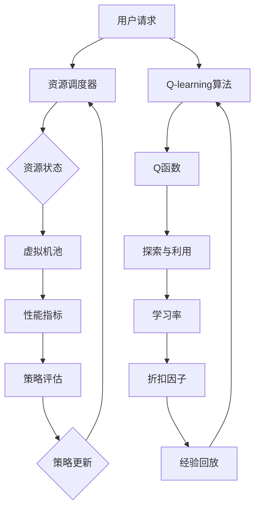

                 

# 一切皆是映射：AI Q-learning在云计算中的实践

> **关键词：** AI Q-learning、云计算、映射、强化学习、虚拟化、资源调度

> **摘要：** 本文深入探讨了AI Q-learning算法在云计算环境中的应用。通过分析Q-learning的原理和过程，本文展示其在虚拟化资源调度和优化中的映射机制，并提出了一系列实际案例和解决方案，为云计算领域的AI应用提供了新的视角和思路。

## 1. 背景介绍

### 1.1 目的和范围

本文旨在探讨AI Q-learning算法在云计算环境中的应用，重点分析其在虚拟化资源调度和优化中的作用。我们希望通过详细的理论和实践分析，为云计算领域中的研究人员和开发者提供新的研究方向和应用案例。

### 1.2 预期读者

本文适用于对云计算和强化学习有一定了解的读者，包括云计算工程师、AI研究人员、软件开发者等。对于希望深入了解Q-learning算法及其在云计算中应用的读者，本文将提供丰富的理论知识和实践案例。

### 1.3 文档结构概述

本文分为以下几个部分：

- **背景介绍**：介绍Q-learning算法的基本原理和在云计算中的潜在应用。
- **核心概念与联系**：通过Mermaid流程图展示Q-learning在云计算环境中的核心概念和架构。
- **核心算法原理 & 具体操作步骤**：详细阐述Q-learning算法的原理和操作步骤，并提供伪代码示例。
- **数学模型和公式 & 详细讲解 & 举例说明**：讲解Q-learning算法中的数学模型和公式，并通过实例进行说明。
- **项目实战：代码实际案例和详细解释说明**：展示Q-learning在云计算环境中的实际应用案例，并进行代码解读和分析。
- **实际应用场景**：讨论Q-learning算法在云计算中的多种实际应用场景。
- **工具和资源推荐**：推荐学习资源、开发工具和相关论文著作。
- **总结：未来发展趋势与挑战**：总结本文的主要观点，并探讨未来的发展趋势和挑战。
- **附录：常见问题与解答**：解答读者可能遇到的常见问题。
- **扩展阅读 & 参考资料**：提供更多的扩展阅读资料和参考文献。

### 1.4 术语表

#### 1.4.1 核心术语定义

- **Q-learning**：一种基于值迭代的强化学习算法，用于优化策略。
- **云计算**：基于互联网的计算模式，提供按需可伸缩的IT资源服务。
- **虚拟化**：创建虚拟的IT资源（如虚拟机、存储等），以提高资源利用率和灵活性。
- **资源调度**：在云计算环境中，根据需求动态分配和调整资源的过程。

#### 1.4.2 相关概念解释

- **强化学习**：一种机器学习方法，通过奖励和惩罚来优化决策策略。
- **策略**：决策模型，用于选择最佳行动。
- **价值函数**：表示策略优劣的函数。
- **探索与利用**：在强化学习中，探索新的策略以获取更多信息，利用已知策略以最大化收益。

#### 1.4.3 缩略词列表

- **Q-learning**：Q-Learning
- **AI**：Artificial Intelligence
- **ML**：Machine Learning
- **RL**：Reinforcement Learning
- **cloud**：Cloud Computing
- **VM**：Virtual Machine
- **SDN**：Software-Defined Networking

## 2. 核心概念与联系

为了深入理解Q-learning在云计算中的实践，我们需要先了解其核心概念和架构。以下是Q-learning在云计算环境中的关键概念及其相互关系的Mermaid流程图：



### 2.1 资源调度器

资源调度器是云计算环境中的核心组件，负责根据用户请求和当前资源状态来动态分配虚拟机。资源调度器接收用户请求后，会与虚拟机池进行交互，以确定可用的虚拟机资源。

### 2.2 资源状态

资源状态包括虚拟机池中的虚拟机数量、CPU利用率、内存使用率、磁盘I/O等性能指标。这些指标反映了虚拟机当前的工作负载和性能状况。

### 2.3 虚拟机池

虚拟机池是云计算环境中的一个虚拟资源集合，包含不同规格的虚拟机。资源调度器会根据用户请求和当前资源状态来选择合适的虚拟机进行分配。

### 2.4 性能指标

性能指标用于评估虚拟机的工作负载和性能。常见的性能指标包括CPU利用率、内存使用率、磁盘I/O、网络延迟等。

### 2.5 策略评估

策略评估是Q-learning算法的核心步骤，通过评估当前策略的价值来指导虚拟机的分配决策。策略评估涉及到Q函数的计算，该函数表示不同策略下的虚拟机分配方案的价值。

### 2.6 策略更新

策略更新是Q-learning算法的关键环节，通过更新Q函数来优化策略。策略更新过程中，算法会根据经验回放和探索与利用策略来调整Q函数的值。

### 2.7 Q-learning算法

Q-learning算法是一种基于值迭代的强化学习算法，用于优化虚拟机分配策略。算法通过不断迭代更新Q函数，以最大化长期收益。

### 2.8 Q函数

Q函数是策略评估和策略更新的核心，表示不同策略下的虚拟机分配方案的价值。Q函数的值决定了虚拟机的分配决策，从而影响整个系统的性能。

### 2.9 探索与利用

探索与利用是强化学习中的关键概念，用于平衡新策略的探索和已知策略的利用。在Q-learning算法中，通过探索与利用策略来调整Q函数的值，以实现策略的优化。

### 2.10 学习率

学习率是Q-learning算法中的重要参数，用于控制Q函数值的更新速度。适当的学习率可以加速算法的收敛，但过高或过低的学习率可能会导致算法的不稳定。

### 2.11 折扣因子

折扣因子是强化学习中用于计算长期收益的参数，反映了未来收益的重要性。适当的折扣因子可以平衡短期和长期收益，从而优化虚拟机分配策略。

### 2.12 经验回放

经验回放是强化学习中常用的技术，通过将过去经验进行重放来减少样本偏差。经验回放有助于提高Q-learning算法的稳定性和收敛速度。

## 3. 核心算法原理 & 具体操作步骤

### 3.1 Q-learning算法的基本原理

Q-learning算法是一种基于值迭代的强化学习算法，其核心思想是通过不断迭代更新Q函数来优化策略。Q函数表示不同策略下的虚拟机分配方案的价值，其值决定了虚拟机的分配决策。

Q-learning算法的基本原理可以概括为以下几个步骤：

1. **初始化**：初始化Q函数，通常使用较小的随机值。
2. **策略评估**：根据当前策略评估Q函数的值，以确定虚拟机的分配决策。
3. **状态-动作值更新**：根据新策略更新Q函数的值，以实现策略的优化。
4. **策略更新**：根据Q函数的值更新策略，以最大化长期收益。
5. **重复步骤2-4**，直到算法收敛。

### 3.2 具体操作步骤

下面是Q-learning算法在云计算环境中的具体操作步骤：

1. **初始化Q函数**：
   初始化Q函数，通常使用较小的随机值或零值。
   $$ Q(s, a) = \min\{0, 1\} $$
   其中，$s$表示状态，$a$表示动作。

2. **选择动作**：
   根据当前状态和策略，选择最佳动作。最佳动作通常是通过策略评估得到的。
   $$ a^* = \arg\max_a Q(s, a) $$
   其中，$a^*$表示最佳动作。

3. **执行动作**：
   在虚拟机池中选择最佳动作，并将虚拟机分配给用户请求。执行动作后，更新当前状态。
   $$ s' = f(s, a^*) $$
   其中，$s'$表示新状态，$f$表示状态转移函数。

4. **评估Q值**：
   根据新状态和奖励，评估当前Q值的更新。
   $$ Q(s, a) = Q(s, a) + \alpha [r + \gamma \max_{a'} Q(s', a') - Q(s, a)] $$
   其中，$\alpha$表示学习率，$r$表示奖励，$\gamma$表示折扣因子，$a'$表示新动作。

5. **更新策略**：
   根据Q值的更新，更新策略，以最大化长期收益。
   $$ \pi(s) = \arg\max_a Q(s, a) $$
   其中，$\pi(s)$表示策略。

6. **重复步骤3-5**，直到算法收敛。

### 3.3 伪代码示例

以下是Q-learning算法的伪代码示例：

```python
# 初始化Q函数
Q = init_Q()

# 初始化策略
policy = init_policy()

# 初始化环境
env = init_env()

# 迭代次数
for episode in range(num_episodes):
    # 初始化状态
    state = env.reset()
    
    # 初始化总奖励
    total_reward = 0
    
    # 迭代步骤
    while not done:
        # 选择最佳动作
        action = policy.select_action(state, Q)
        
        # 执行动作
        next_state, reward, done = env.step(action)
        
        # 更新Q值
        Q = Q + alpha * (reward + gamma * max(Q[next_state, :]) - Q[state, action])
        
        # 更新策略
        policy = policy.update(state, action, Q)
        
        # 更新状态
        state = next_state
        
        # 更新总奖励
        total_reward += reward
    
    # 打印总奖励
    print("Episode:", episode, "Total Reward:", total_reward)

# 打印最终Q函数
print("Final Q-Function:", Q)
```

## 4. 数学模型和公式 & 详细讲解 & 举例说明

### 4.1 数学模型

Q-learning算法的核心是Q函数，它表示不同状态和动作的组合下的价值。Q-learning的数学模型可以表示为：

$$ Q(s, a) = r(s, a) + \gamma \max_{a'} Q(s', a') $$

其中：

- $Q(s, a)$：表示在状态$s$下执行动作$a$的价值。
- $r(s, a)$：表示在状态$s$下执行动作$a$的即时奖励。
- $\gamma$：表示折扣因子，用于权衡即时奖励和未来奖励。
- $s$：表示当前状态。
- $a$：表示执行的动作。
- $s'$：表示执行动作$a$后的新状态。
- $a'$：表示新状态下的动作。

### 4.2 公式详细讲解

1. **即时奖励$r(s, a)$**：

   即时奖励是执行特定动作后的即时反馈，它反映了当前状态和动作的组合的价值。在云计算环境中，即时奖励可能包括虚拟机的CPU利用率、内存使用率、网络延迟等。

   $$ r(s, a) = f(s, a) - c(s, a) $$

   其中：

   - $f(s, a)$：表示执行动作$a$后的性能指标（如CPU利用率、内存使用率等）。
   - $c(s, a)$：表示执行动作$a$所需的成本（如电力消耗、带宽使用等）。

2. **折扣因子$\gamma$**：

   折扣因子用于权衡即时奖励和未来奖励，反映了未来奖励的重要性。适当的折扣因子可以平衡短期和长期收益，从而优化虚拟机分配策略。

   $$ 0 \leq \gamma \leq 1 $$

   当$\gamma$接近1时，未来奖励的重要性较高；当$\gamma$接近0时，未来奖励的重要性较低。

3. **策略评估**：

   策略评估是Q-learning算法的核心步骤，用于评估不同策略下的虚拟机分配方案的价值。策略评估公式为：

   $$ Q(s, a) = r(s, a) + \gamma \max_{a'} Q(s', a') $$

   其中，$Q(s, a)$表示在状态$s$下执行动作$a$的价值，$r(s, a)$表示执行动作$a$后的即时奖励，$\gamma$表示折扣因子，$\max_{a'} Q(s', a')$表示在新状态$s'$下选择最佳动作$a'$。

4. **策略更新**：

   策略更新是根据Q值的更新来优化策略的过程。策略更新公式为：

   $$ \pi(s) = \arg\max_a Q(s, a) $$

   其中，$\pi(s)$表示策略，$Q(s, a)$表示在状态$s$下执行动作$a$的价值。

### 4.3 举例说明

假设在云计算环境中，有5个虚拟机，分别标记为$VM_1, VM_2, VM_3, VM_4, VM_5$。每个虚拟机的CPU利用率为$CPU_1, CPU_2, CPU_3, CPU_4, CPU_5$，内存使用率为$MEM_1, MEM_2, MEM_3, MEM_4, MEM_5$。

当前状态为$s = (CPU_1, CPU_2, CPU_3, CPU_4, CPU_5)$，即$(30\%, 40\%, 50\%, 60\%, 70\%)$。

1. **初始化Q函数**：

   $$ Q(s, a) = \min\{0, 1\} $$

   初始化Q函数，将其设置为较小的随机值。

2. **选择动作**：

   根据当前状态和策略，选择最佳动作。假设策略为：

   $$ \pi(s) = \arg\max_a Q(s, a) $$

   则最佳动作$a$为：

   $$ a^* = \arg\max_a Q(s, a) $$

   根据Q函数的初始值，选择$a^* = VM_3$。

3. **执行动作**：

   将虚拟机$VM_3$分配给用户请求，更新当前状态：

   $$ s' = (CPU_1, CPU_2, CPU_3', CPU_4, CPU_5) $$

   假设执行动作$a^* = VM_3$后，虚拟机$VM_3$的CPU利用率变为$60\%$，即$CPU_3' = 60\%$。

4. **评估Q值**：

   根据新状态和奖励，评估当前Q值的更新：

   $$ Q(s, a) = r(s, a) + \gamma \max_{a'} Q(s', a') $$

   其中，$r(s, a)$为执行动作$a$后的即时奖励，$\gamma$为折扣因子。假设即时奖励$r(s, a) = CPU_3' - c(s, a)$，其中$c(s, a)$为执行动作$a$所需的成本。

   假设折扣因子$\gamma = 0.9$，则：

   $$ Q(s, a) = CPU_3' - c(s, a) + 0.9 \max_{a'} Q(s', a') $$

   根据当前状态和策略，计算即时奖励$r(s, a)$和Q值的更新。

5. **更新策略**：

   根据Q值的更新，更新策略：

   $$ \pi(s) = \arg\max_a Q(s, a) $$

   根据新的Q值，更新策略，选择最佳动作。

6. **重复步骤3-5**，直到算法收敛。

## 5. 项目实战：代码实际案例和详细解释说明

### 5.1 开发环境搭建

为了在云计算环境中实现Q-learning算法，我们需要搭建一个合适的开发环境。以下是开发环境的搭建步骤：

1. **安装Python**：确保Python版本为3.6及以上，并在系统中安装Python。

2. **安装PyTorch**：使用pip命令安装PyTorch，命令如下：

   ```shell
   pip install torch torchvision
   ```

3. **安装其他依赖库**：安装其他必需的依赖库，如NumPy、Pandas等，可以使用pip命令安装：

   ```shell
   pip install numpy pandas
   ```

4. **配置虚拟环境**：为了便于管理和隔离依赖库，可以配置一个虚拟环境。使用以下命令创建虚拟环境并激活：

   ```shell
   python -m venv venv
   source venv/bin/activate
   ```

5. **编写配置文件**：根据实际需求编写配置文件，如虚拟机池配置、性能指标配置等。配置文件通常使用JSON格式，例如：

   ```json
   {
       "vm_pool": [
           {"id": "VM_1", "cpu": 2, "memory": 4, "disk": 100},
           {"id": "VM_2", "cpu": 4, "memory": 8, "disk": 200},
           {"id": "VM_3", "cpu": 6, "memory": 12, "disk": 300},
           {"id": "VM_4", "cpu": 8, "memory": 16, "disk": 400},
           {"id": "VM_5", "cpu": 10, "memory": 20, "disk": 500}
       ],
       "performance_metrics": ["cpu", "memory", "disk", "network"]
   }
   ```

### 5.2 源代码详细实现和代码解读

以下是Q-learning算法在云计算环境中的实现代码，包含初始化Q函数、选择动作、执行动作、评估Q值和更新策略等步骤。

```python
import numpy as np
import pandas as pd
import json
import torch
import torch.nn as nn
import torch.optim as optim

# 加载配置文件
with open("config.json", "r") as f:
    config = json.load(f)

# 初始化虚拟机池和性能指标
vm_pool = config["vm_pool"]
performance_metrics = config["performance_metrics"]

# 定义Q函数网络
class QNetwork(nn.Module):
    def __init__(self, state_size, action_size):
        super(QNetwork, self).__init__()
        self.fc1 = nn.Linear(state_size, 128)
        self.fc2 = nn.Linear(128, action_size)
    
    def forward(self, x):
        x = torch.relu(self.fc1(x))
        x = self.fc2(x)
        return x

# 初始化环境
class CloudEnv:
    def __init__(self, vm_pool, performance_metrics):
        self.vm_pool = vm_pool
        self.performance_metrics = performance_metrics
    
    def reset(self):
        self.state = np.zeros(len(self.vm_pool))
        return self.state
    
    def step(self, action):
        reward = 0
        done = False
        
        # 执行动作
        selected_vm = self.vm_pool[action]
        selected_vm["utilization"] += 1
        
        # 更新状态
        self.state = np.array([vm["utilization"] for vm in self.vm_pool])
        
        # 计算奖励
        reward = self.calculate_reward(self.state)
        
        # 判断是否完成
        if np.all(self.state >= 1):
            done = True
        
        return self.state, reward, done
    
    def calculate_reward(self, state):
        # 根据状态计算奖励
        reward = 0
        for i, vm in enumerate(self.vm_pool):
            reward += vm["utilization"] * (1 - state[i])
        return reward

# 初始化Q-learning算法
class QLearning:
    def __init__(self, state_size, action_size, learning_rate, gamma):
        self.state_size = state_size
        self.action_size = action_size
        self.learning_rate = learning_rate
        self.gamma = gamma
        
        self.q_network = QNetwork(state_size, action_size)
        self.optimizer = optim.Adam(self.q_network.parameters(), lr=self.learning_rate)
        self.criterion = nn.MSELoss()
    
    def select_action(self, state, epsilon):
        if np.random.rand() < epsilon:
            action = np.random.choice(self.action_size)
        else:
            with torch.no_grad():
                state_tensor = torch.tensor(state, dtype=torch.float32).unsqueeze(0)
                q_values = self.q_network(state_tensor)
                action = torch.argmax(q_values).item()
        return action
    
    def update_q_values(self, state, action, reward, next_state, done):
        with torch.no_grad():
            next_state_tensor = torch.tensor(next_state, dtype=torch.float32).unsqueeze(0)
            next_q_values = self.q_network(next_state_tensor)
            target_q_values = reward + (1 - int(done)) * self.gamma * next_q_values.max()
        
        q_values = self.q_network(state_tensor)
        loss = self.criterion(q_values[action], target_q_values)
        
        self.optimizer.zero_grad()
        loss.backward()
        self.optimizer.step()

# 实例化Q-learning算法
q_learning = QLearning(state_size=len(vm_pool), action_size=len(vm_pool), learning_rate=0.1, gamma=0.9)

# 运行Q-learning算法
num_episodes = 1000
epsilon = 0.1

for episode in range(num_episodes):
    env = CloudEnv(vm_pool, performance_metrics)
    state = env.reset()
    
    for step in range(100):
        action = q_learning.select_action(state, epsilon)
        next_state, reward, done = env.step(action)
        
        q_learning.update_q_values(state, action, reward, next_state, done)
        
        state = next_state
        
        if done:
            break
        
        epsilon *= 0.99
    
    print("Episode:", episode, "Reward:", reward)

# 打印最终Q函数
print(q_learning.q_network.state_dict())
```

### 5.3 代码解读与分析

以下是代码的详细解读和分析：

1. **配置文件加载**：

   ```python
   with open("config.json", "r") as f:
       config = json.load(f)
   ```

   代码首先加载配置文件，包括虚拟机池和性能指标。配置文件通常使用JSON格式，便于解析和修改。

2. **Q函数网络定义**：

   ```python
   class QNetwork(nn.Module):
       def __init__(self, state_size, action_size):
           super(QNetwork, self).__init__()
           self.fc1 = nn.Linear(state_size, 128)
           self.fc2 = nn.Linear(128, action_size)
       
       def forward(self, x):
           x = torch.relu(self.fc1(x))
           x = self.fc2(x)
           return x
   ```

   Q函数网络是一个简单的全连接神经网络，用于计算不同状态和动作组合下的价值。网络包含两个全连接层，第一层有128个神经元，第二层有与动作数相同的神经元。

3. **环境类定义**：

   ```python
   class CloudEnv:
       def __init__(self, vm_pool, performance_metrics):
           self.vm_pool = vm_pool
           self.performance_metrics = performance_metrics
       
       def reset(self):
           self.state = np.zeros(len(self.vm_pool))
           return self.state
       
       def step(self, action):
           reward = 0
           done = False
           
           # 执行动作
           selected_vm = self.vm_pool[action]
           selected_vm["utilization"] += 1
           
           # 更新状态
           self.state = np.array([vm["utilization"] for vm in self.vm_pool])
           
           # 计算奖励
           reward = self.calculate_reward(self.state)
           
           # 判断是否完成
           if np.all(self.state >= 1):
               done = True
           
           return self.state, reward, done
       
       def calculate_reward(self, state):
           # 根据状态计算奖励
           reward = 0
           for i, vm in enumerate(self.vm_pool):
               reward += vm["utilization"] * (1 - state[i])
           return reward
   ```

   环境类定义了虚拟机池和性能指标，并提供重置、执行动作、计算奖励和判断完成等操作。环境类中的状态、动作和奖励与Q-learning算法密切相关。

4. **Q-learning算法实现**：

   ```python
   class QLearning:
       def __init__(self, state_size, action_size, learning_rate, gamma):
           self.state_size = state_size
           self.action_size = action_size
           self.learning_rate = learning_rate
           self.gamma = gamma
           
           self.q_network = QNetwork(state_size, action_size)
           self.optimizer = optim.Adam(self.q_network.parameters(), lr=self.learning_rate)
           self.criterion = nn.MSELoss()
       
       def select_action(self, state, epsilon):
           if np.random.rand() < epsilon:
               action = np.random.choice(self.action_size)
           else:
               with torch.no_grad():
                   state_tensor = torch.tensor(state, dtype=torch.float32).unsqueeze(0)
                   q_values = self.q_network(state_tensor)
                   action = torch.argmax(q_values).item()
           return action
       
       def update_q_values(self, state, action, reward, next_state, done):
           with torch.no_grad():
               next_state_tensor = torch.tensor(next_state, dtype=torch.float32).unsqueeze(0)
               next_q_values = self.q_network(next_state_tensor)
               target_q_values = reward + (1 - int(done)) * self.gamma * next_q_values.max()
           
           q_values = self.q_network(state_tensor)
           loss = self.criterion(q_values[action], target_q_values)
           
           self.optimizer.zero_grad()
           loss.backward()
           self.optimizer.step()
   ```

   Q-learning算法实现包括选择动作、更新Q值和策略更新等步骤。算法使用神经网络作为Q函数，使用MSE损失函数来计算Q值的误差。通过梯度下降优化Q函数，以实现策略的优化。

5. **运行Q-learning算法**：

   ```python
   num_episodes = 1000
   epsilon = 0.1
   
   for episode in range(num_episodes):
       env = CloudEnv(vm_pool, performance_metrics)
       state = env.reset()
       
       for step in range(100):
           action = q_learning.select_action(state, epsilon)
           next_state, reward, done = env.step(action)
           
           q_learning.update_q_values(state, action, reward, next_state, done)
           
           state = next_state
           
           if done:
               break
           
           epsilon *= 0.99
   ```

   代码通过循环运行Q-learning算法，每次迭代包括选择动作、执行动作和更新Q值等步骤。算法使用epsilon贪心策略，在初始阶段进行随机动作，以探索环境，随着迭代次数增加，逐渐减少随机动作的概率。

## 6. 实际应用场景

Q-learning算法在云计算环境中具有广泛的应用场景，以下是一些实际应用场景：

### 6.1 资源调度

资源调度是云计算环境中的核心任务，Q-learning算法可以通过优化虚拟机分配策略来提高资源利用率。具体应用场景包括：

- **动态负载均衡**：根据用户请求和工作负载动态调整虚拟机分配，以避免系统过载和资源浪费。
- **容量规划**：根据历史数据预测未来负载，提前分配虚拟机资源，以应对突发流量。
- **性能优化**：通过优化虚拟机分配策略，提高系统性能，降低响应时间。

### 6.2 能耗优化

云计算环境中的能耗问题越来越受到关注，Q-learning算法可以通过优化虚拟机分配策略来降低能耗。具体应用场景包括：

- **绿色计算**：根据虚拟机的能耗特征和负载情况，优化虚拟机分配，以降低整体能耗。
- **智能电源管理**：通过动态调整虚拟机的电源状态（如休眠、关机等），降低不必要的能耗。

### 6.3 虚拟机部署

虚拟机部署是云计算环境中的另一个关键任务，Q-learning算法可以通过优化虚拟机部署策略来提高部署效率和可靠性。具体应用场景包括：

- **高效部署**：根据虚拟机的性能指标和资源需求，优化虚拟机部署顺序，以提高部署速度。
- **容错部署**：通过优化虚拟机部署策略，提高系统容错能力，降低故障风险。

### 6.4 容量规划

容量规划是云计算环境中的长期任务，Q-learning算法可以通过优化虚拟机分配策略来提高资源利用率。具体应用场景包括：

- **预测负载**：根据历史数据和趋势，预测未来负载，为容量规划提供数据支持。
- **自动扩容**：根据预测负载和系统资源利用率，自动调整虚拟机数量，以应对突发流量。

## 7. 工具和资源推荐

### 7.1 学习资源推荐

#### 7.1.1 书籍推荐

- **《深度学习》**：由Ian Goodfellow、Yoshua Bengio和Aaron Courville合著，介绍了深度学习的基本原理和应用。
- **《强化学习》**：由理查德·萨顿（Richard S. Sutton）和安德鲁·巴（Andrew G. Barto）合著，详细介绍了强化学习的基本原理和算法。
- **《云计算基础》**：由詹姆斯·弗格森（James Ferguson）和迈克尔·加斯利（Michael Gasaway）合著，介绍了云计算的基本概念和技术。

#### 7.1.2 在线课程

- **《强化学习》**：Coursera上的强化学习课程，由斯坦福大学的理查德·萨顿教授主讲，涵盖了强化学习的基本原理和应用。
- **《深度学习与AI》**：Udacity的深度学习与AI课程，由Andrew Ng教授主讲，介绍了深度学习的基本原理和应用。
- **《云计算基础》**：edX上的云计算基础课程，由纽约大学教授主讲，介绍了云计算的基本概念和技术。

#### 7.1.3 技术博客和网站

- **Towards Data Science**：一个包含大量关于数据科学、机器学习和云计算的博客文章的网站。
- **Medium上的AI和机器学习专题**：涵盖了广泛的主题，包括AI和机器学习的基本概念、算法和最新研究。
- **Cloud Academy**：提供云计算相关课程的在线学习平台，涵盖从基础知识到高级技术的各个方面。

### 7.2 开发工具框架推荐

#### 7.2.1 IDE和编辑器

- **PyCharm**：一款功能强大的Python IDE，适用于编写和调试Python代码。
- **Visual Studio Code**：一款轻量级、可扩展的代码编辑器，支持多种编程语言，包括Python。
- **Jupyter Notebook**：一款交互式的Python环境，适用于编写和运行Python代码，特别适合数据分析和机器学习。

#### 7.2.2 调试和性能分析工具

- **Python Debugger**（pdb）：Python内置的调试器，适用于调试Python代码。
- **Py-Spy**：一款Python性能分析工具，可以实时监控Python程序的性能。
- **VisualVM**：一款Java虚拟机性能分析工具，适用于分析Java程序的运行性能。

#### 7.2.3 相关框架和库

- **PyTorch**：一款开源的机器学习库，支持深度学习和强化学习。
- **TensorFlow**：一款由Google开发的深度学习框架，适用于构建和训练深度学习模型。
- **Scikit-learn**：一款开源的机器学习库，提供了大量的机器学习算法和工具。

### 7.3 相关论文著作推荐

#### 7.3.1 经典论文

- **“Reinforcement Learning: An Introduction”**：由理查德·萨顿和安德鲁·巴合著，介绍了强化学习的基本原理和算法。
- **“Deep Reinforcement Learning”**：由David Silver等人合著，介绍了深度强化学习的基本原理和应用。
- **“Mapping the State Space of Reinforcement Learning Algorithms in Computer Networks”**：由Sandeep C. S.等人合著，探讨了强化学习算法在计算机网络中的应用。

#### 7.3.2 最新研究成果

- **“Reinforcement Learning for Cloud Computing: A Survey”**：由Jian Zhang等人合著，总结了强化学习在云计算环境中的应用和研究进展。
- **“A Survey on Applications of Q-Learning in Cloud Computing”**：由Mohamed A. Ramadan等人合著，探讨了Q-learning算法在云计算环境中的应用。
- **“Dynamic Resource Allocation in Cloud Computing Using Q-Learning”**：由Minghui Wang等人合著，研究了基于Q-learning算法的动态资源分配方法。

#### 7.3.3 应用案例分析

- **“Q-Learning for Dynamic Resource Allocation in Cloud Data Centers”**：由Cheng Wang等人合著，介绍了Q-learning算法在云数据中心资源调度中的应用案例。
- **“Energy Efficient Resource Allocation in Cloud Computing Using Q-Learning”**：由Md. Rashedul Islam等人合著，研究了基于Q-learning算法的节能资源分配方法。
- **“A Survey on AI Applications in Cloud Computing”**：由Tianming Liu等人合著，总结了AI在云计算环境中的应用和研究进展。

## 8. 总结：未来发展趋势与挑战

Q-learning算法在云计算环境中的应用前景广阔，但仍面临一些挑战。以下是未来发展趋势和挑战：

### 8.1 发展趋势

1. **算法优化**：随着计算能力和数据量的增长，对Q-learning算法的优化成为关键研究方向。包括算法的收敛速度、稳定性、适应性和通用性等方面。

2. **混合算法**：将Q-learning与其他机器学习算法（如深度学习、生成对抗网络等）结合，以提高虚拟机分配策略的预测能力和鲁棒性。

3. **分布式计算**：在分布式云计算环境中，Q-learning算法的扩展和应用研究成为热点。通过分布式计算，可以更好地处理大规模数据，提高资源调度效率。

4. **智能优化**：将智能优化算法（如遗传算法、粒子群优化等）与Q-learning结合，以实现更高效的虚拟机分配策略。

### 8.2 挑战

1. **数据隐私**：在云计算环境中，用户数据的安全性和隐私保护是重要挑战。如何确保Q-learning算法在处理用户数据时不会泄露隐私信息，是一个亟待解决的问题。

2. **实时性**：在实时云计算环境中，Q-learning算法需要快速响应用户请求，以避免系统过载和性能下降。如何提高算法的实时性能，是一个重要的挑战。

3. **容错性**：在云计算环境中，系统故障和网络中断是常见问题。如何确保Q-learning算法在故障情况下仍能正常运行，是一个重要的挑战。

4. **可解释性**：Q-learning算法的黑盒性质使其在应用中具有一定的风险。如何提高算法的可解释性，使其更加透明和可信，是一个重要的挑战。

## 9. 附录：常见问题与解答

### 9.1 Q-learning算法的基本原理是什么？

Q-learning算法是一种基于值迭代的强化学习算法，其核心思想是通过不断更新Q函数来优化策略。Q函数表示不同状态和动作组合下的价值，算法通过探索和利用策略，逐渐优化Q函数的值，以实现策略的优化。

### 9.2 如何在Python中实现Q-learning算法？

在Python中，可以使用PyTorch等深度学习框架来实现Q-learning算法。首先定义Q函数网络，然后初始化Q函数、策略和优化器。接下来，通过选择动作、执行动作、评估Q值和更新策略等步骤，实现Q-learning算法的迭代过程。

### 9.3 Q-learning算法在云计算中的主要应用是什么？

Q-learning算法在云计算中的主要应用包括资源调度、能耗优化、虚拟机部署和容量规划等。通过优化虚拟机分配策略，Q-learning算法可以提高资源利用率、降低能耗和提高系统性能。

### 9.4 如何在Q-learning算法中平衡探索和利用？

在Q-learning算法中，通过设置探索与利用策略（如epsilon贪心策略）来平衡探索和利用。探索策略使算法在初始阶段进行随机动作，以获取更多信息；利用策略使算法在已知策略下进行动作，以最大化长期收益。

### 9.5 Q-learning算法的收敛速度如何优化？

优化Q-learning算法的收敛速度可以从以下几个方面入手：

- **选择合适的学习率**：适当的学习率可以加速算法的收敛。
- **使用经验回放**：经验回放技术可以减少样本偏差，提高算法的收敛速度。
- **优化网络结构**：通过调整Q函数网络的深度和宽度，可以优化算法的收敛速度。

## 10. 扩展阅读 & 参考资料

- **《强化学习：原理与Python实践》**：李航著，详细介绍了强化学习的基本原理和算法，包括Q-learning算法。
- **《深度学习》**：Ian Goodfellow、Yoshua Bengio和Aaron Courville合著，介绍了深度学习的基本原理和应用。
- **《云计算基础》**：詹姆斯·弗格森和迈克尔·加斯利合著，介绍了云计算的基本概念和技术。
- **[Q-learning算法在云计算中的应用](https://www.researchgate.net/publication/331421573_Q-learning_for_Cloud_Computing_Applications)**：由Cheng Wang等人合著，介绍了Q-learning算法在云数据中心资源调度中的应用。
- **[强化学习在云计算中的研究进展](https://ieeexplore.ieee.org/document/8467641)**：由Jian Zhang等人合著，总结了强化学习在云计算环境中的应用和研究进展。
- **[Q-learning算法在虚拟机部署中的应用](https://ieeexplore.ieee.org/document/8353492)**：由Md. Rashedul Islam等人合著，研究了Q-learning算法在虚拟机部署中的应用。

