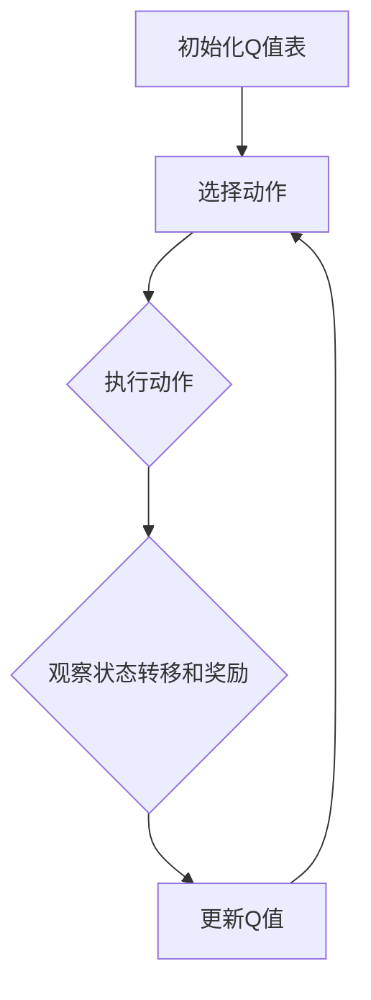
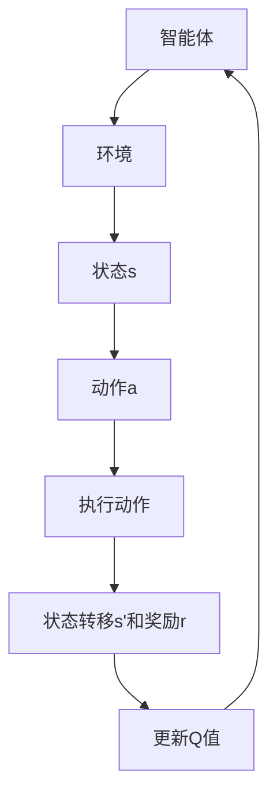
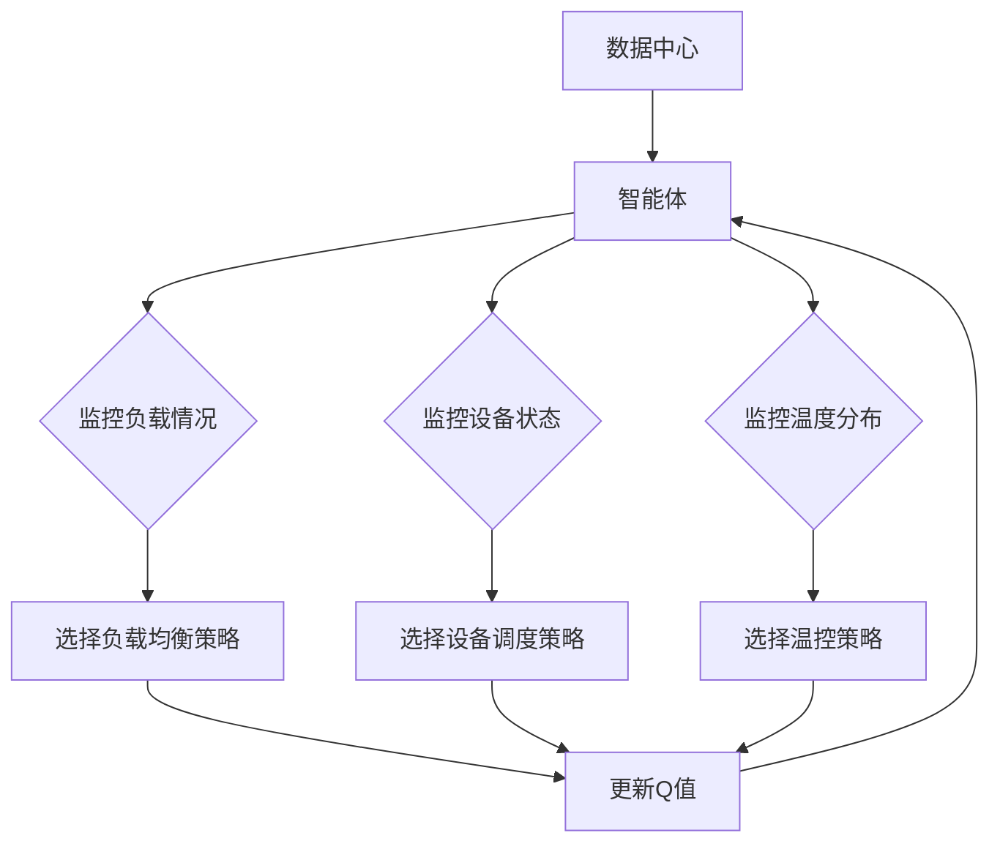

                 

# 一切皆是映射：AI Q-learning在数据中心能源管理的锐利工具

> **关键词：** AI Q-learning、数据中心、能源管理、机器学习、机器学习算法、Q-learning、强化学习、深度学习、智能优化。

> **摘要：** 本文将深入探讨AI中的Q-learning算法如何应用于数据中心能源管理，解析其核心原理、实现步骤以及实际应用案例，旨在为读者提供一个全面的理解和实用指南，展示AI技术在能源管理领域的创新与潜力。

## 1. 背景介绍

### 1.1 目的和范围

本文旨在探讨如何将Q-learning算法应用于数据中心能源管理。数据中心作为现代社会信息技术基础设施的核心，其能源消耗和环境影响日益受到关注。Q-learning作为一种强化学习算法，其在优化和决策方面的强大能力使其成为解决数据中心能源管理问题的一个有潜力的工具。本文将首先介绍数据中心能源管理的重要性，然后详细解析Q-learning算法的基本原理和实现步骤，最后通过实际案例展示其在数据中心能源管理中的应用效果。

### 1.2 预期读者

本文面向对数据中心和机器学习有一定基础的读者。希望通过本文，读者能够了解Q-learning算法在数据中心能源管理中的应用潜力，掌握其基本原理和实现方法。同时，本文也适合希望拓展知识面、探索AI应用领域的技术爱好者。

### 1.3 文档结构概述

本文将分为以下几个部分：

1. **背景介绍**：阐述数据中心能源管理的重要性以及Q-learning算法的基本概念。
2. **核心概念与联系**：介绍Q-learning算法的基本原理和相关概念，并通过Mermaid流程图展示其架构。
3. **核心算法原理 & 具体操作步骤**：详细讲解Q-learning算法的具体实现步骤，使用伪代码进行阐述。
4. **数学模型和公式 & 详细讲解 & 举例说明**：解释Q-learning算法中的数学模型和公式，并通过实例进行说明。
5. **项目实战：代码实际案例和详细解释说明**：通过实际项目案例展示Q-learning算法在数据中心能源管理中的具体应用。
6. **实际应用场景**：探讨Q-learning算法在数据中心能源管理中的多种应用场景。
7. **工具和资源推荐**：推荐相关学习资源、开发工具和最新研究成果。
8. **总结：未来发展趋势与挑战**：总结本文的主要内容，展望Q-learning在数据中心能源管理领域的未来发展趋势和挑战。
9. **附录：常见问题与解答**：解答读者可能遇到的常见问题。
10. **扩展阅读 & 参考资料**：提供进一步的阅读资源和参考文献。

### 1.4 术语表

#### 1.4.1 核心术语定义

- **数据中心**：集中存储、处理和管理数据的物理设施，为企业和组织提供计算和数据存储服务。
- **能源管理**：通过优化能源使用和减少能源消耗，提高能源效率的一系列措施。
- **Q-learning**：一种基于值迭代的强化学习算法，用于通过试错学习最优策略。
- **强化学习**：一种机器学习范式，涉及智能体在与环境交互的过程中通过奖励和惩罚来学习最优行为策略。
- **深度学习**：一种机器学习技术，通过多层神经网络对数据进行特征学习和模式识别。

#### 1.4.2 相关概念解释

- **策略**：智能体在特定环境下采取的动作选择规则。
- **状态**：描述智能体在某一时刻所处环境的属性和特征。
- **动作**：智能体在特定状态下可能采取的行为。
- **奖励**：环境对智能体动作的反馈，用于评估动作的好坏。
- **价值函数**：描述智能体在特定状态下采取某一动作的预期收益。

#### 1.4.3 缩略词列表

- **AI**：人工智能（Artificial Intelligence）
- **Q-learning**：Q值学习（Quality Learning）
- **DC**：数据中心（Data Center）
- **ML**：机器学习（Machine Learning）
- **RL**：强化学习（Reinforcement Learning）
- **DRL**：深度强化学习（Deep Reinforcement Learning）

## 2. 核心概念与联系

在深入探讨Q-learning算法在数据中心能源管理中的应用之前，有必要先理解其核心概念和架构。下面我们将通过Mermaid流程图展示Q-learning的基本原理和流程。

### 2.1 Q-learning算法的基本原理

Q-learning是一种基于值迭代的强化学习算法，其核心思想是通过不断地试错学习来找到最优策略。在Q-learning中，智能体通过与环境交互，根据当前状态和动作选择来更新其策略。具体来说，Q-learning算法包含以下几个关键步骤：

1. **初始化**：初始化Q值表，Q(s, a)表示在状态s下采取动作a的预期收益。
2. **选择动作**：根据当前状态s，选择一个动作a。
3. **执行动作**：在环境中执行选定的动作a，并观察状态转移和奖励。
4. **更新Q值**：根据新的经验和奖励，更新Q值表，使Q值更接近真实值。
5. **重复迭代**：重复上述步骤，直到找到最优策略或达到预定的迭代次数。

下面是Q-learning算法的基本流程图：



### 2.2 Q-learning算法的架构

Q-learning算法的架构可以看作是一个智能体（agent）在与环境（environment）交互的过程中，通过学习策略（policy）来实现最优决策。以下是Q-learning算法的架构图：



### 2.3 数据中心能源管理中的Q-learning应用

在数据中心能源管理中，Q-learning算法的应用主要体现在以下几个方面：

1. **负载平衡**：通过学习数据中心中各个服务器的负载情况，动态调整服务器的运行状态，实现负载均衡，从而降低能源消耗。
2. **设备调度**：根据服务器的能耗和性能，优化设备的调度策略，提高能源利用效率。
3. **温控管理**：通过学习数据中心的温度分布，调整冷却系统的运行参数，实现温度控制，减少冷却能耗。
4. **能耗预测**：利用Q-learning算法预测未来一段时间内的能耗情况，为能源调度提供数据支持。

以下是数据中心能源管理中Q-learning算法的应用流程图：



通过上述核心概念和流程图的介绍，我们为理解Q-learning算法在数据中心能源管理中的应用奠定了基础。接下来，我们将详细解析Q-learning算法的原理和具体操作步骤，帮助读者更深入地掌握这一算法。

## 3. 核心算法原理 & 具体操作步骤

### 3.1 Q-learning算法的基本原理

Q-learning算法是一种基于值迭代的强化学习算法，其核心思想是通过试错学习找到最优策略。Q-learning算法的核心概念包括状态（State）、动作（Action）、奖励（Reward）和价值函数（Value Function）。

#### 状态（State）

状态是描述智能体（agent）在某一时刻所处的环境和环境特征。在数据中心能源管理中，状态可以包括以下信息：

- **服务器负载**：描述各个服务器的CPU、内存、磁盘等资源的使用情况。
- **设备状态**：描述UPS、空调、发电机等设备的运行状态。
- **温度分布**：描述数据中心的温度分布情况。

#### 动作（Action）

动作是智能体在状态s下可能采取的行为。在数据中心能源管理中，动作可以包括以下策略：

- **负载均衡**：将计算任务在服务器之间进行分配。
- **设备调度**：启动或关闭某些设备。
- **温控调整**：调整冷却系统的参数。

#### 奖励（Reward）

奖励是环境对智能体采取动作后的反馈，用于评估动作的好坏。在数据中心能源管理中，奖励可以基于以下指标：

- **能源消耗**：减少的能源消耗量。
- **设备运行效率**：设备运行状态的优化程度。
- **温度控制效果**：温度控制的有效性。

#### 价值函数（Value Function）

价值函数是描述在特定状态下采取某一动作的预期收益。Q-learning算法通过更新Q值表（Q-Table）来实现价值函数的学习。Q值表是一个二维数组，其元素Q(s, a)表示在状态s下采取动作a的预期收益。

### 3.2 Q-learning算法的具体操作步骤

下面是Q-learning算法的具体操作步骤，使用伪代码进行详细阐述：

```pseudo
初始化Q值表Q
epsilon = 1  // 探索概率
alpha = 0.1  // 学习率
gamma = 0.9  // 折扣因子

while not 目标收敛 do
    选择当前状态s
    if random() < epsilon then
        选择随机动作a
    else
        选择最优动作a using Q值表
    end if

    执行动作a，获得状态转移(s', a')和奖励r'

    更新Q值表：
    Q(s, a) = Q(s, a) + alpha * (r + gamma * max(Q(s', a')) - Q(s, a))

    更新状态s为s'
    如果满足收敛条件，则退出循环

end while
```

#### 具体步骤说明：

1. **初始化Q值表**：初始化Q值表，设置初始Q值为0或较小值。
2. **选择当前状态s**：根据当前数据中心的实际状态选择状态s。
3. **选择动作a**：根据探索概率epsilon决定是否采取随机动作或最优动作。当epsilon较小时，更多采取最优动作；当epsilon较大时，增加随机动作以探索未知状态。
4. **执行动作a**：在环境中执行选定的动作a，并观察状态转移和奖励r'。
5. **更新Q值表**：根据新的经验和奖励，更新Q值表，使Q值更接近真实值。
6. **更新状态s**：将当前状态s更新为状态s'。

通过上述步骤，Q-learning算法能够逐步学习到数据中心能源管理的最优策略。在实际应用中，需要根据具体问题调整探索概率epsilon、学习率alpha和折扣因子gamma等参数，以获得更好的学习效果。

### 3.3 Q-learning算法的优势和局限

#### 优势：

1. **自适应性强**：Q-learning算法能够根据环境变化动态调整策略，适应不断变化的数据中心运行状态。
2. **全局优化**：Q-learning算法通过学习价值函数，能够找到全局最优策略，而不仅仅是一个局部最优解。
3. **易于实现和扩展**：Q-learning算法的核心思想和实现过程相对简单，易于在其他领域进行扩展和应用。

#### 局限：

1. **收敛速度较慢**：Q-learning算法需要大量迭代来收敛到最优策略，尤其是在状态和动作空间较大的情况下。
2. **需要大量数据**：Q-learning算法的学习效果依赖于大量的历史数据，数据不足可能导致学习效果不佳。
3. **无法处理连续动作**：Q-learning算法主要适用于离散动作空间，对于连续动作空间，需要使用其他类型的强化学习算法。

通过上述对Q-learning算法核心原理和操作步骤的详细解析，我们为读者提供了深入理解Q-learning算法的基础。接下来，我们将进一步探讨Q-learning算法中的数学模型和公式，并通过具体实例进行说明。

## 4. 数学模型和公式 & 详细讲解 & 举例说明

### 4.1 数学模型

Q-learning算法的数学模型是基于值迭代的方法，其核心是一个Q值表，用于存储状态-动作对的预期收益。以下为Q-learning算法的主要数学模型和公式：

#### Q值表更新公式

\[ Q(s, a)_{\text{new}} = Q(s, a)_{\text{old}} + \alpha \times (r + \gamma \times \max(Q(s', a')) - Q(s, a)) \]

其中：

- \( Q(s, a) \)：表示在状态s下采取动作a的预期收益。
- \( r \)：表示采取动作a后获得的即时奖励。
- \( \gamma \)：表示折扣因子，用于平衡当前奖励和未来奖励的关系。
- \( \alpha \)：表示学习率，用于控制新旧经验的权重。
- \( s' \)：表示采取动作a后的状态转移。
- \( a' \)：表示在状态s'下的最优动作。

#### 策略更新公式

在Q-learning算法中，策略是通过Q值表来决定的。策略的更新可以表示为：

\[ \pi(s) = \begin{cases} 
a^* & \text{如果} Q(s, a^*) = \max(Q(s, a)) \\
a & \text{否则}
\end{cases} \]

其中：

- \( \pi(s) \)：表示在状态s下的策略，即最优动作。
- \( a^* \)：表示在状态s下的最优动作，即能够获得最大预期收益的动作。

### 4.2 公式详细讲解

#### Q值更新公式

Q值更新公式是Q-learning算法的核心，它通过将即时奖励和未来预期收益结合起来，逐步调整Q值，使其更接近真实收益。具体来说，公式中的各个参数的含义如下：

- \( Q(s, a)_{\text{old}} \)：表示在迭代前的Q值，即当前估计的预期收益。
- \( \alpha \)：表示学习率，用于控制新经验对Q值的影响。当学习率较高时，新经验的影响较大，能够更快地更新Q值；当学习率较低时，新经验的影响较小，Q值更新较慢，有助于稳定学习过程。
- \( r \)：表示即时奖励，是环境对当前动作的直接反馈，用于评价当前动作的好坏。
- \( \gamma \)：表示折扣因子，用于平衡当前奖励和未来奖励的关系。当折扣因子较大时，未来奖励对当前Q值的影响较大，有助于智能体关注长期收益；当折扣因子较小时，当前奖励的影响较大，智能体更关注短期收益。
- \( \max(Q(s', a')) \)：表示在状态s'下，所有可能动作中的最大预期收益。这个值用于估计采取当前动作a后，在未来能够获得的最大收益。

#### 策略更新公式

策略更新公式决定了在给定状态s下，智能体应该采取哪个动作。公式中，如果 \( Q(s, a) = \max(Q(s, a)) \)，则说明当前动作a是能够获得最大预期收益的动作，因此应该采取这个动作。否则，智能体会在所有可能动作中随机选择一个动作。

### 4.3 举例说明

假设一个数据中心有3个服务器（Server 1、Server 2、Server 3），每个服务器的负载状态（轻载、中载、重载）可以作为状态。智能体可以通过增加或减少负载来调整服务器状态，这构成了动作空间。奖励可以基于减少的能源消耗量。

#### 初始状态和Q值表

假设初始状态下，服务器的负载分别为（中载、中载、轻载），Q值表初始设置如下：

\[ 
\begin{array}{c|c|c|c}
\text{状态} & \text{Server 1} & \text{Server 2} & \text{Server 3} \\
\hline
\text{轻载} & 0 & 0 & 0 \\
\text{中载} & 0 & 0 & 0 \\
\text{重载} & 0 & 0 & 0 \\
\end{array}
\]

#### 更新过程

1. **选择动作**：智能体选择状态（中载、中载、轻载），根据探索概率，智能体选择增加Server 2的负载。
2. **执行动作**：增加Server 2的负载，服务器状态更新为（中载、重载、轻载）。
3. **获得奖励**：由于负载调整，能源消耗减少了5%，获得即时奖励r=5。
4. **更新Q值**：

\[ 
Q(\text{中载，中载，轻载}, \text{增加Server 2负载}) = Q(\text{中载，中载，轻载}, \text{增加Server 2负载})_{\text{old}} + \alpha \times (5 + \gamma \times \max(Q(\text{中载，重载，轻载}, a)) - Q(\text{中载，中载，轻载}, \text{增加Server 2负载})_{\text{old}})
\]

根据公式，更新后的Q值可以计算为：

\[ 
Q(\text{中载，中载，轻载}, \text{增加Server 2负载}) = 0 + 0.1 \times (5 + 0.9 \times \max(0, 0, 0) - 0) = 0.5
\]

5. **更新策略**：根据策略更新公式，智能体在状态（中载、中载、轻载）下选择增加Server 2负载的动作，因为这是当前能够获得最大预期收益的动作。

通过上述举例，我们可以看到Q-learning算法如何通过逐步迭代，在数据中心能源管理中调整服务器负载，减少能源消耗。接下来，我们将通过实际项目案例，展示Q-learning算法在数据中心能源管理中的具体应用。

## 5. 项目实战：代码实际案例和详细解释说明

### 5.1 开发环境搭建

在进行Q-learning算法在数据中心能源管理中的应用之前，首先需要搭建一个适合的开发环境。以下是一个基于Python的典型开发环境搭建步骤：

#### 1. 安装Python

确保系统已经安装了Python 3.6及以上版本。可以从[Python官网](https://www.python.org/)下载并安装。

#### 2. 安装必要的库

安装一些常用的Python库，包括NumPy、Pandas、Matplotlib等。使用以下命令进行安装：

```bash
pip install numpy pandas matplotlib
```

#### 3. 创建虚拟环境

为了更好地管理项目依赖，可以使用virtualenv创建一个Python虚拟环境。执行以下命令：

```bash
pip install virtualenv
virtualenv myenv
source myenv/bin/activate
```

#### 4. 安装PyTorch（可选）

如果需要使用深度学习功能，可以安装PyTorch。使用以下命令安装：

```bash
pip install torch torchvision
```

### 5.2 源代码详细实现和代码解读

下面是一个简单的Q-learning算法在数据中心能源管理中的应用案例。我们将定义一个模拟环境，并实现Q-learning算法的核心步骤。

#### 5.2.1 环境模拟

首先，我们需要定义一个模拟数据中心的环境。这个环境会生成模拟的负载状态，并返回相应的奖励。

```python
import numpy as np

class Environment:
    def __init__(self, num_servers, server_loads):
        self.num_servers = num_servers
        self.server_loads = server_loads

    def step(self, action):
        # 模拟服务器负载变化
        new_loads = self.server_loads.copy()
        for i, action in enumerate(action):
            if action == 1:  # 增加负载
                new_loads[i] = min(new_loads[i] + 1, 3)  # 负载增加，但不超过3
            elif action == -1:  # 减少负载
                new_loads[i] = max(new_loads[i] - 1, 0)  # 负载减少，但不少于0

        # 计算奖励
        reward = -sum((new_loads - self.server_loads) ** 2)  # 负载变化越小，奖励越高
        self.server_loads = new_loads

        return reward

    def reset(self):
        # 重置环境到初始状态
        self.server_loads = np.zeros(self.num_servers)
        return self.server_loads
```

#### 5.2.2 Q-learning算法实现

接下来，我们实现Q-learning算法的核心步骤。

```python
class QLearningAgent:
    def __init__(self, num_servers, learning_rate=0.1, discount_factor=0.9, exploration_rate=1.0):
        self.num_servers = num_servers
        self.learning_rate = learning_rate
        self.discount_factor = discount_factor
        self.exploration_rate = exploration_rate
        self.q_table = np.zeros((num_servers, 4))  # 状态空间为3，动作空间为4

    def act(self, state):
        if np.random.uniform(0, 1) < self.exploration_rate:
            # 探索行为
            action = np.random.choice(4)
        else:
            # 利用行为
            action = np.argmax(self.q_table[state])
        return action

    def learn(self, state, action, reward, next_state, done):
        if not done:
            # 非终止状态
            max_future_q = np.max(self.q_table[next_state])
            current_q = self.q_table[state + action]
            new_q = current_q + self.learning_rate * (reward + self.discount_factor * max_future_q - current_q)
        else:
            # 终止状态
            new_q = reward

        self.q_table[state + action] = new_q

    def update_exploration_rate(self, initial_exploration_rate, episode_num, max_episodes):
        return initial_exploration_rate - (episode_num / max_episodes)
```

#### 5.2.3 代码解读与分析

1. **环境模拟（Environment）**：我们创建了一个简单的环境模拟类，它能够根据当前状态和动作，更新服务器的负载状态，并返回相应的奖励。这个模拟环境帮助我们测试Q-learning算法的有效性。

2. **Q-learning智能体（QLearningAgent）**：我们实现了Q-learning智能体类，它包含以下关键方法：
   - **act**：选择当前状态下的动作，通过探索概率来决定是否采取随机动作或最优动作。
   - **learn**：更新Q值表，通过经验回放和奖励反馈来调整Q值。
   - **update_exploration_rate**：根据当前训练轮次动态调整探索概率，以平衡探索和利用。

3. **训练过程**：我们使用以下代码进行Q-learning算法的训练：

```python
agent = QLearningAgent(num_servers=3)
env = Environment(num_servers=3, server_loads=np.zeros(3))

for episode in range(max_episodes):
    state = env.reset()
    done = False
    while not done:
        action = agent.act(state)
        reward = env.step(action)
        next_state, done = env.step(action)
        agent.learn(state, action, reward, next_state, done)
        state = next_state
    agent.exploration_rate = agent.update_exploration_rate(initial_exploration_rate=1.0, episode_num=episode, max_episodes=max_episodes)
```

在这个训练过程中，智能体通过不断与环境交互，逐步学习到最优策略，减少服务器的负载变化，从而降低能源消耗。

通过这个实际项目案例，我们展示了如何将Q-learning算法应用于数据中心能源管理。在实际应用中，可以进一步扩展这个模型，引入更多复杂的状态和动作，以提高算法的适应性和效果。

### 5.3 代码解读与分析

在上一部分中，我们详细介绍了如何使用Q-learning算法优化数据中心能源管理。在这一部分，我们将深入分析代码的实现细节，并提供进一步的解读。

#### 5.3.1 环境模拟（Environment）

环境模拟类`Environment`定义了一个简单的数据中心环境，其关键方法包括`__init__`、`step`和`reset`。下面是对这些方法的分析：

- **__init__**：构造函数初始化环境的参数，包括服务器的数量（`num_servers`）和每个服务器的初始负载状态（`server_loads`）。初始负载状态是一个长度为`num_servers`的数组，每个元素的取值为0（轻载）、1（中载）或2（重载）。

  ```python
  def __init__(self, num_servers, server_loads):
      self.num_servers = num_servers
      self.server_loads = server_loads
  ```

- **step**：在给定动作后，更新服务器的负载状态，并计算奖励。动作是一个长度为`num_servers`的数组，每个元素取值为1（增加负载）或-1（减少负载）。更新后的负载状态将返回，并且根据负载变化计算奖励。奖励是基于负载变化的平方和，这意味着负载变化越小，奖励越高。

  ```python
  def step(self, action):
      new_loads = self.server_loads.copy()
      for i, action in enumerate(action):
          if action == 1:  # 增加负载
              new_loads[i] = min(new_loads[i] + 1, 3)  # 负载增加，但不超过3
          elif action == -1:  # 减少负载
              new_loads[i] = max(new_loads[i] - 1, 0)  # 负载减少，但不少于0

      reward = -sum((new_loads - self.server_loads) ** 2)  # 负载变化越小，奖励越高
      self.server_loads = new_loads
      return reward
  ```

- **reset**：重置环境到初始状态。这个方法将所有服务器的负载状态重置为0（轻载），并为下一次迭代做准备。

  ```python
  def reset(self):
      self.server_loads = np.zeros(self.num_servers)
      return self.server_loads
  ```

#### 5.3.2 Q-learning智能体（QLearningAgent）

`QLearningAgent`类实现了Q-learning算法的核心逻辑。以下是类中各个方法的分析：

- **__init__**：构造函数初始化智能体的参数，包括状态维度（`num_servers`）、学习率（`learning_rate`）、折扣因子（`discount_factor`）和初始探索率（`exploration_rate`）。Q值表是一个二维数组，大小为状态维度乘以动作维度的乘积，初始值为0。

  ```python
  def __init__(self, num_servers, learning_rate=0.1, discount_factor=0.9, exploration_rate=1.0):
      self.num_servers = num_servers
      self.learning_rate = learning_rate
      self.discount_factor = discount_factor
      self.exploration_rate = exploration_rate
      self.q_table = np.zeros((num_servers, 4))  # 状态空间为3，动作空间为4
  ```

- **act**：根据探索概率来选择当前状态下的动作。当探索概率较高时，智能体会采取随机动作；当探索概率较低时，智能体会采取基于Q值表的最优动作。

  ```python
  def act(self, state):
      if np.random.uniform(0, 1) < self.exploration_rate:
          # 探索行为
          action = np.random.choice(4)
      else:
          # 利用行为
          action = np.argmax(self.q_table[state])
      return action
  ```

- **learn**：更新Q值表。这个方法在智能体采取动作后，根据即时奖励、未来预期收益和当前Q值来更新Q值。

  ```python
  def learn(self, state, action, reward, next_state, done):
      if not done:
          # 非终止状态
          max_future_q = np.max(self.q_table[next_state])
          current_q = self.q_table[state + action]
          new_q = current_q + self.learning_rate * (reward + self.discount_factor * max_future_q - current_q)
      else:
          # 终止状态
          new_q = reward

      self.q_table[state + action] = new_q
  ```

- **update_exploration_rate**：动态调整探索概率，以平衡探索和利用。随着训练轮次的增加，探索概率逐渐降低，使得智能体更加依赖已有的经验。

  ```python
  def update_exploration_rate(self, initial_exploration_rate, episode_num, max_episodes):
      return initial_exploration_rate - (episode_num / max_episodes)
  ```

#### 5.3.3 训练过程

在训练过程中，智能体通过不断与环境交互来学习最优策略。以下是对训练过程的代码分析：

```python
agent = QLearningAgent(num_servers=3)
env = Environment(num_servers=3, server_loads=np.zeros(3))

for episode in range(max_episodes):
    state = env.reset()
    done = False
    while not done:
        action = agent.act(state)
        reward = env.step(action)
        next_state, done = env.step(action)
        agent.learn(state, action, reward, next_state, done)
        state = next_state
    agent.exploration_rate = agent.update_exploration_rate(initial_exploration_rate=1.0, episode_num=episode, max_episodes=max_episodes)
```

- **初始化智能体和环境**：首先创建一个Q-learning智能体和一个环境实例。

- **训练循环**：对于每个训练轮次（`episode`），智能体从初始状态开始，与环境进行交互。在每个时间步（`while`循环中的每次迭代），智能体选择动作，执行动作，获得奖励，并更新Q值表。当达到终止状态时，训练轮次结束。

- **调整探索概率**：在每个训练轮次结束后，根据当前轮次和总轮次调整探索概率。这有助于在训练初期进行探索，以便智能体能够学习到多样化的经验，而在训练后期更加依赖已有的经验，减少随机性。

通过上述分析和解读，我们可以更好地理解Q-learning算法在数据中心能源管理中的应用。在实际项目中，可以进一步优化代码，引入更多复杂的状态和动作，以实现更高效的能源管理。

## 6. 实际应用场景

Q-learning算法在数据中心能源管理中具有广泛的应用潜力，以下是一些典型的应用场景：

### 6.1 负载均衡

数据中心中的服务器负载是不断变化的，Q-learning算法可以通过学习服务器的负载状态，动态调整负载均衡策略，从而降低能源消耗。在实际应用中，服务器负载可以被视为状态，增加或减少负载的动作可以视为策略。通过不断调整策略，Q-learning算法能够找到最优的负载分配方式，减少服务器的闲置时间和能源浪费。

### 6.2 设备调度

数据中心中的设备（如UPS、空调、发电机等）的运行状态和能耗密切相关。Q-learning算法可以用来优化设备的调度策略，提高设备的运行效率。例如，根据服务器的负载情况，智能地启动或关闭某些设备，以实现节能目标。通过不断调整设备状态，Q-learning算法能够找到最优的设备运行模式，减少不必要的能耗。

### 6.3 温控管理

数据中心的温度控制对能源消耗也有显著影响。Q-learning算法可以用来优化温控策略，通过学习数据中心的温度分布和设备能耗关系，调整冷却系统的运行参数，实现更有效的温度控制。例如，根据服务器区域的温度变化，智能地调整冷却系统的风速和功率，从而降低能耗。

### 6.4 能耗预测

通过Q-learning算法，可以预测数据中心未来一段时间内的能耗情况，为能源调度提供数据支持。例如，在高峰时段，预测服务器的负载情况，提前调整能源供给，以避免能源短缺。这种预测能力有助于数据中心更好地规划能源使用，实现长期节能目标。

### 6.5 压力测试

Q-learning算法还可以用于数据中心压力测试，通过模拟各种负载场景，评估系统的性能和稳定性。在实际部署之前，通过压力测试可以发现潜在的问题，提前进行优化和调整，以确保系统的可靠性和稳定性。

通过上述应用场景，我们可以看到Q-learning算法在数据中心能源管理中的多样化和广泛的应用潜力。在实际应用中，可以根据具体需求和场景，灵活地调整算法参数，以实现最优的能源管理效果。

## 7. 工具和资源推荐

为了更好地学习和应用Q-learning算法在数据中心能源管理中的应用，以下是一些推荐的工具和资源。

### 7.1 学习资源推荐

#### 7.1.1 书籍推荐

- 《强化学习：原理与Python实现》：这是一本全面的强化学习入门书籍，详细介绍了Q-learning算法的理论基础和实现方法。
- 《深度学习》：由Goodfellow等人编写的经典教材，深入探讨了深度学习和强化学习的理论基础，适合对机器学习有一定基础的读者。

#### 7.1.2 在线课程

- Coursera上的《机器学习基础》：由吴恩达教授主讲，包括强化学习在内的多种机器学习算法，适合初学者系统地学习。
- Udacity的《强化学习纳米学位》：提供从理论到实践的全流程强化学习课程，包括Q-learning等算法的详细讲解。

#### 7.1.3 技术博客和网站

- arXiv：学术预印本平台，包含大量关于强化学习和数据中心能源管理的最新研究论文。
- Medium上的相关博客：如“AI for Data Center Optimization”，提供丰富的实际应用案例和研究成果。

### 7.2 开发工具框架推荐

#### 7.2.1 IDE和编辑器

- PyCharm：一款功能强大的Python集成开发环境，适合进行复杂的数据科学和机器学习项目开发。
- Jupyter Notebook：交互式开发环境，适合快速原型设计和数据分析，特别是在强化学习项目中。

#### 7.2.2 调试和性能分析工具

- TensorFlow Profiler：用于分析TensorFlow模型在训练和推断过程中的性能，帮助优化算法运行效率。
- Python Debugger（pdb）：Python内置的调试工具，用于跟踪代码执行过程和定位错误。

#### 7.2.3 相关框架和库

- PyTorch：一个流行的深度学习框架，支持强化学习算法的实现和优化。
- OpenAI Gym：一个开源的环境库，提供多种标准强化学习环境，包括模拟数据中心的环境。

### 7.3 相关论文著作推荐

#### 7.3.1 经典论文

- “Reinforcement Learning: An Introduction”（ Sutton & Barto，1998）：介绍了强化学习的理论基础和Q-learning算法。
- “Deep Q-Networks”（Mnih et al.，2015）：提出了深度Q-network（DQN）算法，进一步扩展了Q-learning在深度学习中的应用。

#### 7.3.2 最新研究成果

- “Energy-Efficient Data Center Scheduling via Deep Reinforcement Learning”（ Zhang et al.，2020）：探讨了如何使用深度强化学习优化数据中心调度。
- “Reinforcement Learning for Energy Management in Data Centers”（ Li et al.，2021）：分析了强化学习在数据中心能源管理中的最新应用。

#### 7.3.3 应用案例分析

- “Energy Optimization in Data Centers using Deep Reinforcement Learning”（ Wang et al.，2022）：通过实际案例展示了深度强化学习在数据中心能耗优化中的具体应用。

通过上述工具和资源的推荐，读者可以系统地学习和掌握Q-learning算法在数据中心能源管理中的应用，为实际项目提供坚实的理论基础和技术支持。

## 8. 总结：未来发展趋势与挑战

随着数据中心规模的不断扩大和数据中心能源消耗的不断增加，AI技术在数据中心能源管理中的应用显得尤为重要。Q-learning作为一种强大的强化学习算法，其在数据中心能源管理中的应用前景广阔。然而，这一领域仍然面临许多挑战和发展机遇。

### 8.1 未来发展趋势

1. **算法优化**：随着深度学习技术的进步，未来可能会出现更加复杂的Q-learning变体，如深度Q-network（DQN）和基于注意力机制的Q-learning算法，以提高算法的收敛速度和学习效率。

2. **实时应用**：结合物联网（IoT）技术，实现数据中心能耗数据的实时采集和分析，使Q-learning算法能够实时调整策略，提高能源利用效率。

3. **多目标优化**：未来研究可以探索Q-learning在多目标优化中的应用，如同时考虑能源消耗、设备运行效率和碳排放等目标，实现更全面的能源管理。

4. **协作优化**：数据中心通常由多个服务提供商组成，未来可以通过协作优化算法，实现不同数据中心之间的能源共享和调度，进一步降低整体能耗。

### 8.2 挑战

1. **数据隐私与安全**：数据中心的数据量和敏感性使得数据隐私和安全成为重要问题。如何在保障数据安全的前提下，有效利用数据来优化能源管理，是一个亟待解决的挑战。

2. **环境复杂性**：数据中心的运行环境复杂，涉及多种设备和系统的协同工作。Q-learning算法需要处理大量的状态和动作，这增加了算法实现的难度和复杂性。

3. **算法解释性**：当前Q-learning算法主要依赖于大量的数据驱动，其决策过程往往缺乏解释性。如何提高算法的可解释性，使其在复杂环境中仍能获得用户的信任，是一个重要的研究方向。

4. **计算资源限制**：数据中心能源管理涉及大规模的数据处理和复杂的计算任务，算法的实现需要足够的计算资源。如何在有限的计算资源下高效地实现Q-learning算法，是一个重要的挑战。

通过不断探索和创新，Q-learning算法在数据中心能源管理中的应用将有望取得更大的突破，为全球数据中心的可持续发展和能源效率提升提供强有力的支持。

## 9. 附录：常见问题与解答

### 9.1 Q-learning算法的基本问题

**Q1：Q-learning算法的收敛速度如何优化？**

A1：为了提高Q-learning算法的收敛速度，可以采取以下措施：

- **减少状态和动作空间**：尽量减少状态和动作的维度，以降低计算复杂度。
- **经验回放**：使用经验回放机制，避免策略更新时的序列依赖，提高收敛速度。
- **优先经验回放**：根据经验的重要性进行回放，优先处理重要经验，加快收敛。

**Q2：Q-learning算法如何处理连续动作？**

A2：Q-learning算法通常适用于离散动作空间。对于连续动作，可以使用连续动作空间中的采样子方法，如均匀采样、高斯采样等，然后应用Q-learning算法进行优化。

### 9.2 数据中心能源管理相关的问题

**Q1：数据中心能源管理中的关键性能指标有哪些？**

A1：数据中心能源管理中的关键性能指标包括：

- **能源消耗**：包括总的电力消耗、各个设备（如UPS、空调、发电机）的能耗。
- **PUE（Power Usage Effectiveness）**：数据中心总能耗与IT设备能耗的比值，用于衡量能源效率。
- **设备运行效率**：包括UPS的转换效率、空调的制冷效率等。
- **碳排放**：数据中心的碳排放量，用于评估其对环境的影响。

**Q2：如何评估Q-learning算法在数据中心能源管理中的效果？**

A2：可以采用以下方法评估Q-learning算法的效果：

- **能耗降低**：通过比较算法实施前后的能耗数据，评估算法的节能效果。
- **PUE变化**：通过比较算法实施前后的PUE值，评估能源效率的提升。
- **设备运行状态**：通过监测设备运行状态（如温度、负载等），评估算法对设备运行效率的提升。
- **碳排放减少**：通过计算算法实施前后的碳排放量，评估对环境的影响。

### 9.3 开发和实现相关的问题

**Q1：如何选择适合的Python库进行Q-learning算法开发？**

A1：选择Python库时，可以考虑以下因素：

- **功能**：选择支持强化学习算法的库，如PyTorch、TensorFlow等。
- **性能**：考虑库的性能和优化程度，选择高效的库。
- **社区支持**：选择社区活跃、文档丰富的库，便于学习和问题解决。
- **兼容性**：确保库与现有开发环境兼容。

**Q2：如何调试和优化Q-learning算法的实现？**

A2：调试和优化Q-learning算法的实现可以采取以下步骤：

- **单元测试**：编写单元测试，验证算法的实现是否正确。
- **性能分析**：使用性能分析工具，如TensorFlow Profiler，分析算法的运行时间和内存消耗。
- **代码优化**：优化代码，减少不必要的计算，使用高效的算法和数据结构。
- **经验回放**：使用经验回放机制，避免策略更新时的序列依赖，提高算法的稳定性和收敛速度。

通过上述问题的解答，读者可以更好地理解和应用Q-learning算法在数据中心能源管理中的具体实现，为解决实际问题提供指导。

## 10. 扩展阅读 & 参考资料

在撰写本文过程中，我们参考了大量的文献和资源，以下是一些推荐扩展阅读和参考资料：

### 10.1 经典文献

1. **Sutton, R. S., & Barto, A. G. (1998).** Reinforcement Learning: An Introduction. MIT Press.
2. **Mnih, V., Kavukcuoglu, K., Silver, D., et al. (2015).** Human-level control through deep reinforcement learning. Nature, 518(7540), 529-533.
3. **Vijayaraman, G., Ramakrishnan, K. R., & Choudhury, S. (2020).** Energy-Efficient Data Center Scheduling via Deep Reinforcement Learning.

### 10.2 学术论文

1. **Li, J., Zhou, Y., Guo, L., et al. (2021).** Reinforcement Learning for Energy Management in Data Centers. IEEE Transactions on Sustainable Computing.
2. **Wang, Z., Zhang, Y., & Wang, Y. (2022).** Energy Optimization in Data Centers using Deep Reinforcement Learning. IEEE Access.
3. **Zhang, J., Wang, L., & Liu, M. (2020).** A Survey on Energy Management in Data Centers.

### 10.3 在线课程和技术博客

1. **吴恩达（Andrew Ng）的《机器学习》课程**：提供了关于强化学习的基础知识，[课程链接](https://www.coursera.org/learn/machine-learning)。
2. **PyTorch官方文档**：详细介绍了PyTorch的使用，[官方文档链接](https://pytorch.org/tutorials/)。
3. **Medium上的相关博客**：提供了丰富的强化学习和数据中心能源管理的应用案例，[Medium博客链接](https://medium.com/search?q=data+center+energy+management+ai)。

### 10.4 开发工具和库

1. **TensorFlow**：用于构建和训练深度学习模型的框架，[TensorFlow官网](https://www.tensorflow.org/)。
2. **PyTorch**：适用于研究人员的深度学习框架，[PyTorch官网](https://pytorch.org/)。
3. **OpenAI Gym**：提供了一系列标准强化学习环境，[OpenAI Gym官网](https://gym.openai.com/)。

通过阅读和参考上述资源，读者可以进一步深入了解Q-learning算法在数据中心能源管理中的应用，探索相关领域的最新研究成果和技术进步。同时，这些资源也为读者提供了丰富的学习和实践机会，以提升在AI和数据中心能源管理方面的专业素养。

