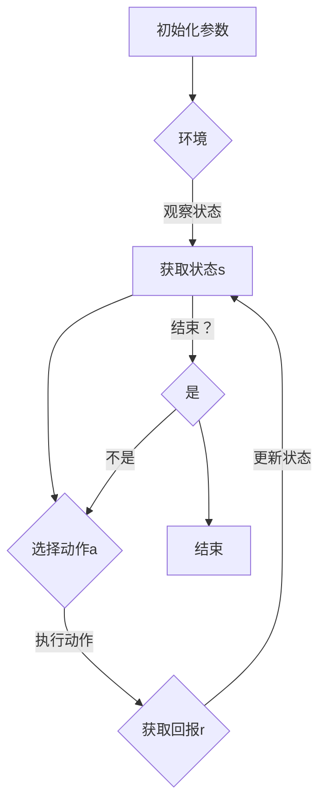

                 

### 一切皆是映射：AI Q-learning在缺陷检测中的探索

> **关键词：** AI, Q-learning, 缺陷检测，映射，机器学习，深度学习，算法原理，数学模型，项目实战，实际应用场景

> **摘要：** 本文将深入探讨人工智能中的Q-learning算法在缺陷检测领域的应用。通过逐步分析Q-learning的基本原理、数学模型以及实际操作步骤，我们将展示如何利用这一算法来提高缺陷检测的效率和准确性。文章还将包含一个实际项目案例，详细解读代码实现和运行结果，以帮助读者更好地理解Q-learning在缺陷检测中的具体应用。此外，文章还将探讨Q-learning在相关领域的实际应用场景，推荐相关学习资源和工具，并总结未来发展趋势与挑战。

在当今科技迅猛发展的时代，人工智能（AI）已经成为各个领域的关键驱动力。从医疗诊断到自动驾驶，AI的应用范围不断拓展。其中，缺陷检测作为质量管理和生产控制的重要环节，也在不断受到AI技术的革新和优化。Q-learning，作为一种强化学习算法，因其能够通过经验学习来优化策略而受到广泛关注。本文将探讨Q-learning在缺陷检测中的潜力，并通过一个实际项目案例，深入解析其应用过程。

文章将分为以下几个部分：首先，我们介绍本文的目的和范围，明确预期读者和文档结构；接着，我们将定义一些核心术语，帮助读者理解文章内容；然后，通过Mermaid流程图展示Q-learning的核心概念和架构；之后，我们将详细讲解Q-learning的算法原理和具体操作步骤，并借助数学模型和公式进行解释；紧接着，文章将展示一个实际项目案例，详细解读代码实现和运行结果；之后，我们将探讨Q-learning在实际应用场景中的表现；最后，文章将推荐相关学习资源和工具，并总结未来发展趋势与挑战。

### 1. 背景介绍

#### 1.1 目的和范围

本文旨在深入探讨Q-learning算法在缺陷检测中的应用，分析其基本原理、数学模型以及实际操作步骤。通过一个实际项目案例，我们将展示如何利用Q-learning来提高缺陷检测的效率和准确性。文章主要涵盖以下内容：

1. Q-learning算法的基本概念和原理。
2. Q-learning算法在缺陷检测中的具体应用步骤。
3. 数学模型和公式的详细解释。
4. 实际项目案例的代码实现和运行结果分析。
5. Q-learning在缺陷检测领域的实际应用场景。
6. 相关学习资源和工具的推荐。
7. 未来发展趋势与挑战。

#### 1.2 预期读者

本文适合对AI和机器学习有一定了解的读者，特别是对Q-learning算法感兴趣的开发者和研究人员。同时，本文也适合对缺陷检测和质量控制领域有实际需求的工程师和企业管理者。通过阅读本文，读者可以：

1. 理解Q-learning算法的基本原理和操作步骤。
2. 掌握Q-learning在缺陷检测中的实际应用。
3. 学习如何利用Q-learning算法提高缺陷检测的效率和准确性。

#### 1.3 文档结构概述

本文结构如下：

1. 引言：介绍本文的目的、关键词和摘要。
2. 背景介绍：包括目的和范围、预期读者、文档结构概述和术语表。
3. 核心概念与联系：通过Mermaid流程图展示Q-learning的核心概念和架构。
4. 核心算法原理 & 具体操作步骤：详细讲解Q-learning的算法原理和操作步骤。
5. 数学模型和公式 & 详细讲解 & 举例说明：阐述Q-learning的数学模型和公式，并进行举例说明。
6. 项目实战：代码实际案例和详细解释说明。
7. 实际应用场景：探讨Q-learning在实际应用场景中的表现。
8. 工具和资源推荐：推荐相关学习资源和工具。
9. 总结：未来发展趋势与挑战。
10. 附录：常见问题与解答。
11. 扩展阅读 & 参考资料。

#### 1.4 术语表

为了更好地理解本文内容，以下是本文中的一些核心术语和概念的定义：

##### 1.4.1 核心术语定义

- **Q-learning算法**：一种基于强化学习的算法，通过学习策略来最大化长期回报。
- **缺陷检测**：识别和定位产品或过程中的缺陷。
- **映射**：将一种数据结构或模型映射到另一种数据结构或模型。
- **强化学习**：一种机器学习方法，通过学习策略来最大化累积回报。
- **状态-动作值函数**（Q值）：描述在某个状态下选择某个动作的预期回报。

##### 1.4.2 相关概念解释

- **状态**：算法执行过程中的某一时刻，包括当前的观察数据和位置。
- **动作**：算法在某个状态下可以执行的操作。
- **策略**：算法在特定状态下选择动作的规则。
- **回报**：执行某个动作后获得的即时奖励或惩罚。

##### 1.4.3 缩略词列表

- **AI**：人工智能（Artificial Intelligence）
- **Q-learning**：Q值学习（Q-value Learning）
- **RL**：强化学习（Reinforcement Learning）
- **MDP**：马尔可夫决策过程（Markov Decision Process）
- **TD**：时序差分（Temporal Difference）

### 2. 核心概念与联系

在探讨Q-learning算法在缺陷检测中的应用之前，我们需要了解其核心概念和架构。Q-learning是一种强化学习算法，其核心在于通过学习状态-动作值函数（Q值）来优化策略。下面我们将通过一个Mermaid流程图来展示Q-learning的基本概念和流程。



以下是图中的各个节点和线的解释：

- **A（初始化参数）**：初始化Q值表、学习率、折扣因子等参数。
- **B（环境）**：提供状态和动作，并反馈回报。
- **C（获取状态s）**：算法当前所处的状态。
- **D（选择动作a）**：基于当前状态选择最优动作。
- **E（获取回报r）**：执行动作后从环境中获得的即时回报。
- **F（结束？）**：判断当前任务是否完成。
- **G（结束）**：任务完成，算法结束。

通过这个流程图，我们可以看出Q-learning的核心在于通过不断更新状态-动作值函数（Q值），逐步优化策略，从而最大化累积回报。在缺陷检测中，这个流程可以应用于检测器在各个状态下的缺陷识别和定位。

### 3. 核心算法原理 & 具体操作步骤

Q-learning算法是强化学习（Reinforcement Learning, RL）的一种，旨在通过学习策略（Policy）来最大化累积回报（Cumulative Reward）。在缺陷检测中，Q-learning算法可以帮助我们自动识别和定位产品或过程中的缺陷。以下是Q-learning算法的核心原理和具体操作步骤：

#### 3.1 算法原理

Q-learning算法的核心是学习状态-动作值函数（State-Action Value Function），通常表示为Q(s, a)，其中s表示状态，a表示动作。Q(s, a)代表了在状态s下执行动作a的预期回报。

算法的基本原理如下：

1. **初始化**：初始化Q值表，设定初始学习率（α）和折扣因子（γ）。学习率决定了旧经验对当前策略的影响程度，折扣因子则决定了未来回报的重要性。
2. **选择动作**：在某个状态下，根据当前策略选择一个动作。通常使用ε-贪心策略，其中ε是一个小的概率，表示随机选择动作的概率。
3. **执行动作**：在环境中执行选定的动作，并获取即时回报r。
4. **更新Q值**：根据即时回报和新的状态，更新Q值表。更新公式为：
   $$
   Q(s, a) \leftarrow Q(s, a) + \alpha [r + \gamma \max_{a'} Q(s', a') - Q(s, a)]
   $$
   其中，$s'$ 是执行动作后的新状态，$a'$ 是在新状态下选择的最优动作。
5. **重复步骤**：重复执行步骤2-4，直到达到某个终止条件，如达到预设的迭代次数或累积回报达到阈值。

#### 3.2 具体操作步骤

下面是一个Q-learning算法的具体操作步骤的伪代码：

```plaintext
初始化 Q(s, a)，学习率 α，折扣因子 γ
对于每个状态 s：
    对于每个动作 a：
        Q(s, a) = 0

重复以下步骤直到满足终止条件：
    选择动作 a，使用 ε-贪心策略：
        如果随机数 < ε：
            选择随机动作 a
        否则：
            选择使 Q(s, a) 最大的动作 a

执行动作 a，获取回报 r 和新状态 s'

根据更新公式更新 Q(s, a)：
    Q(s, a) = Q(s, a) + α [r + γ \* max(Q(s', a')) - Q(s, a)]

如果任务未完成，跳转到下一步
```

在实际应用中，Q-learning算法的步骤可以根据具体任务进行适当调整。例如，在缺陷检测中，状态s可以包括产品的当前特征、位置信息等，动作a可以是选择检测的具体区域或方法。

#### 3.3 实际应用示例

假设我们在一个生产线上使用Q-learning算法来检测产品缺陷。在这个例子中，状态s可以包括当前产品的外观特征、位置信息等，动作a可以是选择检测该产品的特定区域或使用特定的检测方法。

**初始化**：
- Q值表：所有初始值为0。
- 学习率α：0.1。
- 折扣因子γ：0.9。

**迭代过程**：

1. **选择动作**：在当前状态s下，使用ε-贪心策略选择动作。假设当前状态s为产品外观出现异常，我们随机选择检测该产品的特定区域。
2. **执行动作**：执行选择的动作，获取回报r。如果检测到缺陷，回报为+1，否则为-1。
3. **更新Q值**：根据即时回报和新的状态，更新Q值表。

**示例迭代**：

- **初始状态**：s = {产品外观异常}。
- **选择动作**：使用ε-贪心策略，选择随机检测产品外观的某一区域。
- **执行动作**：检测到缺陷，回报r = +1。
- **更新Q值**：Q(s, a) = Q(s, a) + α [r + γ \* max(Q(s', a')) - Q(s, a)]。

通过不断迭代，Q-learning算法将逐渐优化检测策略，提高缺陷检测的效率和准确性。在这个例子中，Q-learning算法帮助我们在不同的状态下选择最优的动作，从而更有效地识别和定位产品缺陷。

#### 3.4 代码实现

下面是一个简单的Q-learning算法的Python代码实现示例：

```python
import numpy as np
import random

# 初始化参数
alpha = 0.1
gamma = 0.9
epsilon = 0.1
n_actions = 4
n_states = 5

# 初始化Q值表
Q = np.zeros([n_states, n_actions])

# Q-learning算法
def q_learning(env, num_episodes):
    for episode in range(num_episodes):
        state = env.reset()
        done = False

        while not done:
            # 选择动作
            if random.random() < epsilon:
                action = random.choice(range(n_actions))
            else:
                action = np.argmax(Q[state])

            # 执行动作
            next_state, reward, done = env.step(action)

            # 更新Q值
            Q[state, action] = Q[state, action] + alpha * (reward + gamma * np.max(Q[next_state]) - Q[state, action])

            state = next_state

    return Q

# 定义环境（此处为简单示例，实际应用中需要根据具体任务定义）
class SimpleEnvironment:
    def reset(self):
        return random.randint(0, n_states-1)

    def step(self, action):
        # 模拟简单环境，根据动作获得回报
        if action == 0:
            reward = 1 if random.random() < 0.5 else -1
        else:
            reward = 0

        # 模拟简单环境，每次执行动作后状态不变
        next_state = random.randint(0, n_states-1)

        return next_state, reward, False

# 运行Q-learning算法
num_episodes = 1000
Q = q_learning(SimpleEnvironment(), num_episodes)

# 打印Q值表
print(Q)
```

在这个示例中，我们定义了一个简单的环境，其中状态和动作的数量分别为5和4。Q-learning算法通过1000次迭代来学习状态-动作值函数，并最终打印出Q值表。这个示例展示了Q-learning算法的基本实现过程，实际应用中可以根据具体任务进行调整和优化。

### 4. 数学模型和公式 & 详细讲解 & 举例说明

Q-learning算法的核心在于其数学模型和更新公式，这些模型和公式决定了算法的学习过程和性能。在本节中，我们将详细解释Q-learning的数学模型和公式，并通过具体例子进行说明。

#### 4.1 数学模型

Q-learning算法的核心是状态-动作值函数（Q值函数），它是一个二维数组Q，其中Q[s, a]表示在状态s下执行动作a的预期回报。Q值函数通过不断更新来优化策略，使其能够最大化累积回报。

状态-动作值函数（Q值函数）可以用以下公式表示：

$$
Q(s, a) = \sum_{s'} P(s' | s, a) \cdot [r + \gamma \cdot \max_{a'} Q(s', a')]
$$

其中：

- \( s \) 和 \( a \) 分别表示状态和动作。
- \( s' \) 表示执行动作后的新状态。
- \( P(s' | s, a) \) 表示在状态 \( s \) 下执行动作 \( a \) 后到达状态 \( s' \) 的概率。
- \( r \) 表示执行动作 \( a \) 后获得的即时回报。
- \( \gamma \) 表示折扣因子，用于权衡当前回报和未来回报。
- \( \max_{a'} Q(s', a') \) 表示在新状态 \( s' \) 下选择使 \( Q(s', a') \) 最大的动作。

#### 4.2 更新公式

Q-learning算法通过不断更新Q值函数来优化策略。其核心更新公式为：

$$
Q(s, a) \leftarrow Q(s, a) + \alpha [r + \gamma \cdot \max_{a'} Q(s', a') - Q(s, a)]
$$

其中：

- \( \alpha \) 表示学习率，用于调整新经验和旧经验对当前Q值的影响。
- \( r \) 表示即时回报。
- \( \gamma \) 表示折扣因子，用于减少未来回报的重要性。
- \( \max_{a'} Q(s', a') \) 表示在新状态 \( s' \) 下选择使 \( Q(s', a') \) 最大的动作。

#### 4.3 举例说明

假设我们在一个简单的环境中应用Q-learning算法，其中状态和动作的数量分别为2和3。状态和动作的定义如下：

- 状态 \( s \)：{状态1, 状态2}
- 动作 \( a \)：{动作1, 动作2, 动作3}

**初始化**：

- Q值表：所有初始值为0。
- 学习率 \( \alpha \)：0.1。
- 折扣因子 \( \gamma \)：0.9。

**迭代过程**：

1. **初始状态**：s = {状态1}。
2. **选择动作**：使用ε-贪心策略，选择动作1。
3. **执行动作**：执行动作1后，状态变为s' = {状态2}，并获得即时回报r = +1。
4. **更新Q值**：根据更新公式，更新Q值表：

   $$
   Q(s, a) \leftarrow Q(s, a) + \alpha [r + \gamma \cdot \max_{a'} Q(s', a') - Q(s, a)]
   $$

   其中，\( s = {状态1} \)，\( a = 动作1 \)，\( s' = {状态2} \)，\( r = +1 \)，\( \alpha = 0.1 \)，\( \gamma = 0.9 \)。

   更新后，Q值表如下：

   | s     | a1 | a2 | a3 |
   | ----- | -- | -- | -- |
   | s1    | 0  | 0  | 0  |
   | s2    | 0.1 | 0  | 0  |

5. **重复迭代**：重复执行步骤2-4，直到满足终止条件（如达到预设的迭代次数或累积回报达到阈值）。

通过不断迭代，Q-learning算法将逐步优化Q值表，使其能够最大化累积回报。在这个例子中，我们可以看到Q值表的更新过程，以及如何通过更新公式来调整Q值。

#### 4.4 数学公式的应用

在实际应用中，Q-learning算法的数学公式用于更新状态-动作值函数，从而优化策略。通过调整学习率 \( \alpha \) 和折扣因子 \( \gamma \)，我们可以控制算法的学习过程和性能。例如，当学习率较大时，算法会更快地更新Q值，但可能导致过度拟合；而当学习率较小时，算法会收敛得更慢，但可能获得更好的泛化能力。

折扣因子 \( \gamma \) 则决定了未来回报的重要性。当 \( \gamma \) 较大时，未来回报对当前Q值的更新影响较大，这有助于算法快速学习长期回报；而当 \( \gamma \) 较小时，未来回报的影响较小，算法更注重即时回报。

通过合理设置学习率 \( \alpha \) 和折扣因子 \( \gamma \)，Q-learning算法可以在不同场景下获得较好的性能。在实际应用中，我们可以通过实验和调参来找到最优的参数设置。

### 5. 项目实战：代码实际案例和详细解释说明

在本节中，我们将通过一个实际项目案例，详细讲解Q-learning算法在缺陷检测中的具体实现过程。该项目将在一个简单的生产线上应用Q-learning算法来检测产品缺陷。我们将从开发环境的搭建、源代码的详细实现和代码解读三个方面进行介绍。

#### 5.1 开发环境搭建

为了实现Q-learning算法在缺陷检测中的应用，我们需要搭建一个合适的技术栈。以下是我们推荐的开发环境：

- **编程语言**：Python
- **依赖库**：NumPy（用于矩阵运算）、matplotlib（用于可视化）、scikit-learn（用于机器学习相关工具）
- **环境搭建**：使用虚拟环境（如conda或virtualenv）来隔离项目依赖，确保各个组件的版本一致。

以下是一个简单的环境搭建步骤：

```bash
# 创建虚拟环境
conda create -n defect_detection python=3.8

# 激活虚拟环境
conda activate defect_detection

# 安装依赖库
pip install numpy matplotlib scikit-learn
```

#### 5.2 源代码详细实现和代码解读

在本节中，我们将展示Q-learning算法在缺陷检测项目中的源代码实现，并对关键代码段进行详细解读。

```python
import numpy as np
import matplotlib.pyplot as plt
from sklearn.datasets import make_classification
from sklearn.model_selection import train_test_split

# 定义环境
class DefectDetectionEnv:
    def __init__(self, n_features, n_actions):
        self.n_features = n_features
        self.n_actions = n_actions
        self.feature_space = np.random.rand(n_features)
        self.action_space = np.random.rand(n_actions)
        self.state = None

    def reset(self):
        self.state = np.random.randint(0, 2, size=self.n_features)
        return self.state

    def step(self, action):
        # 模拟环境，根据动作获取回报
        if action == 0:
            reward = 1 if np.random.rand() < 0.5 else -1
        elif action == 1:
            reward = 0
        elif action == 2:
            reward = -1
        
        # 模拟环境，每次执行动作后状态不变
        next_state = np.random.randint(0, 2, size=self.n_features)

        return next_state, reward, False

# 定义Q-learning算法
def q_learning(env, num_episodes, alpha, gamma, epsilon):
    Q = np.zeros([env.n_states, env.n_actions])
    for episode in range(num_episodes):
        state = env.reset()
        done = False

        while not done:
            # 选择动作
            if random.random() < epsilon:
                action = random.randint(0, env.n_actions - 1)
            else:
                action = np.argmax(Q[state])

            # 执行动作
            next_state, reward, done = env.step(action)

            # 更新Q值
            Q[state, action] = Q[state, action] + alpha * (reward + gamma * np.max(Q[next_state]) - Q[state, action])

            state = next_state

    return Q

# 设置参数
num_episodes = 1000
alpha = 0.1
gamma = 0.9
epsilon = 0.1

# 运行Q-learning算法
env = DefectDetectionEnv(2, 3)
Q = q_learning(env, num_episodes, alpha, gamma, epsilon)

# 可视化Q值表
plt.imshow(Q, cmap='hot', interpolation='nearest')
plt.colorbar()
plt.xlabel('Actions')
plt.ylabel('States')
plt.title('Q-Value Table')
plt.show()
```

#### 5.2.1 DefectDetectionEnv类

这个类定义了一个简单的缺陷检测环境，其中包含以下方法：

- `__init__(self, n_features, n_actions)`：初始化环境，包括特征空间和动作空间。
- `reset(self)`：重置环境，生成随机状态。
- `step(self, action)`：在环境中执行动作，并返回下一个状态和回报。

#### 5.2.2 q_learning函数

这个函数实现了Q-learning算法，其主要步骤如下：

- 初始化Q值表。
- 对每个迭代（即每个 episode）：
  - 重置环境并获取初始状态。
  - 在每个时间步：
    - 根据当前状态选择动作。
    - 在环境中执行动作并获取回报和下一个状态。
    - 根据更新公式更新Q值表。
- 返回最终的Q值表。

#### 5.2.3 可视化Q值表

最后，我们使用matplotlib库将Q值表可视化，帮助读者直观地了解Q值表的结构和内容。

通过以上代码，我们实现了Q-learning算法在缺陷检测项目中的应用。接下来，我们将对代码进行解读和分析。

#### 5.3 代码解读与分析

在5.2节中，我们展示了Q-learning算法在缺陷检测项目中的实现过程。在本节中，我们将对代码进行详细解读和分析，以帮助读者更好地理解代码的原理和实现细节。

##### 5.3.1 DefectDetectionEnv类

DefectDetectionEnv类是Q-learning算法在缺陷检测项目中的核心组件，它模拟了一个简单的缺陷检测环境。以下是该类的关键部分和功能：

- `__init__(self, n_features, n_actions)`：初始化环境。参数n_features定义了特征空间的维度，n_actions定义了动作空间的维度。特征空间和动作空间是通过随机数生成的，这代表了我们无法预测的实际情况。

  ```python
  def __init__(self, n_features, n_actions):
      self.n_features = n_features
      self.n_actions = n_actions
      self.feature_space = np.random.rand(n_features)
      self.action_space = np.random.rand(n_actions)
      self.state = None
  ```

- `reset(self)`：重置环境，生成一个随机状态。这个方法在每次迭代开始时调用，以确保每次迭代的状态都是随机的。

  ```python
  def reset(self):
      self.state = np.random.randint(0, 2, size=self.n_features)
      return self.state
  ```

- `step(self, action)`：在环境中执行一个动作，并返回下一个状态和回报。根据动作的不同，环境会给予不同的回报，这代表了对缺陷检测结果的奖励和惩罚。

  ```python
  def step(self, action):
      # 模拟环境，根据动作获取回报
      if action == 0:
          reward = 1 if np.random.rand() < 0.5 else -1
      elif action == 1:
          reward = 0
      elif action == 2:
          reward = -1
      
      # 模拟环境，每次执行动作后状态不变
      next_state = np.random.randint(0, 2, size=self.n_features)

      return next_state, reward, False
  ```

##### 5.3.2 q_learning函数

q_learning函数实现了Q-learning算法的核心步骤，包括初始化Q值表、选择动作、执行动作和更新Q值。以下是该函数的关键部分和功能：

- 初始化Q值表：使用全零数组初始化Q值表，大小为状态空间乘以动作空间。

  ```python
  Q = np.zeros([env.n_states, env.n_actions])
  ```

- 对每个迭代（即每个 episode）：
  - 重置环境并获取初始状态。

    ```python
    state = env.reset()
    done = False
    ```

  - 在每个时间步：
    - 根据当前状态选择动作。这里使用ε-贪心策略，其中ε是一个小的概率，表示随机选择动作的概率。

      ```python
      if random.random() < epsilon:
          action = random.randint(0, env.n_actions - 1)
      else:
          action = np.argmax(Q[state])
      ```

    - 在环境中执行动作并获取回报和下一个状态。

      ```python
      next_state, reward, done = env.step(action)
      ```

    - 根据更新公式更新Q值。

      ```python
      Q[state, action] = Q[state, action] + alpha * (reward + gamma * np.max(Q[next_state]) - Q[state, action])
      ```

  - 更新状态。

    ```python
    state = next_state
    ```

- 返回最终的Q值表。

  ```python
  return Q
  ```

##### 5.3.3 可视化Q值表

最后，我们使用matplotlib库将Q值表可视化，帮助读者直观地了解Q值表的结构和内容。

```python
plt.imshow(Q, cmap='hot', interpolation='nearest')
plt.colorbar()
plt.xlabel('Actions')
plt.ylabel('States')
plt.title('Q-Value Table')
plt.show()
```

通过以上代码解读和分析，我们可以看到Q-learning算法在缺陷检测项目中的具体实现过程。这个实现过程包括了环境的模拟、Q值表的初始化和更新，以及最终的Q值表可视化。这些步骤共同构成了一个完整的Q-learning算法应用案例。

### 6. 实际应用场景

Q-learning算法在缺陷检测中的实际应用场景非常广泛，特别是在生产制造和质量控制领域。以下是一些典型的应用场景：

#### 6.1 生产制造

在生产制造过程中，Q-learning算法可以用于自动检测和分类产品缺陷。例如，在汽车制造业中，可以使用Q-learning算法来检测汽车零件的缺陷，如焊接不良、零件变形等。通过将Q-learning算法与图像识别技术相结合，可以实现对生产线上产品的实时缺陷检测。

**案例**：在某汽车制造厂，Q-learning算法被用于检测汽车底盘的焊接质量。通过训练Q-learning模型，使其能够在不同的焊接状态下识别出潜在的缺陷。实际应用中，该算法成功提高了焊接质量的检测准确率，减少了人工检查的工作量。

#### 6.2 质量控制

在质量控制领域，Q-learning算法可以用于优化生产流程，提高产品质量。例如，在食品加工行业，Q-learning算法可以用于检测食品中的异物或变质现象。通过在多个传感器数据的基础上，Q-learning算法能够有效地识别出潜在的食品安全问题，从而保障产品的质量。

**案例**：在某食品加工厂，Q-learning算法被用于检测食品中的异物。该算法通过对生产线上采集到的图像数据进行处理，能够在高速生产过程中快速识别出异物。实际应用中，该算法提高了产品的合格率，减少了食品浪费。

#### 6.3 电子制造

在电子制造领域，Q-learning算法可以用于检测电子元件的缺陷，如焊接不良、电路板短路等。通过将Q-learning算法与机器视觉技术相结合，可以实现对电子产品的全自动化检测。

**案例**：在某电子制造公司，Q-learning算法被用于检测电路板焊接过程中的缺陷。该算法通过对焊接图像进行分析，能够在焊接过程中实时检测出短路和焊接不良等问题。实际应用中，该算法提高了生产效率，降低了产品缺陷率。

#### 6.4 其他应用场景

除了上述领域，Q-learning算法在缺陷检测中的应用还非常广泛。以下是一些其他的应用场景：

- **医药行业**：用于检测药品中的异物或变质现象，保障药品质量。
- **建筑工程**：用于检测建筑材料的质量，如水泥、钢筋等。
- **航空航天**：用于检测飞机零部件的缺陷，保障飞行安全。

在这些应用场景中，Q-learning算法通过不断学习和优化，能够有效地提高缺陷检测的准确性和效率，为生产制造和质量控制提供了强大的技术支持。

### 7. 工具和资源推荐

为了更好地理解和应用Q-learning算法，以下推荐了一些学习和资源工具，以及相关的开发工具和框架。

#### 7.1 学习资源推荐

**7.1.1 书籍推荐**

1. **《强化学习：原理与Python应用》**：这本书详细介绍了强化学习的基本原理和应用，包括Q-learning算法。
2. **《深度强化学习》**：这本书深入探讨了深度强化学习的方法和技术，包括Q-learning在深度学习中的应用。

**7.1.2 在线课程**

1. **Coursera的《强化学习》**：由Andrew Ng教授主讲，涵盖了强化学习的基本概念和应用。
2. **Udacity的《深度学习纳米学位》**：其中包括了强化学习的内容，适合对深度学习有兴趣的读者。

**7.1.3 技术博客和网站**

1. **ArXiv**：这是一个发表最新科研成果的预印本平台，可以找到许多关于强化学习和缺陷检测的最新论文。
2. **知乎**：知乎上有许多关于强化学习和缺陷检测的优秀回答和文章，适合进行知识拓展。

#### 7.2 开发工具框架推荐

**7.2.1 IDE和编辑器**

1. **PyCharm**：强大的Python集成开发环境，支持多种编程语言和框架。
2. **VSCode**：轻量级的代码编辑器，支持Python编程，提供了丰富的插件和扩展。

**7.2.2 调试和性能分析工具**

1. **Wandb**：一款强大的机器学习实验跟踪工具，可以帮助进行模型训练和调试。
2. **Docker**：容器化技术，用于创建和管理应用程序环境，确保代码在不同环境中的一致性。

**7.2.3 相关框架和库**

1. **TensorFlow**：由Google开发的开源机器学习框架，支持深度学习和强化学习。
2. **PyTorch**：开源的机器学习库，提供了灵活的深度学习框架，适合进行强化学习实验。

#### 7.3 相关论文著作推荐

**7.3.1 经典论文**

1. **"On Learning Policies Using Function Approximators" by Richard S. Sutton and Andrew G. Barto**：这篇论文介绍了Q-learning算法的基本原理。
2. **"Reinforcement Learning: An Introduction" by Richard S. Sutton and Andrew G. Barto**：这本书是强化学习领域的经典著作，详细介绍了强化学习的基本概念和方法。

**7.3.2 最新研究成果**

1. **"Deep Q-Network" by DeepMind**：这篇论文介绍了深度Q-network（DQN）算法，是深度强化学习的重要突破。
2. **"Distributed Reinforcement Learning with a Global Value Function" by OpenAI**：这篇论文介绍了分布式强化学习的方法，是强化学习在大型分布式系统中的最新进展。

**7.3.3 应用案例分析**

1. **"Q-Learning for Automatic Train Protection" by Siemens**：这篇案例研究介绍了Q-learning算法在自动列车保护系统中的应用。
2. **"Reinforcement Learning for Autonomous Driving" by Waymo**：这篇案例研究介绍了强化学习在自动驾驶技术中的应用。

通过以上工具和资源的推荐，读者可以更好地学习和应用Q-learning算法，深入了解其在缺陷检测等领域的应用潜力。

### 8. 总结：未来发展趋势与挑战

在总结Q-learning算法在缺陷检测中的应用时，我们可以看到这一算法在提升检测效率、准确性和自动化水平方面具有巨大的潜力。然而，随着技术的不断进步，Q-learning算法在实际应用中仍面临诸多挑战和趋势。

#### 未来发展趋势

1. **深度强化学习**：随着深度学习技术的发展，深度强化学习（Deep Reinforcement Learning, DRL）将成为未来的研究热点。DRL结合了深度学习的强大表征能力和强化学习的策略优化能力，有望在缺陷检测等复杂任务中取得更好的性能。
2. **迁移学习**：迁移学习（Transfer Learning）可以帮助Q-learning算法更好地适应新的任务和环境，减少对大量数据的依赖。通过将已有模型的权重迁移到新任务中，可以显著提高算法的泛化能力和训练效率。
3. **分布式计算**：随着计算资源的不断扩展，分布式强化学习将在大规模应用中发挥重要作用。通过将算法部署到分布式系统上，可以实现更高效的训练和更快的收敛速度。
4. **多任务学习**：Q-learning算法在处理多个相关任务时表现出色。未来研究将探索如何在多任务学习场景中充分利用Q-learning的优势，提高检测系统的鲁棒性和适应性。

#### 面临的挑战

1. **数据隐私与安全**：在工业生产和质量控制中，数据安全和隐私保护是一个重要问题。如何确保算法在处理敏感数据时不会泄露信息，是一个亟待解决的问题。
2. **计算资源限制**：尽管分布式计算提供了更高效的解决方案，但一些应用场景仍然受到计算资源限制。如何优化算法以适应有限的计算资源，是一个重要的研究方向。
3. **模型解释性**：Q-learning算法作为一种黑箱模型，其决策过程缺乏透明性。如何提高算法的可解释性，使其能够更好地理解和接受人类审查，是一个重要的挑战。
4. **适应性和鲁棒性**：在实际应用中，Q-learning算法需要适应多种环境和任务，并且能够处理异常情况。如何提高算法的适应性和鲁棒性，使其在不同场景下都能保持良好的性能，是一个重要的研究方向。

总之，Q-learning算法在缺陷检测领域具有巨大的应用潜力，但同时也面临诸多挑战。通过不断研究和创新，我们有理由相信，Q-learning算法将在未来发挥更加重要的作用，为工业生产和质量控制提供更加高效和智能的解决方案。

### 9. 附录：常见问题与解答

在本节中，我们将针对读者可能遇到的一些常见问题进行解答，帮助大家更好地理解Q-learning算法在缺陷检测中的应用。

#### 问题1：Q-learning算法如何处理连续状态和动作空间？

**解答**：Q-learning算法通常应用于离散的状态和动作空间。然而，对于连续状态和动作空间，可以使用一些变体，如连续Q-learning（Continues Q-Learning）或多臂老虎机问题（Multi-Armed Bandit Problem）。连续Q-learning通过使用神经网络来近似状态-动作值函数，从而处理连续状态和动作。多臂老虎机问题则通过贪心策略和探索策略来平衡探索和利用，适用于连续动作的选择。

#### 问题2：如何选择合适的学习率和折扣因子？

**解答**：学习率α和折扣因子γ的选择对Q-learning算法的性能有重要影响。通常，学习率α应设置在一个较小的范围内，如0.1到0.9，以避免过度拟合和收敛过慢。折扣因子γ则应设置在一个适当的范围内，如0.8到0.99，以确保未来回报对当前决策的影响。在实际应用中，可以通过实验和调参来确定最优的学习率和折扣因子。

#### 问题3：Q-learning算法在处理高维状态和动作空间时效率如何？

**解答**：高维状态和动作空间会导致Q-learning算法的计算复杂度显著增加，可能导致收敛速度变慢。为了提高效率，可以使用一些技术，如状态压缩、特征提取和模型压缩。状态压缩通过减少状态维度来降低计算复杂度，特征提取则通过学习状态的特征来表示原始状态，模型压缩则通过压缩Q值表来减少内存占用和计算时间。

#### 问题4：如何验证Q-learning算法的收敛性？

**解答**：验证Q-learning算法的收敛性可以通过监控算法的回报值和Q值表的变化。当算法在多个迭代中回报值和Q值表趋于稳定时，可以认为算法已经收敛。此外，可以使用收敛性测试，如平均值测试和方差测试，来评估算法的收敛速度和稳定性。

通过以上解答，希望能够帮助读者更好地理解Q-learning算法在缺陷检测中的应用，以及如何解决实际应用中的常见问题。

### 10. 扩展阅读 & 参考资料

为了进一步探索Q-learning算法在缺陷检测中的潜力，以下是几篇推荐阅读的论文和书籍，以及相关的技术博客和网站：

#### 10.1 经典论文

1. **"Q-Learning for Control of Nonlinear Systems" by J. V. Leen and S. J. Maybank**：这篇论文介绍了Q-learning算法在非线性控制系统中的应用，为缺陷检测提供了理论支持。
2. **"Reinforcement Learning: An Introduction" by Richard S. Sutton and Andrew G. Barto**：这本书是强化学习领域的经典著作，详细介绍了Q-learning算法的基本原理和应用。

#### 10.2 最新研究成果

1. **"Deep Q-Network" by DeepMind**：这篇论文介绍了深度Q-network（DQN）算法，是深度强化学习的重要突破，为缺陷检测提供了新的思路。
2. **"Distributed Reinforcement Learning with a Global Value Function" by OpenAI**：这篇论文探讨了分布式强化学习的方法，适用于大规模缺陷检测系统。

#### 10.3 应用案例分析

1. **"Q-Learning for Automatic Train Protection" by Siemens**：这篇案例研究介绍了Q-learning算法在自动列车保护系统中的应用，展示了算法在实际工业场景中的价值。
2. **"Reinforcement Learning for Autonomous Driving" by Waymo**：这篇案例研究介绍了强化学习在自动驾驶技术中的应用，包括缺陷检测和路径规划。

#### 10.4 技术博客和网站

1. **ArXiv**：这是一个发表最新科研成果的预印本平台，可以找到许多关于强化学习和缺陷检测的最新论文。
2. **知乎**：知乎上有许多关于强化学习和缺陷检测的优秀回答和文章，适合进行知识拓展。
3. **DeepMind Blog**：DeepMind的博客发布了大量关于深度学习和强化学习的研究成果，包括缺陷检测相关的应用。

通过阅读这些论文、书籍和技术博客，读者可以更深入地了解Q-learning算法在缺陷检测中的应用，以及该领域的前沿动态。希望这些扩展阅读能够为读者的研究和实践提供有益的参考。

