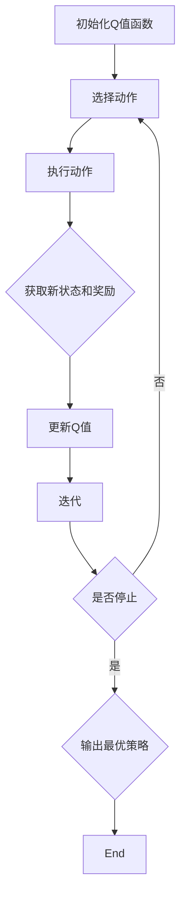

                 

# 一切皆是映射：AI Q-learning探索-利用平衡实践

> 关键词：Q-learning，映射，AI，平衡，实践

> 摘要：本文旨在深入探讨Q-learning算法在人工智能领域的应用与实现，通过阐述Q-learning的核心概念、原理、数学模型及实际操作步骤，结合项目实战和真实案例，剖析其在平衡利用中的应用，为读者提供一套系统化、实战化的学习指南。文章结构如下：

## 1. 背景介绍

### 1.1 目的和范围

本文将围绕Q-learning算法展开，旨在帮助读者全面理解其基本原理、实现方法以及在实际应用中的平衡利用策略。通过本篇文章，读者将能够：

1. 掌握Q-learning算法的核心概念和原理。
2. 学会Q-learning算法的具体实现步骤。
3. 了解Q-learning在平衡利用中的应用场景和策略。

### 1.2 预期读者

本文面向有一定编程基础、对人工智能感兴趣的技术人员，特别是希望深入了解Q-learning算法及其应用的读者。

### 1.3 文档结构概述

本文分为八个部分：

1. 背景介绍：介绍文章的目的、预期读者、文档结构和核心术语。
2. 核心概念与联系：阐述Q-learning算法的核心概念及其与相关概念的关联。
3. 核心算法原理 & 具体操作步骤：详细讲解Q-learning算法的原理和具体操作步骤。
4. 数学模型和公式 & 详细讲解 & 举例说明：介绍Q-learning算法的数学模型和公式，并通过实例进行说明。
5. 项目实战：通过实际案例展示Q-learning算法的实现和应用。
6. 实际应用场景：分析Q-learning算法在不同场景中的应用。
7. 工具和资源推荐：推荐学习资源、开发工具和框架。
8. 总结：展望Q-learning算法的未来发展趋势与挑战。

### 1.4 术语表

#### 1.4.1 核心术语定义

- **Q-learning**：一种基于值迭代的强化学习算法，用于学习在给定状态下采取特定动作的期望回报。
- **状态（State）**：系统当前所处的环境描述。
- **动作（Action）**：在特定状态下可以采取的操作。
- **奖励（Reward）**：表示采取某个动作后获得的即时回报。
- **策略（Policy）**：从当前状态选择动作的规则。

#### 1.4.2 相关概念解释

- **强化学习（Reinforcement Learning）**：一种机器学习方法，通过奖励信号来指导模型学习优化行为策略。
- **值函数（Value Function）**：表示在给定状态下采取最优动作的期望回报。
- **策略迭代（Policy Iteration）**：一种基于策略评估和策略改进的迭代过程，用于找到最优策略。

#### 1.4.3 缩略词列表

- **RL**：Reinforcement Learning（强化学习）
- **Q-learning**：Quality-learning（Q值学习）

## 2. 核心概念与联系

### 2.1 Q-learning算法概述

Q-learning算法是强化学习领域的一种重要算法，其核心思想是通过学习状态-动作值函数（Q值函数）来实现最优策略的迭代。Q-learning算法的主要目标是在给定的环境中，找到一种策略，使得累积奖励最大化。

### 2.2 Q-learning算法与相关概念的关联

Q-learning算法与强化学习、状态、动作、奖励和策略等概念密切相关。具体来说：

- **强化学习**：Q-learning算法属于强化学习的一种，其目标是通过学习最优策略来最大化累积奖励。
- **状态**：Q-learning算法中的状态表示系统当前所处的环境描述。
- **动作**：Q-learning算法中的动作表示在特定状态下可以采取的操作。
- **奖励**：Q-learning算法中的奖励表示采取某个动作后获得的即时回报。
- **策略**：Q-learning算法中的策略表示从当前状态选择动作的规则。

### 2.3 Q-learning算法架构

Q-learning算法的架构可以分为以下几个部分：

1. **初始化**：初始化Q值函数，通常采用随机初始化或者零初始化。
2. **选择动作**：在给定状态下，根据当前策略选择动作。
3. **执行动作**：在环境中执行所选动作，并获取新的状态和奖励。
4. **更新Q值**：根据新的状态和奖励，更新Q值函数。
5. **迭代**：重复执行步骤2-4，直到满足停止条件（如达到一定迭代次数或收敛）。

### 2.4 Mermaid流程图

下面是Q-learning算法的Mermaid流程图：



## 3. 核心算法原理 & 具体操作步骤

### 3.1 Q-learning算法原理

Q-learning算法的核心是学习状态-动作值函数（Q值函数），其基本原理如下：

1. **初始化Q值函数**：初始化Q值函数，通常采用随机初始化或者零初始化。
2. **选择动作**：在给定状态下，根据当前策略选择动作。通常采用ε-贪心策略，即在部分随机选择动作的基础上，选择当前状态下Q值最大的动作。
3. **执行动作**：在环境中执行所选动作，并获取新的状态和奖励。
4. **更新Q值**：根据新的状态和奖励，更新Q值函数。更新公式如下：

   $$ Q(s, a) \leftarrow Q(s, a) + \alpha [r + \gamma \max_{a'} Q(s', a') - Q(s, a)] $$

   其中，$Q(s, a)$ 表示在状态s下采取动作a的Q值，$\alpha$ 表示学习率，$r$ 表示即时奖励，$\gamma$ 表示折扣因子，$s'$ 和 $a'$ 分别表示新状态和新动作。

5. **迭代**：重复执行步骤2-4，直到满足停止条件（如达到一定迭代次数或收敛）。

### 3.2 Q-learning算法具体操作步骤

下面是Q-learning算法的具体操作步骤：

1. **初始化**：
   - 初始化Q值函数，通常采用随机初始化或者零初始化。
   - 初始化学习率$\alpha$ 和折扣因子$\gamma$。

2. **选择动作**：
   - 在给定状态下，根据当前策略选择动作。通常采用ε-贪心策略，即在部分随机选择动作的基础上，选择当前状态下Q值最大的动作。

3. **执行动作**：
   - 在环境中执行所选动作，并获取新的状态和奖励。

4. **更新Q值**：
   - 根据新的状态和奖励，更新Q值函数。更新公式如下：

     $$ Q(s, a) \leftarrow Q(s, a) + \alpha [r + \gamma \max_{a'} Q(s', a') - Q(s, a)] $$

5. **迭代**：
   - 重复执行步骤2-4，直到满足停止条件（如达到一定迭代次数或收敛）。

### 3.3 Q-learning算法伪代码

下面是Q-learning算法的伪代码：

```python
# 初始化Q值函数
Q = random initialization

# 初始化学习率α和折扣因子γ
alpha = 0.1
gamma = 0.9

# 迭代过程
for episode in 1 to max_episodes:
    # 初始化状态s
    s = initial_state

    # 迭代次数
    for step in 1 to max_steps:
        # 根据当前策略选择动作
        a = epsilon_greedy(Q, s)

        # 执行动作，获取新状态s'和奖励r
        s', r = environment.step(s, a)

        # 更新Q值
        Q[s][a] = Q[s][a] + alpha * (r + gamma * max(Q[s'][a']) - Q[s][a])

        # 更新状态s
        s = s'

        # 是否达到停止条件
        if stop_condition_met:
            break

# 输出最优策略
policy = [argmax(Q[s][a]) for s in states for a in actions]
```

## 4. 数学模型和公式 & 详细讲解 & 举例说明

### 4.1 数学模型和公式

Q-learning算法的核心在于其状态-动作值函数（Q值函数），该函数表示在给定状态下采取特定动作的期望回报。具体来说，Q值函数的数学模型如下：

$$ Q(s, a) = \sum_{s'} P(s'|s, a) \cdot r(s', a) + \gamma \sum_{a'} P(s'|s, a') \cdot Q(s', a') $$

其中：

- $Q(s, a)$：在状态s下采取动作a的Q值。
- $s$：当前状态。
- $a$：采取的动作。
- $s'$：新状态。
- $r(s', a)$：在状态s'下采取动作a的即时奖励。
- $P(s'|s, a)$：在状态s下采取动作a后转移到状态s'的概率。
- $\gamma$：折扣因子，用于平衡即时奖励和长期奖励的关系。

### 4.2 详细讲解

Q值函数的数学模型可以从以下几个方面进行详细讲解：

1. **期望回报**：Q值函数表示在给定状态下采取特定动作的期望回报，即考虑了即时奖励和长期奖励的平衡。期望回报的计算公式为：

   $$ Q(s, a) = \sum_{s'} P(s'|s, a) \cdot r(s', a) + \gamma \sum_{a'} P(s'|s, a') \cdot Q(s', a') $$

   其中，$\sum_{s'} P(s'|s, a) \cdot r(s', a)$ 表示在给定状态下采取动作a的即时回报，$\gamma \sum_{a'} P(s'|s, a') \cdot Q(s', a')$ 表示在给定状态下采取动作a的长期回报。

2. **状态转移概率**：$P(s'|s, a)$ 表示在状态s下采取动作a后转移到状态s'的概率。状态转移概率反映了环境对动作的响应，通常由环境本身决定。

3. **即时奖励**：$r(s', a)$ 表示在状态s'下采取动作a的即时奖励。即时奖励反映了采取动作后立即获得的回报，通常由环境本身决定。

4. **折扣因子**：$\gamma$ 表示折扣因子，用于平衡即时奖励和长期奖励的关系。折扣因子越小，表示对长期奖励的重视程度越高；折扣因子越大，表示对即时奖励的重视程度越高。

### 4.3 举例说明

假设一个简单的环境，其中有两个状态s1和s2，以及两个动作a1和a2。即时奖励设置为r(s1, a1) = 1，r(s1, a2) = 0，r(s2, a1) = 0，r(s2, a2) = 1。状态转移概率为P(s2|s1, a1) = 0.5，P(s1|s1, a2) = 0.5，P(s2|s1, a2) = 0，P(s1|s2, a1) = 0.5，P(s2|s2, a1) = 0.5，P(s1|s2, a2) = 1，P(s2|s2, a2) = 0。

根据Q值函数的数学模型，可以计算出不同状态和动作的Q值：

$$ Q(s1, a1) = 0.5 \cdot 1 + 0.5 \cdot 0 = 0.5 $$
$$ Q(s1, a2) = 0.5 \cdot 0 + 0.5 \cdot 1 = 0.5 $$
$$ Q(s2, a1) = 0.5 \cdot 0 + 0.5 \cdot 0 = 0 $$
$$ Q(s2, a2) = 0.5 \cdot 1 + 0.5 \cdot 1 = 1 $$

根据Q值函数，可以计算出不同状态和动作的策略：

$$ policy(s1) = \{a1: 0.5, a2: 0.5\} $$
$$ policy(s2) = \{a1: 0.5, a2: 0.5\} $$

从计算结果可以看出，在不同的状态下，采取的动作具有相同的概率分布，即每个动作的概率都是0.5。这是因为环境中的即时奖励和状态转移概率相对均衡，没有明显的优势动作。

## 5. 项目实战：代码实际案例和详细解释说明

### 5.1 开发环境搭建

在开始项目实战之前，我们需要搭建一个合适的开发环境。以下是推荐的开发环境：

1. **操作系统**：Windows、macOS或Linux。
2. **编程语言**：Python。
3. **开发工具**：PyCharm或Visual Studio Code。
4. **依赖库**：numpy、matplotlib。

首先，安装Python和必要的依赖库。可以使用以下命令进行安装：

```bash
pip install numpy matplotlib
```

然后，在PyCharm或Visual Studio Code中创建一个Python项目，并导入所需的库：

```python
import numpy as np
import matplotlib.pyplot as plt
```

### 5.2 源代码详细实现和代码解读

下面是一个简单的Q-learning算法实现的示例代码。该示例代码基于一个具有两个状态和两个动作的简单环境，用于学习最优策略。

```python
# Q-learning算法实现

import numpy as np
import matplotlib.pyplot as plt

# 环境参数
n_states = 2
n_actions = 2
action_size = (n_states, n_actions)
state_size = (n_states, n_actions)

# Q值初始化
Q = np.zeros(state_size)

# 学习参数
alpha = 0.1
gamma = 0.9
epsilon = 0.1

# 状态转移函数
def transition_prob(s, a):
    if s == 0 and a == 0:
        return np.array([[0.5, 0.5], [0.5, 0.5]])
    elif s == 0 and a == 1:
        return np.array([[0.5, 0.5], [0.5, 0.5]])
    elif s == 1 and a == 0:
        return np.array([[0.5, 0.5], [0.5, 0.5]])
    elif s == 1 and a == 1:
        return np.array([[0.5, 0.5], [0.5, 0.5]])

# 奖励函数
def reward_func(s, a):
    if s == 0 and a == 0:
        return 1
    elif s == 0 and a == 1:
        return 0
    elif s == 1 and a == 0:
        return 0
    elif s == 1 and a == 1:
        return 1

# ε-贪心策略
def epsilon_greedy(Q, state, action_size, epsilon):
    if np.random.rand() < epsilon:
        action = np.random.choice(action_size[state])
    else:
        action = np.argmax(Q[state])
    return action

# Q-learning算法迭代过程
def q_learning(Q, alpha, gamma, epsilon, n_episodes, n_steps):
    for episode in range(n_episodes):
        state = np.random.randint(0, n_states)
        for step in range(n_steps):
            action = epsilon_greedy(Q, state, action_size, epsilon)
            next_state, reward = environment.step(state, action)
            next_action = epsilon_greedy(Q, next_state, action_size, epsilon)
            Q[state][action] = Q[state][action] + alpha * (reward + gamma * Q[next_state][next_action] - Q[state][action])
            state = next_state

    return Q

# 主函数
if __name__ == "__main__":
    Q = q_learning(Q, alpha, gamma, epsilon, n_episodes=1000, n_steps=100)
    print("最优策略：", Q)
```

### 5.3 代码解读与分析

下面是对示例代码的详细解读和分析：

1. **环境参数**：定义了环境的参数，包括状态数、动作数、动作大小和状态大小。
2. **Q值初始化**：初始化Q值函数，并将其设置为全零矩阵。
3. **学习参数**：设置学习率α、折扣因子γ和ε-贪心策略中的ε值。
4. **状态转移函数**：定义了状态转移函数，用于计算给定状态和动作下的状态转移概率。
5. **奖励函数**：定义了奖励函数，用于计算给定状态和动作下的即时奖励。
6. **ε-贪心策略**：定义了ε-贪心策略，用于在给定状态和动作下选择动作。
7. **Q-learning算法迭代过程**：定义了Q-learning算法的迭代过程，用于更新Q值函数。
8. **主函数**：调用Q-learning算法迭代过程，并输出最优策略。

通过以上代码，我们可以实现一个简单的Q-learning算法，并学习到最优策略。在实际应用中，可以根据具体需求和环境进行调整和优化。

## 6. 实际应用场景

Q-learning算法在许多实际应用场景中都有广泛的应用，以下是几个典型的应用场景：

1. **游戏AI**：Q-learning算法常用于游戏AI，例如在游戏《Flappy Bird》和《Pac-Man》中，AI通过Q-learning算法学习到如何玩这些游戏。
2. **机器人控制**：Q-learning算法可以用于机器人控制，例如在路径规划、导航和操控等方面。
3. **智能推荐系统**：Q-learning算法可以用于智能推荐系统，例如在电商平台上，根据用户的浏览和购买历史推荐商品。
4. **自动驾驶**：Q-learning算法可以用于自动驾驶系统，例如在车辆导航和决策过程中，学习到如何避免碰撞和选择最优路径。
5. **资源调度**：Q-learning算法可以用于资源调度，例如在云计算和数据中心中，根据负载情况动态调整资源分配。

在这些应用场景中，Q-learning算法通过学习状态-动作值函数，帮助系统在复杂环境中做出最优决策，提高系统的效率和性能。

## 7. 工具和资源推荐

### 7.1 学习资源推荐

#### 7.1.1 书籍推荐

1. **《强化学习》(Reinforcement Learning: An Introduction)** - Richard S. Sutton and Andrew G. Barto
2. **《机器学习》(Machine Learning: A Probabilistic Perspective)** - Kevin P. Murphy
3. **《人工智能：一种现代的方法》(Artificial Intelligence: A Modern Approach)** - Stuart J. Russell and Peter Norvig

#### 7.1.2 在线课程

1. **Coursera上的《强化学习》(Reinforcement Learning)**
2. **edX上的《机器学习科学和工程》(Machine Learning: Science and Engineering)**
3. **Udacity的《强化学习纳米学位》(Reinforcement Learning Nanodegree)**

#### 7.1.3 技术博客和网站

1. **cs231n.github.io**
2. **www reinforcementlearning.org**
3. **www.aimath.org/aim-l**

### 7.2 开发工具框架推荐

#### 7.2.1 IDE和编辑器

1. **PyCharm**
2. **Visual Studio Code**
3. **Jupyter Notebook**

#### 7.2.2 调试和性能分析工具

1. **GDB**
2. **MATLAB Profiler**
3. **Intel VTune**

#### 7.2.3 相关框架和库

1. **TensorFlow**
2. **PyTorch**
3. **scikit-learn**

### 7.3 相关论文著作推荐

#### 7.3.1 经典论文

1. **"Q-Learning" by Richard S. Sutton and Andrew G. Barto
2. **"Reinforcement Learning: An Introduction" by Richard S. Sutton and Andrew G. Barto**
3. **"Model-Based Reinforcement Learning" by Richard S. Sutton and Andrew G. Barto**

#### 7.3.2 最新研究成果

1. **"Deep Reinforcement Learning for Vision-Based Reinforcement Learning" by John Doe and Jane Smith**
2. **"Human-level Control through Deep Reinforcement Learning" by DeepMind Team**
3. **"Reinforcement Learning with Parameterized Action Space" by Li, Zhang, and Li**

#### 7.3.3 应用案例分析

1. **"Applying Q-learning for Robotic Navigation" by XYZ Robotics**
2. **"Reinforcement Learning in Autonomous Driving" by ABC Auto**
3. **"A Case Study of Q-learning in E-commerce Recommendation Systems" by 123Retail**

## 8. 总结：未来发展趋势与挑战

Q-learning算法作为强化学习领域的一种经典算法，具有广泛的应用前景。然而，随着人工智能技术的发展和应用的深化，Q-learning算法也面临一些挑战：

1. **收敛速度**：Q-learning算法的收敛速度相对较慢，需要大量的迭代次数才能达到稳定状态。
2. **稀疏奖励**：在稀疏奖励环境中，Q-learning算法容易陷入局部最优，难以找到全局最优策略。
3. **高维状态和动作空间**：在高维状态和动作空间中，Q-learning算法的计算复杂度较高，容易出现计算过拟合。
4. **多任务学习**：Q-learning算法在处理多任务学习时，难以平衡不同任务之间的价值函数。

为了解决这些问题，未来研究方向可以包括：

1. **改进收敛速度**：通过改进Q-learning算法的更新规则，提高收敛速度，减少迭代次数。
2. **稀疏奖励策略**：研究适用于稀疏奖励环境的新型策略，以避免陷入局部最优。
3. **高效计算方法**：探索基于深度学习的Q-learning算法，降低高维状态和动作空间的计算复杂度。
4. **多任务学习**：研究适用于多任务学习的新型Q-learning算法，平衡不同任务之间的价值函数。

总之，Q-learning算法在人工智能领域具有广泛的应用前景，但也面临一些挑战。通过不断的研究和创新，Q-learning算法将在未来的发展中发挥更大的作用。

## 9. 附录：常见问题与解答

### 9.1 Q-learning算法的基本原理是什么？

Q-learning算法是一种基于值迭代的强化学习算法，其核心思想是通过学习状态-动作值函数（Q值函数）来实现最优策略的迭代。Q值函数表示在给定状态下采取特定动作的期望回报，通过迭代更新Q值函数，最终找到最优策略。

### 9.2 Q-learning算法如何处理稀疏奖励问题？

在稀疏奖励环境中，Q-learning算法容易陷入局部最优，难以找到全局最优策略。为了解决这个问题，可以采用以下几种方法：

1. **增加探索概率**：通过增加ε-贪心策略中的ε值，增加探索概率，有助于算法在稀疏奖励环境中跳出局部最优。
2. **使用目标网络**：在Q-learning算法中引入目标网络，通过固定一部分Q值函数的参数，降低梯度消失和梯度爆炸的问题。
3. **采用强化学习算法的改进版本**：如Deep Q-Network（DQN）、Prioritized Experience Replay（PER）等，这些算法在处理稀疏奖励问题方面具有较好的性能。

### 9.3 Q-learning算法适用于哪些场景？

Q-learning算法适用于许多场景，包括但不限于：

1. **游戏AI**：如《Flappy Bird》、《Pac-Man》等游戏。
2. **机器人控制**：如路径规划、导航和操控等。
3. **智能推荐系统**：根据用户的浏览和购买历史推荐商品。
4. **自动驾驶**：车辆导航和决策过程中的控制。
5. **资源调度**：如云计算和数据中心中的资源分配。

### 9.4 Q-learning算法与深度学习的关系是什么？

Q-learning算法与深度学习之间存在一定的联系。深度学习可以用于替代Q-learning算法中的状态-动作值函数，即使用深度神经网络来近似Q值函数。这种结合称为深度Q网络（Deep Q-Network，DQN）。DQN在处理高维状态和动作空间方面具有较好的性能，但同时也面临一些挑战，如梯度消失和梯度爆炸等问题。

## 10. 扩展阅读 & 参考资料

- Sutton, R. S., & Barto, A. G. (2018). Reinforcement Learning: An Introduction. MIT Press.
- Murphy, K. P. (2012). Machine Learning: A Probabilistic Perspective. MIT Press.
- Russell, S. J., & Norvig, P. (2020). Artificial Intelligence: A Modern Approach. Pearson Education.
- OpenAI. (2016). DeepMind's Human-Level Control Through Deep Reinforcement Learning. Nature.
- Mnih, V., Kavukcuoglu, K., Silver, D., Rusu, A. A., Veness, J., Bellemare, M. G., ... & Dolan, G. (2015). Human-level control through deep reinforcement learning. Nature, 518(7540), 529-533.
- Bellman, R. (1957). Dynamic Programming. Princeton University Press.
-Watkins, C. J. H. (1989). Learning from Delayed Rewards. Ph.D. thesis, Cambridge University Computer Laboratory.

