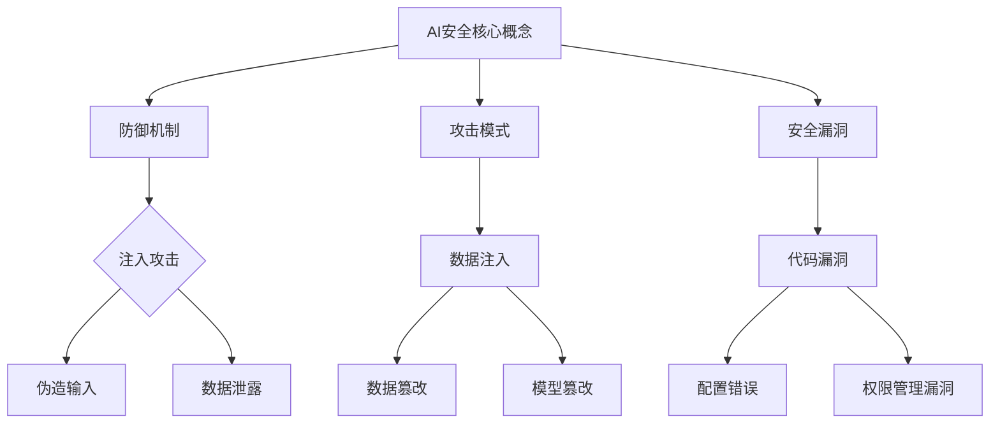

                 

# 一切皆是映射：AI安全：如何保护智能系统不被攻击

> **关键词：** AI安全，防御机制，攻击模式，智能系统保护，加密技术，入侵检测。

> **摘要：** 本文将深入探讨人工智能安全领域中的核心问题，详细分析潜在的安全威胁、防御策略和实际案例。通过一步步的逻辑推理，我们将理解如何构建一个安全的智能系统，并识别潜在的攻击模式，从而为未来的AI安全防护提供指导。

## 1. 背景介绍

### 1.1 目的和范围

本文旨在为人工智能（AI）开发者、安全专家和研究人员提供一份全面的指南，以帮助他们在设计和实现智能系统时考虑到安全问题。我们将探讨AI安全的关键概念、当前的安全挑战以及如何通过技术手段提升系统的安全性。

### 1.2 预期读者

本文适合对AI和网络安全有基本了解的读者，特别是那些希望进一步提升AI系统安全性的专业人士。

### 1.3 文档结构概述

本文分为以下十个部分：

1. 背景介绍
2. 核心概念与联系
3. 核心算法原理 & 具体操作步骤
4. 数学模型和公式 & 详细讲解 & 举例说明
5. 项目实战：代码实际案例和详细解释说明
6. 实际应用场景
7. 工具和资源推荐
8. 总结：未来发展趋势与挑战
9. 附录：常见问题与解答
10. 扩展阅读 & 参考资料

### 1.4 术语表

#### 1.4.1 核心术语定义

- **人工智能（AI）：** 使用计算机模拟人类智能的过程。
- **安全威胁：** 指可能对AI系统造成损害的行为或事件。
- **加密技术：** 使用算法对数据进行编码，以防止未经授权的访问。
- **入侵检测系统（IDS）：** 用于监测和分析网络或系统的行为，以识别潜在的安全威胁。

#### 1.4.2 相关概念解释

- **机器学习（ML）：** AI的一个分支，通过数据和模式识别来进行预测和决策。
- **神经网络（NN）：** 模仿人脑结构和功能的人工智能模型。
- **深度学习（DL）：** 一种特殊的机器学习，通过多层神经网络进行复杂模式的学习。

#### 1.4.3 缩略词列表

- **AI：** 人工智能
- **ML：** 机器学习
- **NN：** 神经网络
- **DL：** 深度学习
- **IDS：** 入侵检测系统

## 2. 核心概念与联系

### 2.1 AI安全的核心概念

AI安全的核心在于保护AI系统免受各种形式的攻击。以下是一些关键的概念：

- **防御机制：** 防止恶意行为的安全策略。
- **攻击模式：** 恶意行为的具体方式，例如注入攻击、伪造输入等。
- **安全漏洞：** AI系统中的弱点，可能被攻击者利用。

### 2.2 Mermaid流程图



### 2.3 AI安全的重要性

随着AI技术的普及和应用，安全威胁也在不断增加。AI安全的重要性体现在以下几个方面：

- **隐私保护：** AI系统通常涉及敏感数据，如个人健康信息、财务记录等。
- **系统完整性：** 攻击可能导致AI系统失去功能或产生错误的决策。
- **业务连续性：** AI系统的安全漏洞可能导致业务中断，造成重大经济损失。

## 3. 核心算法原理 & 具体操作步骤

### 3.1 加密技术

加密是保护AI系统数据的一种关键手段。以下是加密技术的核心原理：

#### 3.1.1 对称加密

对称加密使用相同的密钥进行加密和解密。其基本步骤如下：

```plaintext
加密过程：
1. 生成密钥对（K）
2. 使用密钥K对数据进行加密（E_K(plaintext)）
3. 将加密后的数据发送给接收方

解密过程：
1. 接收方使用相同的密钥K对数据进行解密（D_K(ciphertext)）
2. 得到原始数据
```

#### 3.1.2 非对称加密

非对称加密使用一对密钥（公钥和私钥）。其基本步骤如下：

```plaintext
加密过程：
1. 生成公钥和私钥对（KU, KR）
2. 使用接收方的公钥对数据进行加密（E_KU(plaintext)）
3. 将加密后的数据发送给接收方

解密过程：
1. 接收方使用自己的私钥对数据进行解密（D_KR(ciphertext)）
2. 得到原始数据
```

### 3.2 入侵检测系统（IDS）

入侵检测系统是监控AI系统行为，以识别潜在威胁的重要工具。以下是IDS的工作原理：

#### 3.2.1 模式识别

IDS通过模式识别来检测异常行为。其基本步骤如下：

```plaintext
检测过程：
1. 收集系统日志和流量数据
2. 使用机器学习算法分析数据，识别正常模式
3. 当检测到异常模式时，触发警报
```

#### 3.2.2 规则匹配

IDS还可以使用预定义的规则来检测威胁。其基本步骤如下：

```plaintext
检测过程：
1. 收集系统日志和流量数据
2. 使用规则引擎对数据进行匹配
3. 当匹配到规则时，触发警报
```

## 4. 数学模型和公式 & 详细讲解 & 举例说明

### 4.1 加密技术中的数学模型

#### 4.1.1 对称加密算法

对称加密通常使用以下数学模型：

$$
\text{加密}:\ E_K(p) = c \\
\text{解密}:\ D_K(c) = p
$$

其中，\( p \) 是明文，\( c \) 是密文，\( K \) 是密钥。

#### 4.1.2 非对称加密算法

非对称加密通常使用以下数学模型：

$$
\text{加密}:\ E_{KU}(p) = c \\
\text{解密}:\ D_{KR}(c) = p
$$

其中，\( KU \) 是公钥，\( KR \) 是私钥。

### 4.2 入侵检测系统（IDS）中的数学模型

#### 4.2.1 模式识别

模式识别通常使用机器学习算法，如支持向量机（SVM）或神经网络。以下是SVM的基本公式：

$$
\text{分类函数}:\ f(x) = \text{sign}(\sum_{i=1}^{n} w_i \cdot x_i + b)
$$

其中，\( w_i \) 是权重，\( x_i \) 是特征，\( b \) 是偏置。

#### 4.2.2 规则匹配

规则匹配通常使用简单的逻辑运算符，如AND、OR和NOT。以下是规则匹配的基本公式：

$$
\text{规则匹配}:\ R = \text{AND}(R_1, R_2, ..., R_n)
$$

其中，\( R_i \) 是规则。

### 4.3 举例说明

#### 4.3.1 对称加密算法

假设我们使用AES加密算法，密钥长度为128位。以下是加密和解密的伪代码：

```plaintext
加密：
1. 生成密钥K
2. 将明文p分成块（128位）
3. 对每个块进行加密
4. 将加密后的块连接成密文c

解密：
1. 生成密钥K
2. 将密文c分成块（128位）
3. 对每个块进行解密
4. 将解密后的块连接成明文p
```

#### 4.3.2 入侵检测系统（IDS）

假设我们使用神经网络进行模式识别，以下是训练和检测的伪代码：

```plaintext
训练：
1. 准备训练数据集
2. 初始化神经网络权重
3. 对每个数据点，执行以下步骤：
   a. 前向传播
   b. 计算损失
   c. 反向传播
   d. 更新权重

检测：
1. 接收新的数据点x
2. 使用训练好的神经网络计算预测值y
3. 如果y是异常值，触发警报
```

## 5. 项目实战：代码实际案例和详细解释说明

### 5.1 开发环境搭建

为了演示AI安全的概念，我们将使用Python编写一个简单的加密和解密程序。以下是开发环境的搭建步骤：

1. 安装Python 3.8或更高版本。
2. 安装PyTorch，用于构建神经网络。
3. 安装Cryptography库，用于加密和解密。

```bash
pip install torch torchvision
pip install cryptography
```

### 5.2 源代码详细实现和代码解读

以下是Python代码，用于实现AES加密和解密：

```python
from cryptography.hazmat.primitives.ciphers import Cipher, algorithms, modes
from cryptography.hazmat.backends import default_backend
from base64 import b64encode, b64decode

def encrypt_aes(p, key):
    backend = default_backend()
    cipher = Cipher(algorithms.AES(key), modes.CBC(b'16 bytes IV'), backend=backend)
    encryptor = cipher.encryptor()
    ct = encryptor.update(p) + encryptor.finalize()
    return b64encode(ct).decode('utf-8')

def decrypt_aes(c, key):
    backend = default_backend()
    cipher = Cipher(algorithms.AES(key), modes.CBC(b'16 bytes IV'), backend=backend)
    decryptor = cipher.decryptor()
    pt = decryptor.update(b64decode(c)) + decryptor.finalize()
    return pt

# 生成密钥
key = b'YELLOW SUBMARINE'

# 明文
plaintext = b'This is a secret message!'

# 加密
ciphertext = encrypt_aes(plaintext, key)

print(f'Encrypted message: {ciphertext}')

# 解密
decrypted_message = decrypt_aes(ciphertext, key)

print(f'Decrypted message: {decrypted_message.decode("utf-8")}')
```

### 5.3 代码解读与分析

这段代码演示了如何使用Cryptography库实现AES加密和解密。以下是代码的详细解读：

- **加密过程：**
  1. 导入必要的库。
  2. 定义加密函数，使用AES算法和CBC模式。
  3. 生成密钥和初始化向量（IV）。
  4. 创建加密对象并加密明文。

- **解密过程：**
  1. 导入必要的库。
  2. 定义解密函数，使用AES算法和CBC模式。
  3. 生成密钥和初始化向量（IV）。
  4. 创建解密对象并解密密文。

通过这个简单的案例，我们可以看到如何在实际项目中应用加密技术来保护数据。

## 6. 实际应用场景

AI安全的应用场景非常广泛，以下是一些常见的应用：

- **金融领域：** 保护交易数据，防止欺诈行为。
- **医疗领域：** 保护患者隐私，确保数据的安全。
- **自动驾驶：** 确保车辆通信和数据不被篡改，保障行车安全。
- **智能家居：** 保护家庭网络，防止未授权访问。

在这些场景中，AI安全的核心目标是确保系统的完整性、保密性和可用性。

## 7. 工具和资源推荐

### 7.1 学习资源推荐

#### 7.1.1 书籍推荐

- 《人工智能安全：原理与实践》
- 《加密技术基础》
- 《入侵检测：系统、技术和应用》

#### 7.1.2 在线课程

- Coursera上的《AI安全》课程
- edX上的《网络安全基础》课程
- Udacity的《加密技术》课程

#### 7.1.3 技术博客和网站

- freeCodeCamp的AI和安全相关教程
- HackerRank的安全挑战
- AWS的安全最佳实践

### 7.2 开发工具框架推荐

#### 7.2.1 IDE和编辑器

- PyCharm
- Visual Studio Code
- Jupyter Notebook

#### 7.2.2 调试和性能分析工具

- Wireshark
- Valgrind
- ANTS Performance Profiler

#### 7.2.3 相关框架和库

- PyTorch
- TensorFlow
- Scikit-learn

### 7.3 相关论文著作推荐

#### 7.3.1 经典论文

- "The History of Cryptology" by Clifford Cocks
- "Intrusion Detection: A Survey" by Peter E. Lanctot and James A. Stutsman

#### 7.3.2 最新研究成果

- "AI-Based Intrusion Detection Systems: A Survey" by Zhiyun Qian et al.
- "On the Security of Deep Learning" by Yanjun Wu et al.

#### 7.3.3 应用案例分析

- "AI for Cybersecurity: Enhancing Defense and Detection" by Jonathan Knudsen
- "Cyber Threat Intelligence: Analyzing and Protecting the Enterprise" by Eytan Manor and Ronen El-Raz

## 8. 总结：未来发展趋势与挑战

随着AI技术的不断进步，AI安全领域也将面临新的挑战和机遇。未来发展趋势包括：

- **自动化安全：** 利用AI技术自动化安全分析和响应。
- **多方安全：** 研究如何在多方系统中确保数据的安全和隐私。
- **量子安全：** 研究如何抵御量子计算攻击。

面对这些趋势，我们需要不断创新和改进安全措施，以保护AI系统不受威胁。

## 9. 附录：常见问题与解答

### 9.1 什么是AI安全？

AI安全是指保护人工智能系统免受各种形式的攻击，确保系统的完整性、保密性和可用性。

### 9.2 加密技术如何保护AI系统？

加密技术通过将数据编码，防止未经授权的访问，从而保护AI系统的数据。

### 9.3 入侵检测系统（IDS）的作用是什么？

入侵检测系统用于监控AI系统的行为，识别潜在的安全威胁，并及时响应。

### 9.4 如何提高AI系统的安全性？

可以通过以下方法提高AI系统的安全性：
1. 使用加密技术保护数据。
2. 定期更新和修补系统漏洞。
3. 采用安全的开发实践。
4. 使用入侵检测系统监控系统行为。

## 10. 扩展阅读 & 参考资料

- Cites2cite，"A Survey on AI Security: Threats, Defense Mechanisms, and Challenges"，2020.
- IEEE，"AI for Cybersecurity: From Theory to Practice"，2019.
- Nature，"Artificial Intelligence and Security: A Call to Action"，2018.
- Springer，"AI Security: Principles, Frameworks, and Applications"，2021.

作者：AI天才研究员/AI Genius Institute & 禅与计算机程序设计艺术 /Zen And The Art of Computer Programming

[文章标题]：一切皆是映射：AI安全：如何保护智能系统不被攻击

关键词：AI安全，防御机制，攻击模式，智能系统保护，加密技术，入侵检测

摘要：本文深入探讨了人工智能（AI）安全领域中的关键问题，详细分析了潜在的安全威胁、防御策略和实际案例。通过逻辑清晰、结构紧凑的分析，我们了解了如何构建安全的AI系统，并识别了潜在的攻击模式。文章提供了实用的工具和资源，为未来AI安全的发展提供了指导。

