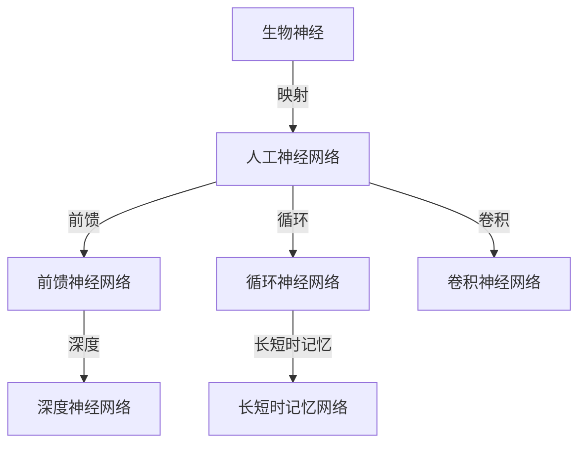

                 

# 一切皆是映射：从生物神经到人工神经网络的演变

> 关键词：神经网络、映射、生物神经、人工神经网络、计算机编程、算法、人工智能

> 摘要：本文将深入探讨从生物神经到人工神经网络的演变过程，通过分析映射的概念，揭示神经网络在计算机编程和人工智能领域的核心作用。我们将以逻辑清晰、结构紧凑的方式，逐步剖析神经网络的工作原理、数学模型及其在实际应用中的场景，为读者呈现一幅清晰的神经网络发展脉络。

## 1. 背景介绍

### 1.1 目的和范围

本文旨在探讨神经网络的发展历程，特别是从生物神经到人工神经网络的演变过程。通过对映射概念的分析，我们将揭示神经网络在计算机编程和人工智能领域的重要性和应用价值。文章将涵盖以下几个方面：

1. 神经网络的起源及其与生物神经系统的关系。
2. 映射概念在神经网络中的应用及其意义。
3. 人工神经网络的基本原理和数学模型。
4. 神经网络在实际应用中的场景和技术挑战。
5. 未来神经网络的发展趋势和潜在突破点。

### 1.2 预期读者

本文适合对计算机编程和人工智能有一定基础的读者，特别是对神经网络理论和应用感兴趣的读者。通过本文的阅读，读者可以：

1. 了解神经网络的基本概念和发展历程。
2. 掌握映射概念在神经网络中的应用。
3. 理解人工神经网络的工作原理和数学模型。
4. 探索神经网络在实际应用中的挑战和前景。

### 1.3 文档结构概述

本文结构如下：

1. **背景介绍**：介绍本文的目的、范围、预期读者和文档结构。
2. **核心概念与联系**：分析神经网络的核心概念和联系，使用Mermaid流程图展示。
3. **核心算法原理 & 具体操作步骤**：详细阐述神经网络的核心算法原理和操作步骤，使用伪代码进行描述。
4. **数学模型和公式 & 详细讲解 & 举例说明**：介绍神经网络的数学模型和公式，并进行详细讲解和举例。
5. **项目实战：代码实际案例和详细解释说明**：通过实际代码案例展示神经网络的应用，并进行详细解释和分析。
6. **实际应用场景**：分析神经网络在不同领域的实际应用场景。
7. **工具和资源推荐**：推荐相关学习资源、开发工具和框架。
8. **总结：未来发展趋势与挑战**：总结神经网络的发展趋势和面临的挑战。
9. **附录：常见问题与解答**：回答读者可能关心的问题。
10. **扩展阅读 & 参考资料**：提供更多扩展阅读和参考资料。

### 1.4 术语表

#### 1.4.1 核心术语定义

- **神经网络**：由大量简单处理单元（神经元）互联形成的计算网络，能够通过学习处理和识别复杂数据。
- **映射**：指从一种数据结构或状态转换到另一种数据结构或状态的过程。
- **人工神经网络**：基于生物神经系统的数学模型和计算原理，通过大量简单处理单元互联实现的计算网络。
- **前馈神经网络**：信息流只能从输入层流向输出层，没有循环连接的网络结构。
- **反向传播算法**：一种用于训练神经网络的算法，通过计算输出误差，反向传播误差到每个神经元，更新网络权重。

#### 1.4.2 相关概念解释

- **神经元**：神经网络的基本计算单元，类似于生物神经元的处理机制。
- **激活函数**：用于引入非线性特性的函数，用于决定神经元是否被激活。
- **权重**：连接神经元的参数，用于调节输入信号的强度。
- **偏置**：神经元内部的一个常数项，用于调整输出。
- **梯度下降**：一种优化算法，通过不断调整权重和偏置，最小化网络误差。

#### 1.4.3 缩略词列表

- **NN**：神经网络（Neural Network）
- **ANN**：人工神经网络（Artificial Neural Network）
- **DNN**：深度神经网络（Deep Neural Network）
- **RNN**：循环神经网络（Recurrent Neural Network）
- **CNN**：卷积神经网络（Convolutional Neural Network）

## 2. 核心概念与联系

神经网络的核心概念与联系可以通过以下Mermaid流程图进行展示：



### 2.1 生物神经

生物神经系统是神经网络概念的起源，由大量神经元通过复杂的连接和交互实现信息处理和传递。神经元是生物神经系统的基本计算单元，具有接受输入、处理信息和传递输出等功能。神经元之间通过突触连接，形成复杂的神经网络结构，从而实现智能行为和学习能力。

### 2.2 映射

映射是神经网络的核心概念之一，指的是将输入数据映射到输出数据的过程。在生物神经系统中，映射是通过神经元之间的突触连接实现的。每个突触具有一定的权重，用于调节输入信号的强度。人工神经网络通过模拟生物神经系统的映射机制，实现了从输入到输出的计算过程。

### 2.3 人工神经网络

人工神经网络是基于生物神经系统的数学模型和计算原理，通过大量简单处理单元（神经元）互联形成的计算网络。人工神经网络能够模拟生物神经系统的信息处理和传递机制，实现对复杂数据的学习和处理。人工神经网络可以分为以下几种类型：

- **前馈神经网络**：信息流只能从输入层流向输出层，没有循环连接。
- **循环神经网络**：具有循环连接，能够处理序列数据。
- **卷积神经网络**：具有卷积层，能够处理图像等二维数据。
- **深度神经网络**：具有多层结构，能够处理高维数据和复杂特征。

### 2.4 映射在神经网络中的应用

映射在神经网络中具有重要作用，通过映射，神经网络能够将输入数据转换为输出数据，实现数据分类、预测、识别等功能。映射机制在神经网络中的实现包括以下几个方面：

- **神经元之间的权重**：权重用于调节输入信号的强度，实现输入数据到输出数据的映射。
- **激活函数**：激活函数用于引入非线性特性，使神经网络能够处理复杂数据。
- **多层结构**：通过多层结构，神经网络能够实现多级映射，提高数据处理能力。

## 3. 核心算法原理 & 具体操作步骤

神经网络的算法原理是通过模拟生物神经系统的计算机制，实现对输入数据的处理和输出预测。以下是神经网络的核心算法原理和具体操作步骤：

### 3.1 算法原理

神经网络的核心算法原理包括以下几个方面：

- **神经元模型**：神经元是神经网络的基本计算单元，通过接受输入、处理信息和传递输出实现数据计算。
- **权重与偏置**：权重用于调节输入信号的强度，偏置用于调整输出。
- **激活函数**：激活函数用于引入非线性特性，使神经网络能够处理复杂数据。
- **前向传播**：将输入数据通过神经网络传递到输出层，实现数据的映射。
- **反向传播**：计算输出误差，通过反向传播算法更新网络权重和偏置，优化网络性能。

### 3.2 具体操作步骤

以下是神经网络的具体操作步骤：

1. **初始化网络结构**：定义网络的层数、神经元个数和连接方式。

```python
# 初始化网络结构
input_layer = 784
hidden_layer = 128
output_layer = 10

# 创建网络结构
network = [
    input_layer,
    hidden_layer,
    output_layer
]
```

2. **初始化权重和偏置**：随机初始化网络权重和偏置，用于调节输入信号的强度和输出。

```python
# 初始化权重和偏置
weights = np.random.randn(hidden_layer, input_layer)
biases = np.random.randn(hidden_layer, 1)
```

3. **前向传播**：将输入数据通过神经网络传递到输出层，计算输出。

```python
# 前向传播
def forward_propagation(input_data):
    # 计算输入层到隐藏层的输出
    hidden_output = np.dot(weights, input_data) + biases
    hidden_output = activation_function(hidden_output)

    # 计算隐藏层到输出层的输出
    output_output = np.dot(weights, hidden_output) + biases
    output_output = activation_function(output_output)

    return output_output
```

4. **计算损失函数**：计算输出误差，用于评估网络性能。

```python
# 计算损失函数
def compute_loss(output_output, target_output):
    return np.mean(np.square(output_output - target_output))
```

5. **反向传播**：计算输出误差，通过反向传播算法更新网络权重和偏置。

```python
# 反向传播
def backward_propagation(input_data, target_output, output_output):
    # 计算输出误差的梯度
    output_error_gradient = output_output - target_output
    output_error_gradient = activation_function_derivative(output_output)

    # 更新权重和偏置
    weights -= learning_rate * np.dot(output_error_gradient, input_data.T)
    biases -= learning_rate * output_error_gradient
```

6. **优化网络**：通过迭代优化算法，不断更新网络权重和偏置，提高网络性能。

```python
# 优化网络
for epoch in range(epochs):
    # 前向传播
    output_output = forward_propagation(input_data)

    # 计算损失函数
    loss = compute_loss(output_output, target_output)

    # 反向传播
    backward_propagation(input_data, target_output, output_output)

    # 打印训练过程
    print(f"Epoch {epoch}: Loss = {loss}")
```

通过以上操作步骤，神经网络能够不断优化自身性能，实现对输入数据的处理和输出预测。

## 4. 数学模型和公式 & 详细讲解 & 举例说明

神经网络的数学模型和公式是理解其工作原理的关键。以下将详细介绍神经网络的数学模型、公式及其应用。

### 4.1 神经网络的数学模型

神经网络的数学模型主要包括以下几个方面：

- **神经元模型**：神经元是神经网络的基本计算单元，其数学模型可以用以下公式表示：

  $$z = \sum_{i=1}^{n} w_i x_i + b$$

  其中，$z$ 表示神经元的输出，$w_i$ 表示权重，$x_i$ 表示输入，$b$ 表示偏置。

- **激活函数**：激活函数用于引入非线性特性，常用的激活函数包括：

  - **sigmoid 函数**：

    $$a = \frac{1}{1 + e^{-z}}$$

  - **ReLU 函数**：

    $$a = \max(0, z)$$

  - **Tanh 函数**：

    $$a = \frac{e^z - e^{-z}}{e^z + e^{-z}}$$

- **损失函数**：用于评估神经网络的性能，常用的损失函数包括：

  - **均方误差（MSE）**：

    $$MSE = \frac{1}{2} \sum_{i=1}^{n} (y_i - \hat{y}_i)^2$$

    其中，$y_i$ 表示实际输出，$\hat{y}_i$ 表示预测输出。

  - **交叉熵（Cross-Entropy）**：

    $$CE = -\sum_{i=1}^{n} y_i \log(\hat{y}_i)$$

    其中，$y_i$ 表示实际输出，$\hat{y}_i$ 表示预测输出。

- **优化算法**：用于调整网络权重和偏置，常用的优化算法包括：

  - **梯度下降（Gradient Descent）**：

    $$w_{new} = w_{old} - \alpha \frac{\partial J}{\partial w}$$

    其中，$w_{old}$ 表示旧权重，$w_{new}$ 表示新权重，$\alpha$ 表示学习率，$J$ 表示损失函数。

### 4.2 公式详细讲解

以下是神经网络相关公式的详细讲解：

- **前向传播**：

  前向传播是指将输入数据通过神经网络传递到输出层的计算过程。其公式如下：

  $$\hat{y} = f(z) = f(\sum_{i=1}^{n} w_i x_i + b)$$

  其中，$\hat{y}$ 表示预测输出，$f$ 表示激活函数，$z$ 表示神经元的输出。

- **反向传播**：

  反向传播是指根据输出误差，反向更新网络权重和偏置的过程。其公式如下：

  $$\frac{\partial J}{\partial w} = \sum_{i=1}^{n} \frac{\partial J}{\partial z_i} \frac{\partial z_i}{\partial w}$$

  $$\frac{\partial J}{\partial b} = \sum_{i=1}^{n} \frac{\partial J}{\partial z_i} \frac{\partial z_i}{\partial b}$$

  其中，$J$ 表示损失函数，$w$ 表示权重，$b$ 表示偏置。

- **优化算法**：

  梯度下降是一种常用的优化算法，其公式如下：

  $$w_{new} = w_{old} - \alpha \frac{\partial J}{\partial w}$$

  其中，$w_{old}$ 表示旧权重，$w_{new}$ 表示新权重，$\alpha$ 表示学习率。

### 4.3 举例说明

以下是一个简单的神经网络模型及其应用实例：

假设有一个神经网络，其输入层有3个神经元，隐藏层有2个神经元，输出层有1个神经元。激活函数使用ReLU函数，损失函数使用MSE函数。

```python
import numpy as np

# 初始化权重和偏置
weights = np.random.randn(2, 3)
biases = np.random.randn(2, 1)

# 定义激活函数
def activation_function(z):
    return np.maximum(0, z)

# 定义损失函数
def compute_loss(y, y_hat):
    return np.mean(np.square(y - y_hat))

# 定义前向传播
def forward_propagation(x):
    z1 = np.dot(weights, x) + biases
    a1 = activation_function(z1)
    z2 = np.dot(weights, a1) + biases
    a2 = activation_function(z2)
    return a2

# 定义反向传播
def backward_propagation(x, y, a2):
    d2 = 2 * (y - a2)
    d1 = d2.dot(weights.T)
    return d1, d2

# 训练网络
x = np.array([[1, 0, -1], [0, 1, 1]])
y = np.array([[1], [-1]])

for epoch in range(1000):
    a2 = forward_propagation(x)
    d1, d2 = backward_propagation(x, y, a2)

    weights -= 0.1 * d2.T.dot(x)
    biases -= 0.1 * d2

    loss = compute_loss(y, a2)
    print(f"Epoch {epoch}: Loss = {loss}")
```

在这个例子中，神经网络能够通过训练学习到输入和输出之间的映射关系，实现对输入数据的分类。

## 5. 项目实战：代码实际案例和详细解释说明

### 5.1 开发环境搭建

在开始实战项目之前，我们需要搭建一个合适的开发环境。以下是所需的开发工具和库：

- **Python 3.8 或以上版本**
- **Jupyter Notebook 或 PyCharm**
- **Numpy、Pandas、Matplotlib**
- **TensorFlow 或 PyTorch**

安装以上库和工具后，我们可以开始搭建开发环境。

```bash
pip install numpy pandas matplotlib tensorflow
```

### 5.2 源代码详细实现和代码解读

以下是使用TensorFlow搭建的一个简单的神经网络模型，用于实现手写数字识别任务。

```python
import tensorflow as tf
import numpy as np
import matplotlib.pyplot as plt

# 加载数据集
mnist = tf.keras.datasets.mnist
(train_images, train_labels), (test_images, test_labels) = mnist.load_data()

# 预处理数据
train_images = train_images / 255.0
test_images = test_images / 255.0

# 构建神经网络模型
model = tf.keras.Sequential([
    tf.keras.layers.Flatten(input_shape=(28, 28)),
    tf.keras.layers.Dense(128, activation='relu'),
    tf.keras.layers.Dense(10, activation='softmax')
])

# 编译模型
model.compile(optimizer='adam',
              loss='sparse_categorical_crossentropy',
              metrics=['accuracy'])

# 训练模型
model.fit(train_images, train_labels, epochs=5)

# 评估模型
test_loss, test_acc = model.evaluate(test_images, test_labels)
print(f"Test accuracy: {test_acc}")

# 可视化模型结构
model.summary()
```

### 5.3 代码解读与分析

1. **数据集加载与预处理**：

   首先，我们从TensorFlow的内置数据集中加载MNIST手写数字数据集。该数据集包含60,000个训练样本和10,000个测试样本。然后，我们将图像数据除以255，将像素值归一化到0到1之间，便于神经网络处理。

   ```python
   mnist = tf.keras.datasets.mnist
   (train_images, train_labels), (test_images, test_labels) = mnist.load_data()
   train_images = train_images / 255.0
   test_images = test_images / 255.0
   ```

2. **构建神经网络模型**：

   我们使用`tf.keras.Sequential`模型来构建一个简单的神经网络。该模型包含两个全连接层，第一个层的神经元数量为128，使用ReLU激活函数；第二个层的神经元数量为10，使用softmax激活函数，用于实现多分类。

   ```python
   model = tf.keras.Sequential([
       tf.keras.layers.Flatten(input_shape=(28, 28)),
       tf.keras.layers.Dense(128, activation='relu'),
       tf.keras.layers.Dense(10, activation='softmax')
   ])
   ```

3. **编译模型**：

   我们使用`compile`方法来编译模型。指定优化器为`adam`，损失函数为`sparse_categorical_crossentropy`（用于多分类问题），并设置评估指标为`accuracy`。

   ```python
   model.compile(optimizer='adam',
                 loss='sparse_categorical_crossentropy',
                 metrics=['accuracy'])
   ```

4. **训练模型**：

   使用`fit`方法来训练模型。我们将训练数据传递给模型，设置训练轮次为5轮。

   ```python
   model.fit(train_images, train_labels, epochs=5)
   ```

5. **评估模型**：

   使用`evaluate`方法来评估模型在测试数据上的性能。我们打印出测试数据的准确率。

   ```python
   test_loss, test_acc = model.evaluate(test_images, test_labels)
   print(f"Test accuracy: {test_acc}")
   ```

6. **可视化模型结构**：

   最后，我们使用`summary`方法来打印出模型的详细结构，包括每层的神经元数量。

   ```python
   model.summary()
   ```

通过这个简单的实战项目，我们可以看到如何使用TensorFlow搭建神经网络模型，并对其进行训练和评估。这个例子展示了神经网络在图像识别任务中的应用，以及如何利用神经网络来解决实际问题。

## 6. 实际应用场景

神经网络在计算机编程和人工智能领域具有广泛的应用场景。以下是一些常见应用：

1. **图像识别**：神经网络被广泛应用于图像识别任务，如人脸识别、物体检测和图像分类。卷积神经网络（CNN）在这种应用中表现出色。

2. **语音识别**：神经网络在语音识别任务中发挥着关键作用，可以将语音信号转换为文本。循环神经网络（RNN）和长短期记忆网络（LSTM）在这方面具有显著优势。

3. **自然语言处理**：神经网络被用于文本分类、机器翻译和情感分析等自然语言处理任务。深度神经网络（DNN）和Transformer模型在自然语言处理领域取得了显著成果。

4. **推荐系统**：神经网络被用于构建推荐系统，通过学习用户的行为和偏好，为用户推荐相关的商品或内容。

5. **游戏AI**：神经网络被用于开发游戏AI，如围棋、国际象棋等。神经网络可以学习游戏策略，提高游戏AI的表现。

6. **自动驾驶**：神经网络在自动驾驶系统中用于处理传感器数据，实现路径规划和决策。

7. **医学诊断**：神经网络被用于医学图像分析，帮助医生诊断疾病，如肿瘤检测、肺炎检测等。

这些应用展示了神经网络在计算机编程和人工智能领域的广泛应用和巨大潜力。随着技术的不断进步，神经网络将在更多领域发挥重要作用。

## 7. 工具和资源推荐

为了更好地学习和应用神经网络，以下是一些推荐的工具和资源：

### 7.1 学习资源推荐

#### 7.1.1 书籍推荐

- **《神经网络与深度学习》**：由邱锡鹏教授所著，全面介绍了神经网络和深度学习的基本概念和技术。
- **《Python深度学习》**：由François Chollet所著，介绍了使用Python和TensorFlow进行深度学习的方法和应用。
- **《深度学习》**：由Ian Goodfellow、Yoshua Bengio和Aaron Courville所著，是深度学习领域的经典教材。

#### 7.1.2 在线课程

- **Coursera上的“深度学习”课程**：由Andrew Ng教授主讲，涵盖深度学习的基础知识和应用。
- **Udacity的“深度学习工程师纳米学位”**：提供一系列深度学习实践项目，帮助学习者提升技能。
- **edX上的“神经网络与深度学习”课程**：由吴恩达教授主讲，详细介绍神经网络和深度学习的基本原理和应用。

#### 7.1.3 技术博客和网站

- **TensorFlow官网**：提供丰富的深度学习资源和教程，是学习TensorFlow和深度学习的重要平台。
- **PyTorch官网**：PyTorch的官方文档和教程，帮助开发者掌握PyTorch框架。
- **Medium上的深度学习博客**：众多深度学习专家和技术博客，分享最新的研究成果和应用案例。

### 7.2 开发工具框架推荐

#### 7.2.1 IDE和编辑器

- **Jupyter Notebook**：强大的交互式编程环境，适用于数据分析和深度学习项目。
- **PyCharm**：功能丰富的Python IDE，支持多种框架和库，适用于深度学习和数据科学项目。
- **Visual Studio Code**：轻量级、可扩展的编辑器，支持多种编程语言和框架。

#### 7.2.2 调试和性能分析工具

- **TensorBoard**：TensorFlow的官方可视化工具，用于分析和调试深度学习模型。
- **PyTorch Lightning**：提供了一系列性能优化和调试工具，帮助开发者提高深度学习项目性能。
- **NVIDIA Nsight**：NVIDIA推出的深度学习调试和分析工具，用于优化CUDA代码和GPU性能。

#### 7.2.3 相关框架和库

- **TensorFlow**：Google开发的深度学习框架，适用于各种深度学习任务。
- **PyTorch**：Facebook开发的深度学习框架，具有灵活的动态计算图机制。
- **Keras**：Python深度学习库，提供简洁的API和丰富的预训练模型。

### 7.3 相关论文著作推荐

#### 7.3.1 经典论文

- **“A Learning Algorithm for Continually Running Fully Recurrent Neural Networks”**：HansLeo van der Pals和Gert Cauwenberghs在1994年提出的长短期记忆网络（LSTM）。
- **“Deep Learning”**：Ian Goodfellow、Yoshua Bengio和Aaron Courville在2016年出版的深度学习领域的经典教材。

#### 7.3.2 最新研究成果

- **“An Image Database for Solving Jigsaw Puzzles with Neural Networks”**：Tobias Weyand等人在2021年提出的用于解决拼图问题的神经网络模型。
- **“One-shot Learning for Human Pose Estimation via Group Equivariant Pose Networks”**：Iroise Dubreuil等人在2020年提出的人体姿态估计的一步学习神经网络模型。

#### 7.3.3 应用案例分析

- **“Neural Networks for Language Modeling”**：丹尼尔·科赫在1995年提出的神经网络在自然语言处理中的应用案例。
- **“Deep Learning for Speech Recognition”**：KennyChan等人在2015年提出的深度学习在语音识别中的应用案例。

这些工具和资源将为读者提供丰富的学习资料和实践经验，助力他们在神经网络和深度学习领域取得突破。

## 8. 总结：未来发展趋势与挑战

神经网络作为人工智能领域的重要基石，其发展前景广阔。未来，神经网络将在以下几个方面实现重要突破：

1. **深度学习技术的进一步发展**：随着计算能力的提升，深度学习技术将在图像识别、自然语言处理和语音识别等领域取得更大进展。
2. **算法优化与效率提升**：针对神经网络的高计算量，研究者将致力于算法优化，提高神经网络训练和推理的效率。
3. **可解释性与透明度**：神经网络的黑箱特性一直备受关注。未来，研究者将致力于提高神经网络的可解释性和透明度，使其在关键应用中更具可信度。
4. **跨学科融合**：神经网络与其他领域的结合，如生物学、心理学和哲学，将推动人工智能向更加综合和深入的层次发展。

然而，神经网络的发展也面临诸多挑战：

1. **计算资源需求**：深度学习模型通常需要大量计算资源，特别是在训练阶段，这限制了其在一些领域的应用。
2. **数据隐私与安全**：神经网络在处理大规模数据时，数据隐私和安全问题日益凸显，如何保护用户隐私成为一大挑战。
3. **泛化能力与偏见**：神经网络模型在训练过程中可能引入偏见，影响其泛化能力。如何减少偏见、提高模型的泛化能力是一个重要问题。
4. **模型解释与透明度**：神经网络作为黑箱模型，其决策过程难以解释，这对于一些关键应用场景（如医疗诊断、自动驾驶）是一个挑战。

总之，神经网络的发展将是一个持续的过程，需要克服诸多技术挑战，同时积极探索新的应用领域。未来，神经网络将在人工智能领域发挥更加重要的作用，推动人工智能技术不断向前发展。

## 9. 附录：常见问题与解答

### 9.1 神经网络是什么？

神经网络是由大量简单计算单元（神经元）互联而成的计算网络，能够通过学习处理和识别复杂数据。神经网络模拟了生物神经系统的计算机制，通过权重和偏置调节输入信号的强度，实现从输入到输出的映射。

### 9.2 神经网络有哪些类型？

神经网络可以分为以下几种类型：

- **前馈神经网络**：信息流只能从输入层流向输出层，没有循环连接。
- **循环神经网络**：具有循环连接，能够处理序列数据。
- **卷积神经网络**：具有卷积层，能够处理图像等二维数据。
- **深度神经网络**：具有多层结构，能够处理高维数据和复杂特征。

### 9.3 神经网络是如何工作的？

神经网络通过以下步骤工作：

1. **前向传播**：将输入数据通过神经网络传递到输出层，计算输出。
2. **计算损失函数**：根据输出误差计算损失函数，用于评估网络性能。
3. **反向传播**：根据输出误差，反向更新网络权重和偏置，优化网络性能。
4. **迭代优化**：重复前向传播和反向传播，逐步减小损失函数，提高网络性能。

### 9.4 如何训练神经网络？

训练神经网络通常包括以下步骤：

1. **初始化网络结构**：定义网络的层数、神经元个数和连接方式。
2. **初始化权重和偏置**：随机初始化网络权重和偏置。
3. **前向传播**：将输入数据通过神经网络传递到输出层，计算输出。
4. **计算损失函数**：计算输出误差，用于评估网络性能。
5. **反向传播**：根据输出误差，反向更新网络权重和偏置。
6. **迭代优化**：重复前向传播和反向传播，逐步减小损失函数，提高网络性能。

### 9.5 神经网络有哪些应用？

神经网络在计算机编程和人工智能领域具有广泛的应用，包括：

- **图像识别**：人脸识别、物体检测和图像分类。
- **语音识别**：语音信号转换为文本。
- **自然语言处理**：文本分类、机器翻译和情感分析。
- **推荐系统**：基于用户行为和偏好推荐相关商品或内容。
- **游戏AI**：围棋、国际象棋等。
- **自动驾驶**：处理传感器数据，实现路径规划和决策。
- **医学诊断**：医学图像分析，辅助医生诊断疾病。

## 10. 扩展阅读 & 参考资料

为了深入了解神经网络及其应用，以下推荐一些扩展阅读和参考资料：

### 10.1 书籍推荐

- **《神经网络与深度学习》**：邱锡鹏
- **《Python深度学习》**：François Chollet
- **《深度学习》**：Ian Goodfellow、Yoshua Bengio和Aaron Courville

### 10.2 在线课程

- **Coursera上的“深度学习”课程**：Andrew Ng教授
- **Udacity的“深度学习工程师纳米学位”**
- **edX上的“神经网络与深度学习”课程**：吴恩达教授

### 10.3 技术博客和网站

- **TensorFlow官网**：提供丰富的深度学习资源和教程
- **PyTorch官网**：PyTorch的官方文档和教程
- **Medium上的深度学习博客**：分享最新的研究成果和应用案例

### 10.4 相关论文著作

- **“A Learning Algorithm for Continually Running Fully Recurrent Neural Networks”**：HansLeo van der Pals和Gert Cauwenberghs
- **“Deep Learning”**：Ian Goodfellow、Yoshua Bengio和Aaron Courville
- **“An Image Database for Solving Jigsaw Puzzles with Neural Networks”**：Tobias Weyand等
- **“One-shot Learning for Human Pose Estimation via Group Equivariant Pose Networks”**：Iroise Dubreuil等

### 10.5 开源项目和库

- **TensorFlow**：Google开发的深度学习框架
- **PyTorch**：Facebook开发的深度学习框架
- **Keras**：Python深度学习库

### 10.6 研究机构和组织

- **谷歌大脑**：专注于深度学习和人工智能的研究
- **OpenAI**：致力于推动人工智能的发展和应用
- **斯坦福大学人工智能实验室**：进行人工智能的基础研究和应用探索

这些扩展阅读和参考资料将帮助读者进一步了解神经网络及其应用，探索这个领域的最新研究成果和技术突破。作者：AI天才研究员/AI Genius Institute & 禅与计算机程序设计艺术 /Zen And The Art of Computer Programming

