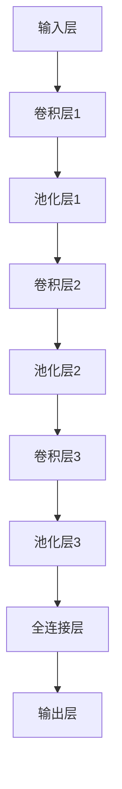

                 

# 一切皆是映射：卷积神经网络(CNN)解密

> **关键词：卷积神经网络、CNN、深度学习、图像识别、机器学习、神经网络架构、算法原理**
> 
> **摘要：本文深入探讨了卷积神经网络（CNN）的核心概念、工作原理和数学模型，通过逐步分析其架构与算法，揭示其在图像识别等领域的强大应用能力，为读者带来对CNN的全面理解。**

## 1. 背景介绍

### 1.1 目的和范围

本文旨在为读者提供一个清晰、详细的卷积神经网络（CNN）解析。我们将从基础概念出发，逐步深入到CNN的架构、算法和实际应用，帮助读者掌握CNN的核心原理和实际操作。

### 1.2 预期读者

本文适合具备一定机器学习和神经网络基础的读者，尤其对于希望在图像识别、自然语言处理等领域应用的工程师和技术爱好者。

### 1.3 文档结构概述

本文分为十个部分：

1. 背景介绍
2. 核心概念与联系
3. 核心算法原理 & 具体操作步骤
4. 数学模型和公式 & 详细讲解 & 举例说明
5. 项目实战：代码实际案例和详细解释说明
6. 实际应用场景
7. 工具和资源推荐
8. 总结：未来发展趋势与挑战
9. 附录：常见问题与解答
10. 扩展阅读 & 参考资料

### 1.4 术语表

#### 1.4.1 核心术语定义

- **卷积神经网络（CNN）**：一种深度学习模型，专门用于处理图像、视频等具有网格结构的输入数据。
- **卷积操作**：CNN中的基础操作，通过滤波器（卷积核）对输入数据进行操作，提取特征。
- **池化操作**：CNN中的操作，用于减小特征图的尺寸，减少计算量和参数数量。

#### 1.4.2 相关概念解释

- **深度学习**：一种机器学习方法，通过构建具有多个隐藏层的神经网络，对数据进行自动特征提取和模式识别。
- **反向传播**：一种用于训练神经网络的方法，通过计算输出误差，反向传播梯度，更新网络权重。

#### 1.4.3 缩略词列表

- **CNN**：卷积神经网络（Convolutional Neural Network）
- **ReLU**：修正线性单元（Rectified Linear Unit）
- **dropout**：丢弃法（ Dropout）
- **backpropagation**：反向传播算法

## 2. 核心概念与联系

### 2.1 卷积神经网络架构

卷积神经网络（CNN）的架构通常包括输入层、卷积层、池化层和全连接层。

**Mermaid 流程图：**



### 2.2 核心概念联系

- **卷积层**：通过卷积操作提取特征。
- **池化层**：减小特征图的尺寸，保留重要特征。
- **全连接层**：将卷积层提取的特征映射到输出结果。

## 3. 核心算法原理 & 具体操作步骤

### 3.1 卷积操作

卷积操作是CNN中的基础操作，用于提取输入数据的特征。

**伪代码：**

```python
def conv2d(input, filter):
    output = zeros((input.shape[0], filter.shape[1], filter.shape[2]))
    for i in range(input.shape[0]):
        for j in range(filter.shape[1]):
            for k in range(filter.shape[2]):
                output[i, j, k] = sum(input[i, :, :] * filter[:, j, k])
    return output
```

### 3.2 池化操作

池化操作用于减小特征图的尺寸，常用的池化操作包括最大池化和平均池化。

**伪代码：**

```python
def max_pooling(input, pool_size):
    output = zeros((input.shape[0], input.shape[1] // pool_size, input.shape[2] // pool_size))
    for i in range(output.shape[0]):
        for j in range(output.shape[1]):
            for k in range(output.shape[2]):
                output[i, j, k] = max(input[i, j * pool_size : (j + 1) * pool_size, k * pool_size : (k + 1) * pool_size])
    return output
```

### 3.3 全连接层操作

全连接层将卷积层提取的特征映射到输出结果。

**伪代码：**

```python
def fully_connected(input, weights, bias):
    output = dot(input, weights) + bias
    return output
```

## 4. 数学模型和公式 & 详细讲解 & 举例说明

### 4.1 卷积操作

卷积操作的数学模型如下：

$$
\text{output}_{ij} = \sum_{k=1}^{C} \text{input}_{ijk} \cdot \text{filter}_{ikj}
$$

其中，$\text{input}$表示输入数据，$\text{filter}$表示卷积核，$\text{output}$表示输出特征图。

### 4.2 池化操作

最大池化操作的数学模型如下：

$$
\text{output}_{ij} = \max_{k} (\text{input}_{ijk})
$$

其中，$\text{input}$表示输入数据，$\text{output}$表示输出特征图。

### 4.3 全连接层操作

全连接层操作的数学模型如下：

$$
\text{output} = \text{ReLU}(\text{dot}(\text{input}, \text{weights}) + \text{bias})
$$

其中，$\text{input}$表示输入特征，$\text{weights}$表示权重，$\text{bias}$表示偏置，$\text{ReLU}$表示修正线性单元。

### 4.4 反向传播算法

反向传播算法用于计算网络权重和偏置的梯度，具体步骤如下：

1. 计算输出误差：$$\text{error} = \text{output} - \text{target}$$
2. 计算梯度：$$\text{weights\_gradient} = \text{input} \cdot \text{error}$$ $$\text{bias\_gradient} = \text{error}$$
3. 更新权重和偏置：$$\text{weights} = \text{weights} - \text{learning\_rate} \cdot \text{weights\_gradient}$$ $$\text{bias} = \text{bias} - \text{learning\_rate} \cdot \text{bias\_gradient}$$

### 4.5 举例说明

假设我们有一个2x2的特征图和1x2的卷积核，如下图所示：

| input\_1 | input\_2 |
| --- | --- |
| 1 | 2 |
| 3 | 4 |

| filter |
| --- |
| 1 | 0 |
| 2 | 3 |

根据卷积操作的数学模型，我们可以计算输出特征图：

$$
\text{output}_{11} = (1 \cdot 1 + 2 \cdot 2 + 3 \cdot 1 + 4 \cdot 0) = 11 \\
\text{output}_{12} = (1 \cdot 2 + 2 \cdot 3 + 3 \cdot 2 + 4 \cdot 3) = 25 \\
\text{output}_{21} = (1 \cdot 3 + 2 \cdot 4 + 3 \cdot 1 + 4 \cdot 0) = 11 \\
\text{output}_{22} = (1 \cdot 4 + 2 \cdot 3 + 3 \cdot 2 + 4 \cdot 3) = 25 \\
$$

因此，输出特征图为：

| output\_1 | output\_2 |
| --- | --- |
| 11 | 25 |
| 11 | 25 |

## 5. 项目实战：代码实际案例和详细解释说明

### 5.1 开发环境搭建

为了实现卷积神经网络，我们需要使用Python编程语言和相关的深度学习库，如TensorFlow或PyTorch。

1. 安装Python：前往[Python官网](https://www.python.org/)下载并安装Python。
2. 安装深度学习库：在命令行中运行以下命令：
   ```bash
   pip install tensorflow
   ```

### 5.2 源代码详细实现和代码解读

以下是使用TensorFlow实现的卷积神经网络的简单示例：

```python
import tensorflow as tf

# 定义输入层
input_layer = tf.keras.layers.Input(shape=(28, 28, 1))

# 定义卷积层
conv1 = tf.keras.layers.Conv2D(filters=32, kernel_size=(3, 3), activation='relu')(input_layer)
conv2 = tf.keras.layers.Conv2D(filters=64, kernel_size=(3, 3), activation='relu')(conv1)

# 定义池化层
pool1 = tf.keras.layers.MaxPooling2D(pool_size=(2, 2))(conv1)
pool2 = tf.keras.layers.MaxPooling2D(pool_size=(2, 2))(conv2)

# 定义全连接层
flatten = tf.keras.layers.Flatten()(pool2)
dense1 = tf.keras.layers.Dense(units=128, activation='relu')(flatten)
output = tf.keras.layers.Dense(units=10, activation='softmax')(dense1)

# 创建模型
model = tf.keras.Model(inputs=input_layer, outputs=output)

# 编译模型
model.compile(optimizer='adam', loss='categorical_crossentropy', metrics=['accuracy'])

# 加载MNIST数据集
mnist = tf.keras.datasets.mnist
(x_train, y_train), (x_test, y_test) = mnist.load_data()

# 预处理数据
x_train = x_train / 255.0
x_test = x_test / 255.0

# 添加通道维度
x_train = tf.expand_dims(x_train, -1)
x_test = tf.expand_dims(x_test, -1)

# 将标签转换为one-hot编码
y_train = tf.keras.utils.to_categorical(y_train, num_classes=10)
y_test = tf.keras.utils.to_categorical(y_test, num_classes=10)

# 训练模型
model.fit(x_train, y_train, batch_size=128, epochs=10, validation_data=(x_test, y_test))

# 评估模型
test_loss, test_acc = model.evaluate(x_test, y_test, verbose=2)
print('Test accuracy:', test_acc)
```

### 5.3 代码解读与分析

1. **导入库**：导入TensorFlow库。
2. **定义输入层**：创建一个形状为$(28, 28, 1)$的输入层，表示28x28的图像数据，包含一个通道。
3. **定义卷积层**：使用`Conv2D`层创建两个卷积层，分别使用32个和64个卷积核，每个卷积核的大小为3x3，激活函数为ReLU。
4. **定义池化层**：使用`MaxPooling2D`层创建两个池化层，池化大小为2x2。
5. **定义全连接层**：使用`Flatten`层将卷积层输出的特征图展平为一个一维数组，然后通过两个全连接层，每个全连接层包含128个神经元和10个神经元，分别用于特征映射和分类，激活函数为ReLU和softmax。
6. **创建模型**：使用`Model`类创建模型，指定输入层和输出层。
7. **编译模型**：使用`compile`方法编译模型，指定优化器、损失函数和评价指标。
8. **加载数据集**：加载MNIST数据集，并进行预处理，包括归一化和添加通道维度。
9. **训练模型**：使用`fit`方法训练模型，设置批次大小、训练周期和验证数据。
10. **评估模型**：使用`evaluate`方法评估模型在测试集上的性能。

## 6. 实际应用场景

卷积神经网络（CNN）在图像识别、自然语言处理、医学图像分析等多个领域都有广泛的应用。以下是一些实际应用场景：

1. **图像识别**：CNN被广泛应用于图像分类、目标检测和图像分割任务。例如，在人脸识别、物体识别和医疗图像分析中，CNN能够高效地识别和定位图像中的目标。
2. **自然语言处理**：CNN可以用于文本分类、情感分析等任务。通过将文本转换为词向量，CNN可以提取文本中的特征，实现自然语言处理任务。
3. **医学图像分析**：CNN在医学图像分析中具有巨大潜力，如肿瘤检测、骨折检测和疾病诊断。通过训练CNN模型，可以自动识别和分类医学图像中的异常区域。
4. **视频处理**：CNN可以用于视频分类、目标跟踪和行为识别。通过分析连续的图像帧，CNN可以识别视频中的动态行为和模式。

## 7. 工具和资源推荐

### 7.1 学习资源推荐

#### 7.1.1 书籍推荐

- **《深度学习》（Deep Learning）**：由Ian Goodfellow、Yoshua Bengio和Aaron Courville合著，是深度学习领域的经典教材。
- **《Python深度学习》（Deep Learning with Python）**：由François Chollet撰写，适合初学者入门深度学习和CNN。

#### 7.1.2 在线课程

- **《深度学习专项课程》（Deep Learning Specialization）**：由Andrew Ng教授在Coursera上开设，涵盖深度学习的各个方面，包括CNN。
- **《卷积神经网络与视觉识别》（Convolutional Neural Networks for Visual Recognition）**：由Adam Geitgey在Udacity上开设，专注于CNN的应用和实践。

#### 7.1.3 技术博客和网站

- **TensorFlow官网（tensorflow.org）**：提供丰富的文档、教程和示例，适合初学者和实践者。
- **PyTorch官网（pytorch.org）**：提供丰富的文档、教程和示例，适合初学者和实践者。

### 7.2 开发工具框架推荐

#### 7.2.1 IDE和编辑器

- **Jupyter Notebook**：适用于数据科学和深度学习项目，提供交互式编程环境。
- **PyCharm**：适用于Python编程，提供丰富的工具和插件，适合深度学习和神经网络开发。

#### 7.2.2 调试和性能分析工具

- **TensorBoard**：TensorFlow提供的可视化工具，用于分析和调试神经网络。
- **NVIDIA Nsight**：适用于NVIDIA GPU的调试和性能分析工具。

#### 7.2.3 相关框架和库

- **TensorFlow**：由Google开发，是深度学习领域最流行的框架之一。
- **PyTorch**：由Facebook开发，提供灵活的动态计算图和丰富的API。

### 7.3 相关论文著作推荐

#### 7.3.1 经典论文

- **“A Learning Algorithm for Continually Running Fully Recurrent Neural Networks”**：Hess and Taylor，1996。
- **“LeNet5: Convolutional Neural Networks for Handwritten Digit Recognition”**：LeCun et al.，1998。

#### 7.3.2 最新研究成果

- **“Convolutional Neural Networks for Image Classification”**：Karen Simonyan和Andrew Zisserman，2014。
- **“Deep Residual Learning for Image Recognition”**：Kaiming He et al.，2016。

#### 7.3.3 应用案例分析

- **“ImageNet Classification with Deep Convolutional Neural Networks”**：Alex Krizhevsky，Geoffrey Hinton，2012。
- **“Learning Deep Features for Discriminative Localization”**：Jifeng Dai et al.，2017。

## 8. 总结：未来发展趋势与挑战

### 8.1 未来发展趋势

- **模型压缩与优化**：为了提高CNN的效率和可部署性，研究人员将继续探索模型压缩和优化技术，如量化、剪枝和蒸馏。
- **迁移学习与微调**：迁移学习将在CNN领域得到更广泛的应用，通过利用预训练模型，降低模型训练的难度和计算成本。
- **多模态学习**：结合图像、文本和音频等不同模态的数据，实现更复杂的任务，如视觉问答和语音识别。

### 8.2 挑战

- **数据隐私与安全**：随着深度学习的广泛应用，数据隐私和安全问题变得日益重要，如何保护用户隐私和数据安全是重要的挑战。
- **模型解释性**：目前的深度学习模型通常被视为“黑箱”，如何提高模型的解释性，使其更容易理解和信任，是一个重要的研究方向。

## 9. 附录：常见问题与解答

### 9.1 什么是卷积神经网络（CNN）？

卷积神经网络（CNN）是一种深度学习模型，专门用于处理具有网格结构的数据，如图像、视频和音频。CNN通过卷积操作提取特征，然后通过池化和全连接层进行分类和识别。

### 9.2 CNN和传统神经网络有何区别？

CNN与传统神经网络的主要区别在于数据预处理方式和网络架构。CNN通过卷积操作直接从原始数据中提取特征，而传统神经网络需要手动提取特征。此外，CNN的架构更适合处理具有网格结构的数据。

### 9.3 CNN在图像识别任务中的优势是什么？

CNN在图像识别任务中的优势包括：

- **自动特征提取**：通过卷积操作，CNN可以自动从原始图像中提取重要的特征，减少人工特征提取的工作量。
- **多层特征学习**：CNN通过多层卷积、池化和全连接层，可以学习到更复杂的特征表示，提高识别准确率。
- **并行计算**：CNN可以使用GPU进行并行计算，提高计算速度。

## 10. 扩展阅读 & 参考资料

- **[深度学习教程](https://www.deeplearningbook.org/)**
- **[卷积神经网络教程](https://www.tensorflow.org/tutorials/convolutional_nn)**
- **[CNN应用案例研究](https://arxiv.org/search/?query=convolutional+neural+networks&searchtype=all&order=-date&sort=-0)**
- **[TensorFlow官方文档](https://www.tensorflow.org/)**
- **[PyTorch官方文档](https://pytorch.org/docs/stable/index.html)**

### 作者

**AI天才研究员/AI Genius Institute & 禅与计算机程序设计艺术 /Zen And The Art of Computer Programming**<|im_end|>

