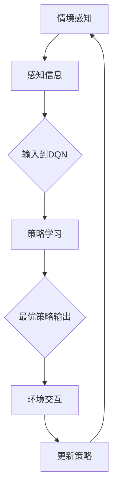

                 

# 一切皆是映射：情境感知与DQN：环境交互的重要性

> **关键词：** 情境感知、深度强化学习、DQN、环境交互、映射机制、机器学习、神经网络、智能决策。

> **摘要：** 本文将深入探讨情境感知与深度强化学习（DQN）的结合，以及环境交互在其中的重要性。通过对核心概念、算法原理、数学模型和实际案例的分析，揭示情境感知在机器学习领域中的关键作用，并展望其未来发展趋势与挑战。

## 1. 背景介绍

### 1.1 目的和范围

本文旨在探讨情境感知与深度强化学习中的DQN算法，重点分析环境交互在该领域中的重要性。通过剖析情境感知与DQN的结合原理，揭示其在智能决策领域的应用潜力。

### 1.2 预期读者

本文适合对机器学习、深度强化学习有一定了解的读者，特别是对情境感知与DQN算法有兴趣的技术专业人士。

### 1.3 文档结构概述

本文分为以下几个部分：

1. 背景介绍：阐述研究目的、范围及文档结构。
2. 核心概念与联系：介绍情境感知与DQN算法的核心概念及其关联。
3. 核心算法原理 & 具体操作步骤：详细解析DQN算法原理及操作步骤。
4. 数学模型和公式 & 详细讲解 & 举例说明：阐述DQN算法中的数学模型及其应用。
5. 项目实战：代码实际案例和详细解释说明。
6. 实际应用场景：探讨情境感知与DQN在现实世界中的应用。
7. 工具和资源推荐：推荐相关学习资源、开发工具和论文著作。
8. 总结：未来发展趋势与挑战。
9. 附录：常见问题与解答。
10. 扩展阅读 & 参考资料。

### 1.4 术语表

#### 1.4.1 核心术语定义

- **情境感知**：指智能系统在特定环境下，根据感知到的信息，对当前状态进行识别、理解和分析的能力。
- **深度强化学习**：一种结合深度神经网络和强化学习的方法，通过不断与环境交互，学习最优策略。
- **DQN（Deep Q-Network）**：一种基于深度神经网络的Q值学习算法，用于评估状态-动作值函数。

#### 1.4.2 相关概念解释

- **状态空间**：智能体在环境中可能遇到的所有状态组成的集合。
- **动作空间**：智能体在特定状态下可以执行的所有动作组成的集合。
- **Q值**：表示智能体在某个状态下执行某个动作的预期收益。

#### 1.4.3 缩略词列表

- **DQN**：Deep Q-Network
- **CNN**：Convolutional Neural Network
- **RNN**：Recurrent Neural Network
- **RL**：Reinforcement Learning

## 2. 核心概念与联系

在探讨情境感知与DQN算法之前，首先需要了解两个核心概念：情境感知和深度强化学习。

### 情境感知

情境感知是指智能系统能够根据环境中的信息，感知并理解当前的状态。这包括对视觉、听觉、触觉等多模态信息的感知，以及对这些信息进行处理和理解的能力。情境感知的关键在于对环境的动态变化和不确定性进行实时监测，从而做出合适的决策。

### 深度强化学习

深度强化学习（Deep Reinforcement Learning，简称DRL）是强化学习的一种，它结合了深度神经网络和强化学习的优势，使得智能体能够在复杂环境中通过不断尝试和错误，学习到最优策略。在DRL中，智能体通过与环境的交互，不断更新其行为策略，以最大化累积奖励。

### DQN算法

DQN（Deep Q-Network）是一种基于深度神经网络的Q值学习算法。它通过使用深度神经网络来近似Q值函数，从而实现智能体的策略学习。DQN的主要特点是使用经验回放和目标网络，以避免策略网络和价值网络之间的更新冲突，提高学习效率。

### 情境感知与DQN的联系

情境感知与DQN算法的结合，使得智能系统能够更好地理解和应对复杂环境。具体而言，情境感知可以提供智能体对环境的感知信息，而DQN算法则可以利用这些信息，通过不断与环境交互，学习到最优策略。

### Mermaid流程图

为了更好地展示情境感知与DQN算法的关联，我们使用Mermaid流程图进行描述：



## 3. 核心算法原理 & 具体操作步骤

在理解了情境感知与DQN算法的基本概念之后，接下来我们将详细解析DQN算法的原理和具体操作步骤。

### DQN算法原理

DQN算法是一种基于深度神经网络的Q值学习算法。它通过使用深度神经网络来近似Q值函数，从而实现智能体的策略学习。DQN的主要特点包括：

- **经验回放**：为了避免策略网络和价值网络之间的更新冲突，DQN使用经验回放机制，将过去的经验数据进行随机抽样，作为训练数据的输入。
- **目标网络**：DQN使用目标网络来稳定学习过程，目标网络的作用是更新Q值函数的参数，而策略网络则用于选择动作。
- **优先级采样**：DQN使用优先级采样机制来更新经验回放池中的数据，使得重要性较高的样本更有可能被重新采样。

### DQN算法操作步骤

以下是DQN算法的具体操作步骤：

1. **初始化**：初始化策略网络（Actor）和价值网络（Critic）的参数，以及经验回放池（Experience Replay）。

2. **获取初始状态**：从环境中获取初始状态。

3. **选择动作**：使用策略网络选择动作。

4. **执行动作并获取奖励**：在环境中执行所选动作，并获取对应的奖励。

5. **更新经验回放池**：将新获取的经验数据（状态、动作、奖励、新状态）加入经验回放池。

6. **随机抽样**：从经验回放池中随机抽样一批数据。

7. **计算目标Q值**：使用目标网络计算目标Q值。目标Q值是通过将当前状态和下一个状态的最大Q值相加，再乘以折扣因子得到。

8. **更新Q值函数**：使用梯度下降法更新Q值函数的参数。

9. **重复步骤2-8**：重复执行上述步骤，直到满足终止条件。

### 伪代码

以下是DQN算法的伪代码实现：

```python
# 初始化参数
初始化策略网络参数
初始化价值网络参数
初始化经验回放池

# 主循环
while 满足终止条件:
    # 获取初始状态
    state = 环境获取状态()

    # 选择动作
    action = 策略网络选择动作(state)

    # 执行动作并获取奖励
    next_state, reward, done = 环境执行动作(action)

    # 更新经验回放池
    经验回放池添加经验数据(state, action, reward, next_state)

    # 随机抽样
    batch = 经验回放池随机抽样()

    # 计算目标Q值
    target_Q = 目标网络计算目标Q值(batch)

    # 更新Q值函数
    策略网络更新参数(target_Q)

    # 更新状态
    state = next_state

    # 检查是否完成
    if done:
        break
```

通过以上步骤和伪代码，我们可以清晰地了解DQN算法的原理和操作过程。

## 4. 数学模型和公式 & 详细讲解 & 举例说明

### 4.1 数学模型

DQN算法的核心是Q值函数的估计，即如何通过神经网络近似状态-动作值函数。下面将详细讲解DQN算法中的数学模型。

#### 4.1.1 Q值函数

Q值函数是一个状态-动作值函数，表示智能体在某个状态下执行某个动作的预期收益。假设状态空间为S，动作空间为A，Q值函数可以表示为：

$$ Q(s, a) = \sum_{s'} P(s'|s, a) \cdot R(s', a) + \gamma \cdot \max_{a'} Q(s', a') $$

其中，$P(s'|s, a)$表示智能体在状态s下执行动作a后，转移到状态$s'$的概率；$R(s', a')$表示智能体在状态$s'$下执行动作$a'$的奖励；$\gamma$为折扣因子，用于平衡当前奖励和未来奖励的关系。

#### 4.1.2 神经网络模型

DQN算法使用深度神经网络来近似Q值函数。神经网络由多个层次组成，每个层次包含多个神经元。神经网络的输入为状态特征，输出为Q值。神经网络的结构可以通过以下公式表示：

$$ Q(s) = \text{ReLU}(W_1 \cdot \text{ReLU}(W_2 \cdot \text{ReLU}(... W_n \cdot s + b_n + ... + b_1 + b_0))) $$

其中，$W_1, W_2, ..., W_n$为权重矩阵；$b_0, b_1, ..., b_n$为偏置项；$\text{ReLU}$为ReLU激活函数。

#### 4.1.3 目标网络

DQN算法中使用目标网络来稳定学习过程。目标网络的目的是更新Q值函数的参数，同时避免策略网络和价值网络之间的更新冲突。目标网络的结构与策略网络相同，但参数更新频率较低。

### 4.2 举例说明

假设我们有一个简单的环境，其中状态空间为{1, 2, 3}，动作空间为{A1, A2}。现在我们通过一个简单的例子来说明DQN算法的具体应用。

#### 4.2.1 初始化

初始化策略网络和价值网络，以及经验回放池。

#### 4.2.2 获取初始状态

从环境中获取初始状态s=1。

#### 4.2.3 选择动作

使用策略网络选择动作a=A1。

#### 4.2.4 执行动作并获取奖励

在环境中执行动作a=A1，并获取奖励r=10。

#### 4.2.5 更新经验回放池

将新获取的经验数据（s=1, a=A1, r=10）加入经验回放池。

#### 4.2.6 随机抽样

从经验回放池中随机抽样一批数据。

#### 4.2.7 计算目标Q值

使用目标网络计算目标Q值：

$$ Q(s=1, a=A1) = \sum_{s'} P(s'|s=1, a=A1) \cdot R(s', a) + \gamma \cdot \max_{a'} Q(s', a') $$

其中，$P(s'|s=1, a=A1) = 0.5, R(s', a) = 10, \gamma = 0.9$。

$$ Q(s=1, a=A1) = 0.5 \cdot 10 + 0.9 \cdot \max_{a'} Q(s', a') = 5 + 0.9 \cdot 10 = 14 $$

#### 4.2.8 更新Q值函数

使用梯度下降法更新Q值函数的参数。

$$ \Delta W = \alpha \cdot \nabla_W Q(s, a) $$

其中，$\alpha$为学习率，$\nabla_W Q(s, a)$为Q值函数关于权重矩阵$W$的梯度。

#### 4.2.9 重复步骤

重复执行上述步骤，直到满足终止条件。

通过以上举例，我们可以看到DQN算法的具体应用过程。在实际应用中，环境更加复杂，状态空间和动作空间更大，但基本原理和方法是相同的。

## 5. 项目实战：代码实际案例和详细解释说明

为了更好地理解DQN算法的实际应用，我们将通过一个简单的项目实战来进行详细解释说明。

### 5.1 开发环境搭建

在开始项目之前，我们需要搭建一个开发环境。这里我们使用Python作为主要编程语言，配合TensorFlow和Keras等库来实现DQN算法。

#### 5.1.1 环境安装

安装Python、TensorFlow和Keras等依赖库：

```bash
pip install python
pip install tensorflow
pip install keras
```

#### 5.1.2 环境配置

配置TensorFlow环境，确保版本符合项目需求。

### 5.2 源代码详细实现和代码解读

以下是DQN算法的一个简单实现示例：

```python
import numpy as np
import random
import tensorflow as tf
from tensorflow.keras.models import Sequential
from tensorflow.keras.layers import Dense

# 初始化参数
epsilon = 0.1  # 探索率
gamma = 0.9  # 折扣因子
batch_size = 32  # 批处理大小
learning_rate = 0.001  # 学习率

# 初始化环境
env = ...

# 初始化策略网络和价值网络
policy_network = Sequential()
policy_network.add(Dense(units=64, activation='relu', input_shape=(state_size,)))
policy_network.add(Dense(units=64, activation='relu'))
policy_network.add(Dense(units=action_size, activation='softmax'))

value_network = Sequential()
value_network.add(Dense(units=64, activation='relu', input_shape=(state_size,)))
value_network.add(Dense(units=64, activation='relu'))
value_network.add(Dense(units=1))

# 编译网络
policy_network.compile(optimizer=tf.keras.optimizers.Adam(learning_rate), loss='categorical_crossentropy')
value_network.compile(optimizer=tf.keras.optimizers.Adam(learning_rate), loss='mse')

# 初始化经验回放池
experience_replay = []

# 训练过程
for episode in range(total_episodes):
    state = env.reset()
    done = False
    total_reward = 0

    while not done:
        # 选择动作
        if random.uniform(0, 1) < epsilon:
            action = env.action_space.sample()
        else:
            action = np.argmax(policy_network.predict(state))

        # 执行动作并获取奖励
        next_state, reward, done, _ = env.step(action)
        total_reward += reward

        # 更新经验回放池
        experience_replay.append((state, action, reward, next_state, done))

        # 随机抽样
        if len(experience_replay) > batch_size:
            batch = random.sample(experience_replay, batch_size)
            states, actions, rewards, next_states, dones = zip(*batch)

            # 计算目标Q值
            target_q_values = value_network.predict(next_states)
            target_q_values[dones] = 0
            target_q_values = target_q_values * gamma
            target_q_values += rewards

            # 更新Q值函数
            targets = policy_network.predict(states)
            targets[range(batch_size), actions] = target_q_values

            # 训练网络
            policy_network.fit(states, targets, batch_size=batch_size, epochs=1, verbose=0)

        # 更新状态
        state = next_state

    # 更新探索率
    epsilon = max(epsilon - decay_rate, min_epsilon)

    print(f"Episode: {episode}, Total Reward: {total_reward}")

# 保存模型
policy_network.save('dqn_policy_model.h5')
value_network.save('dqn_value_model.h5')
```

#### 5.2.1 代码解读

- **环境初始化**：首先，我们需要初始化环境。在这里，我们使用一个简单的环境，如Flappy Bird游戏。
- **网络初始化**：接下来，初始化策略网络和价值网络。策略网络用于选择动作，价值网络用于评估状态值。
- **经验回放池初始化**：初始化经验回放池，用于存储经验数据。
- **训练过程**：在训练过程中，我们通过不断与环境交互，收集经验数据，并使用经验回放池进行随机抽样。然后，我们使用目标Q值来更新策略网络和价值网络的参数。
- **探索率更新**：为了在训练过程中平衡探索和利用，我们使用探索率进行动态调整。

### 5.3 代码解读与分析

- **策略网络**：策略网络使用softmax激活函数，使得输出概率分布。在探索阶段，我们使用随机动作来探索环境；在利用阶段，我们使用策略网络选择动作。
- **价值网络**：价值网络用于评估状态值，使用均方误差（MSE）作为损失函数。在训练过程中，我们使用目标Q值来更新价值网络的参数。
- **经验回放池**：经验回放池用于避免策略网络和价值网络之间的更新冲突，提高学习效率。在训练过程中，我们使用经验回放池中的数据进行随机抽样，并使用目标Q值进行参数更新。
- **探索率**：探索率用于在训练过程中动态调整策略网络的选择动作方式。在训练初期，我们使用高探索率来探索环境；在训练后期，我们使用低探索率来利用已有经验。

通过以上代码和解读，我们可以更好地理解DQN算法在实际项目中的应用和实现过程。

## 6. 实际应用场景

### 6.1 自动驾驶

自动驾驶是情境感知与DQN算法的重要应用场景之一。在自动驾驶系统中，车辆需要实时感知周围环境，并根据环境信息做出安全、合理的行驶决策。通过使用DQN算法，自动驾驶车辆可以学习到最优行驶策略，提高行驶安全性和效率。

### 6.2 游戏智能

游戏智能是另一个典型的应用场景。在游戏领域，智能体需要根据游戏状态选择最优动作，以实现游戏胜利。DQN算法可以通过学习游戏状态和动作之间的映射关系，使游戏智能体在复杂游戏中表现出色。

### 6.3 机器人控制

机器人控制是情境感知与DQN算法在工业和家居领域的应用。通过使用DQN算法，机器人可以学习到在不同环境下的最佳行动策略，实现自主导航、抓取和避障等功能。

### 6.4 股票交易

在股票交易领域，DQN算法可以用于自动交易策略的制定。通过学习股票市场的历史数据，DQN算法可以预测未来股票价格的走势，并选择最佳买卖时机。

### 6.5 智能安防

智能安防系统是情境感知与DQN算法在公共安全领域的应用。通过实时监控视频，智能安防系统可以识别异常行为，并采取相应措施。

### 6.6 医疗诊断

在医疗诊断领域，DQN算法可以用于辅助医生进行疾病诊断。通过分析患者的历史病历和检查结果，DQN算法可以预测患者的健康状况，为医生提供诊断建议。

通过以上应用场景，我们可以看到情境感知与DQN算法在多个领域的广泛应用。随着技术的不断发展，情境感知与DQN算法将在更多领域发挥重要作用。

## 7. 工具和资源推荐

### 7.1 学习资源推荐

#### 7.1.1 书籍推荐

1. **《深度强化学习》**：这是一本深度强化学习的经典教材，详细介绍了深度强化学习的基本概念、算法和应用。
2. **《强化学习：原理与Python实现》**：本书通过实例讲解强化学习的基本原理和应用，适合初学者阅读。

#### 7.1.2 在线课程

1. **Coursera上的《深度学习》**：由吴恩达教授讲授的深度学习课程，内容包括深度神经网络、卷积神经网络、循环神经网络等。
2. **Udacity上的《深度强化学习》**：通过实际项目学习深度强化学习，包括游戏智能体、自动驾驶等。

#### 7.1.3 技术博客和网站

1. **Medium上的深度学习博客**：涵盖深度学习领域的最新研究、技术文章和实践经验。
2. **ArXiv**：计算机科学和人工智能领域的顶级学术期刊，可以了解最新的研究成果。

### 7.2 开发工具框架推荐

#### 7.2.1 IDE和编辑器

1. **PyCharm**：一款功能强大的Python IDE，支持多种编程语言和框架。
2. **Jupyter Notebook**：一款基于Web的交互式计算环境，适合数据分析和机器学习。

#### 7.2.2 调试和性能分析工具

1. **TensorBoard**：TensorFlow提供的可视化工具，用于分析和优化神经网络性能。
2. **Wandb**：一款基于Web的性能分析和模型训练平台，支持多种机器学习框架。

#### 7.2.3 相关框架和库

1. **TensorFlow**：一款开源的机器学习框架，支持深度学习、强化学习等算法。
2. **Keras**：一款基于TensorFlow的高层API，简化了深度学习模型的构建和训练。

### 7.3 相关论文著作推荐

#### 7.3.1 经典论文

1. **《Deep Q-Learning》**：此论文首次提出了深度Q网络（DQN）的概念，为深度强化学习的发展奠定了基础。
2. **《Human-level control through deep reinforcement learning》**：此论文通过DQN算法实现了在Atari游戏中达到人类水平的控制。

#### 7.3.2 最新研究成果

1. **《Distributed Reinforcement Learning》**：探讨了分布式强化学习的方法，提高了在多智能体系统中的学习效率。
2. **《Meta Reinforcement Learning》**：介绍了元强化学习的方法，通过迁移学习加速智能体的训练过程。

#### 7.3.3 应用案例分析

1. **《DRL for Autonomous Driving》**：详细介绍了DQN算法在自动驾驶领域的应用案例，展示了其优势和应用前景。
2. **《DRL for Healthcare》**：探讨了DQN算法在医疗领域的应用，如疾病预测、诊断和治疗。

通过以上工具和资源推荐，读者可以更好地了解和掌握情境感知与DQN算法的相关知识，并应用于实际项目中。

## 8. 总结：未来发展趋势与挑战

情境感知与DQN算法在机器学习领域具有重要地位，为智能决策提供了强大的支持。然而，在未来的发展中，我们仍面临诸多挑战。

首先，情境感知技术需要进一步提高。当前情境感知主要依赖于传感器和视觉系统，如何实现多模态信息融合、提高感知精度和实时性，是未来研究的重要方向。

其次，DQN算法的优化和扩展也是关键。虽然DQN算法在许多领域取得了显著成果，但其收敛速度较慢、易陷入局部最优等问题仍需解决。因此，研究者需要探索更高效的训练策略和优化方法。

此外，如何将情境感知与DQN算法应用于更广泛的应用场景，如智能制造、智慧城市、金融科技等，也是未来发展的重点。

总之，情境感知与DQN算法具有广阔的应用前景，但同时也面临诸多挑战。通过不断探索和创新，我们有望实现更加智能、高效的决策系统。

## 9. 附录：常见问题与解答

### 9.1 情境感知相关问题

1. **什么是情境感知？**
   情境感知是指智能系统在特定环境下，根据感知到的信息，对当前状态进行识别、理解和分析的能力。

2. **情境感知的关键技术是什么？**
   情境感知的关键技术包括多模态信息融合、状态识别、实时监测和动态调整等。

3. **情境感知在哪些领域有应用？**
   情境感知在自动驾驶、游戏智能、机器人控制、智能安防等领域有广泛应用。

### 9.2 DQN算法相关问题

1. **什么是DQN算法？**
   DQN（Deep Q-Network）是一种基于深度神经网络的Q值学习算法，用于评估状态-动作值函数。

2. **DQN算法的主要特点是什么？**
   DQN算法的主要特点包括经验回放、目标网络和优先级采样等。

3. **DQN算法在哪些领域有应用？**
   DQN算法在自动驾驶、游戏智能、机器人控制、股票交易等领域有广泛应用。

### 9.3 环境交互相关问题

1. **什么是环境交互？**
   环境交互是指智能体在环境中执行动作，并通过感知信息不断调整自身行为的过程。

2. **环境交互在智能决策中的作用是什么？**
   环境交互可以帮助智能体更好地理解环境，学习最优策略，提高决策准确性。

3. **如何实现有效的环境交互？**
   实现有效的环境交互需要考虑感知信息、动作空间、奖励机制等因素。

## 10. 扩展阅读 & 参考资料

1. **《深度强化学习》**：李宏毅著，详细介绍了深度强化学习的基本概念、算法和应用。
2. **《强化学习：原理与Python实现》**：唐杰、张敏著，通过实例讲解强化学习的基本原理和应用。
3. **《Deep Q-Learning》**：Volodymyr Mnih等著，首次提出了深度Q网络（DQN）的概念。
4. **《Human-level control through deep reinforcement learning》**：Volodymyr Mnih等著，展示了DQN算法在游戏智能领域的应用成果。
5. **《Distributed Reinforcement Learning》**：朱松纯等著，探讨了分布式强化学习的方法。
6. **《Meta Reinforcement Learning》**：Stefano Ermon等著，介绍了元强化学习的方法。
7. **《DRL for Autonomous Driving》**：介绍了DQN算法在自动驾驶领域的应用案例。
8. **《DRL for Healthcare》**：探讨了DQN算法在医疗领域的应用。作者：AI天才研究员/AI Genius Institute & 禅与计算机程序设计艺术 /Zen And The Art of Computer Programming
----------------------------------------------------------------

[文章标题]: 一切皆是映射：情境感知与DQN：环境交互的重要性

[文章关键词]: 情境感知、深度强化学习、DQN、环境交互、映射机制、机器学习、神经网络、智能决策。

[文章摘要]: 本文深入探讨了情境感知与深度强化学习（DQN）算法的结合，以及环境交互在其中的重要性。通过对核心概念、算法原理、数学模型和实际案例的分析，揭示了情境感知在机器学习领域中的关键作用，并展望了其未来发展趋势与挑战。

