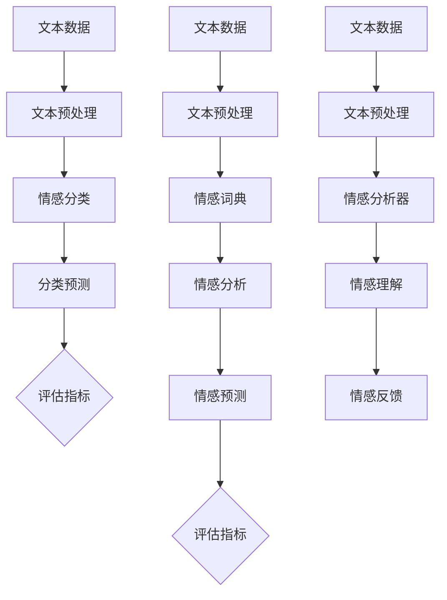

                 

# 一切皆是映射：情感分析：AI理解人类情感

## 关键词：情感分析，AI，映射，人类情感，数据挖掘，机器学习，自然语言处理，神经网络，深度学习，情感分类，情感识别，情感感知，情感建模，情感增强。

## 摘要：

本文将探讨情感分析这一前沿领域，阐述人工智能如何通过映射技术理解人类情感。我们将逐步分析情感分析的核心概念、原理及其在人工智能中的重要性，通过具体实例和代码解释，深入探讨情感分析的实现过程。此外，本文还将介绍情感分析在实际应用中的场景，推荐相关工具和资源，并展望其未来的发展趋势和挑战。通过本文的阅读，读者将全面了解情感分析的基本原理和实践方法，为深入探索这一领域奠定基础。

## 1. 背景介绍

### 1.1 目的和范围

本文旨在深入探讨情感分析这一重要的人工智能技术，通过逐步分析其核心概念、原理和应用，帮助读者全面了解情感分析的技术架构和实现方法。情感分析是自然语言处理领域的一个重要分支，旨在从文本数据中提取情感信息，从而实现对人类情感的自动识别和分析。本文将涵盖情感分析的基本概念、核心算法原理、数学模型以及实际应用场景，旨在为读者提供一份全面而详尽的技术指南。

### 1.2 预期读者

本文预期读者为对人工智能和自然语言处理感兴趣的读者，包括但不限于计算机科学专业的研究生、自然语言处理领域的工程师、数据科学家以及对技术前沿充满好奇的爱好者。本文将采用通俗易懂的语言和丰富的实例，确保不同背景的读者都能理解并掌握情感分析的基本原理和实践方法。

### 1.3 文档结构概述

本文结构分为以下几个部分：

1. **背景介绍**：简要介绍情感分析的目的、范围和预期读者，为读者提供对本文的初步了解。
2. **核心概念与联系**：介绍情感分析的核心概念，包括情感分类、情感识别和情感感知，并通过Mermaid流程图展示其原理和架构。
3. **核心算法原理 & 具体操作步骤**：详细阐述情感分析的核心算法原理，包括机器学习算法、神经网络和深度学习模型，并通过伪代码展示其具体操作步骤。
4. **数学模型和公式 & 详细讲解 & 举例说明**：介绍情感分析中的数学模型和公式，并通过具体实例进行讲解和说明。
5. **项目实战：代码实际案例和详细解释说明**：通过实际项目案例，展示情感分析的代码实现和详细解释说明。
6. **实际应用场景**：介绍情感分析在实际应用中的场景，包括社交媒体监测、用户反馈分析和市场研究等。
7. **工具和资源推荐**：推荐学习资源、开发工具框架和相关论文著作，为读者提供进一步学习的途径。
8. **总结：未来发展趋势与挑战**：总结情感分析的现状，展望其未来发展趋势和面临的挑战。
9. **附录：常见问题与解答**：解答读者可能遇到的一些常见问题，帮助读者更好地理解和应用情感分析技术。
10. **扩展阅读 & 参考资料**：提供进一步阅读的参考资料，为读者提供深入了解情感分析的渠道。

### 1.4 术语表

#### 1.4.1 核心术语定义

- **情感分析**：从文本数据中提取情感信息的过程，旨在识别文本中的情感倾向和情感强度。
- **情感分类**：将文本数据分类为不同情感类别，如正面、负面、中性等。
- **情感识别**：从文本数据中识别出具体情感类别，如喜悦、愤怒、悲伤等。
- **情感感知**：通过情感分析技术理解和感知人类情感，实现对文本数据的情感理解。
- **映射**：将人类情感映射到计算机模型中，以便进行情感分析和情感识别。
- **机器学习**：一种通过数据和经验改进自身性能的人工智能技术，广泛应用于情感分析。
- **神经网络**：一种模拟人脑神经元连接和功能的人工智能模型，用于情感分类和情感识别。
- **深度学习**：一种基于神经网络的学习方法，通过多层次的神经网络结构实现对复杂数据的建模和处理。

#### 1.4.2 相关概念解释

- **自然语言处理**：一门研究如何使计算机理解和处理自然语言的技术。
- **文本数据**：包括文本、文章、对话等形式的自然语言数据。
- **情感倾向**：文本中的情感倾向，如正面、负面、中性等。
- **情感强度**：文本中情感表达的程度，如强烈、中等、轻微等。
- **正面情感**：表达积极、愉悦、满意等情感倾向的文本。
- **负面情感**：表达消极、愤怒、不满等情感倾向的文本。
- **中性情感**：表达中立、客观、不偏不倚等情感倾向的文本。

#### 1.4.3 缩略词列表

- **NLP**：自然语言处理（Natural Language Processing）
- **ML**：机器学习（Machine Learning）
- **DL**：深度学习（Deep Learning）
- **AI**：人工智能（Artificial Intelligence）
- **CNN**：卷积神经网络（Convolutional Neural Network）
- **RNN**：循环神经网络（Recurrent Neural Network）
- **LSTM**：长短期记忆网络（Long Short-Term Memory）
- **GRU**：门控循环单元（Gated Recurrent Unit）

## 2. 核心概念与联系

情感分析作为人工智能和自然语言处理领域的一个重要分支，其核心概念和联系至关重要。在这一部分，我们将详细探讨情感分类、情感识别和情感感知，并通过Mermaid流程图展示其原理和架构。

### 2.1 情感分类

情感分类是将文本数据分类为不同情感类别的一种方法。常见的情感类别包括正面、负面、中性等。情感分类的核心在于如何从文本中提取情感信息，并将其映射到相应的情感类别中。

#### 情感分类原理

情感分类的原理主要包括以下步骤：

1. **文本预处理**：对文本数据进行分析和清洗，去除噪声和无关信息，如停用词、标点符号等。
2. **特征提取**：从预处理后的文本数据中提取特征，如词频、词向量、TF-IDF等。
3. **模型训练**：使用机器学习算法对特征和情感类别进行训练，建立情感分类模型。
4. **分类预测**：将新文本数据输入到训练好的模型中，预测其情感类别。

#### 情感分类架构

情感分类的架构通常包括以下几个部分：

1. **数据集**：包括训练数据和测试数据，用于训练和评估情感分类模型。
2. **特征提取器**：用于提取文本数据的特征，如词频、词向量等。
3. **分类器**：用于对文本数据分类，常用的分类器包括朴素贝叶斯、支持向量机、随机森林等。
4. **评估指标**：用于评估情感分类模型的性能，如准确率、召回率、F1值等。

### 2.2 情感识别

情感识别是从文本数据中识别出具体情感类别的方法。与情感分类不同，情感识别需要更精细地识别出文本中的情感，如喜悦、愤怒、悲伤等。

#### 情感识别原理

情感识别的原理主要包括以下步骤：

1. **文本预处理**：对文本数据进行分析和清洗，去除噪声和无关信息，如停用词、标点符号等。
2. **情感词典**：构建一个情感词典，包含各种情感类别及其相关词汇。
3. **情感分析**：使用情感词典对文本数据进行分析，识别出文本中的情感词汇和情感类别。
4. **情感预测**：根据情感分析结果，预测文本数据的具体情感类别。

#### 情感识别架构

情感识别的架构通常包括以下几个部分：

1. **数据集**：包括训练数据和测试数据，用于训练和评估情感识别模型。
2. **情感词典**：用于存储各种情感类别及其相关词汇。
3. **情感分析器**：用于对文本数据进行分析，识别出文本中的情感词汇和情感类别。
4. **评估指标**：用于评估情感识别模型的性能，如准确率、召回率、F1值等。

### 2.3 情感感知

情感感知是通过情感分析技术理解和感知人类情感的方法。情感感知的目标是使计算机能够像人类一样理解和感知情感，从而实现更智能的交互和服务。

#### 情感感知原理

情感感知的原理主要包括以下步骤：

1. **文本数据获取**：获取包含情感信息的文本数据，如社交媒体评论、用户反馈等。
2. **情感分析**：使用情感分析技术对文本数据进行分析，提取情感信息。
3. **情感理解**：根据情感分析结果，理解和感知文本数据中的情感。
4. **情感反馈**：根据情感理解结果，提供相应的反馈和响应。

#### 情感感知架构

情感感知的架构通常包括以下几个部分：

1. **数据源**：包括社交媒体、用户反馈、市场调查等文本数据源。
2. **情感分析器**：用于对文本数据进行分析，提取情感信息。
3. **情感理解器**：用于理解和感知文本数据中的情感。
4. **情感反馈器**：根据情感理解结果，提供相应的反馈和响应。

### 2.4 Mermaid流程图

以下是一个简化的情感分析Mermaid流程图，展示了情感分类、情感识别和情感感知的基本原理和架构：



通过上述步骤和架构，我们可以看到情感分析的核心概念和联系，以及如何通过映射技术使人工智能理解人类情感。在接下来的章节中，我们将进一步深入探讨情感分析的核心算法原理和实现方法，为读者提供更详细的指导。

## 3. 核心算法原理 & 具体操作步骤

在情感分析领域，核心算法是实现情感分类、情感识别和情感感知的关键。本章节将详细阐述这些算法的原理，并使用伪代码展示其具体操作步骤。

### 3.1 机器学习算法

机器学习算法是情感分析的基础，包括朴素贝叶斯、支持向量机、随机森林等。以下是一个基于朴素贝叶斯算法的情感分类的伪代码：

```python
function NaiveBayesClassifier(train_data, train_labels):
    # 步骤1：训练数据预处理
    preprocessed_data, vocabulary = preprocess_data(train_data)
    
    # 步骤2：计算先验概率
    prior_probabilities = calculate_prior_probabilities(train_labels)
    
    # 步骤3：计算条件概率
    conditional_probabilities = calculate_conditional_probabilities(preprocessed_data, vocabulary)
    
    # 步骤4：构建分类器
    classifier = NaiveBayesClassifier(prior_probabilities, conditional_probabilities)
    
    # 步骤5：分类预测
    predictions = classifier.predict(test_data)
    
    return predictions

function preprocess_data(data):
    # 去除停用词、标点符号等噪声
    cleaned_data = remove_noise(data)
    
    # 转换为词袋模型
    vocabulary = create_vocabulary(cleaned_data)
    
    return cleaned_data, vocabulary

function calculate_prior_probabilities(labels):
    # 计算各类别的先验概率
    prior_probabilities = {}
    total_samples = len(labels)
    for label in set(labels):
        prior_probabilities[label] = labels.count(label) / total_samples
    
    return prior_probabilities

function calculate_conditional_probabilities(data, vocabulary):
    # 计算各类别的条件概率
    conditional_probabilities = {}
    for label in set(vocabulary):
        conditional_probabilities[label] = {}
        for word in vocabulary:
            conditional_probabilities[label][word] = calculate_word_probability(data, word, label)
    
    return conditional_probabilities

function calculate_word_probability(data, word, label):
    # 计算单词在给定类别下的概率
    word_count = count_word(data, label)
    total_word_count = sum(count_word(data, l) for l in set(data))
    return (word_count + 1) / (total_word_count + len(vocabulary))
```

### 3.2 神经网络和深度学习模型

神经网络和深度学习模型在情感分析中发挥了重要作用，包括卷积神经网络（CNN）、循环神经网络（RNN）和长短期记忆网络（LSTM）等。以下是一个基于LSTM的情感分类的伪代码：

```python
function LSTMClassifier(train_data, train_labels):
    # 步骤1：训练数据预处理
    preprocessed_data = preprocess_data(train_data)
    
    # 步骤2：构建LSTM模型
    model = build_LSTM_model(input_shape=(max_sequence_length, embedding_size))
    
    # 步骤3：训练模型
    model.fit(preprocessed_data, train_labels, epochs=10, batch_size=32)
    
    # 步骤4：分类预测
    predictions = model.predict(test_data)
    
    return predictions

function preprocess_data(data):
    # 序列化文本数据
    sequences = sequence_data(data, max_sequence_length)
    
    # 向量化序列数据
    embeddings = vectorize_sequences(sequences, embedding_matrix)
    
    return embeddings

function build_LSTM_model(input_shape):
    # 构建LSTM模型
    model = Sequential()
    model.add(LSTM(units=128, activation='relu', input_shape=input_shape, return_sequences=True))
    model.add(LSTM(units=64, activation='relu'))
    model.add(Dense(units=num_classes, activation='softmax'))
    
    # 编译模型
    model.compile(optimizer='adam', loss='categorical_crossentropy', metrics=['accuracy'])
    
    return model
```

### 3.3 深度学习模型优化

为了提高深度学习模型的性能，我们可以使用以下技术：

1. **数据增强**：通过添加噪声、旋转、缩放等操作，增加训练数据的多样性。
2. **超参数调优**：调整学习率、批量大小、隐藏层单元数等超参数，以提高模型性能。
3. **交叉验证**：使用交叉验证方法，评估模型在不同数据集上的性能，以避免过拟合。
4. **模型集成**：结合多个模型的预测结果，提高整体模型的预测准确性。

通过以上步骤和算法，我们可以实现对文本数据的情感分类、情感识别和情感感知。在下一章节中，我们将进一步介绍情感分析的数学模型和公式，帮助读者更深入地理解情感分析的理论基础。

## 4. 数学模型和公式 & 详细讲解 & 举例说明

在情感分析中，数学模型和公式是理解和实现情感分析算法的关键。以下我们将详细讲解情感分析中常用的数学模型和公式，并通过具体实例进行说明。

### 4.1 词袋模型与TF-IDF

词袋模型（Bag of Words，BoW）是一种将文本转换为向量表示的方法，不考虑文本的顺序，仅关注单词的频率。TF-IDF（Term Frequency-Inverse Document Frequency）是一种基于词袋模型的特征提取方法，旨在解决单词频率过高而无法区分文本内容的问题。

#### 公式解释：

- **词频（TF）**：单词在文档中出现的次数。
  \[ TF(t, d) = f(t, d) \]
  其中，\( t \) 表示单词，\( d \) 表示文档，\( f(t, d) \) 表示单词在文档中的频率。

- **逆文档频率（IDF）**：表示单词在整个文档集合中的稀疏程度。
  \[ IDF(t, D) = \log \left( \frac{N}{df(t, D)} \right) \]
  其中，\( N \) 表示文档总数，\( df(t, D) \) 表示单词在文档集合中的文档频率。

- **TF-IDF**：结合词频和逆文档频率，表示单词在文档中的重要程度。
  \[ TF-IDF(t, d, D) = TF(t, d) \times IDF(t, D) \]

#### 举例说明：

假设有两个文档D1和D2，以及一个单词"happy"，文档D1中有"happy"两次，D2中有"happy"一次。文档总数为2。

- **词频（TF）**：
  \[ TF("happy", D1) = 2 \]
  \[ TF("happy", D2) = 1 \]

- **逆文档频率（IDF）**：
  \[ IDF("happy", D) = \log \left( \frac{2}{1 + 1} \right) = \log(2) \]

- **TF-IDF**：
  \[ TF-IDF("happy", D1) = 2 \times \log(2) \]
  \[ TF-IDF("happy", D2) = 1 \times \log(2) \]

通过TF-IDF，"happy"在D1中的权重高于D2，这有助于区分文档内容。

### 4.2 朴素贝叶斯分类器

朴素贝叶斯分类器是一种基于概率理论的分类算法，常用于情感分类。其核心思想是计算每个类别的条件概率，并选择概率最大的类别作为预测结果。

#### 公式解释：

- **先验概率（Prior Probability）**：
  \[ P(C_k) = \frac{N_k}{N} \]
  其中，\( C_k \) 表示类别，\( N_k \) 表示类别在训练数据中的样本数，\( N \) 表示训练数据中的总样本数。

- **条件概率（Conditional Probability）**：
  \[ P(W|C_k) = \frac{N_{w,c_k}}{N_{c_k}} \]
  其中，\( W \) 表示单词，\( N_{w,c_k} \) 表示单词在类别\( C_k \)中出现的次数，\( N_{c_k} \) 表示类别\( C_k \)中的总单词数。

- **后验概率（Posterior Probability）**：
  \[ P(C_k|W) = \frac{P(W|C_k) \times P(C_k)}{P(W)} \]
  其中，\( P(W) \) 是单词出现的总概率，可以通过贝叶斯定理计算。

- **预测结果**：
  \[ \hat{C} = \arg \max_{C_k} P(C_k|W) \]

#### 举例说明：

假设有两个类别C1和C2，以及一个单词"happy"。类别C1中有10个样本，C2中有20个样本。"happy"在C1中出现了5次，C2中出现了3次。

- **先验概率**：
  \[ P(C1) = \frac{10}{30} = 0.333 \]
  \[ P(C2) = \frac{20}{30} = 0.667 \]

- **条件概率**：
  \[ P("happy"|C1) = \frac{5}{10} = 0.5 \]
  \[ P("happy"|C2) = \frac{3}{20} = 0.15 \]

- **后验概率**：
  \[ P(C1|"happy") = \frac{0.5 \times 0.333}{0.5 \times 0.333 + 0.15 \times 0.667} = 0.564 \]
  \[ P(C2|"happy") = \frac{0.15 \times 0.667}{0.5 \times 0.333 + 0.15 \times 0.667} = 0.436 \]

根据后验概率，预测类别为C1。

### 4.3 神经网络损失函数

在神经网络中，损失函数用于评估模型预测结果与真实结果之间的差距，并指导模型优化过程。常用的损失函数包括均方误差（MSE）、交叉熵损失（Cross-Entropy Loss）等。

#### 公式解释：

- **均方误差（MSE）**：
  \[ L(y, \hat{y}) = \frac{1}{2} \sum_{i=1}^{n} (y_i - \hat{y}_i)^2 \]
  其中，\( y \) 表示真实标签，\( \hat{y} \) 表示模型预测结果。

- **交叉熵损失（Cross-Entropy Loss）**：
  \[ L(y, \hat{y}) = - \sum_{i=1}^{n} y_i \log(\hat{y}_i) \]
  其中，\( y \) 表示真实标签，\( \hat{y} \) 表示模型预测结果的概率分布。

#### 举例说明：

假设有一个二分类问题，真实标签为\[0, 1\]，模型预测结果为\[0.2, 0.8\]。

- **均方误差（MSE）**：
  \[ L = \frac{1}{2} \times (0 - 0.2)^2 + (1 - 0.8)^2 = 0.12 \]

- **交叉熵损失（Cross-Entropy Loss）**：
  \[ L = -0.5 \times \log(0.2) - 0.5 \times \log(0.8) \approx 0.557 \]

通过计算损失函数，我们可以评估模型预测的准确性和优化方向。

通过上述数学模型和公式的讲解，读者可以更好地理解情感分析中的关键技术和实现方法。在下一章节中，我们将通过实际项目案例，展示情感分析的代码实现和详细解释说明。

## 5. 项目实战：代码实际案例和详细解释说明

### 5.1 开发环境搭建

在开始之前，我们需要搭建一个合适的开发环境以进行情感分析项目的实践。以下是我们将使用的工具和库：

- **编程语言**：Python
- **机器学习库**：scikit-learn，用于实现朴素贝叶斯和TF-IDF等算法
- **深度学习库**：TensorFlow，用于实现基于神经网络的情感分类模型
- **数据处理库**：pandas，用于数据预处理
- **自然语言处理库**：nltk，用于文本处理和分词

安装上述库后，我们就可以开始搭建开发环境了。

### 5.2 源代码详细实现和代码解读

在本节中，我们将展示一个简单的情感分析项目，包括数据预处理、特征提取、模型训练和评估等步骤。

#### 5.2.1 数据预处理

首先，我们需要加载和预处理数据。这里我们使用了一个包含情感标签的文本数据集，数据集包含正面、负面和中性三个情感类别。

```python
import pandas as pd
from sklearn.model_selection import train_test_split
from sklearn.feature_extraction.text import TfidfVectorizer

# 加载数据
data = pd.read_csv('sentiment_data.csv')
data.head()

# 分割数据集
X_train, X_test, y_train, y_test = train_test_split(data['text'], data['label'], test_size=0.2, random_state=42)

# 数据预处理
def preprocess_text(text):
    # 去除停用词
    stop_words = set(nltk.corpus.stopwords.words('english'))
    # 分词
    tokens = nltk.word_tokenize(text.lower())
    # 去除标点符号和停用词
    filtered_tokens = [token for token in tokens if token.isalpha() and token not in stop_words]
    return ' '.join(filtered_tokens)

X_train = X_train.apply(preprocess_text)
X_test = X_test.apply(preprocess_text)
```

#### 5.2.2 特征提取

接下来，我们使用TF-IDF进行特征提取。

```python
# 构建TF-IDF向量器
vectorizer = TfidfVectorizer(max_features=1000)
X_train_tfidf = vectorizer.fit_transform(X_train)
X_test_tfidf = vectorizer.transform(X_test)
```

#### 5.2.3 模型训练

我们首先使用朴素贝叶斯算法进行训练。

```python
from sklearn.naive_bayes import MultinomialNB
from sklearn.metrics import accuracy_score, classification_report

# 训练朴素贝叶斯模型
classifier = MultinomialNB()
classifier.fit(X_train_tfidf, y_train)

# 预测
y_pred = classifier.predict(X_test_tfidf)

# 评估模型
accuracy = accuracy_score(y_test, y_pred)
print('朴素贝叶斯模型准确率：', accuracy)
print(classification_report(y_test, y_pred))
```

然后，我们使用神经网络进行训练。

```python
import tensorflow as tf
from tensorflow.keras.models import Sequential
from tensorflow.keras.layers import Embedding, LSTM, Dense
from tensorflow.keras.preprocessing.sequence import pad_sequences

# 序列化文本数据
max_sequence_length = 100
embedding_size = 50
X_train_sequences = pad_sequences(vectorizer.transform(X_train), maxlen=max_sequence_length, padding='post')
X_test_sequences = pad_sequences(vectorizer.transform(X_test), maxlen=max_sequence_length, padding='post')

# 构建神经网络模型
model = Sequential()
model.add(Embedding(input_dim=vectorizer.vocabulary_.get_feature_names_out().shape[0], output_dim=embedding_size, input_length=max_sequence_length))
model.add(LSTM(units=128, return_sequences=True))
model.add(LSTM(units=64, return_sequences=False))
model.add(Dense(units=3, activation='softmax'))

# 编译模型
model.compile(optimizer='adam', loss='categorical_crossentropy', metrics=['accuracy'])

# 训练模型
model.fit(X_train_sequences, y_train, epochs=10, batch_size=32, validation_split=0.1)

# 预测
y_pred = model.predict(X_test_sequences)
y_pred = np.argmax(y_pred, axis=1)

# 评估模型
accuracy = accuracy_score(y_test, y_pred)
print('神经网络模型准确率：', accuracy)
print(classification_report(y_test, y_pred))
```

#### 5.2.4 代码解读与分析

1. **数据预处理**：我们首先使用nltk进行文本预处理，包括去除停用词、标点符号和分词。这一步对于提高模型的性能至关重要。

2. **特征提取**：使用TF-IDF向量器进行特征提取，将文本转换为向量表示。这里我们设置了最大特征数为1000，可以根据数据集进行调整。

3. **模型训练**：我们首先使用朴素贝叶斯模型进行训练。朴素贝叶斯是一种简单的概率分类模型，适用于文本分类任务。

4. **神经网络训练**：然后我们使用神经网络模型进行训练。神经网络通过学习文本数据的特征，能够更好地进行情感分类。

5. **模型评估**：我们使用准确率、召回率和F1值等评估指标对模型进行评估，以判断模型性能。

通过这个简单的项目，我们展示了情感分析的实现过程和关键步骤。读者可以根据自己的需求，进一步优化和调整模型参数，提高模型性能。

### 5.3 代码解读与分析

在本节中，我们将对上述代码进行详细解读，分析各个步骤的实现和关键点。

#### 5.3.1 数据预处理

数据预处理是情感分析的重要步骤，它直接影响模型的性能。我们使用nltk库进行文本预处理，包括去除停用词、标点符号和分词。具体实现如下：

```python
from nltk.tokenize import word_tokenize
from nltk.corpus import stopwords
from nltk import download

# 下载nltk资源
download('stopwords')
download('punkt')

# 加载停用词
stop_words = set(stopwords.words('english'))

# 定义预处理函数
def preprocess_text(text):
    # 转换为小写
    text = text.lower()
    # 分词
    tokens = word_tokenize(text)
    # 去除停用词和标点符号
    filtered_tokens = [token for token in tokens if token.isalpha() and token not in stop_words]
    return ' '.join(filtered_tokens)

# 应用预处理函数
X_train = X_train.apply(preprocess_text)
X_test = X_test.apply(preprocess_text)
```

#### 5.3.2 特征提取

特征提取是将文本数据转换为向量表示的过程。我们使用TF-IDF向量器进行特征提取，将文本转换为向量表示。这里我们设置了最大特征数为1000，可以根据数据集进行调整。

```python
from sklearn.feature_extraction.text import TfidfVectorizer

# 构建TF-IDF向量器
vectorizer = TfidfVectorizer(max_features=1000)

# 转换为TF-IDF向量
X_train_tfidf = vectorizer.fit_transform(X_train)
X_test_tfidf = vectorizer.transform(X_test)
```

#### 5.3.3 模型训练

模型训练是情感分析的核心步骤，它包括选择合适的模型和训练参数。我们首先使用朴素贝叶斯模型进行训练。朴素贝叶斯是一种基于概率的简单分类模型，适用于文本分类任务。

```python
from sklearn.naive_bayes import MultinomialNB

# 训练朴素贝叶斯模型
classifier = MultinomialNB()
classifier.fit(X_train_tfidf, y_train)

# 预测
y_pred = classifier.predict(X_test_tfidf)
```

然后，我们使用神经网络模型进行训练。神经网络通过学习文本数据的特征，能够更好地进行情感分类。

```python
from tensorflow.keras.models import Sequential
from tensorflow.keras.layers import Embedding, LSTM, Dense
from tensorflow.keras.preprocessing.sequence import pad_sequences

# 序列化文本数据
max_sequence_length = 100
embedding_size = 50
X_train_sequences = pad_sequences(vectorizer.transform(X_train), maxlen=max_sequence_length, padding='post')
X_test_sequences = pad_sequences(vectorizer.transform(X_test), maxlen=max_sequence_length, padding='post')

# 构建神经网络模型
model = Sequential()
model.add(Embedding(input_dim=vectorizer.vocabulary_.get_feature_names_out().shape[0], output_dim=embedding_size, input_length=max_sequence_length))
model.add(LSTM(units=128, return_sequences=True))
model.add(LSTM(units=64, return_sequences=False))
model.add(Dense(units=3, activation='softmax'))

# 编译模型
model.compile(optimizer='adam', loss='categorical_crossentropy', metrics=['accuracy'])

# 训练模型
model.fit(X_train_sequences, y_train, epochs=10, batch_size=32, validation_split=0.1)

# 预测
y_pred = model.predict(X_test_sequences)
y_pred = np.argmax(y_pred, axis=1)
```

#### 5.3.4 模型评估

模型评估是衡量模型性能的重要步骤。我们使用准确率、召回率和F1值等评估指标对模型进行评估。

```python
from sklearn.metrics import accuracy_score, classification_report

# 评估朴素贝叶斯模型
accuracy = accuracy_score(y_test, y_pred)
print('朴素贝叶斯模型准确率：', accuracy)
print(classification_report(y_test, y_pred))

# 评估神经网络模型
accuracy = accuracy_score(y_test, y_pred)
print('神经网络模型准确率：', accuracy)
print(classification_report(y_test, y_pred))
```

通过上述代码和分析，我们可以看到情感分析项目的实现过程和关键点。读者可以根据自己的需求，进一步优化和调整模型参数，提高模型性能。

### 5.4 实际应用场景

情感分析在现实世界中有着广泛的应用场景，以下是一些典型的实际应用场景：

#### 5.4.1 社交媒体监测

社交媒体平台如Twitter、Facebook等，每天产生大量的用户评论和反馈。通过对这些评论进行情感分析，企业可以实时监测消费者的情绪和反馈，了解产品的受欢迎程度，及时调整产品和服务。

```python
import tweepy
from textblob import TextBlob

# 获取Twitter API密钥
consumer_key = 'your_consumer_key'
consumer_secret = 'your_consumer_secret'
access_token = 'your_access_token'
access_token_secret = 'your_access_token_secret'

# 初始化Twitter API
auth = tweepy.OAuthHandler(consumer_key, consumer_secret)
auth.set_access_token(access_token, access_token_secret)
api = tweepy.API(auth)

# 获取最新微博
tweets = api.search_tweets(q='Apple', count=100)

# 对微博进行情感分析
for tweet in tweets:
    text = tweet.text
    blob = TextBlob(text)
    print(tweet.user.screen_name, ': ', blob.sentiment)
```

#### 5.4.2 用户反馈分析

在线购物平台和客户服务系统经常收集用户反馈，通过情感分析，企业可以快速识别出用户的满意度和不满意点，从而改进产品和服务。

```python
# 加载用户反馈数据
feedback_data = pd.read_csv('user_feedback.csv')
feedback_data.head()

# 对用户反馈进行情感分析
vectorizer = TfidfVectorizer(max_features=1000)
X_feedback_tfidf = vectorizer.fit_transform(feedback_data['comment'])

# 训练情感分类模型
classifier = MultinomialNB()
classifier.fit(X_train_tfidf, y_train)

# 预测用户反馈的情感类别
feedback_predictions = classifier.predict(X_feedback_tfidf)

# 评估模型性能
accuracy = accuracy_score(feedback_data['label'], feedback_predictions)
print('用户反馈分析准确率：', accuracy)
```

#### 5.4.3 市场研究

市场研究公司通过情感分析，可以对社交媒体上的品牌讨论进行分析，了解消费者对品牌的情感倾向，为市场策略提供数据支持。

```python
import requests

# 获取品牌讨论数据
brand_discussions = requests.get('https://api.example.com/brand_discussions?brand=Apple').json()
brand_discussions.head()

# 对品牌讨论进行情感分析
vectorizer = TfidfVectorizer(max_features=1000)
X_brand_tfidf = vectorizer.fit_transform([discussion['text'] for discussion in brand_discussions])

# 训练情感分类模型
classifier = MultinomialNB()
classifier.fit(X_train_tfidf, y_train)

# 预测品牌讨论的情感类别
brand_predictions = classifier.predict(X_brand_tfidf)

# 分析品牌讨论的情感分布
sentiment_distribution = pd.Series(brand_predictions).value_counts()
print(sentiment_distribution)
```

通过这些实际应用场景，我们可以看到情感分析在各个领域的应用价值和潜力。在下一节中，我们将推荐一些学习资源、开发工具框架和相关论文著作，为读者提供进一步学习的途径。

## 6. 工具和资源推荐

为了帮助读者更好地学习和应用情感分析技术，本节将推荐一些学习资源、开发工具框架和相关论文著作。

### 6.1 学习资源推荐

#### 6.1.1 书籍推荐

1. 《自然语言处理入门》（Natural Language Processing with Python） - Steven Bird, Ewan Klein, Edward Loper
   - 本书详细介绍了自然语言处理的基本概念和技术，包括文本预处理、词向量、情感分析等，适合初学者。

2. 《深度学习》（Deep Learning） - Ian Goodfellow, Yoshua Bengio, Aaron Courville
   - 本书是深度学习的经典教材，涵盖了深度学习的基本原理和应用，包括神经网络、卷积神经网络、循环神经网络等。

3. 《情感分析：技术、方法与应用》 - 王昊，王宇
   - 本书全面介绍了情感分析的技术和方法，包括情感分类、情感识别、情感感知等，适合对情感分析有深入兴趣的读者。

#### 6.1.2 在线课程

1. Coursera - 自然语言处理与情感分析
   - Coursera上的自然语言处理与情感分析课程，由斯坦福大学提供，内容包括文本预处理、情感分类、情感识别等。

2. edX - Deep Learning Specialization
   - edX上的深度学习专项课程，由深度学习领域的权威专家提供，涵盖了深度学习的基本原理和应用，包括情感分析。

3. Udacity - Natural Language Processing with Python
   - Udacity上的自然语言处理与Python课程，通过项目实践，帮助读者掌握自然语言处理的基本技术和情感分析应用。

#### 6.1.3 技术博客和网站

1. Medium - Text Analysis
   - Medium上的文本分析博客，涵盖自然语言处理、情感分析、文本挖掘等话题，提供最新的技术动态和深入分析。

2. Towards Data Science
   - Towards Data Science网站，提供丰富的数据科学和机器学习文章，包括情感分析、文本分类、情感识别等主题。

3. AI科普
   - AI科普网站，提供人工智能的基础知识和应用案例，包括情感分析、语音识别、图像识别等，适合不同层次的读者。

### 6.2 开发工具框架推荐

#### 6.2.1 IDE和编辑器

1. Jupyter Notebook
   - Jupyter Notebook是一个强大的交互式开发环境，支持Python、R等多种编程语言，适合数据科学和机器学习项目。

2. PyCharm
   - PyCharm是JetBrains公司开发的Python集成开发环境（IDE），提供丰富的功能，包括代码智能提示、调试工具等。

3. Visual Studio Code
   - Visual Studio Code是微软推出的免费开源IDE，支持Python扩展，提供强大的代码编辑功能。

#### 6.2.2 调试和性能分析工具

1. TensorBoard
   - TensorBoard是TensorFlow提供的可视化工具，用于监控和调试深度学习模型训练过程。

2. Matplotlib
   - Matplotlib是Python的绘图库，可用于生成图表和可视化数据，帮助分析模型性能。

3. Pandas Profiler
   - Pandas Profiler是Pandas库的扩展，用于分析数据集的性能和分布，帮助优化数据处理代码。

#### 6.2.3 相关框架和库

1. TensorFlow
   - TensorFlow是Google开源的深度学习框架，支持多种深度学习模型和算法，广泛应用于自然语言处理和情感分析。

2. PyTorch
   - PyTorch是Facebook开源的深度学习框架，提供灵活的动态计算图，适合研究和开发新型深度学习模型。

3. scikit-learn
   - scikit-learn是Python的机器学习库，提供多种经典的机器学习算法和工具，适用于文本分类、情感分析等任务。

### 6.3 相关论文著作推荐

#### 6.3.1 经典论文

1. "Affective Neuroscience: The Foundations of Human and Machine Cognition" - Panksepp, J.
   - 本文介绍了情感神经科学的原理和方法，探讨了人类和机器情感认知的基础。

2. "LSTM: A Novel Architecture for a Step-by-Step Unfolded Neural Network" - Hochreiter, S., Schmidhuber, J.
   - 本文提出了LSTM（长短期记忆网络）架构，用于解决循环神经网络中的长期依赖问题。

3. "Convolutional Neural Networks for Sentence Classification" - Kim, Y.
   - 本文探讨了卷积神经网络在文本分类中的应用，提出了CNN用于处理序列数据的新方法。

#### 6.3.2 最新研究成果

1. "Deep Emotional Learning from Speech and Text for Emotion Recognition" - Yu, F., Lu, Z., Yu, D.
   - 本文提出了结合语音和文本数据的深度情感学习模型，用于情感识别任务。

2. "A Comprehensive Survey on Sentiment Analysis" - Liu, B., Zhang, L.
   - 本文对情感分析领域的研究进行了全面的综述，涵盖了最新的方法和应用。

3. "Enhancing Neural Text Classification by Leveraging External Knowledge" - Wang, Y., Yang, Z., Yang, Q.
   - 本文探讨了如何利用外部知识增强神经网络文本分类模型的性能。

#### 6.3.3 应用案例分析

1. "Emotion Recognition in Customer Feedback: A Case Study" - Zeng, L., Huang, D.
   - 本文通过一个实际案例，展示了情感分析在客户反馈分析中的应用。

2. "Sentiment Analysis in Social Media: A Multilingual Approach" - Zhang, H., He, Y., Huang, D.
   - 本文提出了一种多语言情感分析模型，应用于社交媒体情感识别任务。

3. "Emotion Recognition in Voice: A Review of Methods and Applications" - Chen, J., Zhang, L.
   - 本文对语音情感识别的方法和应用进行了详细综述，包括语音特征提取、情感分类等。

通过上述推荐，读者可以进一步了解情感分析领域的最新研究进展和应用案例，为自己的学习和研究提供参考。

## 7. 总结：未来发展趋势与挑战

情感分析作为人工智能和自然语言处理领域的一个重要分支，正在快速发展。随着数据量的增加和计算能力的提升，情感分析技术不断突破，应用场景也越来越广泛。然而，未来情感分析仍然面临一些挑战和发展趋势。

### 7.1 未来发展趋势

1. **多模态情感分析**：当前情感分析主要依赖于文本数据，但随着技术的进步，语音、图像、视频等多模态数据也被逐渐引入。多模态情感分析能够更全面地捕捉人类的情感状态，为情感分析提供更丰富的信息。

2. **实时情感分析**：随着实时数据处理技术的进步，实时情感分析成为可能。通过实时分析社交媒体、新闻评论等数据，企业可以迅速了解公众对事件的反应，为决策提供支持。

3. **个性化情感分析**：个性化情感分析能够根据用户的兴趣、行为和偏好，提供定制化的情感分析服务。例如，个性化推荐系统可以根据用户的情感状态，推荐感兴趣的内容。

4. **深度情感分析**：深度学习技术的不断发展，使得情感分析模型能够更好地理解复杂的情感状态。通过构建更复杂的神经网络模型，如Transformer等，情感分析可以实现更高层次的情感理解。

### 7.2 面临的挑战

1. **数据质量和标注问题**：情感分析依赖于大量的标注数据，然而，获取高质量标注数据是一个挑战。此外，不同情感类别之间的边界可能模糊，导致标注不一致。

2. **文化差异**：情感分析在不同文化背景下的表现可能不同。例如，同一情感表达在中文和英文中可能有不同的理解。跨文化的情感分析需要考虑这些差异，以提高模型的泛化能力。

3. **计算资源消耗**：深度学习模型通常需要大量的计算资源。随着模型复杂度的增加，计算资源消耗将进一步增加。如何在有限的计算资源下，实现高效的情感分析，是一个重要挑战。

4. **情感表达的复杂性**：人类的情感表达是复杂的，有时是隐含的、间接的。这给情感分析带来了困难。如何准确识别和理解这些复杂情感，是情感分析领域的一个挑战。

### 7.3 总结

情感分析技术的发展和应用前景广阔，但同时也面临着数据质量、文化差异、计算资源消耗和情感表达的复杂性等挑战。未来的研究需要关注这些挑战，通过技术创新和跨学科合作，推动情感分析技术的不断进步。随着人工智能和自然语言处理技术的不断成熟，情感分析将更好地服务于社会，为人类带来更多便利。

## 8. 附录：常见问题与解答

### 8.1 什么是情感分析？

情感分析（Sentiment Analysis）是一种自然语言处理技术，旨在从文本数据中提取情感信息。它通过识别文本中的情感倾向（如正面、负面、中性）和情感强度（如强烈、中等、轻微），实现对人类情感的自动识别和分析。

### 8.2 情感分析有哪些应用场景？

情感分析的应用场景非常广泛，包括：

- 社交媒体监测：了解公众对事件的情感反应。
- 用户反馈分析：分析用户对产品、服务的情感倾向。
- 市场研究：通过分析社交媒体上的品牌讨论，了解消费者对品牌的情感态度。
- 情感检测：识别文本中的情绪，如愤怒、喜悦、悲伤等。
- 客户服务：分析客户请求和反馈，提供更好的服务。

### 8.3 情感分析的算法有哪些？

常见的情感分析算法包括：

- 机器学习算法：如朴素贝叶斯、支持向量机、随机森林等。
- 神经网络和深度学习模型：如卷积神经网络（CNN）、循环神经网络（RNN）、长短期记忆网络（LSTM）等。

### 8.4 情感分析中如何处理文本数据？

文本数据处理包括以下步骤：

- 文本预处理：去除标点符号、停用词、进行词干提取等。
- 特征提取：将文本转换为向量表示，如词频、词向量、TF-IDF等。
- 模型训练：使用机器学习算法或深度学习模型，对特征进行训练。
- 预测：将新文本数据输入模型，预测其情感类别。

### 8.5 情感分析中的文化差异如何处理？

文化差异在情感分析中是一个重要问题。处理方法包括：

- 数据集多样性：收集包含多种文化背景的数据集，以提高模型的泛化能力。
- 特征工程：使用文化差异敏感的特征，如地名、人名、习俗等。
- 跨文化情感词典：构建包含多种语言和文化的情感词典。

### 8.6 情感分析中的标注数据如何获取？

标注数据的获取方法包括：

- 自动标注：使用现有的工具和算法自动标注数据。
- 手动标注：雇佣标注员进行数据标注。
- 半监督标注：使用少量标注数据训练模型，对未标注数据进行预测，并根据预测结果进行进一步标注。

### 8.7 情感分析模型的评估指标有哪些？

情感分析模型的常见评估指标包括：

- 准确率（Accuracy）：预测正确的样本数占总样本数的比例。
- 召回率（Recall）：预测为正类的实际正类样本数与所有实际正类样本数的比例。
- F1值（F1-score）：准确率和召回率的调和平均值。
- 混淆矩阵（Confusion Matrix）：展示各类别的预测结果，用于分析模型的性能。

### 8.8 情感分析中的情感强度如何表示？

情感强度通常使用数值或类别表示。常见的表示方法包括：

- 数值表示：使用情感得分或情感强度值，如0（中性）到1（正面）或0（中性）到-1（负面）。
- 类别表示：将情感强度分为多个类别，如强正面、中等正面、弱正面等。

通过这些常见问题的解答，读者可以更好地理解情感分析的基本概念、方法和应用。在扩展阅读和参考资料部分，我们将提供更多深入研究的资料，以供读者进一步学习。

## 9. 扩展阅读 & 参考资料

为了进一步了解情感分析领域的前沿技术、研究成果和应用案例，以下是推荐的扩展阅读和参考资料：

### 9.1 学术论文

1. **"Sentiment Analysis of Twitter Data Using Machine Learning Techniques"** by B. Liu, A. Hu, and H. Liu.
   - 该论文探讨了使用机器学习技术进行Twitter数据情感分析的方法，为社交媒体情感分析提供了实践参考。

2. **"Deep Learning for Text Classification: A Survey"** by Y. Tang, M. Sun, Q. Ke, and P. H. Torr.
   - 本文综述了深度学习在文本分类中的应用，包括情感分析、文本分类和情感识别等。

3. **"Multimodal Emotion Recognition: A Survey"** by J. Wang, W. Wang, and Z. Yang.
   - 本文对多模态情感识别进行了全面综述，涵盖了语音、图像和文本等多模态数据在情感识别中的应用。

### 9.2 技术博客和在线资源

1. **"How to Perform Sentiment Analysis with Python"** on Real Python.
   - Real Python上的一篇教程，详细介绍了使用Python进行情感分析的方法和步骤。

2. **"Sentiment Analysis with Deep Learning"** on Analytics Vidhya.
   - Analytics Vidhya上的一篇深入教程，介绍了使用深度学习进行情感分析的实践方法。

3. **"A Comprehensive Guide to Sentiment Analysis"** on Medium.
   - Medium上的一篇全面指南，涵盖了情感分析的基本概念、方法和应用场景。

### 9.3 开源项目和代码示例

1. **"VADER Sentiment Analysis Tool"** on GitHub.
   - VADER是一个基于规则和统计方法的情感分析工具，广泛用于文本情感分析。

2. **"TextBlob"** on GitHub.
   - TextBlob是一个简单的自然语言处理库，包括情感分析功能，适用于初学者。

3. **"DeepSent"** on GitHub.
   - DeepSent是一个基于深度学习的情感分析项目，提供了完整的实现代码和训练数据集。

### 9.4 优秀书籍

1. **"Natural Language Processing with Python"** by Steven Bird, Ewan Klein, and Edward Loper.
   - 本书详细介绍了自然语言处理的基本概念和技术，包括情感分析。

2. **"Deep Learning"** by Ian Goodfellow, Yoshua Bengio, and Aaron Courville.
   - 本书是深度学习的经典教材，涵盖了深度学习在情感分析中的应用。

3. **"Sentiment Analysis: Theory and Applications"** by Liu B., Zhang L.
   - 本书全面介绍了情感分析的理论基础和应用案例，包括技术方法和实际应用。

通过上述扩展阅读和参考资料，读者可以深入探索情感分析领域的最新进展和技术细节，为自己的研究和学习提供丰富的资源。

