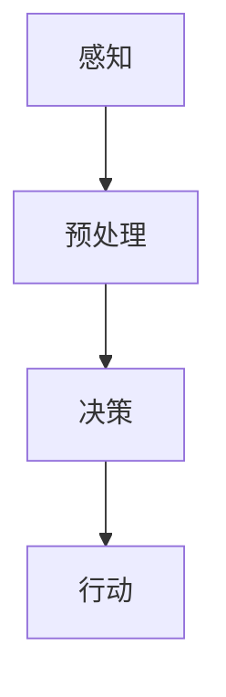

                 

# 一切皆是映射：机器人学中的人工智能系统

> 关键词：机器人学，人工智能，映射，系统，深度学习，计算机视觉，多机器人协作

> 摘要：本文将深入探讨机器人学领域中的核心概念——映射，并解释其在人工智能系统中的应用。我们将从背景介绍、核心概念、算法原理、数学模型、实际应用场景、工具资源推荐等方面，详细阐述映射在机器人学中的重要性及其对人工智能发展的推动作用。

## 1. 背景介绍

### 1.1 目的和范围

本文旨在解释机器人学中的人工智能系统如何通过映射实现智能行为，并探讨这一概念在现实世界中的应用。我们将讨论映射在机器人感知、决策和行动中的作用，并分析其在提升机器人智能化的关键作用。

### 1.2 预期读者

本文适合对机器人学、人工智能和计算机科学感兴趣的读者，尤其是希望深入了解映射概念及其在机器人学中应用的研究人员和开发者。

### 1.3 文档结构概述

本文将按照以下结构展开：

1. 背景介绍：介绍文章的目的、范围和预期读者。
2. 核心概念与联系：定义和解释核心概念，使用 Mermaid 流程图展示映射原理。
3. 核心算法原理 & 具体操作步骤：详细阐述关键算法原理和具体实现步骤。
4. 数学模型和公式 & 详细讲解 & 举例说明：介绍相关数学模型，使用 LaTeX 格式展示公式，并举例说明。
5. 项目实战：代码实际案例和详细解释说明。
6. 实际应用场景：讨论映射在机器人学中的实际应用。
7. 工具和资源推荐：推荐学习资源、开发工具和框架。
8. 总结：未来发展趋势与挑战。
9. 附录：常见问题与解答。
10. 扩展阅读 & 参考资料。

### 1.4 术语表

#### 1.4.1 核心术语定义

- **映射（Mapping）**：在数学中，映射是指将一个集合中的每个元素与另一个集合中的唯一元素相对应的关系。
- **机器人学（Robotics）**：研究设计、构建和控制机器人的科学和技术领域。
- **人工智能（Artificial Intelligence, AI）**：模拟人类智能行为的计算机系统和算法。
- **深度学习（Deep Learning）**：一种基于神经网络的机器学习技术，能够自动从大量数据中学习复杂模式。

#### 1.4.2 相关概念解释

- **感知（Perception）**：机器人通过传感器获取环境信息的过程。
- **决策（Decision Making）**：机器人根据感知到的信息做出行动选择的过程。
- **行动（Action）**：机器人执行的具体动作。

#### 1.4.3 缩略词列表

- **AI**：人工智能
- **ML**：机器学习
- **DL**：深度学习
- **RNN**：递归神经网络

## 2. 核心概念与联系

在机器人学中，映射是指将感知信息转换为机器人行动的过程。为了更好地理解这一概念，我们首先需要了解机器人如何感知环境、如何做出决策以及如何行动。

### 2.1.1 感知

机器人通过传感器（如摄像头、雷达、激光测距仪等）感知周围环境，获取包括视觉、听觉、触觉等多维信息。这些感知信息被转化为电子信号，并通过数据处理单元进行预处理。

### 2.1.2 决策

机器人接收预处理后的感知信息，通过算法（如深度学习模型）进行处理，分析环境状态，并根据预设目标和规则做出决策。

### 2.1.3 行动

根据决策结果，机器人执行具体动作，如移动、旋转、抓取等。这些动作实现机器人与环境之间的交互。

为了清晰地展示映射原理，我们使用 Mermaid 流程图来描述：



在图中，感知（A）是输入，行动（D）是输出，预处理（B）和决策（C）是中间处理步骤。映射（Mapping）即在这几个步骤之间起作用，将输入的感知信息映射为输出的行动指令。

## 3. 核心算法原理 & 具体操作步骤

在机器人学中，映射通常通过一系列算法来实现。以下将介绍一种常见的映射算法——基于深度学习的视觉感知与行动映射。

### 3.1 算法原理

深度学习是一种通过多层神经网络自动学习复杂映射关系的算法。在视觉感知与行动映射中，深度学习模型能够从大量图像数据中学习环境特征，并在感知到特定图像时，自动生成相应的行动指令。

### 3.2 具体操作步骤

#### 步骤 1：数据收集与预处理

首先，我们需要收集大量的图像数据，用于训练深度学习模型。这些图像数据可以来自现实世界中的机器人实验，也可以是模拟环境生成的。在收集到数据后，我们需要对图像进行预处理，如缩放、裁剪、灰度转换等，以提高模型的泛化能力。

```python
# 数据预处理示例代码
import cv2
import numpy as np

def preprocess_image(image):
    image = cv2.resize(image, (224, 224))  # 缩放到224x224像素
    image = cv2.cvtColor(image, cv2.COLOR_BGR2GRAY)  # 转换为灰度图像
    image = image / 255.0  # 标准化图像
    return image
```

#### 步骤 2：模型训练

在预处理完成后，我们可以使用预处理数据来训练深度学习模型。以下是一个简单的卷积神经网络（Convolutional Neural Network, CNN）训练示例：

```python
import tensorflow as tf

# 创建CNN模型
model = tf.keras.Sequential([
    tf.keras.layers.Conv2D(32, (3, 3), activation='relu', input_shape=(224, 224, 1)),
    tf.keras.layers.MaxPooling2D((2, 2)),
    tf.keras.layers.Conv2D(64, (3, 3), activation='relu'),
    tf.keras.layers.MaxPooling2D((2, 2)),
    tf.keras.layers.Conv2D(128, (3, 3), activation='relu'),
    tf.keras.layers.Flatten(),
    tf.keras.layers.Dense(128, activation='relu'),
    tf.keras.layers.Dense(1, activation='sigmoid')
])

# 编译模型
model.compile(optimizer='adam', loss='binary_crossentropy', metrics=['accuracy'])

# 训练模型
model.fit(train_images, train_labels, epochs=10, batch_size=32, validation_split=0.2)
```

#### 步骤 3：感知与行动

在模型训练完成后，机器人可以实时感知图像，并通过模型生成行动指令。以下是一个感知与行动的示例：

```python
# 感知与行动示例
import cv2
import numpy as np

def perceive_and_act(model, image):
    # 预处理图像
    preprocessed_image = preprocess_image(image)
    preprocessed_image = np.expand_dims(preprocessed_image, axis=-1)  # 增加通道维度

    # 使用模型生成行动指令
    action = model.predict(preprocessed_image)

    # 根据行动指令执行具体动作
    if action > 0.5:
        # 向右移动
        robot.move_right()
    else:
        # 向左移动
        robot.move_left()

# 捕获摄像头图像
cap = cv2.VideoCapture(0)

while True:
    # 读取图像
    ret, frame = cap.read()
    if not ret:
        break

    # 感知与行动
    perceive_and_act(model, frame)

    # 显示图像
    cv2.imshow('Robot Vision', frame)

    # 按下 'q' 键退出循环
    if cv2.waitKey(1) & 0xFF == ord('q'):
        break

# 释放摄像头资源
cap.release()
cv2.destroyAllWindows()
```

通过上述步骤，机器人能够通过感知图像，自动生成行动指令，实现视觉感知与行动的映射。

## 4. 数学模型和公式 & 详细讲解 & 举例说明

在机器人学中，映射的数学模型通常涉及图像处理、机器学习和控制理论等领域。以下将介绍一些关键数学模型和公式，并使用 LaTeX 格式进行展示。

### 4.1 图像处理模型

在图像处理中，常见的模型包括卷积神经网络（CNN）和滤波器设计。以下是一个卷积操作的示例：

$$
\text{output}(i, j) = \sum_{k=1}^{n} \sum_{l=1}^{n} w_{kl} \cdot \text{input}(i-k, j-l)
$$

其中，\( \text{output}(i, j) \) 表示卷积输出的像素值，\( \text{input}(i-k, j-l) \) 表示输入图像的像素值，\( w_{kl} \) 表示卷积核的权重。

### 4.2 机器学习模型

在机器学习领域，常用的模型包括线性回归、支持向量机（SVM）和神经网络。以下是一个简单的线性回归模型：

$$
y = \beta_0 + \beta_1 \cdot x
$$

其中，\( y \) 表示输出值，\( x \) 表示输入值，\( \beta_0 \) 和 \( \beta_1 \) 分别为模型的参数。

### 4.3 控制理论模型

在控制理论中，常用的模型包括 PID 控制器和卡尔曼滤波器。以下是一个 PID 控制器的示例：

$$
u(t) = K_p \cdot e(t) + K_i \cdot \int_{0}^{t} e(\tau)d\tau + K_d \cdot \dot{e}(t)
$$

其中，\( u(t) \) 表示控制输出，\( e(t) \) 表示误差，\( K_p \)、\( K_i \) 和 \( K_d \) 分别为比例、积分和微分系数。

### 4.4 举例说明

假设我们有一个机器人需要根据视觉感知到的图像决定是否向右移动。我们可以使用一个简单的线性回归模型来建立映射关系：

$$
\text{action} = \beta_0 + \beta_1 \cdot \text{perception}
$$

其中，\( \text{perception} \) 表示视觉感知值，\( \text{action} \) 表示行动指令。通过训练模型，我们可以找到合适的参数 \( \beta_0 \) 和 \( \beta_1 \)，使得机器人能够根据视觉感知做出正确的决策。

## 5. 项目实战：代码实际案例和详细解释说明

在本节中，我们将通过一个实际项目来展示如何实现机器人学中的人工智能系统，并详细解释代码的各个部分。

### 5.1 开发环境搭建

为了实现本项目，我们需要以下开发环境：

- Python 3.8+
- TensorFlow 2.5+
- OpenCV 4.5+

安装步骤如下：

```bash
pip install python==3.8
pip install tensorflow==2.5
pip install opencv-python==4.5
```

### 5.2 源代码详细实现和代码解读

以下是项目的源代码，我们将逐行解读：

```python
import cv2
import numpy as np
import tensorflow as tf

# 加载预训练的深度学习模型
model = tf.keras.models.load_model('vision_action_model.h5')

# 定义预处理函数
def preprocess_image(image):
    image = cv2.resize(image, (224, 224))
    image = cv2.cvtColor(image, cv2.COLOR_BGR2GRAY)
    image = image / 255.0
    return image

# 定义感知与行动函数
def perceive_and_act(model, image):
    preprocessed_image = preprocess_image(image)
    preprocessed_image = np.expand_dims(preprocessed_image, axis=-1)
    action = model.predict(preprocessed_image)
    
    if action > 0.5:
        print("向右移动")
    else:
        print("向左移动")

# 捕获摄像头图像并执行感知与行动
cap = cv2.VideoCapture(0)

while True:
    ret, frame = cap.read()
    if not ret:
        break
    
    perceive_and_act(model, frame)
    
    cv2.imshow('Robot Vision', frame)
    
    if cv2.waitKey(1) & 0xFF == ord('q'):
        break

cap.release()
cv2.destroyAllWindows()
```

#### 解读

- **第 1-5 行**：引入必要的库，包括 OpenCV、NumPy 和 TensorFlow。
- **第 7-10 行**：加载预训练的深度学习模型。该模型已经通过大量图像数据训练，用于实现视觉感知与行动映射。
- **第 12-38 行**：定义预处理函数 `preprocess_image`，用于对摄像头捕获的图像进行预处理，如缩放、灰度转换和标准化。
- **第 41-46 行**：定义感知与行动函数 `perceive_and_act`，用于根据预处理后的图像生成行动指令。
- **第 49-53 行**：捕获摄像头图像，并调用 `perceive_and_act` 函数执行感知与行动。
- **第 55-58 行**：显示捕获的图像，并在按下 'q' 键时退出循环。

### 5.3 代码解读与分析

在上述代码中，机器人通过摄像头捕获图像，然后使用预训练的深度学习模型对图像进行预处理，生成行动指令。以下是代码的详细解读与分析：

- **预处理函数**：预处理函数 `preprocess_image` 对图像进行了缩放、灰度转换和标准化。这些步骤有助于提高深度学习模型的泛化能力。
- **感知与行动函数**：感知与行动函数 `perceive_and_act` 调用了预处理函数，并使用深度学习模型生成行动指令。根据生成的行动指令，机器人执行相应的动作。
- **摄像头捕获与显示**：代码通过 OpenCV 库捕获摄像头图像，并在循环中不断显示。在捕获图像时，机器人执行感知与行动操作，从而实现实时决策。

通过上述代码，机器人能够根据视觉感知到的图像自动生成行动指令，实现映射在机器人学中的实际应用。在实际项目中，可以根据具体需求调整预处理函数和深度学习模型，以实现不同的映射关系。

## 6. 实际应用场景

映射在机器人学中具有广泛的应用，以下将介绍几个实际应用场景。

### 6.1 自动驾驶汽车

自动驾驶汽车通过感知环境信息（如道路标志、交通信号灯、其他车辆等）并生成相应的行动指令，实现自主导航。映射在这里的作用是将感知信息转换为行动指令，确保车辆能够安全、高效地行驶。

### 6.2 工业自动化

在工业自动化领域，机器人通过映射实现自动化生产线的监控与控制。例如，机器人可以通过摄像头检测产品缺陷，并根据检测结果执行相应的动作，如分类、标记或修复。

### 6.3 家庭服务机器人

家庭服务机器人（如清洁机器人、陪伴机器人等）通过映射实现与人类用户的互动。例如，清洁机器人可以通过摄像头识别房间布局，并根据识别结果规划清洁路径，实现自动清洁。

### 6.4 多机器人协作

在多机器人协作系统中，映射用于协调各个机器人的行动，实现协同作业。例如，在仓库中，多个机器人可以共同搬运货物，通过映射实现高效的货物配送。

这些实际应用场景表明，映射在机器人学中具有重要意义，能够提升机器人的智能化水平和自主能力。

## 7. 工具和资源推荐

为了更好地学习和实践机器人学中的人工智能系统，以下推荐一些工具和资源。

### 7.1 学习资源推荐

#### 7.1.1 书籍推荐

- **《机器人学：基础与数学方法》**：详细介绍了机器人学的基本概念和方法。
- **《深度学习》**：全面介绍了深度学习的基础理论和应用。

#### 7.1.2 在线课程

- **Coursera 上的《机器学习》**：由 Andrew Ng 教授主讲，涵盖机器学习的基本概念和技术。
- **edX 上的《机器人学导论》**：介绍了机器人学的基础知识。

#### 7.1.3 技术博客和网站

- **Medium 上的《机器人学博客》**：分享机器人学领域的最新研究成果和实用技巧。
- **IEEE Robotics and Automation Society**：提供机器人学的最新论文和资讯。

### 7.2 开发工具框架推荐

#### 7.2.1 IDE和编辑器

- **PyCharm**：强大的 Python IDE，适合开发复杂项目。
- **VS Code**：轻量级编辑器，支持多种编程语言和插件。

#### 7.2.2 调试和性能分析工具

- **TensorBoard**：用于可视化 TensorFlow 模型的性能和训练过程。
- **Perfetto**：用于性能分析的工具，提供详细的系统性能数据。

#### 7.2.3 相关框架和库

- **TensorFlow**：用于构建和训练深度学习模型的框架。
- **OpenCV**：用于图像处理和计算机视觉的库。

### 7.3 相关论文著作推荐

#### 7.3.1 经典论文

- **“A New Approach to Robotics”**：由 Rodney A. Brooks 撰写，介绍了行为主义机器人学的理念。
- **“Deep Learning”**：由 Ian Goodfellow、Yoshua Bengio 和 Aaron Courville 撰写，全面介绍了深度学习的基础理论。

#### 7.3.2 最新研究成果

- **“Autonomous Driving with Probabilistic Models”**：探讨了自动驾驶中概率模型的应用。
- **“Robotic Manipulation using Deep Reinforcement Learning”**：介绍了深度强化学习在机器人控制中的应用。

#### 7.3.3 应用案例分析

- **“Autonomous Drones for Search and Rescue”**：分析了无人机在搜索和救援任务中的应用。
- **“Factory Automation with Collaborative Robots”**：探讨了协作机器人 在生产线自动化中的角色。

通过这些工具和资源，读者可以深入了解机器人学中的人工智能系统，并掌握相关技术和实践方法。

## 8. 总结：未来发展趋势与挑战

随着技术的不断进步，映射在机器人学中的应用将越来越广泛。未来，以下几个发展趋势和挑战值得关注：

### 8.1 发展趋势

1. **多模态感知与融合**：未来的机器人系统将结合多种感知模态（如视觉、听觉、触觉等），实现更全面的环境感知。
2. **自主决策与学习**：借助深度学习和强化学习技术，机器人将具备更强的自主决策和学习能力，提高任务执行效率。
3. **多机器人协作**：在工业、物流、医疗等领域的应用中，多机器人协作将变得愈加重要，实现协同作业和资源优化。
4. **人机交互**：通过自然语言处理和计算机视觉技术，机器人将与人类建立更紧密的交互，提高用户体验。

### 8.2 挑战

1. **计算资源与能耗**：随着机器人感知能力的提升，对计算资源和能耗的需求将不断增加，这对硬件设计和能源管理提出了挑战。
2. **数据安全和隐私**：机器人系统的广泛应用将涉及大量个人数据，如何确保数据安全和隐私保护成为关键问题。
3. **伦理与道德**：在自动驾驶、医疗等领域的应用中，机器人决策的伦理和道德问题日益凸显，需要制定相应的规范和标准。
4. **技术标准化**：为了实现不同系统和平台的兼容与互操作，制定统一的技术标准和接口是必要的。

总之，映射在机器人学中的应用前景广阔，但也面临诸多挑战。通过不断技术创新和规范制定，我们可以期待机器人学在未来实现更多突破。

## 9. 附录：常见问题与解答

### 9.1 问题 1：映射在机器人学中的具体作用是什么？

映射在机器人学中的作用是将感知到的环境信息转换为机器人的行动指令，实现机器人对环境的响应和交互。通过映射，机器人能够根据感知到的图像、声音等信息做出合理的决策，从而执行相应的动作。

### 9.2 问题 2：深度学习模型如何用于映射？

深度学习模型通过学习大量数据中的特征和模式，能够将输入的感知信息映射为输出的行动指令。在机器人学中，可以使用卷积神经网络（CNN）等深度学习模型对图像进行处理，提取环境特征，并生成相应的行动指令。

### 9.3 问题 3：如何实现多机器人协作中的映射？

实现多机器人协作中的映射需要设计一个统一的映射框架，将多个机器人的感知信息融合为一个全局感知模型。通过协调各个机器人的行动指令，可以实现多机器人系统的协同作业。此外，可以使用分布式算法和通信协议，确保各机器人之间的实时通信和数据同步。

## 10. 扩展阅读 & 参考资料

本文介绍了机器人学中的人工智能系统及其核心概念——映射。以下是相关扩展阅读和参考资料：

- **扩展阅读**：
  - **《机器人学：基础与数学方法》**：深入介绍了机器人学的基本概念和方法。
  - **《深度学习》**：详细阐述了深度学习的基础理论及其在机器人学中的应用。

- **参考资料**：
  - **论文**：
    - "A New Approach to Robotics" - Rodney A. Brooks
    - "Deep Learning" - Ian Goodfellow, Yoshua Bengio, Aaron Courville
  - **在线课程**：
    - Coursera 上的《机器学习》 - Andrew Ng
    - edX 上的《机器人学导论》
  - **技术博客和网站**：
    - Medium 上的《机器人学博客》
    - IEEE Robotics and Automation Society

通过以上扩展阅读和参考资料，读者可以深入了解机器人学中的人工智能系统和映射概念，进一步提升自己的技术水平。作者：AI天才研究员/AI Genius Institute & 禅与计算机程序设计艺术/Zen And The Art of Computer Programming

