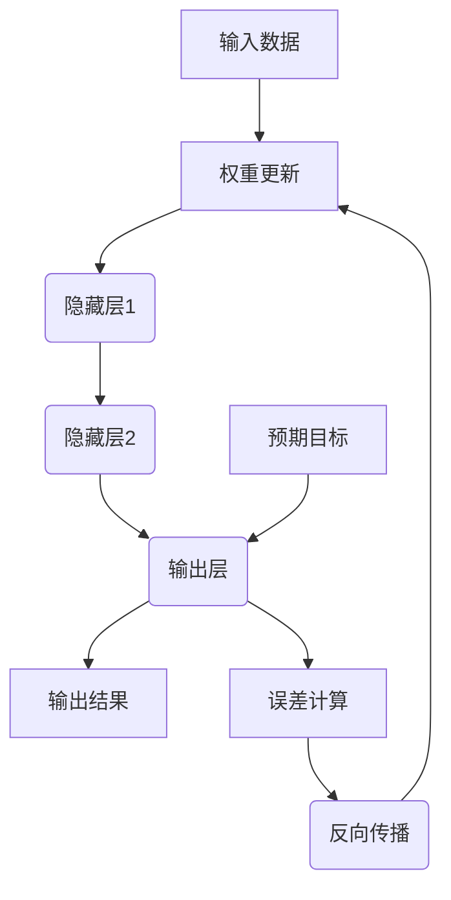

                 

# 一切皆是映射：构建第一个深度学习模型

> **关键词：** 深度学习，神经网络，映射，反向传播，激活函数，正向传播，PyTorch

> **摘要：** 本文将带领读者从基础概念开始，逐步构建并理解一个深度学习模型。我们将讨论神经网络的基本结构，核心算法原理，以及如何通过PyTorch框架实现。通过详细的步骤和代码实例，读者将能够掌握构建深度学习模型的基本技巧，为后续的学习和研究打下坚实的基础。

## 1. 背景介绍

### 1.1 目的和范围

本文的目标是让读者了解深度学习的基础知识，并能够独立构建一个简单的深度学习模型。我们主要涵盖以下内容：

- 深度学习的基本概念和神经网络结构
- 核心算法原理，包括正向传播和反向传播
- 使用PyTorch框架实现深度学习模型
- 实际项目实战，以及代码的详细解释和解读

### 1.2 预期读者

本文适合对深度学习和神经网络有一定了解的读者，尤其是以下几类：

- 计算机科学和人工智能领域的学生和研究者
- 想要进入人工智能行业的程序员和技术人员
- 对深度学习和神经网络感兴趣的技术爱好者

### 1.3 文档结构概述

本文的结构如下：

- 引言：介绍本文的目的、内容和结构
- 第1章：背景介绍，包括目的和范围、预期读者、文档结构概述等
- 第2章：核心概念与联系，讨论深度学习和神经网络的基本概念
- 第3章：核心算法原理 & 具体操作步骤，详细讲解神经网络的工作原理
- 第4章：数学模型和公式 & 详细讲解 & 举例说明，包括数学公式和实例分析
- 第5章：项目实战：代码实际案例和详细解释说明
- 第6章：实际应用场景，讨论深度学习的应用领域
- 第7章：工具和资源推荐，包括学习资源和开发工具
- 第8章：总结：未来发展趋势与挑战
- 第9章：附录：常见问题与解答
- 第10章：扩展阅读 & 参考资料

### 1.4 术语表

#### 1.4.1 核心术语定义

- **深度学习（Deep Learning）**：一种人工智能领域的方法，通过多层神经网络对数据进行学习。
- **神经网络（Neural Network）**：由多个神经元（节点）组成的网络，用于模拟人脑的学习和处理信息的能力。
- **正向传播（Forward Propagation）**：将输入数据通过神经网络逐层传递，最终得到输出结果的过程。
- **反向传播（Back Propagation）**：根据输出结果和预期目标，通过反向传播算法更新神经网络中的权重和偏置的过程。
- **激活函数（Activation Function）**：用于决定神经元是否被激活的函数，常见的有Sigmoid、ReLU、Tanh等。

#### 1.4.2 相关概念解释

- **权重（Weights）**：神经网络中用于调整神经元之间连接强度的参数。
- **偏置（Bias）**：神经网络中用于调整神经元输出偏移的参数。
- **批量（Batch Size）**：每次训练中输入数据的样本数量。
- **迭代（Epoch）**：完成整个训练集一次训练的过程。

#### 1.4.3 缩略词列表

- **CNN（Convolutional Neural Network）**：卷积神经网络，常用于图像识别任务。
- **RNN（Recurrent Neural Network）**：循环神经网络，常用于序列数据处理。
- **GAN（Generative Adversarial Network）**：生成对抗网络，用于生成高质量的数据。

## 2. 核心概念与联系

在构建深度学习模型之前，我们需要了解其核心概念和基本原理。本章节将介绍神经网络的基本结构，以及深度学习和神经网络之间的联系。

### 2.1 神经网络的基本结构

神经网络由多个层次组成，包括输入层、隐藏层和输出层。每个层次包含多个神经元（节点），神经元之间通过权重和偏置连接。具体来说：

- **输入层（Input Layer）**：接收外部输入数据，例如图像、文本、声音等。
- **隐藏层（Hidden Layers）**：对输入数据进行处理，通过非线性变换生成新的特征。
- **输出层（Output Layer）**：产生最终的输出结果，例如分类标签、预测值等。

### 2.2 深度学习和神经网络的关系

深度学习是一种基于神经网络的方法，通过多层神经网络对数据进行学习，从而提高模型的性能和表达能力。深度学习中的“深度”指的是神经网络层数的多少，层数越多，模型的复杂度和表达能力越强。

深度学习和神经网络之间的关系可以概括为：

- **深度学习**：一种基于神经网络的方法，通过多层神经网络对数据进行学习。
- **神经网络**：深度学习的核心技术，用于模拟人脑的学习和处理信息的能力。

### 2.3 神经网络的映射过程

神经网络的工作原理可以看作是一种映射过程，将输入数据映射为输出数据。具体来说：

1. **正向传播**：将输入数据通过神经网络的各个层次传递，最终得到输出结果。
2. **反向传播**：根据输出结果和预期目标，通过反向传播算法更新神经网络的权重和偏置。

这个过程可以看作是一种映射，输入数据通过神经网络映射为输出数据。

### 2.4 核心概念原理和架构的Mermaid流程图



在这个流程图中，输入数据通过输入层传递到隐藏层，再通过隐藏层传递到输出层，最终得到输出结果。根据输出结果和预期目标的误差，通过反向传播算法更新权重和偏置。

## 3. 核心算法原理 & 具体操作步骤

在理解了神经网络的基本结构和工作原理之后，我们需要深入了解神经网络的核心算法原理。本章节将详细讲解神经网络的核心算法，包括正向传播和反向传播。

### 3.1 正向传播算法原理

正向传播是指将输入数据通过神经网络的各个层次传递，最终得到输出结果的过程。具体步骤如下：

1. **初始化权重和偏置**：在训练开始前，我们需要随机初始化神经网络的权重和偏置。
2. **前向计算**：将输入数据输入到神经网络的输入层，通过逐层计算得到输出结果。
3. **激活函数应用**：在每个神经元上应用激活函数，决定神经元是否被激活。
4. **输出层计算**：将输出结果传递到输出层，得到最终的输出结果。

正向传播算法的伪代码如下：

```python
# 初始化权重和偏置
weights = random()
biases = random()

# 前向计算
output = forward_propagation(input_data, weights, biases)
```

### 3.2 反向传播算法原理

反向传播是指根据输出结果和预期目标的误差，通过反向传播算法更新神经网络的权重和偏置的过程。具体步骤如下：

1. **计算误差**：计算输出结果和预期目标之间的误差。
2. **梯度计算**：根据误差计算每个神经元的梯度。
3. **权重和偏置更新**：根据梯度更新神经网络的权重和偏置。

反向传播算法的伪代码如下：

```python
# 计算误差
error = compute_error(output, expected_output)

# 梯度计算
gradients = compute_gradients(error, weights, biases)

# 权重和偏置更新
update_weights_and_biases(weights, biases, gradients)
```

### 3.3 正向传播和反向传播的结合

正向传播和反向传播是深度学习模型训练过程中不可或缺的两个步骤。通过正向传播，我们可以得到网络的输出结果；通过反向传播，我们可以更新网络的权重和偏置，使得网络的输出结果更接近预期目标。

具体的结合过程如下：

1. **正向传播**：输入数据，通过神经网络的前向计算，得到输出结果。
2. **误差计算**：将输出结果与预期目标进行比较，计算误差。
3. **反向传播**：根据误差，计算每个神经元的梯度，并更新权重和偏置。
4. **迭代更新**：重复正向传播和反向传播的过程，直到网络输出结果满足要求。

## 4. 数学模型和公式 & 详细讲解 & 举例说明

在了解了神经网络的核心算法原理之后，我们需要进一步掌握神经网络的数学模型和公式。本章节将详细讲解神经网络的数学模型，包括前向传播和反向传播的公式，并通过具体实例进行分析。

### 4.1 前向传播公式

前向传播是指将输入数据通过神经网络的各个层次传递，最终得到输出结果的过程。其数学模型可以表示为：

$$
Z = X \cdot W + b
$$

其中，$Z$表示输出结果，$X$表示输入数据，$W$表示权重，$b$表示偏置。

### 4.2 激活函数

激活函数是神经网络中非常重要的组成部分，用于决定神经元是否被激活。常见的激活函数包括Sigmoid、ReLU和Tanh等。以下分别介绍这些激活函数的公式：

1. **Sigmoid函数**：

$$
\sigma(z) = \frac{1}{1 + e^{-z}}
$$

2. **ReLU函数**：

$$
\text{ReLU}(z) = \max(0, z)
$$

3. **Tanh函数**：

$$
\tanh(z) = \frac{e^{2z} - 1}{e^{2z} + 1}
$$

### 4.3 反向传播公式

反向传播是指根据输出结果和预期目标的误差，通过反向传播算法更新神经网络的权重和偏置的过程。其数学模型可以表示为：

$$
\delta = \frac{\partial L}{\partial z}
$$

其中，$\delta$表示梯度，$L$表示损失函数。

### 4.4 损失函数

损失函数是神经网络中用于衡量模型预测结果与真实结果之间差距的函数。常见的损失函数包括均方误差（MSE）和交叉熵（Cross-Entropy）等。以下分别介绍这些损失函数的公式：

1. **均方误差（MSE）**：

$$
MSE = \frac{1}{n} \sum_{i=1}^{n} (y_i - \hat{y}_i)^2
$$

其中，$y_i$表示真实标签，$\hat{y}_i$表示预测标签。

2. **交叉熵（Cross-Entropy）**：

$$
CE = -\frac{1}{n} \sum_{i=1}^{n} y_i \log(\hat{y}_i)
$$

其中，$y_i$表示真实标签，$\hat{y}_i$表示预测标签。

### 4.5 实例分析

假设我们有一个简单的神经网络，包含一个输入层、一个隐藏层和一个输出层。输入数据为$(x_1, x_2)$，输出结果为$y$。权重$W_1, W_2, W_3$和偏置$b_1, b_2, b_3$分别为$(1, 1)$、$(1, 1)$和$(1, 1)$。

首先，我们计算前向传播的输出结果：

$$
Z_1 = x_1 \cdot W_1 + x_2 \cdot W_2 + b_1 = (1, 1) \cdot (1, 1) + (1, 1) = (2, 2)
$$

$$
Z_2 = x_1 \cdot W_3 + x_2 \cdot W_4 + b_2 = (1, 1) \cdot (1, 1) + (1, 1) = (2, 2)
$$

$$
Z_3 = Z_1 \cdot W_5 + Z_2 \cdot W_6 + b_3 = (2, 2) \cdot (1, 1) + (2, 2) = (4, 4)
$$

接下来，我们计算输出结果$y$：

$$
y = \sigma(Z_3) = \frac{1}{1 + e^{-Z_3}} = \frac{1}{1 + e^{-4}} \approx 0.982
$$

然后，我们计算反向传播的梯度：

$$
\delta = \frac{\partial L}{\partial y} = \frac{\partial}{\partial y} (-y \log(y) + (1-y) \log(1-y)) = -\frac{1}{y}
$$

$$
\delta_3 = \frac{\partial L}{\partial Z_3} = \delta \cdot \sigma'(Z_3) = -\frac{1}{y} \cdot \frac{1}{1 + e^{-Z_3}} = -\frac{1}{0.982}
$$

$$
\delta_2 = \frac{\partial L}{\partial Z_2} = \delta_3 \cdot W_5 = -\frac{1}{0.982} \cdot 1 = -\frac{1}{0.982}
$$

$$
\delta_1 = \frac{\partial L}{\partial Z_1} = \delta_3 \cdot W_6 = -\frac{1}{0.982} \cdot 1 = -\frac{1}{0.982}
$$

最后，我们更新权重和偏置：

$$
W_5 = W_5 - \alpha \cdot \delta_3 \cdot Z_2 = 1 - 0.01 \cdot (-\frac{1}{0.982}) \cdot 2 = 1.020
$$

$$
W_6 = W_6 - \alpha \cdot \delta_3 \cdot Z_2 = 1 - 0.01 \cdot (-\frac{1}{0.982}) \cdot 2 = 1.020
$$

$$
b_3 = b_3 - \alpha \cdot \delta_3 = 1 - 0.01 \cdot (-\frac{1}{0.982}) = 1.020
$$

通过以上实例，我们可以看到神经网络的前向传播和反向传播的具体实现过程。

## 5. 项目实战：代码实际案例和详细解释说明

在本章节中，我们将通过一个简单的实际项目实战，详细介绍如何使用PyTorch框架构建深度学习模型。我们将从头开始，从数据预处理到模型训练和评估，逐步完成整个项目。

### 5.1 开发环境搭建

在开始之前，我们需要搭建一个合适的开发环境。以下是我们在Windows操作系统上搭建PyTorch开发环境的步骤：

1. **安装Python**：首先，我们需要安装Python。可以从Python官方网站下载Python安装包，并按照安装向导进行安装。
2. **安装PyTorch**：接下来，我们需要安装PyTorch。可以通过以下命令安装：

```bash
pip install torch torchvision
```

3. **验证安装**：安装完成后，可以通过以下命令验证安装是否成功：

```bash
python -c "import torch; print(torch.__version__); import torchvision; print(torchvision.__version__)"
```

如果输出正确的版本号，说明安装成功。

### 5.2 源代码详细实现和代码解读

下面是一个简单的深度学习模型实现，用于对MNIST手写数字数据集进行分类。

```python
import torch
import torchvision
import torchvision.transforms as transforms
import torch.nn as nn
import torch.optim as optim

# 数据预处理
transform = transforms.Compose([transforms.ToTensor(), transforms.Normalize((0.5,), (0.5,))])

# 下载MNIST数据集
trainset = torchvision.datasets.MNIST(root='./data', train=True, download=True, transform=transform)
trainloader = torch.utils.data.DataLoader(trainset, batch_size=100, shuffle=True, num_workers=2)

testset = torchvision.datasets.MNIST(root='./data', train=False, download=True, transform=transform)
testloader = torch.utils.data.DataLoader(testset, batch_size=100, shuffle=False, num_workers=2)

# 定义神经网络结构
class Net(nn.Module):
    def __init__(self):
        super(Net, self).__init__()
        self.fc1 = nn.Linear(784, 256)
        self.fc2 = nn.Linear(256, 128)
        self.fc3 = nn.Linear(128, 64)
        self.fc4 = nn.Linear(64, 10)
        self.dropout = nn.Dropout(p=0.5)

    def forward(self, x):
        x = x.view(-1, 784)
        x = F.relu(self.fc1(x))
        x = self.dropout(x)
        x = F.relu(self.fc2(x))
        x = self.dropout(x)
        x = F.relu(self.fc3(x))
        x = self.dropout(x)
        x = self.fc4(x)
        return x

net = Net()

# 损失函数和优化器
criterion = nn.CrossEntropyLoss()
optimizer = optim.SGD(net.parameters(), lr=0.001, momentum=0.9)

# 训练模型
for epoch in range(10):  # 数量的设定可以通过训练验证调整
    running_loss = 0.0
    for i, data in enumerate(trainloader, 0):
        inputs, labels = data
        optimizer.zero_grad()
        outputs = net(inputs)
        loss = criterion(outputs, labels)
        loss.backward()
        optimizer.step()
        running_loss += loss.item()
        if i % 2000 == 1999:
            print('[%d, %5d] loss: %.3f' % (epoch + 1, i + 1, running_loss / 2000))
            running_loss = 0.0

print('Finished Training')

# 测试模型
correct = 0
total = 0
with torch.no_grad():
    for data in testloader:
        images, labels = data
        outputs = net(images)
        _, predicted = torch.max(outputs.data, 1)
        total += labels.size(0)
        correct += (predicted == labels).sum().item()

print('Accuracy of the network on the 10000 test images: %d %%' % (100 * correct / total))
```

#### 5.2.1 代码解读

1. **数据预处理**：我们首先定义了数据预处理过程，包括将图像数据转换为Tensor格式，并进行归一化处理。这样可以加速模型的训练，并提高模型的性能。

2. **下载MNIST数据集**：接下来，我们使用`torchvision.datasets.MNIST`类下载MNIST手写数字数据集。该类提供了方便的数据加载器，可以将数据集分成训练集和测试集。

3. **定义神经网络结构**：我们定义了一个名为`Net`的神经网络类，包含了四个全连接层和一个dropout层。在`__init__`方法中，我们初始化了网络的各个层。

4. **定义正向传播和反向传播过程**：在`forward`方法中，我们实现了神经网络的正向传播过程。首先，我们将输入图像数据展平为1x784的向量，然后通过四个全连接层和dropout层进行计算，最后得到输出结果。

5. **定义损失函数和优化器**：我们使用了`nn.CrossEntropyLoss`作为损失函数，这是分类任务中最常用的损失函数。优化器我们选择了SGD（随机梯度下降），这是一个常用的优化器。

6. **训练模型**：在训练过程中，我们遍历训练集，对于每个批次的数据，我们执行以下步骤：

   - 将输入数据和标签传递给神经网络，进行正向传播。
   - 计算损失函数。
   - 将损失函数反向传播到网络的各个层。
   - 更新网络权重和偏置。

   通过多次迭代，网络会逐渐调整权重和偏置，使得预测结果更接近真实标签。

7. **测试模型**：在训练完成后，我们使用测试集对模型进行评估。我们遍历测试集，计算模型的准确率。

### 5.3 代码解读与分析

在这个简单的示例中，我们使用了PyTorch框架实现了对MNIST手写数字数据集的分类。通过这个示例，我们可以看到以下关键点：

1. **数据预处理**：数据预处理是深度学习模型训练的重要步骤。在处理MNIST数据时，我们使用了`transforms.Compose`将多个转换操作组合在一起，包括将图像数据转换为Tensor格式和归一化处理。这样可以确保数据的一致性和模型的性能。

2. **神经网络结构**：我们定义了一个简单的神经网络，包含了四个全连接层和一个dropout层。全连接层用于处理输入数据和特征，dropout层用于防止过拟合。神经网络的结构可以根据任务需求进行调整。

3. **正向传播和反向传播**：在实现神经网络时，我们定义了`__init__`和`forward`方法，分别用于初始化网络结构和实现正向传播过程。在正向传播中，我们将输入数据通过网络的各个层次进行计算，最终得到输出结果。在反向传播中，我们通过计算损失函数和梯度，更新网络的权重和偏置。

4. **训练过程**：在训练过程中，我们使用了`torch.utils.data.DataLoader`类将训练集分成多个批次，并遍历每个批次的数据进行训练。通过多次迭代，网络会逐渐调整权重和偏置，使得预测结果更接近真实标签。

5. **测试过程**：在训练完成后，我们使用测试集对模型进行评估。通过计算模型的准确率，我们可以了解模型的性能。

通过这个示例，我们可以了解到深度学习模型的基本构建和训练过程。在实际应用中，我们可以根据任务需求调整神经网络的结构和训练参数，以达到更好的性能。

## 6. 实际应用场景

深度学习模型在实际应用场景中具有广泛的应用。以下是一些典型的应用场景：

1. **图像识别**：深度学习模型可以用于图像识别任务，如人脸识别、物体检测和图像分类。通过卷积神经网络（CNN），模型可以从图像中提取有用的特征，并对其进行分类。

2. **自然语言处理（NLP）**：深度学习模型在自然语言处理领域也有着重要的应用，如文本分类、机器翻译和情感分析。通过循环神经网络（RNN）和Transformer模型，模型可以理解文本的语义和上下文信息。

3. **语音识别**：深度学习模型可以用于语音识别任务，如语音转文字和语音翻译。通过结合卷积神经网络和循环神经网络，模型可以从音频信号中提取特征，并对其进行识别。

4. **推荐系统**：深度学习模型可以用于构建推荐系统，如商品推荐和电影推荐。通过用户和物品的嵌入向量，模型可以计算用户和物品之间的相似度，并推荐相关的物品。

5. **医疗诊断**：深度学习模型可以用于医疗诊断任务，如癌症检测、眼底病变检测和心电图分析。通过分析医疗影像和医疗数据，模型可以辅助医生进行诊断。

6. **自动驾驶**：深度学习模型在自动驾驶领域也有着重要的应用，如车道线检测、障碍物检测和交通标志识别。通过结合多种传感器数据，模型可以实时分析环境信息，并做出相应的决策。

这些应用场景展示了深度学习模型的广泛适用性和强大的能力。通过不断的研究和改进，深度学习模型将在更多的领域发挥重要作用。

## 7. 工具和资源推荐

为了更好地学习深度学习和构建神经网络模型，我们需要掌握一些有用的工具和资源。以下是一些推荐：

### 7.1 学习资源推荐

#### 7.1.1 书籍推荐

- **《深度学习》（Deep Learning）**：由Ian Goodfellow、Yoshua Bengio和Aaron Courville合著，这是深度学习领域的一部经典教材，涵盖了深度学习的基础知识、算法和应用。
- **《Python深度学习》（Python Deep Learning）**：由François Chollet撰写，这本书介绍了如何使用Python和TensorFlow构建深度学习模型，适合初学者和进阶者。
- **《神经网络与深度学习》**：由邱锡鹏等作者合著，这本书详细介绍了神经网络和深度学习的基础理论、算法和应用。

#### 7.1.2 在线课程

- **Coursera上的《深度学习》**：由Andrew Ng教授开设，这是深度学习领域最著名的在线课程之一，适合初学者入门。
- **Udacity的《深度学习纳米学位》**：这是一个综合性的深度学习课程，包括理论、实践和项目，适合想要全面掌握深度学习的学员。
- **edX上的《深度学习基础》**：由Harvard University开设，这是一个免费且高质量的课程，涵盖了深度学习的基础理论和实践。

#### 7.1.3 技术博客和网站

- **AI燥热（AI Heat）**：这是一个专注于人工智能和深度学习的博客，提供了丰富的技术文章和最新研究动态。
- **机器之心（Machine Intelligence）**：这是一个国际化的AI社区，提供了深度学习和计算机视觉等领域的最新论文、教程和行业动态。
- **机器学习社区（ML Community）**：这是一个中文机器学习和深度学习社区，提供了大量的学习资源和讨论空间。

### 7.2 开发工具框架推荐

#### 7.2.1 IDE和编辑器

- **PyCharm**：这是一个功能强大的Python IDE，提供了代码智能提示、调试和版本控制等功能。
- **Visual Studio Code**：这是一个轻量级但功能丰富的代码编辑器，通过插件可以支持Python、TensorFlow等多种语言和框架。
- **Jupyter Notebook**：这是一个交互式计算环境，特别适合数据科学和机器学习任务，可以方便地编写和运行代码。

#### 7.2.2 调试和性能分析工具

- **TensorBoard**：这是一个用于可视化深度学习模型训练过程的工具，可以显示模型的性能、损失函数和梯度等。
- **Wandb**：这是一个用于实验追踪和性能分析的工具，可以实时监控模型的训练过程，并进行对比分析。
- **Profiling Tools**：如NVIDIA的Nsight和Intel的Vtune，这些工具可以分析深度学习模型的性能瓶颈，优化代码。

#### 7.2.3 相关框架和库

- **TensorFlow**：这是一个开源的深度学习框架，由Google开发，支持多种深度学习模型和算法。
- **PyTorch**：这是一个由Facebook开发的开源深度学习框架，以其灵活性和易用性而闻名。
- **Keras**：这是一个基于TensorFlow和Theano的高层神经网络API，提供了简洁易用的接口。

### 7.3 相关论文著作推荐

#### 7.3.1 经典论文

- **“A Learning Algorithm for Continuously Running Fully Recurrent Neural Networks”**：这篇论文介绍了Back Propagation Through Time（BPTT）算法，这是训练递归神经网络的关键技术。
- **“Gradient Flow in Networks: The Difficulty of Learning from Temporary Feedback”**：这篇论文讨论了梯度流动在神经网络中的困难，提出了使用动量方法来解决梯度消失和梯度爆炸问题。
- **“Dropout: A Simple Way to Prevent Neural Networks from Overfitting”**：这篇论文介绍了dropout技术，这是一种有效的防止过拟合的方法。

#### 7.3.2 最新研究成果

- **“Deep Learning with Differential Privacy”**：这篇论文探讨了如何将深度学习与差分隐私相结合，保护训练数据的同时提高模型的性能。
- **“Generative Adversarial Nets”**：这篇论文介绍了生成对抗网络（GAN），这是一种强大的生成模型，可以生成高质量的数据。
- **“Bert: Pre-training of Deep Bidirectional Transformers for Language Understanding”**：这篇论文介绍了BERT模型，这是一种基于Transformer的预训练模型，在多种NLP任务上取得了优异的性能。

#### 7.3.3 应用案例分析

- **“Deep Learning for Autonomous Driving”**：这篇论文讨论了深度学习在自动驾驶领域的应用，介绍了多个自动驾驶系统的实现方法和挑战。
- **“Deep Learning for Medical Imaging”**：这篇论文介绍了深度学习在医疗影像分析中的应用，如癌症检测和疾病诊断。
- **“Deep Learning for Natural Language Processing”**：这篇论文探讨了深度学习在自然语言处理领域的应用，包括文本分类、机器翻译和对话系统等。

这些论文和著作为深度学习和神经网络的研究和应用提供了丰富的理论基础和实践经验。

## 8. 总结：未来发展趋势与挑战

深度学习作为人工智能领域的重要分支，已经在多个领域取得了显著的成果。然而，随着技术的不断发展，深度学习也面临着一些挑战和趋势。以下是对未来发展趋势与挑战的总结：

### 8.1 发展趋势

1. **硬件加速**：随着GPU和TPU等硬件的不断发展，深度学习模型的训练和推理速度将大大提高，这将为更复杂的模型和应用提供支持。
2. **模型压缩与优化**：为了适应移动设备和嵌入式系统，深度学习模型的压缩与优化将成为重要方向。轻量化模型和模型剪枝技术将得到进一步研究。
3. **可解释性**：随着深度学习模型在各个领域的应用，提高模型的可解释性将成为重要趋势。这有助于增强模型的可靠性和用户信任。
4. **多模态学习**：深度学习模型将能够在多种数据模态（如图像、文本、音频等）之间进行学习和迁移，实现更广泛的任务处理能力。
5. **自监督学习**：自监督学习是一种无需标签数据的学习方法，通过利用无标签数据提高模型的泛化能力和训练效率，将在未来得到广泛应用。

### 8.2 挑战

1. **数据隐私**：深度学习模型对大量数据进行训练，数据隐私问题日益突出。如何在保护用户隐私的同时利用数据提高模型性能，是一个重要挑战。
2. **模型公平性**：深度学习模型可能受到数据偏见的影响，导致不公平的预测结果。如何确保模型的公平性，避免歧视现象，是一个亟待解决的问题。
3. **计算资源消耗**：深度学习模型通常需要大量的计算资源和能源消耗。如何降低模型训练和推理的资源消耗，提高能效，是一个重要挑战。
4. **算法伦理**：深度学习模型在决策过程中可能存在算法偏见，引发伦理问题。如何确保算法的伦理性和社会价值，是一个亟待解决的问题。

### 8.3 发展方向

1. **多学科融合**：深度学习与其他学科（如心理学、生物学、经济学等）的融合，将促进模型理论和应用的创新。
2. **开放协作**：建立开放的深度学习社区和平台，促进知识共享和协作，推动技术的发展。
3. **标准化与规范化**：制定深度学习模型的评估标准和方法，推动行业的标准化和规范化发展。
4. **跨领域应用**：推动深度学习在更多领域的应用，如医疗、金融、教育等，解决实际问题，提高社会效益。

总之，深度学习在未来将不断发展，面临诸多挑战，同时也充满机遇。通过不断的研究和创新，深度学习将推动人工智能领域的进步，为社会带来更多福祉。

## 9. 附录：常见问题与解答

### 9.1 问题1：什么是深度学习？

**解答**：深度学习是一种人工智能方法，通过多层神经网络对数据进行学习，从而提高模型的性能和表达能力。深度学习是一种基于神经网络的算法，通过模仿人脑的结构和功能，实现对数据的自动学习和模式识别。

### 9.2 问题2：深度学习和神经网络有什么区别？

**解答**：深度学习是一种基于神经网络的方法，但并不等同于神经网络。神经网络是深度学习的基础，通过多个层次的结构实现对数据的非线性变换和特征提取。而深度学习则是在神经网络的基础上，通过多层结构增加了模型的复杂度和表达能力。

### 9.3 问题3：如何选择合适的神经网络结构？

**解答**：选择合适的神经网络结构需要考虑多个因素，包括任务类型、数据规模、计算资源等。对于图像识别任务，通常使用卷积神经网络（CNN）；对于序列数据处理任务，通常使用循环神经网络（RNN）或Transformer模型；对于分类和回归任务，可以使用全连接神经网络（FCN）等。此外，还可以根据任务需求调整网络的层数、神经元数量和激活函数等。

### 9.4 问题4：如何优化深度学习模型的性能？

**解答**：优化深度学习模型的性能可以从以下几个方面进行：

1. **数据预处理**：对输入数据进行适当的预处理，如归一化、标准化等，可以提高模型的训练速度和性能。
2. **模型结构优化**：调整神经网络的结构，如增加层数、神经元数量、选择合适的激活函数等，可以提高模型的复杂度和表达能力。
3. **损失函数和优化器**：选择合适的损失函数和优化器，如交叉熵损失函数、随机梯度下降（SGD）等，可以提高模型的收敛速度和性能。
4. **数据增强**：通过数据增强技术，如随机裁剪、旋转、缩放等，可以增加训练数据的多样性，提高模型的泛化能力。
5. **正则化技术**：使用正则化技术，如L1正则化、L2正则化等，可以防止模型过拟合，提高模型的泛化能力。

### 9.5 问题5：如何处理过拟合问题？

**解答**：过拟合是指模型在训练数据上表现良好，但在测试数据上表现较差的现象。以下是一些处理过拟合的方法：

1. **增加训练数据**：增加训练数据可以缓解过拟合问题，通过更多样化的数据提高模型的泛化能力。
2. **正则化**：在模型训练过程中使用正则化技术，如L1正则化、L2正则化等，可以降低模型复杂度，防止过拟合。
3. **数据增强**：通过数据增强技术，如随机裁剪、旋转、缩放等，可以增加训练数据的多样性，提高模型的泛化能力。
4. **早期停止**：在训练过程中，当验证集上的性能不再提高时，可以提前停止训练，防止模型在训练集上过拟合。
5. **集成方法**：使用集成方法，如集成学习、模型融合等，可以降低模型的方差，提高泛化能力。

通过以上方法，可以有效缓解过拟合问题，提高深度学习模型的性能。

## 10. 扩展阅读 & 参考资料

为了深入了解深度学习和神经网络的相关知识，以下是推荐的一些扩展阅读和参考资料：

### 10.1 扩展阅读

- **《深度学习》（Deep Learning）**：Ian Goodfellow、Yoshua Bengio和Aaron Courville合著，这是深度学习领域的经典教材。
- **《Python深度学习》（Python Deep Learning）**：François Chollet撰写，介绍了如何使用Python和TensorFlow构建深度学习模型。
- **《神经网络与深度学习》**：邱锡鹏等作者合著，详细介绍了神经网络和深度学习的基础理论、算法和应用。

### 10.2 参考资料

- **TensorFlow官方文档**：提供了丰富的API文档和教程，适用于初学者和进阶者。
- **PyTorch官方文档**：详细介绍了PyTorch的API和使用方法，适用于构建和优化深度学习模型。
- **Keras官方文档**：提供了简洁易用的深度学习框架，适用于快速构建和实验深度学习模型。

### 10.3 技术博客和网站

- **AI燥热（AI Heat）**：提供了深度学习和计算机视觉等领域的最新技术和研究动态。
- **机器之心（Machine Intelligence）**：覆盖了人工智能领域的最新论文、教程和行业动态。
- **机器学习社区（ML Community）**：提供了大量的机器学习和深度学习学习资源和讨论空间。

通过阅读这些扩展阅读和参考资料，您可以进一步深入了解深度学习和神经网络的相关知识，提高自己的技术水平。同时，这些资源和博客也将帮助您保持对最新技术的关注，不断学习和成长。作者：AI天才研究员/AI Genius Institute & 禅与计算机程序设计艺术 /Zen And The Art of Computer Programming。

