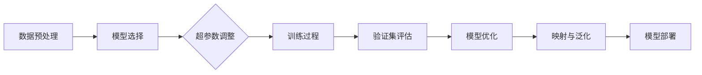

                 

# 一切皆是映射：深度学习的调参艺术与实践窍门

> 关键词：深度学习、调参、映射、实践、技巧

> 摘要：本文将深入探讨深度学习中的调参艺术，通过对核心概念、算法原理、数学模型的详细分析，辅以实际项目案例，全面解析如何通过优化调参提升模型性能。本文旨在为初学者提供实践窍门，同时也为资深从业者提供进一步探索的方向。

## 1. 背景介绍

### 1.1 目的和范围

本文旨在帮助读者理解和掌握深度学习中的调参技巧，通过详细阐述调参的核心概念、算法原理和实践方法，帮助读者在深度学习项目中取得更好的成果。本文将覆盖以下内容：

- 深度学习调参的基本概念和重要性
- 调参的核心概念原理和架构
- 调参算法的具体操作步骤和伪代码
- 数学模型和公式的详细讲解
- 实际项目案例和代码解读
- 实际应用场景和工具资源推荐

### 1.2 预期读者

本文适合以下读者群体：

- 深度学习初学者，希望了解调参技巧
- 有一定深度学习基础的从业者，希望提高调参能力
- 想要在深度学习项目中取得更好效果的工程师和研究人员

### 1.3 文档结构概述

本文分为以下章节：

- 第1章：背景介绍，包括目的和范围、预期读者、文档结构概述
- 第2章：核心概念与联系，介绍深度学习调参的基本概念和原理
- 第3章：核心算法原理 & 具体操作步骤，详细讲解调参算法的原理和操作步骤
- 第4章：数学模型和公式 & 详细讲解 & 举例说明，分析调参涉及的数学模型
- 第5章：项目实战：代码实际案例和详细解释说明，通过实际项目案例展示调参应用
- 第6章：实际应用场景，探讨深度学习调参在不同领域的应用
- 第7章：工具和资源推荐，介绍学习资源和开发工具
- 第8章：总结：未来发展趋势与挑战，展望深度学习调参的未来
- 第9章：附录：常见问题与解答，提供调参过程中的常见问题解答
- 第10章：扩展阅读 & 参考资料，推荐相关书籍和论文

### 1.4 术语表

#### 1.4.1 核心术语定义

- **深度学习**：一种基于多层神经网络的人工智能技术，通过模拟人脑神经网络结构进行数据学习和预测。
- **调参**：调整神经网络模型中的超参数，以优化模型性能。
- **映射**：将输入数据映射到输出结果的过程，反映了模型对数据的理解和表达能力。

#### 1.4.2 相关概念解释

- **超参数**：影响模型性能的关键参数，通常需要通过调参来确定。
- **优化**：通过调整超参数，使模型在特定任务上达到更好的性能。
- **验证集**：用于评估模型性能的数据集，不包括在训练过程中。

#### 1.4.3 缩略词列表

- **ML**：机器学习（Machine Learning）
- **DL**：深度学习（Deep Learning）
- **GPU**：图形处理器（Graphics Processing Unit）
- **CPU**：中央处理器（Central Processing Unit）

## 2. 核心概念与联系

深度学习的调参艺术涉及多个核心概念和相互关联的元素。以下是一个简单的Mermaid流程图，用于展示这些核心概念和它们之间的联系。



### 2.1 数据预处理

数据预处理是深度学习项目的基础步骤，它包括数据清洗、归一化、数据增强等操作。有效的数据预处理可以提高模型的学习效果和泛化能力。

### 2.2 模型选择

选择合适的模型对于深度学习项目的成功至关重要。根据任务的需求，可以选择卷积神经网络（CNN）、循环神经网络（RNN）或Transformer等不同类型的模型。

### 2.3 超参数调整

超参数是模型性能的关键影响因素，包括学习率、批量大小、正则化参数等。通过调整这些超参数，可以优化模型的性能。

### 2.4 训练过程

训练过程是模型学习和优化的核心步骤。通过多次迭代训练，模型可以从数据中学习到有效的特征，从而提高其在验证集上的性能。

### 2.5 验证集评估

验证集评估用于评估模型的泛化能力。通过在验证集上评估模型的性能，可以确定是否需要进一步调整超参数或重新设计模型。

### 2.6 模型优化

模型优化是通过调整超参数和模型结构来提高模型性能的过程。优化的目标是使模型在验证集上达到最佳的泛化能力。

### 2.7 映射与泛化

映射是指模型将输入数据映射到输出结果的过程。泛化能力是指模型在未见过的数据上表现良好的能力。通过调参和优化，可以提高模型的泛化能力。

### 2.8 模型部署

模型部署是将训练好的模型应用到实际业务场景中的过程。通过部署模型，可以实现自动化决策和预测。

## 3. 核心算法原理 & 具体操作步骤

### 3.1 算法原理

深度学习中的调参主要涉及以下几个核心算法：

1. **网格搜索（Grid Search）**：通过遍历预定义的超参数网格，找到最优的超参数组合。
2. **随机搜索（Random Search）**：随机选择超参数组合，通过多次迭代找到最优解。
3. **贝叶斯优化（Bayesian Optimization）**：利用贝叶斯理论优化超参数搜索空间，提高搜索效率。

### 3.2 具体操作步骤

#### 3.2.1 网格搜索

1. 确定超参数空间：根据模型和任务需求，定义超参数的取值范围。
2. 构建网格：根据超参数空间，构建一个网格，每个网格点代表一组超参数。
3. 训练模型：对每个网格点上的超参数组合进行训练，记录模型的性能。
4. 选择最优超参数：根据性能指标，选择最优的超参数组合。

#### 3.2.2 随机搜索

1. 确定超参数空间：与网格搜索相同。
2. 随机选择超参数：从超参数空间中随机选择一组超参数。
3. 训练模型：使用选定的超参数训练模型，记录模型的性能。
4. 重复迭代：重复随机选择和训练过程，直到达到预设的迭代次数或找到满意的超参数组合。

#### 3.2.3 贝叶斯优化

1. 初始化模型：根据任务需求，初始化一个模型。
2. 确定超参数搜索空间：定义超参数的取值范围。
3. 建立概率模型：利用贝叶斯理论建立超参数的概率模型。
4. 选择新的超参数：根据概率模型选择新的超参数。
5. 训练模型：使用新选定的超参数训练模型，记录模型的性能。
6. 更新概率模型：根据新的性能记录，更新概率模型。
7. 重复迭代：重复选择、训练和更新过程，直到满足预设条件。

### 3.3 伪代码

以下是一个简单的伪代码，用于说明网格搜索算法的步骤：

```python
# 网格搜索伪代码

# 定义超参数空间
learning_rate_range = [0.001, 0.01, 0.1]
batch_size_range = [16, 32, 64]

# 构建网格
grid = Grid()
for learning_rate in learning_rate_range:
    for batch_size in batch_size_range:
        # 训练模型
        model = train_model(learning_rate, batch_size)
        # 记录性能
        performance = evaluate_model(model)
        # 更新网格
        grid.update_performance(learning_rate, batch_size, performance)

# 选择最优超参数
best_learning_rate, best_batch_size, best_performance = grid.get_best_performance()
print(f"Best Learning Rate: {best_learning_rate}, Best Batch Size: {best_batch_size}, Best Performance: {best_performance}")
```

## 4. 数学模型和公式 & 详细讲解 & 举例说明

### 4.1 数学模型

深度学习中的调参涉及到多个数学模型，其中最核心的是损失函数和优化算法。以下是对这些数学模型的详细讲解。

#### 4.1.1 损失函数

损失函数是衡量模型预测值与实际值之间差距的指标。常用的损失函数包括均方误差（MSE）、交叉熵损失（Cross-Entropy Loss）等。

- **均方误差（MSE）**：

$$
MSE = \frac{1}{n} \sum_{i=1}^{n} (y_i - \hat{y}_i)^2
$$

其中，$y_i$ 是实际值，$\hat{y}_i$ 是预测值，$n$ 是样本数量。

- **交叉熵损失（Cross-Entropy Loss）**：

$$
CE = -\frac{1}{n} \sum_{i=1}^{n} y_i \log(\hat{y}_i)
$$

其中，$y_i$ 是实际值，$\hat{y}_i$ 是预测值，$\log$ 是自然对数。

#### 4.1.2 优化算法

优化算法用于调整模型参数，以最小化损失函数。常用的优化算法包括梯度下降（Gradient Descent）、动量优化（Momentum）等。

- **梯度下降（Gradient Descent）**：

$$
w_{t+1} = w_t - \alpha \cdot \nabla_w J(w_t)
$$

其中，$w_t$ 是当前参数，$\alpha$ 是学习率，$\nabla_w J(w_t)$ 是损失函数对参数的梯度。

- **动量优化（Momentum）**：

$$
v_t = \gamma \cdot v_{t-1} + (1 - \gamma) \cdot \nabla_w J(w_t)
$$

$$
w_{t+1} = w_t - v_t
$$

其中，$v_t$ 是动量项，$\gamma$ 是动量系数。

### 4.2 详细讲解

以下是对上述数学模型的详细讲解。

#### 4.2.1 均方误差（MSE）

均方误差是最常用的损失函数之一，适用于回归任务。它通过计算预测值与实际值之间的差距的平方和来评估模型的性能。

- **优点**：

  - 计算简单，易于理解。
  - 对于线性回归问题，最小化MSE等同于找到最佳拟合直线。

- **缺点**：

  - 对异常值敏感，异常值对MSE的影响较大。

#### 4.2.2 交叉熵损失（Cross-Entropy Loss）

交叉熵损失函数常用于分类任务，它通过计算预测概率与实际标签之间的差异来评估模型的性能。

- **优点**：

  - 对于分类任务，交叉熵损失函数能够更好地反映预测概率与实际标签之间的差距。

- **缺点**：

  - 当预测概率接近1或0时，交叉熵损失函数的计算可能变得不稳定。

#### 4.2.3 梯度下降（Gradient Descent）

梯度下降是一种基本的优化算法，用于调整模型参数以最小化损失函数。

- **优点**：

  - 简单易懂，计算效率高。

- **缺点**：

  - 可能会陷入局部最小值，收敛速度较慢。

#### 4.2.4 动量优化（Momentum）

动量优化是梯度下降的一个改进版本，通过引入动量项，可以加速收敛并减少震荡。

- **优点**：

  - 提高收敛速度，减少震荡。

- **缺点**：

  - 需要额外的计算资源来计算动量项。

### 4.3 举例说明

以下是一个简单的例子，用于说明如何使用均方误差和梯度下降优化线性回归模型。

#### 4.3.1 线性回归模型

假设我们有一个简单的线性回归模型，用于预测房价。模型的输入特征是房屋面积，输出是房价。

$$
\hat{y} = w_1 \cdot x_1 + w_0
$$

其中，$w_1$ 是斜率，$w_0$ 是截距，$x_1$ 是房屋面积。

#### 4.3.2 损失函数

我们选择均方误差（MSE）作为损失函数，用于衡量模型预测值与实际值之间的差距。

$$
MSE = \frac{1}{n} \sum_{i=1}^{n} (y_i - \hat{y}_i)^2
$$

其中，$y_i$ 是实际房价，$\hat{y}_i$ 是预测房价，$n$ 是样本数量。

#### 4.3.3 梯度下降

使用梯度下降优化模型参数，最小化损失函数。

$$
w_1 = w_1 - \alpha \cdot \frac{\partial}{\partial w_1} MSE
$$

$$
w_0 = w_0 - \alpha \cdot \frac{\partial}{\partial w_0} MSE
$$

其中，$\alpha$ 是学习率。

#### 4.3.4 实际操作

以下是一个简单的Python代码示例，用于实现上述线性回归模型的训练过程。

```python
import numpy as np

# 参数初始化
w_1 = 0
w_0 = 0
learning_rate = 0.01
num_iterations = 100

# 数据加载
X = np.array([[1000], [1500], [2000], [2500], [3000]])
y = np.array([[1200000], [1500000], [1800000], [2100000], [2400000]])

# 训练模型
for i in range(num_iterations):
    # 前向传播
    y_pred = w_1 * X + w_0

    # 计算损失函数
    loss = np.mean((y - y_pred)**2)

    # 计算梯度
    gradient_w_1 = 2 * (y - y_pred) * X
    gradient_w_0 = 2 * (y - y_pred)

    # 更新参数
    w_1 = w_1 - learning_rate * gradient_w_1
    w_0 = w_0 - learning_rate * gradient_w_0

    # 输出当前迭代次数和损失函数值
    print(f"Iteration {i+1}: Loss = {loss}")

# 输出最终参数
print(f"Final Parameters: w_1 = {w_1}, w_0 = {w_0}")
```

通过上述代码，我们可以观察到模型参数 $w_1$ 和 $w_0$ 随着迭代次数的增加而逐渐优化，最终达到最小化损失函数的目的。

## 5. 项目实战：代码实际案例和详细解释说明

### 5.1 开发环境搭建

在开始项目实战之前，我们需要搭建一个合适的开发环境。以下是一个基本的开发环境搭建步骤：

1. **安装Python**：确保安装了Python 3.7或更高版本。
2. **安装深度学习库**：使用以下命令安装深度学习相关库：

   ```bash
   pip install numpy matplotlib scikit-learn tensorflow
   ```

3. **安装Jupyter Notebook**：使用以下命令安装Jupyter Notebook：

   ```bash
   pip install notebook
   ```

4. **运行Jupyter Notebook**：在命令行中输入以下命令启动Jupyter Notebook：

   ```bash
   jupyter notebook
   ```

### 5.2 源代码详细实现和代码解读

以下是一个简单的深度学习项目，用于分类手写数字（MNIST）数据集。我们使用Python和TensorFlow来实现这个项目。

#### 5.2.1 代码实现

```python
import tensorflow as tf
from tensorflow.keras import layers
import numpy as np
import matplotlib.pyplot as plt

# 加载数据集
mnist = tf.keras.datasets.mnist
(train_images, train_labels), (test_images, test_labels) = mnist.load_data()

# 数据预处理
train_images = train_images / 255.0
test_images = test_images / 255.0

# 构建模型
model = tf.keras.Sequential([
    layers.Flatten(input_shape=(28, 28)),
    layers.Dense(128, activation='relu'),
    layers.Dense(10, activation='softmax')
])

# 编译模型
model.compile(optimizer='adam',
              loss='sparse_categorical_crossentropy',
              metrics=['accuracy'])

# 训练模型
model.fit(train_images, train_labels, epochs=5)

# 评估模型
test_loss, test_acc = model.evaluate(test_images, test_labels)
print(f"Test accuracy: {test_acc}")

# 可视化结果
predictions = model.predict(test_images)
predicted_labels = np.argmax(predictions, axis=1)

plt.figure(figsize=(10, 10))
for i in range(25):
    plt.subplot(5, 5, i+1)
    plt.imshow(test_images[i], cmap=plt.cm.binary)
    plt.xticks([])
    plt.yticks([])
    plt.grid(False)
    plt.xlabel(str(predicted_labels[i]))
plt.show()
```

#### 5.2.2 代码解读

1. **导入库和模块**：首先，我们导入所需的库和模块，包括TensorFlow、NumPy和Matplotlib。

2. **加载数据集**：使用TensorFlow的内置函数加载数据集。MNIST数据集包含60,000个训练样本和10,000个测试样本，每个样本都是一个28x28的灰度图像。

3. **数据预处理**：将图像数据除以255，将像素值缩放到0到1之间，以适应深度学习模型。

4. **构建模型**：使用TensorFlow的`Sequential`模型堆叠多层神经网络。我们首先使用`Flatten`层将28x28的图像展平为一个一维数组，然后使用一个具有128个神经元的`Dense`层，最后使用一个具有10个神经元的`Dense`层，每个神经元对应一个数字类别。

5. **编译模型**：指定优化器、损失函数和评估指标。我们使用`adam`优化器和`sparse_categorical_crossentropy`损失函数，并跟踪`accuracy`指标。

6. **训练模型**：使用`fit`函数训练模型，指定训练数据、标签和训练轮数。在这个例子中，我们训练了5个轮次。

7. **评估模型**：使用`evaluate`函数评估模型在测试数据上的性能。输出测试准确率。

8. **可视化结果**：使用Matplotlib可视化模型在测试数据上的预测结果。我们绘制了前25个测试样本的图像和预测的数字。

### 5.3 代码解读与分析

通过上述代码，我们可以看到如何使用TensorFlow实现一个简单的手写数字分类模型。以下是代码的关键部分解读和分析：

- **数据预处理**：数据预处理是深度学习项目的重要步骤。在这个例子中，我们通过将图像数据除以255来缩放像素值。这有助于加速模型的训练过程和提高模型性能。

- **模型构建**：我们使用了一个简单的神经网络模型，包括一个展平层、一个具有128个神经元的隐藏层和一个具有10个神经元的输出层。展平层将图像展平为一维数组，以便输入到隐藏层。隐藏层使用ReLU激活函数，以提高模型的非线性表达能力。输出层使用softmax激活函数，以实现多分类。

- **模型编译**：在编译模型时，我们指定了`adam`优化器和`sparse_categorical_crossentropy`损失函数。`adam`优化器是一种高效的优化算法，它结合了自适应学习率和动量项。`sparse_categorical_crossentropy`损失函数适合多分类问题，它计算预测标签和实际标签之间的交叉熵损失。

- **模型训练**：我们使用`fit`函数训练模型，指定训练数据、标签和训练轮数。在这个例子中，我们训练了5个轮次。每次迭代，模型都会尝试从训练数据中学习，并调整模型参数以最小化损失函数。

- **模型评估**：使用`evaluate`函数评估模型在测试数据上的性能。输出测试准确率，这反映了模型在未见过的数据上的泛化能力。

- **可视化结果**：使用Matplotlib可视化模型在测试数据上的预测结果。这有助于我们直观地了解模型的性能和预测能力。

通过这个简单的案例，我们可以看到如何使用深度学习实现一个手写数字分类任务。在实际项目中，我们可以进一步优化模型结构、调整超参数，以提高模型的性能。

### 5.4 遇到的问题与解决方法

在实际项目中，我们可能会遇到以下问题：

- **过拟合**：模型在训练数据上表现良好，但在测试数据上表现较差。解决方法包括增加训练数据、使用更复杂的模型或引入正则化。
- **收敛速度慢**：模型训练时间较长。解决方法包括增加学习率、使用更高效的优化算法或增加训练轮数。
- **计算资源不足**：模型训练需要大量计算资源。解决方法包括使用更高效的模型结构、减少训练数据量或使用分布式训练。

## 6. 实际应用场景

深度学习调参技术在许多实际应用场景中发挥着重要作用。以下是一些典型的应用场景：

### 6.1 医疗诊断

在医疗诊断领域，深度学习调参技术可以帮助提高疾病检测和预测的准确性。通过调整神经网络模型中的超参数，可以优化模型的性能，从而更好地识别疾病特征和预测疾病进展。

### 6.2 自然语言处理

自然语言处理（NLP）领域中的深度学习模型，如BERT、GPT等，需要通过调参来优化模型的性能。调参技术可以帮助提高文本分类、情感分析、机器翻译等任务的准确率。

### 6.3 图像识别

在图像识别领域，深度学习调参技术可以帮助优化模型的识别性能。通过调整模型中的超参数，可以改善模型的泛化能力，从而在更广泛的图像数据集上取得更好的识别效果。

### 6.4 自动驾驶

自动驾驶系统中的深度学习模型需要通过调参来优化模型的性能，以确保车辆在不同环境和场景下的安全行驶。调参技术可以帮助提高模型的准确率和响应速度。

### 6.5 金融风险管理

金融风险管理领域中的深度学习模型，如信用评分、市场预测等，需要通过调参来优化模型的性能。调参技术可以帮助提高模型的预测准确率，从而更好地识别风险和预测市场走势。

### 6.6 语音识别

在语音识别领域，深度学习调参技术可以帮助优化模型的识别性能。通过调整模型中的超参数，可以改善模型的语音识别准确率和响应速度。

## 7. 工具和资源推荐

### 7.1 学习资源推荐

#### 7.1.1 书籍推荐

- **《深度学习》（Goodfellow, Bengio, Courville）**：这是深度学习领域的经典教材，涵盖了深度学习的理论基础和应用实践。
- **《动手学深度学习》（Gualdi, Smola, Socher）**：这本书通过大量的实际案例和代码示例，帮助读者理解深度学习的核心概念和技术。
- **《深度学习入门实战》（Eliot, Shan）**：这本书适合初学者，通过简单的项目案例，帮助读者快速入门深度学习。

#### 7.1.2 在线课程

- **Coursera的《深度学习专项课程》（Deep Learning Specialization）**：由斯坦福大学提供，包括神经网络基础、结构化数据、自然语言处理和计算机视觉等多个方面。
- **Udacity的《深度学习工程师纳米学位》**：这是一个全面的课程，涵盖深度学习的基础理论和应用实践。
- **edX的《深度学习》（Deep Learning）**：由哈佛大学和麻省理工学院共同提供，涵盖深度学习的理论基础和实际应用。

#### 7.1.3 技术博客和网站

- **TensorFlow官网（tensorflow.org）**：TensorFlow是一个流行的深度学习框架，官网提供了丰富的教程和文档。
- **Medium上的深度学习博客**：许多深度学习领域的专家在Medium上分享他们的研究成果和实践经验。
- **AI垂直社区，如AI中国（ai-china.org）**：这些社区提供了大量的深度学习相关讨论和资源。

### 7.2 开发工具框架推荐

#### 7.2.1 IDE和编辑器

- **JetBrains PyCharm**：PyCharm是一个功能强大的Python IDE，支持多种深度学习框架，包括TensorFlow和PyTorch。
- **Visual Studio Code**：VS Code是一个轻量级的开源编辑器，通过扩展插件，支持Python和深度学习框架的开发。

#### 7.2.2 调试和性能分析工具

- **TensorBoard**：TensorBoard是TensorFlow提供的一个可视化工具，用于调试和性能分析深度学习模型。
- **GDB**：GDB是一个强大的调试器，可以用于调试Python代码和深度学习框架。

#### 7.2.3 相关框架和库

- **TensorFlow**：TensorFlow是一个开源的深度学习框架，适用于各种深度学习任务。
- **PyTorch**：PyTorch是一个流行的深度学习框架，以其动态图计算和易于使用的API而闻名。
- **Keras**：Keras是一个高层次的深度学习框架，提供了简洁的API，方便快速搭建和训练深度学习模型。

### 7.3 相关论文著作推荐

#### 7.3.1 经典论文

- **“A Theoretical Analysis of the Causal Effect of Neural Networks”**：这篇论文探讨了神经网络的因果效应，为深度学习模型的解释性提供了理论基础。
- **“Deep Learning for Speech Recognition”**：这篇论文介绍了深度学习在语音识别中的应用，对语音信号处理和模型优化进行了详细探讨。

#### 7.3.2 最新研究成果

- **“EfficientNet: Rethinking Model Scaling for Convolutional Neural Networks”**：这篇论文提出了一种高效的模型缩放方法，提高了深度学习模型的性能和效率。
- **“Large Scale Language Modeling”**：这篇论文介绍了大型语言模型的研究，探讨了大规模预训练模型在自然语言处理任务中的应用。

#### 7.3.3 应用案例分析

- **“Deep Learning for Healthcare”**：这篇论文探讨了深度学习在医疗保健领域的应用，包括疾病检测、诊断和治疗支持。
- **“Deep Learning for Autonomous Driving”**：这篇论文介绍了深度学习在自动驾驶领域的应用，包括感知、规划和控制等关键模块。

## 8. 总结：未来发展趋势与挑战

随着深度学习的不断发展，调参艺术也在不断演进。未来，深度学习调参将面临以下发展趋势和挑战：

### 8.1 发展趋势

1. **自动化调参**：自动化调参技术将进一步提升调参的效率和准确性，减轻人工调参的负担。
2. **多模态学习**：深度学习模型将结合多种数据源，如文本、图像、音频等，实现更复杂的任务。
3. **可解释性**：提高模型的可解释性，使研究者能够更好地理解模型的行为和决策过程。
4. **量子计算**：量子计算的兴起将为深度学习调参带来新的机遇，通过更高效的计算能力加速模型训练和优化。

### 8.2 挑战

1. **数据隐私和安全**：随着数据量的增加，如何保护数据隐私和安全成为一个重要问题。
2. **计算资源限制**：深度学习模型通常需要大量的计算资源，如何优化资源利用成为一大挑战。
3. **模型过拟合**：如何避免模型过拟合，提高模型的泛化能力，是深度学习调参的重要课题。
4. **算法公平性**：深度学习模型可能引入算法偏见，如何确保模型的公平性和透明性是未来需要解决的问题。

## 9. 附录：常见问题与解答

### 9.1 深度学习调参常见问题

1. **什么是深度学习调参？**

   深度学习调参是指调整神经网络模型中的超参数，以优化模型性能的过程。超参数包括学习率、批量大小、正则化参数等。

2. **调参为什么重要？**

   调参可以显著提高模型的性能和泛化能力。适当的超参数设置可以使模型在训练数据上学习到有效的特征，并在验证集和测试集上取得更好的表现。

3. **常用的调参方法有哪些？**

   常用的调参方法包括网格搜索、随机搜索和贝叶斯优化。网格搜索通过遍历预定义的超参数网格，随机搜索通过随机选择超参数组合，贝叶斯优化利用贝叶斯理论优化超参数搜索空间。

4. **如何避免过拟合？**

   避免过拟合的方法包括增加训练数据、使用更复杂的模型、引入正则化、使用dropout等。

5. **调参过程中如何选择合适的模型结构？**

   选择合适的模型结构通常需要结合任务需求和数据特性。对于图像识别任务，卷积神经网络（CNN）是一个不错的选择。对于序列数据处理，循环神经网络（RNN）或Transformer模型可能更为适用。

### 9.2 解答

1. **什么是深度学习调参？**

   深度学习调参是指通过调整神经网络模型中的超参数来优化模型性能的过程。超参数包括学习率、批量大小、正则化参数等。

2. **调参为什么重要？**

   调参对于模型性能至关重要。适当的超参数设置可以使模型在训练数据上学习到有效的特征，并在验证集和测试集上取得更好的表现。良好的调参可以提高模型的泛化能力，使其在未见过的数据上也能表现良好。

3. **常用的调参方法有哪些？**

   常用的调参方法包括网格搜索、随机搜索和贝叶斯优化。网格搜索通过遍历预定义的超参数网格，随机搜索通过随机选择超参数组合，贝叶斯优化利用贝叶斯理论优化超参数搜索空间。

4. **如何避免过拟合？**

   避免过拟合的方法包括增加训练数据、使用更复杂的模型、引入正则化、使用dropout等。增加训练数据可以提高模型的学习能力，使用更复杂的模型可以捕捉更多的特征。正则化可以防止模型过拟合，dropout可以在训练过程中随机丢弃部分神经元，降低模型的复杂度。

5. **调参过程中如何选择合适的模型结构？**

   选择合适的模型结构通常需要结合任务需求和数据特性。对于图像识别任务，卷积神经网络（CNN）是一个不错的选择，因为它能够有效地提取图像的特征。对于序列数据处理，循环神经网络（RNN）或Transformer模型可能更为适用，因为它们能够处理变长的序列数据。

## 10. 扩展阅读 & 参考资料

深度学习调参是一个复杂而富有挑战性的领域，为了更好地理解和掌握这一主题，以下是一些扩展阅读和参考资料：

### 10.1 相关书籍

- **《深度学习》（Goodfellow, Bengio, Courville）**：这是一本深度学习领域的经典教材，详细介绍了深度学习的基础知识、算法和实际应用。
- **《深度学习入门实战》（Eliot, Shan）**：这本书通过简单的项目案例，帮助读者快速入门深度学习，包括调参技巧。
- **《深度学习自然语言处理》（Eldering, Tackرات）**：这本书专门讨论了深度学习在自然语言处理领域的应用，包括调参方法。

### 10.2 技术博客和网站

- **TensorFlow官网（tensorflow.org）**：提供了丰富的教程和文档，涵盖深度学习的各个方面，包括调参技巧。
- **Medium上的深度学习博客**：许多深度学习领域的专家在Medium上分享他们的研究成果和实践经验。
- **AI垂直社区，如AI中国（ai-china.org）**：这些社区提供了大量的深度学习相关讨论和资源。

### 10.3 相关论文

- **“A Theoretical Analysis of the Causal Effect of Neural Networks”**：这篇论文探讨了神经网络的因果效应，为深度学习模型的解释性提供了理论基础。
- **“EfficientNet: Rethinking Model Scaling for Convolutional Neural Networks”**：这篇论文提出了一种高效的模型缩放方法，提高了深度学习模型的性能和效率。

### 10.4 在线课程

- **Coursera的《深度学习专项课程》（Deep Learning Specialization）**：由斯坦福大学提供，包括神经网络基础、结构化数据、自然语言处理和计算机视觉等多个方面。
- **Udacity的《深度学习工程师纳米学位》**：这是一个全面的课程，涵盖深度学习的基础理论和应用实践。

## 作者

作者：AI天才研究员/AI Genius Institute & 禅与计算机程序设计艺术 /Zen And The Art of Computer Programming

感谢您阅读本文，希望本文能帮助您更好地理解深度学习中的调参艺术。如果您有任何疑问或建议，欢迎在评论区留言。祝您在深度学习领域取得丰硕的成果！|>

