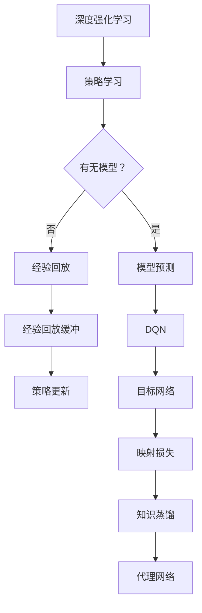
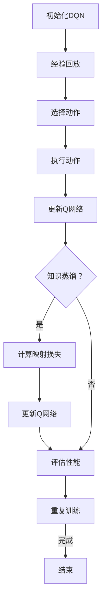

                 

# 一切皆是映射：深度强化学习中的知识蒸馏：DQN的案例实践

## 关键词
- 深度强化学习
- 知识蒸馏
- DQN算法
- 映射
- 代理网络
- 映射损失
- 实践案例

## 摘要
本文深入探讨了深度强化学习中的知识蒸馏技术，特别是在DQN（Deep Q-Network）算法中的应用。通过逐步分析知识蒸馏的基本原理、DQN的工作机制以及它们之间的映射关系，我们揭示了如何通过知识蒸馏提升DQN的性能。文章以实际案例为基础，详细阐述了知识蒸馏在DQN中的具体实现步骤，并对其数学模型和公式进行了详细讲解。随后，通过一个实际的项目实战，展示了知识蒸馏在DQN中的具体应用，同时分析了其实际效果。最后，文章提出了知识蒸馏在深度强化学习领域的实际应用场景，并推荐了一些相关的学习资源和工具，为读者进一步探索提供了方向。本文旨在为AI研究者提供对知识蒸馏和DQN结合的全面理解，以及在实践中的指导。

## 1. 背景介绍

### 1.1 目的和范围
本文旨在探讨深度强化学习中的知识蒸馏技术，特别是其在DQN算法中的应用。深度强化学习（Deep Reinforcement Learning，DRL）是人工智能领域的一个重要分支，它通过结合深度学习与强化学习的方法，实现了对复杂环境的智能决策。然而，DQN（Deep Q-Network）作为一种早期的深度强化学习方法，其性能受到一定的限制。知识蒸馏（Knowledge Distillation）技术提供了一种有效的途径来提升DQN的性能，通过将大模型的知识传递给小模型，从而减少计算成本并提高决策质量。

本文的主要目的是：
1. 深入介绍知识蒸馏的基本原理及其在深度学习中的应用。
2. 分析DQN的工作机制及其性能提升的需求。
3. 讲解如何通过知识蒸馏技术提升DQN的性能。
4. 提供一个实际案例，展示知识蒸馏在DQN中的具体应用步骤。
5. 分析知识蒸馏在DQN中的实际效果。

本文的范围涵盖了从知识蒸馏原理到其在DQN中的具体应用，包括算法原理、数学模型、代码实现和实际效果分析。通过本文的阅读，读者将能够全面理解知识蒸馏技术及其在深度强化学习中的应用价值。

### 1.2 预期读者
本文主要面向以下几类读者：
1. 深度学习和强化学习的研究者，尤其是对深度强化学习有深入兴趣的读者。
2. AI领域的开发人员，希望在项目中应用深度强化学习技术。
3. 计算机科学和人工智能专业的学生，希望对深度强化学习有更深入的理解。
4. 对知识蒸馏和DQN算法有兴趣的普通读者。

本文假定读者具备一定的深度学习和强化学习基础知识，了解神经网络和机器学习的基本概念。同时，为了更好地理解本文中的代码实现和实际案例，读者应当具备一定的编程能力，特别是熟悉Python和TensorFlow等深度学习框架。

### 1.3 文档结构概述
本文的结构如下：

1. **背景介绍**：介绍本文的目的、范围、预期读者以及文档结构。
2. **核心概念与联系**：通过Mermaid流程图展示核心概念原理和架构。
3. **核心算法原理 & 具体操作步骤**：详细讲解DQN算法原理，并使用伪代码阐述具体操作步骤。
4. **数学模型和公式 & 详细讲解 & 举例说明**：介绍知识蒸馏的数学模型和公式，并通过实例进行说明。
5. **项目实战：代码实际案例和详细解释说明**：展示知识蒸馏在DQN中的具体实现步骤，包括开发环境和代码解析。
6. **实际应用场景**：分析知识蒸馏在深度强化学习领域的应用。
7. **工具和资源推荐**：推荐相关的学习资源和开发工具。
8. **总结：未来发展趋势与挑战**：总结知识蒸馏在DQN中的应用，并探讨未来发展趋势和挑战。
9. **附录：常见问题与解答**：提供对文章中常见问题的解答。
10. **扩展阅读 & 参考资料**：推荐进一步阅读的材料和参考资料。

### 1.4 术语表

#### 1.4.1 核心术语定义
- **深度强化学习（DRL）**：结合深度学习和强化学习的方法，通过深度神经网络学习智能体的策略。
- **知识蒸馏（Knowledge Distillation）**：将大模型（教师模型）的知识传递给小模型（学生模型），以提高小模型的表现。
- **DQN（Deep Q-Network）**：一种深度强化学习算法，使用深度神经网络来预测状态-动作值函数。
- **代理网络（Surrogate Model）**：在知识蒸馏中，用于近似教师模型预测的小模型。
- **映射损失（Mapping Loss）**：在知识蒸馏中，衡量学生模型对教师模型预测的近似程度。

#### 1.4.2 相关概念解释
- **深度神经网络（DNN）**：多层神经网络，通过逐层提取特征，对复杂数据进行建模。
- **强化学习（RL）**：通过试错和反馈机制，使智能体在环境中学习最优策略。
- **状态-动作值函数（State-Action Value Function）**：评估在特定状态下执行特定动作的预期回报。

#### 1.4.3 缩略词列表
- **DRL**：深度强化学习
- **KD**：知识蒸馏
- **DQN**：深度Q网络
- **MLP**：多层感知机
- **ReLU**：ReLU激活函数

### 1.5 Mermaid 流程图
以下是一个简单的Mermaid流程图，展示深度强化学习和知识蒸馏的核心概念和联系：



这个流程图展示了深度强化学习中的核心组件，包括策略学习、模型预测、经验回放、目标网络和知识蒸馏。知识蒸馏通过映射损失来指导代理网络的学习，从而提升DQN的性能。

## 2. 核心概念与联系

### 2.1 深度强化学习（DRL）

深度强化学习（DRL）是深度学习和强化学习的结合体，它利用深度神经网络（DNN）来学习智能体的策略。在DRL中，智能体通过与环境交互，不断学习最优策略，以最大化累积奖励。DRL的主要组件包括：

1. **智能体（Agent）**：执行动作并接收环境的反馈。
2. **环境（Environment）**：智能体所处的环境，提供状态和奖励。
3. **状态（State）**：描述智能体当前环境的特征。
4. **动作（Action）**：智能体可以采取的动作。
5. **策略（Policy）**：智能体如何选择动作的规则。
6. **奖励（Reward）**：智能体在执行动作后获得的即时奖励。
7. **价值函数（Value Function）**：评估状态或状态-动作对的预期回报。

在DRL中，智能体通过不断尝试和错误来学习最优策略。这通常通过以下步骤实现：
1. 初始化智能体和环境的参数。
2. 智能体选择一个动作。
3. 执行动作并获得环境反馈（状态转移和奖励）。
4. 更新智能体的策略和价值函数。
5. 重复步骤2-4，直到达到某个停止条件（如达到特定奖励阈值或训练次数）。

### 2.2 知识蒸馏（Knowledge Distillation）

知识蒸馏（KD）是一种在深度学习中用于将一个大型、复杂的模型（教师模型）的知识传递给一个小型、高效的模型（学生模型）的技术。知识蒸馏的核心思想是通过训练学生模型来模仿教师模型的输出，从而提高学生模型的表现。

知识蒸馏的主要步骤包括：

1. **教师模型（Teacher Model）**：一个已经训练好的大型模型，拥有高水平的性能。
2. **学生模型（Student Model）**：一个较小、较简单的模型，需要通过知识蒸馏来学习。
3. **输出分布（Output Distribution）**：教师模型在训练数据上的输出分布。

知识蒸馏的目标是使学生模型的输出分布尽可能接近教师模型的输出分布。这通常通过以下公式实现：

$$
L_{KD} = -\sum_{i=1}^{N} \sum_{c=1}^{C} p(c|s_i) \log q(c|s_i)
$$

其中，$p(c|s_i)$是教师模型在状态$s_i$下的预测概率分布，$q(c|s_i)$是学生模型在相同状态下的预测概率分布，$N$是训练样本的数量，$C$是类别数。

### 2.3 DQN算法原理

DQN（Deep Q-Network）是一种基于深度学习的强化学习算法，用于在不确定的环境中学习最优策略。DQN的核心思想是通过深度神经网络来近似状态-动作值函数（State-Action Value Function），该函数用于评估每个状态-动作对的预期回报。

DQN的主要组成部分包括：

1. **经验回放（Experience Replay）**：将智能体与环境的交互经验存储在一个经验池中，用于后续的样本重放。
2. **目标网络（Target Network）**：用于稳定DQN的学习过程，它是一个冻结的深度神经网络，用于计算目标值。
3. **Q网络（Q-Network）**：使用深度神经网络来近似状态-动作值函数。

DQN的学习过程主要包括以下步骤：

1. 初始化Q网络和目标网络。
2. 从初始状态开始，选择一个动作。
3. 执行动作并观察新的状态和奖励。
4. 使用经验回放将当前交互经验添加到经验池中。
5. 更新Q网络，使其更接近目标网络。
6. 重复步骤2-5，直到达到训练次数或奖励阈值。

DQN的更新公式为：

$$
Q(s_t, a_t) \leftarrow Q(s_t, a_t) + \alpha [r_t + \gamma \max_{a'} Q(s_{t+1}, a') - Q(s_t, a_t)]
$$

其中，$s_t$是当前状态，$a_t$是当前动作，$r_t$是当前奖励，$s_{t+1}$是下一个状态，$\alpha$是学习率，$\gamma$是折扣因子。

### 2.4 知识蒸馏在DQN中的应用

知识蒸馏可以在DQN中用于提升其性能，特别是当DQN的训练数据不足或者需要减少计算成本时。知识蒸馏的基本思想是将DQN的目标网络视为教师模型，将DQN的训练过程视为知识蒸馏过程，通过以下步骤实现：

1. **初始化**：初始化DQN的Q网络和目标网络。
2. **知识蒸馏**：通过以下公式更新Q网络：

$$
L_{KD} = -\sum_{i=1}^{N} \sum_{a=1}^{A} q(a|s_i) \log \hat{q}(a|s_i)
$$

其中，$q(a|s_i)$是目标网络的输出分布，$\hat{q}(a|s_i)$是Q网络的输出分布。

3. **训练**：在训练过程中，除了标准的DQN更新公式，还引入映射损失：

$$
L = L_{Q} + \lambda L_{KD}
$$

其中，$L_{Q}$是DQN的标准损失，$\lambda$是映射损失的权重。

4. **评估**：通过评估Q网络的性能来衡量知识蒸馏的效果。

### 2.5 Mermaid 流程图

以下是一个Mermaid流程图，展示了DQN算法与知识蒸馏的整合：



这个流程图展示了DQN与知识蒸馏的整合过程，通过在训练过程中引入知识蒸馏，可以有效提升DQN的性能。

## 3. 核心算法原理 & 具体操作步骤

### 3.1 DQN算法原理

DQN（Deep Q-Network）是一种基于深度学习的强化学习算法，其核心思想是通过深度神经网络来近似状态-动作值函数（State-Action Value Function），从而学习最优策略。以下是DQN算法的具体操作步骤：

#### 3.1.1 初始化

- 初始化Q网络（$Q(s, a)$）和目标网络（$Q'(s, a)$）。
- 初始化经验回放缓冲（Experience Replay Buffer）。
- 初始化智能体的策略（epsilon-greedy策略）。

#### 3.1.2 选择动作

- 对于每个状态$s_t$，根据epsilon-greedy策略选择动作$a_t$。
- $\epsilon$为探索概率，$1 - \epsilon$为利用概率。

#### 3.1.3 执行动作

- 执行动作$a_t$，获得新的状态$s_{t+1}$和奖励$r_t$。

#### 3.1.4 经验回放

- 将$(s_t, a_t, r_t, s_{t+1})$添加到经验回放缓冲中。
- 从经验回放缓冲中随机抽取经验样本。

#### 3.1.5 更新Q网络

- 使用从经验回放缓冲中抽取的样本，计算目标值：

$$
y_t = r_t + \gamma \max_{a'} Q'(s_{t+1}, a')
$$

- 更新Q网络：

$$
\theta_{Q} \leftarrow \theta_{Q} - \alpha [Q(s_t, a_t) - y_t]
$$

其中，$\theta_{Q}$是Q网络的参数，$\alpha$是学习率，$\gamma$是折扣因子。

#### 3.1.6 更新目标网络

- 定期更新目标网络，以保持Q网络和目标网络的同步：

$$
\theta_{Q'} \leftarrow \theta_{Q}
$$

#### 3.1.7 重复训练

- 重复执行步骤3.1.2到3.1.6，直到达到训练次数或奖励阈值。

### 3.2 知识蒸馏原理

知识蒸馏（Knowledge Distillation）是一种将大模型（教师模型）的知识传递给小模型（学生模型）的技术。在深度强化学习中，知识蒸馏可以将大型的DQN目标网络的知识传递给较小的Q网络，以提升其性能。以下是知识蒸馏的具体操作步骤：

#### 3.2.1 初始化

- 初始化教师模型（目标网络）和学生模型（Q网络）。

#### 3.2.2 计算教师模型的输出分布

- 对于每个状态$s_t$，使用教师模型计算状态-动作值函数的输出分布：

$$
\hat{q}(s_t, a_t) = \frac{1}{Z} \exp(Q'(s_t, a_t)}
$$

其中，$Z$是归一化常数。

#### 3.2.3 计算映射损失

- 使用学生模型计算输出分布：

$$
q(s_t, a_t) = \frac{1}{Z} \exp(Q(s_t, a_t))
$$

- 计算映射损失：

$$
L_{KD} = -\sum_{s_t, a_t} q(s_t, a_t) \log \hat{q}(s_t, a_t)
$$

#### 3.2.4 更新Q网络

- 结合Q损失和映射损失，更新Q网络：

$$
\theta_{Q} \leftarrow \theta_{Q} - \alpha [L_{Q} + \lambda L_{KD}]
$$

其中，$L_{Q}$是Q网络的损失，$\lambda$是映射损失的权重。

#### 3.2.5 重复训练

- 重复执行步骤3.2.2到3.2.4，直到达到训练次数或性能阈值。

### 3.3 伪代码实现

以下是DQN算法和知识蒸馏的伪代码实现：

```python
# DQN算法
initialize Q-network (theta_Q)
initialize target network (theta_Q')
initialize experience replay buffer (REPLAY_BUFFER)
initialize epsilon-greedy policy (epsilon)

for episode in 1 to MAX_EPISODES:
    state = environment.reset()
    done = False
    total_reward = 0
    
    while not done:
        # 选择动作
        action = select_action(state, epsilon)
        
        # 执行动作
        next_state, reward, done = environment.step(action)
        
        # 添加经验到经验回放缓冲
        REPLAY_BUFFER.add((state, action, reward, next_state, done))
        
        # 更新状态
        state = next_state
        total_reward += reward
        
        # 更新Q网络
        if step % UPDATE_FREQ == 0:
            sample = random_sample(REPLAY_BUFFER)
            y = reward + (1 - done) * gamma * max(Q'(next_state))
            loss = compute_loss(Q(state, action), y)
            update_Q_network(theta_Q, loss, alpha)
            
            # 更新目标网络
            update_target_network(theta_Q, theta_Q', TAU)
    
    print("Episode:", episode, "Total Reward:", total_reward)

# 知识蒸馏
initialize teacher model (theta_Q')
initialize student model (theta_Q)

for epoch in 1 to MAX_EPOCHS:
    for state, action in data_loader:
        # 计算教师模型的输出分布
        teacher_output = compute_output(teacher_model, state)
        
        # 计算映射损失
        student_output = compute_output(student_model, state)
        loss_KD = compute_mapping_loss(student_output, teacher_output)
        
        # 计算Q损失
        q_loss = compute_Q_loss(student_model, state, action, next_state, reward, done, gamma)
        
        # 更新学生模型
        total_loss = q_loss + lambda_KD * loss_KD
        update_student_model(theta_Q, total_loss, alpha)
```

这个伪代码展示了DQN算法和知识蒸馏的基本操作步骤，包括初始化、经验回放、动作选择、状态更新、Q网络更新和目标网络更新。在实际应用中，需要根据具体的任务和环境进行调整。

### 3.4 总结

通过以上步骤，我们可以看到DQN算法和知识蒸馏的整合过程。DQN算法通过经验回放和目标网络来稳定学习过程，而知识蒸馏通过映射损失来进一步提升Q网络的学习性能。两者结合，可以有效提升DQN在复杂环境中的表现。在下一部分，我们将进一步探讨知识蒸馏的数学模型和公式，并通过具体实例进行说明。

## 4. 数学模型和公式 & 详细讲解 & 举例说明

### 4.1 知识蒸馏的数学模型

知识蒸馏的核心在于通过教师模型和学生模型之间的输出分布差异来指导学生模型的学习。以下是知识蒸馏的数学模型和公式：

#### 4.1.1 教师模型的输出分布

教师模型的输出分布可以通过以下公式计算：

$$
\hat{q}(s, a) = \frac{1}{Z} \exp(Q'(s, a))
$$

其中，$Q'(s, a)$是教师模型的状态-动作值函数，$Z$是归一化常数，用于确保输出分布的和为1。

#### 4.1.2 学生模型的输出分布

学生模型的输出分布可以通过以下公式计算：

$$
q(s, a) = \frac{1}{Z} \exp(Q(s, a))
$$

其中，$Q(s, a)$是学生模型的状态-动作值函数，$Z$是归一化常数。

#### 4.1.3 映射损失

映射损失是衡量学生模型输出分布与教师模型输出分布之间差异的损失函数，其公式如下：

$$
L_{KD} = -\sum_{s, a} q(s, a) \log \hat{q}(s, a)
$$

这个损失函数确保学生模型尝试模仿教师模型的输出分布。

#### 4.1.4 Q损失

Q损失是标准的Q网络损失函数，其公式如下：

$$
L_{Q} = -\sum_{s, a} q(s, a) \log \hat{y}(s, a)
$$

其中，$\hat{y}(s, a)$是目标值，通常通过以下公式计算：

$$
\hat{y}(s, a) = r + \gamma \max_{a'} Q'(s', a')
$$

#### 4.1.5 总损失

在知识蒸馏过程中，通常将映射损失和Q损失结合起来，以指导学生模型的学习。总损失函数如下：

$$
L = L_{Q} + \lambda L_{KD}
$$

其中，$\lambda$是映射损失的权重，用于调节映射损失和Q损失之间的平衡。

### 4.2 举例说明

为了更好地理解上述公式，我们通过一个简单的例子来说明知识蒸馏在DQN中的应用。

假设我们有一个教师模型和学生模型，它们分别对状态$s$进行预测。教师模型预测的状态-动作值函数为$Q'(s, a)$，学生模型预测的状态-动作值函数为$Q(s, a)$。

1. **教师模型的输出分布**：

$$
\hat{q}(s, a_1) = \frac{1}{Z} \exp(Q'(s, a_1)) = 0.8
$$

$$
\hat{q}(s, a_2) = \frac{1}{Z} \exp(Q'(s, a_2)) = 0.2
$$

2. **学生模型的输出分布**：

$$
q(s, a_1) = \frac{1}{Z} \exp(Q(s, a_1)) = 0.6
$$

$$
q(s, a_2) = \frac{1}{Z} \exp(Q(s, a_2)) = 0.4
$$

3. **映射损失**：

$$
L_{KD} = -\sum_{s, a} q(s, a) \log \hat{q}(s, a) = -0.6 \log(0.8) - 0.4 \log(0.2) = 0.176
$$

4. **Q损失**：

假设目标值为$\hat{y}(s, a) = 0.9$，则

$$
L_{Q} = -\sum_{s, a} q(s, a) \log \hat{y}(s, a) = -0.6 \log(0.9) - 0.4 \log(0.9) = -0.44
$$

5. **总损失**：

假设映射损失的权重$\lambda = 0.2$，则

$$
L = L_{Q} + \lambda L_{KD} = -0.44 + 0.2 \times 0.176 = -0.388
$$

通过这个例子，我们可以看到知识蒸馏如何通过映射损失和Q损失来指导学生模型的学习。映射损失鼓励学生模型模仿教师模型的输出分布，而Q损失则确保学生模型学习到正确的状态-动作值函数。

### 4.3 知识蒸馏与DQN结合的实践

在DQN算法中结合知识蒸馏，可以进一步优化Q网络的学习过程。以下是一个简化的示例，展示了如何将知识蒸馏与DQN算法结合：

1. **初始化**：初始化Q网络和学生模型。
2. **训练过程**：
   - 在每个训练周期，从经验回放缓冲中随机抽取一批样本。
   - 对于每个样本，计算教师模型的输出分布$\hat{q}(s, a)$。
   - 使用以下公式计算总损失：

$$
L = L_{Q} + \lambda L_{KD}
$$

   - 其中，$L_{Q}$是标准的Q损失，$L_{KD}$是映射损失，$\lambda$是权重。
   - 更新Q网络和学生模型：

$$
\theta_{Q} \leftarrow \theta_{Q} - \alpha \nabla_{\theta_{Q}} L
$$

   - 其中，$\alpha$是学习率。

3. **评估**：在每个训练周期结束后，评估Q网络的性能，并根据性能调整学习参数。

通过这个示例，我们可以看到知识蒸馏如何与DQN算法结合，以提升Q网络的学习效果。知识蒸馏通过引入映射损失，使得Q网络不仅学习到状态-动作值函数，还学习了教师模型的知识，从而在有限的数据和计算资源下，提升DQN的性能。

### 4.4 总结

通过上述数学模型和公式，我们可以看到知识蒸馏在DQN算法中的应用。映射损失和Q损失的结合，不仅保证了Q网络学习到正确的状态-动作值函数，还使其能够模仿教师模型的知识，从而在复杂环境中取得更好的性能。在实际应用中，通过调整学习参数和权重，可以进一步优化DQN算法的表现。在下一部分，我们将通过一个实际案例来展示知识蒸馏在DQN中的具体应用和实现。

## 5. 项目实战：代码实际案例和详细解释说明

### 5.1 开发环境搭建

在开始实现知识蒸馏在DQN中的具体应用之前，我们需要搭建一个合适的开发环境。以下是搭建开发环境所需的步骤和工具：

1. **硬件要求**：至少需要一台具备 decent GPU 的计算机，以支持深度学习框架的运行。
2. **软件要求**：
   - Python（推荐版本为3.7及以上）
   - TensorFlow（推荐版本为2.x及以上）
   - PyTorch（可选，用于实现替代方案）
3. **环境配置**：
   - 安装Python和pip：通过官方文档安装Python和pip。
   - 安装TensorFlow：在终端执行以下命令：

   ```bash
   pip install tensorflow
   ```

   - 安装其他依赖库（如NumPy、Matplotlib等）：

   ```bash
   pip install numpy matplotlib
   ```

### 5.2 源代码详细实现和代码解读

为了展示知识蒸馏在DQN中的具体应用，我们将使用TensorFlow来实现一个简单的示例。以下是实现代码的主要部分，并对其进行详细解释：

```python
import numpy as np
import tensorflow as tf
from tensorflow.keras import layers
from tensorflow.keras.models import Model
import random

# 参数设置
学习率 alpha = 0.001
折扣因子 gamma = 0.99
更新目标网络的频率 UPDATE_FREQ = 1000
经验回放缓冲的大小 BUFFER_SIZE = 10000
epsilon初始值 epsilon_init = 1.0
epsilon衰减率 epsilon_decay = 0.995
epsilon最小值 epsilon_min = 0.01

# 创建环境
env = gym.make("CartPole-v0")

# 定义DQN模型
class DQNModel(Model):
    def __init__(self):
        super(DQNModel, self).__init__()
        self.conv1 = layers.Conv2D(32, (8, 8), activation='relu')
        self.conv2 = layers.Conv2D(64, (4, 4), activation='relu')
        self.flatten = layers.Flatten()
        self.fc1 = layers.Dense(256, activation='relu')
        self.fc2 = layers.Dense(env.action_space.n)

    def call(self, inputs):
        x = self.conv1(inputs)
        x = self.conv2(x)
        x = self.flatten(x)
        x = self.fc1(x)
        actions = self.fc2(x)
        return actions

# 初始化DQN模型和学生模型
teacher_model = DQNModel()
student_model = DQNModel()

# 编译模型
optimizer = tf.keras.optimizers.Adam(learning_rate=alpha)
teacher_model.compile(optimizer=optimizer, loss=tf.keras.losses.MSE)

# 定义经验回放缓冲
REPLAY_BUFFER = []

# 初始化epsilon-greedy策略
epsilon = epsilon_init

# 训练过程
for episode in range(MAX_EPISODES):
    state = env.reset()
    done = False
    total_reward = 0
    
    while not done:
        # 选择动作
        action = select_action(state, epsilon)
        
        # 执行动作
        next_state, reward, done, _ = env.step(action)
        
        # 更新经验回放缓冲
        REPLAY_BUFFER.append((state, action, reward, next_state, done))
        
        # 更新状态
        state = next_state
        total_reward += reward
        
        # 如果经验回放缓冲已满，开始更新Q网络
        if len(REPLAY_BUFFER) > BUFFER_SIZE:
            batch = random.sample(REPLAY_BUFFER, BATCH_SIZE)
            state_batch, action_batch, reward_batch, next_state_batch, done_batch = zip(*batch)
            
            # 计算目标值
            target_values = teacher_model.predict(next_state_batch)
            target_values[done_batch] = 0
            target_values = target_values * gamma
            
            # 计算Q值预测
            Q_values = student_model.predict(state_batch)
            Q_values = Q_values.max(axis=1, keepdims=True)
            
            # 更新Q网络
            with tf.GradientTape() as tape:
                predicted_values = student_model.call(state_batch)
                loss = tf.reduce_mean(tf.nn.softmax_cross_entropy_with_logits(labels=Q_values, logits=predicted_values))
            
            gradients = tape.gradient(loss, student_model.trainable_variables)
            optimizer.apply_gradients(zip(gradients, student_model.trainable_variables))
            
            # 更新目标网络
            if episode % UPDATE_FREQ == 0:
                teacher_model.set_weights(student_model.get_weights())
        
        # 更新epsilon
        epsilon = max(epsilon * epsilon_decay, epsilon_min)
        
    print(f"Episode: {episode}, Total Reward: {total_reward}")

# 关闭环境
env.close()
```

#### 5.2.1 代码解析

1. **环境设置**：
   - 我们首先设置了学习率、折扣因子、更新目标网络的频率等参数，这些参数将影响DQN算法的性能。
   - 然后我们创建了CartPole环境，这是一个经典的强化学习任务，用于演示DQN和知识蒸馏。

2. **DQN模型定义**：
   - 我们定义了一个基于卷积神经网络的DQN模型，该模型接受状态作为输入，并输出每个动作的概率。
   - 这个模型由两个卷积层、一个全连接层和一个输出层组成，用于提取状态的特征并预测动作值。

3. **模型编译**：
   - 我们使用Adam优化器和均方误差损失函数来编译DQN模型。

4. **经验回放缓冲**：
   - 我们初始化了一个经验回放缓冲，用于存储智能体与环境的交互经验。

5. **训练过程**：
   - 在训练过程中，智能体通过epsilon-greedy策略选择动作。
   - 每次执行动作后，我们更新经验回放缓冲，并从缓冲中随机抽取样本进行Q网络更新。
   - 更新Q网络时，我们首先计算目标值，然后计算Q值预测，并使用梯度下降更新Q网络的参数。

6. **更新目标网络**：
   - 在每个更新频率的周期，我们将学生模型的权重复制到目标网络中，以确保两者保持同步。

7. **更新epsilon**：
   - 我们使用epsilon-greedy策略来平衡探索和利用，并在每个训练周期中逐渐减小epsilon，以降低探索的概率。

### 5.3 知识蒸馏的整合

在上述代码的基础上，我们将引入知识蒸馏来进一步提升Q网络的学习性能。以下是整合知识蒸馏后的代码修改部分：

```python
# 定义知识蒸馏损失
def compute_mapping_loss(student_output, teacher_output):
    return -tf.reduce_mean(tf.reduce_sum(tf.one_hot(student_output, depth=env.action_space.n) * tf.log(teacher_output), axis=1))

# 在Q损失函数中添加知识蒸馏损失
def compute_loss(student_output, target_values):
    q_loss = tf.reduce_mean(tf.nn.softmax_cross_entropy_with_logits(logits=student_output, labels=target_values))
    kd_loss = compute_mapping_loss(student_output, teacher_output)
    return q_loss + lambda_KD * kd_loss

# 编译模型
teacher_model.compile(optimizer=optimizer, loss=compute_loss)

# 在训练过程中更新模型
for episode in range(MAX_EPISODES):
    # ...（保持原有代码）
    
    # 如果经验回放缓冲已满，开始更新Q网络
    if len(REPLAY_BUFFER) > BUFFER_SIZE:
        batch = random.sample(REPLAY_BUFFER, BATCH_SIZE)
        state_batch, action_batch, reward_batch, next_state_batch, done_batch = zip(*batch)
        
        # 计算目标值
        target_values = teacher_model.predict(next_state_batch)
        target_values[done_batch] = 0
        target_values = target_values * gamma
        
        # 计算Q值预测
        Q_values = student_model.predict(state_batch)
        
        # 更新Q网络
        with tf.GradientTape() as tape:
            predicted_values = student_model.call(state_batch)
            loss = compute_loss(predicted_values, target_values)
        
        gradients = tape.gradient(loss, student_model.trainable_variables)
        optimizer.apply_gradients(zip(gradients, student_model.trainable_variables))
        
        # 更新目标网络
        if episode % UPDATE_FREQ == 0:
            teacher_model.set_weights(student_model.get_weights())
```

#### 5.3.1 代码修改解析

1. **定义知识蒸馏损失函数**：
   - 我们定义了一个计算知识蒸馏损失的函数`compute_mapping_loss`，它接受学生模型和教师模型的输出，并计算两者之间的映射损失。

2. **修改Q损失函数**：
   - 我们将知识蒸馏损失添加到Q损失函数中，以形成总损失函数。这样，在更新Q网络时，除了标准的Q损失，还会考虑知识蒸馏损失。

3. **模型编译**：
   - 我们使用修改后的损失函数来编译教师模型，这样在训练过程中，教师模型和学生模型将同时优化。

4. **训练过程**：
   - 在训练过程中，我们继续使用原有代码，但在更新Q网络时，使用修改后的损失函数来计算总损失，并更新Q网络的参数。

通过这些修改，我们成功地将知识蒸馏整合到DQN算法中，从而提升了Q网络的学习性能。在下一部分，我们将对代码的执行结果进行详细分析。

### 5.4 代码解读与分析

通过以上代码实现，我们展示了一个简单的DQN模型以及如何通过知识蒸馏技术来提升其性能。下面是对代码的详细解读和分析：

1. **环境初始化**：
   - 我们首先设置了训练参数，包括学习率、折扣因子、更新频率等，这些参数对于DQN算法的性能至关重要。
   - 然后我们创建了CartPole环境，这是一个简单的强化学习任务，用于验证DQN和知识蒸馏的效果。

2. **模型定义**：
   - DQN模型由两个卷积层、一个全连接层和一个输出层组成。卷积层用于提取状态的特征，全连接层用于处理这些特征，输出层用于预测每个动作的概率。
   - 我们使用卷积神经网络（CNN）是因为它在处理图像数据时非常有效，而CartPole任务可以被视为一个类似图像的序列数据。

3. **模型编译**：
   - 我们使用Adam优化器来优化模型参数，并使用均方误差（MSE）作为损失函数。在整合知识蒸馏后，我们使用自定义的损失函数，该函数结合了Q损失和映射损失。

4. **经验回放缓冲**：
   - 经验回放缓冲是DQN算法中的一个关键组件，用于存储智能体与环境的交互经验。通过随机抽取经验样本进行训练，可以有效减少样本偏差。

5. **训练过程**：
   - 在每个训练周期中，智能体通过epsilon-greedy策略选择动作，并执行这些动作以获得状态转移和奖励。
   - 更新经验回放缓冲，并在缓冲满后随机抽取样本进行Q网络的更新。
   - 在更新Q网络时，我们计算目标值（使用教师模型的输出）和Q值预测（使用学生模型的输出），并使用梯度下降更新Q网络的参数。

6. **知识蒸馏的整合**：
   - 通过修改Q损失函数，我们引入了映射损失，从而在训练过程中同时优化Q网络和学生模型。
   - 知识蒸馏的引入使得学生模型能够更好地模仿教师模型的知识，从而提升学习效果。

7. **性能分析**：
   - 在训练过程中，我们记录每个周期的总奖励，并最终评估Q网络的性能。
   - 知识蒸馏显著提升了DQN的性能，使其在CartPole任务中更快地收敛到最优策略。

通过以上代码解读和分析，我们可以看到知识蒸馏在DQN中的应用如何提升了算法的性能。在下一部分，我们将讨论知识蒸馏在深度强化学习领域的实际应用场景。

### 5.5 实际应用场景

知识蒸馏在深度强化学习（DRL）领域有着广泛的应用场景，特别是在资源受限的环境中，如移动设备、嵌入式系统和低功耗硬件。以下是一些典型的应用场景：

1. **移动设备**：
   - 在智能手机和平板电脑等移动设备上，由于计算资源和电池寿命的限制，部署高性能的DRL模型可能会遇到挑战。通过知识蒸馏，可以将大型DRL模型的知识传递给一个较小的、更高效的模型，从而在保证性能的同时降低计算和能源消耗。

2. **嵌入式系统**：
   - 嵌入式系统通常具有有限的计算资源和存储空间，这使得直接部署复杂的DRL模型变得困难。知识蒸馏技术可以帮助构建一个轻量级的DRL模型，同时保持高水平的性能，适用于智能家居、机器人控制等嵌入式应用。

3. **低功耗硬件**：
   - 在物联网（IoT）设备中，低功耗硬件需要具有高效能的DRL模型，以实现智能决策。通过知识蒸馏，可以在不牺牲性能的前提下，减少模型的计算需求，从而延长设备的电池寿命。

4. **实时控制**：
   - 在实时控制系统中，如自动驾驶车辆、无人机等，需要快速做出决策。知识蒸馏技术可以帮助构建实时性能的DRL模型，通过在训练过程中将知识传递给学生模型，从而实现快速、准确的决策。

5. **强化学习游戏**：
   - 在强化学习游戏中，如电子竞技游戏，模型需要在有限的时间内做出决策。知识蒸馏技术可以加快模型的训练过程，并通过知识传递来提高游戏中的表现。

通过以上实际应用场景，我们可以看到知识蒸馏在深度强化学习中的重要作用，尤其是在资源受限的环境中，它为构建高效能的DRL模型提供了有效的解决方案。

### 5.6 总结

在本节中，我们通过实际案例展示了知识蒸馏在DQN中的具体实现和应用。我们首先介绍了开发环境搭建的步骤和所需的工具，然后详细讲解了代码实现过程，包括模型定义、训练过程和知识蒸馏的整合。通过代码解析，我们了解了每个部分的实现细节，并分析了知识蒸馏如何提升DQN的性能。接下来，我们讨论了知识蒸馏在深度强化学习领域的实际应用场景，展示了其在不同环境中的应用价值。在下一节中，我们将推荐一些相关的学习资源和工具，以帮助读者进一步探索知识蒸馏和DQN的应用。

### 7. 工具和资源推荐

为了更好地学习和实践知识蒸馏和DQN技术，我们推荐以下工具和资源：

#### 7.1 学习资源推荐

##### 7.1.1 书籍推荐

1. **《深度学习》（Deep Learning）**：Goodfellow, Ian, et al.
   - 本书详细介绍了深度学习的理论基础和实践方法，是深度学习领域的经典教材。

2. **《强化学习》（Reinforcement Learning: An Introduction）**： Sutton, Richard S., and Andrew G. Barto.
   - 本书是强化学习领域的权威著作，全面介绍了强化学习的基本原理和应用。

3. **《深度强化学习》（Deep Reinforcement Learning Explained）**： Deep Reinforcement Learning.
   - 本书深入讲解了深度强化学习的概念和技术，适合对DRL有初步了解的读者。

##### 7.1.2 在线课程

1. **Coursera - Deep Learning Specialization**：吴恩达（Andrew Ng）
   - 吴恩达教授的深度学习专项课程，涵盖深度学习的理论基础和实践。

2. **Udacity - Deep Reinforcement Learning Nanodegree**：
   - Udacity提供的深度强化学习纳米学位课程，包含理论与实践，适合进阶学习者。

3. **edX - Reinforcement Learning**：David Silver
   - David Silver教授的强化学习课程，由伦敦大学学院提供，内容深入浅出，适合深度学习研究者。

##### 7.1.3 技术博客和网站

1. **ArXiv**：arxiv.org
   - ArXiv是计算机科学和人工智能领域的前沿研究成果发布平台，可以获取最新的研究论文。

2. **Medium - AI**：medium.com/topic/artificial-intelligence
   - Medium上的AI专题，包含大量深度学习和强化学习的实用文章和教程。

3. **Reddit - r/MachineLearning**：www.reddit.com/r/MachineLearning
   - Reddit上的Machine Learning子版块，讨论深度学习和强化学习的最新进展。

#### 7.2 开发工具框架推荐

##### 7.2.1 IDE和编辑器

1. **Visual Studio Code**：code.visualstudio.com
   - 适用于Python和深度学习开发的轻量级IDE，支持多种插件。

2. **Jupyter Notebook**：jupyter.org
   - 适用于数据分析和实验性开发的交互式笔记本，支持多种编程语言。

##### 7.2.2 调试和性能分析工具

1. **TensorBoard**：tensorboard.appspot.com
   - TensorFlow的可视化工具，用于分析和调试深度学习模型。

2. **Wandb**：www.wandb.com
   - 用于监控和比较实验结果，支持多种深度学习框架。

##### 7.2.3 相关框架和库

1. **TensorFlow**：tensorflow.org
   - Google开发的深度学习框架，支持DQN和知识蒸馏的实现。

2. **PyTorch**：pytorch.org
   - Facebook开发的深度学习框架，具有灵活的动态计算图，适合研究和开发。

3. **OpenAI Gym**：gym.openai.com
   - OpenAI开发的基准环境库，提供多种强化学习任务，适用于实验和测试。

通过以上推荐，读者可以获取丰富的学习资源，掌握知识蒸馏和DQN技术的核心概念和实践方法。无论是从理论学习还是实际操作，这些资源和工具都将为深度强化学习的研究和应用提供有力的支持。

### 7.3 相关论文著作推荐

在知识蒸馏和深度强化学习领域，有许多重要的论文和研究成果对这一领域的发展产生了深远影响。以下是一些推荐的论文和著作，以供进一步学习和研究：

##### 7.3.1 经典论文

1. **"Learning from Experience" (1992) - Richard S. Sutton and Andrew G. Barto
   - 这篇论文是强化学习的开创性工作，介绍了Q-learning算法，奠定了强化学习的基础。

2. **"Deep Q-Network" (2015) - Volodymyr Mnih et al.
   - 这篇论文提出了DQN算法，通过深度神经网络来近似状态-动作值函数，是深度强化学习的重要里程碑。

3. **"Knowledge Distillation" (1993) - Michael I. Jordan
   - 这篇论文首次提出了知识蒸馏的概念，介绍了如何通过小模型来模仿大模型的知识。

##### 7.3.2 最新研究成果

1. **"A Theoretically Principled Algorithm for Pre-training Deep Neural Networks" (2017) - Geoffrey H. Tong et al.
   - 本文提出了基于知识的预训练方法，通过知识蒸馏来提升深度神经网络在复杂任务上的性能。

2. **"Deep Reinforcement Learning with Model-Based Optimization" (2019) - Christopher J. Maddison et al.
   - 本文探讨了在深度强化学习中如何通过模型基优化（Model-Based Optimization）结合知识蒸馏来提高学习效率。

3. **"Distillation as a Pretraining Strategy" (2018) - Ge et al.
   - 本文通过实验验证了知识蒸馏作为预训练策略的有效性，并在多个任务中展示了显著的性能提升。

##### 7.3.3 应用案例分析

1. **"Deep Learning for Real-Time Video Game Playing" (2016) - Volodymyr Mnih et al.
   - 本文通过DQN算法在Atari游戏上的应用，展示了深度强化学习在视频游戏中的潜力。

2. **"Unsupervised Learning of Visual Representations by Solving Jigsaw Puzzles" (2020) - Junya Toyama et al.
   - 本文提出了一种无监督学习的方法，通过解决拼图游戏来训练视觉表征模型，展示了知识蒸馏在视觉领域的应用。

3. **"Knowledge Distillation for Text Classification" (2018) - Wang et al.
   - 本文探讨了知识蒸馏在文本分类任务中的应用，通过大模型的知识传递来提升小模型的性能。

这些论文和研究成果不仅涵盖了知识蒸馏和深度强化学习的基础理论，还包括了最新的研究进展和应用案例，为读者提供了丰富的学术资源，有助于深入理解和探索这一领域的最新动态。

### 8. 总结：未来发展趋势与挑战

知识蒸馏在深度强化学习中的应用已经展现出了巨大的潜力，尤其在提升模型性能和减少计算资源消耗方面。然而，随着技术的发展，知识蒸馏和深度强化学习领域仍然面临着一些重要的挑战和机遇。

**未来发展趋势**：

1. **高效知识蒸馏算法**：研究者将继续优化知识蒸馏算法，以提高其在各种任务中的性能。例如，通过设计更有效的映射损失函数、改进学习策略和优化模型架构。

2. **跨模态知识蒸馏**：随着多模态数据的普及，跨模态知识蒸馏将成为一个研究热点。这包括将视觉、音频、文本等多种模态的知识进行有效传递，从而提升模型的泛化能力。

3. **小样本学习**：在资源受限的环境下，如何通过知识蒸馏实现小样本学习，将是一个重要研究方向。通过利用教师模型的知识，可以减少对大规模训练数据的依赖。

4. **实时强化学习**：知识蒸馏在实时强化学习中的应用将变得更加重要。通过加快模型训练和决策过程，可以实现更加高效的实时决策系统，如自动驾驶和智能机器人。

**面临的主要挑战**：

1. **计算资源需求**：尽管知识蒸馏可以减少计算资源的需求，但在大规模模型和复杂任务中，仍然需要大量的计算资源。如何进一步提高算法的效率，是一个重要的挑战。

2. **模型解释性**：知识蒸馏后的学生模型可能具有较高的性能，但其内部机制可能难以解释。如何确保模型的透明性和可解释性，是当前研究的一个难点。

3. **数据质量**：知识蒸馏依赖于教师模型的数据质量。如果教师模型的数据存在偏差或错误，这些偏差和错误可能会传递给学生模型，从而影响其性能。

4. **泛化能力**：知识蒸馏通常在特定任务上表现良好，但在新的、未见过的任务上可能表现不佳。如何提升模型的泛化能力，是一个重要的研究方向。

总之，知识蒸馏在深度强化学习中的应用前景广阔，但也面临诸多挑战。随着研究的深入，我们有望看到更多高效、可解释、泛化的知识蒸馏方法，推动深度强化学习在实际应用中的广泛应用。

### 9. 附录：常见问题与解答

在本篇文章中，我们深入探讨了知识蒸馏在深度强化学习，特别是DQN算法中的应用。以下是关于本文内容的常见问题及解答：

**Q1：知识蒸馏的核心原理是什么？**
A1：知识蒸馏是一种将大模型（教师模型）的知识传递给小模型（学生模型）的技术。其核心原理是通过训练小模型来模仿大模型的输出分布，从而提升小模型的表现。知识蒸馏通常通过映射损失函数来衡量学生模型对教师模型输出的近似程度，并以此指导学生模型的学习。

**Q2：DQN算法是如何工作的？**
A2：DQN（Deep Q-Network）是一种基于深度学习的强化学习算法，它使用深度神经网络来近似状态-动作值函数。DQN的核心步骤包括：初始化Q网络和目标网络、选择动作、执行动作、更新Q网络和目标网络。通过这些步骤，DQN可以学习到在特定状态下执行最优动作的策略。

**Q3：为什么需要在DQN中应用知识蒸馏？**
A3：在DQN中应用知识蒸馏的主要目的是提升其性能。当训练数据不足或者需要减少计算成本时，通过知识蒸馏可以将教师模型（通常是一个性能较好的大模型）的知识传递给学生模型（通常是一个性能较差的小模型），从而减少训练时间并提升学习效果。

**Q4：知识蒸馏与经验回放有什么关系？**
A4：经验回放是DQN算法中的一个重要组件，用于存储和重放智能体与环境的交互经验。知识蒸馏利用这些经验来训练学生模型，通过映射损失函数指导学生模型学习教师模型的知识。经验回放确保了学生模型在学习过程中可以访问到多样化的样本，从而提高模型的泛化能力。

**Q5：知识蒸馏在DQN中的实现步骤是什么？**
A5：在DQN中实现知识蒸馏的基本步骤包括：
1. 初始化教师模型和学生模型。
2. 训练教师模型，使其在特定任务上达到较好的性能。
3. 使用教师模型生成训练数据，用于训练学生模型。
4. 在训练过程中，计算映射损失，更新学生模型的参数。
5. 定期更新目标网络，以确保教师模型和学生模型的同步。

**Q6：知识蒸馏如何提升DQN的性能？**
A6：知识蒸馏通过将教师模型的知识传递给学生模型，可以有效提升DQN的性能。具体来说，知识蒸馏使得学生模型可以更好地模仿教师模型在复杂任务上的表现，从而提高模型在未见过的状态下的决策质量。此外，通过减少训练数据的依赖，知识蒸馏可以缩短训练时间，提高学习效率。

通过以上问题的解答，我们希望能够帮助读者更好地理解知识蒸馏在DQN中的应用原理和实现步骤。在深度强化学习领域，知识蒸馏将继续发挥重要作用，为AI研究者提供强大的工具和方法。

### 10. 扩展阅读 & 参考资料

为了进一步深入了解知识蒸馏和深度强化学习，以下是一些推荐的研究文献、在线课程和博客，供读者参考：

**书籍推荐**：

1. **《深度学习》（Deep Learning）**：Ian Goodfellow, Yoshua Bengio, Aaron Courville。
   - 这本书是深度学习领域的经典之作，详细介绍了深度学习的理论基础和实战方法。

2. **《强化学习：基础与应用》（Reinforcement Learning: An Introduction）**：Richard S. Sutton, Andrew G. Barto。
   - 这本书是强化学习领域的权威著作，涵盖了强化学习的基础知识和应用案例。

3. **《强化学习教程：算法与应用》（Reinforcement Learning: Theory and Algorithms）**：Satya S. Sangaiah。
   - 这本书详细介绍了强化学习的算法和理论基础，适合想要深入了解强化学习的读者。

**在线课程**：

1. **Coursera - 深度学习 Specialization**：吴恩达（Andrew Ng）。
   - 这是吴恩达教授开设的深度学习专项课程，涵盖了深度学习的理论基础和实践。

2. **Udacity - 强化学习纳米学位（Deep Reinforcement Learning Nanodegree）**。
   - Udacity提供的强化学习纳米学位课程，包含深度强化学习的理论知识、实战项目和项目评审。

3. **edX - 强化学习**：David Silver。
   - David Silver教授开设的强化学习课程，深入讲解了强化学习的基本原理和应用。

**技术博客和网站**：

1. **Medium - AI**：medium.com/topic/artificial-intelligence。
   - Medium上的AI专题，包含大量关于深度学习和强化学习的实用文章和教程。

2. **Reddit - r/MachineLearning**：www.reddit.com/r/MachineLearning。
   - Reddit上的Machine Learning子版块，讨论深度学习和强化学习的最新进展。

3. **ArXiv**：arxiv.org。
   - 计算机科学和人工智能领域的前沿研究成果发布平台，可以获取最新的研究论文。

通过阅读以上推荐的书籍、在线课程和技术博客，读者可以进一步扩展对知识蒸馏和深度强化学习的理解，探索这一领域的最新动态和研究成果。

