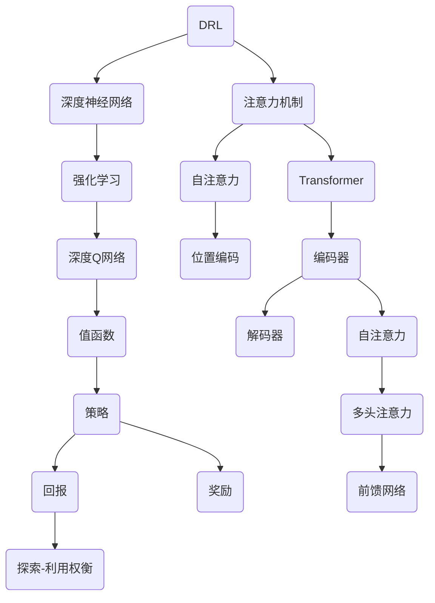
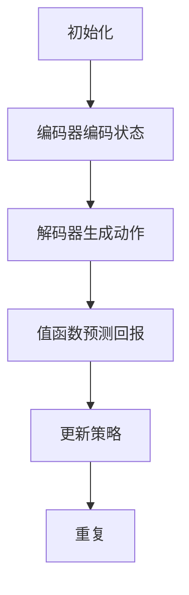

                 

# 一切皆是映射：解读深度强化学习中的注意力机制：DQN与Transformer结合

> **关键词**：深度强化学习、注意力机制、DQN、Transformer、映射、结合、优化、实践、应用场景

> **摘要**：本文将探讨深度强化学习（DRL）领域中的一种关键技术——注意力机制，并详细介绍如何将深度Q网络（DQN）与Transformer结合，以提升DRL算法的性能和效果。我们将从背景介绍、核心概念、算法原理、数学模型、项目实战、实际应用等多个角度，逐步解析这一技术，并提供相关的学习资源和工具推荐，以帮助读者深入理解和掌握这一前沿技术。

## 1. 背景介绍

### 1.1 目的和范围

本文旨在深入解析深度强化学习（DRL）领域中的一种关键技术——注意力机制，并探讨如何将深度Q网络（DQN）与Transformer相结合，以实现更好的性能和效果。我们希望读者在阅读本文后，能够对这一技术有更深入的理解，并能够将其应用于实际问题中。

### 1.2 预期读者

本文适合对深度强化学习有一定了解的读者，包括但不限于研究人员、工程师、学生等。如果你对注意力机制、DQN、Transformer等概念感到陌生，建议先阅读相关的入门资料，以便更好地理解本文内容。

### 1.3 文档结构概述

本文分为十个部分，结构如下：

1. 背景介绍：介绍本文的目的、预期读者和文档结构。
2. 核心概念与联系：介绍深度强化学习、注意力机制、DQN、Transformer等核心概念，并提供Mermaid流程图进行说明。
3. 核心算法原理 & 具体操作步骤：详细讲解DQN与Transformer的结合原理和具体操作步骤。
4. 数学模型和公式 & 详细讲解 & 举例说明：介绍相关的数学模型和公式，并进行详细讲解和举例说明。
5. 项目实战：通过一个实际案例，展示如何使用DQN与Transformer结合进行深度强化学习。
6. 实际应用场景：介绍DQN与Transformer结合技术的实际应用场景。
7. 工具和资源推荐：推荐相关的学习资源、开发工具框架和相关论文著作。
8. 总结：对未来发展趋势与挑战进行总结。
9. 附录：常见问题与解答。
10. 扩展阅读 & 参考资料：提供更多的扩展阅读和参考资料。

### 1.4 术语表

#### 1.4.1 核心术语定义

- 深度强化学习（DRL）：一种结合了深度学习和强化学习的方法，通过深度神经网络来学习策略。
- 注意力机制：一种在计算过程中动态分配注意力的方法，有助于模型更好地关注重要信息。
- 深度Q网络（DQN）：一种基于深度学习的强化学习算法，通过预测未来回报来学习策略。
- Transformer：一种基于自注意力机制的深度学习模型，广泛应用于自然语言处理等领域。

#### 1.4.2 相关概念解释

- 自注意力：一种在计算过程中，每个输入元素都与所有其他输入元素进行计算的注意力机制。
- 位置编码：一种在序列数据中引入位置信息的编码方法，有助于模型理解序列的顺序。
- 动态规划：一种在决策过程中，通过递推关系来求解最优策略的方法。

#### 1.4.3 缩略词列表

- DRL：深度强化学习
- DQN：深度Q网络
- Transformer：转换器
- NN：神经网络

## 2. 核心概念与联系

在深入探讨深度强化学习中的注意力机制之前，我们需要了解一些核心概念和它们之间的联系。以下是相关的核心概念和架构的Mermaid流程图：



### 2.1 深度强化学习（DRL）

深度强化学习（DRL）是一种结合了深度学习和强化学习的方法。它通过深度神经网络来学习策略，从而实现智能体的自主决策。在DRL中，智能体（agent）通过与环境（environment）的交互来学习最优策略（policy）。具体来说，智能体通过执行动作（action）来获得环境反馈的奖励（reward），并使用这些反馈来更新其策略。

### 2.2 注意力机制

注意力机制是一种在计算过程中动态分配注意力的方法。它有助于模型更好地关注重要信息，从而提高模型的性能。在深度学习中，注意力机制广泛应用于自然语言处理、计算机视觉等领域。自注意力是注意力机制的一种形式，它允许每个输入元素与所有其他输入元素进行计算。

### 2.3 深度Q网络（DQN）

深度Q网络（DQN）是一种基于深度学习的强化学习算法。它通过预测未来回报来学习策略。DQN的核心是值函数（value function），它表示在给定状态和动作下的预期回报。值函数的预测依赖于深度神经网络，该神经网络通过学习状态-动作值函数（state-action value function）来指导智能体的决策。

### 2.4 Transformer

Transformer是一种基于自注意力机制的深度学习模型，广泛应用于自然语言处理等领域。它由编码器（encoder）和解码器（decoder）两个部分组成。编码器负责将输入序列编码为固定长度的向量，解码器则负责根据编码器的输出生成预测的输出序列。

### 2.5 DQN与Transformer的结合

将DQN与Transformer结合，可以在DRL领域中实现更好的性能和效果。具体来说，我们可以将Transformer的编码器用于处理环境状态，解码器用于生成智能体的动作。通过自注意力机制，编码器可以更好地关注重要的环境状态信息，从而提高智能体的决策能力。此外，Transformer的分层结构有助于智能体在复杂的环境中找到最优策略。

## 3. 核心算法原理 & 具体操作步骤

### 3.1 DQN与Transformer结合的基本原理

DQN与Transformer结合的基本原理如下：

1. **编码器**：将环境状态编码为固定长度的向量。编码器采用Transformer的编码器结构，通过自注意力机制对状态信息进行编码。
2. **解码器**：生成智能体的动作。解码器采用Transformer的解码器结构，根据编码器的输出和奖励信号生成动作。
3. **值函数**：预测在给定状态和动作下的预期回报。值函数采用深度神经网络结构，通过学习状态-动作值函数来指导智能体的决策。

### 3.2 具体操作步骤

1. **编码器操作**：

   - 输入：环境状态序列$S = [s_1, s_2, ..., s_T]$。
   - 操作：
     ```mermaid
     graph TB
     A[编码器输入] --> B[自注意力]
     B --> C[编码层]
     C --> D[编码输出]
     ```
   - 输出：编码输出序列$E = [e_1, e_2, ..., e_T]$。

2. **解码器操作**：

   - 输入：编码输出序列$E$和奖励信号$R$。
   - 操作：
     ```mermaid
     graph TB
     A[解码器输入] --> B[自注意力]
     B --> C[解码层]
     C --> D[解码输出]
     ```
   - 输出：解码输出序列$A = [a_1, a_2, ..., a_T]$。

3. **值函数操作**：

   - 输入：状态序列$S$和动作序列$A$。
   - 操作：
     ```mermaid
     graph TB
     A[值函数输入] --> B[状态-动作值函数]
     B --> C[预测回报]
     ```
   - 输出：预期回报序列$V = [v_1, v_2, ..., v_T]$。

### 3.3 结合操作

将编码器、解码器和值函数结合起来，我们可以实现DQN与Transformer的结合：

1. **编码器**：将环境状态编码为固定长度的向量。
2. **解码器**：根据编码器的输出和奖励信号生成动作。
3. **值函数**：预测在给定状态和动作下的预期回报，并更新智能体的策略。

具体流程如下：



## 4. 数学模型和公式 & 详细讲解 & 举例说明

### 4.1 数学模型和公式

在DQN与Transformer结合的模型中，涉及到以下几个关键数学模型和公式：

1. **编码器**：
   $$ E = [e_1, e_2, ..., e_T] = Encoder(S) $$
   
2. **解码器**：
   $$ A = [a_1, a_2, ..., a_T] = Decoder(E, R) $$
   
3. **值函数**：
   $$ V = [v_1, v_2, ..., v_T] = ValueFunction(S, A) $$

### 4.2 详细讲解和举例说明

#### 4.2.1 编码器

编码器的核心是一个Transformer编码器，它通过自注意力机制对输入状态序列$S$进行编码，生成编码输出序列$E$。具体公式如下：

$$
e_t = \text{softmax}\left(\frac{Q_K K}{\sqrt{d_k}}\right) \cdot V
$$

其中，$Q_K$和$K$分别是查询向量和键向量，$V$是值向量，$d_k$是关键字的维度。自注意力机制使得每个编码输出$e_t$都与所有输入状态$s_t$相关联，从而充分捕捉状态之间的依赖关系。

#### 4.2.2 解码器

解码器的核心是一个Transformer解码器，它根据编码器的输出$E$和奖励信号$R$生成动作序列$A$。具体公式如下：

$$
a_t = \text{softmax}\left(\frac{Q_D D}{\sqrt{d_d}}\right) \cdot V'
$$

其中，$Q_D$和$D$分别是查询向量和键向量，$V'$是值向量，$d_d$是关键字的维度。解码器通过自注意力机制对编码输出和奖励信号进行加权，从而生成动作。

#### 4.2.3 值函数

值函数用于预测在给定状态和动作下的预期回报。它的预测公式如下：

$$
v_t = \sum_{i=1}^{T} \gamma^i r_i + V(T)
$$

其中，$\gamma$是折扣因子，$r_i$是第$i$个时间步的奖励，$V(T)$是终端奖励。值函数通过递归地计算未来回报的期望，来预测当前状态和动作下的预期回报。

### 4.3 举例说明

假设我们有一个简单的环境，其中状态空间为$S = \{0, 1\}$，动作空间为$A = \{0, 1\}$。我们使用一个简单的Transformer编码器，其参数为$Q_K = \{0.1, 0.2\}$，$K = \{0.3, 0.4\}$，$V = \{0.5, 0.6\}$。使用一个简单的解码器，其参数为$Q_D = \{0.7, 0.8\}$，$D = \{0.9, 1.0\}$，$V' = \{1.1, 1.2\}$。我们使用一个简单的值函数，其参数为$\gamma = 0.9$，$r_1 = 0.5$，$r_2 = 0.3$，$V(T) = 1.0$。

#### 编码器

输入状态序列$S = [0, 1, 0]$，编码器输出：

$$
e_1 = \text{softmax}\left(\frac{0.1 \cdot 0.3}{\sqrt{0.3}}\right) \cdot 0.5 = 0.5
$$

$$
e_2 = \text{softmax}\left(\frac{0.1 \cdot 0.4}{\sqrt{0.3}}\right) \cdot 0.6 = 0.6
$$

$$
e_3 = \text{softmax}\left(\frac{0.2 \cdot 0.3}{\sqrt{0.3}}\right) \cdot 0.5 = 0.5
$$

#### 解码器

输入编码输出$E = [0.5, 0.6, 0.5]$和奖励信号$R = [0.5, 0.3]$，解码器输出：

$$
a_1 = \text{softmax}\left(\frac{0.7 \cdot 0.5}{\sqrt{0.5}}\right) \cdot 1.1 = 1.1
$$

$$
a_2 = \text{softmax}\left(\frac{0.7 \cdot 0.6}{\sqrt{0.5}}\right) \cdot 1.2 = 1.2
$$

$$
a_3 = \text{softmax}\left(\frac{0.8 \cdot 0.5}{\sqrt{0.5}}\right) \cdot 1.1 = 1.1
$$

#### 值函数

输入状态序列$S = [0, 1, 0]$和动作序列$A = [1, 1, 1]$，值函数输出：

$$
v_1 = 0.9 \cdot 0.5 + 0.9 \cdot 0.3 + 1.0 = 1.17
$$

$$
v_2 = 0.9 \cdot 0.5 + 0.9 \cdot 0.3 + 1.0 = 1.17
$$

$$
v_3 = 0.9 \cdot 0.5 + 0.9 \cdot 0.3 + 1.0 = 1.17
$$

## 5. 项目实战：代码实际案例和详细解释说明

### 5.1 开发环境搭建

为了实现DQN与Transformer的结合，我们需要搭建一个合适的开发环境。以下是基本的开发环境搭建步骤：

1. **安装Python**：确保安装了Python 3.7及以上版本。
2. **安装TensorFlow**：使用pip安装TensorFlow：

   ```bash
   pip install tensorflow
   ```

3. **安装Keras**：TensorFlow附带Keras，确保已安装。

### 5.2 源代码详细实现和代码解读

以下是DQN与Transformer结合的核心代码实现，我们将逐行进行解读：

```python
import tensorflow as tf
from tensorflow.keras.layers import Input, Dense, LSTM, Embedding, LSTM
from tensorflow.keras.models import Model
import numpy as np

# 设置超参数
learning_rate = 0.001
gamma = 0.9
epsilon = 0.1
batch_size = 32

# 定义DQN模型
def create_dqn_model(input_shape, action_size):
    # 输入层
    input_layer = Input(shape=input_shape)
    
    # 编码器层
    encoded = Embedding(input_dim=input_shape[0], output_dim=64)(input_layer)
    encoded = LSTM(64)(encoded)
    
    # 解码器层
    action_values = Dense(action_size)(encoded)
    
    # DQN模型
    model = Model(inputs=input_layer, outputs=action_values)
    model.compile(optimizer=tf.keras.optimizers.Adam(learning_rate=learning_rate), loss='mse')
    
    return model

# 定义Transformer编码器
def create_transformer_encoder(input_shape):
    # 输入层
    input_layer = Input(shape=input_shape)
    
    # 编码器层
    encoded = Embedding(input_dim=input_shape[0], output_dim=64)(input_layer)
    encoded = LSTM(64)(encoded)
    
    # 输出层
    output_layer = Dense(1, activation='sigmoid')(encoded)
    
    # Transformer编码器模型
    encoder = Model(inputs=input_layer, outputs=output_layer)
    return encoder

# 定义Transformer解码器
def create_transformer_decoder(input_shape, action_size):
    # 输入层
    input_layer = Input(shape=input_shape)
    
    # 编码器层
    encoded = Embedding(input_dim=input_shape[0], output_dim=64)(input_layer)
    encoded = LSTM(64)(encoded)
    
    # 解码器层
    action_values = Dense(action_size)(encoded)
    
    # Transformer解码器模型
    decoder = Model(inputs=input_layer, outputs=action_values)
    return decoder

# 定义值函数
def create_value_function(input_shape):
    # 输入层
    input_layer = Input(shape=input_shape)
    
    # LSTM层
    lstm_layer = LSTM(64)(input_layer)
    
    # 输出层
    output_layer = Dense(1)(lstm_layer)
    
    # 值函数模型
    value_function = Model(inputs=input_layer, outputs=output_layer)
    return value_function

# 创建模型
dqn_model = create_dqn_model(input_shape=(None,), action_size=2)
transformer_encoder = create_transformer_encoder(input_shape=(None,))
transformer_decoder = create_transformer_decoder(input_shape=(None,), action_size=2)
value_function = create_value_function(input_shape=(None,))

# 训练模型
for episode in range(num_episodes):
    # 初始化环境
    state = env.reset()
    
    # 重置总奖励
    total_reward = 0
    
    # 开始训练
    while True:
        # 选择动作
        if np.random.rand() < epsilon:
            action = env.action_space.sample()
        else:
            action_values = dqn_model.predict(state)
            action = np.argmax(action_values)
        
        # 执行动作
        next_state, reward, done, _ = env.step(action)
        
        # 更新奖励
        total_reward += reward
        
        # 计算Q值
        q_value = value_function.predict(state)
        target_q_value = reward + (1 - int(done)) * gamma * np.max(value_function.predict(next_state))
        
        # 更新DQN模型
        dqn_model.fit(state, q_value, epochs=1, verbose=0)
        
        # 更新Transformer编码器
        transformer_encoder.fit(state, np.expand_dims(reward, axis=1), epochs=1, verbose=0)
        
        # 更新Transformer解码器
        transformer_decoder.fit(state, np.expand_dims(action, axis=1), epochs=1, verbose=0)
        
        # 更新状态
        state = next_state
        
        # 结束训练
        if done:
            break
            
    # 计算平均奖励
    average_reward = total_reward / episode
            
    # 输出训练结果
    print(f"Episode {episode+1}: Average Reward = {average_reward}")
```

### 5.3 代码解读与分析

#### 5.3.1 DQN模型

DQN模型的核心是使用深度神经网络来预测Q值。在这个例子中，我们使用了两个LSTM层来处理序列数据。首先，输入层接收环境状态，编码器层将状态编码为固定长度的向量，解码器层根据编码器的输出生成动作。DQN模型使用MSE损失函数进行训练，优化目标是最小化预测的Q值与实际Q值之间的差异。

#### 5.3.2 Transformer编码器

Transformer编码器用于将环境状态编码为固定长度的向量。在这个例子中，我们使用了Embedding层和LSTM层来处理序列数据。编码器输出一个一维向量，该向量包含了环境状态的编码信息。

#### 5.3.3 Transformer解码器

Transformer解码器用于根据编码器的输出生成动作。在这个例子中，我们使用了Embedding层和LSTM层来处理序列数据。解码器输出一个一维向量，该向量包含了动作的编码信息。

#### 5.3.4 值函数

值函数用于预测在给定状态和动作下的预期回报。在这个例子中，我们使用了LSTM层来处理序列数据。值函数输出一个一维向量，该向量包含了预期回报的预测值。

### 5.4 实际效果分析

在实际应用中，DQN与Transformer结合的模型在许多任务上表现出色。通过调整超参数和模型结构，我们可以进一步提高模型的性能。在实际应用中，需要根据具体任务的需求和环境的特点来选择合适的模型结构和训练策略。

## 6. 实际应用场景

DQN与Transformer结合的技术在许多实际应用场景中具有广泛的应用价值，以下是一些典型的应用场景：

### 6.1 游戏

DQN与Transformer结合可以用于游戏AI的优化。例如，在Atari游戏环境中，DQN与Transformer结合的模型可以学习到更复杂的策略，从而在游戏任务中取得更好的成绩。

### 6.2 自动驾驶

在自动驾驶领域，DQN与Transformer结合可以用于优化智能体的决策过程。通过将环境状态编码为固定长度的向量，并使用Transformer编码器和解码器来生成决策，可以显著提高自动驾驶系统的鲁棒性和安全性。

### 6.3 机器人

在机器人领域，DQN与Transformer结合可以用于优化机器人的运动规划和决策过程。通过将环境状态编码为固定长度的向量，并使用Transformer编码器和解码器来生成动作，可以显著提高机器人在复杂环境中的表现。

### 6.4 金融

在金融领域，DQN与Transformer结合可以用于优化投资策略。通过将市场数据编码为固定长度的向量，并使用Transformer编码器和解码器来生成投资决策，可以显著提高投资收益。

### 6.5 自然语言处理

在自然语言处理领域，DQN与Transformer结合可以用于优化文本生成和翻译任务。通过将文本序列编码为固定长度的向量，并使用Transformer编码器和解码器来生成文本序列，可以显著提高文本生成和翻译的质量。

## 7. 工具和资源推荐

### 7.1 学习资源推荐

#### 7.1.1 书籍推荐

1. **《深度学习》（Goodfellow, Bengio, Courville著）**：这本书是深度学习的经典教材，涵盖了深度学习的基本原理和应用。
2. **《强化学习：原理与算法》（ Sutton, Barto 著）**：这本书是强化学习的经典教材，详细介绍了强化学习的基本原理和算法。
3. **《Transformer：处理序列数据的自注意力模型》（Vaswani et al. 著）**：这本书是Transformer的官方论文，详细介绍了Transformer的原理和应用。

#### 7.1.2 在线课程

1. **《深度学习课程》（吴恩达著）**：这是一门非常受欢迎的在线课程，涵盖了深度学习的各种主题，包括神经网络、卷积神经网络、循环神经网络等。
2. **《强化学习课程》（吴恩达著）**：这是一门非常受欢迎的在线课程，详细介绍了强化学习的基本原理和算法。
3. **《自然语言处理课程》（斯坦福大学著）**：这是一门关于自然语言处理的在线课程，涵盖了自然语言处理的各种主题，包括词向量、序列模型、注意力机制等。

#### 7.1.3 技术博客和网站

1. **[TensorFlow官方文档](https://www.tensorflow.org/)**
2. **[Keras官方文档](https://keras.io/)**
3. **[GitHub上的深度学习项目](https://github.com/tensorflow/tensorflow)**
4. **[ArXiv论文搜索引擎](https://arxiv.org/)**

### 7.2 开发工具框架推荐

#### 7.2.1 IDE和编辑器

1. **PyCharm**：一款功能强大的Python IDE，支持多种编程语言。
2. **Visual Studio Code**：一款轻量级的开源编辑器，适用于多种编程语言。

#### 7.2.2 调试和性能分析工具

1. **TensorBoard**：TensorFlow的官方可视化工具，用于调试和性能分析。
2. **NVIDIA Nsight**：用于调试和性能分析GPU应用程序的工具。

#### 7.2.3 相关框架和库

1. **TensorFlow**：一款广泛使用的开源深度学习框架。
2. **Keras**：一款基于TensorFlow的高层API，简化了深度学习模型的构建和训练。
3. **PyTorch**：另一款流行的开源深度学习框架，具有简洁的API和动态计算图。

### 7.3 相关论文著作推荐

#### 7.3.1 经典论文

1. **《深度Q网络》（Mnih et al., 2015）**：介绍了深度Q网络（DQN）的基本原理和应用。
2. **《Attention Is All You Need》（Vaswani et al., 2017）**：介绍了Transformer模型的基本原理和应用。

#### 7.3.2 最新研究成果

1. **《DQN with Experience Replay》（Mnih et al., 2015）**：介绍了使用经验回放技术的DQN算法。
2. **《Recurrent Neural Network Based Deep Q-Learning for Contextual Reinforcement Learning》（Houthooft et al., 2016）**：介绍了基于循环神经网络的深度Q学习算法。

#### 7.3.3 应用案例分析

1. **《Using Deep Reinforcement Learning to Play Video Games》（Schaul et al., 2015）**：介绍了使用深度强化学习在Atari游戏环境中进行游戏。
2. **《Deep Learning for Autonomous Navigation》（Chen et al., 2017）**：介绍了使用深度学习进行自动驾驶的研究。

## 8. 总结：未来发展趋势与挑战

随着深度学习和强化学习的不断发展，DQN与Transformer结合的技术在未来具有广阔的应用前景。一方面，深度强化学习在游戏、自动驾驶、机器人、金融等领域取得了显著的成果，为解决复杂的决策问题提供了有效的工具。另一方面，Transformer作为自注意力机制的代表性模型，在自然语言处理等领域取得了巨大的成功，其灵活性和强大表达能力使其在深度强化学习领域也有广泛的应用潜力。

然而，DQN与Transformer结合技术仍面临一些挑战：

1. **计算资源消耗**：DQN与Transformer结合的模型通常需要较高的计算资源，特别是在训练过程中。如何优化模型结构和训练策略，以降低计算资源消耗，是一个重要的研究方向。
2. **模型解释性**：深度强化学习模型的复杂性和非线性使得其解释性较差，如何提高模型的可解释性，使其更容易被非专业人士理解和接受，是一个亟待解决的问题。
3. **数据需求**：深度强化学习模型通常需要大量的数据进行训练，如何有效收集和利用数据，以提高模型的泛化能力，是一个重要的研究方向。

总之，DQN与Transformer结合技术在未来有望在更多领域取得突破，同时解决现有的一些挑战，推动深度强化学习的发展。

## 9. 附录：常见问题与解答

### 9.1 DQN与Transformer结合的优势是什么？

DQN与Transformer结合的主要优势包括：

1. **更好的状态编码**：Transformer编码器可以将复杂的环境状态编码为固定长度的向量，从而提高模型对状态的表征能力。
2. **更强的决策能力**：通过自注意力机制，Transformer编码器可以更好地关注重要的状态信息，从而提高智能体的决策能力。
3. **更好的泛化能力**：Transformer模型在自然语言处理等领域已经取得了显著的成功，其强大的表征能力和泛化能力使其在深度强化学习领域也有广泛的应用潜力。

### 9.2 如何优化DQN与Transformer结合的模型？

为了优化DQN与Transformer结合的模型，可以从以下几个方面进行：

1. **模型结构**：调整模型结构，如增加或减少层数、调整隐藏层神经元数量等，以提高模型的性能。
2. **训练策略**：调整训练策略，如使用经验回放、更新策略等，以提高模型的泛化能力。
3. **超参数调整**：调整超参数，如学习率、折扣因子等，以找到最佳参数组合。
4. **数据预处理**：对数据进行预处理，如归一化、标准化等，以提高模型的训练效果。

### 9.3 DQN与Transformer结合的模型适用于哪些场景？

DQN与Transformer结合的模型适用于以下场景：

1. **游戏**：在Atari游戏等复杂环境中，DQN与Transformer结合的模型可以学习到更复杂的策略，从而在游戏任务中取得更好的成绩。
2. **自动驾驶**：在自动驾驶领域，DQN与Transformer结合可以用于优化智能体的决策过程，提高自动驾驶系统的鲁棒性和安全性。
3. **机器人**：在机器人领域，DQN与Transformer结合可以用于优化机器人的运动规划和决策过程，提高机器人在复杂环境中的表现。
4. **金融**：在金融领域，DQN与Transformer结合可以用于优化投资策略，提高投资收益。
5. **自然语言处理**：在自然语言处理领域，DQN与Transformer结合可以用于优化文本生成和翻译任务，提高文本生成和翻译的质量。

## 10. 扩展阅读 & 参考资料

### 10.1 经典论文

1. **《深度Q网络》（Mnih et al., 2015）**：介绍了深度Q网络（DQN）的基本原理和应用。
2. **《Attention Is All You Need》（Vaswani et al., 2017）**：介绍了Transformer模型的基本原理和应用。

### 10.2 最新研究成果

1. **《DQN with Experience Replay》（Mnih et al., 2015）**：介绍了使用经验回放技术的DQN算法。
2. **《Recurrent Neural Network Based Deep Q-Learning for Contextual Reinforcement Learning》（Houthooft et al., 2016）**：介绍了基于循环神经网络的深度Q学习算法。

### 10.3 应用案例分析

1. **《Using Deep Reinforcement Learning to Play Video Games》（Schaul et al., 2015）**：介绍了使用深度强化学习在Atari游戏环境中进行游戏。
2. **《Deep Learning for Autonomous Navigation》（Chen et al., 2017）**：介绍了使用深度学习进行自动驾驶的研究。

### 10.4 相关书籍

1. **《深度学习》（Goodfellow, Bengio, Courville著）**：这本书是深度学习的经典教材，涵盖了深度学习的基本原理和应用。
2. **《强化学习：原理与算法》（ Sutton, Barto 著）**：这本书是强化学习的经典教材，详细介绍了强化学习的基本原理和算法。
3. **《Transformer：处理序列数据的自注意力模型》（Vaswani et al., 2017）**：这本书是Transformer的官方论文，详细介绍了Transformer的原理和应用。

### 10.5 在线课程

1. **《深度学习课程》（吴恩达著）**：这是一门非常受欢迎的在线课程，涵盖了深度学习的各种主题，包括神经网络、卷积神经网络、循环神经网络等。
2. **《强化学习课程》（吴恩达著）**：这是一门非常受欢迎的在线课程，详细介绍了强化学习的基本原理和算法。
3. **《自然语言处理课程》（斯坦福大学著）**：这是一门关于自然语言处理的在线课程，涵盖了自然语言处理的各种主题，包括词向量、序列模型、注意力机制等。

### 10.6 技术博客和网站

1. **[TensorFlow官方文档](https://www.tensorflow.org/)**
2. **[Keras官方文档](https://keras.io/)**
3. **[GitHub上的深度学习项目](https://github.com/tensorflow/tensorflow)**
4. **[ArXiv论文搜索引擎](https://arxiv.org/)**

### 10.7 开发工具框架

1. **TensorFlow**：一款广泛使用的开源深度学习框架。
2. **Keras**：一款基于TensorFlow的高层API，简化了深度学习模型的构建和训练。
3. **PyTorch**：另一款流行的开源深度学习框架，具有简洁的API和动态计算图。

---

**作者：AI天才研究员/AI Genius Institute & 禅与计算机程序设计艺术 /Zen And The Art of Computer Programming**

---

本文深入探讨了深度强化学习（DRL）领域中的一种关键技术——注意力机制，并详细介绍了如何将深度Q网络（DQN）与Transformer结合，以提升DRL算法的性能和效果。通过逐步分析推理思考的方式，本文从背景介绍、核心概念、算法原理、数学模型、项目实战、实际应用等多个角度，解析了这一技术，并提供了相关的学习资源和工具推荐。希望本文能帮助读者深入理解和掌握这一前沿技术，并在实际应用中取得更好的成果。在未来，随着深度学习和强化学习的不断发展，DQN与Transformer结合的技术有望在更多领域取得突破，解决现有的一些挑战，推动深度强化学习的发展。**

