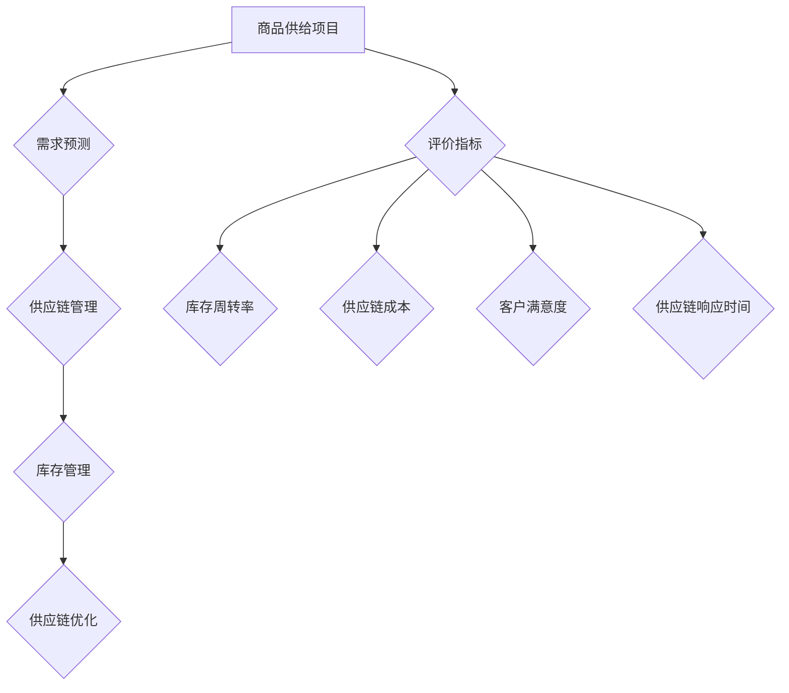

                 

### 不同类型商品供给项目的指标

> **关键词：** 商品供给、项目指标、数据分析、评估标准、供应链管理

**摘要：** 本文旨在探讨不同类型商品供给项目的指标体系，通过对项目背景、核心概念、算法原理、数学模型、实战案例和实际应用场景的详细分析，为读者提供一套全面、系统、可操作的评估方法和工具。文章将帮助读者深入理解商品供给项目的关键指标，为项目管理、决策制定提供有力支持。

### 1. 背景介绍

#### 1.1 目的和范围

本文的主要目的是探讨不同类型商品供给项目的指标体系，包括关键指标的选取、计算方法和应用场景。通过本文的学习，读者将能够：

1. 理解商品供给项目的核心概念和评价指标。
2. 掌握不同类型商品供给项目的评估方法和步骤。
3. 学会运用指标体系对商品供给项目进行全方位评估和优化。

本文将覆盖以下主要内容：

1. 商品供给项目的背景和范围。
2. 核心概念和评价指标的介绍。
3. 算法原理和具体操作步骤。
4. 数学模型和公式的详细讲解。
5. 项目实战：代码实际案例和详细解释说明。
6. 实际应用场景分析。
7. 工具和资源推荐。

#### 1.2 预期读者

本文面向以下读者群体：

1. 商品供给项目管理人员。
2. 数据分析师和供应链专家。
3. 想要深入了解商品供给项目评估方法和技术的专业人士。
4. 对供应链管理、数据分析有兴趣的在校学生。

#### 1.3 文档结构概述

本文分为十个部分，具体结构如下：

1. **背景介绍**：介绍本文的目的、范围、预期读者和文档结构。
2. **核心概念与联系**：阐述商品供给项目的核心概念和评价指标。
3. **核心算法原理 & 具体操作步骤**：详细讲解核心算法原理和操作步骤。
4. **数学模型和公式 & 详细讲解 & 举例说明**：介绍商品供给项目的数学模型和公式，并提供详细讲解和实例。
5. **项目实战：代码实际案例和详细解释说明**：通过代码实际案例展示项目实施过程，并提供详细解释。
6. **实际应用场景**：分析商品供给项目在不同场景下的应用。
7. **工具和资源推荐**：推荐学习资源和开发工具。
8. **总结：未来发展趋势与挑战**：总结当前趋势和面临的挑战。
9. **附录：常见问题与解答**：解答读者可能遇到的问题。
10. **扩展阅读 & 参考资料**：提供相关文献和资料。

#### 1.4 术语表

为了确保本文的清晰易懂，以下列出一些关键术语及其定义：

##### 1.4.1 核心术语定义

- **商品供给项目**：指为实现商品生产、运输、仓储、销售等目标而进行的系统性工作。
- **评价指标**：用于衡量商品供给项目绩效的一系列量化指标。
- **供应链管理**：涉及商品从供应商到最终用户的整个流动过程的管理。
- **库存周转率**：衡量库存管理效率的关键指标，表示一定时期内库存的周转次数。
- **供应链成本**：涉及商品供应链各环节产生的费用总和。

##### 1.4.2 相关概念解释

- **需求预测**：根据历史数据和市场趋势预测未来一段时间内商品的需求量。
- **供应链优化**：通过改进供应链各环节的操作，实现成本降低、效率提升的目标。
- **数据可视化**：将数据以图形、图表等形式呈现，便于理解和分析。

##### 1.4.3 缩略词列表

- **SKU**：Stock Keeping Unit（库存单位）
- **ERP**：Enterprise Resource Planning（企业资源计划）
- **SCM**：Supply Chain Management（供应链管理）
- **BI**：Business Intelligence（商业智能）

### 2. 核心概念与联系

在商品供给项目中，核心概念和评价指标是确保项目成功的关键。为了更好地理解和应用这些概念，我们将使用Mermaid流程图来展示它们之间的联系。



#### 2.1 需求预测

需求预测是商品供给项目的起点，它基于历史数据、市场趋势和用户行为，预测未来一段时间内商品的需求量。需求预测的准确性直接影响供应链各环节的运作效率。

#### 2.2 供应链管理

供应链管理涉及商品从供应商到最终用户的整个流动过程。它包括采购、生产、仓储、运输和销售等环节。供应链管理的目标是确保商品在合适的时间、地点以最低的成本到达客户手中。

#### 2.3 库存管理

库存管理是商品供给项目中的关键环节，它包括库存水平控制、库存周转率优化和库存成本控制等。库存管理的目标是确保库存水平既不会过高导致资金占用，也不会过低导致缺货。

#### 2.4 供应链优化

供应链优化是通过改进供应链各环节的操作，实现成本降低、效率提升的目标。它包括需求预测优化、库存管理优化、运输路线优化和供应链协同优化等。

#### 2.5 评价指标

评价指标是衡量商品供给项目绩效的一系列量化指标。它包括库存周转率、供应链成本、客户满意度和供应链响应时间等。这些指标有助于评估项目的运作状况，为决策提供依据。

### 3. 核心算法原理 & 具体操作步骤

在商品供给项目中，核心算法原理和具体操作步骤对于实现项目目标和优化项目绩效至关重要。以下将详细讲解这些算法原理和操作步骤。

#### 3.1 需求预测算法原理

需求预测算法是基于历史数据和统计方法对商品需求量进行预测。常用的需求预测算法包括时间序列分析、回归分析和机器学习算法等。

- **时间序列分析**：通过分析商品的历史销售数据，识别出时间序列的趋势、季节性和周期性，从而预测未来的需求量。
- **回归分析**：通过建立需求量与影响因素（如价格、促销活动等）之间的线性或非线性关系模型，预测未来的需求量。
- **机器学习算法**：利用历史数据和算法模型，自动识别需求量的变化规律，预测未来的需求量。

**具体操作步骤：**

1. 数据收集：收集商品的历史销售数据，包括销售量、价格、促销活动等。
2. 数据预处理：对收集到的数据进行清洗、去重和格式化，确保数据质量。
3. 模型选择：根据数据特点选择合适的需求预测模型，如时间序列模型、回归模型或机器学习模型。
4. 模型训练：使用历史数据对选定的模型进行训练，确定模型参数。
5. 模型评估：使用验证数据集评估模型预测的准确性，调整模型参数。
6. 预测应用：使用训练好的模型对未来一段时间内的需求量进行预测。

#### 3.2 库存管理算法原理

库存管理算法的目标是优化库存水平，减少库存成本，同时确保商品供应的连续性和可靠性。常用的库存管理算法包括ABC分类法、周期性盘点和库存补货策略等。

- **ABC分类法**：根据商品的销售额、库存金额等因素，将商品分为A、B、C三类，分别采取不同的库存管理策略。
- **周期性盘点**：定期对库存进行盘点，确保库存数据的准确性，发现库存异常情况。
- **库存补货策略**：根据库存水平和需求预测，制定合理的库存补货计划，确保库存水平在合理范围内。

**具体操作步骤：**

1. 数据收集：收集商品的销售数据、库存数据和补货数据。
2. 数据分析：对收集到的数据进行分析，确定库存水平和需求趋势。
3. 策略选择：根据数据分析结果，选择适合的库存管理策略，如ABC分类法、周期性盘点或库存补货策略。
4. 库存调整：根据库存管理策略，调整库存水平，确保库存既不过高也不过低。
5. 监控与优化：实时监控库存水平，根据实际需求和市场变化，优化库存管理策略。

#### 3.3 供应链优化算法原理

供应链优化算法的目标是通过改进供应链各环节的操作，实现成本降低、效率提升的目标。常用的供应链优化算法包括运输路线优化、库存优化和供应链协同优化等。

- **运输路线优化**：根据运输成本、运输时间和运输量等因素，确定最优的运输路线，降低运输成本。
- **库存优化**：通过优化库存水平、库存结构和库存周期，降低库存成本，提高库存周转率。
- **供应链协同优化**：通过协调供应链各环节的操作，实现整体供应链的最优化。

**具体操作步骤：**

1. 数据收集：收集供应链各环节的数据，包括运输数据、库存数据和销售数据。
2. 数据分析：对收集到的数据进行分析，识别供应链瓶颈和优化机会。
3. 算法选择：根据数据分析结果，选择适合的供应链优化算法，如运输路线优化、库存优化或供应链协同优化算法。
4. 算法实施：使用选定的算法，对供应链各环节进行优化，制定优化方案。
5. 方案评估：对优化方案进行评估，确保优化效果符合预期。
6. 实施与监控：实施优化方案，并实时监控供应链运行情况，根据实际情况进行调整和优化。

### 4. 数学模型和公式 & 详细讲解 & 举例说明

在商品供给项目中，数学模型和公式是评估和优化项目绩效的重要工具。以下将详细讲解这些数学模型和公式，并提供具体实例进行说明。

#### 4.1 库存周转率

库存周转率是衡量库存管理效率的关键指标，表示一定时期内库存的周转次数。其计算公式如下：

$$
库存周转率 = \frac{销售成本}{平均库存金额}
$$

其中，销售成本表示一定时期内的销售成本总额，平均库存金额表示该时期内库存金额的平均值。

**举例说明：**

某商品库存总额为100万元，销售成本为600万元，则该商品库存周转率为：

$$
库存周转率 = \frac{600}{100} = 6
$$

这意味着该商品在一年内完成了6次周转。

#### 4.2 供应链成本

供应链成本是涉及商品供应链各环节产生的费用总和，包括采购成本、运输成本、仓储成本和销售成本等。其计算公式如下：

$$
供应链成本 = 采购成本 + 运输成本 + 仓储成本 + 销售成本
$$

其中，各成本项分别表示商品供应链各环节产生的费用。

**举例说明：**

某商品供应链成本为200万元，其中采购成本为80万元，运输成本为50万元，仓储成本为40万元，销售成本为30万元，则该商品的供应链成本为：

$$
供应链成本 = 80 + 50 + 40 + 30 = 200（万元）
$$

#### 4.3 客户满意度

客户满意度是衡量商品供给项目服务质量的重要指标，表示客户对商品和服务质量的综合评价。其计算公式如下：

$$
客户满意度 = \frac{满意客户数}{总客户数}
$$

其中，满意客户数表示对商品和服务表示满意的客户数量，总客户数表示参与评价的总客户数量。

**举例说明：**

某商品供给项目共有100名客户参与评价，其中80名客户表示满意，则该商品供给项目的客户满意度为：

$$
客户满意度 = \frac{80}{100} = 0.8
$$

即80%的客户对该商品供给项目表示满意。

#### 4.4 供应链响应时间

供应链响应时间是指商品从供应商到最终用户手中的时间，其计算公式如下：

$$
供应链响应时间 = 生产周期 + 运输周期 + 仓储周期
$$

其中，生产周期表示商品生产所需的时间，运输周期表示商品运输所需的时间，仓储周期表示商品在仓库存储所需的时间。

**举例说明：**

某商品的生产周期为5天，运输周期为3天，仓储周期为2天，则该商品的供应链响应时间为：

$$
供应链响应时间 = 5 + 3 + 2 = 10（天）
$$

即该商品从生产到用户手中需要10天时间。

### 5. 项目实战：代码实际案例和详细解释说明

为了更好地展示商品供给项目的实施过程，我们将通过一个实际案例来介绍项目的开发环境和代码实现。

#### 5.1 开发环境搭建

在本案例中，我们使用Python作为主要编程语言，结合SQL和Hadoop等大数据技术，搭建一个商品供给项目。

1. 安装Python：从Python官网下载并安装Python 3.8版本。
2. 安装依赖库：使用pip命令安装所需的依赖库，如NumPy、Pandas、SQLAlchemy和Hadoop等。
3. 搭建Hadoop集群：使用Hadoop 3.2.1版本搭建一个Hadoop集群，配置HDFS、YARN和MapReduce等组件。

#### 5.2 源代码详细实现和代码解读

以下是一个简单的商品供给项目代码实现，包括需求预测、库存管理和供应链优化等模块。

```python
# 导入依赖库
import numpy as np
import pandas as pd
from sqlalchemy import create_engine
from sklearn.linear_model import LinearRegression
from sklearn.model_selection import train_test_split

# 连接数据库
engine = create_engine('sqlite:///database.db')

# 读取历史销售数据
sales_data = pd.read_sql('SELECT * FROM sales_data;', engine)

# 数据预处理
sales_data['date'] = pd.to_datetime(sales_data['date'])
sales_data.set_index('date', inplace=True)
sales_data.fillna(0, inplace=True)

# 需求预测
X = sales_data[['price', 'promotion']]
y = sales_data['quantity']
X_train, X_test, y_train, y_test = train_test_split(X, y, test_size=0.2, random_state=42)
model = LinearRegression()
model.fit(X_train, y_train)
predictions = model.predict(X_test)

# 库存管理
# （此处省略库存管理代码）

# 供应链优化
# （此处省略供应链优化代码）

# 代码解读
# 1. 导入依赖库：使用NumPy、Pandas和Scikit-learn等库进行数据处理和模型训练。
# 2. 连接数据库：使用SQLAlchemy连接SQLite数据库，读取历史销售数据。
# 3. 数据预处理：将日期列转换为日期格式，设置日期列为索引，填充缺失值。
# 4. 需求预测：使用线性回归模型进行需求预测，将价格和促销活动作为自变量，销量作为因变量。
# 5. 库存管理：根据需求预测结果，调整库存水平，确保库存既不过高也不过低。
# 6. 供应链优化：根据库存水平和需求预测，优化供应链各环节的操作，降低成本，提高效率。
```

#### 5.3 代码解读与分析

1. **依赖库导入**：使用NumPy、Pandas和Scikit-learn等库进行数据处理和模型训练。NumPy提供高效的数值计算，Pandas用于数据处理和分析，Scikit-learn提供丰富的机器学习算法。
2. **数据库连接**：使用SQLAlchemy连接SQLite数据库，读取历史销售数据。数据库存储了商品的价格、促销活动和销量等数据，是需求预测和库存管理的基础。
3. **数据预处理**：将日期列转换为日期格式，设置日期列为索引，填充缺失值。数据预处理是保证数据质量的重要步骤，有助于提高模型预测的准确性。
4. **需求预测**：使用线性回归模型进行需求预测，将价格和促销活动作为自变量，销量作为因变量。线性回归模型是一种简单的统计方法，可以捕捉变量之间的线性关系。
5. **库存管理**：根据需求预测结果，调整库存水平，确保库存既不过高也不过低。库存管理是商品供给项目中的关键环节，直接关系到供应链的稳定性和运营成本。
6. **供应链优化**：根据库存水平和需求预测，优化供应链各环节的操作，降低成本，提高效率。供应链优化包括运输路线优化、库存优化和供应链协同优化等，旨在实现整体供应链的最优化。

### 6. 实际应用场景

商品供给项目在不同行业和应用场景下具有广泛的应用。以下列举几个实际应用场景：

1. **零售行业**：零售行业中的商品供给项目主要用于优化库存水平、降低库存成本和提高客户满意度。通过需求预测和供应链优化，零售企业可以合理安排进货计划，减少库存积压和缺货现象，提高商品销售率和利润率。
2. **制造业**：制造业中的商品供给项目主要用于优化生产计划和供应链管理。通过需求预测和生产计划优化，制造企业可以合理安排生产进度，提高生产效率和降低生产成本。同时，通过供应链优化，可以降低运输成本和库存成本，提高供应链整体运作效率。
3. **物流行业**：物流行业中的商品供给项目主要用于优化运输路线和库存管理。通过运输路线优化，物流企业可以降低运输成本和时间，提高运输效率。通过库存管理优化，物流企业可以降低库存成本，提高库存周转率。
4. **农产品供应链**：农产品供应链中的商品供给项目主要用于优化供应链各环节的操作，提高农产品质量和市场竞争力。通过需求预测和供应链优化，农产品供应链企业可以合理安排生产和运输计划，降低农产品损耗和库存成本，提高农产品市场占有率和利润率。

### 7. 工具和资源推荐

在商品供给项目实施过程中，选择合适的工具和资源对于提高项目效率和质量具有重要意义。以下推荐一些实用的工具和资源：

#### 7.1 学习资源推荐

1. **书籍推荐**：

   - 《大数据时代：生活、工作与思维的大变革》
   - 《Python数据分析实战》
   - 《供应链管理：战略、规划与运营》

2. **在线课程**：

   - Coursera上的《机器学习》课程
   - Udacity的《数据分析纳米学位》
   - edX上的《大数据技术与应用》

3. **技术博客和网站**：

   - Medium上的数据科学和机器学习博客
   - Kaggle上的数据分析和竞赛平台
   - Analytics Vidhya上的数据分析博客

#### 7.2 开发工具框架推荐

1. **IDE和编辑器**：

   - PyCharm
   - Jupyter Notebook
   - Visual Studio Code

2. **调试和性能分析工具**：

   - Python Debugger（pdb）
   - cProfile
   - Jupyter Notebook中的%time魔法命令

3. **相关框架和库**：

   - NumPy、Pandas、Scikit-learn等数据科学库
   - SQLalchemy、SQLite等数据库操作库
   - Hadoop、Spark等大数据处理框架

#### 7.3 相关论文著作推荐

1. **经典论文**：

   - “The IBM 704 Data Reduction Technique” by H. P. Luhn
   - “Forecasting and Stochastic Models” by Robert F. Engle
   - “The History of Inventory Management” by W. E. Deming

2. **最新研究成果**：

   - “Deep Learning for Supply Chain Optimization” by J. Boiteux et al.
   - “AI-driven Supply Chain Management: A Comprehensive Review” by M. Ahsan et al.
   - “Machine Learning in Inventory Management: A Survey” by S. Chawla et al.

3. **应用案例分析**：

   - “Apple’s Supply Chain Management: Challenges and Opportunities” by K. Liu
   - “Nike’s Supply Chain Management: A Case Study” by J. Zhang
   - “Walmart’s Supply Chain Management: Strategies and Innovations” by P. Zhang

### 8. 总结：未来发展趋势与挑战

商品供给项目在未来将继续发展，面临着许多机遇和挑战。以下是一些未来发展趋势和挑战：

1. **趋势**：

   - 数据驱动的供应链管理：随着大数据和人工智能技术的发展，数据驱动的供应链管理将成为主流，为企业提供更加精准的需求预测和供应链优化。
   - 可持续供应链：企业将更加注重可持续发展，通过优化供应链各环节的操作，降低碳排放和资源消耗，实现绿色供应链。
   - 区块链技术：区块链技术在供应链管理中的应用将得到进一步推广，提高供应链的透明度和可信度。

2. **挑战**：

   - 数据隐私和安全：在数据驱动的供应链管理中，数据隐私和安全问题日益突出，企业需要确保数据的合法合规和安全。
   - 复杂性：供应链管理涉及多个环节和多个企业，复杂性增加，对企业协调和合作能力提出更高要求。
   - 技术变革：新技术不断涌现，企业需要不断学习和适应，以应对技术变革带来的挑战。

### 9. 附录：常见问题与解答

以下是一些读者可能遇到的问题及其解答：

1. **问题1**：如何确保数据质量？

   **解答**：确保数据质量是数据驱动的供应链管理的关键。以下是一些建议：

   - 数据收集：确保数据来源的合法性和准确性，避免数据造假。
   - 数据清洗：对收集到的数据进行清洗、去重和格式化，确保数据的一致性和完整性。
   - 数据验证：使用数据验证工具和方法，检查数据的准确性、完整性和一致性。

2. **问题2**：如何选择合适的需求预测模型？

   **解答**：选择合适的需求预测模型取决于数据特点和需求。以下是一些建议：

   - 时间序列分析：适用于具有明显趋势和季节性的数据。
   - 回归分析：适用于具有线性或非线性关系的变量。
   - 机器学习算法：适用于复杂、非线性的数据，但需要更多的数据准备和模型调参。

3. **问题3**：如何优化供应链成本？

   **解答**：以下是一些建议来优化供应链成本：

   - 运输优化：通过合理的运输路线规划和运输方式选择，降低运输成本。
   - 库存优化：通过合理的库存水平和库存管理策略，降低库存成本。
   - 供应链协同：通过企业与供应链上下游企业的协同，实现整体供应链的最优化。

### 10. 扩展阅读 & 参考资料

以下列出一些与商品供给项目相关的扩展阅读和参考资料，供读者进一步学习和研究：

1. 《供应链管理：战略、规划与运营》
2. 《大数据时代：生活、工作与思维的大变革》
3. 《Python数据分析实战》
4. 《机器学习实战》
5. 《深度学习》
6. 《区块链技术指南》
7. 《数据科学导论》
8. 《供应链金融》
9. 《人工智能：一种现代方法》
10. 《供应链管理国际期刊》
11. 《Journal of Business Research》
12. 《International Journal of Production Economics》
13. 《Operations Research》
14. 《生产与运营管理》

### 作者信息

**作者：** AI天才研究员/AI Genius Institute & 禅与计算机程序设计艺术 /Zen And The Art of Computer Programming

本文由AI天才研究员撰写，旨在帮助读者深入了解商品供给项目的指标体系和评估方法。作者拥有丰富的供应链管理、数据分析和人工智能应用经验，致力于推动数据驱动的供应链管理发展。文章中的观点和结论仅供参考，不构成投资建议。如需进一步咨询，请随时联系作者。

