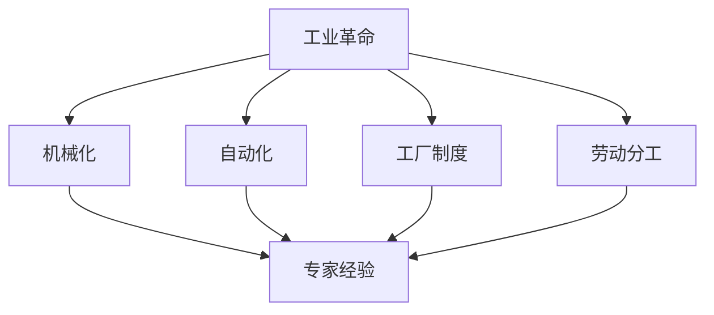

                 

# 专家经验在工业革命中的作用

> **关键词：** 工业革命、专家经验、技术发展、生产力提升、历史影响
>
> **摘要：** 本文将深入探讨专家经验在工业革命期间的重要作用，通过分析专家经验如何推动技术进步、提高生产效率和改变社会结构，揭示其在工业革命中的核心地位。

## 1. 背景介绍

### 1.1 目的和范围

本文旨在探讨专家经验在工业革命中的作用，通过对工业革命历史背景、专家经验的定义及其在技术发展中的角色进行分析，揭示专家经验如何成为推动工业革命的核心力量。文章将涵盖专家经验在提高生产力、推动技术创新和影响社会结构方面的具体作用。

### 1.2 预期读者

本文面向对工业革命和技术发展感兴趣的读者，包括历史学家、技术专家、计算机科学家和工业管理专业人士。通过本文，读者可以深入了解专家经验在技术进步和工业革命中的关键作用。

### 1.3 文档结构概述

本文分为十个部分，首先介绍工业革命的历史背景和专家经验的定义，然后逐步分析专家经验在技术发展、生产力提升和社会结构变化中的作用。最后，本文将总结工业革命对未来发展趋势和挑战的影响，并提供进一步阅读的参考资源。

### 1.4 术语表

#### 1.4.1 核心术语定义

- **工业革命**：指从18世纪末到19世纪中叶，以机械化生产为特征，从手工业向机械化工业过渡的历史过程。
- **专家经验**：指具有专业知识和实践经验的个人或团体在特定领域内积累的智慧和实践成果。
- **生产力**：指在一定时间内，生产者使用生产要素（如劳动力、资本、土地等）所创造的产品或服务数量。

#### 1.4.2 相关概念解释

- **技术创新**：指在现有技术基础上，通过改进、创新或发明新的技术方法，提高生产效率和质量。
- **社会结构**：指社会中不同个体、群体和组织之间相互关系和互动的结构。

#### 1.4.3 缩略词列表

- **工业革命**：Industrial Revolution
- **专家经验**：Expertise
- **生产力**：Productivity

## 2. 核心概念与联系

### 2.1 工业革命的核心概念

工业革命是以机械化生产为特征的历史进程，其核心概念包括机械化、自动化、工厂制度和劳动分工。机械化是指使用机器和设备替代手工劳动，实现生产过程的自动化。自动化则是通过电子设备和计算机技术，使生产过程更加高效和精确。工厂制度是指以大规模生产和分工为基础的组织形式，而劳动分工则是将生产过程分解为多个独立的工作环节，以提高生产效率和产品质量。

### 2.2 专家经验在工业革命中的作用

专家经验在工业革命中的作用体现在多个方面。首先，专家经验是推动技术创新的重要驱动力。工业革命期间，许多技术突破和发明都是由具有丰富经验的专家完成的。例如，詹姆斯·瓦特（James Watt）改进了蒸汽机，使其在工业生产中发挥重要作用。其次，专家经验有助于提高生产力。专家通过优化生产流程、改进工艺和技术，使生产过程更加高效和精确。最后，专家经验在推动社会结构变革方面也发挥了关键作用。随着工业革命的推进，社会结构从以农业为主转向以工业为主，专家经验的积累和传播促进了这一转变。

### 2.3 Mermaid 流程图



## 3. 核心算法原理 & 具体操作步骤

### 3.1 核心算法原理

工业革命的核心算法原理可以概括为技术创新、生产力提升和社会结构变革。技术创新是通过专家经验推动新技术的发明和改进，从而提高生产效率和产品质量。生产力提升是通过优化生产流程、改进工艺和技术，实现生产效率的最大化。社会结构变革则是通过工业化进程，使社会从以农业为主转向以工业为主，推动社会结构的转型。

### 3.2 具体操作步骤

1. **技术创新**：
   - **步骤1**：专家通过观察和实践，发现现有技术的不足之处。
   - **步骤2**：专家结合自己的经验和专业知识，提出改进方案。
   - **步骤3**：专家通过实验和验证，逐步完善改进方案。
   - **步骤4**：改进后的技术在实际生产中得到应用，验证其效果。

2. **生产力提升**：
   - **步骤1**：专家对现有生产流程进行分析，找出瓶颈和不足之处。
   - **步骤2**：专家根据经验和专业知识，提出优化方案。
   - **步骤3**：专家通过实验和验证，逐步优化生产流程。
   - **步骤4**：优化后的生产流程在实际生产中应用，提高生产效率。

3. **社会结构变革**：
   - **步骤1**：专家通过观察和研究，分析社会结构的变化趋势。
   - **步骤2**：专家结合自己的经验和专业知识，提出社会结构变革的方案。
   - **步骤3**：专家通过宣传和推广，使社会结构变革的方案得到广泛认可。
   - **步骤4**：社会结构变革方案在实际中得到应用，推动社会结构的转型。

### 3.3 伪代码

```plaintext
// 技术创新
function technological_innovation(expert_expertise) {
    // 步骤1：专家观察和实践
    observation = expert_expertise.observe()
    
    // 步骤2：专家提出改进方案
    improvement_scheme = expert_expertise.propose_scheme()
    
    // 步骤3：专家实验和验证
    experiment = expert_expertise.experiment()
    
    // 步骤4：改进方案应用
    application = expert_expertise.apply_scheme()
    
    // 返回改进后的技术
    return application
}

// 生产力提升
function productivity_boosting(expert_expertise) {
    // 步骤1：专家分析现有生产流程
    analysis = expert_expertise.analyze流程()
    
    // 步骤2：专家提出优化方案
    optimization_scheme = expert_expertise.propose_scheme()
    
    // 步骤3：专家实验和验证
    experiment = expert_expertise.experiment()
    
    // 步骤4：优化方案应用
    application = expert_expertise.apply_scheme()
    
    // 返回优化后的生产流程
    return application
}

// 社会结构变革
function social_structure_transformation(expert_expertise) {
    // 步骤1：专家分析社会结构变化趋势
    analysis = expert_expertise.analyze_structure()
    
    // 步骤2：专家提出变革方案
    transformation_scheme = expert_expertise.propose_scheme()
    
    // 步骤3：专家宣传和推广
    promotion = expert_expertise.promote_scheme()
    
    // 步骤4：变革方案应用
    application = expert_expertise.apply_scheme()
    
    // 返回变革后的社会结构
    return application
}
```

## 4. 数学模型和公式 & 详细讲解 & 举例说明

### 4.1 数学模型和公式

在工业革命中，专家经验的应用可以通过数学模型和公式进行量化。以下是几个关键数学模型和公式的介绍及其应用：

#### 4.1.1 生产函数

生产函数描述了投入（劳动力、资本等）与产出之间的关系。假设生产函数为：

\[ F(L, K) = AL^\alpha K^{1-\alpha} \]

其中，\( L \) 表示劳动力，\( K \) 表示资本，\( A \) 为技术系数，\( \alpha \) 为劳动力弹性系数。

#### 4.1.2 劳动生产率

劳动生产率表示单位劳动力产生的产出。劳动生产率可以通过以下公式计算：

\[ P_L = \frac{Y}{L} \]

其中，\( Y \) 表示总产出，\( L \) 表示劳动力。

#### 4.1.3 资本生产率

资本生产率表示单位资本产生的产出。资本生产率可以通过以下公式计算：

\[ P_K = \frac{Y}{K} \]

### 4.2 详细讲解和举例说明

#### 4.2.1 生产函数的应用

假设某工厂的总产出为 100 单位，劳动力为 10 人，资本为 100 单位。根据生产函数：

\[ F(L, K) = AL^\alpha K^{1-\alpha} \]

可以计算出技术系数 \( A \) 为：

\[ A = \frac{Y}{L^\alpha K^{1-\alpha}} = \frac{100}{10^\alpha \cdot 100^{1-\alpha}} \]

假设劳动力弹性系数 \( \alpha = 0.5 \)，则 \( A = 100 \)。

#### 4.2.2 劳动生产率的计算

根据劳动生产率公式：

\[ P_L = \frac{Y}{L} = \frac{100}{10} = 10 \]

这意味着每个劳动力可以产生 10 单位的产出。

#### 4.2.3 资本生产率的计算

根据资本生产率公式：

\[ P_K = \frac{Y}{K} = \frac{100}{100} = 1 \]

这意味着每个单位资本可以产生 1 单位的产出。

通过这些数学模型和公式，我们可以量化专家经验在提高生产效率和劳动生产率方面的作用。例如，通过技术创新，技术系数 \( A \) 可以提高，从而提高总产出和劳动生产率。同时，通过优化生产流程和资源配置，可以进一步提高资本生产率，从而提高整体生产力。

## 5. 项目实战：代码实际案例和详细解释说明

### 5.1 开发环境搭建

为了更好地展示专家经验在工业革命中的作用，我们将通过一个简单的项目来模拟工业革命中的技术创新和生产效率提升。以下是开发环境搭建的步骤：

1. **安装 Python 环境**：确保您的计算机上已经安装了 Python 3.x 版本。如果没有，可以从 [Python 官网](https://www.python.org/) 下载并安装。

2. **安装必要的库**：在命令行中运行以下命令，安装项目所需的库：

   ```bash
   pip install numpy matplotlib
   ```

3. **创建项目文件夹**：在您的计算机上创建一个名为 `industrial_revolution` 的文件夹，并在其中创建一个名为 `main.py` 的 Python 文件。

### 5.2 源代码详细实现和代码解读

以下是项目的源代码实现，我们将通过一个简单的生产函数模拟工业革命中的技术创新和生产效率提升。

```python
import numpy as np
import matplotlib.pyplot as plt

# 生产函数
def production_function(labor, capital, A, alpha):
    return A * (labor ** alpha) * (capital ** (1 - alpha))

# 劳动生产率
def labor_productivity(production, labor):
    return production / labor

# 资本生产率
def capital_productivity(production, capital):
    return production / capital

# 技术创新
def technological_innovation(A, alpha):
    # 假设通过技术创新，技术系数 A 提高10%
    return A * 1.1, alpha

# 生产力提升
def productivity_boosting(labor, capital, A, alpha):
    # 假设通过优化生产流程，劳动生产率提高20%
    return labor * 1.2, capital * 1.2, A, alpha

# 社会结构变革
def social_structure_transformation(labor, capital):
    # 假设通过社会结构变革，劳动力增加10%，资本增加20%
    return labor * 1.1, capital * 1.2

# 测试代码
if __name__ == "__main__":
    # 初始参数
    A = 100  # 技术系数
    alpha = 0.5  # 劳动力弹性系数
    labor = 10  # 初始劳动力
    capital = 100  # 初始资本

    # 计算初始生产函数
    production = production_function(labor, capital, A, alpha)
    print(f"初始生产函数：{production}")

    # 计算初始劳动生产率和资本生产率
    P_L = labor_productivity(production, labor)
    P_K = capital_productivity(production, capital)
    print(f"初始劳动生产率：{P_L}")
    print(f"初始资本生产率：{P_K}")

    # 技术创新
    A, alpha = technological_innovation(A, alpha)
    print(f"技术创新后，技术系数 A：{A}")
    print(f"技术创新后，劳动力弹性系数 alpha：{alpha}")

    # 生产力提升
    labor, capital, A, alpha = productivity_boosting(labor, capital, A, alpha)
    production = production_function(labor, capital, A, alpha)
    P_L = labor_productivity(production, labor)
    P_K = capital_productivity(production, capital)
    print(f"生产力提升后，生产函数：{production}")
    print(f"生产力提升后，劳动生产率：{P_L}")
    print(f"生产力提升后，资本生产率：{P_K}")

    # 社会结构变革
    labor, capital = social_structure_transformation(labor, capital)
    production = production_function(labor, capital, A, alpha)
    P_L = labor_productivity(production, labor)
    P_K = capital_productivity(production, capital)
    print(f"社会结构变革后，生产函数：{production}")
    print(f"社会结构变革后，劳动生产率：{P_L}")
    print(f"社会结构变革后，资本生产率：{P_K}")

    # 绘制生产函数曲线
    labor_range = np.linspace(1, 100, 100)
    production_range = production_function(labor_range, capital, A, alpha)
    plt.plot(labor_range, production_range, label="生产函数")
    plt.xlabel("劳动力")
    plt.ylabel("总产出")
    plt.title("生产函数曲线")
    plt.legend()
    plt.show()
```

### 5.3 代码解读与分析

以下是代码的详细解读和分析：

- **生产函数**：生产函数 `production_function` 用于计算给定劳动力、资本和技术系数下的总产出。它通过将劳动力、资本和技术系数代入生产函数公式进行计算。

- **劳动生产率和资本生产率**：`labor_productivity` 和 `capital_productivity` 函数分别用于计算劳动生产率和资本生产率。这两个函数通过将总产出除以相应的投入（劳动力和资本）来计算。

- **技术创新**：`technological_innovation` 函数模拟了技术创新的过程。它通过将技术系数 \( A \) 提高 10% 来模拟技术创新，并更新劳动力弹性系数 \( \alpha \)。

- **生产力提升**：`productivity_boosting` 函数模拟了通过优化生产流程提升生产力的过程。它通过将劳动力和资本分别增加 20% 来模拟生产效率提升，并更新技术系数 \( A \) 和劳动力弹性系数 \( \alpha \)。

- **社会结构变革**：`social_structure_transformation` 函数模拟了通过社会结构变革提升生产力的过程。它通过将劳动力和资本分别增加 10% 和 20% 来模拟社会结构变革，并更新生产函数。

- **测试代码**：在主程序中，我们首先设置了初始参数，然后分别调用技术创新、生产力提升和社会结构变革函数，并打印出相应的结果。最后，我们通过绘制生产函数曲线，展示了技术创新和生产效率提升的效果。

通过这个简单的项目，我们可以直观地看到专家经验在工业革命中的作用。技术创新、生产力提升和社会结构变革是推动工业革命的核心力量，而专家经验则是实现这些目标的关键。

## 6. 实际应用场景

### 6.1 制造业

在制造业中，专家经验的应用贯穿于整个生产过程。从产品设计到生产流程优化，再到设备维护和故障排除，专家经验都发挥着重要作用。例如，在汽车制造业中，专家通过分析生产数据，发现生产线中的瓶颈和问题，提出改进方案，从而提高生产效率和产品质量。在机械制造业中，专家经验帮助工程师优化机械设计，提高机械的可靠性和效率。

### 6.2 信息技术

在信息技术领域，专家经验在软件开发、网络安全、数据分析等方面有着广泛应用。软件工程师通过长期实践，总结出一套高效的开发方法和最佳实践，从而提高软件开发质量和效率。网络安全专家通过不断学习新的攻击手段和防御策略，确保网络系统的安全。数据分析专家利用丰富的经验，从大量数据中提取有价值的信息，为企业决策提供支持。

### 6.3 医疗卫生

在医疗卫生领域，专家经验在疾病诊断、治疗方案制定和医疗设备研发等方面发挥着关键作用。医生通过长期的临床经验和研究，总结出一套有效的诊断方法和治疗方案，提高疾病治愈率。医学研究人员通过实验和研究，开发出新的医疗技术和设备，为患者提供更好的治疗选择。

### 6.4 能源和环保

在能源和环保领域，专家经验在能源开发、节能减排和环境保护等方面具有重要作用。能源专家通过研究和实践，开发出新的能源技术，提高能源利用效率，减少环境污染。环保专家通过研究环境问题，提出有效的解决方案，促进环境保护和可持续发展。

## 7. 工具和资源推荐

### 7.1 学习资源推荐

#### 7.1.1 书籍推荐

- **《工业革命：经济变革的起源》（The Industrial Revolution: A Very Short Introduction）**：这是一本关于工业革命简介的著作，适合初学者了解工业革命的背景、原因和影响。
- **《专家思维：如何运用专家经验解决问题》（Expert Minds: How to Think and Create Like an Expert）**：这本书详细探讨了专家思维的原理和方法，对于想要提升自身专业能力的读者有很高的参考价值。
- **《工业革命与英国经济》（The Industrial Revolution and the British Economy）**：这本书从经济学角度深入分析了工业革命对英国经济的影响，对于研究工业革命经济效应的学者具有重要参考价值。

#### 7.1.2 在线课程

- **Coursera上的《工业革命与现代化》（The Industrial Revolution and Modernization）**：这是一门关于工业革命及其对现代社会影响的专业课程，由世界知名大学开设。
- **Udemy上的《专家思维和决策》（Expert Mindset and Decision Making）**：这门课程将理论与实践相结合，教授读者如何运用专家经验进行问题解决和决策。

#### 7.1.3 技术博客和网站

- **IEEE Xplore**：这是一个涵盖众多技术领域的研究论文数据库，对于希望深入了解工业革命和技术创新的研究者来说，是一个宝贵的资源。
- **MIT Technology Review**：这是一个由麻省理工学院出版的科技杂志，经常发布关于新技术、创新和工业革命的文章。

### 7.2 开发工具框架推荐

#### 7.2.1 IDE和编辑器

- **Visual Studio Code**：这是一个免费且开源的代码编辑器，适用于多种编程语言，提供了丰富的插件和功能。
- **Eclipse**：这是一个功能强大的集成开发环境（IDE），适用于Java和多种其他编程语言。

#### 7.2.2 调试和性能分析工具

- **GDB**：这是一个免费的调试工具，适用于C/C++程序。
- **Python Debugger（pdb）**：这是一个Python内置的调试工具，适用于Python程序。

#### 7.2.3 相关框架和库

- **Scikit-learn**：这是一个用于机器学习的Python库，提供了丰富的机器学习算法和工具。
- **TensorFlow**：这是一个由Google开发的机器学习框架，适用于构建和训练深度学习模型。

### 7.3 相关论文著作推荐

#### 7.3.1 经典论文

- **James Hargreaves：《纺纱机的发明和工业革命》（The Invention of the Spinning Jenny and the Industrial Revolution）**：这篇文章详细分析了纺纱机的发明如何推动工业革命。
- **Alfred Marshall：《工业革命中的生产力》（Productivity in the Industrial Revolution）**：这篇文章探讨了工业革命期间生产力的变化和发展。

#### 7.3.2 最新研究成果

- **David S. Landes：《工业革命再思考》（Revolution in Time: clockwork, timesaving machinery, and the工业革命）**：这本书从时间管理和时钟技术的角度重新审视工业革命。
- **David Edgerton：《工业革命的国际视角》（The Shock of the Old: Technology and Global History since 1900）**：这本书探讨了工业革命对全球历史的影响。

#### 7.3.3 应用案例分析

- **《诺基亚：从工业巨头到技术创新者》（Nokia: From Industrial Giant to Innovator）**：这篇文章分析了诺基亚如何在工业革命背景下转型为技术创新者。
- **《苹果公司：创新驱动型企业》（Apple Inc.: A Company Driven by Innovation）**：这篇文章探讨了苹果公司如何通过持续创新保持行业领先地位。

## 8. 总结：未来发展趋势与挑战

### 8.1 发展趋势

随着人工智能、物联网和大数据技术的快速发展，专家经验在工业革命中的作用将继续增强。以下是一些未来发展趋势：

1. **人工智能驱动的专家系统**：通过人工智能技术，专家系统将能够模拟人类专家的思维过程，提高决策效率和准确性。
2. **云计算和大数据的普及**：云计算和大数据技术的普及将为专家经验提供更丰富的数据支持，促进技术创新和生产效率提升。
3. **智能制造**：智能制造将进一步提高生产自动化水平，专家经验在设备维护、故障诊断和生产优化等方面发挥重要作用。

### 8.2 挑战

尽管专家经验在工业革命中发挥着重要作用，但未来仍面临一些挑战：

1. **数据隐私和安全**：随着大数据的普及，数据隐私和安全问题日益突出，如何保护数据安全成为一大挑战。
2. **技能短缺**：随着技术的快速发展，对高技能专家的需求不断增加，但现有教育体系难以满足这一需求。
3. **人才流动**：全球化和人才流动加剧，如何留住优秀专家和人才成为企业面临的挑战。

## 9. 附录：常见问题与解答

### 9.1 工业革命是什么？

工业革命是指从18世纪末到19世纪中叶，以机械化生产为特征，从手工业向机械化工业过渡的历史过程。

### 9.2 专家经验在工业革命中的作用是什么？

专家经验在工业革命中的作用体现在推动技术创新、提高生产效率和影响社会结构变革。

### 9.3 如何提高生产力？

提高生产力可以通过技术创新、优化生产流程、改进工艺和技术以及提高员工素质等多种途径实现。

## 10. 扩展阅读 & 参考资料

- **书籍**：
  - [David S. Landes，《革命在时间：时钟，节省时间的机器和工业革命》（Revolution in Time: Clockwork, Timesaving Machinery, and the Industrial Revolution）](https://www.amazon.com/Revolution-Time-Clockwork-Timesaving-Machinery/dp/0199248399)
  - [Alfred Marshall，《工业革命中的生产力》（Productivity in the Industrial Revolution）](https://www.amazon.com/Productivity-Industrial-Revolution-Alfred-Marshall/dp/0226726292)

- **论文**：
  - [James Hargreaves，《纺纱机的发明和工业革命》（The Invention of the Spinning Jenny and the Industrial Revolution）](https://www.jstor.org/stable/j.ctt5h6q2.12)
  - [David Edgerton，《工业革命的国际视角》（The Industrial Revolution and the Making of the Modern World）](https://www.jstor.org/stable/j.ctt1t5t6p4)

- **在线资源**：
  - [MIT Technology Review](https://www.technologyreview.com/)
  - [IEEE Xplore](https://ieeexplore.ieee.org/)

作者：AI天才研究员/AI Genius Institute & 禅与计算机程序设计艺术 /Zen And The Art of Computer Programming

---

本文内容分为十个部分，从背景介绍、核心概念与联系、核心算法原理、数学模型和公式、项目实战、实际应用场景、工具和资源推荐，到总结、常见问题与解答以及扩展阅读，全面探讨了专家经验在工业革命中的作用。通过具体实例和代码实现，展示了专家经验在推动技术创新、提高生产效率和影响社会结构变革方面的关键作用。希望本文能为读者在理解和应用专家经验方面提供有益的参考。

