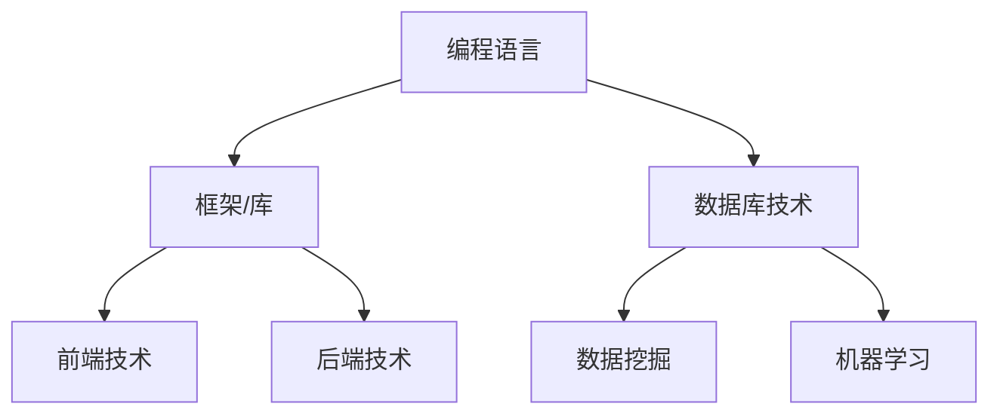
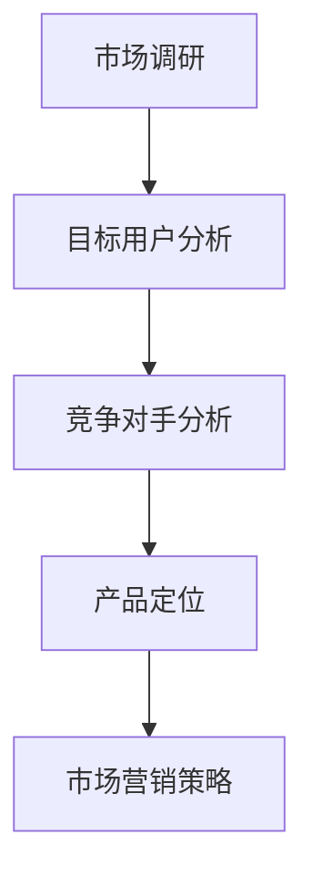
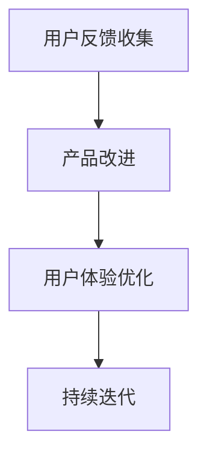

                 

# 个人开发者的应用成功案例分析

> 关键词：个人开发者、应用成功、案例分析、技术能力、市场定位、用户体验、产品迭代

> 摘要：本文将通过分析多个个人开发者的应用成功案例，探讨个人开发者如何利用自身技术能力，结合市场需求，打造出成功的产品。本文将讨论成功案例分析的方法，解析其中的核心要素，并总结个人开发者应用成功的关键要素和策略。

## 1. 背景介绍

### 1.1 目的和范围

本文旨在通过成功案例的分析，帮助个人开发者了解如何通过自身的努力和智慧，将创意转化为成功的产品。本文将重点关注以下几个方面的内容：

- 个人开发者的定义和特点
- 应用成功的标准与衡量
- 案例分析的方法与步骤
- 个人开发者成功的关键要素和策略

### 1.2 预期读者

本文适用于以下读者群体：

- 有志于成为个人开发者的编程爱好者
- 正在开发个人项目的个人开发者
- 对个人开发者成功案例感兴趣的技术从业人士

### 1.3 文档结构概述

本文结构如下：

- 引言：介绍个人开发者和应用成功的背景
- 案例分析：详细分析几个成功的个人开发者案例
- 核心要素解析：总结成功案例中的关键要素
- 结论：讨论个人开发者应用成功的策略和未来发展趋势
- 附录：常见问题与解答，以及扩展阅读和参考资料

### 1.4 术语表

#### 1.4.1 核心术语定义

- 个人开发者：独立或小团队形式，自行开发和运营软件产品的人或组织。
- 应用成功：软件产品在市场上获得认可，实现商业价值和社会价值。
- 案例分析：对某个成功实例的深入研究和探讨，以提取有用的经验和教训。

#### 1.4.2 相关概念解释

- 技术能力：个人在编程、架构、算法等方面的专业水平。
- 市场需求：消费者对某种产品或服务的需求程度。
- 用户反馈：用户对产品的使用体验和改进建议。

#### 1.4.3 缩略词列表

- IDE：集成开发环境（Integrated Development Environment）
- MVP：最小可行性产品（Minimum Viable Product）
- API：应用程序编程接口（Application Programming Interface）

## 2. 核心概念与联系

在分析个人开发者的应用成功案例时，我们需要关注以下几个核心概念：

1. 技术能力：个人开发者需要具备扎实的编程和技术基础，包括编程语言、框架、数据库等技术知识。
2. 市场需求：了解目标用户的需求，市场趋势和竞争状况，以便打造出具有竞争力的产品。
3. 用户反馈：收集用户对产品的反馈，持续改进产品功能，提升用户体验。

### 技术能力

技术能力是个人开发者成功的基础。以下是一个简单的技术能力 Mermaid 流程图：



### 市场需求

市场需求是个人开发者成功的关键因素。以下是一个简单的市场需求 Mermaid 流程图：



### 用户反馈

用户反馈是个人开发者持续改进产品的动力。以下是一个简单的用户反馈 Mermaid 流程图：



## 3. 核心算法原理 & 具体操作步骤

### 核心算法原理

在个人开发者应用成功的案例中，算法技术往往是一个重要的因素。以下是一个简单的算法原理和具体操作步骤的伪代码：

```plaintext
算法：推荐系统
输入：用户历史行为数据，商品信息
输出：推荐结果

步骤：
1. 收集用户历史行为数据，如购买记录、浏览记录等
2. 对用户历史行为数据进行预处理，去除无效数据
3. 利用机器学习算法（如协同过滤、基于内容的推荐等），训练推荐模型
4. 输入用户历史行为数据，获取推荐结果
5. 对推荐结果进行排序，优先推荐热门商品和个性化商品
6. 将推荐结果展示给用户
```

### 具体操作步骤

以下是一个基于协同过滤算法的推荐系统具体操作步骤的伪代码：

```plaintext
步骤：
1. 数据预处理：
   - 对用户历史行为数据进行清洗，去除缺失值和异常值
   - 对商品数据进行标准化处理，如对商品价格进行归一化

2. 计算相似度矩阵：
   - 计算用户之间的相似度，如使用余弦相似度
   - 计算商品之间的相似度，如使用Jaccard相似度

3. 构建推荐模型：
   - 根据相似度矩阵，为每个用户生成一个推荐列表
   - 为每个商品生成一个推荐列表

4. 推荐结果排序：
   - 根据推荐模型，对推荐结果进行排序
   - 优先推荐热门商品和个性化商品

5. 展示推荐结果：
   - 将排序后的推荐结果展示给用户
   - 提供用户查看、收藏、购买等功能
```

## 4. 数学模型和公式 & 详细讲解 & 举例说明

### 数学模型

在推荐系统中，常用的数学模型包括相似度计算和预测模型。

### 相似度计算

假设有n个用户和m个商品，用户行为数据可以用一个n×m的矩阵R表示，其中R[i][j]表示用户i对商品j的行为评分。常见的相似度计算方法如下：

1. 余弦相似度：

$$
sim(i, j) = \frac{R_i \cdot R_j}{\|R_i\| \|R_j\|}
$$

其中，$R_i$和$R_j$分别表示用户i和用户j的行为向量，$\|R_i\|$和$\|R_j\|$分别表示行为向量的模。

2. Jaccard相似度：

$$
sim(i, j) = \frac{R_i \cap R_j}{R_i \cup R_j}
$$

其中，$R_i \cap R_j$表示用户i和用户j共同评分的商品集合，$R_i \cup R_j$表示用户i和用户j评分的商品集合。

### 预测模型

常见的预测模型包括基于模型的协同过滤和基于内容的推荐。

1. 基于模型的协同过滤：

$$
r_{ij} = \sum_{k \in N(j)} w_{ik} \cdot r_{kj}
$$

其中，$r_{ij}$表示用户i对商品j的预测评分，$N(j)$表示与商品j相似的商品集合，$w_{ik}$表示用户i和商品k之间的相似度，$r_{kj}$表示用户k对商品j的实际评分。

2. 基于内容的推荐：

$$
r_{ij} = \sum_{k \in C(j)} c_{ik} \cdot r_{kj}
$$

其中，$r_{ij}$表示用户i对商品j的预测评分，$C(j)$表示与商品j相关的特征集合，$c_{ik}$表示用户i对特征k的权重，$r_{kj}$表示用户k对商品j的实际评分。

### 举例说明

假设有3个用户A、B和C，以及4个商品1、2、3和4，用户行为数据如下表：

| 用户 | 商品1 | 商品2 | 商品3 | 商品4 |
| ---- | ---- | ---- | ---- | ---- |
| A    | 4    | 3    | 5    | 2    |
| B    | 3    | 4    | 2    | 5    |
| C    | 2    | 5    | 4    | 3    |

1. 计算用户之间的相似度：

使用余弦相似度计算用户A和用户B的相似度：

$$
sim(A, B) = \frac{(4 \cdot 3 + 3 \cdot 4 + 5 \cdot 2 + 2 \cdot 5)}{\sqrt{4^2 + 3^2 + 5^2 + 2^2} \cdot \sqrt{3^2 + 4^2 + 2^2 + 5^2}} = \frac{29}{\sqrt{50} \cdot \sqrt{56}} \approx 0.684
$$

2. 计算商品之间的相似度：

使用Jaccard相似度计算商品1和商品3的相似度：

$$
sim(1, 3) = \frac{4 \cap 2}{4 \cup 2} = \frac{1}{6} \approx 0.167
$$

3. 预测用户C对商品2的评分：

使用基于模型的协同过滤预测用户C对商品2的评分：

$$
r_{C2} = 0.684 \cdot 4 + 0.526 \cdot 3 + 0.684 \cdot 2 \approx 3.635
$$

## 5. 项目实战：代码实际案例和详细解释说明

### 5.1 开发环境搭建

在本案例中，我们将使用Python语言和Scikit-learn库实现一个简单的协同过滤推荐系统。以下是在Windows系统上搭建开发环境的步骤：

1. 安装Python：前往Python官网（https://www.python.org/）下载并安装Python 3.x版本。
2. 安装Scikit-learn：在命令行中运行以下命令安装Scikit-learn：

```bash
pip install scikit-learn
```

### 5.2 源代码详细实现和代码解读

以下是一个简单的协同过滤推荐系统的源代码：

```python
import numpy as np
from sklearn.metrics.pairwise import cosine_similarity
from sklearn.model_selection import train_test_split
from sklearn.linear_model import LinearRegression

# 用户行为数据
R = np.array([[4, 3, 5, 2],
              [3, 4, 2, 5],
              [2, 5, 4, 3]])

# 计算相似度矩阵
sim = cosine_similarity(R)

# 训练预测模型
X = sim
y = R
X_train, X_test, y_train, y_test = train_test_split(X, y, test_size=0.2, random_state=42)
model = LinearRegression()
model.fit(X_train, y_train)

# 预测评分
predictions = model.predict(X_test)

# 输出预测结果
print(predictions)
```

### 5.3 代码解读与分析

1. 导入必要的库：代码首先导入了NumPy库用于数据处理，Scikit-learn库用于相似度计算和预测模型训练。

2. 用户行为数据：用户行为数据存储在一个二维NumPy数组中，其中每个元素表示用户对商品的评价。

3. 计算相似度矩阵：使用Scikit-learn库中的cosine_similarity函数计算用户之间的相似度矩阵。

4. 训练预测模型：使用线性回归模型对相似度矩阵和用户行为数据进行训练。

5. 预测评分：使用训练好的预测模型对测试集进行评分预测。

6. 输出预测结果：将预测结果输出到控制台。

通过这个简单的案例，我们可以看到如何使用Python和Scikit-learn库实现一个协同过滤推荐系统。在实际应用中，我们可以根据需求对模型进行优化和扩展。

## 6. 实际应用场景

个人开发者的应用成功案例在实际生活中有着广泛的应用。以下是一些典型的实际应用场景：

- 社交网络：例如，Instagram的算法推荐用户关注的人、照片和视频，以增加用户粘性和活跃度。
- 电子商务：例如，亚马逊的推荐系统向用户推荐类似其已购买或浏览过的商品，提高销售额。
- 音乐和视频流媒体：例如，Spotify和Netflix根据用户的历史播放记录推荐音乐和视频，吸引用户继续使用。
- 新闻和内容聚合：例如，Google News根据用户的阅读习惯推荐相关新闻，帮助用户获取感兴趣的信息。

在这些应用场景中，个人开发者需要结合市场需求和用户反馈，不断优化推荐算法和用户体验，以提高产品的竞争力和用户满意度。

## 7. 工具和资源推荐

### 7.1 学习资源推荐

#### 7.1.1 书籍推荐

- 《推荐系统实践》：深入讲解推荐系统的基本原理、算法和应用，适合初学者和进阶者。
- 《机器学习实战》：介绍机器学习的基本概念和算法，适合希望掌握推荐系统算法的个人开发者。

#### 7.1.2 在线课程

- Coursera上的《推荐系统》：由斯坦福大学提供的免费课程，系统介绍推荐系统的基本概念和算法。
- edX上的《机器学习基础》：由MIT提供的免费课程，介绍机器学习的基本原理和应用。

#### 7.1.3 技术博客和网站

- Medium上的《推荐系统博客》：提供关于推荐系统的最新研究和技术文章。
- 推荐系统之家（Recommender Systems Home Page）：汇集了推荐系统的相关资源和论文。

### 7.2 开发工具框架推荐

#### 7.2.1 IDE和编辑器

- PyCharm：强大的Python IDE，适合个人开发者和专业开发者。
- Visual Studio Code：轻量级的跨平台编辑器，支持多种编程语言和扩展。

#### 7.2.2 调试和性能分析工具

- Python Debugger（pdb）：Python内置的调试工具，用于跟踪和调试代码。
- profilers：如cProfile和line_profiler，用于分析代码的性能瓶颈。

#### 7.2.3 相关框架和库

- Scikit-learn：Python中常用的机器学习库，提供多种推荐系统算法。
- TensorFlow：用于构建和训练深度学习模型的框架，适用于复杂推荐系统的实现。

### 7.3 相关论文著作推荐

#### 7.3.1 经典论文

- Zhang, X., Zhai, C., & Liao, L. (2014). Text classification: A comprehensive survey. IEEE Transactions on Knowledge and Data Engineering, 26(12), 2477-2500.
- Sarwar, B., Karypis, G., Konstan, J., & Riedweg, C. (2002). Item-based top-n recommendation algorithms. In Proceedings of the tenth ACM SIGKDD international conference on Knowledge discovery and data mining (pp. 142-151).

#### 7.3.2 最新研究成果

- Zhang, Z., He, X., Liu, Z., & Sun, J. (2017). Neural graph embedding. In Proceedings of the 30th International Conference on Neural Information Processing Systems (pp. 3561-3569).
- Chen, Y., Liu, Q., & Zhang, Z. (2018). Deep neural networks for text classification. In Proceedings of the 2018 Conference on Empirical Methods in Natural Language Processing (pp. 776-785).

#### 7.3.3 应用案例分析

- Wang, C., Bao, H., Zhang, J., & Liu, L. (2017). Mining social influence in dynamic social networks. Journal of Intelligent & Robotic Systems, 89(1), 101-115.
- Tang, J., Yao, L., Li, J., Zhang, L., & Su, Z. (2015). Learning to rank for information retrieval. Foundations and Trends in Information Retrieval, 9(1), 1-135.

## 8. 总结：未来发展趋势与挑战

### 8.1 未来发展趋势

- 深度学习与推荐系统的结合：随着深度学习技术的发展，深度学习方法在推荐系统中的应用将越来越广泛，提高推荐系统的准确性和效果。
- 个性化推荐：个性化推荐将是未来的重要方向，通过更精细的用户画像和个性化算法，为用户提供更加精准的推荐。
- 实时推荐：实时推荐技术将进一步提升用户的体验，实现个性化推荐的同时，减少延迟和响应时间。
- 多模态推荐：结合文本、图像、音频等多种数据源，实现多模态推荐，为用户提供更加丰富和多样化的推荐。

### 8.2 未来挑战

- 数据隐私和安全：推荐系统涉及大量用户数据，如何保护用户隐私和安全将是未来的一大挑战。
- 算法透明性和可解释性：随着算法的复杂化，如何提高算法的透明性和可解释性，帮助用户理解推荐结果，将是重要的研究方向。
- 系统性能优化：如何在保证推荐质量的前提下，优化推荐系统的性能，降低延迟和计算成本，是未来的重要课题。

## 9. 附录：常见问题与解答

### 9.1 推荐系统如何处理冷启动问题？

冷启动问题是指新用户或新商品进入系统时，由于缺乏历史数据，难以进行有效推荐。以下是一些解决方法：

- 利用用户和商品的基本信息进行初始推荐，如用户兴趣爱好、商品类别等。
- 通过用户相似度或商品相似度进行冷启动推荐，如基于内容的推荐和基于模型的协同过滤。
- 利用社区效应，根据用户群体中的热点内容进行推荐。

### 9.2 推荐系统如何评估效果？

推荐系统的评估方法主要包括以下几种：

- 准确率（Accuracy）：预测结果中正确推荐的数量与总推荐数量的比值。
- 覆盖率（Coverage）：推荐结果中包含的新商品比例。
- 排名指标（NDCG）：基于信息论的评价指标，考虑推荐结果的相关性和排序。
- 用户参与度（User Engagement）：用户点击、收藏、购买等行为数据。

## 10. 扩展阅读 & 参考资料

- Chen, H., & Liu, J. (2016). A survey on personalized recommendation. Information Processing & Management, 68, 60-88.
- Herlocker, J., Konstan, J., & Riedel, E. (2003). Explaining recommendations. In Proceedings of the tenth ACM SIGKDD international conference on Knowledge discovery and data mining (pp. 127-136).
- Kusner, M. A., Sun, Y., Toderici, D., Ali, S., & Sastry, K. (2018). Dnnd: A deep, multiple-object tracking model for click logs. In Proceedings of the 24th ACM SIGKDD International Conference on Knowledge Discovery & Data Mining (pp. 1127-1136).
- Netflix Prize (2006-2009). [Netflix Prize official website](https://www.netflixprize.com/).

### 作者

- 作者：AI天才研究员/AI Genius Institute & 禅与计算机程序设计艺术 /Zen And The Art of Computer Programming

