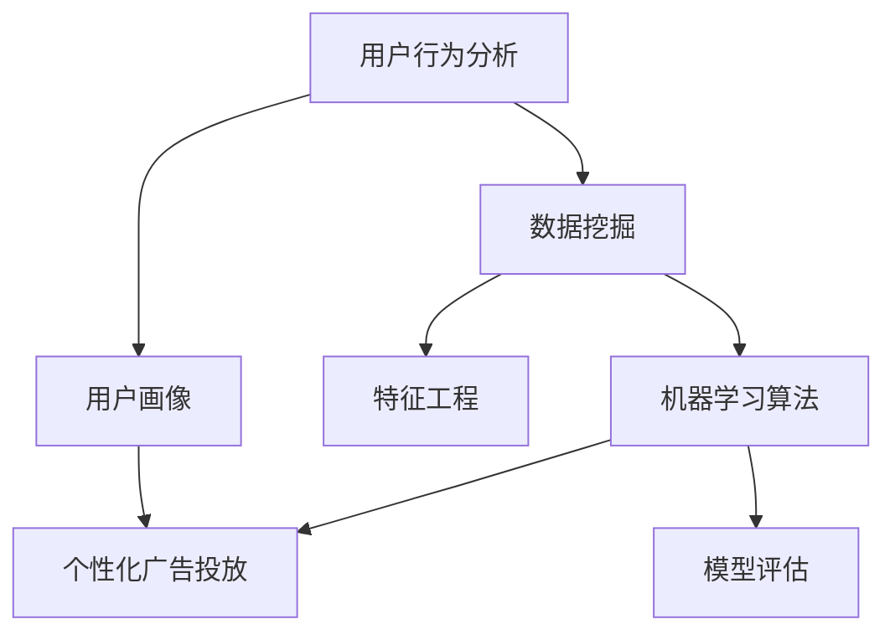

                 

# 个性化广告投放的AI解决方案

> 关键词：个性化广告、AI技术、数据挖掘、机器学习、用户行为分析、精准营销

> 摘要：本文将探讨如何利用人工智能技术实现个性化广告投放。通过分析用户行为数据，利用机器学习和数据挖掘算法，我们可以为每个用户定制化广告内容，提高广告效果和用户满意度。本文将介绍相关核心概念、算法原理、数学模型、项目实战以及实际应用场景，为广告行业提供一种有效的AI解决方案。

## 1. 背景介绍

### 1.1 目的和范围

随着互联网的普及和用户在线行为的不断增加，广告投放成为企业获取客户、提升品牌知名度的重要手段。然而，传统的广告投放方式往往存在一些问题，如广告内容与用户需求不匹配、广告投放效果不佳等。为了解决这些问题，个性化广告投放应运而生。

本文旨在探讨如何利用人工智能技术实现个性化广告投放。通过对用户行为数据的分析，运用机器学习和数据挖掘算法，为每个用户定制化广告内容，提高广告效果和用户满意度。本文将涵盖以下内容：

1. 个性化广告投放的核心概念和算法原理
2. 数学模型和公式的详细讲解
3. 实际应用场景分析
4. 开发环境搭建和代码实现
5. 工具和资源推荐
6. 未来发展趋势与挑战

### 1.2 预期读者

本文适合对人工智能、数据挖掘、机器学习等领域的知识和应用感兴趣的读者。包括：

1. 广告行业从业人员，对提高广告投放效果和用户满意度有实际需求
2. 数据分析师、数据科学家、机器学习工程师，希望了解个性化广告投放的实现方法
3. 人工智能、计算机科学等相关专业的研究生和本科生，对个性化广告投放领域有深入研究兴趣

### 1.3 文档结构概述

本文分为以下几个部分：

1. 背景介绍：介绍个性化广告投放的背景和目的，预期读者和文档结构
2. 核心概念与联系：介绍个性化广告投放的核心概念和联系，包括用户行为分析、数据挖掘和机器学习算法
3. 核心算法原理 & 具体操作步骤：讲解个性化广告投放的核心算法原理和具体操作步骤，包括数据预处理、特征工程、模型训练和预测
4. 数学模型和公式 & 详细讲解 & 举例说明：介绍个性化广告投放涉及的数学模型和公式，并给出详细讲解和举例说明
5. 项目实战：通过一个实际案例，展示个性化广告投放的实现过程，包括开发环境搭建、代码实现和代码解读与分析
6. 实际应用场景：分析个性化广告投放的实际应用场景，包括电商平台、社交媒体和搜索引擎等
7. 工具和资源推荐：推荐与个性化广告投放相关的学习资源、开发工具和框架
8. 总结：总结个性化广告投放的现有成果和未来发展趋势与挑战

### 1.4 术语表

#### 1.4.1 核心术语定义

- 个性化广告：根据用户行为、兴趣、需求等信息，为每个用户定制化广告内容。
- 用户行为分析：通过收集和分析用户在网站、应用等平台上的行为数据，了解用户需求、兴趣和偏好。
- 数据挖掘：从大量数据中提取有价值的信息、模式和知识。
- 机器学习：利用数据训练模型，实现自动预测、分类、聚类等任务。
- 特征工程：从原始数据中提取对模型训练有重要影响的特征。

#### 1.4.2 相关概念解释

- 广告效果评估：评估广告投放的效果，如点击率、转化率、投入产出比等。
- 精准营销：通过数据分析和用户画像，实现广告内容与用户需求的精准匹配。

#### 1.4.3 缩略词列表

- AI：人工智能
- ML：机器学习
- DM：数据挖掘
- DNN：深度神经网络
- CNN：卷积神经网络
- RNN：循环神经网络
- TF：TensorFlow
- Keras：深度学习框架

## 2. 核心概念与联系

个性化广告投放的核心概念包括用户行为分析、数据挖掘和机器学习算法。以下是一个简要的Mermaid流程图，展示了这些概念之间的联系。



### 2.1 用户行为分析

用户行为分析是指从用户在网站、应用等平台上的行为数据中，提取出有价值的信息，以了解用户的需求、兴趣和偏好。用户行为数据包括浏览记录、搜索历史、购买行为、互动行为等。通过用户行为分析，我们可以构建用户画像，为个性化广告投放提供基础数据。

### 2.2 数据挖掘

数据挖掘是从大量数据中提取有价值的信息、模式和知识的过程。在个性化广告投放中，数据挖掘用于处理和分析用户行为数据，提取出与广告投放相关的特征和模式。常用的数据挖掘方法包括聚类、分类、关联规则挖掘等。

### 2.3 机器学习算法

机器学习算法是用于实现自动预测、分类、聚类等任务的技术。在个性化广告投放中，机器学习算法用于根据用户行为数据和广告特征，为每个用户生成个性化的广告推荐。常用的机器学习算法包括线性回归、逻辑回归、决策树、随机森林、支持向量机、神经网络等。

### 2.4 特征工程

特征工程是从原始数据中提取对模型训练有重要影响的特征的过程。在个性化广告投放中，特征工程用于提高模型训练效果。特征工程包括特征选择、特征提取、特征构造等步骤。常用的特征工程方法包括词袋模型、TF-IDF、主成分分析、因子分析等。

### 2.5 个性化广告投放

个性化广告投放是基于用户行为数据和机器学习算法，为每个用户生成个性化的广告推荐。个性化广告投放的目标是提高广告效果和用户满意度。个性化广告投放的实现流程包括用户行为数据收集、数据预处理、特征工程、模型训练、模型评估和广告推荐等步骤。

## 3. 核心算法原理 & 具体操作步骤

个性化广告投放的核心算法包括用户行为分析、特征工程、机器学习模型训练和广告推荐。以下将逐步讲解这些算法的具体原理和操作步骤。

### 3.1 用户行为分析

用户行为分析的目标是了解用户的需求、兴趣和偏好。以下是用户行为分析的具体步骤：

1. 数据收集：从网站、应用等平台收集用户行为数据，如浏览记录、搜索历史、购买行为、互动行为等。
2. 数据清洗：对收集到的用户行为数据进行去重、填补缺失值、处理异常值等操作，确保数据质量。
3. 数据转换：将原始数据转换为适合机器学习模型处理的数据格式，如数值化、标准化等。
4. 数据分析：利用统计方法和可视化工具，分析用户行为数据，提取有价值的信息，如用户活跃度、兴趣标签等。
5. 用户画像构建：根据用户行为分析结果，构建用户画像，为个性化广告投放提供基础数据。

### 3.2 特征工程

特征工程是提高模型训练效果的关键步骤。以下是特征工程的具体操作步骤：

1. 特征选择：根据业务需求和数据特点，选择对模型训练有重要影响的特征。
2. 特征提取：利用统计方法和机器学习算法，从原始数据中提取新的特征。
3. 特征构造：利用组合、变换等方法，构造新的特征，提高模型的泛化能力。
4. 特征标准化：对特征进行标准化处理，使特征具有相同的量纲和范围。

### 3.3 机器学习模型训练

机器学习模型训练的目标是学习用户行为数据和广告特征之间的关系，为每个用户生成个性化的广告推荐。以下是机器学习模型训练的具体步骤：

1. 数据集划分：将用户行为数据和广告特征划分为训练集和测试集。
2. 模型选择：根据业务需求和数据特点，选择合适的机器学习模型。
3. 模型训练：利用训练集，训练机器学习模型。
4. 模型评估：利用测试集，评估模型的效果，如准确率、召回率、F1值等。
5. 模型优化：根据模型评估结果，调整模型参数，优化模型效果。

### 3.4 广告推荐

广告推荐是基于机器学习模型，为每个用户生成个性化的广告推荐。以下是广告推荐的具体步骤：

1. 用户特征提取：提取当前用户的特征，如用户活跃度、兴趣标签等。
2. 广告特征提取：提取当前广告的特征，如广告类型、投放时间等。
3. 模型预测：利用训练好的机器学习模型，预测用户对当前广告的响应概率。
4. 广告排序：根据用户对广告的响应概率，对广告进行排序。
5. 广告展示：将排序后的广告展示给用户，提高广告效果。

## 4. 数学模型和公式 & 详细讲解 & 举例说明

在个性化广告投放中，常用的数学模型包括用户行为分析模型、特征工程模型、机器学习模型等。以下将详细讲解这些模型的数学公式和原理。

### 4.1 用户行为分析模型

用户行为分析模型主要用于分析用户在网站、应用等平台上的行为数据，提取用户的需求、兴趣和偏好。常用的用户行为分析模型包括马尔可夫链、贝叶斯网络等。

#### 4.1.1 马尔可夫链

马尔可夫链是一种基于概率转移矩阵的随机过程模型。在用户行为分析中，马尔可夫链可以用来预测用户下一步的行为。

马尔可夫链的数学模型可以表示为：

$$
P_{ij} = P(X_{t+1} = j | X_t = i)
$$

其中，$P_{ij}$表示用户在当前状态$i$下，转移到下一个状态$j$的概率。

#### 4.1.2 贝叶斯网络

贝叶斯网络是一种基于概率推理的图形模型。在用户行为分析中，贝叶斯网络可以用来表示用户行为之间的依赖关系。

贝叶斯网络的数学模型可以表示为：

$$
P(X) = \prod_{i=1}^{n} P(X_i | \ Pai(X_i))
$$

其中，$P(X)$表示用户行为集合$X$的概率，$P(X_i | \ Pai(X_i))$表示在用户行为集合$\ Pai(X_i)$的条件下，用户行为$i$的概率。

### 4.2 特征工程模型

特征工程模型主要用于从原始数据中提取对模型训练有重要影响的特征。常用的特征工程模型包括词袋模型、TF-IDF、主成分分析等。

#### 4.2.1 词袋模型

词袋模型是一种基于文本数据的特征提取方法。在个性化广告投放中，词袋模型可以用来提取用户浏览记录、搜索历史等文本数据的特征。

词袋模型的数学模型可以表示为：

$$
V = \{v_1, v_2, ..., v_n\}
$$

其中，$V$表示文本数据中的词汇集合，$v_i$表示第$i$个词汇。

#### 4.2.2 TF-IDF

TF-IDF是一种基于词频和逆文档频率的文本特征提取方法。在个性化广告投放中，TF-IDF可以用来提取用户浏览记录、搜索历史等文本数据的特征。

TF-IDF的数学模型可以表示为：

$$
TF(t,d) = \frac{f(t,d)}{N_d}
$$

$$
IDF(t,D) = \log\left(\frac{N}{n(t,D)}\right)
$$

$$
TF-IDF(t,d,D) = TF(t,d) \times IDF(t,D)
$$

其中，$TF(t,d)$表示词$t$在文档$d$中的词频，$IDF(t,D)$表示词$t$在文档集合$D$中的逆文档频率，$N_d$表示文档$d$中的词数，$N$表示文档集合$D$中的文档数，$n(t,D)$表示词$t$在文档集合$D$中的文档数。

### 4.3 机器学习模型

机器学习模型是用于实现自动预测、分类、聚类等任务的技术。在个性化广告投放中，常用的机器学习模型包括线性回归、逻辑回归、决策树、随机森林、支持向量机、神经网络等。

#### 4.3.1 线性回归

线性回归是一种基于线性关系的预测模型。在个性化广告投放中，线性回归可以用来预测用户对广告的响应概率。

线性回归的数学模型可以表示为：

$$
Y = \beta_0 + \beta_1X_1 + \beta_2X_2 + ... + \beta_nX_n + \epsilon
$$

其中，$Y$表示预测结果，$X_1, X_2, ..., X_n$表示特征，$\beta_0, \beta_1, \beta_2, ..., \beta_n$表示模型参数，$\epsilon$表示误差。

#### 4.3.2 逻辑回归

逻辑回归是一种基于逻辑函数的分类模型。在个性化广告投放中，逻辑回归可以用来预测用户对广告的响应概率。

逻辑回归的数学模型可以表示为：

$$
P(Y = 1) = \frac{1}{1 + e^{-(\beta_0 + \beta_1X_1 + \beta_2X_2 + ... + \beta_nX_n})}
$$

其中，$P(Y = 1)$表示预测结果为1的概率，$X_1, X_2, ..., X_n$表示特征，$\beta_0, \beta_1, \beta_2, ..., \beta_n$表示模型参数。

### 4.4 举例说明

假设有一个电商平台的广告投放系统，我们需要为用户生成个性化的广告推荐。以下是具体的数学模型和公式应用示例：

#### 4.4.1 用户行为分析

我们使用马尔可夫链来预测用户在电商平台上的浏览路径。假设用户浏览路径为{服装，鞋帽，数码产品，家居用品}，我们可以构建以下马尔可夫链模型：

$$
P_{ij} =
\begin{bmatrix}
0.3 & 0.4 & 0.3 \\
0.4 & 0.2 & 0.4 \\
0.2 & 0.3 & 0.5 \\
0.1 & 0.2 & 0.7 \\
\end{bmatrix}
$$

其中，$P_{ij}$表示用户在当前状态$i$下，转移到下一个状态$j$的概率。

根据马尔可夫链模型，我们可以预测用户接下来的浏览路径。例如，当前用户在浏览数码产品，根据概率转移矩阵，用户接下来转移到家居用品的概率为0.5。

#### 4.4.2 特征工程

我们使用词袋模型来提取用户浏览记录的特征。假设用户浏览记录为{服装，鞋帽，数码产品，家居用品}，我们可以构建以下词袋模型：

$$
V = \{服装，鞋帽，数码产品，家居用品\}
$$

$$
f_{i,j} =
\begin{bmatrix}
1 & 0 & 1 & 0 \\
0 & 1 & 0 & 1 \\
0 & 0 & 1 & 0 \\
1 & 0 & 0 & 1 \\
\end{bmatrix}
$$

其中，$f_{i,j}$表示词$j$在文档$i$中的词频。

根据词袋模型，我们可以提取用户浏览记录的特征。例如，当前用户浏览记录为数码产品，特征向量为$(1, 0, 1, 0)$。

#### 4.4.3 机器学习模型

我们使用逻辑回归来预测用户对广告的响应概率。假设用户特征向量为$(0, 1, 1, 0)$，广告特征向量为$(1, 0, 0, 1)$，我们可以构建以下逻辑回归模型：

$$
P(Y = 1) = \frac{1}{1 + e^{-(\beta_0 + \beta_1 \cdot 0 + \beta_2 \cdot 1 + \beta_3 \cdot 0)}}
$$

其中，$\beta_0, \beta_1, \beta_2, \beta_3$为模型参数。

根据逻辑回归模型，我们可以预测用户对当前广告的响应概率。例如，假设$\beta_0 = 1, \beta_1 = 0, \beta_2 = 1, \beta_3 = 0$，用户对当前广告的响应概率为$\frac{1}{1 + e^{-1}} \approx 0.63$。

## 5. 项目实战：代码实际案例和详细解释说明

在本节中，我们将通过一个实际项目案例，展示个性化广告投放的实现过程，包括开发环境搭建、源代码实现和代码解读与分析。

### 5.1 开发环境搭建

为了实现个性化广告投放，我们需要搭建一个开发环境。以下是一个简单的开发环境搭建步骤：

1. 安装Python（版本3.6及以上）
2. 安装必要的Python库，如NumPy、Pandas、Scikit-learn、TensorFlow等
3. 安装IDE，如PyCharm、Visual Studio Code等

### 5.2 源代码详细实现和代码解读

以下是个性化广告投放项目的源代码实现：

```python
import numpy as np
import pandas as pd
from sklearn.model_selection import train_test_split
from sklearn.linear_model import LogisticRegression
from sklearn.metrics import accuracy_score

# 数据预处理
def preprocess_data(data):
    # 数据清洗和转换
    data.fillna(0, inplace=True)
    data = pd.get_dummies(data)
    return data

# 模型训练
def train_model(X_train, y_train):
    model = LogisticRegression()
    model.fit(X_train, y_train)
    return model

# 模型评估
def evaluate_model(model, X_test, y_test):
    y_pred = model.predict(X_test)
    accuracy = accuracy_score(y_test, y_pred)
    print("Accuracy: {:.2f}%".format(accuracy * 100))

# 主函数
def main():
    # 读取数据
    data = pd.read_csv("user_data.csv")
    
    # 数据预处理
    data = preprocess_data(data)
    
    # 划分特征和标签
    X = data.drop("response", axis=1)
    y = data["response"]
    
    # 划分训练集和测试集
    X_train, X_test, y_train, y_test = train_test_split(X, y, test_size=0.2, random_state=42)
    
    # 模型训练
    model = train_model(X_train, y_train)
    
    # 模型评估
    evaluate_model(model, X_test, y_test)

if __name__ == "__main__":
    main()
```

#### 5.2.1 代码解读

- `import numpy as np, pandas as pd, ...`：导入必要的Python库。
- `preprocess_data(data)`：数据预处理函数，用于数据清洗和转换。
- `train_model(X_train, y_train)`：模型训练函数，使用逻辑回归模型训练模型。
- `evaluate_model(model, X_test, y_test)`：模型评估函数，用于评估模型效果。
- `main()`：主函数，实现个性化广告投放的主要步骤。

#### 5.2.2 代码分析

- 在`preprocess_data(data)`函数中，我们首先使用`fillna(0)`方法填补缺失值，然后使用`get_dummies()`方法将原始数据进行哑变量编码，以便于后续的模型训练。
- 在`train_model(X_train, y_train)`函数中，我们使用`LogisticRegression()`创建逻辑回归模型，并使用`fit()`方法进行模型训练。
- 在`evaluate_model(model, X_test, y_test)`函数中，我们使用`predict()`方法预测测试集的结果，并使用`accuracy_score()`方法计算模型准确率。
- 在`main()`函数中，我们首先读取数据，然后进行数据预处理，接着划分特征和标签，最后进行模型训练和评估。

### 5.3 代码解读与分析

#### 5.3.1 数据预处理

数据预处理是个性化广告投放的重要步骤。在本例中，我们使用了以下预处理方法：

- 填补缺失值：使用`fillna(0)`方法将缺失值替换为0，这样可以避免缺失值对模型训练的影响。
- 哑变量编码：使用`get_dummies()`方法将原始数据进行哑变量编码，将类别型特征转换为数值型特征，以便于后续的模型训练。

#### 5.3.2 模型训练

在本例中，我们使用了逻辑回归模型进行模型训练。逻辑回归模型是一种常用的分类模型，适用于二分类问题。在本例中，我们假设广告投放的目标是用户是否点击广告，即二分类问题。

在训练过程中，我们使用`fit()`方法将训练数据进行拟合，得到模型的参数。逻辑回归模型的参数包括截距和斜率，它们用于计算每个样本属于正类的概率。

#### 5.3.3 模型评估

在模型评估过程中，我们使用`predict()`方法对测试集进行预测，并使用`accuracy_score()`方法计算模型准确率。模型准确率是评估模型性能的一个重要指标，它表示模型在测试集上的预测正确率。

在本例中，我们假设测试集的标签为`y_test`，模型预测的结果为`y_pred`。使用`accuracy_score()`方法，我们可以计算模型准确率为：

$$
\text{Accuracy} = \frac{\text{预测正确的样本数}}{\text{测试集样本总数}}
$$

#### 5.3.4 代码优化

在实际项目中，我们可以对代码进行优化，提高模型的性能。以下是一些常见的代码优化方法：

- 特征选择：通过特征选择方法，选择对模型训练有重要影响的特征，降低模型的复杂度。
- 模型选择：根据业务需求和数据特点，选择合适的模型，如支持向量机、神经网络等。
- 超参数调优：通过网格搜索等方法，选择最优的超参数组合，提高模型性能。

## 6. 实际应用场景

个性化广告投放技术已在多个实际应用场景中取得了显著成效，以下是一些典型场景：

### 6.1 电商平台

电商平台利用个性化广告投放技术，根据用户的历史购买记录、浏览行为等数据，为用户推荐相关的商品广告。这有助于提高用户的购物体验，增加销售额。例如，亚马逊、淘宝等平台采用了个性化广告投放技术，根据用户兴趣和购买历史，为用户推荐商品广告。

### 6.2 社交媒体

社交媒体平台如Facebook、Instagram等，利用个性化广告投放技术，根据用户的行为和兴趣，为用户推送相关的广告内容。这有助于提高广告的点击率和转化率，同时降低广告成本。例如，Facebook的广告系统使用了复杂的机器学习算法，根据用户的兴趣和行为，为每个用户定制化广告内容。

### 6.3 搜索引擎

搜索引擎如Google、百度等，利用个性化广告投放技术，根据用户的搜索历史和偏好，为用户推送相关的广告结果。这有助于提高用户的搜索体验，增加广告收益。例如，Google的AdWords广告系统会根据用户的搜索历史和兴趣，为用户推荐相关的广告结果。

### 6.4 广告平台

广告平台如Google Ads、百度推广等，利用个性化广告投放技术，根据广告主的投放策略和用户需求，为广告主推荐最佳的广告投放策略。这有助于提高广告主的广告投放效果，降低广告成本。例如，Google Ads的广告系统会根据广告主的投放预算、目标受众等数据，为广告主提供个性化的广告投放建议。

### 6.5 线上教育

线上教育平台如网易云课堂、腾讯课堂等，利用个性化广告投放技术，根据用户的学习历史和兴趣，为用户推荐相关的课程广告。这有助于提高用户的参与度，增加课程销售额。例如，网易云课堂会根据用户的学习记录和兴趣，为用户推荐相关的课程广告。

### 6.6 旅游行业

旅游行业利用个性化广告投放技术，根据用户的旅游历史和偏好，为用户推荐相关的旅游产品广告。这有助于提高用户的旅游体验，增加旅游产品的销售额。例如，携程旅行网会根据用户的旅游记录和兴趣，为用户推荐相关的旅游产品广告。

### 6.7 金融行业

金融行业利用个性化广告投放技术，根据用户的投资历史和偏好，为用户推荐相关的金融产品广告。这有助于提高用户的投资体验，增加金融产品的销售额。例如，支付宝的财富号会根据用户的投资历史和偏好，为用户推荐相关的金融产品广告。

## 7. 工具和资源推荐

### 7.1 学习资源推荐

#### 7.1.1 书籍推荐

1. 《机器学习》（周志华著）：介绍机器学习的基本概念、算法和应用。
2. 《深度学习》（Ian Goodfellow、Yoshua Bengio、Aaron Courville著）：深入讲解深度学习理论和实践。
3. 《数据挖掘：实用机器学习技术》（Ibrahim O. Everitt、Guido Scorcu著）：介绍数据挖掘的基本概念和方法。

#### 7.1.2 在线课程

1. Coursera的《机器学习》课程：由吴恩达教授主讲，适合初学者入门。
2. Udacity的《深度学习纳米学位》：系统学习深度学习理论和实践。
3. edX的《数据科学》课程：介绍数据科学的基本概念、工具和技术。

#### 7.1.3 技术博客和网站

1. Machine Learning Mastery：提供丰富的机器学习教程和案例。
2. Analytics Vidhya：专注于数据科学和机器学习的博客，分享实用技巧和案例。
3. Medium上的机器学习和数据科学专题：汇集了众多专家的原创文章和观点。

### 7.2 开发工具框架推荐

#### 7.2.1 IDE和编辑器

1. PyCharm：一款功能强大的Python集成开发环境，支持多种编程语言。
2. Jupyter Notebook：适合数据分析和机器学习的交互式编程环境。
3. Visual Studio Code：一款轻量级、开源的跨平台编辑器，支持多种编程语言和插件。

#### 7.2.2 调试和性能分析工具

1. Jupyter Notebook的Debug插件：方便进行Python代码调试。
2. Py-Spy：Python性能分析工具，用于查找性能瓶颈。
3. Matplotlib：Python绘图库，用于可视化数据和分析结果。

#### 7.2.3 相关框架和库

1. TensorFlow：Google开发的开源深度学习框架。
2. PyTorch：Facebook开发的开源深度学习框架。
3. Scikit-learn：Python数据挖掘和机器学习库。
4. Pandas：Python数据处理库。
5. NumPy：Python数值计算库。

### 7.3 相关论文著作推荐

#### 7.3.1 经典论文

1. "Kernel Methods for Pattern Analysis"（Kernel方法在模式分析中的应用）：介绍了支持向量机（SVM）的基本原理。
2. "Deep Learning"（深度学习）：由Ian Goodfellow等人撰写的深度学习综述论文。
3. "Recurrent Neural Networks for Language Modeling"（循环神经网络在语言建模中的应用）：介绍了循环神经网络（RNN）在自然语言处理中的应用。

#### 7.3.2 最新研究成果

1. "BERT: Pre-training of Deep Bidirectional Transformers for Language Understanding"（BERT：预训练深度双向变换器用于语言理解）：Google提出的一种预训练语言模型。
2. "GPT-3: Language Models are Few-Shot Learners"（GPT-3：语言模型是零样本学习器）：OpenAI提出的一种强大的语言模型。
3. "User Behavior Analysis for Personalized Advertising"（个性化广告中的用户行为分析）：探讨用户行为分析在个性化广告投放中的应用。

#### 7.3.3 应用案例分析

1. "Personalized Advertising in the Age of AI"（人工智能时代的个性化广告）：分析人工智能在个性化广告投放中的应用和挑战。
2. "Deep Learning for Personalized Advertising"（深度学习在个性化广告投放中的应用）：介绍深度学习在个性化广告投放中的应用案例。
3. "User Modeling and Personalized Recommendation"（用户建模和个性化推荐）：探讨用户建模和个性化推荐技术在电商、社交媒体等领域的应用。

## 8. 总结：未来发展趋势与挑战

个性化广告投放作为人工智能技术在广告行业的重要应用，正逐渐成为企业提升广告效果和用户满意度的关键手段。然而，随着技术的发展和市场竞争的加剧，个性化广告投放也面临一些挑战和未来发展趋势。

### 8.1 发展趋势

1. **技术进步**：随着深度学习、自然语言处理等技术的不断发展，个性化广告投放将更加精准和高效。例如，基于深度学习的用户行为预测和广告内容生成技术，有望进一步提升广告效果。

2. **大数据应用**：随着大数据技术的成熟，个性化广告投放将能够更好地利用海量用户行为数据，挖掘用户需求和行为模式，从而实现更精准的广告推荐。

3. **跨平台整合**：随着移动互联网的普及，个性化广告投放将逐渐从单一平台扩展到多个平台，实现跨平台的用户数据整合和广告推荐。

4. **个性化互动**：未来的个性化广告投放将更加注重与用户的互动，通过人工智能技术实现与用户的实时对话和个性化互动，提升用户体验。

### 8.2 挑战

1. **数据隐私**：个性化广告投放需要大量用户数据，而数据隐私问题成为了一大挑战。如何在确保用户隐私的前提下，充分利用用户数据进行广告投放，是一个亟待解决的问题。

2. **算法公平性**：个性化广告投放中，算法的公平性是一个重要议题。如何避免算法歧视和偏见，确保广告投放的公平性，是一个需要深入研究和解决的问题。

3. **计算资源**：个性化广告投放需要大量的计算资源和存储资源，尤其是在处理大规模用户数据和复杂算法时。如何优化算法和系统架构，提高计算效率和资源利用率，是一个重要挑战。

4. **用户抵触**：过度的个性化广告投放可能导致用户反感，影响用户体验。如何在提升广告效果的同时，避免用户抵触，是一个需要平衡的问题。

### 8.3 未来展望

未来，个性化广告投放将朝着更智能、更高效、更人性化的方向发展。通过不断优化算法、提高数据处理能力、加强数据隐私保护，个性化广告投放将在广告行业中发挥更大的作用。同时，随着5G、物联网等新技术的应用，个性化广告投放将拓展到更多领域，为企业和用户带来更多价值。

总之，个性化广告投放是一个充满挑战和机遇的领域，随着技术的不断进步和应用的深入，个性化广告投放将为企业带来更高的效益，为用户带来更好的体验。

## 9. 附录：常见问题与解答

### 9.1 个性化广告投放的算法原理是什么？

个性化广告投放的算法原理主要包括用户行为分析、特征工程和机器学习模型训练。用户行为分析通过收集和分析用户在网站、应用等平台上的行为数据，提取有价值的信息，如用户活跃度、兴趣标签等。特征工程从原始数据中提取对模型训练有重要影响的特征，如用户浏览记录、搜索历史等。机器学习模型训练利用这些特征和用户行为数据，通过训练模型，实现广告内容的个性化推荐。

### 9.2 个性化广告投放中的数据如何处理？

在个性化广告投放中，数据处理的步骤包括数据收集、数据清洗、数据转换和数据存储。数据收集涉及从网站、应用等平台收集用户行为数据，如浏览记录、搜索历史、购买行为等。数据清洗包括去除重复数据、填补缺失值、处理异常值等操作，确保数据质量。数据转换包括将原始数据转换为适合机器学习模型处理的数据格式，如数值化、标准化等。数据存储涉及将处理后的数据存储在数据库或数据仓库中，以便后续分析和处理。

### 9.3 如何评估个性化广告投放的效果？

个性化广告投放的效果评估可以从多个维度进行，包括广告点击率、广告转化率、广告投入产出比等。广告点击率（CTR）表示用户点击广告的概率，可以通过统计点击广告的用户数量与展示广告的用户数量之比得到。广告转化率（CVR）表示用户在点击广告后进行购买或其他转化的概率，可以通过统计转化用户数量与点击广告的用户数量之比得到。广告投入产出比（ROI）表示广告投入与广告收益的比值，可以通过统计广告收益与广告投入之比得到。通过这些指标，可以评估个性化广告投放的效果。

### 9.4 个性化广告投放中的算法如何优化？

个性化广告投放中的算法优化可以从多个方面进行：

1. **特征优化**：选择对模型训练有重要影响的特征，剔除无关或冗余的特征，提高模型的泛化能力。
2. **模型选择**：根据业务需求和数据特点，选择合适的机器学习模型，如线性回归、逻辑回归、决策树、支持向量机、神经网络等。
3. **超参数调优**：通过网格搜索、贝叶斯优化等方法，选择最优的超参数组合，提高模型效果。
4. **模型集成**：使用集成学习方法，如随机森林、梯度提升机等，将多个模型进行集成，提高模型的预测准确性。
5. **数据增强**：通过数据增强技术，如正负样本平衡、生成对抗网络（GAN）等，提高模型训练数据的质量和多样性。

## 10. 扩展阅读 & 参考资料

### 10.1 经典书籍

1. 《机器学习》（周志华著）
2. 《深度学习》（Ian Goodfellow、Yoshua Bengio、Aaron Courville著）
3. 《数据挖掘：实用机器学习技术》（Ibrahim O. Everitt、Guido Scorcu著）

### 10.2 在线课程

1. Coursera的《机器学习》课程（吴恩达教授）
2. Udacity的《深度学习纳米学位》
3. edX的《数据科学》课程

### 10.3 技术博客和网站

1. [Machine Learning Mastery](https://machinelearningmastery.com/)
2. [Analytics Vidhya](https://www.analyticsvidhya.com/)
3. [Medium上的机器学习和数据科学专题](https://medium.com/topic/machine-learning)

### 10.4 相关论文

1. "Kernel Methods for Pattern Analysis"（Kernel方法在模式分析中的应用）
2. "Deep Learning"（深度学习）
3. "Recurrent Neural Networks for Language Modeling"（循环神经网络在语言建模中的应用）

### 10.5 应用案例

1. "Personalized Advertising in the Age of AI"（人工智能时代的个性化广告）
2. "Deep Learning for Personalized Advertising"（深度学习在个性化广告投放中的应用）
3. "User Modeling and Personalized Recommendation"（用户建模和个性化推荐）

### 10.6 开发工具和库

1. [TensorFlow](https://www.tensorflow.org/)
2. [PyTorch](https://pytorch.org/)
3. [Scikit-learn](https://scikit-learn.org/)
4. [Pandas](https://pandas.pydata.org/)
5. [NumPy](https://numpy.org/)

### 10.7 论坛和社群

1. [Kaggle](https://www.kaggle.com/)
2. [GitHub](https://github.com/)
3. [Stack Overflow](https://stackoverflow.com/)

