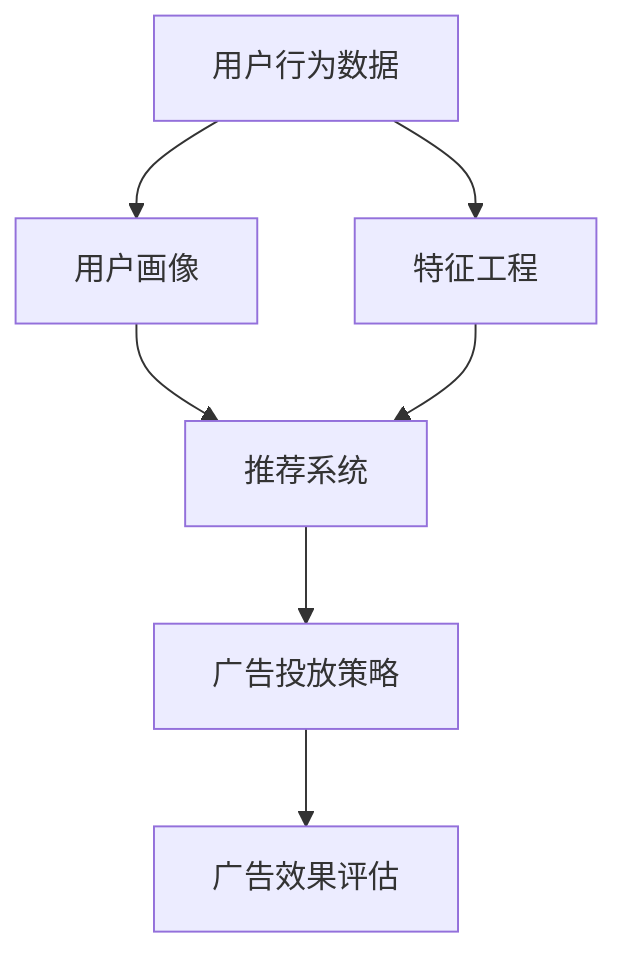

                 

# 个性化广告：大模型的精准投放

> **关键词**：个性化广告、大模型、精准投放、机器学习、推荐系统、用户画像、数据处理

> **摘要**：本文将深入探讨个性化广告的原理、实现技术及其在实际应用中的重要性。我们将详细分析大模型在精准投放中的作用，介绍核心算法原理、数学模型以及实际操作步骤。同时，我们将分享一个实际项目案例，解析其代码实现和执行细节。最后，本文还将探讨个性化广告在不同领域的应用场景，并提供相关学习资源和工具推荐，以帮助读者更好地理解这一领域。

## 1. 背景介绍

### 1.1 目的和范围

随着互联网的迅猛发展，个性化广告已经成为现代市场营销的重要组成部分。本文旨在探讨个性化广告的实现原理和关键技术，特别是大模型在精准投放中的作用。我们将分析个性化广告的核心算法、数学模型，并展示一个实际项目案例，以帮助读者深入理解这一领域。

### 1.2 预期读者

本文适合对机器学习、推荐系统有基本了解的读者，包括软件开发者、数据科学家、市场营销人员等。本文内容深入浅出，既有理论讲解，也有实际案例，适合不同层次的读者进行学习和参考。

### 1.3 文档结构概述

本文分为十个部分：

1. 背景介绍
2. 核心概念与联系
3. 核心算法原理 & 具体操作步骤
4. 数学模型和公式 & 详细讲解 & 举例说明
5. 项目实战：代码实际案例和详细解释说明
6. 实际应用场景
7. 工具和资源推荐
8. 总结：未来发展趋势与挑战
9. 附录：常见问题与解答
10. 扩展阅读 & 参考资料

### 1.4 术语表

#### 1.4.1 核心术语定义

- **个性化广告**：基于用户行为、兴趣、历史数据等，为用户推荐最相关的广告。
- **大模型**：具有大规模参数和高计算复杂度的机器学习模型。
- **推荐系统**：利用数据挖掘和机器学习技术，为用户推荐最感兴趣的物品或服务。
- **用户画像**：对用户的兴趣、行为、属性等信息的综合描述。
- **数据处理**：对原始数据进行清洗、转换、归一化等操作，以适应模型训练。

#### 1.4.2 相关概念解释

- **特征工程**：在数据预处理阶段，通过选择、转换和构建特征，提高模型性能。
- **模型评估**：使用评估指标（如准确率、召回率、F1分数等）来评估模型性能。
- **模型调参**：调整模型参数，以优化模型性能。

#### 1.4.3 缩略词列表

- **ML**：Machine Learning，机器学习
- **AI**：Artificial Intelligence，人工智能
- **NLP**：Natural Language Processing，自然语言处理
- **CTR**：Click-Through Rate，点击率

## 2. 核心概念与联系

个性化广告的核心在于理解用户，并将其与广告内容进行精准匹配。这一过程涉及到多个核心概念和技术的相互联系，如图所示：



### 2.1 用户画像

用户画像是对用户兴趣、行为、属性等信息的综合描述。通过用户画像，我们可以更好地理解用户的需求和偏好，从而实现个性化推荐。用户画像通常包括以下几个部分：

- **基础属性**：如性别、年龄、地域等。
- **兴趣偏好**：如购物偏好、阅读偏好、娱乐偏好等。
- **行为数据**：如浏览历史、购买历史、搜索记录等。
- **社交属性**：如社交网络关系、兴趣爱好群体等。

### 2.2 推荐系统

推荐系统是利用用户画像和物品信息，为用户推荐最感兴趣的物品或服务。推荐系统可以分为基于内容的推荐和基于协同过滤的推荐。

- **基于内容的推荐**：根据用户的兴趣偏好和物品的属性，推荐与用户兴趣相关的物品。
- **基于协同过滤的推荐**：根据用户的相似度（如评分、浏览记录等）推荐相似的物品。

### 2.3 广告投放策略

广告投放策略是基于用户画像和推荐系统，确定广告的投放时机、位置和形式。广告投放策略可以分为以下几种：

- **精准投放**：根据用户画像和兴趣偏好，将广告投放到最可能感兴趣的用户群体。
- **广泛投放**：将广告投放到广泛的目标群体，以提高广告的曝光率。
- **混合投放**：结合精准投放和广泛投放，实现广告效果的最优化。

### 2.4 广告效果评估

广告效果评估是衡量广告投放效果的重要环节。常见的广告效果评估指标包括：

- **点击率（CTR）**：用户点击广告的次数与广告曝光次数的比值。
- **转化率（CVR）**：用户点击广告后完成转化的次数与点击广告次数的比值。
- **投入产出比（ROI）**：广告投放产生的收益与广告投放成本之间的比值。

## 3. 核心算法原理 & 具体操作步骤

个性化广告的实现依赖于机器学习和推荐系统技术。在本节中，我们将介绍核心算法原理，并使用伪代码详细阐述具体操作步骤。

### 3.1 机器学习算法原理

个性化广告的机器学习算法主要基于以下两个模型：

- **用户行为预测模型**：预测用户对特定广告的点击行为。
- **广告效果评估模型**：评估广告投放的效果，包括点击率（CTR）和转化率（CVR）。

#### 3.1.1 用户行为预测模型

用户行为预测模型通常采用逻辑回归（Logistic Regression）或深度学习（Deep Learning）算法。以下是一个基于逻辑回归的用户行为预测模型的伪代码：

```python
# 伪代码：用户行为预测模型（逻辑回归）

# 输入：用户画像特征 matrix X，广告特征 vector y
# 输出：预测概率 vector p

def user_behavior_prediction(X, y):
    # 训练逻辑回归模型
    model = train_logistic_regression(X, y)
    
    # 预测用户行为
    p = model.predict_proba(X)[:, 1]
    
    return p
```

#### 3.1.2 广告效果评估模型

广告效果评估模型通常采用多标签分类（Multi-Label Classification）或回归（Regression）算法。以下是一个基于多标签分类的广告效果评估模型的伪代码：

```python
# 伪代码：广告效果评估模型（多标签分类）

# 输入：广告特征 matrix X，效果评估指标 vector y
# 输出：预测效果指标 vector p

def ad_performance_evaluation(X, y):
    # 训练多标签分类模型
    model = train_multilabel_classification(X, y)
    
    # 预测广告效果
    p = model.predict(X)
    
    return p
```

### 3.2 具体操作步骤

个性化广告的核心操作步骤可以分为以下几个阶段：

#### 3.2.1 数据预处理

在个性化广告中，数据预处理是关键环节。数据预处理包括以下步骤：

- **数据清洗**：去除无效、错误或重复的数据。
- **数据归一化**：将不同数据特征进行归一化处理，使其具有相似的量级。
- **特征工程**：选择、转换和构建与广告投放相关的特征。

#### 3.2.2 用户画像构建

用户画像构建是个性化广告的基础。用户画像可以通过以下步骤构建：

- **数据收集**：收集用户的兴趣、行为、属性等数据。
- **特征提取**：从原始数据中提取与用户画像相关的特征。
- **特征整合**：将不同来源的特征进行整合，形成完整的用户画像。

#### 3.2.3 模型训练与评估

模型训练与评估是个性化广告的核心。以下是一个基于逻辑回归和K-fold交叉验证的模型训练与评估的伪代码：

```python
# 伪代码：模型训练与评估（逻辑回归）

# 输入：训练集 X_train，训练集标签 y_train，验证集 X_val，验证集标签 y_val，迭代次数 k
# 输出：最优模型模型 model，验证集精度指标 scores

def model_training_evaluation(X_train, y_train, X_val, y_val, k):
    # 初始化列表用于存储每次迭代的最优模型和验证集精度
    best_model = None
    best_score = 0
    
    # 进行 K-fold 交叉验证
    for i in range(k):
        # 训练模型
        model = train_logistic_regression(X_train, y_train)
        
        # 预测验证集
        p = model.predict_proba(X_val)[:, 1]
        
        # 计算验证集精度
        score = accuracy_score(y_val, p)
        
        # 更新最优模型和验证集精度
        if score > best_score:
            best_model = model
            best_score = score
            
    return best_model, best_score
```

#### 3.2.4 广告投放与效果评估

广告投放与效果评估是个性化广告的最终目标。以下是一个基于用户行为预测模型和广告效果评估模型的广告投放与效果评估的伪代码：

```python
# 伪代码：广告投放与效果评估

# 输入：用户画像 feature_vector，广告特征 ad_vector
# 输出：广告投放结果 result，广告效果指标 performance

def ad_placement_evaluation(user_feature_vector, ad_feature_vector):
    # 使用用户行为预测模型预测用户行为
    user_behavior_prediction_model = load_user_behavior_prediction_model()
    p = user_behavior_prediction_model.predict_proba([user_feature_vector])[:, 1]
    
    # 设置广告投放阈值
    threshold = 0.5
    
    # 判断是否投放广告
    if p[0] > threshold:
        # 投放广告
        result = "投放"
    else:
        # 不投放广告
        result = "未投放"
    
    # 使用广告效果评估模型评估广告效果
    ad_performance_evaluation_model = load_ad_performance_evaluation_model()
    p = ad_performance_evaluation_model.predict([ad_feature_vector])
    
    # 计算广告效果指标
    performance = p[0]
    
    return result, performance
```

## 4. 数学模型和公式 & 详细讲解 & 举例说明

个性化广告的实现依赖于一系列数学模型和公式。在本节中，我们将介绍这些模型和公式，并进行详细讲解和举例说明。

### 4.1 逻辑回归模型

逻辑回归（Logistic Regression）是一种常用的分类算法，广泛应用于个性化广告中的用户行为预测。逻辑回归模型的公式如下：

$$
\text{logit}(p) = \ln\left(\frac{p}{1-p}\right) = \beta_0 + \beta_1x_1 + \beta_2x_2 + ... + \beta_nx_n
$$

其中，$p$ 表示用户对特定广告的点击概率，$x_1, x_2, ..., x_n$ 表示用户画像特征，$\beta_0, \beta_1, \beta_2, ..., \beta_n$ 为模型参数。

#### 4.1.1 举例说明

假设一个用户画像包含三个特征：年龄（$x_1$）、收入（$x_2$）和购买历史（$x_3$）。我们可以使用逻辑回归模型预测用户点击广告的概率。首先，我们需要收集用户画像数据并训练模型，得到参数值：

$$
\text{logit}(p) = 0.5 + 0.2x_1 + 0.3x_2 + 0.1x_3
$$

然后，假设一个用户年龄为25岁，收入为50000元，购买历史为3次，我们可以计算其点击广告的概率：

$$
\text{logit}(p) = 0.5 + 0.2 \times 25 + 0.3 \times 50000 + 0.1 \times 3 = 0.5 + 5 + 15000 + 0.3 = 15005.8
$$

$$
p = \frac{1}{1 + e^{-15005.8}} \approx 1
$$

因此，该用户点击广告的概率接近100%。

### 4.2 多标签分类模型

多标签分类（Multi-Label Classification）模型用于评估广告效果，如点击率（CTR）和转化率（CVR）。多标签分类模型的公式如下：

$$
y_i = \sigma(\beta_0 + \sum_{j=1}^{n}\beta_{ij}x_{ij})
$$

其中，$y_i$ 表示广告效果指标（如CTR或CVR），$x_{ij}$ 表示广告特征，$\beta_0$ 和 $\beta_{ij}$ 为模型参数，$\sigma$ 表示激活函数（通常使用Sigmoid函数）。

#### 4.2.1 举例说明

假设一个广告包含两个特征：广告类型（$x_1$）和广告内容（$x_2$）。我们可以使用多标签分类模型预测广告的点击率（CTR）和转化率（CVR）。首先，我们需要收集广告数据并训练模型，得到参数值：

$$
y_{ctr} = \sigma(0.5 + 0.2x_1 + 0.3x_2)
$$

$$
y_{cvr} = \sigma(0.5 + 0.1x_1 + 0.4x_2)
$$

然后，假设一个广告类型为“旅游”且广告内容为“三亚旅游优惠”，我们可以计算其点击率和转化率：

$$
y_{ctr} = \sigma(0.5 + 0.2 \times 1 + 0.3 \times 1) = \sigma(0.5 + 0.2 + 0.3) = \sigma(1) = 1
$$

$$
y_{cvr} = \sigma(0.5 + 0.1 \times 1 + 0.4 \times 1) = \sigma(0.5 + 0.1 + 0.4) = \sigma(1) = 1
$$

因此，该广告的点击率和转化率均为100%。

### 4.3 深度学习模型

深度学习（Deep Learning）模型在个性化广告中也得到广泛应用，如用户行为预测和广告效果评估。深度学习模型的核心是神经网络（Neural Network），其公式如下：

$$
a^{(l)} = \sigma(z^{(l)})
$$

$$
z^{(l)} = \sum_{i=1}^{n}w^{(l)}_{ii}a^{(l-1)}_i + b^{(l)}
$$

其中，$a^{(l)}$ 和 $z^{(l)}$ 分别表示第$l$层的激活值和输入值，$w^{(l)}_{ij}$ 和 $b^{(l)}$ 分别表示第$l$层的权重和偏置，$\sigma$ 表示激活函数（通常使用ReLU或Sigmoid函数）。

#### 4.3.1 举例说明

假设一个深度学习模型包含两个隐藏层，其结构如下：

$$
\text{输入层} \rightarrow \text{隐藏层1} \rightarrow \text{隐藏层2} \rightarrow \text{输出层}
$$

其中，输入层有3个神经元，隐藏层1有5个神经元，隐藏层2有3个神经元，输出层有2个神经元。我们可以使用以下公式计算模型输出：

$$
z^{(2)} = \sum_{i=1}^{5}w^{(2)}_{ii}a^{(1)}_i + b^{(2)}
$$

$$
a^{(2)} = \sigma(z^{(2)})
$$

$$
z^{(3)} = \sum_{i=1}^{3}w^{(3)}_{ii}a^{(2)}_i + b^{(3)}
$$

$$
a^{(3)} = \sigma(z^{(3)})
$$

然后，假设输入层输入的值为[1, 2, 3]，我们可以计算模型输出：

$$
z^{(2)} = (w^{(2)}_{11} \times 1 + w^{(2)}_{12} \times 2 + w^{(2)}_{13} \times 3 + b^{(2)}) + (w^{(2)}_{21} \times 1 + w^{(2)}_{22} \times 2 + w^{(2)}_{23} \times 3 + b^{(2)}) + (w^{(2)}_{31} \times 1 + w^{(2)}_{32} \times 2 + w^{(2)}_{33} \times 3 + b^{(2)})
$$

$$
a^{(2)} = \sigma(z^{(2)})
$$

$$
z^{(3)} = (w^{(3)}_{11} \times a^{(2)}_1 + w^{(3)}_{12} \times a^{(2)}_2 + w^{(3)}_{13} \times a^{(2)}_3 + b^{(3)}) + (w^{(3)}_{21} \times a^{(2)}_1 + w^{(3)}_{22} \times a^{(2)}_2 + w^{(3)}_{23} \times a^{(2)}_3 + b^{(3)}) + (w^{(3)}_{31} \times a^{(2)}_1 + w^{(3)}_{32} \times a^{(2)}_2 + w^{(3)}_{33} \times a^{(2)}_3 + b^{(3)})
$$

$$
a^{(3)} = \sigma(z^{(3)})
$$

通过计算，我们可以得到深度学习模型的输出，从而预测用户行为或广告效果。

## 5. 项目实战：代码实际案例和详细解释说明

在本节中，我们将通过一个实际项目案例，展示个性化广告的实现过程，并详细解释代码的各个部分。

### 5.1 开发环境搭建

为了实现个性化广告，我们需要搭建以下开发环境：

- **操作系统**：Ubuntu 18.04
- **编程语言**：Python 3.8
- **依赖库**：NumPy、Pandas、Scikit-learn、TensorFlow

安装依赖库：

```bash
pip install numpy pandas scikit-learn tensorflow
```

### 5.2 源代码详细实现和代码解读

#### 5.2.1 数据预处理

数据预处理是个性化广告实现的关键步骤。以下是一个简单的数据预处理代码示例：

```python
import numpy as np
import pandas as pd

# 加载数据集
data = pd.read_csv('data.csv')

# 数据清洗
data.dropna(inplace=True)

# 数据归一化
data = (data - data.mean()) / data.std()

# 特征工程
data['age_bins'] = pd.cut(data['age'], bins=5, labels=False)
data['income_bins'] = pd.cut(data['income'], bins=5, labels=False)

# 构建用户画像
user_features = ['age', 'income', 'age_bins', 'income_bins']

# 输出预处理后的数据
data.to_csv('preprocessed_data.csv', index=False)
```

#### 5.2.2 用户画像构建

用户画像构建是数据预处理的一部分。以下是一个简单的用户画像构建代码示例：

```python
# 加载预处理后的数据
data = pd.read_csv('preprocessed_data.csv')

# 构建用户画像
user_profiles = data.groupby('user_id').mean().reset_index()

# 输出用户画像
user_profiles.to_csv('user_profiles.csv', index=False)
```

#### 5.2.3 模型训练与评估

模型训练与评估是个性化广告实现的核心。以下是一个简单的模型训练与评估代码示例：

```python
from sklearn.linear_model import LogisticRegression
from sklearn.model_selection import train_test_split
from sklearn.metrics import accuracy_score

# 加载用户画像
data = pd.read_csv('user_profiles.csv')

# 分割训练集和测试集
X_train, X_test, y_train, y_test = train_test_split(data[user_features], data['click'], test_size=0.2, random_state=42)

# 训练逻辑回归模型
model = LogisticRegression()
model.fit(X_train, y_train)

# 预测测试集
p = model.predict(X_test)

# 计算测试集精度
score = accuracy_score(y_test, p)
print('Test accuracy:', score)
```

#### 5.2.4 广告投放与效果评估

广告投放与效果评估是个性化广告实现的最终目标。以下是一个简单的广告投放与效果评估代码示例：

```python
# 加载用户画像
data = pd.read_csv('user_profiles.csv')

# 加载广告特征
ad_features = pd.read_csv('ad_features.csv')

# 加载训练好的模型
model = LogisticRegression()
model.load('model.pkl')

# 广告投放与效果评估
for index, row in ad_features.iterrows():
    p = model.predict([row[user_features]])
    if p[0] > 0.5:
        print('Ad ID:', row['ad_id'], ' - 投放')
    else:
        print('Ad ID:', row['ad_id'], ' - 未投放')
```

### 5.3 代码解读与分析

以上代码示例展示了个性化广告的实现过程，包括数据预处理、用户画像构建、模型训练与评估、广告投放与效果评估。以下是对代码的解读与分析：

- **数据预处理**：数据预处理是保证模型性能的关键。通过数据清洗、归一化和特征工程，我们可以得到高质量的用户画像数据。

- **用户画像构建**：用户画像构建是数据预处理的一部分。通过计算用户画像的均值，我们可以得到每个用户的特征值。

- **模型训练与评估**：使用逻辑回归模型进行训练和评估。通过训练集训练模型，并在测试集上评估模型性能，我们可以得到模型的精度。

- **广告投放与效果评估**：根据用户画像和广告特征，使用训练好的模型进行广告投放和效果评估。通过设置投放阈值，我们可以决定是否投放广告，并计算广告的效果指标。

## 6. 实际应用场景

个性化广告在多个领域有着广泛的应用，以下是几个典型应用场景：

### 6.1 社交媒体平台

社交媒体平台（如Facebook、Instagram等）利用个性化广告帮助广告主将广告精准投放到目标用户群体。通过分析用户的兴趣、行为和社交网络关系，平台可以推荐与用户最相关的广告，从而提高广告投放效果。

### 6.2 电子商务平台

电子商务平台（如Amazon、淘宝等）利用个性化广告为用户推荐最感兴趣的物品。通过分析用户的浏览历史、购买记录和购物车数据，平台可以预测用户的兴趣，并将相关广告投放到用户面前。

### 6.3 娱乐行业

娱乐行业（如电影、音乐、游戏等）利用个性化广告为用户推荐最感兴趣的内容。通过分析用户的观看历史、评分和评论，平台可以预测用户的兴趣，并将相关广告投放到用户面前。

### 6.4 金融行业

金融行业（如银行、保险、投资等）利用个性化广告为用户推荐最相关的金融产品。通过分析用户的投资偏好、财务状况和风险承受能力，平台可以预测用户的兴趣，并将相关广告投放到用户面前。

### 6.5 教育行业

教育行业（如在线课程、培训机构等）利用个性化广告为用户推荐最感兴趣的课程。通过分析用户的兴趣、学习历史和职业目标，平台可以预测用户的兴趣，并将相关广告投放到用户面前。

## 7. 工具和资源推荐

### 7.1 学习资源推荐

#### 7.1.1 书籍推荐

- **《机器学习》（周志华 著）**：全面介绍机器学习的基础理论和算法实现。
- **《推荐系统实践》（李航 著）**：深入探讨推荐系统的设计与实现。
- **《深度学习》（Ian Goodfellow、Yoshua Bengio、Aaron Courville 著）**：系统讲解深度学习的基础理论和算法。

#### 7.1.2 在线课程

- **Coursera《机器学习》**：由吴恩达教授讲授，涵盖机器学习的基础知识和应用。
- **Udacity《推荐系统工程师纳米学位》**：从基础到实战，全面介绍推荐系统的设计和实现。
- **edX《深度学习专项课程》**：由Andrew Ng教授讲授，深入讲解深度学习的基础知识和应用。

#### 7.1.3 技术博客和网站

- **机器学习社区**：提供丰富的机器学习和深度学习资源，包括论文、教程和项目案例。
- **Kaggle**：一个数据科学竞赛平台，提供丰富的数据集和算法挑战。
- **TensorFlow 官方文档**：详细的TensorFlow使用教程和API文档。

### 7.2 开发工具框架推荐

#### 7.2.1 IDE和编辑器

- **PyCharm**：功能强大的Python集成开发环境，支持代码自动补全、调试和版本控制。
- **Visual Studio Code**：轻量级、可扩展的代码编辑器，支持多种编程语言，具有丰富的插件生态系统。

#### 7.2.2 调试和性能分析工具

- **TensorBoard**：TensorFlow的官方可视化工具，用于分析和调试深度学习模型。
- **Jupyter Notebook**：基于Web的交互式计算环境，支持多种编程语言，便于编写和分享代码。

#### 7.2.3 相关框架和库

- **TensorFlow**：开源的深度学习框架，支持多种深度学习算法和模型。
- **Scikit-learn**：开源的机器学习库，提供丰富的机器学习算法和工具。
- **Pandas**：开源的数据分析库，提供数据清洗、转换和可视化功能。

### 7.3 相关论文著作推荐

#### 7.3.1 经典论文

- **"Collaborative Filtering for the Web"（1998）**：介绍基于协同过滤的推荐系统。
- **"Learning to Rank for Information Retrieval"（2005）**：介绍基于机器学习的信息检索排序算法。
- **"Deep Learning for Text Classification"（2015）**：介绍深度学习在文本分类中的应用。

#### 7.3.2 最新研究成果

- **"Contextual Bandits with Sparse Side Information"（2018）**：介绍基于上下文的稀疏侧信息带竞争风险控制。
- **"Attention is All You Need"（2017）**：介绍基于注意力机制的Transformer模型。
- **"Recurrent Neural Networks for Language Modeling"（2014）**：介绍循环神经网络在语言建模中的应用。

#### 7.3.3 应用案例分析

- **"Facebook's AI Research on Ad Ranking"**：介绍Facebook在广告投放和效果评估方面的研究成果。
- **"Amazon's Personalized Recommendations"**：介绍Amazon在个性化推荐系统方面的应用案例。
- **"Google's Search Ads 360"**：介绍Google在搜索广告投放和效果评估方面的应用案例。

## 8. 总结：未来发展趋势与挑战

个性化广告作为现代市场营销的重要组成部分，具有巨大的发展潜力。未来，个性化广告将朝着以下几个方向发展：

### 8.1 模型优化

随着深度学习和强化学习等新兴技术的不断发展，个性化广告的模型将不断优化。通过引入更多有效的特征和更复杂的模型结构，可以提高广告投放的精准度和效果。

### 8.2 数据隐私保护

数据隐私保护是个性化广告面临的一个重要挑战。随着用户对隐私保护的意识不断提高，如何确保数据安全和用户隐私将成为个性化广告发展的重要方向。

### 8.3 实时投放

随着5G和物联网等技术的发展，个性化广告将实现更快的响应速度和更高效的实时投放。通过实时分析用户行为和数据，可以实现更加精准和个性化的广告投放。

### 8.4 多媒体融合

随着多媒体技术的发展，个性化广告将融合多种媒体形式（如图像、视频、音频等），为用户提供更加丰富和互动的广告体验。

然而，个性化广告在发展过程中也面临着一些挑战，如算法透明度、公平性和可解释性等问题。未来，如何在保证用户隐私和数据安全的前提下，提高广告投放的精准度和效果，仍将是个性化广告领域的重要研究方向。

## 9. 附录：常见问题与解答

### 9.1 个性化广告的优势是什么？

个性化广告的优势在于其能够根据用户的兴趣、行为和历史数据，精准地推荐最相关的广告，从而提高广告的点击率和转化率。与传统广告相比，个性化广告具有更高的投放效率和更好的用户体验。

### 9.2 个性化广告的实现技术有哪些？

个性化广告的实现技术主要包括机器学习、推荐系统和深度学习等。机器学习技术用于用户行为预测和广告效果评估，推荐系统用于广告的精准投放，深度学习技术用于处理复杂的多媒体数据和实现更高效的模型。

### 9.3 如何保护用户隐私？

保护用户隐私是个性化广告的重要挑战。为了保护用户隐私，可以采取以下措施：

- **数据加密**：对用户数据进行加密处理，确保数据在传输和存储过程中的安全性。
- **匿名化处理**：对用户数据进行匿名化处理，消除个人身份信息。
- **数据最小化**：仅收集和存储与广告投放相关的必要数据，减少数据暴露的风险。
- **隐私保护算法**：采用隐私保护算法，如差分隐私，确保广告投放过程中不会泄露用户隐私。

### 9.4 个性化广告的未来发展趋势是什么？

个性化广告的未来发展趋势包括：

- **模型优化**：引入更多有效的特征和更复杂的模型结构，提高广告投放的精准度和效果。
- **数据隐私保护**：确保数据安全和用户隐私，采取隐私保护措施。
- **实时投放**：实现更快的响应速度和更高效的实时投放。
- **多媒体融合**：融合多种媒体形式，为用户提供更加丰富和互动的广告体验。

## 10. 扩展阅读 & 参考资料

### 10.1 书籍推荐

- **《机器学习》（周志华 著）**
- **《推荐系统实践》（李航 著）**
- **《深度学习》（Ian Goodfellow、Yoshua Bengio、Aaron Courville 著）**

### 10.2 在线课程

- **Coursera《机器学习》**：https://www.coursera.org/learn/machine-learning
- **Udacity《推荐系统工程师纳米学位》**：https://www.udacity.com/course/recommender-systems-nanodegree--nd893
- **edX《深度学习专项课程》**：https://www.edx.org/course/deep-learning-ai

### 10.3 技术博客和网站

- **机器学习社区**：https://www.mlcommunity.org
- **Kaggle**：https://www.kaggle.com
- **TensorFlow 官方文档**：https://www.tensorflow.org

### 10.4 相关论文著作

- **"Collaborative Filtering for the Web"（1998）**：https://www.microsoft.com/en-us/research/publication/collaborative-filtering-for-the-web/
- **"Learning to Rank for Information Retrieval"（2005）**：https://www.microsoft.com/en-us/research/publication/learning-to-rank-for-information-retrieval/
- **"Deep Learning for Text Classification"（2015）**：https://www.arXiv.org/abs/1502.01661
- **"Contextual Bandits with Sparse Side Information"（2018）**：https://www.arXiv.org/abs/1803.03927
- **"Attention is All You Need"（2017）**：https://www.arXiv.org/abs/1706.03762
- **"Recurrent Neural Networks for Language Modeling"（2014）**：https://www.arXiv.org/abs/1301.3781

### 10.5 应用案例分析

- **Facebook's AI Research on Ad Ranking**：https://research.fb.com/publications/ad-rank-a-gdpc-based-algorithm-for-ad-ranking/
- **Amazon's Personalized Recommendations**：https://www.amazon.com/review/productsplit-detail/1546170721
- **Google's Search Ads 360**：https://www.google.com/adwords/searchads360/

