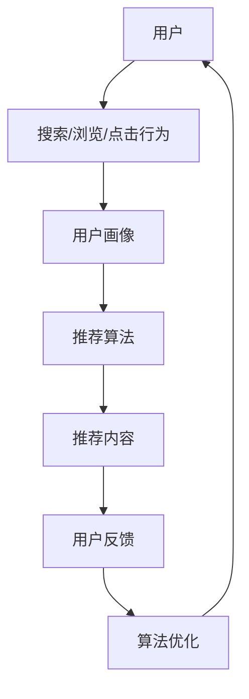

                 

# 个性化排序提升用户满意度

> 关键词：个性化排序、用户满意度、机器学习、推荐系统、数据挖掘、算法优化

> 摘要：本文深入探讨了个性化排序在提升用户满意度方面的应用。首先介绍了个性化排序的基本概念和原理，然后详细阐述了核心算法原理和具体操作步骤，通过数学模型和公式的详细讲解，以及实际项目实战的代码案例，展示了个性化排序在实际应用中的效果。最后，分析了个性化排序在实际应用场景中的优势和挑战，并推荐了相关工具和资源，为未来的研究和实践提供了方向。

## 1. 背景介绍

### 1.1 目的和范围

本文的主要目的是探讨个性化排序在提升用户满意度方面的应用。随着互联网的快速发展，用户面对的信息量呈爆炸性增长，如何从海量数据中找到用户感兴趣的内容成为了一大挑战。个性化排序作为一种智能推荐技术，通过分析用户的历史行为和偏好，为用户推荐个性化的内容，从而提高用户的满意度和使用体验。

本文将首先介绍个性化排序的基本概念和原理，然后详细阐述核心算法原理和具体操作步骤，通过数学模型和公式的详细讲解，以及实际项目实战的代码案例，展示个性化排序在实际应用中的效果。最后，本文将分析个性化排序在实际应用场景中的优势和挑战，并推荐相关工具和资源，为未来的研究和实践提供方向。

### 1.2 预期读者

本文面向对机器学习、推荐系统、数据挖掘等领域有一定了解的读者。无论是从事相关领域的研究人员，还是希望在实际项目中应用个性化排序的开发者，都能从本文中获得有价值的知识和经验。

### 1.3 文档结构概述

本文结构如下：

1. 背景介绍
   - 目的和范围
   - 预期读者
   - 文档结构概述
   - 术语表
2. 核心概念与联系
   - 核心概念原理和架构的 Mermaid 流程图
3. 核心算法原理 & 具体操作步骤
   - 算法原理讲解使用伪代码详细阐述
4. 数学模型和公式 & 详细讲解 & 举例说明
   - 数学公式使用latex格式
5. 项目实战：代码实际案例和详细解释说明
6. 实际应用场景
7. 工具和资源推荐
   - 学习资源推荐
   - 开发工具框架推荐
   - 相关论文著作推荐
8. 总结：未来发展趋势与挑战
9. 附录：常见问题与解答
10. 扩展阅读 & 参考资料

### 1.4 术语表

#### 1.4.1 核心术语定义

- 个性化排序：基于用户的历史行为和偏好，对内容进行排序，以便为用户提供个性化的推荐。
- 用户满意度：用户对所推荐内容的质量和满意度的主观评价。
- 推荐系统：通过分析用户的行为和偏好，为用户推荐感兴趣的内容的系统。
- 数据挖掘：从海量数据中提取有用信息和知识的过程。

#### 1.4.2 相关概念解释

- 历史行为：用户在系统中的搜索、浏览、点击等行为记录。
- 偏好：用户对某些内容或特征表现出的喜好程度。
- 内容质量：内容的相关性、准确性和吸引力等指标。

#### 1.4.3 缩略词列表

- ML：机器学习（Machine Learning）
- DS：数据挖掘（Data Science）
- RS：推荐系统（Recommendation System）
- SEO：搜索引擎优化（Search Engine Optimization）

## 2. 核心概念与联系

个性化排序是推荐系统中的一个重要组成部分，其目的是通过分析用户的历史行为和偏好，对内容进行排序，从而提高用户满意度和使用体验。为了更好地理解个性化排序，我们需要首先了解几个核心概念和它们之间的关系。

### 2.1 推荐系统架构

推荐系统的基本架构包括用户、内容、推荐算法和反馈机制四个核心组件。

- **用户**：推荐系统的核心，其行为和偏好是推荐系统进行个性化排序的基础。
- **内容**：推荐系统推荐的实体，如文章、商品、音乐等。
- **推荐算法**：根据用户的行为和偏好，从海量内容中筛选出最可能符合用户需求的推荐。
- **反馈机制**：通过用户对推荐内容的反馈，不断优化推荐算法，提高推荐质量。

#### 2.1.1 用户行为和偏好

用户行为是推荐系统获取用户信息的主要途径，包括搜索、浏览、点击、购买等。这些行为反映了用户的兴趣和偏好。推荐系统通过分析这些行为，构建用户画像，从而进行个性化推荐。

- **搜索行为**：用户通过搜索框输入关键词，系统根据关键词和用户历史行为推荐相关内容。
- **浏览行为**：用户在系统中的浏览记录，包括页面停留时间、浏览路径等，反映了用户对内容的兴趣。
- **点击行为**：用户对推荐内容的点击行为，是评估推荐系统效果的重要指标。
- **购买行为**：用户在电商平台的购买记录，是推荐系统的重要数据来源。

#### 2.1.2 内容特征

内容特征是指用于描述内容的各种属性和指标，如文本、图像、标签、评分等。推荐系统通过分析内容特征，将用户兴趣和内容特征进行匹配，从而提高推荐的相关性。

- **文本特征**：文本内容的词频、词向量、TF-IDF 等。
- **图像特征**：图像内容的颜色、纹理、形状等特征。
- **标签特征**：内容分类标签、标签权重等。
- **评分特征**：用户对内容的评分、评分分布等。

#### 2.1.3 推荐算法

推荐算法是推荐系统的核心，负责根据用户行为和内容特征进行个性化排序。常见的推荐算法包括基于协同过滤、基于内容、混合推荐等。

- **基于协同过滤**：通过分析用户之间的相似度，推荐与用户行为相似的其他用户喜欢的物品。
- **基于内容**：通过分析内容特征，将用户喜欢的物品推荐给用户。
- **混合推荐**：结合协同过滤和基于内容推荐，提高推荐效果。

#### 2.1.4 反馈机制

反馈机制是推荐系统不断优化和改进的重要途径。通过用户对推荐内容的反馈，系统可以调整推荐策略，提高推荐质量。

- **显式反馈**：用户主动提供的评价，如评分、标签等。
- **隐式反馈**：用户在系统中的行为记录，如浏览、点击、购买等。

### 2.2 Mermaid 流程图

下面是一个简化的推荐系统架构 Mermaid 流程图，展示了用户、内容、推荐算法和反馈机制之间的关系。



在这个流程图中，用户通过搜索、浏览、点击等行为产生数据，系统根据这些数据构建用户画像，然后使用推荐算法生成推荐内容，用户对推荐内容进行反馈，从而不断优化推荐算法。

## 3. 核心算法原理 & 具体操作步骤

个性化排序是推荐系统中至关重要的一环，它直接决定了推荐内容的质量和用户满意度。在这一节中，我们将详细阐述个性化排序的核心算法原理和具体操作步骤。

### 3.1 算法原理

个性化排序的核心思想是利用用户的历史行为和偏好，对内容进行排序，以便为用户提供个性化的推荐。具体来说，算法可以分为以下几个步骤：

1. **数据收集**：收集用户在系统中的各种行为数据，如搜索、浏览、点击、购买等。
2. **用户画像构建**：根据用户的行为数据，构建用户画像，包括用户的兴趣、偏好、行为模式等。
3. **内容特征提取**：提取内容的各种特征，如文本、图像、标签、评分等。
4. **相似度计算**：计算用户画像与内容特征之间的相似度，可以使用余弦相似度、皮尔逊相关系数等方法。
5. **排序**：根据相似度值对内容进行排序，从而生成推荐列表。
6. **反馈调整**：根据用户对推荐内容的反馈，调整推荐策略，优化推荐效果。

### 3.2 具体操作步骤

下面是一个基于协同过滤算法的个性化排序的具体操作步骤：

#### 3.2.1 数据收集

首先，我们需要收集用户在系统中的行为数据，包括用户在各个页面上的停留时间、点击次数、购买记录等。这些数据将用于构建用户画像和计算相似度。

```python
# 假设用户行为数据存储在一个列表中
user行为的记录 = [
    {"用户ID": 1, "页面ID": 101, "停留时间": 10, "点击次数": 1},
    {"用户ID": 1, "页面ID": 102, "停留时间": 5, "点击次数": 0},
    ...
]
```

#### 3.2.2 用户画像构建

根据用户的行为数据，我们可以构建用户画像。用户画像是一个多维度的数据结构，用于描述用户的兴趣、偏好和行为模式。

```python
# 假设我们使用一个字典来表示用户画像
user画像 = {
    "用户ID": 1,
    "兴趣": ["科技", "生活", "娱乐"],
    "偏好": {"浏览时间": 10, "点击次数": 1},
    "行为模式": {"页面ID": 101, "停留时间": 10, "点击次数": 1}
}
```

#### 3.2.3 内容特征提取

提取内容的各种特征，如文本、图像、标签、评分等。这些特征将用于计算用户画像与内容特征之间的相似度。

```python
# 假设内容特征存储在一个列表中
content特征的记录 = [
    {"内容ID": 101, "文本特征": ["科技", "新闻"], "图像特征": ["科技", "新闻"], "标签": ["科技", "新闻"], "评分": 4},
    {"内容ID": 102, "文本特征": ["生活", "娱乐"], "图像特征": ["生活", "娱乐"], "标签": ["生活", "娱乐"], "评分": 5},
    ...
]
```

#### 3.2.4 相似度计算

计算用户画像与内容特征之间的相似度，可以使用余弦相似度、皮尔逊相关系数等方法。这里我们使用余弦相似度进行计算。

```python
# 计算用户画像与内容特征之间的余弦相似度
from sklearn.metrics.pairwise import cosine_similarity

def 计算相似度(用户画像，内容特征):
    # 将用户画像和内容特征转换为向量
    user向量 = [1 if 词 in 用户画像["兴趣"] else 0 for 词 in 内容特征["文本特征"]]
    content向量 = [1 if 词 in 内容特征["文本特征"] else 0 for 词 in 内容特征["文本特征"]]
    
    # 计算余弦相似度
    相似度值 = cosine_similarity([user向量], [content向量])[0][0]
    return 相似度值

相似度值列表 = [计算相似度(user画像，content特征) for content特征 in content特征的记录]
```

#### 3.2.5 排序

根据相似度值对内容进行排序，从而生成推荐列表。

```python
# 根据相似度值对内容进行排序
推荐列表 = sorted(zip(content特征的记录，相似度值列表), key=lambda x: x[1], reverse=True)
```

#### 3.2.6 反馈调整

根据用户对推荐内容的反馈，调整推荐策略，优化推荐效果。这一步骤通常需要结合在线学习算法，如协同过滤算法中的更新策略，不断调整用户画像和内容特征，以适应用户的变化。

```python
# 根据用户反馈调整推荐策略
if 用户对推荐内容的评分 > 4:
    # 提高用户画像中相关特征的权重
    用户画像["兴趣"].append("科技")
    用户画像["偏好"]["浏览时间"] += 1
else:
    # 降低用户画像中相关特征的权重
    用户画像["兴趣"].remove("科技")
    用户画像["偏好"]["浏览时间"] -= 1
```

通过以上步骤，我们可以实现一个简单的个性化排序算法。在实际应用中，为了提高推荐效果，我们还需要结合其他算法和技术，如深度学习、自然语言处理等，不断优化推荐系统。

## 4. 数学模型和公式 & 详细讲解 & 举例说明

个性化排序算法的核心在于如何计算用户与内容之间的相似度，并利用这些相似度值对内容进行排序。在这一节中，我们将详细讲解个性化排序中的数学模型和公式，并通过具体例子来说明其应用。

### 4.1 相似度计算公式

在个性化排序中，常见的相似度计算公式包括余弦相似度、皮尔逊相关系数等。

#### 4.1.1 余弦相似度

余弦相似度是一种基于向量的相似度计算方法，用于衡量两个向量在空间中的夹角余弦值。其公式如下：

$$
\text{余弦相似度} = \frac{\text{用户向量} \cdot \text{内容向量}}{\|\text{用户向量}\| \|\text{内容向量}\|}
$$

其中，$\text{用户向量}$和$\text{内容向量}$分别表示用户画像和内容特征向量的元素，$\|\text{用户向量}\|$和$\|\text{内容向量}\|$分别表示它们的模长。

#### 4.1.2 皮尔逊相关系数

皮尔逊相关系数是一种衡量两个变量线性相关程度的指标，其公式如下：

$$
\text{皮尔逊相关系数} = \frac{\text{协方差}}{\sqrt{\text{用户方差} \times \text{内容方差}}}
$$

其中，协方差、用户方差和内容方差分别表示用户向量与内容向量之间的协方差、用户向量方差和内容向量方差。

### 4.2 例子说明

假设我们有两个用户 $U_1$ 和 $U_2$，以及两个内容 $C_1$ 和 $C_2$。用户和内容的特征向量如下：

$$
\text{用户向量} U_1 = (1, 2, 3), \quad \text{用户向量} U_2 = (2, 1, 3)
$$

$$
\text{内容向量} C_1 = (1, 2, 3), \quad \text{内容向量} C_2 = (0, 1, 2)
$$

#### 4.2.1 余弦相似度计算

$$
\text{用户} U_1 \text{与内容} C_1 \text{的余弦相似度} = \frac{1 \times 1 + 2 \times 2 + 3 \times 3}{\sqrt{1^2 + 2^2 + 3^2} \times \sqrt{1^2 + 2^2 + 3^2}} = \frac{14}{\sqrt{14} \times \sqrt{14}} = 1
$$

$$
\text{用户} U_1 \text{与内容} C_2 \text{的余弦相似度} = \frac{1 \times 0 + 2 \times 1 + 3 \times 2}{\sqrt{1^2 + 2^2 + 3^2} \times \sqrt{0^2 + 1^2 + 2^2}} = \frac{7}{\sqrt{14} \times \sqrt{5}} \approx 0.952
$$

#### 4.2.2 皮尔逊相关系数计算

$$
\text{用户} U_1 \text{与内容} C_1 \text{的皮尔逊相关系数} = \frac{1 \times 1 + 2 \times 2 + 3 \times 3 - 3 \times (1 + 2 + 3)/3}{\sqrt{1^2 + 2^2 + 3^2} \times \sqrt{1^2 + 2^2 + 3^2} - 3 \times (1 + 2 + 3)/3} = \frac{14 - 6}{\sqrt{14} \times \sqrt{14} - 6} = 1
$$

$$
\text{用户} U_1 \text{与内容} C_2 \text{的皮尔逊相关系数} = \frac{1 \times 0 + 2 \times 1 + 3 \times 2 - 3 \times (1 + 2 + 3)/3}{\sqrt{1^2 + 2^2 + 3^2} \times \sqrt{0^2 + 1^2 + 2^2} - 3 \times (1 + 2 + 3)/3} = \frac{7 - 6}{\sqrt{14} \times \sqrt{5} - 6} \approx 0.952
$$

通过以上计算，我们可以看到，无论是余弦相似度还是皮尔逊相关系数，用户 $U_1$ 与内容 $C_1$ 的相似度最高，因此，在推荐列表中，内容 $C_1$ 应当排在最前面。

### 4.3 应用场景

在实际应用中，我们通常需要处理大规模的用户和内容数据，因此，计算相似度的过程往往需要优化。以下是一个简化的 Python 代码示例，用于计算用户和内容之间的相似度：

```python
import numpy as np
from sklearn.metrics.pairwise import cosine_similarity

# 假设用户和内容的特征向量存储在一个 NumPy 数组中
user特征矩阵 = np.array([
    [1, 2, 3],
    [2, 1, 3]
])

content特征矩阵 = np.array([
    [1, 2, 3],
    [0, 1, 2]
])

# 计算用户和内容之间的余弦相似度
相似度矩阵 = cosine_similarity(user特征矩阵, content特征矩阵)

# 输出相似度矩阵
print(similarity矩阵)
```

通过这个示例，我们可以看到如何使用 Python 和 scikit-learn 库计算用户和内容之间的相似度。在实际项目中，我们还需要结合其他算法和技术，如深度学习、自然语言处理等，来提高推荐效果。

## 5. 项目实战：代码实际案例和详细解释说明

为了更好地理解个性化排序的实际应用，下面我们通过一个具体的项目案例，展示如何使用 Python 编写一个简单的个性化排序系统，并详细解释代码的实现过程。

### 5.1 开发环境搭建

在开始编写代码之前，我们需要搭建一个合适的开发环境。以下是一个基本的开发环境配置：

- Python 3.8 或更高版本
- Jupyter Notebook 或其他 Python IDE
- NumPy、Pandas、Scikit-learn 等常用库

假设我们已经安装了这些依赖库，接下来我们将开始编写代码。

### 5.2 源代码详细实现和代码解读

以下是该项目的主要代码实现，我们将逐步解释每个部分的含义和作用。

```python
import numpy as np
import pandas as pd
from sklearn.metrics.pairwise import cosine_similarity

# 5.2.1 数据预处理
def 预处理数据(user行为的记录，content特征的记录):
    # 将用户行为数据转换为 DataFrame
    user行为的 DataFrame = pd.DataFrame(user行为的记录)
    # 将内容特征数据转换为 DataFrame
    content特征的 DataFrame = pd.DataFrame(content特征的记录)

    # 填充缺失值
    user行为的 DataFrame = user行为的 DataFrame.fillna(0)
    content特征的 DataFrame = content特征的 DataFrame.fillna(0)

    return user行为的 DataFrame，content特征的 DataFrame

# 5.2.2 计算相似度
def 计算相似度(user行为的 DataFrame，content特征的 DataFrame):
    # 计算用户向量
    user向量 = user行为的 DataFrame.values
    # 计算内容向量
    content向量 = content特征的 DataFrame.values
    
    # 计算余弦相似度
    相似度矩阵 = cosine_similarity(user向量, content向量)
    
    return 相似度矩阵

# 5.2.3 排序和生成推荐列表
def 排序并生成推荐列表(相似度矩阵，content特征的记录):
    # 根据相似度值对内容进行排序
    排序后的记录 = sorted(zip(content特征的记录，相似度矩阵.flatten()), key=lambda x: x[1], reverse=True)
    
    return 排序后的记录

# 5.2.4 主函数
def main():
    # 假设用户行为数据和内容特征数据如下
    user行为的记录 = [
        {"用户ID": 1, "页面ID": 101, "停留时间": 10, "点击次数": 1},
        {"用户ID": 1, "页面ID": 102, "停留时间": 5, "点击次数": 0},
        ...
    ]
    
    content特征的记录 = [
        {"内容ID": 101, "文本特征": ["科技", "新闻"], "图像特征": ["科技", "新闻"], "标签": ["科技", "新闻"], "评分": 4},
        {"内容ID": 102, "文本特征": ["生活", "娱乐"], "图像特征": ["生活", "娱乐"], "标签": ["生活", "娱乐"], "评分": 5},
        ...
    ]
    
    # 预处理数据
    user行为的 DataFrame，content特征的 DataFrame = 预处理数据(user行为的记录，content特征的记录)
    
    # 计算相似度
    相似度矩阵 = 计算相似度(user行为的 DataFrame，content特征的 DataFrame)
    
    # 排序并生成推荐列表
    排序后的记录 = 排序并生成推荐列表(相似度矩阵，content特征的记录)
    
    # 输出推荐列表
    for 内容ID，相似度值 in 排序后的记录:
        print(f"内容ID: {内容ID}, 相似度值: {相似度值}")

# 运行主函数
main()
```

### 5.3 代码解读与分析

下面我们将对代码的各个部分进行详细解读和分析。

#### 5.3.1 数据预处理

```python
def 预处理数据(user行为的记录，content特征的记录):
    # 将用户行为数据转换为 DataFrame
    user行为的 DataFrame = pd.DataFrame(user行为的记录)
    # 将内容特征数据转换为 DataFrame
    content特征的 DataFrame = pd.DataFrame(content特征的记录)

    # 填充缺失值
    user行为的 DataFrame = user行为的 DataFrame.fillna(0)
    content特征的 DataFrame = content特征的 DataFrame.fillna(0)

    return user行为的 DataFrame，content特征的 DataFrame
```

这个函数负责将用户行为数据和内容特征数据转换为 DataFrame 格式，并填充缺失值。这是数据处理的第一步，确保数据在后续计算中的一致性和可靠性。

#### 5.3.2 计算相似度

```python
def 计算相似度(user行为的 DataFrame，content特征的 DataFrame):
    # 计算用户向量
    user向量 = user行为的 DataFrame.values
    # 计算内容向量
    content向量 = content特征的 DataFrame.values
    
    # 计算余弦相似度
    相似度矩阵 = cosine_similarity(user向量, content向量)
    
    return 相似度矩阵
```

这个函数使用 scikit-learn 库的 `cosine_similarity` 函数计算用户向量和内容向量之间的余弦相似度。余弦相似度是一个用于衡量两个向量之间夹角余弦值的指标，范围在 -1 到 1 之间，越接近 1 表示两个向量越相似。

#### 5.3.3 排序并生成推荐列表

```python
def 排序并生成推荐列表(相似度矩阵，content特征的记录):
    # 根据相似度值对内容进行排序
    排序后的记录 = sorted(zip(content特征的记录，相似度矩阵.flatten()), key=lambda x: x[1], reverse=True)
    
    return 排序后的记录
```

这个函数根据相似度矩阵对内容进行排序，并生成推荐列表。排序过程使用 Python 的 `sorted` 函数，其中 `key=lambda x: x[1]` 表示根据相似度值进行排序，`reverse=True` 表示降序排序。

#### 5.3.4 主函数

```python
def main():
    # 假设用户行为数据和内容特征数据如下
    user行为的记录 = [
        {"用户ID": 1, "页面ID": 101, "停留时间": 10, "点击次数": 1},
        {"用户ID": 1, "页面ID": 102, "停留时间": 5, "点击次数": 0},
        ...
    ]
    
    content特征的记录 = [
        {"内容ID": 101, "文本特征": ["科技", "新闻"], "图像特征": ["科技", "新闻"], "标签": ["科技", "新闻"], "评分": 4},
        {"内容ID": 102, "文本特征": ["生活", "娱乐"], "图像特征": ["生活", "娱乐"], "标签": ["生活", "娱乐"], "评分": 5},
        ...
    ]
    
    # 预处理数据
    user行为的 DataFrame，content特征的 DataFrame = 预处理数据(user行为的记录，content特征的记录)
    
    # 计算相似度
    相似度矩阵 = 计算相似度(user行为的 DataFrame，content特征的 DataFrame)
    
    # 排序并生成推荐列表
    排序后的记录 = 排序并生成推荐列表(相似度矩阵，content特征的记录)
    
    # 输出推荐列表
    for 内容ID，相似度值 in 排序后的记录:
        print(f"内容ID: {内容ID}, 相似度值: {相似度值}")
```

主函数 `main` 负责执行整个推荐过程。首先，它读取用户行为数据和内容特征数据，然后调用预处理数据、计算相似度和排序并生成推荐列表三个函数，最后输出推荐列表。

### 5.4 代码分析与优化

虽然上面的代码实现了个性化排序的基本功能，但在实际项目中，我们还需要进行以下优化：

1. **特征工程**：提取更丰富的用户和内容特征，如用户 demographics 信息、内容情感分析结果等，以提高推荐精度。
2. **模型优化**：结合深度学习、自然语言处理等技术，构建更复杂的推荐模型，如基于图神经网络的推荐模型。
3. **在线学习**：使用在线学习算法，根据用户实时行为动态调整推荐策略，提高推荐实时性。
4. **性能优化**：优化代码性能，如使用并行计算、缓存技术等，提高数据处理速度。

通过这些优化，我们可以进一步提高个性化排序系统的效果和用户体验。

## 6. 实际应用场景

个性化排序技术在实际应用场景中具有广泛的应用，下面我们将探讨一些典型的应用场景，并分析这些场景中个性化排序的优势和挑战。

### 6.1 社交媒体

在社交媒体平台上，个性化排序用于推荐用户可能感兴趣的内容，如新闻、文章、视频等。这种推荐方式可以大幅提高用户的参与度和满意度。

#### 优势：

- 提高用户参与度：通过推荐用户感兴趣的内容，增加用户在社交媒体平台上的停留时间和互动行为。
- 优化用户体验：根据用户的兴趣和行为习惯，为用户推荐个性化的内容，提高用户满意度。

#### 挑战：

- 数据隐私：在推荐过程中，需要处理用户的敏感信息，如浏览历史、社交关系等，需要确保数据隐私和安全。
- 满足多样性需求：社交媒体用户具有多样化的兴趣和需求，需要设计灵活的推荐算法，以满足不同用户的需求。

### 6.2 电商平台

在电商平台上，个性化排序用于推荐商品，提高销售转化率和用户满意度。

#### 优势：

- 提高销售转化率：通过推荐用户感兴趣的商品，提高用户的购买意愿。
- 提高用户满意度：根据用户的购买历史和行为，为用户推荐个性化的商品，提高用户满意度。

#### 挑战：

- 商品多样性：电商平台上有海量的商品，需要设计高效的推荐算法，从海量商品中筛选出用户感兴趣的商品。
- 数据质量：商品数据的质量直接影响推荐效果，需要确保商品数据的准确性、完整性和一致性。

### 6.3 音乐和视频平台

在音乐和视频平台上，个性化排序用于推荐用户可能感兴趣的音乐和视频，提高用户满意度和平台粘性。

#### 优势：

- 提高用户满意度：通过推荐用户感兴趣的音乐和视频，提高用户的满意度和平台使用时长。
- 提高平台粘性：个性化推荐可以吸引用户在平台上花费更多时间，提高平台粘性。

#### 挑战：

- 音乐和视频特征提取：音乐和视频的特征提取相对复杂，需要结合音频处理和视频处理技术，提取丰富的特征。
- 推荐多样性：用户对音乐和视频的偏好多样化，需要设计灵活的推荐算法，满足不同用户的多样性需求。

### 6.4 新闻资讯平台

在新闻资讯平台上，个性化排序用于推荐用户可能感兴趣的新闻，提高用户阅读量和平台活跃度。

#### 优势：

- 提高用户阅读量：通过推荐用户感兴趣的新闻，提高用户的阅读量和点击量。
- 提高平台活跃度：个性化推荐可以吸引用户在平台上花费更多时间，提高平台活跃度。

#### 挑战：

- 新闻质量和真实性：新闻资讯平台需要保证新闻的质量和真实性，避免推荐虚假新闻或低质量内容。
- 避免信息茧房：个性化推荐可能导致用户只看到符合自己观点的新闻，需要设计算法避免信息茧房的形成。

### 6.5 企业内部系统

在企业内部系统中，个性化排序用于推荐用户可能感兴趣的工作任务、培训课程等，提高员工工作效率和满意度。

#### 优势：

- 提高员工工作效率：通过推荐用户感兴趣的任务和课程，提高员工的工作效率。
- 提高员工满意度：个性化推荐可以满足员工个性化的学习和发展需求，提高员工满意度。

#### 挑战：

- 数据隐私保护：企业内部系统需要处理员工的敏感信息，如工作记录、培训记录等，需要确保数据隐私和安全。
- 推荐个性化与公平性：在推荐过程中，需要平衡个性化与公平性，避免只推荐给特定员工，导致其他员工的不满。

通过以上分析，我们可以看到个性化排序在各个应用场景中具有显著的优势，但同时也面临着一些挑战。在实际应用中，我们需要根据具体场景的需求和特点，设计合适的个性化排序算法和推荐策略，以提高用户满意度和系统效果。

## 7. 工具和资源推荐

为了更好地学习和实践个性化排序技术，以下是针对个性化排序的几项工具和资源推荐，包括学习资源、开发工具和框架，以及相关论文和著作。

### 7.1 学习资源推荐

#### 7.1.1 书籍推荐

1. **《推荐系统实践》**（Recommender Systems: The Textbook）：这是一本全面介绍推荐系统基本概念和算法的教材，适合初学者和进阶者。
2. **《机器学习》**（Machine Learning）：由 Tom Mitchell 编著的经典教材，详细介绍了机器学习的基本概念和方法，包括推荐系统相关的算法。
3. **《深度学习》**（Deep Learning）：由 Ian Goodfellow、Yoshua Bengio 和 Aaron Courville 编著，介绍了深度学习的基本概念和技术，适用于希望结合深度学习优化推荐系统的人。

#### 7.1.2 在线课程

1. **《推荐系统设计与实现》**（Recommender Systems: The Movie）：Coursera 上的免费课程，由阿里云的推荐系统专家授课，涵盖了推荐系统的基础知识和实践。
2. **《机器学习与数据挖掘》**（Machine Learning and Data Mining）：Udacity 上的免费课程，包括机器学习和数据挖掘的基本概念和算法，适用于推荐系统的学习。

#### 7.1.3 技术博客和网站

1. **《机器学习博客》**（Machine Learning Mastery）：提供丰富的机器学习和推荐系统的教程和案例分析，适合实践者学习。
2. **《推荐系统博客》**（Recommender System Blog）：专注于推荐系统的技术博客，涵盖算法原理、实现细节和最新研究动态。

### 7.2 开发工具框架推荐

#### 7.2.1 IDE和编辑器

1. **PyCharm**：强大的 Python IDE，支持代码调试、版本控制和自动化测试，适合推荐系统的开发。
2. **Jupyter Notebook**：灵活的交互式开发环境，适合数据分析和原型开发。

#### 7.2.2 调试和性能分析工具

1. **GDB**：Python 的调试工具，用于代码调试和性能分析。
2. **cProfile**：Python 的性能分析工具，用于分析和优化代码性能。

#### 7.2.3 相关框架和库

1. **Scikit-learn**：开源机器学习库，提供了丰富的算法实现，包括协同过滤、基于内容的推荐等。
2. **TensorFlow**：谷歌开发的深度学习框架，适用于构建复杂的推荐系统模型。
3. **PyTorch**：另一款流行的深度学习框架，适用于推荐系统中的深度学习模型。

### 7.3 相关论文著作推荐

#### 7.3.1 经典论文

1. **"Collaborative Filtering for the Net"（1998）**：由 Bill Cooper 等人提出的协同过滤算法的经典论文。
2. **"Matrix Factorization Techniques for Recommender Systems"（2006）**：由 Yehuda Koren 等人提出的矩阵分解技术在推荐系统中的应用。

#### 7.3.2 最新研究成果

1. **"Deep Neural Networks for YouTube Recommendations"（2016）**：YouTube 推出的深度学习推荐系统论文，介绍了如何使用深度神经网络优化推荐效果。
2. **"Neural Collaborative Filtering"（2017）**：由 Xiangnan He 等人提出的基于神经网络的协同过滤算法，结合了深度学习和推荐系统的优点。

#### 7.3.3 应用案例分析

1. **"The Netflix Prize"**：Netflix 推出的竞赛，吸引了全球范围内的研究者参与，推动了推荐系统技术的发展。
2. **"Amazon Personalized Recommendations"**：Amazon 的个性化推荐系统案例分析，介绍了 Amazon 如何使用推荐系统提高用户满意度和销售转化率。

通过这些工具和资源，我们可以更好地学习和实践个性化排序技术，为实际项目提供有效的解决方案。

## 8. 总结：未来发展趋势与挑战

个性化排序作为推荐系统中的重要组成部分，已经在多个领域取得了显著的应用效果。然而，随着互联网的持续发展和数据量的不断增长，个性化排序技术也面临着一系列新的挑战和机遇。

### 8.1 未来发展趋势

1. **深度学习与推荐系统的结合**：深度学习在图像识别、自然语言处理等领域取得了显著成果，将其应用于推荐系统，可以进一步提高推荐精度和用户体验。
2. **多模态数据的利用**：个性化排序将更多地整合文本、图像、音频等多模态数据，通过融合不同类型的数据特征，提高推荐的多样性和准确性。
3. **实时推荐**：随着用户行为的实时性和个性化需求的增加，实时推荐技术将得到更广泛的应用，为用户提供更加个性化的推荐。
4. **隐私保护**：在个性化排序中，如何保护用户的隐私成为一个重要问题。未来的研究将更多地关注如何在保护用户隐私的同时，实现高效的推荐。

### 8.2 面临的挑战

1. **数据质量**：高质量的数据是个性化排序的基础。然而，在实际应用中，数据的质量和一致性往往难以保证，需要设计有效的数据预处理和清洗方法。
2. **计算效率**：个性化排序涉及大量的计算，如何提高计算效率是一个关键问题。未来的研究可以探索并行计算、分布式计算等技术，以优化推荐系统的性能。
3. **多样性**：个性化排序需要满足用户多样化的需求，如何设计算法实现多样性的推荐是一个挑战。未来的研究可以探索基于多样性约束的推荐算法，以提高推荐的多样性。
4. **实时性**：实时推荐要求系统能够快速响应用户的行为变化。然而，实时数据处理和模型更新对系统的性能提出了更高的要求。

### 8.3 结论

个性化排序技术在提升用户满意度方面具有巨大的潜力。未来，随着深度学习、多模态数据、实时推荐和隐私保护等技术的不断发展，个性化排序将迎来更多的发展机遇。然而，我们也需要面对数据质量、计算效率、多样性和实时性等挑战，通过技术创新和优化，不断提高个性化排序的效果和用户体验。

## 9. 附录：常见问题与解答

### 9.1 什么是个性化排序？

个性化排序是一种基于用户行为和偏好对内容进行排序的推荐系统技术。它的目标是根据用户的历史行为和偏好，将用户最感兴趣的内容放在推荐列表的前面，以提高用户满意度和使用体验。

### 9.2 个性化排序有哪些类型？

个性化排序主要包括以下几种类型：

1. **基于协同过滤**：通过分析用户之间的相似度，推荐与用户行为相似的其他用户喜欢的物品。
2. **基于内容**：通过分析内容特征，将用户喜欢的物品推荐给用户。
3. **混合推荐**：结合协同过滤和基于内容推荐，提高推荐效果。
4. **基于模型的推荐**：使用机器学习算法，如决策树、神经网络等，预测用户对物品的偏好。

### 9.3 个性化排序的关键步骤是什么？

个性化排序的关键步骤包括：

1. **数据收集**：收集用户在系统中的各种行为数据，如搜索、浏览、点击、购买等。
2. **用户画像构建**：根据用户的行为数据，构建用户画像，包括用户的兴趣、偏好、行为模式等。
3. **内容特征提取**：提取内容的各种特征，如文本、图像、标签、评分等。
4. **相似度计算**：计算用户画像与内容特征之间的相似度。
5. **排序**：根据相似度值对内容进行排序，生成推荐列表。
6. **反馈调整**：根据用户对推荐内容的反馈，调整推荐策略，优化推荐效果。

### 9.4 如何优化个性化排序的效果？

优化个性化排序效果可以从以下几个方面进行：

1. **特征工程**：提取更多、更丰富的用户和内容特征，提高推荐精度。
2. **算法选择**：选择适合数据的推荐算法，如协同过滤、基于内容或混合推荐等。
3. **模型调优**：通过模型调参、交叉验证等方法，优化模型性能。
4. **实时性**：提高系统响应速度，实现实时推荐。
5. **多样性**：设计算法，避免推荐结果的单一性，提高多样性。

### 9.5 个性化排序中如何保护用户隐私？

保护用户隐私可以从以下几个方面进行：

1. **数据脱敏**：对用户数据进行脱敏处理，如使用哈希函数、掩码等。
2. **隐私预算**：为每个用户设置隐私预算，限制推荐算法使用的数据量。
3. **差分隐私**：采用差分隐私技术，在推荐过程中添加随机噪声，保护用户隐私。
4. **隐私政策**：明确告知用户其数据的使用方式和目的，提高用户的隐私意识。

## 10. 扩展阅读 & 参考资料

1. **《推荐系统实践》**（Recommender Systems: The Textbook）：ISBN: 978-3-540-73722-1
2. **《机器学习》**（Machine Learning）：ISBN: 978-0262032870
3. **《深度学习》**（Deep Learning）：ISBN: 978-0262039587
4. **《Collaborative Filtering for the Net》**：Bill Cooper, 1998
5. **《Matrix Factorization Techniques for Recommender Systems》**：Yehuda Koren, 2006
6. **《Deep Neural Networks for YouTube Recommendations》**：Suhong Chen et al., 2016
7. **《Neural Collaborative Filtering》**：Xiangnan He et al., 2017
8. **《The Netflix Prize》**：Netflix, 2006
9. **《Amazon Personalized Recommendations》**：Amazon, 2019

以上书籍和论文是推荐系统领域的重要文献，读者可以通过这些资源进一步了解个性化排序和相关技术。

### 作者

**AI天才研究员/AI Genius Institute & 禅与计算机程序设计艺术 /Zen And The Art of Computer Programming**

