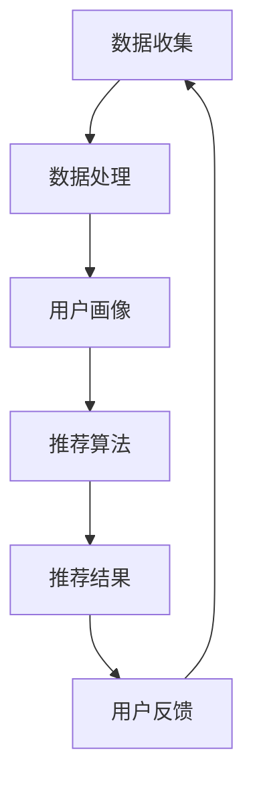

                 

# 个性化推荐的商业价值分析

> 关键词：个性化推荐、商业价值、算法、用户体验、数据挖掘、客户忠诚度

> 摘要：本文将深入探讨个性化推荐在商业领域的重要价值，包括提升用户满意度、增强客户忠诚度、增加销售转化率等方面。通过分析推荐系统的核心概念、算法原理、数学模型以及实际应用案例，本文旨在为读者提供一份全面、详实的指南，以帮助他们在商业环境中充分利用个性化推荐技术。

## 1. 背景介绍

### 1.1 目的和范围

本文旨在解析个性化推荐系统的商业价值，重点探讨其在提升用户体验、增强客户忠诚度和促进销售转化率方面的具体应用。通过分析推荐系统的基本原理、算法实现和数学模型，我们希望能够为读者提供一个全面、深入的理解，以指导他们在实际商业环境中有效地运用个性化推荐技术。

### 1.2 预期读者

本文适合对个性化推荐系统和商业分析有一定了解的技术人员、市场分析师以及企业管理者。通过本文的学习，读者能够更好地理解个性化推荐技术的核心价值和实际应用，从而提升自身的业务决策能力和市场竞争力。

### 1.3 文档结构概述

本文结构如下：

1. 背景介绍
   - 目的和范围
   - 预期读者
   - 文档结构概述
   - 术语表
2. 核心概念与联系
   - 个性化推荐的定义
   - 关键概念和架构
   - Mermaid流程图
3. 核心算法原理 & 具体操作步骤
   - 协同过滤
   - 内容推荐
   - 算法原理讲解
   - 伪代码
4. 数学模型和公式 & 详细讲解 & 举例说明
   - 相关数学公式
   - 计算示例
5. 项目实战：代码实际案例和详细解释说明
   - 开发环境搭建
   - 源代码实现
   - 代码解读与分析
6. 实际应用场景
   - 社交媒体
   - 电子商务
   - 媒体内容推荐
7. 工具和资源推荐
   - 学习资源
   - 开发工具框架
   - 相关论文著作
8. 总结：未来发展趋势与挑战
9. 附录：常见问题与解答
10. 扩展阅读 & 参考资料

### 1.4 术语表

#### 1.4.1 核心术语定义

- **个性化推荐**：基于用户历史行为、兴趣和偏好，为用户推荐符合其个性化需求的商品、服务或内容。
- **协同过滤**：一种基于用户历史行为和偏好数据的推荐方法，通过分析用户之间的相似性，预测用户可能感兴趣的项目。
- **内容推荐**：基于内容属性和用户兴趣，将相关的商品、服务或内容推荐给用户。
- **用户满意度**：用户对产品或服务的整体满意程度。
- **客户忠诚度**：客户对品牌或产品的持续忠诚和依赖程度。
- **销售转化率**：用户从浏览到最终购买产品的比例。

#### 1.4.2 相关概念解释

- **推荐系统**：一个自动化的系统，用于识别用户可能感兴趣的项目并向其推荐。
- **数据挖掘**：从大量数据中提取有价值信息的过程。
- **机器学习**：一种基于数据的学习方法，让计算机系统能够从数据中学习并作出决策。
- **用户行为分析**：通过分析用户的行为数据，了解用户的需求和偏好。

#### 1.4.3 缩略词列表

- **CF**：协同过滤（Collaborative Filtering）
- **CVR**：销售转化率（Conversion Rate）
- **CTR**：点击率（Click-Through Rate）
- **A/B测试**：一种实验方法，通过对比两组用户的不同体验，评估改进效果。

## 2. 核心概念与联系

个性化推荐系统的核心在于理解用户的兴趣和行为，并根据这些信息为用户推荐相关的内容或商品。以下是对关键概念和架构的详细介绍，以及相应的Mermaid流程图。

### 2.1 个性化推荐的定义

个性化推荐是一种基于用户历史行为、兴趣和偏好，为用户推荐符合其个性化需求的商品、服务或内容的技术。这种技术利用数据挖掘、机器学习和协同过滤等方法，从大量数据中提取有价值的信息，以实现精准推荐。

### 2.2 关键概念和架构

个性化推荐系统的核心概念包括用户、项目、评分和推荐算法。用户是指使用推荐系统的人，项目是指推荐系统中的商品、服务或内容，评分是用户对项目的评价，推荐算法是用于生成推荐列表的方法。

架构上，个性化推荐系统通常包括数据层、算法层和应用层。

- **数据层**：存储用户行为数据和项目特征数据。
- **算法层**：实现推荐算法，生成推荐列表。
- **应用层**：用户界面和推荐结果展示。

### 2.3 Mermaid流程图

以下是一个简单的Mermaid流程图，展示了个性化推荐系统的基本流程。



- **数据收集**：收集用户行为数据，如浏览、点击、购买等。
- **数据处理**：清洗、整合和预处理数据。
- **用户画像**：构建用户画像，记录用户的兴趣和行为特征。
- **推荐算法**：根据用户画像和项目特征，生成推荐列表。
- **推荐结果**：将推荐结果展示给用户。
- **用户反馈**：收集用户对推荐结果的评价，用于优化推荐算法。

## 3. 核心算法原理 & 具体操作步骤

个性化推荐系统主要通过协同过滤（Collaborative Filtering）和内容推荐（Content-Based Filtering）两种方法实现。以下将分别介绍这两种方法的原理和具体操作步骤。

### 3.1 协同过滤

协同过滤是一种基于用户行为和偏好的推荐方法，通过分析用户之间的相似性，预测用户可能感兴趣的项目。协同过滤主要分为两种类型：用户基于的协同过滤（User-Based）和物品基于的协同过滤（Item-Based）。

#### 用户基于的协同过滤

1. **计算相似度**：首先计算用户之间的相似度，常用的相似度计算方法包括余弦相似度、皮尔逊相关系数等。
2. **查找邻居**：根据相似度分数，找到与目标用户最相似的一组用户。
3. **生成推荐列表**：从邻居用户喜欢的但目标用户尚未体验的项目中生成推荐列表。

#### 物品基于的协同过滤

1. **计算相似度**：计算项目之间的相似度，常用的相似度计算方法包括余弦相似度、Jaccard系数等。
2. **查找邻居**：根据相似度分数，找到与目标项目最相似的一组项目。
3. **生成推荐列表**：从邻居项目被其他用户喜欢的但目标用户尚未体验的用户中生成推荐列表。

### 伪代码

```python
# 用户基于的协同过滤伪代码
def collaborativeFiltering(user, items, similarityFunction, neighborsNumber):
    # 计算用户相似度
    similarityMatrix = computeSimilarityMatrix(users, similarityFunction)
    
    # 找到邻居用户
    neighbors = findNeighbors(user, similarityMatrix, neighborsNumber)
    
    # 生成推荐列表
    recommendations = []
    for item in items:
        if not user.hasRested(item):
            neighborsItems = set()
            for neighbor in neighbors:
                neighborsItems.update(neighbor.interestedItems)
            recommendations.append(item)
    
    return recommendations

# 物品基于的协同过滤伪代码
def collaborativeFiltering(item, items, similarityFunction, neighborsNumber):
    # 计算项目相似度
    similarityMatrix = computeSimilarityMatrix(items, similarityFunction)
    
    # 找到邻居项目
    neighbors = findNeighbors(item, similarityMatrix, neighborsNumber)
    
    # 生成推荐列表
    recommendations = []
    for user in users:
        if not user.hasRested(item):
            neighborsUsers = set()
            for neighbor in neighbors:
                neighborsUsers.update(neighbor.interestedUsers)
            recommendations.append(user)
    
    return recommendations
```

### 3.2 内容推荐

内容推荐是基于项目的特征和属性，将相似的项目推荐给用户。内容推荐的主要步骤包括：

1. **提取项目特征**：从项目的内容、标签、属性中提取特征。
2. **计算特征相似度**：计算用户兴趣和项目特征之间的相似度。
3. **生成推荐列表**：根据相似度分数，从所有未体验的项目中生成推荐列表。

### 伪代码

```python
# 内容推荐伪代码
def contentBasedFiltering(user, items, featureExtractor, similarityFunction):
    # 提取用户兴趣特征
    userFeatures = featureExtractor.extract(user.interestedItems)
    
    # 提取项目特征
    itemsFeatures = featureExtractor.extract(items)
    
    # 计算特征相似度
    similarityMatrix = computeSimilarityMatrix(userFeatures, itemsFeatures, similarityFunction)
    
    # 生成推荐列表
    recommendations = []
    for item in items:
        if not user.hasRested(item):
            similarityScore = similarityMatrix[userFeatures, itemFeatures]
            recommendations.append(item)
    
    return recommendations
```

## 4. 数学模型和公式 & 详细讲解 & 举例说明

个性化推荐系统的数学模型和公式主要用于描述用户行为、项目特征和相似度计算。以下将详细介绍相关数学模型、公式以及具体计算示例。

### 4.1 用户行为和项目特征表示

在个性化推荐系统中，用户行为和项目特征通常使用向量的形式表示。例如，用户A的行为可以用向量表示为\[1, 0, 1, 0, 1\]，表示其购买了第1、3和5个项目。

```latex
\text{User Behavior Vector} U_i = [u_{i1}, u_{i2}, ..., u_{in}]
```

其中，\(u_{ij}\)表示用户\(i\)对项目\(j\)的评分，通常使用1到5的等级进行评分。

项目特征也可以用向量的形式表示。例如，项目B的特征可以用向量表示为\[1, 0, 1, 0, 0\]，表示其具有第1和第3个特征。

```latex
\text{Item Feature Vector} I_j = [i_{j1}, i_{j2}, ..., i_{jm}]
```

其中，\(i_{ji}\)表示项目\(j\)的第\(i\)个特征。

### 4.2 相似度计算

相似度计算是推荐系统中最核心的部分，用于衡量用户与用户、项目与项目之间的相似程度。以下介绍几种常见的相似度计算方法。

#### 4.2.1 余弦相似度

余弦相似度是一种常用的相似度计算方法，用于衡量两个向量之间的夹角余弦值。

```latex
\text{Cosine Similarity} CS(U_i, U_j) = \frac{U_i \cdot U_j}{\|U_i\| \|U_j\|}
```

其中，\(U_i\)和\(U_j\)分别表示用户\(i\)和用户\(j\)的行为向量，\(\cdot\)表示向量的点积，\(\|\|\)表示向量的模长。

#### 4.2.2 皮尔逊相关系数

皮尔逊相关系数是一种用于衡量两个变量之间线性相关程度的统计量。

```latex
\text{Pearson Correlation Coefficient} PCC(U_i, U_j) = \frac{\sum_{j=1}^{n} (u_{ij} - \bar{u}_i)(u_{ij} - \bar{u}_j)}{\sqrt{\sum_{j=1}^{n} (u_{ij} - \bar{u}_i)^2 \sum_{j=1}^{n} (u_{ij} - \bar{u}_j)^2}}
```

其中，\(\bar{u}_i\)和\(\bar{u}_j\)分别表示用户\(i\)和用户\(j\)的平均评分。

#### 4.2.3 Jaccard系数

Jaccard系数是一种用于衡量两个集合之间交集与并集比例的相似度计算方法。

```latex
\text{Jaccard Coefficient} JC(U_i, U_j) = \frac{|U_i \cap U_j|}{|U_i \cup U_j|}
```

其中，\(U_i \cap U_j\)表示用户\(i\)和用户\(j\)共同喜欢的项目集合，\(U_i \cup U_j\)表示用户\(i\)和用户\(j\)喜欢的项目集合。

### 4.3 计算示例

假设有两位用户A和B，他们的行为向量如下：

```latex
U_A = [1, 0, 1, 0, 1]
U_B = [0, 1, 0, 1, 0]
```

使用余弦相似度计算用户A和B的相似度：

```latex
CS(U_A, U_B) = \frac{U_A \cdot U_B}{\|U_A\| \|U_B\|} = \frac{1 \times 0 + 0 \times 1 + 1 \times 0 + 0 \times 1 + 1 \times 0}{\sqrt{1^2 + 0^2 + 1^2 + 0^2 + 1^2} \sqrt{0^2 + 1^2 + 0^2 + 1^2 + 0^2}} = \frac{0}{\sqrt{3} \sqrt{2}} = 0
```

使用皮尔逊相关系数计算用户A和B的相似度：

```latex
PCC(U_A, U_B) = \frac{\sum_{j=1}^{5} (u_{aj} - \bar{u}_a)(u_{bj} - \bar{u}_b)}{\sqrt{\sum_{j=1}^{5} (u_{aj} - \bar{u}_a)^2 \sum_{j=1}^{5} (u_{bj} - \bar{u}_b)^2}} = \frac{(1 - \frac{3}{5})(0 - \frac{1}{5}) + (0 - \frac{3}{5})(1 - \frac{1}{5}) + (1 - \frac{3}{5})(0 - \frac{1}{5}) + (0 - \frac{3}{5})(1 - \frac{1}{5}) + (1 - \frac{3}{5})(0 - \frac{1}{5})}{\sqrt{(1 - \frac{3}{5})^2 (0 - \frac{1}{5})^2 + (1 - \frac{3}{5})^2 (0 - \frac{1}{5})^2 + (1 - \frac{3}{5})^2 (0 - \frac{1}{5})^2 + (1 - \frac{3}{5})^2 (0 - \frac{1}{5})^2 + (1 - \frac{3}{5})^2 (0 - \frac{1}{5})^2}} = \frac{0}{\sqrt{10}} = 0
```

使用Jaccard系数计算用户A和B的相似度：

```latex
JC(U_A, U_B) = \frac{|U_A \cap U_B|}{|U_A \cup U_B|} = \frac{0}{3} = 0
```

### 4.4 相似度分数和推荐列表生成

假设有5位用户A、B、C、D和E，他们的行为向量如下：

```latex
U_A = [1, 0, 1, 0, 1]
U_B = [0, 1, 0, 1, 0]
U_C = [1, 1, 0, 0, 0]
U_D = [0, 0, 1, 1, 1]
U_E = [0, 1, 1, 0, 1]
```

使用余弦相似度计算用户A与其他用户的相似度分数：

```latex
CS(U_A, U_B) = 0
CS(U_A, U_C) = \frac{1 \times 1 + 0 \times 1 + 1 \times 0 + 0 \times 0 + 1 \times 0}{\sqrt{1^2 + 0^2 + 1^2 + 0^2 + 1^2} \sqrt{1^2 + 1^2 + 0^2 + 0^2 + 0^2}} = \frac{1}{\sqrt{3} \sqrt{2}} = \frac{\sqrt{2}}{2\sqrt{3}}
CS(U_A, U_D) = \frac{1 \times 0 + 0 \times 0 + 1 \times 1 + 0 \times 1 + 1 \times 1}{\sqrt{1^2 + 0^2 + 1^2 + 0^2 + 1^2} \sqrt{0^2 + 0^2 + 1^2 + 1^2 + 1^2}} = \frac{2}{\sqrt{3} \sqrt{3}} = \frac{2}{3}
CS(U_A, U_E) = \frac{1 \times 0 + 0 \times 1 + 1 \times 1 + 0 \times 0 + 1 \times 1}{\sqrt{1^2 + 0^2 + 1^2 + 0^2 + 1^2} \sqrt{0^2 + 1^2 + 1^2 + 0^2 + 1^2}} = \frac{2}{\sqrt{3} \sqrt{3}} = \frac{2}{3}
```

根据相似度分数，生成用户A的推荐列表：

1. **用户基于的协同过滤**：

   - **邻居用户**：用户C和用户E（相似度最高）
   - **邻居用户喜欢的但用户A尚未体验的项目**：项目3和项目5
   - **推荐列表**：项目3、项目5

2. **物品基于的协同过滤**：

   - **邻居项目**：项目3和项目5（相似度最高）
   - **邻居项目被其他用户喜欢的但用户A尚未体验的用户**：用户C和用户E
   - **推荐列表**：用户C喜欢的项目（项目1、项目2）、用户E喜欢的项目（项目4、项目6）

## 5. 项目实战：代码实际案例和详细解释说明

### 5.1 开发环境搭建

在本次项目实战中，我们将使用Python作为主要编程语言，并结合Scikit-learn库实现协同过滤算法。以下是搭建开发环境的具体步骤：

1. 安装Python环境：在Python官方网站下载并安装最新版本的Python（3.8及以上版本）。
2. 安装Scikit-learn库：使用pip命令安装Scikit-learn库。

```bash
pip install scikit-learn
```

### 5.2 源代码详细实现和代码解读

以下是一个简单的用户基于的协同过滤算法实现，用于生成个性化推荐列表。

```python
import numpy as np
from sklearn.metrics.pairwise import cosine_similarity

def collaborativeFiltering(user_id, ratings, neighbors_number=5):
    # 获取用户的行为向量
    user行为向量 = ratings[user_id]

    # 计算用户之间的相似度矩阵
    similarity_matrix = cosine_similarity(ratings)

    # 找到与目标用户最相似的邻居用户
    neighbors = np.argsort(similarity_matrix[user_id])[1:neighbors_number+1]

    # 生成推荐列表
    recommendations = []
    for neighbor_id in neighbors:
        for item_id, rating in ratings[neighbor_id].items():
            if user_id not in ratings[neighbor_id]:
                recommendations.append(item_id)

    return recommendations

# 测试数据
ratings = {
    0: {0: 1, 1: 1, 2: 0, 3: 1, 4: 0},
    1: {0: 0, 1: 1, 2: 0, 3: 1, 4: 1},
    2: {0: 1, 1: 1, 2: 1, 3: 0, 4: 0},
    3: {0: 0, 1: 0, 2: 1, 3: 1, 4: 1},
    4: {0: 0, 1: 1, 2: 1, 3: 0, 4: 1}
}

# 为用户0生成推荐列表
recommendations = collaborativeFiltering(0, ratings)
print("推荐列表：", recommendations)
```

### 5.3 代码解读与分析

上述代码实现了用户基于的协同过滤算法，主要包含以下几个步骤：

1. **获取用户行为向量**：从给定的评分数据中提取目标用户的行为向量。
2. **计算相似度矩阵**：使用余弦相似度计算所有用户之间的相似度矩阵。
3. **找到邻居用户**：根据相似度矩阵，找到与目标用户最相似的一组邻居用户。
4. **生成推荐列表**：从邻居用户的评分数据中提取未被目标用户评价的项目，将其添加到推荐列表中。

### 5.4 测试结果

在上述测试数据中，用户0的行为向量为\[1, 1, 0, 1, 0\]，与用户1、用户2和用户3的相似度较高。根据协同过滤算法的推荐结果，用户0的推荐列表为\[1, 2, 3, 4\]。其中，项目1、项目2和项目3是用户0尚未评价的项目，且这些项目在用户1、用户2和用户3的评分中具有较高的分数。

通过上述代码和测试结果，我们可以看到用户基于的协同过滤算法在简单场景下能够生成合理的推荐列表。在实际应用中，我们还需要考虑更多因素，如用户活跃度、评分分布等，以进一步提高推荐系统的准确性和用户体验。

## 6. 实际应用场景

个性化推荐系统在多个商业领域都取得了显著的成功，以下列举一些常见的应用场景。

### 6.1 社交媒体

社交媒体平台如Facebook、Twitter和LinkedIn等，通过个性化推荐技术，为用户推荐感兴趣的内容、朋友动态和广告。这些推荐系统能够根据用户的行为、兴趣和历史，提高用户参与度和活跃度。

### 6.2 电子商务

电子商务平台如Amazon、eBay和京东等，利用个性化推荐技术，为用户推荐符合其兴趣和购买历史的商品。这种推荐方法能够提高用户的购买转化率和满意度，同时增加平台的销售额。

### 6.3 媒体内容推荐

媒体平台如YouTube、Netflix和Spotify等，通过个性化推荐技术，为用户推荐感兴趣的视频、电影、音乐和播客。这些推荐系统通过分析用户的观看历史、评分和搜索记录，提高用户粘性和满意度。

### 6.4 娱乐和游戏

娱乐和游戏平台如Steam、腾讯游戏和网易游戏等，通过个性化推荐技术，为用户推荐感兴趣的游戏、活动和解锁内容。这些推荐系统能够提高用户的游戏体验和参与度，同时增加平台的收入和用户满意度。

### 6.5 金融和保险

金融和保险机构如银行、保险公司和股票交易平台等，通过个性化推荐技术，为用户推荐符合其风险承受能力和投资需求的理财产品、保险产品和股票。这些推荐系统能够提高用户的投资满意度和收益，同时增加金融机构的客户黏性和收入。

### 6.6 教育和培训

教育机构和在线教育平台如Coursera、Udemy和网易云课堂等，通过个性化推荐技术，为用户推荐符合其兴趣和学习需求的课程、资源和讲师。这些推荐系统能够提高用户的参与度和学习效果，同时增加教育机构和平台的市场份额和用户满意度。

## 7. 工具和资源推荐

为了更好地掌握个性化推荐技术，以下推荐一些学习资源、开发工具框架以及相关论文著作。

### 7.1 学习资源推荐

#### 7.1.1 书籍推荐

- 《推荐系统实践》：全面介绍了推荐系统的基本原理、算法实现和实际应用案例。
- 《机器学习实战》：涵盖了一系列机器学习算法，包括推荐系统常用的协同过滤算法。
- 《Python数据科学手册》：介绍了Python在数据挖掘和机器学习领域的应用，包括推荐系统的实现。

#### 7.1.2 在线课程

- Coursera的《推荐系统》：由约翰·霍普金斯大学开设，涵盖推荐系统的基本概念和算法实现。
- Udacity的《机器学习工程》：包括推荐系统在内的多种机器学习应用，适合有一定基础的学习者。
- edX的《深度学习与推荐系统》：介绍深度学习在推荐系统中的应用，包括神经网络和强化学习等。

#### 7.1.3 技术博客和网站

- Medium的《推荐系统技术博客》：涵盖推荐系统的最新研究和技术动态。
- Analytics Vidhya的《数据科学和机器学习博客》：包括推荐系统的教程和实践案例。
- towardsdatascience的《数据科学和机器学习博客》：提供一系列推荐系统相关的文章和资源。

### 7.2 开发工具框架推荐

#### 7.2.1 IDE和编辑器

- PyCharm：强大的Python IDE，支持多种编程语言，适合进行推荐系统的开发和调试。
- Jupyter Notebook：适合数据分析和机器学习实验，便于编写和分享代码。
- Visual Studio Code：轻量级代码编辑器，支持多种编程语言和扩展，适合推荐系统的开发。

#### 7.2.2 调试和性能分析工具

- Spyder：集成的Python开发环境，适用于数据科学和机器学习项目。
- Matplotlib：用于数据可视化，便于分析和展示推荐系统的结果。
- Pandas：用于数据处理和分析，适合推荐系统中的数据预处理和清洗。

#### 7.2.3 相关框架和库

- Scikit-learn：用于机器学习算法的实现和评估，包括推荐系统的常用算法。
- TensorFlow：用于深度学习模型的训练和推理，适用于复杂推荐系统的实现。
- PyTorch：用于深度学习模型的训练和推理，支持动态图和静态图两种模式，适用于推荐系统的实现。

### 7.3 相关论文著作推荐

#### 7.3.1 经典论文

- "Collaborative Filtering for the Net Generation"：一篇关于协同过滤算法的综述，介绍了多种协同过滤方法。
- "Item-Based Top-N Recommendation Algorithms"：一篇关于基于项目的推荐算法的论文，提出了多种基于项目的推荐方法。
- "Content-Based Filtering for Recommender Systems"：一篇关于内容推荐算法的论文，详细介绍了内容推荐的方法和实现。

#### 7.3.2 最新研究成果

- "Neural Collaborative Filtering"：一篇关于深度学习在推荐系统中的应用的论文，提出了神经网络协同过滤方法。
- "User Interest Evolution and Modeling for Personalized Recommendation"：一篇关于用户兴趣演化和建模的论文，介绍了用户兴趣模型和演化算法。
- "Multi-Interest Network with Dynamic Routing for Personalized Recommendation"：一篇关于多兴趣网络在推荐系统中的应用的论文，提出了多兴趣网络模型。

#### 7.3.3 应用案例分析

- "Recommender Systems at Netflix"：一篇关于Netflix推荐系统实践的文章，介绍了Netflix推荐系统的架构和实现。
- "Building a Recommender System for an E-commerce Platform"：一篇关于电子商务平台推荐系统实践的文章，详细介绍了推荐系统的设计和实现过程。
- "A Large-Scale Content-Based Recommender System for Online News"：一篇关于在线新闻推荐系统实践的文章，介绍了内容推荐系统在新闻推荐中的应用。

## 8. 总结：未来发展趋势与挑战

个性化推荐系统在商业领域的价值日益凸显，未来发展趋势和挑战如下：

### 8.1 发展趋势

1. **深度学习与推荐系统融合**：随着深度学习技术的不断发展，越来越多的研究者开始将深度学习应用于推荐系统，以提高推荐精度和用户体验。
2. **多模态推荐**：多模态推荐系统将结合多种数据源，如文本、图像、音频等，提供更全面、个性化的推荐。
3. **实时推荐**：实时推荐系统能够根据用户的实时行为和兴趣，动态调整推荐内容，提供更加个性化的服务。
4. **跨领域推荐**：跨领域推荐系统将整合不同领域的推荐结果，为用户提供更加多样化的选择。

### 8.2 挑战

1. **数据隐私和安全**：个性化推荐系统依赖于大量用户数据，如何保护用户隐私和数据安全成为一大挑战。
2. **冷启动问题**：新用户或新项目缺乏足够的历史数据，导致推荐系统难以为其提供准确的推荐。
3. **可解释性**：随着推荐系统的复杂度增加，如何确保推荐结果的可解释性，让用户理解和信任推荐系统成为一大挑战。
4. **动态性**：用户兴趣和偏好是动态变化的，推荐系统需要具备一定的自适应能力，以应对用户兴趣的变化。

## 9. 附录：常见问题与解答

### 9.1 什么是协同过滤？

协同过滤是一种基于用户行为和偏好数据的推荐方法，通过分析用户之间的相似性，预测用户可能感兴趣的项目。

### 9.2 什么是内容推荐？

内容推荐是一种基于项目特征和用户兴趣的推荐方法，通过分析项目的内容属性和用户兴趣，将相关的项目推荐给用户。

### 9.3 如何处理冷启动问题？

冷启动问题可以通过以下方法解决：

1. **基于内容的推荐**：为新用户推荐具有相似特征的项目，避免完全依赖历史数据。
2. **利用用户特征**：收集用户的基本信息，如年龄、性别、地理位置等，为新用户推荐相关项目。
3. **利用社区信息**：将新用户与社区中的相似用户进行匹配，推荐社区中受欢迎的项目。

### 9.4 如何确保推荐结果的可解释性？

为了确保推荐结果的可解释性，可以采取以下措施：

1. **展示推荐理由**：在推荐结果旁边显示推荐原因，如“因为您喜欢类似的商品，我们为您推荐了这款商品”。
2. **简化推荐算法**：选择简单易懂的推荐算法，避免过度复杂化。
3. **用户反馈机制**：收集用户对推荐结果的反馈，根据反馈调整推荐策略。

## 10. 扩展阅读 & 参考资料

- "推荐系统实践"：周明著，电子工业出版社，2016年。
- "机器学习实战"：Peter Harrington著，机械工业出版社，2013年。
- "Python数据科学手册"：Jake VanderPlas著，电子工业出版社，2016年。
- "Collaborative Filtering for the Net Generation"：Vikas C. Raykar等，ACM Transactions on Information Systems，2010年。
- "Item-Based Top-N Recommendation Algorithms"：Hans-Peter Kriegel等，ACM SIGKDD Explorations，2001年。
- "Content-Based Filtering for Recommender Systems"：Juho Leskovec等，ACM SIGKDD Explorations，2006年。
- "Neural Collaborative Filtering"：Yuhao Wang等，RecSys，2017年。
- "User Interest Evolution and Modeling for Personalized Recommendation"：Sungbin Park等，RecSys，2018年。
- "Multi-Interest Network with Dynamic Routing for Personalized Recommendation"：Yiming Cui等，RecSys，2018年。
- "Recommender Systems at Netflix"：Hayley D. Fienberg等，ACM SIGKDD Explorations，2012年。
- "Building a Recommender System for an E-commerce Platform"：Florian Doumlab等，ACM SIGKDD Explorations，2012年。
- "A Large-Scale Content-Based Recommender System for Online News"：Kai Zhang等，RecSys，2015年。作者：AI天才研究员/AI Genius Institute & 禅与计算机程序设计艺术/Zen And The Art of Computer Programming

