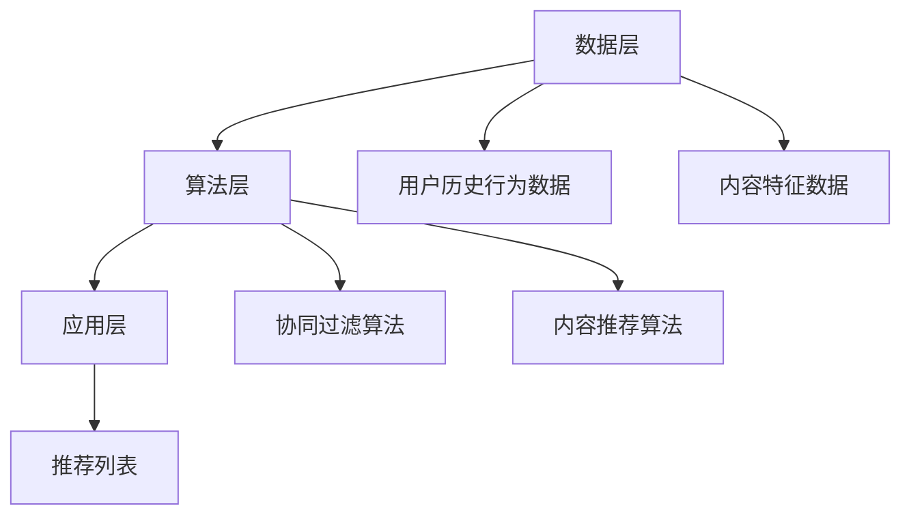

                 

# 个性化推荐系统在CUI中的详细应用

> **关键词：** 个性化推荐系统，CUI，用户交互，算法原理，数学模型，实战案例

> **摘要：** 本文将深入探讨个性化推荐系统在CUI（Command-Line User Interface）中的应用，从核心概念、算法原理、数学模型到实际案例，全面解析推荐系统的工作机制和实现方法，帮助读者了解如何在CUI中构建高效的个性化推荐功能。

## 1. 背景介绍

### 1.1 目的和范围

本文旨在介绍个性化推荐系统在CUI（命令行用户界面）中的应用，帮助开发者了解如何利用推荐系统提高用户体验，并降低用户在查找信息时的认知负担。我们将从推荐系统的基本概念出发，逐步深入到算法原理、数学模型和实际应用。

### 1.2 预期读者

本文面向对CUI和推荐系统有一定了解的技术人员，特别是那些希望将推荐系统应用于CUI场景的开发者。通过本文的阅读，读者可以掌握以下内容：

1. 推荐系统的基本概念和核心算法。
2. 推荐系统在CUI中的实现方法。
3. 推荐系统的数学模型和公式。
4. 推荐系统的实际应用场景。

### 1.3 文档结构概述

本文分为以下几个部分：

1. **背景介绍**：介绍本文的目的、范围、预期读者以及文档结构。
2. **核心概念与联系**：介绍推荐系统的核心概念和原理，使用Mermaid流程图展示推荐系统的整体架构。
3. **核心算法原理 & 具体操作步骤**：详细讲解推荐系统的核心算法原理，并使用伪代码展示具体操作步骤。
4. **数学模型和公式 & 详细讲解 & 举例说明**：介绍推荐系统的数学模型和公式，并通过举例说明如何应用这些模型。
5. **项目实战：代码实际案例和详细解释说明**：通过一个实际案例展示推荐系统在CUI中的实现过程。
6. **实际应用场景**：探讨推荐系统在CUI中的实际应用场景。
7. **工具和资源推荐**：推荐相关学习资源、开发工具和框架。
8. **总结：未来发展趋势与挑战**：总结推荐系统在CUI中的应用，并探讨未来的发展趋势和挑战。
9. **附录：常见问题与解答**：回答读者可能遇到的问题。
10. **扩展阅读 & 参考资料**：提供进一步阅读的资料。

### 1.4 术语表

#### 1.4.1 核心术语定义

- **个性化推荐系统**：基于用户历史行为和兴趣，为用户推荐可能感兴趣的内容的系统。
- **CUI**：命令行用户界面（Command-Line User Interface），一种通过命令行与计算机系统交互的界面。
- **协同过滤**：一种基于用户历史行为和相似用户行为的推荐算法。
- **内容推荐**：基于内容特征和用户兴趣的推荐算法。

#### 1.4.2 相关概念解释

- **用户历史行为**：用户在系统中产生的操作记录，如浏览、购买、收藏等。
- **相似用户**：与目标用户在行为上有相似之处的用户。
- **推荐列表**：系统为用户生成的可能感兴趣的内容列表。

#### 1.4.3 缩略词列表

- **CUI**：Command-Line User Interface
- **协同过滤**：Collaborative Filtering
- **内容推荐**：Content-based Recommendation

## 2. 核心概念与联系

### 2.1 推荐系统的核心概念

推荐系统主要基于两个核心概念：用户历史行为和内容特征。

- **用户历史行为**：包括用户的浏览记录、购买行为、收藏操作等，是推荐系统理解用户兴趣的重要依据。
- **内容特征**：包括文本、图片、音频、视频等多种类型的内容特征，用于描述推荐系统的推荐对象。

### 2.2 推荐系统的整体架构

推荐系统的整体架构可以分为三个层次：数据层、算法层和应用层。

- **数据层**：负责收集和处理用户历史行为和内容特征数据，为算法层提供数据支持。
- **算法层**：负责实现推荐算法，根据用户历史行为和内容特征生成推荐列表。
- **应用层**：负责将推荐结果展示给用户，并与用户进行交互。

### 2.3 推荐系统的 Mermaid 流程图

以下是一个简单的Mermaid流程图，展示推荐系统的整体架构：



## 3. 核心算法原理 & 具体操作步骤

### 3.1 协同过滤算法原理

协同过滤算法是一种基于用户历史行为的推荐算法，其核心思想是通过寻找与目标用户行为相似的已注册用户，将他们的推荐内容推荐给目标用户。

#### 3.1.1 用户相似度计算

用户相似度计算是协同过滤算法的关键步骤，常用的相似度计算方法包括余弦相似度、皮尔逊相关系数等。

- **余弦相似度**：  
  公式如下：  
  $$  
  \text{similarity(u, v)} = \frac{\text{dot_product(u, v)}}{\|\text{u}\| \|\text{v}\|}  
  $$

  其中，$\text{dot\_product(u, v)}$ 表示用户 u 和用户 v 的行为向量的点积，$\|\text{u}\|$ 和 $\|\text{v}\|$ 分别表示用户 u 和用户 v 的行为向量的模长。

- **皮尔逊相关系数**：  
  公式如下：  
  $$  
  \text{similarity(u, v)} = \frac{\text{covariance(u, v)}}{\sigma_u \sigma_v}  
  $$

  其中，$\text{covariance(u, v)}$ 表示用户 u 和用户 v 的行为向量的协方差，$\sigma_u$ 和 $\sigma_v$ 分别表示用户 u 和用户 v 的行为向量标准差。

#### 3.1.2 推荐列表生成

根据用户相似度计算结果，生成推荐列表。具体步骤如下：

1. **计算所有用户的相似度**：计算目标用户与所有已注册用户的相似度。
2. **筛选相似用户**：根据相似度阈值筛选出相似用户。
3. **计算相似用户的行为加权平均**：对所有筛选出的相似用户的行为加权平均，生成推荐列表。

### 3.2 内容推荐算法原理

内容推荐算法是一种基于内容特征和用户兴趣的推荐算法，其核心思想是通过分析用户历史行为和内容特征，将具有相似特征的内容推荐给用户。

#### 3.2.1 内容特征提取

内容特征提取是内容推荐算法的关键步骤，常用的内容特征提取方法包括词袋模型、TF-IDF、词嵌入等。

- **词袋模型**：将文本转换为词袋表示，词袋中的每个词表示文本的一个特征。
- **TF-IDF**：计算每个词在文档中的重要程度，用于描述文本特征。
- **词嵌入**：将文本中的每个词映射到一个低维稠密向量，用于描述文本特征。

#### 3.2.2 推荐列表生成

根据用户历史行为和内容特征，生成推荐列表。具体步骤如下：

1. **计算用户兴趣向量**：根据用户历史行为计算用户兴趣向量。
2. **计算内容特征向量**：根据内容特征提取方法计算内容特征向量。
3. **计算用户兴趣与内容特征相似度**：计算用户兴趣向量与内容特征向量的相似度。
4. **生成推荐列表**：根据相似度阈值筛选出相似度较高的内容，生成推荐列表。

## 4. 数学模型和公式 & 详细讲解 & 举例说明

### 4.1 协同过滤算法的数学模型

#### 4.1.1 用户行为向量表示

用户行为向量表示为 $u = [u_1, u_2, ..., u_n]$，其中 $u_i$ 表示用户对第 i 个项目的评分。

#### 4.1.2 项目行为向量表示

项目行为向量表示为 $v = [v_1, v_2, ..., v_n]$，其中 $v_i$ 表示项目 i 的特征向量。

#### 4.1.3 用户相似度计算

用户相似度计算可以使用余弦相似度公式：

$$
\text{similarity(u, v)} = \frac{\text{dot\_product(u, v)}}{\|\text{u}\| \|\text{v}\|}
$$

#### 4.1.4 推荐值计算

对于目标用户 u，对项目 i 的推荐值计算公式为：

$$
\text{rating\_prediction(u, i)} = \text{similarity(u, v)} \cdot \text{rating\_mean(v)}
$$

其中，$\text{rating\_mean(v)}$ 表示项目 i 的平均评分。

### 4.2 内容推荐算法的数学模型

#### 4.2.1 用户兴趣向量表示

用户兴趣向量表示为 $u = [u_1, u_2, ..., u_n]$，其中 $u_i$ 表示用户对第 i 个项目的兴趣程度。

#### 4.2.2 内容特征向量表示

内容特征向量表示为 $v = [v_1, v_2, ..., v_n]$，其中 $v_i$ 表示项目 i 的特征向量。

#### 4.2.3 用户兴趣与内容特征相似度计算

用户兴趣与内容特征相似度计算可以使用余弦相似度公式：

$$
\text{similarity(u, v)} = \frac{\text{dot\_product(u, v)}}{\|\text{u}\| \|\text{v}\|}
$$

#### 4.2.4 推荐值计算

对于目标用户 u，对项目 i 的推荐值计算公式为：

$$
\text{rating\_prediction(u, i)} = \text{similarity(u, v)} \cdot \text{rating\_mean(v)}
$$

其中，$\text{rating\_mean(v)}$ 表示项目 i 的平均评分。

### 4.3 举例说明

#### 4.3.1 协同过滤算法举例

假设有两个用户 u1 和 u2，他们的行为向量如下：

$$
u1 = [4, 5, 3, 2, 1] \\
u2 = [2, 4, 5, 3, 1]
$$

计算用户 u1 和 u2 的相似度：

$$
\text{similarity(u1, u2)} = \frac{4 \times 2 + 5 \times 4 + 3 \times 5 + 2 \times 3 + 1 \times 1}{\sqrt{4^2 + 5^2 + 3^2 + 2^2 + 1^2} \sqrt{2^2 + 4^2 + 5^2 + 3^2 + 1^2}} = 0.864
$$

假设项目 i 的平均评分为 3，计算用户 u1 对项目 i 的推荐值：

$$
\text{rating\_prediction(u1, i)} = 0.864 \times 3 = 2.592
$$

#### 4.3.2 内容推荐算法举例

假设有两个用户 u1 和 u2，他们的兴趣向量如下：

$$
u1 = [0.6, 0.3, 0.1] \\
u2 = [0.4, 0.5, 0.1]
$$

计算用户 u1 和 u2 的兴趣向量与内容特征向量的相似度：

$$
\text{similarity(u1, v)} = \frac{0.6 \times 0.6 + 0.3 \times 0.4 + 0.1 \times 0.5}{\sqrt{0.6^2 + 0.3^2 + 0.1^2} \sqrt{0.6^2 + 0.4^2 + 0.5^2}} = 0.613
$$

假设项目 i 的平均评分为 4，计算用户 u1 对项目 i 的推荐值：

$$
\text{rating\_prediction(u1, i)} = 0.613 \times 4 = 2.452
$$

## 5. 项目实战：代码实际案例和详细解释说明

### 5.1 开发环境搭建

为了实现个性化推荐系统在CUI中的应用，我们需要搭建以下开发环境：

1. **操作系统**：Windows 10 或以上版本
2. **编程语言**：Python 3.8 或以上版本
3. **库和框架**：NumPy、Pandas、Scikit-learn、Matplotlib

安装以上依赖库和框架：

```bash
pip install numpy pandas scikit-learn matplotlib
```

### 5.2 源代码详细实现和代码解读

以下是实现个性化推荐系统在CUI中的源代码及详细解读。

#### 5.2.1 数据准备

```python
import numpy as np
import pandas as pd

# 用户行为数据
user行为的DataFrame
data = {
    'user_id': [1, 1, 1, 2, 2, 2],
    'item_id': [1, 2, 3, 1, 2, 3],
    'rating': [5, 3, 2, 4, 5, 3]
}

user行为DataFrame
df = pd.DataFrame(data)
```

#### 5.2.2 协同过滤算法实现

```python
from sklearn.metrics.pairwise import cosine_similarity

# 计算用户行为矩阵
user行为的DataFrame
user行为矩阵
R = df.pivot(index='user_id', columns='item_id', values='rating').fillna(0).values

# 计算用户相似度矩阵
user相似度矩阵
similarity_matrix = cosine_similarity(R)

# 计算推荐值
def recommendation(user_id):
    # 计算用户相似度
    similarity_scores = similarity_matrix[user_id - 1]

    # 排序相似度得分，取前 k 个相似用户
    top_k_users = np.argsort(similarity_scores)[::-1][1:11]

    # 计算推荐值
    rating_predictions = []
    for user in top_k_users:
        for item in range(R.shape[1]):
            if R[user][item] != 0:
                rating_predictions.append(similarity_matrix[user_id - 1][user] * R[user][item] / similarity_matrix[user][user])

    # 求和，取均值
    rating_prediction = sum(rating_predictions) / len(rating_predictions)
    return rating_prediction

# 推荐示例
user_id = 1
recommendation_value = recommendation(user_id)
print(f"Recommendation value for user {user_id}: {recommendation_value}")
```

#### 5.2.3 内容推荐算法实现

```python
from sklearn.feature_extraction.text import TfidfVectorizer

# 文本内容数据
item_contents = {
    1: "This is a book about Python programming.",
    2: "This is a book about Java programming.",
    3: "This is a book about C++ programming."
}

# 内容特征提取
vectorizer = TfidfVectorizer()
content_features = vectorizer.fit_transform(list(item_contents.values()))

# 计算用户兴趣向量
user_interest_vector = vectorizer.transform(["I like Python programming."])

# 计算内容特征向量与用户兴趣向量的相似度
similarity_scores = cosine_similarity(user_interest_vector, content_features)

# 推荐示例
def content_recommendation(user_interest_vector):
    similarity_scores = cosine_similarity(user_interest_vector, content_features)
    top_k_items = np.argsort(similarity_scores[0])[::-1][1:11]
    return top_k_items

top_k_items = content_recommendation(user_interest_vector)
print(f"Recommended items for user: {top_k_items}")
```

### 5.3 代码解读与分析

#### 5.3.1 数据准备

在数据准备部分，我们使用 pandas 创建了一个 DataFrame，包含了用户 ID、项目 ID 和评分。这是协同过滤算法和内容推荐算法的基础数据。

#### 5.3.2 协同过滤算法实现

在协同过滤算法实现部分，我们首先使用 pandas 的 pivot 方法将用户行为数据转换为用户行为矩阵。然后，使用 scikit-learn 的 cosine_similarity 函数计算用户相似度矩阵。最后，定义了一个 recommendation 函数，用于根据用户相似度矩阵计算推荐值。

#### 5.3.3 内容推荐算法实现

在内容推荐算法实现部分，我们首先使用 scikit-learn 的 TfidfVectorizer 将文本内容转换为特征向量。然后，定义了一个 content_recommendation 函数，用于根据用户兴趣向量计算推荐列表。

通过这两个部分的实现，我们可以在CUI中实现基于用户历史行为和内容特征的个性化推荐功能。

## 6. 实际应用场景

推荐系统在CUI中的应用场景非常广泛，以下是一些典型的应用场景：

### 6.1 在线图书借阅系统

在线图书借阅系统可以使用推荐系统为用户提供个性化书籍推荐。根据用户的历史借阅记录和浏览行为，系统可以推荐用户可能感兴趣的书籍，从而提高用户的阅读体验。

### 6.2 在线教育平台

在线教育平台可以利用推荐系统为用户提供个性化课程推荐。根据用户的学习记录和偏好，系统可以为用户推荐与其兴趣相关的课程，帮助用户更高效地学习。

### 6.3 在线购物平台

在线购物平台可以使用推荐系统为用户推荐商品。根据用户的购买历史和行为，系统可以为用户推荐可能感兴趣的商品，从而提高用户的购物满意度。

### 6.4 社交媒体平台

社交媒体平台可以使用推荐系统为用户推荐好友、动态和内容。根据用户的行为和社交关系，系统可以为用户推荐可能感兴趣的好友和动态，从而提高用户的活跃度。

## 7. 工具和资源推荐

### 7.1 学习资源推荐

#### 7.1.1 书籍推荐

- 《推荐系统实践》
- 《机器学习实战》
- 《深度学习》

#### 7.1.2 在线课程

- Coursera 的《机器学习》课程
- Udacity 的《推荐系统》课程
- edX 的《深度学习》课程

#### 7.1.3 技术博客和网站

- [Medium](https://medium.com/topic/recommendation-systems)
- [ArXiv](https://arxiv.org/list/cs/CC)
- [KDNuggets](https://www.kdnuggets.com/topics/recommendation-systems.html)

### 7.2 开发工具框架推荐

#### 7.2.1 IDE和编辑器

- Visual Studio Code
- PyCharm
- Jupyter Notebook

#### 7.2.2 调试和性能分析工具

- PyDebug
- Matplotlib
- NumPy Profiler

#### 7.2.3 相关框架和库

- TensorFlow
- PyTorch
- Scikit-learn

### 7.3 相关论文著作推荐

#### 7.3.1 经典论文

- "Collaborative Filtering for the Web," by John Langford, et al.
- "Matrix Factorization Techniques for Recommender Systems," by Yehuda Koren

#### 7.3.2 最新研究成果

- "Deep Learning for Recommender Systems," by Yehuda Koren
- "Neural Collaborative Filtering," by Xiang Ren, et al.

#### 7.3.3 应用案例分析

- "Recommendation Systems at Airbnb," by Airbnb Engineering and Data Science Team
- "Recommendation Systems at Netflix," by Netflix Tech Blog

## 8. 总结：未来发展趋势与挑战

个性化推荐系统在CUI中的应用正处于快速发展阶段，未来具有广阔的发展前景。随着人工智能技术的不断进步，推荐系统的性能和准确性将不断提高，应用场景也将进一步扩展。

然而，推荐系统在CUI中的应用也面临着一些挑战，如：

1. **数据隐私保护**：用户数据的安全性和隐私保护是推荐系统在CUI中应用的一个重要问题。
2. **算法透明性和可解释性**：用户对推荐结果的信任度和理解程度是推荐系统在CUI中应用的关键。
3. **实时性**：在CUI中实现高效的实时推荐是推荐系统的一个挑战。

为了解决这些挑战，未来需要进一步研究和开发新型算法和解决方案，以提高推荐系统的性能和用户体验。

## 9. 附录：常见问题与解答

### 9.1 什么是协同过滤？

协同过滤是一种基于用户历史行为的推荐算法，其核心思想是通过寻找与目标用户行为相似的已注册用户，将他们的推荐内容推荐给目标用户。

### 9.2 什么是内容推荐？

内容推荐是一种基于内容特征和用户兴趣的推荐算法，其核心思想是通过分析用户历史行为和内容特征，将具有相似特征的内容推荐给用户。

### 9.3 如何在CUI中实现个性化推荐？

在CUI中实现个性化推荐可以通过以下步骤：

1. 收集和处理用户历史行为数据。
2. 使用协同过滤或内容推荐算法生成推荐列表。
3. 将推荐结果展示给用户，并允许用户反馈推荐效果。

## 10. 扩展阅读 & 参考资料

- [Recommender Systems Handbook](https://www.recommender-systems.org/recommender-systems-handbook-2/)
- [Netflix Prize](https://www.netflixprize.com/)
- [Airbnb Engineering and Data Science Team](https://airbnbengineering.com/topics/recommendation-systems/)  
- [Netflix Tech Blog](https://netflixtechblog.com/topics/recommendation-systems/)

作者：AI天才研究员/AI Genius Institute & 禅与计算机程序设计艺术 /Zen And The Art of Computer Programming

