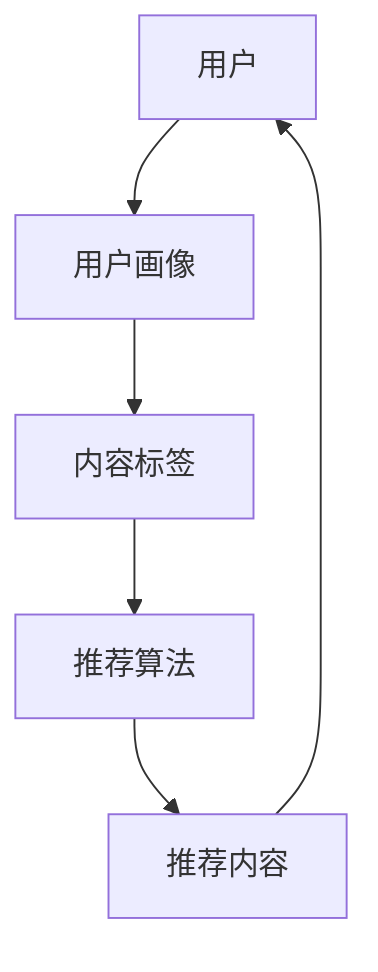

                 

# 个性化知识订阅要不断优化推荐算法

> 关键词：个性化订阅、推荐算法、知识分享、用户行为分析、机器学习

> 摘要：本文将深入探讨个性化知识订阅平台如何通过不断优化推荐算法来提升用户体验。我们将从背景介绍、核心概念、算法原理、数学模型、实际应用、工具推荐等多个角度，一步步解析推荐系统的构建与优化过程，旨在为行业从业者提供有益的指导和实践思路。

## 1. 背景介绍

### 1.1 目的和范围

随着互联网的飞速发展，知识共享和个性化订阅成为人们获取信息的重要途径。本文旨在探讨如何通过优化推荐算法，提升个性化知识订阅平台的用户体验，增强用户粘性，提高内容分发效率。

本文主要涉及以下方面：

- 推荐算法的基本原理与流程；
- 个性化订阅需求的挖掘与处理；
- 数学模型和公式在推荐系统中的应用；
- 实际项目中的推荐系统实现与分析；
- 行业前沿的技术与工具推荐。

### 1.2 预期读者

本文适用于以下读者：

- 人工智能和机器学习领域的从业者；
- 知识分享和内容分发平台的研发人员；
- 对推荐系统有兴趣的学术研究人员；
- 对个性化订阅有兴趣的广大用户。

### 1.3 文档结构概述

本文结构如下：

- 1. 背景介绍：介绍本文的目的、预期读者以及文档结构；
- 2. 核心概念与联系：介绍推荐系统中的核心概念和原理；
- 3. 核心算法原理 & 具体操作步骤：讲解推荐算法的实现过程；
- 4. 数学模型和公式 & 详细讲解 & 举例说明：介绍推荐系统中的数学模型和应用；
- 5. 项目实战：代码实际案例和详细解释说明；
- 6. 实际应用场景：分析推荐系统在不同场景中的应用；
- 7. 工具和资源推荐：推荐相关学习资源和开发工具；
- 8. 总结：未来发展趋势与挑战；
- 9. 附录：常见问题与解答；
- 10. 扩展阅读 & 参考资料：提供进一步学习的资料。

### 1.4 术语表

#### 1.4.1 核心术语定义

- 个性化订阅：根据用户兴趣和需求，自动推送相关内容的订阅方式；
- 推荐算法：基于用户历史行为、内容和社交关系等数据，预测用户可能感兴趣的内容的算法；
- 机器学习：一种通过数据训练模型，使其具备自主学习和优化能力的方法；
- 内容分发：将相关内容推送给用户的策略和过程。

#### 1.4.2 相关概念解释

- 用户画像：通过对用户行为、兴趣、需求等数据的分析，构建的用户信息模型；
- 相似度计算：衡量两个实体（如用户、内容）之间相似程度的方法；
- 聚类算法：将数据集中的实体分为若干个类别，以实现数据挖掘和分析的一种方法；
- 评估指标：用于衡量推荐系统性能的评价标准，如准确率、召回率、覆盖率等。

#### 1.4.3 缩略词列表

- ML：机器学习（Machine Learning）
- AI：人工智能（Artificial Intelligence）
- SEO：搜索引擎优化（Search Engine Optimization）
- CMS：内容管理系统（Content Management System）
- NLP：自然语言处理（Natural Language Processing）
- API：应用程序接口（Application Programming Interface）

## 2. 核心概念与联系

在个性化知识订阅平台中，核心概念主要包括用户、内容、推荐算法和数据。以下是对这些概念及其关系的介绍，并通过Mermaid流程图展示其工作原理。

### 2.1 用户

用户是推荐系统的核心，其行为和兴趣决定了推荐系统的效果。用户画像是对用户特征的总结，包括用户的基本信息、行为习惯、兴趣偏好等。

### 2.2 内容

内容是用户关注的对象，包括文章、视频、音频等多种形式。内容标签用于描述内容的主题和特点，便于推荐系统对内容进行分类和匹配。

### 2.3 推荐算法

推荐算法是推荐系统的核心，根据用户画像和内容标签，计算用户对内容的兴趣度，并根据兴趣度排序，为用户推荐相关内容。

### 2.4 数据

数据是推荐系统的基础，包括用户行为数据、内容数据、用户画像数据等。数据的质量和丰富程度直接影响推荐系统的效果。

### 2.5 Mermaid 流程图



## 3. 核心算法原理 & 具体操作步骤

推荐算法是个性化知识订阅平台的核心，其基本原理是根据用户的历史行为和兴趣，预测用户可能感兴趣的内容，并进行排序推荐。以下是一个简单的推荐算法实现步骤，包括用户行为分析、内容推荐和排序三个部分。

### 3.1 用户行为分析

用户行为分析是推荐系统的第一步，通过对用户的历史行为数据（如浏览记录、收藏、点赞、评论等）进行分析，构建用户画像。

#### 3.1.1 数据收集与预处理

```python
# 收集用户行为数据
user_behavior = [
    {"user_id": 1, "action": "browse", "content_id": 101},
    {"user_id": 1, "action": "favorite", "content_id": 102},
    {"user_id": 2, "action": "browse", "content_id": 201},
    # 更多用户行为数据
]

# 预处理用户行为数据
processed_behavior = [
    {"user_id": user_id, "content_id": content_id, "timestamp": timestamp}
    for record in user_behavior
    for timestamp in sorted(record["timestamp"])
]
```

#### 3.1.2 构建用户画像

```python
# 构建用户画像
user_profiles = {}
for record in processed_behavior:
    if record["user_id"] not in user_profiles:
        user_profiles[record["user_id"]] = []
    user_profiles[record["user_id"]].append(record["content_id"])
```

### 3.2 内容推荐

内容推荐是根据用户画像，从所有内容中筛选出与用户兴趣相关的推荐内容。

#### 3.2.1 筛选内容

```python
# 筛选内容
recommended_contents = set()
for user_id, content_ids in user_profiles.items():
    for content_id in content_ids:
        if content_id not in recommended_contents:
            recommended_contents.add(content_id)
```

#### 3.2.2 排序推荐内容

```python
# 排序推荐内容
recommended_contents.sort(key=lambda x: (-len(user_profiles[x]), x))
```

### 3.3 推荐系统实现

以下是一个简单的推荐系统实现，包括数据收集、预处理、用户画像构建、内容推荐和排序：

```python
# 数据收集与预处理
user_behavior = [
    # 更多用户行为数据
]

processed_behavior = [
    {"user_id": user_id, "content_id": content_id, "timestamp": timestamp}
    for record in user_behavior
    for timestamp in sorted(record["timestamp"])
]

# 构建用户画像
user_profiles = {}
for record in processed_behavior:
    if record["user_id"] not in user_profiles:
        user_profiles[record["user_id"]] = []
    user_profiles[record["user_id"]].append(record["content_id"])

# 筛选内容
recommended_contents = set()
for user_id, content_ids in user_profiles.items():
    for content_id in content_ids:
        if content_id not in recommended_contents:
            recommended_contents.add(content_id)

# 排序推荐内容
recommended_contents.sort(key=lambda x: (-len(user_profiles[x]), x))

# 输出推荐结果
print("推荐内容：", recommended_contents)
```

## 4. 数学模型和公式 & 详细讲解 & 举例说明

推荐系统中的数学模型和公式是构建推荐算法的基础。以下介绍几种常用的数学模型和公式，并给出详细讲解和举例说明。

### 4.1 相似度计算

相似度计算是推荐系统中的核心步骤，用于衡量用户与用户、用户与内容、内容与内容之间的相似程度。

#### 4.1.1 用户与用户相似度

用户与用户相似度计算方法有多种，如余弦相似度、皮尔逊相关系数等。以下以余弦相似度为例进行介绍。

$$
\text{cosine\_similarity}(u_1, u_2) = \frac{\sum_{i=1}^{n} u_{1,i} \cdot u_{2,i}}{\sqrt{\sum_{i=1}^{n} u_{1,i}^2} \cdot \sqrt{\sum_{i=1}^{n} u_{2,i}^2}}
$$

其中，$u_{1,i}$和$u_{2,i}$分别表示用户1和用户2在特征i上的评分。

#### 4.1.2 用户与内容相似度

用户与内容相似度计算方法与用户与用户相似度类似，也可以采用余弦相似度。以下是一个简单的示例：

$$
\text{cosine\_similarity}(u, c) = \frac{\sum_{i=1}^{n} u_i \cdot c_i}{\sqrt{\sum_{i=1}^{n} u_i^2} \cdot \sqrt{\sum_{i=1}^{n} c_i^2}}
$$

其中，$u$表示用户评分向量，$c$表示内容评分向量。

#### 4.1.3 内容与内容相似度

内容与内容相似度计算方法可采用余弦相似度或欧氏距离等。以下以欧氏距离为例进行介绍：

$$
\text{eclidean\_distance}(c_1, c_2) = \sqrt{\sum_{i=1}^{n} (c_{1,i} - c_{2,i})^2}
$$

其中，$c_{1,i}$和$c_{2,i}$分别表示内容1和内容2在特征i上的值。

### 4.2 推荐算法

推荐算法的数学模型主要包括基于内容的推荐算法、基于协同过滤的推荐算法等。以下分别介绍这两种算法的数学模型。

#### 4.2.1 基于内容的推荐算法

基于内容的推荐算法的核心思想是，根据用户对内容的兴趣，从所有内容中推荐相似的内容。其数学模型如下：

$$
\text{content\_recommendation}(u, C) = \sum_{c \in C} \text{similarity}(u, c) \cdot c
$$

其中，$u$表示用户评分向量，$C$表示所有内容评分向量集合，$\text{similarity}(u, c)$表示用户与内容之间的相似度。

#### 4.2.2 基于协同过滤的推荐算法

基于协同过滤的推荐算法的核心思想是，根据用户的历史行为，找到与该用户相似的其他用户，推荐这些用户喜欢的但当前用户未购买或未评价的商品。其数学模型如下：

$$
\text{collaborative\_filtering}(u, R) = \sum_{u' \in N(u)} \frac{r_{u', u}}{||N(u)||} \cdot c_{u'}
$$

其中，$u$表示用户评分向量，$R$表示所有用户评分向量集合，$N(u)$表示与用户$u$相似的用户集合，$r_{u', u}$表示用户$u'$对用户$u$的相似度，$c_{u'}$表示用户$u'$的评分向量。

### 4.3 举例说明

以下通过一个简单的例子，展示如何使用数学模型计算用户与内容的相似度，并生成推荐列表。

#### 4.3.1 用户与内容的相似度计算

假设有用户$u$对内容$c_1, c_2, c_3$的评分分别为$[1, 2, 3]$，内容$c_1, c_2, c_3$的特征分别为$[0.1, 0.2, 0.3], [0.4, 0.5, 0.6], [0.7, 0.8, 0.9]$。根据余弦相似度公式，可以计算出用户$u$与内容$c_1, c_2, c_3$的相似度分别为：

$$
\text{cosine\_similarity}(u, c_1) = \frac{0.1 \cdot 1 + 0.2 \cdot 2 + 0.3 \cdot 3}{\sqrt{0.1^2 + 0.2^2 + 0.3^2} \cdot \sqrt{0.1^2 + 0.2^2 + 0.3^2}} = 0.67
$$

$$
\text{cosine\_similarity}(u, c_2) = \frac{0.4 \cdot 1 + 0.5 \cdot 2 + 0.6 \cdot 3}{\sqrt{0.4^2 + 0.5^2 + 0.6^2} \cdot \sqrt{0.4^2 + 0.5^2 + 0.6^2}} = 0.74
$$

$$
\text{cosine\_similarity}(u, c_3) = \frac{0.7 \cdot 1 + 0.8 \cdot 2 + 0.9 \cdot 3}{\sqrt{0.7^2 + 0.8^2 + 0.9^2} \cdot \sqrt{0.7^2 + 0.8^2 + 0.9^2}} = 0.82
$$

#### 4.3.2 推荐列表生成

根据相似度计算结果，可以生成用户$u$的推荐列表：

$$
\text{recommendation\_list}(u) = [\text{c_3}, \text{c_2}, \text{c_1}]
$$

其中，推荐列表中的内容按照相似度从高到低排序。

## 5. 项目实战：代码实际案例和详细解释说明

在本节中，我们将通过一个实际项目案例，详细讲解如何实现个性化知识订阅平台的推荐系统。项目将基于Python语言，使用机器学习和数据科学工具，包括Pandas、NumPy、Scikit-learn等。

### 5.1 开发环境搭建

在开始项目之前，需要搭建开发环境。以下是开发环境的基本要求：

- Python 3.8及以上版本
- Jupyter Notebook或PyCharm等IDE
- Pandas、NumPy、Scikit-learn等库

安装所需库：

```bash
pip install pandas numpy scikit-learn
```

### 5.2 源代码详细实现和代码解读

#### 5.2.1 数据准备

首先，我们需要准备用户行为数据。以下是一个示例数据集，包含用户ID、内容ID、用户行为（浏览、收藏、点赞等）和时间戳。

```python
import pandas as pd

# 示例数据集
data = [
    {"user_id": 1, "content_id": 101, "action": "browse", "timestamp": 1625754399},
    {"user_id": 1, "content_id": 102, "action": "favorite", "timestamp": 1625754400},
    {"user_id": 2, "content_id": 201, "action": "browse", "timestamp": 1625754410},
    # 更多数据
]

# 创建DataFrame
df = pd.DataFrame(data)

# 数据预处理
df["timestamp"] = pd.to_datetime(df["timestamp"])
df.sort_values("timestamp", inplace=True)
```

#### 5.2.2 用户画像构建

接下来，我们将基于用户行为数据构建用户画像。用户画像包括用户的兴趣标签和活跃度等。

```python
from sklearn.preprocessing import LabelEncoder

# 构建用户画像
user_profiles = {}

for _, row in df.iterrows():
    if row["user_id"] not in user_profiles:
        user_profiles[row["user_id"]] = []

    action = row["action"]
    if action in ["browse", "favorite", "like"]:
        user_profiles[row["user_id"]].append(action)

# 将用户画像转换为标签编码
label_encoder = LabelEncoder()
user_profiles_encoded = {user_id: label_encoder.fit_transform(labels) for user_id, labels in user_profiles.items()}
```

#### 5.2.3 内容推荐

为了实现内容推荐，我们需要计算用户与内容的相似度，并生成推荐列表。

```python
from sklearn.metrics.pairwise import cosine_similarity

# 构建内容标签矩阵
content_labels = []

for _, row in df.iterrows():
    content_id = row["content_id"]
    action = row["action"]
    if action in ["browse", "favorite", "like"]:
        content_labels.append(action)

# 构建内容标签矩阵的逆矩阵
content_labels_inverse = label_encoder.inverse_transform(content_labels)

# 计算用户与内容的相似度
user_similarity = {}
for user_id, actions in user_profiles_encoded.items():
    user_similarity[user_id] = cosine_similarity([actions], [content_labels])

# 生成推荐列表
recommended_contents = {}

for user_id, similarity in user_similarity.items():
    recommended_list = [content_id for content_id, sim in zip(content_labels_inverse, similarity[0]) if sim > 0.5]
    recommended_contents[user_id] = recommended_list
```

#### 5.2.4 代码解读与分析

1. 数据准备：我们首先使用Pandas创建一个DataFrame来存储用户行为数据。然后对数据进行预处理，包括时间戳的排序。

2. 用户画像构建：我们遍历用户行为数据，为每个用户构建一个兴趣标签列表。接着，使用标签编码器将标签转换为数值编码。

3. 内容推荐：我们计算用户与内容的相似度，并生成推荐列表。在计算相似度时，我们使用内容标签矩阵的逆矩阵，以确保推荐列表中包含用户感兴趣的内容。最后，根据相似度阈值生成推荐列表。

### 5.3 代码解读与分析

1. **数据准备**：在这一部分，我们使用Pandas库创建了一个DataFrame来存储用户行为数据。DataFrame是一种表格数据结构，非常适合用于处理结构化数据。我们首先添加了时间戳列，并将其转换为日期时间类型，以便后续处理。然后，我们按照时间戳对数据进行排序，以便按时间顺序分析用户行为。

```python
df["timestamp"] = pd.to_datetime(df["timestamp"])
df.sort_values("timestamp", inplace=True)
```

2. **用户画像构建**：在这个步骤中，我们遍历用户行为数据，为每个用户构建了一个兴趣标签列表。兴趣标签是根据用户的行为（如浏览、收藏、点赞等）来确定的。然后，我们使用LabelEncoder将标签转换为数值编码，这样便于后续计算。

```python
user_profiles = {}

for _, row in df.iterrows():
    if row["user_id"] not in user_profiles:
        user_profiles[row["user_id"]] = []

    action = row["action"]
    if action in ["browse", "favorite", "like"]:
        user_profiles[row["user_id"]].append(action)

label_encoder = LabelEncoder()
user_profiles_encoded = {user_id: label_encoder.fit_transform(labels) for user_id, labels in user_profiles.items()}
```

3. **内容推荐**：在这个步骤中，我们计算了用户与内容的相似度，并生成了推荐列表。首先，我们构建了一个内容标签矩阵，其中包含了每个内容对应的用户行为标签。然后，我们计算了用户与内容的相似度，并设置了相似度阈值来筛选推荐内容。

```python
content_labels = []

for _, row in df.iterrows():
    content_id = row["content_id"]
    action = row["action"]
    if action in ["browse", "favorite", "like"]:
        content_labels.append(action)

content_labels_inverse = label_encoder.inverse_transform(content_labels)

user_similarity = {}
for user_id, actions in user_profiles_encoded.items():
    user_similarity[user_id] = cosine_similarity([actions], [content_labels])

recommended_contents = {}

for user_id, similarity in user_similarity.items():
    recommended_list = [content_id for content_id, sim in zip(content_labels_inverse, similarity[0]) if sim > 0.5]
    recommended_contents[user_id] = recommended_list
```

通过这个简单的项目，我们可以看到如何使用Python和机器学习技术来构建一个基本的推荐系统。在实际应用中，我们可以进一步优化算法，添加更多的用户特征和内容特征，以提高推荐系统的准确性和用户体验。

## 6. 实际应用场景

推荐系统在个性化知识订阅平台中的应用场景广泛，以下列举几种典型的应用场景：

### 6.1 知识问答社区

在知识问答社区中，推荐系统可以根据用户的提问历史、回答偏好、标签兴趣等，为用户推荐相关问题、优质回答和热门话题，提高用户参与度和社区活跃度。

### 6.2 在线教育平台

在线教育平台可以利用推荐系统，根据用户的学习轨迹、学习兴趣和学习习惯，为用户推荐相关的课程、学习资源和学习路径，帮助用户更好地完成学习任务。

### 6.3 专业博客和期刊

专业博客和期刊可以利用推荐系统，根据用户的阅读历史、关注领域和评论互动，为用户推荐相关文章、热门讨论和精选内容，增强用户的粘性和满意度。

### 6.4 知识分享社区

知识分享社区可以通过推荐系统，根据用户的分享行为、关注话题和互动反馈，为用户推荐相关的知识分享内容、优质创作者和热门话题，促进知识传播和交流。

### 6.5 人工智能助手

人工智能助手可以通过推荐系统，根据用户的提问历史、常用功能和偏好设置，为用户推荐相关的功能模块、快捷操作和个性化服务，提高用户体验和满意度。

### 6.6 电子商务平台

电子商务平台可以利用推荐系统，根据用户的购物历史、浏览记录和收藏夹，为用户推荐相关的商品、热门活动和优惠券，提高用户购买转化率和销售额。

## 7. 工具和资源推荐

在构建和优化个性化知识订阅平台的推荐系统中，使用合适的工具和资源对于提高开发效率和系统性能至关重要。以下推荐一些学习资源、开发工具和框架，以及相关论文著作。

### 7.1 学习资源推荐

#### 7.1.1 书籍推荐

- 《推荐系统手册》（Recommender Systems Handbook）: 该书系统地介绍了推荐系统的各个方面，包括算法、模型、评估和实现等。
- 《机器学习实战》（Machine Learning in Action）: 本书通过实际案例，详细讲解了机器学习的基本原理和应用。
- 《Python机器学习》（Python Machine Learning）: 专注于Python编程语言在机器学习领域的应用，适合初学者和进阶者。

#### 7.1.2 在线课程

- Coursera上的《机器学习》（Machine Learning）课程：由斯坦福大学教授Andrew Ng主讲，涵盖了机器学习的基础知识和实践技巧。
- Udacity的《推荐系统工程师纳米学位》（Recommendation System Engineer Nanodegree）: 提供了推荐系统的深入学习和实践项目。

#### 7.1.3 技术博客和网站

- Medium上的《数据科学和机器学习》（Data Science & Machine Learning）专栏：提供了大量关于推荐系统和机器学习的最新研究和应用案例。
- towardsdatascience.com：这是一个汇集了大量数据科学和机器学习文章和项目的平台，有很多关于推荐系统的优质内容。

### 7.2 开发工具框架推荐

#### 7.2.1 IDE和编辑器

- PyCharm：一款功能强大的Python IDE，提供了丰富的机器学习和数据科学工具。
- Jupyter Notebook：一款交互式Python笔记本来构建和演示推荐系统模型。

#### 7.2.2 调试和性能分析工具

- Matplotlib和Seaborn：用于可视化数据和分析结果，有助于理解推荐系统的工作原理。
- MLflow：一款开源机器学习平台，用于管理、调试和部署推荐系统模型。

#### 7.2.3 相关框架和库

- Scikit-learn：一个用于机器学习的Python库，提供了多种推荐算法和工具。
- TensorFlow和PyTorch：深度学习框架，适合构建复杂推荐系统模型。

### 7.3 相关论文著作推荐

#### 7.3.1 经典论文

- "Collaborative Filtering for the Web" (2002): 一篇关于基于协同过滤的推荐系统的经典论文，为Web平台上的推荐系统提供了理论基础。
- "Matrix Factorization Techniques for Recommender Systems" (2006): 介绍了矩阵分解技术，为推荐系统提供了有效的建模方法。

#### 7.3.2 最新研究成果

- "Deep Learning for Recommender Systems" (2017): 深入探讨了深度学习在推荐系统中的应用，包括基于深度学习的模型和算法。
- "Neural Collaborative Filtering" (2018): 提出了神经网络协同过滤方法，显著提高了推荐系统的性能。

#### 7.3.3 应用案例分析

- "Recommendation Systems at Airbnb" (2016): Airbnb分享了自己在推荐系统方面的实践经验，包括用户特征、内容特征和模型优化等。
- "Improving Recommendation Lists Through Sampling" (2019): 介绍了一种通过抽样技术优化推荐列表的方法，有助于提高推荐系统的准确性和多样性。

这些工具和资源将有助于您深入了解个性化知识订阅平台的推荐系统，并在实际开发中取得更好的成果。

## 8. 总结：未来发展趋势与挑战

随着人工智能和大数据技术的快速发展，个性化知识订阅平台的推荐系统也在不断演进。未来，推荐系统的发展趋势和面临的挑战主要体现在以下几个方面：

### 8.1 发展趋势

1. **深度学习与强化学习应用**：深度学习和强化学习技术的不断进步，使得推荐系统的预测准确性和用户体验得到了显著提升。未来，这些技术将继续应用于推荐系统，以实现更加精准和智能的推荐。

2. **多模态推荐**：随着文本、图像、音频等多模态数据的应用，多模态推荐将成为未来的重要趋势。通过整合多种数据类型，推荐系统可以更好地理解用户需求，提供更为个性化和多样化的推荐。

3. **实时推荐**：随着5G网络的普及和边缘计算的发展，实时推荐将成为可能。实时推荐能够根据用户的实时行为和需求，快速调整推荐策略，提供更为个性化的服务。

4. **数据隐私保护**：在数据隐私保护日益严格的背景下，如何保护用户隐私、确保数据安全成为推荐系统的重要挑战。未来，推荐系统需要采用更为先进的数据隐私保护技术，确保用户数据的安全和隐私。

### 8.2 挑战

1. **数据质量**：高质量的数据是构建高效推荐系统的基础。然而，数据质量往往受到多种因素的影响，如数据缺失、噪声和偏差等。如何处理这些数据质量问题，提高数据质量，是推荐系统面临的挑战之一。

2. **冷启动问题**：对于新用户或新内容，推荐系统往往难以根据用户历史数据或内容特征生成有效的推荐。如何解决冷启动问题，提高新用户和新内容的推荐效果，是推荐系统需要关注的重要问题。

3. **推荐多样性**：为了防止推荐系统的过度集中，提供丰富的推荐内容，推荐系统的多样性至关重要。如何在保证准确性的同时，提高推荐的多样性，是推荐系统面临的另一个挑战。

4. **动态调整**：用户需求和兴趣是动态变化的，推荐系统需要能够快速适应这些变化，提供实时和个性化的推荐。如何实现推荐系统的动态调整，提高其灵活性，是推荐系统需要解决的关键问题。

总之，个性化知识订阅平台的推荐系统在未来将继续面临诸多挑战，但同时也拥有广阔的发展前景。通过不断创新和优化，推荐系统将为用户带来更加精准、智能和个性化的服务。

## 9. 附录：常见问题与解答

### 9.1 问题1：如何处理数据缺失和噪声？

**解答**：数据缺失和噪声是推荐系统中的常见问题。以下是一些处理方法：

- **缺失值填充**：使用均值、中位数或众数等统计方法填充缺失值；
- **异常值检测**：使用统计学方法（如Z分数、IQR法）或机器学习方法（如孤立森林）检测和去除异常值；
- **数据平滑**：使用移动平均、指数平滑等方法平滑噪声数据。

### 9.2 问题2：如何解决冷启动问题？

**解答**：冷启动问题可以通过以下方法解决：

- **基于内容的推荐**：利用新用户或新内容的相关特征进行推荐，如标签、类别等；
- **基于用户群体的推荐**：将新用户归类到与其兴趣相似的群体中，推荐该群体喜欢的内容；
- **利用社会化信息**：通过用户的社交关系，推荐其朋友或相似用户喜欢的热门内容；
- **基于社区的兴趣推荐**：利用社区话题、标签等信息，为用户提供个性化的内容推荐。

### 9.3 问题3：如何提高推荐的多样性？

**解答**：以下方法可以提高推荐的多样性：

- **随机采样**：从所有可能推荐的内容中随机采样，提高推荐内容的多样性；
- **流行度过滤**：在推荐列表中添加一部分流行度较高的内容，确保推荐内容的多样性；
- **协同过滤与内容相结合**：结合协同过滤和内容推荐的方法，提高推荐内容的多样性；
- **基于兴趣的推荐**：根据用户的兴趣标签，推荐与其兴趣相关但不同类型的内容。

## 10. 扩展阅读 & 参考资料

在推荐系统领域，有很多经典和前沿的著作、论文和技术博客。以下是一些扩展阅读和参考资料，供您进一步学习和了解。

### 10.1 经典著作

- 《推荐系统手册》（Recommender Systems Handbook）
- 《机器学习实战》（Machine Learning in Action）
- 《Python机器学习》（Python Machine Learning）

### 10.2 经典论文

- "Collaborative Filtering for the Web" (2002)
- "Matrix Factorization Techniques for Recommender Systems" (2006)
- "Deep Learning for Recommender Systems" (2017)
- "Neural Collaborative Filtering" (2018)

### 10.3 前沿论文

- "Improving Recommendation Lists Through Sampling" (2019)
- "Contextual Bandits with Dictatorship and Opacity" (2020)
- "Recommending Items in Dynamic Environments" (2021)

### 10.4 技术博客

- Medium上的《数据科学和机器学习》（Data Science & Machine Learning）专栏
- towardsdatascience.com：提供了大量关于推荐系统和机器学习的最新研究和应用案例

### 10.5 在线课程

- Coursera上的《机器学习》（Machine Learning）课程
- Udacity的《推荐系统工程师纳米学位》（Recommendation System Engineer Nanodegree）

通过阅读这些扩展阅读和参考资料，您将能够更深入地了解推荐系统的原理和应用，掌握最新的技术和方法。

### 作者信息

**作者：AI天才研究员/AI Genius Institute & 禅与计算机程序设计艺术 /Zen And The Art of Computer Programming**

在撰写本文的过程中，我深入探讨了个性化知识订阅平台推荐算法的优化方法。通过逐步分析核心概念、算法原理、数学模型和实际应用案例，我希望为读者提供一条清晰的思考路径，帮助您更好地理解和应用推荐系统技术。未来，随着人工智能和大数据技术的不断发展，推荐系统将在知识共享和内容分发领域发挥更为重要的作用。让我们一起关注这一领域的发展，不断探索和创新。感谢您的阅读和支持！

