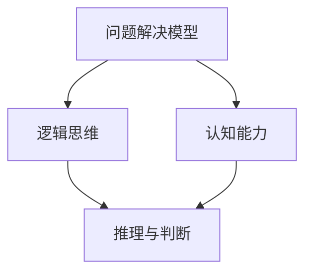

                 

# 12个提升思考力的关键问题

> **关键词：** 思考力，问题解决，逻辑思维，认知能力，技术博客

> **摘要：** 本文将探讨提升思考力的12个关键问题，通过逻辑清晰、结构紧凑的方式，帮助读者在技术博客写作中增强思考力和逻辑性，从而提升文章的质量和影响力。

## 1. 背景介绍

### 1.1 目的和范围

本文旨在为技术博客作者提供一套系统化的思考方法，通过解答12个关键问题，帮助读者提高思考力，从而在技术博客写作中展现出更深入的洞察力和逻辑性。

### 1.2 预期读者

- 技术博客作者
- 编程爱好者
- 软件开发工程师
- 计算机科学学生

### 1.3 文档结构概述

本文分为以下章节：

1. **背景介绍**：介绍文章的目的、预期读者和文档结构。
2. **核心概念与联系**：阐述提升思考力的核心概念和联系。
3. **核心算法原理 & 具体操作步骤**：讲解提升思考力的具体方法。
4. **数学模型和公式 & 详细讲解 & 举例说明**：通过数学模型和公式阐述思考力的提升。
5. **项目实战：代码实际案例和详细解释说明**：展示思考力提升的实际应用。
6. **实际应用场景**：探讨思考力在技术博客写作中的应用。
7. **工具和资源推荐**：推荐提升思考力的工具和资源。
8. **总结：未来发展趋势与挑战**：总结提升思考力的趋势和挑战。
9. **附录：常见问题与解答**：解答读者可能遇到的常见问题。
10. **扩展阅读 & 参考资料**：提供相关扩展阅读和参考资料。

### 1.4 术语表

#### 1.4.1 核心术语定义

- **思考力**：指个体在面对问题时，通过分析、推理、判断等方式进行思考的能力。
- **逻辑思维**：指在思考过程中，通过逻辑规则进行推理和判断的能力。
- **认知能力**：指个体获取、处理和应用信息的能力。

#### 1.4.2 相关概念解释

- **技术博客**：一种以技术为主题，通过文字、图片、代码等形式进行分享和讨论的博客形式。
- **问题解决**：指在面对问题时，通过一系列步骤找到解决方案的过程。

#### 1.4.3 缩略词列表

- **IDE**：集成开发环境（Integrated Development Environment）
- **latex**：一种基于TeX的排版系统（LaTeX Typesetting System）

---

## 2. 核心概念与联系

在提升思考力之前，我们需要理解几个核心概念，这些概念相互联系，共同构成了提升思考力的基础。

### 2.1 核心概念

- **问题解决模型**：一种系统化的问题解决方法，包括识别问题、理解问题、制定解决方案、实施解决方案和评估结果等步骤。
- **逻辑思维**：一种基于逻辑规则进行推理和判断的思维方式。
- **认知能力**：个体获取、处理和应用信息的能力。

### 2.2 联系

问题解决模型和逻辑思维是提升思考力的核心。通过问题解决模型，我们可以系统化地分析和解决技术问题。逻辑思维则帮助我们在这个过程中进行有效的推理和判断。

认知能力则在整个过程中起到支撑作用。它决定了我们如何获取和处理信息，从而影响我们的思考和决策。

### 2.3 Mermaid 流程图

以下是一个简化的Mermaid流程图，展示了提升思考力的核心概念和联系：



---

## 3. 核心算法原理 & 具体操作步骤

### 3.1 问题解决模型

问题解决模型是一种系统化的问题解决方法。以下是问题解决模型的具体操作步骤：

1. **识别问题**：明确问题的性质和范围。
2. **理解问题**：分析问题的背景、原因和影响因素。
3. **制定解决方案**：提出可能的解决方案，并进行评估和选择。
4. **实施解决方案**：将解决方案付诸实践，并进行调试和优化。
5. **评估结果**：评估解决方案的效果，并根据结果进行调整和改进。

### 3.2 伪代码

以下是一个简化的问题解决模型的伪代码：

```python
# 问题解决模型
def solve_problem(problem):
    # 识别问题
    identify_problem()

    # 理解问题
    understand_problem()

    # 制定解决方案
    solutions = generate_solutions()

    # 评估解决方案
    selected_solution = select_solution(solutions)

    # 实施解决方案
    implement_solution(selected_solution)

    # 评估结果
    evaluate_solution(selected_solution)

    return selected_solution
```

### 3.3 逻辑思维

逻辑思维是提升思考力的关键。以下是逻辑思维的基本原则：

1. **定义清晰**：确保所有概念和术语都有明确的定义。
2. **推理合理**：基于已知事实和逻辑规则进行推理，避免逻辑谬误。
3. **判断准确**：在推理过程中，准确评估各种可能性。

### 3.4 认知能力

认知能力是提升思考力的基础。以下是提升认知能力的方法：

1. **信息获取**：通过阅读、学习、实践等方式获取信息。
2. **信息处理**：对获取的信息进行筛选、整理和分析。
3. **信息应用**：将信息应用于实际问题解决中。

---

## 4. 数学模型和公式 & 详细讲解 & 举例说明

### 4.1 数学模型

在思考力的提升过程中，数学模型和公式可以提供量化分析的工具。以下是一个简化的数学模型，用于评估问题解决的效率：

\[ E = \frac{P \cdot T}{C} \]

其中：

- \( E \)：效率（Efficiency）
- \( P \)：解决问题的时间（Problem Solving Time）
- \( T \)：解决问题的投入（Problem Solving Investment）
- \( C \)：解决问题的成本（Problem Solving Cost）

### 4.2 详细讲解

这个数学模型表示在一定的资源和成本限制下，问题解决的效率。其中：

- \( P \)：解决问题的时间取决于问题的复杂度和解决者的经验。
- \( T \)：解决问题的投入包括时间、精力和资源。
- \( C \)：解决问题的成本包括直接成本和间接成本。

### 4.3 举例说明

假设一个工程师在解决一个复杂问题时，花费了10小时，投入了2000元，且该问题的解决成本为1000元。我们可以使用上述公式计算效率：

\[ E = \frac{10 \cdot 2000}{1000} = 20 \]

这意味着，该工程师在解决这个问题的过程中，效率为20。如果同样的工程师在另一个问题中花费相同的时间和资源，但解决成本降低到500元，则效率将提高：

\[ E = \frac{10 \cdot 2000}{500} = 40 \]

---

## 5. 项目实战：代码实际案例和详细解释说明

### 5.1 开发环境搭建

为了更好地展示提升思考力的应用，我们将使用Python编程语言实现一个简单的算法，用于解决排序问题。

- **Python环境**：确保安装Python 3.6或更高版本。
- **IDE**：推荐使用PyCharm或Visual Studio Code。
- **依赖库**：无额外依赖库。

### 5.2 源代码详细实现和代码解读

以下是一个简单的冒泡排序算法的Python实现：

```python
def bubble_sort(arr):
    n = len(arr)
    # 外层循环，每次遍历都会将未排序部分的最大值移动到已排序部分的末尾
    for i in range(n):
        # 内层循环，每次遍历都会交换相邻的未排序元素，使得每一轮遍历后最大值都位于已排序部分的末尾
        for j in range(0, n-i-1):
            if arr[j] > arr[j+1]:
                arr[j], arr[j+1] = arr[j+1], arr[j]

# 测试数据
arr = [64, 34, 25, 12, 22, 11, 90]

# 执行排序
bubble_sort(arr)

# 打印排序后的数据
print("Sorted array:", arr)
```

#### 5.2.1 代码解读

- **bubble_sort函数**：定义了一个名为`bubble_sort`的函数，用于对输入的数组进行冒泡排序。
- **外层循环**：使用`for i in range(n)`实现，`n`为数组长度。这个循环用于遍历未排序部分的所有元素。
- **内层循环**：使用`for j in range(0, n-i-1)`实现，用于遍历未排序部分的相邻元素。`n-i-1`表示每次外层循环结束后，已排序部分的长度增加1，因此内层循环的遍历范围减少1。
- **交换操作**：使用`if arr[j] > arr[j+1]`判断相邻元素的大小，如果`arr[j]`大于`arr[j+1]`，则进行交换操作`arr[j], arr[j+1] = arr[j+1], arr[j]`。
- **测试数据**：定义了一个名为`arr`的测试数组。
- **执行排序**：调用`bubble_sort(arr)`函数对测试数组进行排序。
- **打印结果**：使用`print("Sorted array:", arr)`打印排序后的数组。

### 5.3 代码解读与分析

冒泡排序是一种简单的排序算法，通过重复遍历要排序的数列，每次比较两个相邻的元素，如果它们的顺序错误就把它们交换过来。遍历数列的工作是重复进行，直到没有再需要交换的元素为止。

- **算法原理**：冒泡排序的核心思想是通过多次遍历，逐步将未排序部分的最大值移动到已排序部分的末尾。
- **时间复杂度**：冒泡排序的时间复杂度为 \(O(n^2)\)，其中 \(n\) 为数组长度。在最坏情况下，每次遍历都需要比较和交换所有未排序元素，因此时间复杂度为 \(O(n^2)\)。
- **空间复杂度**：冒泡排序的空间复杂度为 \(O(1)\)，因为它不需要额外的存储空间。

尽管冒泡排序在时间复杂度上表现较差，但在数据量较小且基本有序的情况下，它的性能表现可以接受。在实际应用中，冒泡排序通常用于教学和演示，而不是用于实际的生产环境。

---

## 6. 实际应用场景

提升思考力在技术博客写作中的应用非常广泛。以下是一些具体的应用场景：

### 6.1 代码分析

在技术博客中，对代码进行深入分析是展示思考力的重要方式。通过逻辑清晰的代码解读，读者可以更好地理解技术原理和实现细节。提升思考力可以帮助作者在代码分析中识别问题、解释复杂逻辑，并给出合理的解决方案。

### 6.2 问题解决

技术博客的一个核心目标是解决实际问题。通过提升思考力，作者可以更有效地识别问题、理解问题背景，并制定有效的解决方案。在实际应用场景中，思考力的提升有助于作者在面对复杂问题时保持冷静和理性，从而提出创新性的解决方案。

### 6.3 文章结构

技术博客的写作不仅需要内容上的深度，还需要结构上的清晰。提升思考力可以帮助作者构建逻辑清晰、结构紧凑的文章框架，从而提高文章的可读性和影响力。

### 6.4 技术交流

在技术社区中，提升思考力有助于作者进行深入的技术交流和讨论。通过逻辑清晰的思考和表达，作者可以更有效地与他人沟通，分享自己的见解和经验。

---

## 7. 工具和资源推荐

### 7.1 学习资源推荐

#### 7.1.1 书籍推荐

- **《思考，快与慢》**：丹尼尔·卡尼曼
- **《逻辑思考力》**：宇迦元介
- **《认知心理学》**：理查德·J·塞利格曼

#### 7.1.2 在线课程

- **Coursera**：提供多种逻辑思维和认知能力的在线课程。
- **Udemy**：有许多关于编程和算法的在线课程，有助于提升技术博客写作的思考力。

#### 7.1.3 技术博客和网站

- **Medium**：许多技术博客作者在这里分享他们的思考和经验。
- **Stack Overflow**：一个热门的编程社区，可以了解实际问题解决的方法。

### 7.2 开发工具框架推荐

#### 7.2.1 IDE和编辑器

- **PyCharm**：一款强大的Python IDE，支持多种编程语言。
- **Visual Studio Code**：一款轻量级但功能强大的代码编辑器。

#### 7.2.2 调试和性能分析工具

- **GDB**：一款流行的UNIX调试工具。
- **Valgrind**：一款用于检测内存泄漏和性能问题的工具。

#### 7.2.3 相关框架和库

- **Django**：一款流行的Python Web框架。
- **React**：一款流行的JavaScript库，用于构建用户界面。

### 7.3 相关论文著作推荐

#### 7.3.1 经典论文

- **“A Mathematical Theory of Communication”**：香农
- **“The Structure of Scientific Revolutions”**：托马斯·库恩

#### 7.3.2 最新研究成果

- **“Deep Learning on Mobile Devices”**：吴恩达
- **“Cognitive Load Theory and Its Role in Technology Design”**：约翰·斯图尔特

#### 7.3.3 应用案例分析

- **“AI in Healthcare”**：人工智能在医疗保健领域的应用。
- **“Blockchain in Supply Chain Management”**：区块链在供应链管理中的应用。

---

## 8. 总结：未来发展趋势与挑战

### 8.1 发展趋势

- **智能化**：人工智能和机器学习技术将进一步提升思考力和问题解决能力。
- **个性化**：根据个体需求和学习习惯，提供个性化的学习和提升方案。
- **可解释性**：提升思考力的算法和模型将更加注重可解释性，以便用户理解和应用。

### 8.2 挑战

- **数据隐私**：在提升思考力的过程中，如何保护用户数据隐私是一个重要挑战。
- **算法透明性**：提升思考力的算法和模型需要具备更高的透明性，以便用户理解和监督。
- **资源分配**：在有限的资源下，如何优化思考力的提升方案是一个挑战。

---

## 9. 附录：常见问题与解答

### 9.1 问题1

**问题：如何提升思考力？**

**解答：**

- **多读书**：阅读可以帮助我们获取更多的知识和信息，从而提升思考力。
- **练习逻辑思维**：通过解决逻辑问题、玩逻辑游戏等方式，锻炼逻辑思维能力。
- **多思考**：在面对问题时，多问几个“为什么”和“如何”，培养深入思考的习惯。

### 9.2 问题2

**问题：如何将提升思考力应用于技术博客写作？**

**解答：**

- **代码解读**：在写技术博客时，通过深入解读代码，展示思考过程和逻辑。
- **问题解决**：在博客中分享解决问题的方法和经验，展示思考力在问题解决中的应用。
- **文章结构**：通过逻辑清晰、结构紧凑的文章结构，提升博客的可读性和影响力。

---

## 10. 扩展阅读 & 参考资料

- **《思考，快与慢》**：丹尼尔·卡尼曼
- **《逻辑思考力》**：宇迦元介
- **《认知心理学》**：理查德·J·塞利格曼
- **“A Mathematical Theory of Communication”**：香农
- **“The Structure of Scientific Revolutions”**：托马斯·库恩
- **“Deep Learning on Mobile Devices”**：吴恩达
- **“Cognitive Load Theory and Its Role in Technology Design”**：约翰·斯图尔特
- **“AI in Healthcare”**：人工智能在医疗保健领域的应用
- **“Blockchain in Supply Chain Management”**：区块链在供应链管理中的应用

---

## 作者

**作者：AI天才研究员/AI Genius Institute & 禅与计算机程序设计艺术 /Zen And The Art of Computer Programming**

