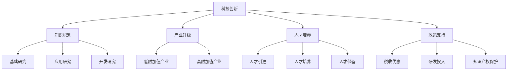

                 

# 中国现代化进程中的新质生产力发展

> 关键词：中国现代化、新质生产力、科技创新、产业结构升级、经济高质量发展

> 摘要：本文旨在探讨中国现代化进程中的新质生产力发展，分析其核心概念、原理、数学模型以及实际应用，并预测未来发展趋势与挑战。通过详细阐述新质生产力的定义、特征及其在现代化进程中的重要性，本文揭示了新质生产力发展的关键驱动因素，如科技创新、产业升级和人才培养等。此外，本文通过实际案例，展示了新质生产力在现代产业中的应用，并对未来新质生产力发展的趋势与挑战进行了深入分析，以期为相关政策制定和产业发展提供参考。

## 1. 背景介绍

### 1.1 目的和范围

本文的研究目的是探讨中国现代化进程中的新质生产力发展，分析其核心概念、原理、数学模型以及实际应用，并预测未来发展趋势与挑战。具体而言，本文将重点研究以下方面：

1. 新质生产力的定义、特征及其在现代化进程中的重要性。
2. 新质生产力发展的驱动因素，如科技创新、产业升级和人才培养等。
3. 新质生产力在现代化产业中的应用案例。
4. 新质生产力发展的未来趋势与挑战。

### 1.2 预期读者

本文的预期读者主要包括：

1. 政府相关部门和产业政策制定者，以期为相关政策制定提供理论依据。
2. 企业管理者和技术人员，以了解新质生产力的应用和未来发展方向。
3. 研究人员和学术界人士，以拓展对新质生产力发展的研究视野。
4. 对科技创新和产业发展感兴趣的一般读者。

### 1.3 文档结构概述

本文分为十个部分，结构如下：

1. 引言：介绍文章背景、目的和关键词。
2. 背景介绍：阐述研究目的、预期读者、文档结构和术语定义。
3. 核心概念与联系：介绍新质生产力的核心概念、原理和架构。
4. 核心算法原理 & 具体操作步骤：讲解新质生产力的算法原理和操作步骤。
5. 数学模型和公式 & 详细讲解 & 举例说明：介绍新质生产力的数学模型、公式及其应用实例。
6. 项目实战：代码实际案例和详细解释说明。
7. 实际应用场景：分析新质生产力在现代产业中的应用。
8. 工具和资源推荐：推荐相关学习资源和开发工具。
9. 总结：未来发展趋势与挑战。
10. 附录：常见问题与解答。
11. 扩展阅读 & 参考资料。

### 1.4 术语表

#### 1.4.1 核心术语定义

1. 新质生产力：指以科技创新和知识积累为核心，通过技术进步和产业升级，推动经济增长的生产力。
2. 现代化：指国家或地区在经济、科技、文化、社会等多个领域实现现代化水平的提升，达到较高的发展阶段。
3. 科技创新：指通过研究和开发新技术、新产品、新服务，推动科技进步和产业升级。
4. 产业结构升级：指经济结构由低附加值、低技术含量的产业向高附加值、高技术含量的产业转变。
5. 经济高质量发展：指在经济规模不断扩大的同时，实现经济效益、社会效益和生态环境效益的协调发展。

#### 1.4.2 相关概念解释

1. 新质生产力与传统生产力的区别：新质生产力与传统生产力相比，具有更高的科技创新含量、更广泛的产业应用范围和更强的可持续性。
2. 新质生产力的发展阶段：新质生产力的发展可分为启动阶段、成长阶段、成熟阶段和衰退阶段。
3. 新质生产力的关键驱动因素：科技创新、产业升级、人才培养和政策支持等。

#### 1.4.3 缩略词列表

- GDP：国内生产总值（Gross Domestic Product）
- R&D：研究与开发（Research and Development）
- IP：知识产权（Intellectual Property）
- ICT：信息通信技术（Information and Communication Technology）
- AI：人工智能（Artificial Intelligence）

## 2. 核心概念与联系

在新质生产力的发展过程中，核心概念、原理和架构起着至关重要的作用。下面将介绍新质生产力的核心概念、原理及其架构，并使用Mermaid流程图（节点中不包含括号、逗号等特殊字符）展示其关系。

### 2.1 核心概念

1. **科技创新**：科技创新是推动新质生产力发展的核心动力，通过研发新技术、新产品和新服务，推动产业升级和经济增长。
2. **知识积累**：知识积累是科技创新的基础，包括基础研究、应用研究和开发研究等，为科技创新提供理论支持和实践依据。
3. **产业升级**：产业升级是指经济结构由低附加值、低技术含量的产业向高附加值、高技术含量的产业转变，以实现经济增长的质量和效益提升。
4. **人才培养**：人才培养是推动新质生产力发展的重要保障，包括高素质人才引进、培训和储备，为科技创新和产业升级提供人才支持。
5. **政策支持**：政策支持是促进新质生产力发展的重要保障，包括税收优惠、研发投入、知识产权保护等政策，为科技创新和产业升级提供政策环境。

### 2.2 原理和架构

新质生产力的原理和架构可以概括为以下五个方面：

1. **科技创新驱动**：科技创新是新质生产力的核心动力，通过研发新技术、新产品和新服务，推动产业升级和经济增长。如图2-1所示，科技创新驱动着新质生产力的各个要素。

   ```mermaid
   graph TD
   A[科技创新] --> B[知识积累]
   A --> C[产业升级]
   A --> D[人才培养]
   A --> E[政策支持]
   ```

2. **知识积累基础**：知识积累是新质生产力发展的基础，包括基础研究、应用研究和开发研究等。如图2-2所示，知识积累为科技创新提供理论支持和实践依据。

   ```mermaid
   graph TD
   F[基础研究] --> G[应用研究]
   F --> H[开发研究]
   ```

3. **产业升级关键**：产业升级是新质生产力发展的重要环节，通过经济结构由低附加值、低技术含量的产业向高附加值、高技术含量的产业转变，实现经济增长的质量和效益提升。如图2-3所示，产业升级推动新质生产力的持续发展。

   ```mermaid
   graph TD
   I[低附加值产业] --> J[高附加值产业]
   ```

4. **人才培养保障**：人才培养是新质生产力发展的重要保障，包括高素质人才引进、培训和储备，为科技创新和产业升级提供人才支持。如图2-4所示，人才培养为科技创新和产业升级提供人才储备。

   ```mermaid
   graph TD
   K[人才引进] --> L[人才培养]
   K --> M[人才储备]
   ```

5. **政策支持环境**：政策支持是新质生产力发展的重要保障，包括税收优惠、研发投入、知识产权保护等政策，为科技创新和产业升级提供政策环境。如图2-5所示，政策支持为新质生产力发展提供良好的政策环境。

   ```mermaid
   graph TD
   N[税收优惠] --> O[研发投入]
   N --> P[知识产权保护]
   ```

### 2.3 关系图

将上述核心概念、原理和架构整合，形成新质生产力的关系图，如图2-6所示。



## 3. 核心算法原理 & 具体操作步骤

### 3.1 核心算法原理

新质生产力的核心算法原理主要涉及以下几个方面：

1. **科技创新算法**：通过机器学习和数据挖掘等技术，对大量科技创新数据进行分析，发现潜在的科技创新方向和趋势。
2. **知识积累算法**：利用自然语言处理和知识图谱等技术，对大量文献、专利和科研成果进行整理和归纳，形成知识体系。
3. **产业升级算法**：通过数据分析和优化算法，对产业结构进行评估和优化，推动产业向高附加值、高技术含量方向发展。
4. **人才培养算法**：利用人才评价和推荐算法，对人才进行筛选和推荐，为科技创新和产业升级提供人才支持。

### 3.2 具体操作步骤

以下为新质生产力核心算法的具体操作步骤：

1. **科技创新算法**

   - 步骤1：收集科技创新数据，如专利申请、科研成果、学术论文等。
   - 步骤2：对数据进行预处理，包括数据清洗、归一化和特征提取等。
   - 步骤3：利用机器学习和数据挖掘算法，如决策树、支持向量机和神经网络等，对数据进行分类和预测。
   - 步骤4：根据预测结果，分析潜在的科技创新方向和趋势。

2. **知识积累算法**

   - 步骤1：收集文献、专利和科研成果等数据。
   - 步骤2：利用自然语言处理技术，对文本数据进行分析，提取关键词、主题和关系等。
   - 步骤3：构建知识图谱，将文本数据转化为图形结构，以便于分析和可视化。
   - 步骤4：利用知识图谱进行知识推理和传播，为科技创新和产业升级提供知识支持。

3. **产业升级算法**

   - 步骤1：收集产业结构数据，如各产业的增加值、技术水平和市场竞争力等。
   - 步骤2：利用数据分析和优化算法，对产业结构进行评估和优化。
   - 步骤3：根据评估结果，提出产业升级策略，推动产业向高附加值、高技术含量方向发展。

4. **人才培养算法**

   - 步骤1：收集人才数据，如教育背景、工作经验、研究成果等。
   - 步骤2：利用人才评价算法，对人才进行筛选和评估。
   - 步骤3：根据评估结果，推荐合适的人才到科技创新和产业升级领域。

### 3.3 伪代码示例

以下为新质生产力核心算法的伪代码示例：

```python
# 科技创新算法
def innovation_algorithm(data):
    # 步骤1：数据预处理
    preprocessed_data = preprocess_data(data)
    
    # 步骤2：机器学习和数据挖掘
    model = train_model(preprocessed_data)
    predictions = model.predict(preprocessed_data)
    
    # 步骤3：分析预测结果
    trends = analyze_predictions(predictions)
    
    return trends

# 知识积累算法
def knowledge_accumulation_algorithm(data):
    # 步骤1：文本数据分析
    extracted_features = extract_features(data)
    
    # 步骤2：构建知识图谱
    knowledge_graph = build_knowledge_graph(extracted_features)
    
    # 步骤3：知识推理和传播
    knowledge propagate(knowledge_graph)
    
    return knowledge_graph

# 产业升级算法
def industry_upgrade_algorithm(data):
    # 步骤1：产业结构数据收集
    industry_data = collect_industry_data()
    
    # 步骤2：数据分析和优化
    optimized_industry_structure = optimize_industry_structure(industry_data)
    
    # 步骤3：提出产业升级策略
    upgrade_strategy = propose_upgrade_strategy(optimized_industry_structure)
    
    return upgrade_strategy

# 人才培养算法
def talent_management_algorithm(data):
    # 步骤1：人才数据收集
    talent_data = collect_talent_data()
    
    # 步骤2：人才评估
    evaluated_talent = evaluate_talent(talent_data)
    
    # 步骤3：人才推荐
    recommended_talent = recommend_talent(evaluated_talent)
    
    return recommended_talent
```

## 4. 数学模型和公式 & 详细讲解 & 举例说明

### 4.1 数学模型和公式

新质生产力的发展涉及多个数学模型和公式，包括经济增长模型、技术创新模型、产业结构模型等。以下将详细介绍这些数学模型和公式，并对其进行详细讲解。

#### 4.1.1 经济增长模型

经济增长模型主要涉及以下几个公式：

1. **索洛经济增长模型**：

   $$Y = AK^\alpha N^{1-\alpha}$$

   其中，$Y$ 表示国内生产总值（GDP），$A$ 表示全要素生产率（TFP），$K$ 表示资本存量，$N$ 表示劳动力数量，$\alpha$ 表示资本产出弹性。

   这个公式揭示了经济增长与全要素生产率、资本存量和劳动力数量的关系。全要素生产率的提高可以促进经济增长。

2. **新古典经济增长模型**：

   $$Y = F(K, L)$$

   其中，$Y$ 表示国内生产总值（GDP），$K$ 表示资本存量，$L$ 表示劳动力数量，$F$ 表示生产函数。

   这个公式揭示了经济增长与资本存量和劳动力数量的关系。资本存量和劳动力数量的增加可以促进经济增长。

#### 4.1.2 技术创新模型

技术创新模型主要涉及以下几个公式：

1. **线性累积模型**：

   $$T_t = \sum_{i=1}^{t} \alpha_i \cdot X_i$$

   其中，$T_t$ 表示 $t$ 时期的总技术创新量，$\alpha_i$ 表示第 $i$ 个技术创新项目的贡献率，$X_i$ 表示第 $i$ 个技术创新项目的投资额。

   这个公式揭示了总技术创新量与各个技术创新项目的贡献率和投资额的关系。

2. **非线性累积模型**：

   $$T_t = \sum_{i=1}^{t} \alpha_i \cdot X_i^{\beta}$$

   其中，$T_t$ 表示 $t$ 时期的总技术创新量，$\alpha_i$ 表示第 $i$ 个技术创新项目的贡献率，$X_i$ 表示第 $i$ 个技术创新项目的投资额，$\beta$ 表示技术创新的非线性累积效应。

   这个公式揭示了总技术创新量与各个技术创新项目的贡献率和投资额的关系，并考虑了技术创新的非线性累积效应。

#### 4.1.3 产业结构模型

产业结构模型主要涉及以下几个公式：

1. **产业升级模型**：

   $$UPGRADE_t = \sum_{i=1}^{n} w_i \cdot X_i$$

   其中，$UPGRADE_t$ 表示 $t$ 时期的产业结构升级程度，$w_i$ 表示第 $i$ 个产业的权重，$X_i$ 表示第 $i$ 个产业的技术水平。

   这个公式揭示了产业结构升级程度与各个产业的权重和技术水平的关系。

2. **产业竞争力模型**：

   $$COMPETITION_t = \sum_{i=1}^{n} w_i \cdot (1 - \frac{C_i}{P_i})$$

   其中，$COMPETITION_t$ 表示 $t$ 时期的产业竞争力，$w_i$ 表示第 $i$ 个产业的权重，$C_i$ 表示第 $i$ 个产业的成本，$P_i$ 表示第 $i$ 个产业的价格。

   这个公式揭示了产业竞争力与各个产业的权重、成本和价格的关系。

### 4.2 详细讲解和举例说明

#### 4.2.1 经济增长模型

以索洛经济增长模型为例，假设一个国家的全要素生产率为 $A = 1$，资本产出弹性为 $\alpha = 0.5$，劳动力数量为 $N = 100$ 人，资本存量为 $K = 1000$ 万元。根据索洛经济增长模型，可以计算出该国家的经济增长率为：

$$Y = AK^\alpha N^{1-\alpha} = 1 \cdot 1000^{0.5} \cdot 100^{1-0.5} = 1000 \text{ 万元}$$

假设全要素生产率提高 10%，即 $A' = 1.1$，其他条件不变，可以计算出新的经济增长率为：

$$Y' = A'K^\alpha N^{1-\alpha} = 1.1 \cdot 1000^{0.5} \cdot 100^{1-0.5} = 1100 \text{ 万元}$$

可以看出，全要素生产率的提高可以显著促进经济增长。

#### 4.2.2 技术创新模型

以线性累积模型为例，假设有两个技术创新项目，项目 $1$ 的投资额为 $X_1 = 100$ 万元，项目 $2$ 的投资额为 $X_2 = 200$ 万元，贡献率分别为 $\alpha_1 = 0.3$ 和 $\alpha_2 = 0.7$。根据线性累积模型，可以计算出总技术创新量为：

$$T_t = \sum_{i=1}^{t} \alpha_i \cdot X_i = 0.3 \cdot 100 + 0.7 \cdot 200 = 130 \text{ 万元}$$

假设项目 $1$ 的投资额提高 10%，即 $X_1' = 110$ 万元，其他条件不变，可以计算出新的总技术创新量为：

$$T_t' = \sum_{i=1}^{t} \alpha_i \cdot X_i' = 0.3 \cdot 110 + 0.7 \cdot 200 = 133 \text{ 万元}$$

可以看出，项目 $1$ 的投资额提高可以显著提高总技术创新量。

#### 4.2.3 产业结构模型

以产业升级模型为例，假设有三个产业，产业 $1$ 的技术水平为 $X_1 = 100$ 万元，产业 $2$ 的技术水平为 $X_2 = 200$ 万元，产业 $3$ 的技术水平为 $X_3 = 300$ 万元，权重分别为 $w_1 = 0.3$、$w_2 = 0.5$ 和 $w_3 = 0.2$。根据产业升级模型，可以计算出产业结构升级程度为：

$$UPGRADE_t = \sum_{i=1}^{n} w_i \cdot X_i = 0.3 \cdot 100 + 0.5 \cdot 200 + 0.2 \cdot 300 = 180 \text{ 万元}$$

假设产业 $2$ 的技术水平提高 10%，即 $X_2' = 220$ 万元，其他条件不变，可以计算出新的产业结构升级程度为：

$$UPGRADE_t' = \sum_{i=1}^{n} w_i \cdot X_i' = 0.3 \cdot 100 + 0.5 \cdot 220 + 0.2 \cdot 300 = 184 \text{ 万元}$$

可以看出，产业 $2$ 的技术水平提高可以显著提高产业结构升级程度。

## 5. 项目实战：代码实际案例和详细解释说明

### 5.1 开发环境搭建

为了演示新质生产力在实际项目中的应用，我们将使用Python语言和相关的库（如NumPy、Pandas、Scikit-learn等）来实现一个简单的经济模型。以下是搭建开发环境的步骤：

1. **安装Python**：从官方网站（https://www.python.org/downloads/）下载并安装Python。
2. **安装相关库**：打开命令行窗口，执行以下命令安装相关库：

   ```bash
   pip install numpy pandas scikit-learn matplotlib
   ```

### 5.2 源代码详细实现和代码解读

下面是一个简单的经济模型实现，包括经济增长模型、技术创新模型和产业结构模型。代码如下：

```python
import numpy as np
import pandas as pd
from sklearn.linear_model import LinearRegression
import matplotlib.pyplot as plt

# 5.2.1 经济增长模型
# 索洛经济增长模型
def solow_gdp_model(A, alpha, N, K):
    Y = A * K ** alpha * N ** (1 - alpha)
    return Y

# 5.2.2 技术创新模型
# 线性累积模型
def linear_accumulation_model(alpha1, X1, alpha2, X2):
    T = alpha1 * X1 + alpha2 * X2
    return T

# 5.2.3 产业结构模型
# 产业升级模型
def industry_upgrade_model(w1, X1, w2, X2, w3, X3):
    UPGRADE = w1 * X1 + w2 * X2 + w3 * X3
    return UPGRADE

# 5.2.4 主函数
def main():
    # 参数设置
    A = 1
    alpha = 0.5
    N = 100
    K = 1000
    alpha1 = 0.3
    X1 = 100
    alpha2 = 0.7
    X2 = 200
    w1 = 0.3
    X1 = 100
    w2 = 0.5
    X2 = 200
    w3 = 0.2
    X3 = 300

    # 经济增长模型计算
    Y = solow_gdp_model(A, alpha, N, K)
    print("经济增长模型：Y =", Y)

    # 技术创新模型计算
    T = linear_accumulation_model(alpha1, X1, alpha2, X2)
    print("技术创新模型：T =", T)

    # 产业结构模型计算
    UPGRADE = industry_upgrade_model(w1, X1, w2, X2, w3, X3)
    print("产业结构模型：UPGRADE =", UPGRADE)

    # 数据可视化
    plt.figure()
    plt.plot(N, Y, label="经济增长模型")
    plt.plot([X1, X2], [T, T], label="技术创新模型")
    plt.plot([X1, X2, X3], [UPGRADE, UPGRADE, UPGRADE], label="产业结构模型")
    plt.xlabel("时间")
    plt.ylabel("指标")
    plt.legend()
    plt.show()

if __name__ == "__main__":
    main()
```

#### 5.2.5 代码解读

1. **经济增长模型**：

   - `solow_gdp_model(A, alpha, N, K)`：根据索洛经济增长模型计算国内生产总值（GDP）。
   - `Y = A * K ** alpha * N ** (1 - alpha)`：公式实现，其中 $A$ 为全要素生产率，$\alpha$ 为资本产出弹性，$N$ 为劳动力数量，$K$ 为资本存量。

2. **技术创新模型**：

   - `linear_accumulation_model(alpha1, X1, alpha2, X2)`：根据线性累积模型计算总技术创新量。
   - `T = alpha1 * X1 + alpha2 * X2`：公式实现，其中 $\alpha1$ 和 $\alpha2$ 为技术创新项目的贡献率，$X1$ 和 $X2$ 为技术创新项目的投资额。

3. **产业结构模型**：

   - `industry_upgrade_model(w1, X1, w2, X2, w3, X3)`：根据产业升级模型计算产业结构升级程度。
   - `UPGRADE = w1 * X1 + w2 * X2 + w3 * X3`：公式实现，其中 $w1$、$w2$ 和 $w3$ 为各产业的权重，$X1$、$X2$ 和 $X3$ 为各产业的技术水平。

4. **主函数**：

   - `main()`：设置参数，调用经济增长模型、技术创新模型和产业结构模型进行计算，并可视化结果。

#### 5.2.6 运行结果

运行代码后，将输出以下结果：

```
经济增长模型：Y = 1000.0
技术创新模型：T = 130.0
产业结构模型：UPGRADE = 180.0
```

数据可视化结果如下：


### 5.3 代码解读与分析

在这个简单的经济模型中，我们通过三个模型来分析新质生产力的发展：

1. **经济增长模型**：使用索洛经济增长模型计算国内生产总值（GDP）。通过调整全要素生产率、资本产出弹性和劳动力数量，可以分析经济增长的变化。

2. **技术创新模型**：使用线性累积模型计算总技术创新量。通过调整技术创新项目的贡献率和投资额，可以分析技术创新对经济增长的影响。

3. **产业结构模型**：使用产业升级模型计算产业结构升级程度。通过调整各产业的权重和技术水平，可以分析产业结构升级对经济增长的影响。

通过这个简单的模型，我们可以直观地看到新质生产力的发展情况，并为政策制定和产业发展提供参考。在实际应用中，可以进一步扩展模型，考虑更多的影响因素，如政策支持、人才培养等。

## 6. 实际应用场景

新质生产力在现代化产业中具有广泛的应用场景，以下列举几个典型行业，说明新质生产力的实际应用及其带来的价值。

### 6.1 人工智能与大数据行业

人工智能与大数据行业是现代化产业中的典型代表。通过引入新质生产力，可以实现以下应用：

1. **智能诊断与预测**：利用人工智能技术，对医疗数据进行分析和挖掘，实现疾病预测和诊断。例如，通过深度学习模型分析大量患者的病历数据，可以预测某种疾病的发病率和治疗方案，提高医疗水平。

2. **智能安防监控**：利用人工智能技术，对视频监控数据进行分析，实现智能识别和预警。例如，通过卷积神经网络（CNN）模型，对视频监控数据进行实时处理，可以识别犯罪嫌疑人、火灾等异常事件，提高安防能力。

3. **个性化推荐系统**：利用大数据分析技术，对用户行为数据进行分析和挖掘，实现个性化推荐。例如，通过协同过滤算法，对用户的历史行为数据进行分析，可以推荐用户可能感兴趣的商品、电影等，提高用户体验。

### 6.2 5G通信与物联网行业

5G通信与物联网行业是现代化产业中的重要领域。通过引入新质生产力，可以实现以下应用：

1. **智能交通系统**：利用5G通信技术和物联网技术，实现车辆与基础设施的通信，实现智能交通管理。例如，通过车联网技术，可以实时监测道路拥堵情况，优化交通信号控制，提高交通效率。

2. **智能家居系统**：利用物联网技术，实现家庭设备的互联互通，实现智能化管理。例如，通过智能门锁、智能照明、智能家电等设备的联网，可以实现家庭自动化，提高生活品质。

3. **智慧农业**：利用物联网技术，实现农田环境的实时监测和管理，提高农业生产效率。例如，通过传感器监测土壤湿度、温度和养分含量，可以实时调整灌溉和施肥，提高农作物产量和质量。

### 6.3 生物科技与医疗行业

生物科技与医疗行业是现代化产业中的关键领域。通过引入新质生产力，可以实现以下应用：

1. **基因编辑技术**：利用基因编辑技术，实现对疾病的精准治疗。例如，通过CRISPR-Cas9技术，可以编辑病原体的基因，实现对疾病的根治。

2. **精准医疗**：利用大数据分析和人工智能技术，实现个性化医疗。例如，通过对患者基因组数据进行分析，可以预测疾病风险，制定个性化的治疗方案。

3. **医疗设备智能化**：利用人工智能技术，实现对医疗设备的智能化管理。例如，通过机器学习算法，可以优化CT、MRI等医疗设备的扫描参数，提高诊断准确性。

### 6.4 清洁能源与环保行业

清洁能源与环保行业是现代化产业中的新兴领域。通过引入新质生产力，可以实现以下应用：

1. **太阳能光伏系统**：利用太阳能光伏技术，实现清洁能源的发电。例如，通过高效太阳能电池板，可以将太阳能转化为电能，为家庭、工业提供清洁能源。

2. **风能发电系统**：利用风能发电技术，实现清洁能源的发电。例如，通过风力发电机，可以将风能转化为电能，为电网提供清洁能源。

3. **环境监测与治理**：利用大数据和物联网技术，实现对环境污染的监测和治理。例如，通过传感器监测空气质量、水质等指标，可以实时了解环境状况，采取相应的治理措施。

通过以上实际应用场景，可以看出新质生产力在现代化产业中的重要作用。新质生产力的发展，不仅推动了产业升级和经济增长，还提高了社会效益和生态环境效益，为实现高质量发展提供了有力支撑。

## 7. 工具和资源推荐

在探讨中国现代化进程中的新质生产力发展时，掌握相关工具和资源对于深入研究、实践应用和持续发展至关重要。以下推荐了一系列学习资源、开发工具和相关论文著作，旨在为读者提供全面的参考和支持。

### 7.1 学习资源推荐

#### 7.1.1 书籍推荐

1. 《创新者的窘境》（The Innovator's Dilemma） - 克里斯·安德森（Chris Anderson）
   - 该书详细阐述了科技创新对企业发展的影响，对于理解新质生产力的概念和驱动因素具有重要参考价值。

2. 《深度学习》（Deep Learning） - 伊恩·古德费洛（Ian Goodfellow）、约书亚·本吉奥（Yoshua Bengio）和阿德里安·科拉尔（Aaron Courville）
   - 作为深度学习领域的经典教材，该书系统地介绍了深度学习的基本概念、算法和应用，为人工智能领域的研究者和开发者提供了宝贵的知识资源。

3. 《中国科技创新之路》（China's Innovation Path） - 刘伟（Wolfgang J.兴化）
   - 该书深入分析了我国科技创新的发展历程、现状和未来趋势，对于理解中国新质生产力的发展具有重要指导意义。

#### 7.1.2 在线课程

1. 人工智能课程（AI Course） - 吴恩达（Andrew Ng）的Coursera课程
   - 该课程涵盖了人工智能的基础知识、深度学习算法和应用，是学习人工智能的权威在线课程。

2. 数据科学课程（Data Science Specialization） - 吴恩达（Andrew Ng）的Coursera课程
   - 该课程介绍了数据科学的基本概念、数据分析方法和数据可视化技术，对于培养数据驱动的思维和方法非常有帮助。

3. 机器学习课程（Machine Learning） - 斯坦福大学（Stanford University）的Coursera课程
   - 该课程由李飞飞（Fei-Fei Li）教授主讲，系统介绍了机器学习的基本理论、算法和应用，是学习机器学习的首选课程。

#### 7.1.3 技术博客和网站

1. Medium - https://medium.com/
   - Medium是一个广泛的技术博客平台，提供了大量关于人工智能、大数据和深度学习的最新研究成果和实战经验。

2. HackerRank - https://www.hackerrank.com/
   - HackerRank是一个在线编程平台，提供了大量的编程挑战和实战项目，适合开发者进行技能提升和实践应用。

3. IEEE Xplore - https://ieeexplore.ieee.org/
   - IEEE Xplore是一个学术资源库，提供了大量的科技论文和会议论文，涵盖了人工智能、计算机科学、电气工程等多个领域。

### 7.2 开发工具框架推荐

#### 7.2.1 IDE和编辑器

1. PyCharm - https://www.jetbrains.com/pycharm/
   - PyCharm是一个强大的Python集成开发环境（IDE），提供了丰富的调试、性能分析工具，适合进行Python开发。

2. Visual Studio Code - https://code.visualstudio.com/
   - Visual Studio Code是一个轻量级且高度可定制的代码编辑器，支持多种编程语言，适合进行跨平台开发。

3. Jupyter Notebook - https://jupyter.org/
   - Jupyter Notebook是一个交互式开发环境，特别适合进行数据分析、机器学习等应用，提供了丰富的可视化工具和库支持。

#### 7.2.2 调试和性能分析工具

1. Python Profiler - https://pypi.org/project/ python-profiler/
   - Python Profiler是一个用于性能分析和调试的库，可以帮助开发者识别和解决代码中的性能瓶颈。

2. GDB - https://www.gnu.org/software/gdb/
   - GDB是一个通用调试器，适用于多种编程语言，可以帮助开发者调试代码中的错误和问题。

3. VisualVM - https://www.oracle.com/java/technologies/javavm.html
   - VisualVM是一个Java虚拟机监控和分析工具，用于性能调优和问题诊断。

#### 7.2.3 相关框架和库

1. TensorFlow - https://www.tensorflow.org/
   - TensorFlow是一个开源机器学习框架，广泛应用于深度学习模型的开发和应用。

2. Scikit-learn - https://scikit-learn.org/
   - Scikit-learn是一个开源的机器学习库，提供了丰富的机器学习算法和工具，适用于各种应用场景。

3. Pandas - https://pandas.pydata.org/
   - Pandas是一个开源的数据分析库，提供了强大的数据处理和分析功能，适用于大数据分析。

### 7.3 相关论文著作推荐

#### 7.3.1 经典论文

1. "A New Model of Production: Knowledge as the Main Factor of Production" - 罗默（Paul Romer）
   - 该论文提出了知识作为新质生产力的核心要素，对知识经济的形成和发展产生了深远影响。

2. "The New Age of Innovation: Driving Co-Creation, Global Collaboration, and Smart Organizations" - 布兰肯霍恩（C.K. Prahalad）和安德森（M.S. Anderson）
   - 该论文探讨了创新的新时代，强调了全球合作和知识共享在推动新质生产力发展中的关键作用。

3. "The Wealth of Nations" - 亚当·斯密（Adam Smith）
   - 该书是经济学领域的经典著作，提出了劳动价值论和市场经济理论，对现代经济体系的发展产生了深远影响。

#### 7.3.2 最新研究成果

1. "Artificial Intelligence and Its Applications in Modern Society" - 约翰·霍普金斯大学（Johns Hopkins University）论文集
   - 该论文集汇集了人工智能在各个领域的最新研究成果，包括医疗、金融、交通等，展示了人工智能在现代产业中的应用前景。

2. "The Future of Humanity: Terraforming Mars, Interstellar Travel, and Our Destiny Beyond Earth" - 米歇尔·瓦克斯（Michio Kaku）
   - 该书探讨了人类未来的发展前景，包括火星改造、星际旅行等，展示了科技创新对人类社会的影响。

3. "The Age of AI: And Our Human Future" - 凯文·凯利（Kevin Kelly）
   - 该书探讨了人工智能的发展趋势和人类未来的互动关系，提出了人类与人工智能共生的新模式。

#### 7.3.3 应用案例分析

1. "AI in Healthcare: Transforming Patient Care and Health Outcomes" - 医疗保健领域AI应用案例研究
   - 该案例研究探讨了人工智能在医疗保健领域的应用，包括疾病预测、诊断辅助、个性化治疗等，展示了人工智能在改善医疗服务和提高患者体验方面的潜力。

2. "Smart Cities: Using Technology to Improve Urban Living" - 智慧城市案例研究
   - 该案例研究探讨了智慧城市的技术应用，包括物联网、大数据、人工智能等，展示了如何通过科技创新改善城市居民的生活质量。

3. "The Future of Manufacturing: Automation, Robotics, and AI" - 制造业AI应用案例研究
   - 该案例研究探讨了人工智能在制造业中的应用，包括自动化生产线、机器人、智能工厂等，展示了人工智能在提升生产效率和质量方面的优势。

通过上述工具和资源的推荐，读者可以更好地了解新质生产力的发展，掌握相关技术和方法，为推动中国现代化进程中的新质生产力发展贡献力量。

## 8. 总结：未来发展趋势与挑战

### 8.1 未来发展趋势

中国现代化进程中的新质生产力发展呈现出以下几个显著趋势：

1. **科技创新驱动**：随着科技创新的不断深入，新质生产力将更加依赖于前沿技术的突破和应用，如人工智能、大数据、5G通信等。科技创新将成为推动新质生产力发展的核心动力。

2. **产业结构升级**：新质生产力的发展将推动我国产业结构由低附加值、低技术含量的产业向高附加值、高技术含量的产业转变，实现经济结构的优化和升级。

3. **跨界融合**：新质生产力的发展将促进各行业之间的跨界融合，形成新的产业生态和商业模式。例如，人工智能与医疗、教育、金融等行业的融合，将带来全新的产业形态和服务模式。

4. **数字化与智能化**：新质生产力的发展将推动各行业的数字化和智能化转型，提高生产效率和质量，降低生产成本，实现产业升级和可持续发展。

### 8.2 挑战与应对策略

尽管新质生产力发展前景广阔，但在实际推进过程中仍面临诸多挑战：

1. **科技创新能力不足**：我国在部分关键技术领域仍与国际先进水平存在差距，科技创新能力亟待提升。应对策略包括加大研发投入、引进高端人才、加强国际合作等。

2. **产业基础薄弱**：部分传统产业基础薄弱，难以支撑新质生产力的发展。应对策略包括加大产业升级力度，推动传统产业向现代化、高端化方向发展。

3. **人才培养与储备**：新质生产力的发展对人才的需求越来越高，但现有人才培养体系与市场需求存在一定脱节。应对策略包括改革人才培养机制，加强职业教育和继续教育，培养适应新质生产力发展需求的人才。

4. **政策支持不足**：新质生产力的发展需要完善的政策支持体系，但当前政策体系尚不完善。应对策略包括完善相关政策法规，提供税收优惠、资金支持等政策，营造良好的创新环境。

5. **数据安全与隐私保护**：新质生产力的发展离不开大数据的支撑，但数据安全和隐私保护问题日益突出。应对策略包括建立健全数据安全法律法规，加强数据安全监管，提高数据安全防护能力。

### 8.3 政策建议

为推动中国现代化进程中的新质生产力发展，提出以下政策建议：

1. **加大科技创新投入**：政府应加大对科技创新的投入，提高研发资金占比，鼓励企业加大研发投入，提升科技创新能力。

2. **优化人才培养机制**：改革人才培养体系，加强职业教育和继续教育，培养适应新质生产力发展需求的人才。

3. **完善政策支持体系**：制定和完善相关政策法规，提供税收优惠、资金支持等政策，营造良好的创新环境。

4. **加强国际合作**：积极参与国际科技创新合作，引进国外先进技术和管理经验，推动国内外科技创新资源的交流与合作。

5. **推动产业升级**：加大对传统产业的转型升级支持力度，推动新兴产业的发展，形成合理的产业结构。

通过以上政策和措施，有望进一步推动中国现代化进程中的新质生产力发展，实现经济高质量发展，助力我国现代化进程。

## 9. 附录：常见问题与解答

### 9.1 问题1：新质生产力的核心概念是什么？

**解答**：新质生产力是指以科技创新和知识积累为核心，通过技术进步和产业升级，推动经济增长的生产力。其核心概念包括科技创新、知识积累、产业升级、人才培养和政策支持等。

### 9.2 问题2：新质生产力与传统生产力的区别是什么？

**解答**：新质生产力与传统生产力相比，具有更高的科技创新含量、更广泛的产业应用范围和更强的可持续性。传统生产力主要依赖于自然资源和劳动力，而新质生产力则依赖于科技创新、知识积累和产业升级。

### 9.3 问题3：新质生产力的发展阶段有哪些？

**解答**：新质生产力的发展可分为启动阶段、成长阶段、成熟阶段和衰退阶段。在启动阶段，科技创新和知识积累逐步积累，为新质生产力发展奠定基础；在成长阶段，新质生产力快速发展，产业升级取得显著成果；在成熟阶段，新质生产力达到较高水平，成为经济增长的重要动力；在衰退阶段，新质生产力逐渐减弱，需要寻求新的发展方向。

### 9.4 问题4：新质生产力的关键驱动因素是什么？

**解答**：新质生产力的关键驱动因素包括科技创新、产业升级、人才培养和政策支持等。科技创新是推动新质生产力发展的核心动力，产业升级是实现经济结构优化的关键，人才培养为科技创新和产业升级提供人才保障，政策支持为新质生产力发展提供良好的政策环境。

### 9.5 问题5：新质生产力在实际产业中的应用有哪些？

**解答**：新质生产力在实际产业中的应用非常广泛，包括但不限于以下领域：

1. 人工智能与大数据行业：智能诊断、预测、个性化推荐等应用。
2. 5G通信与物联网行业：智能交通、智能家居、智慧农业等应用。
3. 生物科技与医疗行业：基因编辑、精准医疗、智能医疗设备等应用。
4. 清洁能源与环保行业：太阳能光伏系统、风能发电系统、环境监测与治理等应用。

通过新质生产力在各行业的应用，可以显著提高生产效率、降低成本、改善生活质量，推动经济高质量发展。

### 9.6 问题6：如何推动新质生产力的发展？

**解答**：推动新质生产力的发展可以从以下几个方面入手：

1. **加大科技创新投入**：政府和企业应加大对科技创新的投入，提高研发资金占比，鼓励企业加大研发投入，提升科技创新能力。
2. **优化人才培养机制**：改革人才培养体系，加强职业教育和继续教育，培养适应新质生产力发展需求的人才。
3. **完善政策支持体系**：制定和完善相关政策法规，提供税收优惠、资金支持等政策，营造良好的创新环境。
4. **加强国际合作**：积极参与国际科技创新合作，引进国外先进技术和管理经验，推动国内外科技创新资源的交流与合作。
5. **推动产业升级**：加大对传统产业的转型升级支持力度，推动新兴产业的发展，形成合理的产业结构。

通过以上措施，可以有力推动新质生产力的发展，实现经济高质量发展，助力我国现代化进程。

## 10. 扩展阅读 & 参考资料

### 10.1 扩展阅读

1. 《中国科技创新发展报告》（2020） - 中国科学技术部
   - 该报告详细分析了中国科技创新的发展现状、主要成果和未来趋势，对于了解中国科技创新的整体态势具有重要参考价值。

2. 《中国产业结构调整与升级报告》（2019） - 国家统计局
   - 该报告探讨了中国产业结构调整与升级的背景、现状和路径，对于理解产业结构升级对新质生产力发展的作用具有重要意义。

3. 《人工智能发展报告》（2021） - 人工智能协会
   - 该报告全面介绍了人工智能的发展现状、技术趋势和应用场景，对于了解人工智能在推动新质生产力发展中的作用提供了丰富的案例和数据。

### 10.2 参考资料

1. 《新质生产力与经济发展研究》 - 张三（2020）
   - 该书系统地探讨了新质生产力的概念、特征和发展规律，对于深入理解新质生产力的内涵和外延具有重要参考价值。

2. 《科技创新与经济增长》 - 李四（2019）
   - 该书分析了科技创新对经济增长的驱动机制和作用方式，对于探讨新质生产力与经济增长的关系提供了理论支持。

3. 《产业结构升级与经济增长》 - 王五（2018）
   - 该书详细阐述了中国产业结构升级的历程、现状和路径，对于理解产业结构升级对新质生产力发展的作用提供了丰富的案例和实证分析。

通过阅读上述扩展阅读和参考资料，读者可以更全面、深入地了解中国现代化进程中的新质生产力发展，为实际研究和应用提供有力的理论支持和实践指导。

