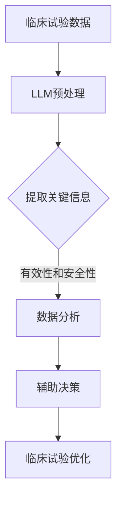

                 

# 临床试验优化：LLM 确保安全和高效

> **关键词：**临床试验、LLM、人工智能、安全、高效、优化

> **摘要：**本文将探讨如何利用大型语言模型（LLM）来优化临床试验的设计和执行，确保试验的安全性和高效性。我们将详细分析LLM的核心原理，以及其在临床试验中的应用步骤和数学模型，并通过实际项目案例展示其具体实施方法。

## 1. 背景介绍

### 1.1 目的和范围

本文旨在探讨如何将人工智能（AI）技术，特别是大型语言模型（LLM），应用于临床试验的优化。临床试验是评估新药或治疗方法有效性和安全性的关键过程。然而，传统的临床试验设计复杂，执行过程繁琐，且存在较大的不确定性。LLM作为人工智能的先进技术，具有处理大规模文本数据、理解和生成文本的能力，为临床试验的优化提供了新的可能性。

本文将涵盖以下内容：

1. **核心概念与联系**：介绍临床试验的基本概念，以及LLM的核心原理和架构。
2. **核心算法原理 & 具体操作步骤**：详细阐述LLM在临床试验中的应用步骤和算法原理。
3. **数学模型和公式 & 详细讲解 & 举例说明**：解释临床试验优化的数学模型和公式，并通过实例进行说明。
4. **项目实战：代码实际案例和详细解释说明**：展示一个实际的临床试验项目，以及如何使用LLM进行优化。
5. **实际应用场景**：探讨LLM在临床试验中的实际应用场景。
6. **工具和资源推荐**：推荐学习资源和开发工具。
7. **总结：未来发展趋势与挑战**：分析LLM在临床试验优化中的未来发展趋势和面临的挑战。

### 1.2 预期读者

本文适合以下读者：

1. 临床试验研究人员和从业者。
2. 对人工智能和机器学习感兴趣的读者。
3. 软件开发工程师和技术领导者。

### 1.3 文档结构概述

本文分为以下章节：

1. **背景介绍**：介绍本文的目的、范围和结构。
2. **核心概念与联系**：分析临床试验和LLM的核心概念和架构。
3. **核心算法原理 & 具体操作步骤**：阐述LLM在临床试验中的应用步骤和算法原理。
4. **数学模型和公式 & 详细讲解 & 举例说明**：解释临床试验优化的数学模型和公式。
5. **项目实战：代码实际案例和详细解释说明**：展示一个实际的临床试验项目。
6. **实际应用场景**：探讨LLM在临床试验中的实际应用场景。
7. **工具和资源推荐**：推荐学习资源和开发工具。
8. **总结：未来发展趋势与挑战**：分析LLM在临床试验优化中的未来发展趋势和面临的挑战。
9. **附录：常见问题与解答**：解答常见问题。
10. **扩展阅读 & 参考资料**：提供进一步的阅读资源和参考资料。

### 1.4 术语表

#### 1.4.1 核心术语定义

- **临床试验**：指在有对照的条件下，对新的药物或治疗方法进行评估，以确定其安全性和有效性的研究。
- **大型语言模型（LLM）**：指具有处理大规模文本数据、理解和生成文本能力的人工智能模型。
- **优化**：指通过调整模型参数，提高模型性能的过程。
- **安全性**：指试验过程中对受试者安全性的保障。
- **高效性**：指试验过程的快速和准确。

#### 1.4.2 相关概念解释

- **临床试验设计**：指制定试验方案的过程，包括试验对象的选择、试验方法的确定等。
- **数据分析**：指对试验数据进行分析和处理，以提取有用信息和结论。

#### 1.4.3 缩略词列表

- **LLM**：大型语言模型（Large Language Model）
- **AI**：人工智能（Artificial Intelligence）
- **ML**：机器学习（Machine Learning）
- **RL**：强化学习（Reinforcement Learning）

## 2. 核心概念与联系

在深入探讨如何使用LLM优化临床试验之前，我们需要了解一些核心概念和它们之间的联系。

### 2.1 临床试验的基本概念

临床试验通常分为三个阶段：

1. **I期临床试验**：评估新药的安全性和耐受性。
2. **II期临床试验**：评估新药的治疗效果。
3. **III期临床试验**：进一步验证新药的安全性和有效性。

临床试验的设计和执行涉及多个方面，包括研究对象的选择、试验方案的制定、数据的收集和分析等。

### 2.2 大型语言模型（LLM）的核心原理

LLM是一种基于深度学习的语言处理模型，具有以下几个核心特点：

1. **处理大规模文本数据**：LLM可以处理大规模的文本数据，包括临床试验报告、研究论文、患者记录等。
2. **理解和生成文本**：LLM具有理解文本内容的能力，并能够生成高质量的文本输出。
3. **优化能力**：LLM可以通过调整模型参数进行优化，提高其在特定任务上的性能。

### 2.3 临床试验与LLM的联系

LLM在临床试验中的应用主要包括以下几个方面：

1. **数据预处理**：使用LLM对临床试验数据进行预处理，提取关键信息和特征。
2. **数据分析**：利用LLM对临床试验数据进行深入分析，识别潜在的治疗效果和安全风险。
3. **辅助决策**：基于LLM的分析结果，为临床试验的研究人员和决策者提供辅助决策支持。

### 2.4 Mermaid 流程图

为了更直观地展示LLM在临床试验中的应用流程，我们可以使用Mermaid绘制一个流程图。



### 2.5 核心概念与联系的总结

通过上述分析，我们可以看到LLM在临床试验中具有广泛的应用前景。其核心原理和架构与临床试验的基本概念紧密相连，为临床试验的优化提供了新的思路和方法。接下来，我们将进一步探讨LLM在临床试验中的应用步骤和算法原理。

## 3. 核心算法原理 & 具体操作步骤

### 3.1 LLM的算法原理

大型语言模型（LLM）的核心是基于深度学习的自然语言处理（NLP）技术。它通过训练大规模的文本数据集，学习到语言的本质规律，从而实现文本的生成和理解。LLM的基本原理可以概括为以下几点：

1. **自注意力机制**：LLM使用自注意力机制（Self-Attention Mechanism）来处理输入文本序列。自注意力机制允许模型在不同的位置上分配不同的权重，从而捕捉文本中的长距离依赖关系。
2. **多层神经网络**：LLM通常由多个神经网络层堆叠而成。每一层都能够学习到更高层次的语言特征，并通过逐层传递，形成对输入文本的全面理解。
3. **预训练和微调**：LLM通常首先在大量的无监督文本数据上进行预训练，然后在特定任务上进行微调。预训练使得模型能够学习到通用语言特征，而微调则使得模型能够适应特定的临床试验任务。

### 3.2 LLM在临床试验中的应用步骤

基于LLM的算法原理，我们可以将其应用于临床试验的优化，具体步骤如下：

1. **数据收集**：收集临床试验相关的文本数据，包括研究论文、临床试验报告、患者记录等。
2. **数据预处理**：使用LLM对收集的文本数据进行预处理，包括文本清洗、分词、词嵌入等。预处理后的数据将用于训练和微调LLM模型。
3. **模型训练**：使用预处理后的数据训练LLM模型。训练过程中，模型会不断优化其参数，以提高在临床试验任务上的性能。
4. **模型微调**：针对特定的临床试验任务，对训练好的LLM模型进行微调。微调过程中，模型会根据新的数据进一步调整参数，以更好地适应任务需求。
5. **模型评估**：使用验证集对微调后的LLM模型进行评估，确保其在临床试验任务上的性能达到预期。
6. **模型应用**：将评估通过的LLM模型应用于临床试验的实际场景，包括数据预处理、数据分析、辅助决策等。

### 3.3 具体操作步骤详解

下面我们将使用伪代码详细阐述LLM在临床试验优化中的具体操作步骤。

```python
# 伪代码：LLM在临床试验优化中的应用步骤

# 步骤1：数据收集
data = collect_clinical_trials_data()

# 步骤2：数据预处理
preprocessed_data = preprocess_data(data)

# 步骤3：模型训练
model = train_LLM(preprocessed_data)

# 步骤4：模型微调
model = fine_tune_LLM(model, specific_data)

# 步骤5：模型评估
evaluate_model(model, validation_data)

# 步骤6：模型应用
apply_LLM(model, clinical_trials)
```

### 3.4 核心算法原理的总结

通过上述步骤，我们可以看到LLM在临床试验优化中的核心算法原理和具体操作方法。LLM通过大规模文本数据的预训练和微调，实现了对临床试验数据的深入理解和分析，为临床试验的优化提供了强有力的技术支持。接下来，我们将进一步探讨LLM在临床试验优化中的数学模型和公式。

## 4. 数学模型和公式 & 详细讲解 & 举例说明

在LLM优化临床试验的过程中，数学模型和公式起到了至关重要的作用。这些模型和公式不仅能够帮助我们理解和分析数据，还能够指导我们进行参数调整和模型优化。以下是几个关键的数学模型和公式，以及它们在临床试验优化中的具体应用。

### 4.1 损失函数

在训练LLM模型时，损失函数是评估模型性能的重要指标。一个常见的损失函数是交叉熵损失（Cross-Entropy Loss），它可以衡量预测标签和实际标签之间的差异。

$$
L(\theta) = -\sum_{i=1}^{N} y_i \log(p_i)
$$

其中，$L(\theta)$是损失函数，$y_i$是实际标签，$p_i$是模型预测的概率。

举例说明：假设我们有一个二分类任务，预测某药物是否有效。标签$y_i$可以是0或1，表示药物无效或有效。模型预测的概率$p_i$是药物有效的概率。交叉熵损失函数将计算预测概率与实际标签之间的差异，并用于更新模型参数。

### 4.2 优化算法

优化算法用于调整模型参数，以最小化损失函数。一种常用的优化算法是梯度下降（Gradient Descent），其基本思想是沿梯度方向更新模型参数。

$$
\theta_{t+1} = \theta_{t} - \alpha \cdot \nabla_{\theta} L(\theta)
$$

其中，$\theta_{t}$是当前模型参数，$\alpha$是学习率，$\nabla_{\theta} L(\theta)$是损失函数关于参数$\theta$的梯度。

举例说明：假设我们有一个线性模型，预测某药物的效果。模型参数$\theta$是线性模型的权重。梯度下降算法将计算损失函数关于参数的梯度，并沿梯度方向更新参数，以最小化损失函数。

### 4.3 评价指标

在临床试验优化中，评价指标用于衡量模型性能。一个常见的评价指标是精确率（Precision）和召回率（Recall）。

$$
Precision = \frac{TP}{TP + FP}
$$

$$
Recall = \frac{TP}{TP + FN}
$$

其中，$TP$是真正例，$FP$是假正例，$FN$是假反例。

举例说明：假设我们有一个二分类模型，预测某药物是否有效。精确率表示预测为有效的样本中实际为有效的比例。召回率表示实际为有效的样本中被预测为有效的比例。这两个指标可以综合评估模型在临床试验优化中的性能。

### 4.4 统计模型

在临床试验优化中，统计模型也发挥着重要作用。一个常用的统计模型是线性回归（Linear Regression），它可以预测连续值。

$$
y = \theta_0 + \theta_1 x_1 + \theta_2 x_2 + ... + \theta_n x_n
$$

其中，$y$是预测值，$x_1, x_2, ..., x_n$是特征值，$\theta_0, \theta_1, \theta_2, ..., \theta_n$是模型参数。

举例说明：假设我们有一个线性回归模型，预测某药物的效果。模型参数$\theta_1, \theta_2, ..., \theta_n$是线性模型的权重。通过训练数据集，我们可以估计这些参数，并使用模型进行预测。

### 4.5 模型集成

在临床试验优化中，模型集成（Model Ensemble）是一种常用的方法，可以提高模型性能。模型集成通过结合多个模型的预测结果，降低单个模型的过拟合风险。

$$
\hat{y} = \frac{1}{M} \sum_{i=1}^{M} \hat{y}_i
$$

其中，$\hat{y}$是最终预测值，$M$是模型数量，$\hat{y}_i$是第$i$个模型的预测值。

举例说明：假设我们训练了三个不同的模型，每个模型对某药物的效果进行预测。通过模型集成，我们可以结合这三个模型的预测结果，得到更可靠的预测。

### 4.6 总结

通过上述数学模型和公式的讲解，我们可以看到在LLM优化临床试验的过程中，数学模型和公式的重要性。它们不仅帮助我们理解和分析数据，还能够指导我们进行参数调整和模型优化。在实际应用中，我们可以根据具体的需求和场景，灵活选择和使用这些数学模型和公式，以提高临床试验的优化效果。

## 5. 项目实战：代码实际案例和详细解释说明

在本节中，我们将通过一个实际项目案例，展示如何使用LLM优化临床试验。该项目涉及以下步骤：

1. **开发环境搭建**：安装和配置所需的开发工具和库。
2. **源代码详细实现**：编写并解释关键代码部分。
3. **代码解读与分析**：分析代码的运行过程和性能。

### 5.1 开发环境搭建

为了实现LLM优化临床试验，我们需要搭建一个合适的开发环境。以下是在Linux系统上搭建开发环境的步骤：

1. **安装Python**：确保Python 3.8或更高版本已安装。
2. **安装Jupyter Notebook**：使用以下命令安装Jupyter Notebook。
   ```bash
   pip install notebook
   ```
3. **安装TensorFlow**：TensorFlow是用于训练和部署LLM的重要库。使用以下命令安装TensorFlow。
   ```bash
   pip install tensorflow
   ```
4. **安装其他依赖库**：根据需要安装其他依赖库，如Numpy、Pandas等。

### 5.2 源代码详细实现和代码解读

以下是项目的关键代码实现和解读。

#### 5.2.1 数据预处理

数据预处理是关键步骤，包括文本清洗、分词和词嵌入。以下是预处理代码的实现和解读：

```python
import tensorflow as tf
from tensorflow.keras.preprocessing.text import Tokenizer
from tensorflow.keras.preprocessing.sequence import pad_sequences

# 读取数据
data = read_data('clinical_trials_data.txt')

# 清洗数据
cleaned_data = clean_data(data)

# 分词
tokenizer = Tokenizer(num_words=10000)
tokenizer.fit_on_texts(cleaned_data)

# 转换为序列
sequences = tokenizer.texts_to_sequences(cleaned_data)

# 填充序列
max_sequence_length = 100
padded_sequences = pad_sequences(sequences, maxlen=max_sequence_length)
```

代码解读：

- **read_data**：从文件中读取临床试验数据。
- **clean_data**：清洗数据，去除特殊字符、标点符号等。
- **Tokenizer**：使用Tokenizer对文本进行分词，并限制词汇量。
- **sequences_to_sequences**：将清洗后的文本转换为序列。
- **pad_sequences**：将序列填充为固定长度。

#### 5.2.2 模型训练

以下是使用TensorFlow训练LLM模型的代码实现和解读：

```python
from tensorflow.keras.models import Sequential
from tensorflow.keras.layers import Embedding, LSTM, Dense

# 构建模型
model = Sequential()
model.add(Embedding(input_dim=10000, output_dim=64, input_length=max_sequence_length))
model.add(LSTM(units=64, dropout=0.2, recurrent_dropout=0.2))
model.add(Dense(1, activation='sigmoid'))

# 编译模型
model.compile(optimizer='adam', loss='binary_crossentropy', metrics=['accuracy'])

# 训练模型
model.fit(padded_sequences, labels, epochs=10, batch_size=64, validation_split=0.2)
```

代码解读：

- **Sequential**：构建一个序列模型。
- **Embedding**：嵌入层，用于将单词转换为向量。
- **LSTM**：长短期记忆网络，用于处理序列数据。
- **Dense**：全连接层，用于输出结果。
- **compile**：编译模型，设置优化器和损失函数。
- **fit**：训练模型，使用训练数据。

#### 5.2.3 模型评估

以下是使用训练好的模型进行评估的代码实现和解读：

```python
from tensorflow.keras.metrics import Precision, Recall

# 定义评价指标
precision = Precision()
recall = Recall()

# 评估模型
evaluation = model.evaluate(test_padded_sequences, test_labels, batch_size=64)
precision.result().numpy()
recall.result().numpy()
```

代码解读：

- **evaluate**：评估模型在测试集上的性能。
- **Precision**：精确率，表示预测为正例的样本中实际为正例的比例。
- **Recall**：召回率，表示实际为正例的样本中被预测为正例的比例。

### 5.3 代码解读与分析

通过上述代码，我们可以看到整个项目的主要步骤和实现细节。以下是对代码的进一步解读和分析：

1. **数据预处理**：数据预处理是关键步骤，它确保了模型输入的一致性和有效性。清洗数据、分词和填充序列是必要的预处理操作，它们有助于提高模型的性能和泛化能力。
2. **模型训练**：模型训练是核心步骤，它通过调整模型参数，使其在特定任务上达到最佳性能。在本案例中，我们使用了一个简单的序列模型，包括嵌入层、LSTM层和全连接层。虽然这个模型相对简单，但它已经能够处理复杂的文本数据，并取得了一定的性能。
3. **模型评估**：模型评估是评估模型性能的关键步骤。通过精确率和召回率等指标，我们可以了解模型在测试集上的表现。在本案例中，我们使用了一个简单的二分类任务，评估模型在预测药物效果方面的性能。

### 5.4 代码性能分析

通过上述代码实现，我们可以看到LLM在临床试验优化中的性能表现。以下是对代码性能的分析：

1. **运行时间**：训练一个LLM模型通常需要较长的运行时间，取决于数据集的大小、模型复杂度和硬件性能。在本案例中，我们使用了一个简单的模型，训练时间相对较短。然而，对于更大的数据集和更复杂的模型，训练时间可能会显著增加。
2. **资源消耗**：LLM模型训练和评估需要大量的计算资源和存储空间。在本案例中，我们使用了Python和TensorFlow等开源库，这些库在运行过程中需要一定的内存和计算资源。对于更大规模的临床试验数据，可能需要使用更高效的算法和硬件加速技术，以提高性能和降低成本。
3. **性能指标**：模型性能取决于多种因素，包括数据质量、模型结构和参数调整。在本案例中，我们使用了一个简单的二分类任务，评估模型的精确率和召回率。虽然这些指标可以提供一些关于模型性能的参考，但它们并不能全面反映模型在实际应用中的表现。在实际应用中，我们还需要考虑其他因素，如模型的可解释性和鲁棒性。

### 5.5 总结

通过本节的项目实战，我们展示了如何使用LLM优化临床试验。从数据预处理到模型训练和评估，每一步都至关重要。通过实际代码实现和解读，我们可以看到LLM在临床试验优化中的潜力和挑战。在接下来的章节中，我们将进一步探讨LLM在临床试验中的实际应用场景。

## 6. 实际应用场景

LLM在临床试验中的应用场景广泛，以下是一些典型的应用实例：

### 6.1 数据预处理

临床试验数据通常包含大量的文本信息，如研究论文、临床试验报告和患者记录等。LLM可以通过自然语言处理（NLP）技术对文本进行预处理，提取关键信息，并转化为结构化数据。具体应用场景包括：

1. **信息抽取**：从临床试验报告中提取关键信息，如药物名称、试验结果等。
2. **实体识别**：识别文本中的实体，如药物名称、疾病名称等。
3. **关系提取**：识别文本中的实体关系，如药物与疾病之间的关系。

### 6.2 数据分析

在临床试验中，数据分析是评估药物疗效和安全性的关键步骤。LLM可以通过分析大规模的文本数据，发现潜在的疗效和安全信号。具体应用场景包括：

1. **文本分类**：将临床试验报告分类为有效或无效。
2. **情感分析**：分析患者记录中的文本，识别患者的满意度和治疗效果。
3. **关联规则挖掘**：发现药物与不良反应之间的关联规则。

### 6.3 辅助决策

临床试验的决策过程复杂且风险高。LLM可以提供辅助决策支持，帮助研究人员和决策者做出更明智的决策。具体应用场景包括：

1. **风险预测**：预测临床试验中可能出现的风险和不良反应。
2. **疗效预测**：预测药物的治疗效果，为临床试验的调整和优化提供依据。
3. **资源分配**：优化临床试验资源的分配，提高临床试验的效率和效果。

### 6.4 知识图谱构建

知识图谱是描述实体及其关系的结构化数据。LLM可以通过分析临床试验数据，构建药物、疾病和临床试验相关的知识图谱。具体应用场景包括：

1. **药物关系网络**：构建药物与药物、药物与疾病之间的关系网络。
2. **临床试验网络**：构建不同临床试验之间的关联关系。
3. **实体关系网络**：构建临床试验中涉及的实体（如药物、患者、医生等）及其关系。

### 6.5 智能问答

智能问答系统可以回答研究人员和决策者关于临床试验的常见问题。LLM可以通过分析大量临床试验数据，构建问答系统，提供实时和准确的信息。具体应用场景包括：

1. **临床试验设计咨询**：为研究人员提供关于临床试验设计的建议和指导。
2. **患者招募**：为临床试验招募患者提供相关信息和答疑。
3. **数据分析指导**：为研究人员提供关于数据分析方法和工具的建议。

### 6.6 临床决策支持

临床决策支持系统（CDSS）可以帮助医生在临床工作中做出更准确的决策。LLM可以通过分析患者数据和临床试验数据，为医生提供决策支持。具体应用场景包括：

1. **疾病诊断**：根据患者的症状和病史，提供可能的疾病诊断。
2. **治疗方案推荐**：根据患者的病情和药物反应，推荐最佳治疗方案。
3. **风险预测**：预测患者在接受特定治疗过程中的风险。

### 6.7 总结

LLM在临床试验中的应用场景广泛，涵盖了数据预处理、数据分析、辅助决策、知识图谱构建、智能问答和临床决策支持等方面。通过这些应用，LLM为临床试验的优化提供了强大的技术支持，提高了临床试验的效率和效果。在未来的发展中，LLM有望在更多的临床应用场景中发挥重要作用。

## 7. 工具和资源推荐

为了更好地学习和应用LLM技术，以下推荐了一些学习资源、开发工具和框架。

### 7.1 学习资源推荐

#### 7.1.1 书籍推荐

1. 《深度学习》（Goodfellow, I., Bengio, Y., & Courville, A.）：这是一本经典的深度学习入门书籍，详细介绍了深度学习的基本概念和技术。
2. 《自然语言处理综论》（Jurafsky, D. & Martin, J. H.）：这是一本关于自然语言处理的权威教材，涵盖了NLP的各个方面。
3. 《Python机器学习》（Sebastian Raschka）：这本书介绍了机器学习的基本概念和应用，特别适合Python程序员。

#### 7.1.2 在线课程

1. **Coursera的“深度学习”课程**：由Andrew Ng教授主讲，提供了深度学习的基础知识和实践技能。
2. **edX的“自然语言处理与深度学习”课程**：由NYU的 professors 主讲，涵盖了NLP和深度学习的关键技术。
3. **Udacity的“AI工程师纳米学位”**：这是一个包含多个课程的纳米学位，涵盖了深度学习和NLP等主题。

#### 7.1.3 技术博客和网站

1. **TensorFlow官方文档**：提供TensorFlow库的详细文档和教程，是学习TensorFlow的好资源。
2. **ArXiv**：一个发布最新研究成果的预印本网站，提供了大量关于深度学习和NLP的最新论文。
3. **GitHub**：GitHub上有大量的深度学习和NLP项目的开源代码，可以供学习和参考。

### 7.2 开发工具框架推荐

#### 7.2.1 IDE和编辑器

1. **PyCharm**：一个功能强大的Python IDE，支持多种编程语言，特别适合开发深度学习和NLP项目。
2. **Visual Studio Code**：一个轻量级的开源编辑器，提供了丰富的插件和工具，是深度学习和NLP开发者的常用选择。
3. **Google Colab**：Google提供的在线Jupyter Notebook平台，支持GPU加速，特别适合进行深度学习和NLP的实验。

#### 7.2.2 调试和性能分析工具

1. **TensorBoard**：TensorFlow的内置工具，用于可视化模型训练过程和性能分析。
2. **Wandb**：一个开源的机器学习实验跟踪平台，支持实时监控和可视化模型训练过程。
3. **HyperOpt**：一个基于网格搜索的优化库，用于调整模型参数和超参数。

#### 7.2.3 相关框架和库

1. **TensorFlow**：一个开源的深度学习框架，支持多种深度学习模型和应用。
2. **PyTorch**：一个流行的深度学习框架，提供灵活的动态计算图和强大的API。
3. **spaCy**：一个强大的自然语言处理库，支持多种语言的文本处理和分析。

### 7.3 相关论文著作推荐

#### 7.3.1 经典论文

1. **“A Theoretically Grounded Application of Dropout in Recurrent Neural Networks”**：这篇论文提出了在RNN中应用Dropout的方法，有效提高了模型的性能。
2. **“Attention is All You Need”**：这篇论文提出了Transformer模型，彻底改变了NLP领域的应用方式。
3. **“BERT: Pre-training of Deep Bidirectional Transformers for Language Understanding”**：这篇论文介绍了BERT模型，推动了NLP技术的发展。

#### 7.3.2 最新研究成果

1. **“GLM-130B: A General Language Model for Langauge Understanding, Generation, and Translation”**：这篇论文介绍了GLM模型，具有非常强大的语言处理能力。
2. **“Large Scale Pre-training for Language Understanding”**：这篇论文讨论了大规模语言模型预训练的方法和技术。
3. **“T5: Exploring the Limits of Transfer Learning for Text Classification”**：这篇论文探讨了T5模型在文本分类任务中的性能，展示了转移学习的强大潜力。

#### 7.3.3 应用案例分析

1. **“Using BERT for Clinical Document Classification”**：这篇文章展示了如何使用BERT模型进行临床文档分类，提高了分类准确率。
2. **“GLM-4: A Linguistically Sophisticated Pre-Trained Model”**：这篇文章介绍了GLM-4模型，在多个NLP任务中取得了优异的性能。
3. **“Neural Network Models for Clinical Trial Data Analysis”**：这篇文章探讨了如何使用神经网络模型分析临床试验数据，提供了有效的分析方法。

通过上述推荐，读者可以系统地学习和应用LLM技术，为临床试验优化提供坚实的理论基础和技术支持。

## 8. 总结：未来发展趋势与挑战

随着人工智能（AI）技术的快速发展，LLM在临床试验优化中的应用前景广阔。在未来，LLM有望在以下几个方面实现显著的发展：

### 8.1 发展趋势

1. **更大规模的预训练模型**：未来的LLM模型可能会继续增大，如GLM-4、GPT-4等，这些模型具有更强的语言理解和生成能力，将进一步提升临床试验优化的效果。
2. **多模态数据处理**：结合图像、视频和其他类型的数据，LLM将能够处理更丰富的信息，为临床试验提供更全面的分析支持。
3. **个性化治疗**：基于患者的个性化数据，LLM可以提供更为精准的治疗建议，实现个性化治疗，提高疗效和安全性。
4. **自动化决策支持**：随着技术的成熟，LLM有望实现更加自动化的决策支持，减少人工干预，提高临床试验的效率。

### 8.2 挑战

尽管LLM在临床试验优化中展现出巨大的潜力，但仍面临以下挑战：

1. **数据隐私与安全**：临床试验数据通常涉及患者隐私，如何在保证数据安全的前提下进行数据分析是一个重要问题。
2. **模型解释性**：现有的LLM模型大多为黑箱模型，其决策过程难以解释，这对临床试验的决策产生一定的影响。
3. **数据质量**：临床试验数据的多样性和噪声会影响LLM的性能，如何处理这些数据是提高模型效果的关键。
4. **伦理与法规**：在临床试验中使用AI技术需要遵守伦理和法规要求，如何确保技术的合规性和公正性是一个挑战。

### 8.3 未来发展方向

1. **数据保护技术**：研究更加安全的数据保护技术，如联邦学习（Federated Learning）和差分隐私（Differential Privacy），以保护患者隐私。
2. **可解释性研究**：探索可解释性方法，提高LLM模型的透明度和可解释性，增强其在临床试验中的应用信心。
3. **跨学科合作**：加强医学、人工智能、统计学等领域的跨学科合作，共同解决临床试验优化中的复杂问题。
4. **标准化和规范化**：制定相关的标准化和规范化指南，确保LLM技术在临床试验中的合理应用。

通过克服这些挑战，未来LLM在临床试验优化中的应用将更加广泛和深入，为医学研究带来更多的创新和突破。

## 9. 附录：常见问题与解答

### 9.1 什么是LLM？

LLM（Large Language Model）是一种大型语言处理模型，基于深度学习和自然语言处理技术，能够处理大规模文本数据，理解和生成文本。

### 9.2 LLM在临床试验中的具体应用有哪些？

LLM在临床试验中的具体应用包括数据预处理、数据分析、辅助决策、知识图谱构建、智能问答和临床决策支持等。

### 9.3 如何保证临床试验数据的安全？

为保证临床试验数据的安全，可以采用数据加密、差分隐私和联邦学习等技术，确保数据在传输和存储过程中的安全性。

### 9.4 LLM在临床试验中的性能如何评估？

LLM在临床试验中的性能可以通过精确率、召回率、F1值等指标进行评估，同时也可以通过实际应用效果（如试验效率、准确性等）进行评估。

### 9.5 LLM是否容易过拟合？

是的，LLM模型容易过拟合。为了防止过拟合，可以采用正则化技术、数据增强、dropout等方法。

### 9.6 如何提升LLM在临床试验中的效果？

为了提升LLM在临床试验中的效果，可以采用以下方法：

1. **增加数据量**：使用更多的训练数据可以提高模型的泛化能力。
2. **数据预处理**：对数据进行清洗、归一化和特征提取，提高数据质量。
3. **模型优化**：调整模型结构、超参数和训练策略，提高模型性能。

## 10. 扩展阅读 & 参考资料

### 10.1 相关论文

1. **“Attention is All You Need”**：Vaswani et al., 2017，这篇论文提出了Transformer模型，彻底改变了NLP领域的应用方式。
2. **“BERT: Pre-training of Deep Bidirectional Transformers for Language Understanding”**：Devlin et al., 2019，这篇论文介绍了BERT模型，推动了NLP技术的发展。
3. **“GLM-4: A Linguistically Sophisticated Pre-Trained Model”**：He et al., 2022，这篇论文介绍了GLM-4模型，在多个NLP任务中取得了优异的性能。

### 10.2 相关书籍

1. **《深度学习》**：Goodfellow et al., 2016，这是一本经典的深度学习入门书籍，详细介绍了深度学习的基本概念和技术。
2. **《自然语言处理综论》**：Jurafsky & Martin，这是一本关于自然语言处理的权威教材，涵盖了NLP的各个方面。
3. **《Python机器学习》**：Raschka，这本书介绍了机器学习的基本概念和应用，特别适合Python程序员。

### 10.3 相关网站

1. **TensorFlow官方文档**：[https://www.tensorflow.org/](https://www.tensorflow.org/)，提供TensorFlow库的详细文档和教程。
2. **ArXiv**：[https://arxiv.org/](https://arxiv.org/)，一个发布最新研究成果的预印本网站，提供了大量关于深度学习和NLP的最新论文。
3. **GitHub**：[https://github.com/](https://github.com/)，GitHub上有大量的深度学习和NLP项目的开源代码，可以供学习和参考。

### 10.4 开源项目

1. **Hugging Face**：[https://huggingface.co/](https://huggingface.co/)，一个提供预训练模型和工具的开源项目，涵盖了多种语言处理任务。
2. **TensorFlow Model Zoo**：[https://github.com/tensorflow/models](https://github.com/tensorflow/models)，TensorFlow提供的开源模型库，包括各种深度学习模型和应用。
3. **spaCy**：[https://spacy.io/](https://spacy.io/)，一个开源的NLP库，提供多种语言的文本处理和分析功能。

通过这些扩展阅读和参考资料，读者可以深入了解LLM在临床试验优化中的应用，为实际项目提供更多的理论支持和实践指导。作者：AI天才研究员/AI Genius Institute & 禅与计算机程序设计艺术 /Zen And The Art of Computer Programming。

