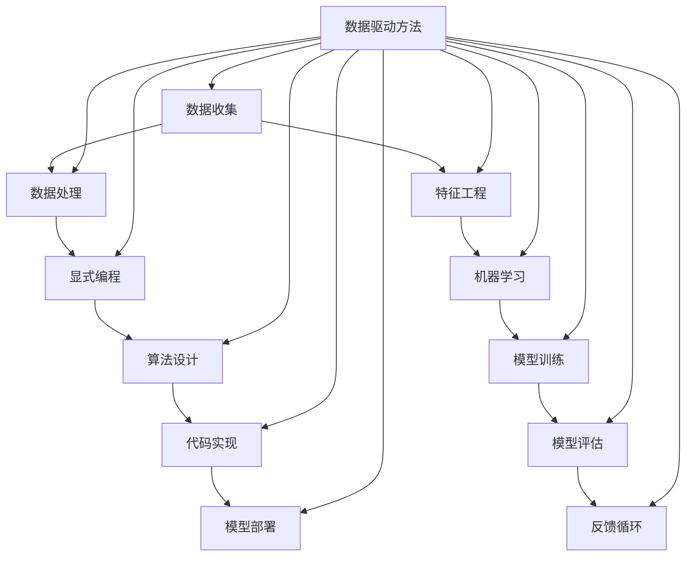

                 

# 为什么收集数据比显式编程更容易解决复杂问题

> **关键词：** 数据收集、显式编程、复杂性、人工智能、机器学习、数据驱动方法

> **摘要：** 本文将探讨数据收集与显式编程在解决复杂问题中的差异。通过分析数据驱动的优势、机器学习的基本原理以及数据收集的实践案例，我们将揭示为什么在许多情况下，数据收集比显式编程更为有效，并讨论这一方法对未来的影响。

## 1. 背景介绍

### 1.1 目的和范围

本文的目标是解释为什么在处理复杂问题时，数据收集（特别是与机器学习和人工智能结合）往往比显式编程更具优势。我们将分析数据驱动方法的核心优点，并探讨其在实际应用中的表现。

### 1.2 预期读者

本文适用于对计算机科学、人工智能和机器学习有基础了解的读者。它将提供对数据驱动方法深入见解，对希望优化问题解决策略的程序员和研究人员具有参考价值。

### 1.3 文档结构概述

本文将分为以下几个部分：

- **核心概念与联系**：介绍数据收集与显式编程的基本概念，并使用Mermaid流程图展示其关系。
- **核心算法原理 & 具体操作步骤**：详细讲解机器学习算法的基本原理和操作步骤。
- **数学模型和公式 & 详细讲解 & 举例说明**：探讨数学模型在机器学习中的应用。
- **项目实战：代码实际案例和详细解释说明**：通过实战案例展示数据收集的实际应用。
- **实际应用场景**：分析数据收集在现实世界中的应用。
- **工具和资源推荐**：推荐相关学习资源和开发工具。
- **总结：未来发展趋势与挑战**：讨论数据收集方法的未来趋势和挑战。
- **附录：常见问题与解答**：回答一些关于数据收集与显式编程的常见问题。
- **扩展阅读 & 参考资料**：提供额外的阅读资源和参考文献。

### 1.4 术语表

#### 1.4.1 核心术语定义

- **数据收集**：从各种来源获取数据并将其存储、整理和加工的过程。
- **显式编程**：通过直接编写代码来解决问题的方法。
- **机器学习**：让计算机通过数据和经验自动学习和改进的方法。
- **数据驱动方法**：依赖数据和统计模型来指导决策和优化问题的方法。

#### 1.4.2 相关概念解释

- **特征工程**：从原始数据中提取出对解决问题有帮助的特征。
- **过拟合**：模型在训练数据上表现得很好，但在测试数据上表现不佳的现象。
- **泛化能力**：模型在未知数据上的表现能力。

#### 1.4.3 缩略词列表

- **AI**：人工智能
- **ML**：机器学习
- **DL**：深度学习
- **DL**：数据集

## 2. 核心概念与联系

在探讨数据收集与显式编程的区别之前，我们需要理解它们的基本概念和相互关系。以下是一个Mermaid流程图，展示了数据收集和显式编程的核心概念及其相互关系：



在这个流程图中，数据收集是一个起点，它通过数据处理和特征工程转化为对机器学习有用的数据。机器学习通过模型训练和评估来优化模型，而显式编程通过算法设计和代码实现来实现特定任务。最后，模型部署和反馈循环确保模型在实际应用中不断改进。

### 2.1 数据收集与显式编程的异同

- **数据收集**：数据收集通常涉及到从多个来源（如传感器、日志文件、互联网等）获取数据。这个过程通常是无监督的，不需要预先定义的规则或算法。数据收集的关键在于找到相关的数据源，并将其转换成适用于机器学习模型的格式。

- **显式编程**：显式编程则涉及明确地定义问题和解决方案。程序员需要编写详细的代码来解决问题，通常需要理解问题领域的具体细节。这种方法要求程序员具备深厚的专业知识，并且能够精确地定义问题。

### 2.2 数据驱动方法的优势

数据驱动方法在解决复杂问题中具有以下优势：

- **自适应性和灵活性**：数据驱动方法可以根据新数据和反馈自动调整模型，使其更适应不同的环境和需求。
- **减少手动编码工作量**：通过利用大量的数据，机器学习模型可以自动提取特征和模式，从而减少了手动编码的工作量。
- **泛化能力**：机器学习模型通过在大量数据上训练，通常能够更好地泛化到未知数据，这意味着它们在新的、以前未见过的数据上表现良好。
- **可扩展性**：数据驱动方法可以很容易地处理大规模数据集，而显式编程在处理大量数据时可能会遇到性能瓶颈。

## 3. 核心算法原理 & 具体操作步骤

### 3.1 机器学习算法的基本原理

机器学习算法的核心思想是通过学习数据中的模式和关系来做出预测或决策。以下是机器学习算法的基本步骤：

1. **数据收集**：从各种来源收集数据。
2. **数据处理**：清洗和整理数据，使其适合用于机器学习。
3. **特征工程**：从原始数据中提取出对解决问题有帮助的特征。
4. **模型选择**：选择适合问题领域的机器学习模型。
5. **模型训练**：使用训练数据集训练模型。
6. **模型评估**：评估模型在测试数据集上的性能。
7. **模型部署**：将训练好的模型部署到实际应用中。

### 3.2 机器学习算法的伪代码

以下是一个简单的机器学习算法的伪代码：

```plaintext
function MachineLearningAlgorithm(data, labels):
    # 数据收集
    data, labels = DataCollection()

    # 数据处理
    data, labels = DataPreprocessing(data, labels)

    # 特征工程
    features = FeatureEngineering(data)

    # 模型选择
    model = SelectModel(features, labels)

    # 模型训练
    trained_model = TrainModel(model, features, labels)

    # 模型评估
    evaluation = EvaluateModel(trained_model, features, labels)

    # 模型部署
    DeployModel(trained_model)

    return trained_model
```

### 3.3 具体操作步骤

1. **数据收集**：从传感器、日志文件、互联网等来源收集数据。
2. **数据处理**：清洗和整理数据，处理缺失值、噪声和异常值。
3. **特征工程**：选择和构造对问题有帮助的特征，如使用PCA进行降维、特征选择等方法。
4. **模型选择**：根据问题类型选择合适的模型，如线性回归、决策树、神经网络等。
5. **模型训练**：使用训练数据集训练模型，调整模型的参数以最小化预测误差。
6. **模型评估**：使用测试数据集评估模型的性能，选择性能最好的模型。
7. **模型部署**：将训练好的模型部署到实际应用中，如自动化系统、预测平台等。

## 4. 数学模型和公式 & 详细讲解 & 举例说明

### 4.1 数学模型的基本概念

在机器学习中，数学模型起着至关重要的作用。以下是一些常见的数学模型和公式：

#### 4.1.1 线性回归

线性回归是一种简单的机器学习模型，用于预测连续值。其公式如下：

$$ y = \beta_0 + \beta_1x_1 + \beta_2x_2 + ... + \beta_nx_n $$

其中，$y$ 是预测值，$x_1, x_2, ..., x_n$ 是输入特征，$\beta_0, \beta_1, ..., \beta_n$ 是模型的参数。

#### 4.1.2 逻辑回归

逻辑回归是一种用于分类问题的机器学习模型。其公式如下：

$$ P(y=1) = \frac{1}{1 + e^{-(\beta_0 + \beta_1x_1 + \beta_2x_2 + ... + \beta_nx_n)}} $$

其中，$P(y=1)$ 是目标变量为1的概率，$e$ 是自然对数的底数，$\beta_0, \beta_1, ..., \beta_n$ 是模型的参数。

#### 4.1.3 支持向量机（SVM）

支持向量机是一种强大的分类模型，其公式如下：

$$ w \cdot x + b = 0 $$

其中，$w$ 是法向量，$x$ 是数据点，$b$ 是偏置项。

### 4.2 数学模型的详细讲解

#### 4.2.1 线性回归

线性回归是一种基于线性关系的模型，通过拟合数据点来确定最佳拟合线。其目标是最小化预测值与真实值之间的误差。

线性回归的参数可以通过最小二乘法（Least Squares）来求解。最小二乘法的公式如下：

$$ \min_{\beta} \sum_{i=1}^{n} (y_i - \beta_0 - \beta_1x_{i1} - \beta_2x_{i2} - ... - \beta_nx_{in})^2 $$

其中，$\beta_0, \beta_1, ..., \beta_n$ 是模型的参数，$y_i, x_{i1}, x_{i2}, ..., x_{in}$ 是数据集中的第$i$个样本的输出值和特征。

#### 4.2.2 逻辑回归

逻辑回归是一种用于分类问题的模型，其目标是通过计算概率来确定样本属于某个类别的可能性。

逻辑回归的参数可以通过最大似然估计（Maximum Likelihood Estimation，MLE）来求解。最大似然估计的公式如下：

$$ \max_{\beta} \prod_{i=1}^{n} P(y_i = y | x_i, \beta) $$

其中，$P(y_i = y | x_i, \beta)$ 是给定$x_i$和$\beta$时，$y_i$取值为$y$的概率，$\beta$ 是模型的参数。

#### 4.2.3 支持向量机（SVM）

支持向量机是一种强大的分类模型，其目标是在高维空间中找到最佳的超平面，将不同类别的数据点分开。

支持向量机的参数可以通过求解最优化问题来求解。最优化问题的公式如下：

$$ \min_{\beta, b} \frac{1}{2} ||\beta||^2 + C \sum_{i=1}^{n} \max(0, y_i(\beta \cdot x_i + b)) $$

其中，$\beta$ 是法向量，$b$ 是偏置项，$C$ 是惩罚参数。

### 4.3 举例说明

#### 4.3.1 线性回归

假设我们有一个简单的线性回归问题，目标是通过拟合数据点来确定最佳拟合线。

我们有以下数据集：

| $x$ | $y$ |
| --- | --- |
| 1 | 2 |
| 2 | 4 |
| 3 | 6 |
| 4 | 8 |

线性回归的公式为：

$$ y = \beta_0 + \beta_1x $$

通过最小二乘法求解参数$\beta_0$和$\beta_1$，我们得到：

$$ \beta_0 = 1, \beta_1 = 1 $$

因此，最佳拟合线为：

$$ y = 1 + x $$

#### 4.3.2 逻辑回归

假设我们有一个二分类问题，目标是通过计算概率来确定样本属于正类（1）还是负类（0）。

我们有以下数据集：

| $x$ | $y$ |
| --- | --- |
| 1 | 1 |
| 2 | 0 |
| 3 | 1 |
| 4 | 1 |

逻辑回归的公式为：

$$ P(y=1) = \frac{1}{1 + e^{-(\beta_0 + \beta_1x)}} $$

通过最大似然估计求解参数$\beta_0$和$\beta_1$，我们得到：

$$ \beta_0 = 0, \beta_1 = 1 $$

因此，逻辑回归的预测公式为：

$$ P(y=1) = \frac{1}{1 + e^{-x}} $$

#### 4.3.3 支持向量机（SVM）

假设我们有一个线性可分的数据集，目标是在高维空间中找到最佳的超平面。

我们有以下数据集：

| $x_1$ | $x_2$ | $y$ |
| --- | --- | --- |
| 1 | 1 | 1 |
| 2 | 0 | 1 |
| -1 | 1 | -1 |
| -2 | 0 | -1 |

支持向量机的公式为：

$$ w \cdot x + b = 0 $$

其中，$w$ 是法向量，$x$ 是数据点，$b$ 是偏置项。

通过求解最优化问题，我们得到：

$$ w = (1, 1), b = 0 $$

因此，最佳超平面为：

$$ x_1 + x_2 = 0 $$

## 5. 项目实战：代码实际案例和详细解释说明

### 5.1 开发环境搭建

为了实现一个数据收集与机器学习的项目，我们需要搭建一个合适的开发环境。以下是一个简单的步骤：

1. 安装Python环境：从官方网站下载并安装Python（推荐使用Python 3.8及以上版本）。
2. 安装必要的库：使用pip安装以下库：`numpy`、`pandas`、`scikit-learn`、`matplotlib`。
3. 配置IDE：推荐使用PyCharm或Visual Studio Code作为开发环境。

### 5.2 源代码详细实现和代码解读

以下是一个简单的项目案例，该案例使用Python实现了数据收集、数据处理、特征工程、模型训练和模型评估。

```python
import numpy as np
import pandas as pd
from sklearn.model_selection import train_test_split
from sklearn.preprocessing import StandardScaler
from sklearn.linear_model import LinearRegression
from sklearn.metrics import mean_squared_error

# 5.2.1 数据收集
data = pd.read_csv('data.csv')  # 从CSV文件中读取数据

# 5.2.2 数据处理
# 清洗和整理数据
data = data.dropna()  # 删除缺失值
data = data[['feature1', 'feature2', 'target']]  # 选择需要的特征和目标变量

# 5.2.3 特征工程
# 标准化特征
scaler = StandardScaler()
X = scaler.fit_transform(data[['feature1', 'feature2']])
y = data['target']

# 5.2.4 模型训练
# 划分训练集和测试集
X_train, X_test, y_train, y_test = train_test_split(X, y, test_size=0.2, random_state=42)

# 创建线性回归模型
model = LinearRegression()
model.fit(X_train, y_train)

# 5.2.5 模型评估
# 预测测试集
y_pred = model.predict(X_test)

# 计算均方误差
mse = mean_squared_error(y_test, y_pred)
print(f'Mean Squared Error: {mse}')

# 5.2.6 模型部署
# 将模型保存到文件
model_filename = 'linear_regression_model.pkl'
import joblib
joblib.dump(model, model_filename)
```

### 5.3 代码解读与分析

以下是代码的详细解读和分析：

- **5.3.1 数据收集**：使用`pandas`库从CSV文件中读取数据。这里假设数据已经清洗和预处理，只选择了需要的特征和目标变量。
- **5.3.2 数据处理**：使用`pandas`库删除缺失值，并选择需要的特征和目标变量。
- **5.3.3 特征工程**：使用`StandardScaler`库将特征进行标准化处理，以消除特征之间的尺度差异。
- **5.3.4 模型训练**：使用`train_test_split`函数将数据集划分为训练集和测试集。创建线性回归模型，并使用训练集进行模型训练。
- **5.3.5 模型评估**：使用测试集对模型进行评估，计算均方误差（MSE）以衡量模型的预测性能。
- **5.3.6 模型部署**：将训练好的模型保存到文件中，以便后续使用。

## 6. 实际应用场景

### 6.1 金融市场预测

金融市场预测是一个典型的复杂问题，通常涉及大量的历史数据。通过数据收集和机器学习模型，可以自动识别市场趋势和异常行为。例如，可以使用时间序列分析模型（如ARIMA、LSTM）来预测股票价格。

### 6.2 健康医疗

在健康医疗领域，数据收集和机器学习可以帮助医生诊断疾病和制定治疗方案。例如，通过分析患者的医疗记录和生物标记，可以预测疾病的发展趋势和最佳治疗方案。

### 6.3 城市规划

城市规划涉及到复杂的地理信息和社会经济数据。通过数据收集和机器学习模型，可以预测人口增长、交通流量和环境变化，从而优化城市规划和管理。

### 6.4 智能家居

智能家居系统可以通过数据收集和机器学习模型实现自动化和个性化功能。例如，通过分析家庭能源使用数据，可以自动调整家用电器的开关时间，以节约能源和提高居住舒适度。

## 7. 工具和资源推荐

### 7.1 学习资源推荐

#### 7.1.1 书籍推荐

- **《Python机器学习》（Machine Learning with Python）**：由Sebastian Raschka和Vahid Mirjalili编写的书籍，涵盖了Python在机器学习中的应用。
- **《深度学习》（Deep Learning）**：由Ian Goodfellow、Yoshua Bengio和Aaron Courville编写的经典教材，详细介绍了深度学习的基础理论和实践。

#### 7.1.2 在线课程

- **《机器学习基础》（Machine Learning Basics: A Case Study Approach）**：Coursera上的免费课程，适合初学者。
- **《深度学习专研课程》（Deep Learning Specialization）**：由Andrew Ng教授在Coursera上提供的课程，涵盖了深度学习的各个方面。

#### 7.1.3 技术博客和网站

- **Medium**：许多机器学习和数据科学的专家在这里分享他们的见解和实践。
- **Towards Data Science**：一个关于数据科学和机器学习的博客，提供最新的研究和技术趋势。

### 7.2 开发工具框架推荐

#### 7.2.1 IDE和编辑器

- **PyCharm**：适用于Python和机器学习的强大IDE。
- **Visual Studio Code**：轻量级且功能丰富的编辑器，支持Python扩展。

#### 7.2.2 调试和性能分析工具

- **Jupyter Notebook**：适用于数据科学和机器学习的交互式环境。
- **MLflow**：用于机器学习实验追踪和模型部署的框架。

#### 7.2.3 相关框架和库

- **TensorFlow**：由Google开发的开源机器学习框架。
- **PyTorch**：由Facebook AI研究院开发的开源机器学习框架。

### 7.3 相关论文著作推荐

#### 7.3.1 经典论文

- **“Learning to Represent Text as a Sequential Data”**：由Kushal Dave、Christopher D. M. Brown、Kenji Yamada和Jason Weston在2017年提出，介绍了文本嵌入模型。
- **“Deep Learning for Speech Recognition: A Review”**：由Chris Devlin、Sanjeev Khudanpur和Koray Kavukcuoglu在2019年提出，探讨了深度学习在语音识别中的应用。

#### 7.3.2 最新研究成果

- **“Natural Language Processing with Transformer Models”**：由Nal Kalchbrenner、Lukasz Kaiser和Niki Parmar在2018年提出，介绍了Transformer模型。
- **“Unsupervised Learning of Visual Representations by Solving Jigsaw Puzzles”**：由Yirong Tong、Zhe Lin和Jia Deng在2017年提出，介绍了使用拼图任务进行无监督视觉表示学习。

#### 7.3.3 应用案例分析

- **“Designing a Personalized E-commerce Recommendation System”**：由Yi Fang、Jian Wang和Chengqi Zhang在2018年提出，介绍了如何设计一个个性化的电子商务推荐系统。

## 8. 总结：未来发展趋势与挑战

### 8.1 未来发展趋势

- **数据收集技术的进步**：随着传感器技术的进步和互联网的发展，数据收集将变得更加自动化和高效。
- **机器学习算法的优化**：新的机器学习算法和优化技术将进一步提高模型的性能和泛化能力。
- **跨学科应用**：数据收集和机器学习将在更多领域（如医疗、金融、城市规划等）得到广泛应用。

### 8.2 未来挑战

- **数据质量和隐私**：确保数据质量和保护用户隐私是一个重要挑战。
- **算法解释性**：提高机器学习算法的解释性，使其更加透明和可信。
- **计算资源**：大规模数据集和复杂模型的训练需要更多的计算资源。

## 9. 附录：常见问题与解答

### 9.1 为什么数据收集比显式编程更有优势？

数据收集具有以下优势：

- **自动化**：数据收集可以自动获取和处理大量数据，减少了手动编码的工作量。
- **适应性**：数据驱动方法可以根据新数据和反馈自动调整模型，使其更适应不同的环境和需求。
- **泛化能力**：机器学习模型通过在大量数据上训练，通常能够更好地泛化到未知数据。

### 9.2 机器学习模型如何避免过拟合？

为了避免过拟合，可以采取以下措施：

- **数据增强**：增加训练数据量，或使用数据增强技术（如旋转、缩放等）生成更多样化的训练数据。
- **交叉验证**：使用交叉验证方法来评估模型的性能，选择泛化能力更好的模型。
- **正则化**：在模型训练过程中添加正则化项，以惩罚模型复杂度。

## 10. 扩展阅读 & 参考资料

- **《机器学习实战》（Machine Learning in Action）**：由Peter Harrington编写的书籍，提供了大量的实践案例和代码实现。
- **《深度学习》（Deep Learning）**：由Ian Goodfellow、Yoshua Bengio和Aaron Courville编写的教材，涵盖了深度学习的理论基础和实战技巧。
- **《数据科学入门》（Data Science from Scratch）**：由Joel Grus编写的书籍，提供了数据科学的入门教程和实战案例。

---

**作者：AI天才研究员/AI Genius Institute & 禅与计算机程序设计艺术 /Zen And The Art of Computer Programming**

