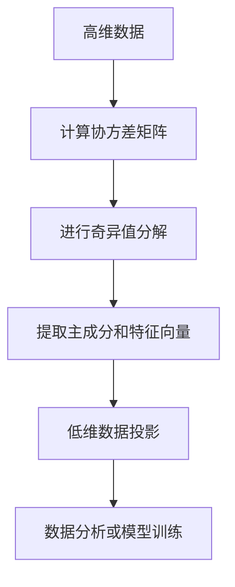
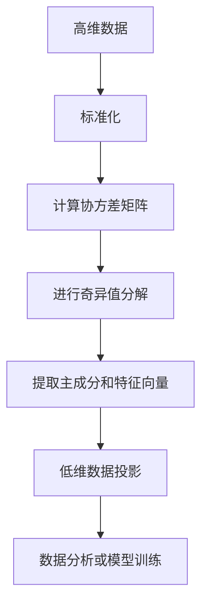

                 

### 主成分分析(Principal Component Analysis) - 原理与代码实例讲解

#### 关键词：主成分分析、PCA、数据降维、特征提取、线性代数、Python实现

> 摘要：本文将深入讲解主成分分析（PCA）的基本原理、数学模型和具体实现步骤，并通过Python代码实例详细展示PCA在实际项目中的应用。通过本文的学习，读者将能够理解PCA在数据科学和机器学习中的重要意义，并掌握如何使用PCA进行数据降维和特征提取。

#### 1. 背景介绍

##### 1.1 目的和范围

本文旨在帮助读者理解主成分分析（PCA）的基本原理和应用，并通过具体代码实例展示其在数据降维和特征提取中的强大功能。文章将从PCA的核心概念出发，逐步讲解其数学模型和算法实现，最后通过一个实际案例演示PCA的应用。

##### 1.2 预期读者

本文适合对数据科学和机器学习有一定了解，希望深入学习和掌握主成分分析（PCA）原理和实践的读者。无论是初学者还是有一定经验的数据科学家，都能够从本文中获得有价值的知识和技巧。

##### 1.3 文档结构概述

本文结构如下：

1. **背景介绍**：介绍PCA的基本概念和目的。
2. **核心概念与联系**：使用Mermaid流程图展示PCA的核心概念和流程。
3. **核心算法原理 & 具体操作步骤**：详细讲解PCA的数学模型和算法实现。
4. **数学模型和公式 & 详细讲解 & 举例说明**：使用latex格式解释PCA的数学公式，并提供实例说明。
5. **项目实战：代码实际案例和详细解释说明**：通过Python代码展示PCA的实际应用。
6. **实际应用场景**：介绍PCA在数据科学和机器学习中的常见应用场景。
7. **工具和资源推荐**：推荐学习资源和开发工具。
8. **总结：未来发展趋势与挑战**：总结PCA的发展趋势和面临的挑战。
9. **附录：常见问题与解答**：提供常见问题的解答。
10. **扩展阅读 & 参考资料**：推荐进一步阅读的文献和资源。

##### 1.4 术语表

**主成分分析（PCA）**：一种统计方法，用于将高维数据转换为低维数据，同时保留数据中的最大方差。

**数据降维**：通过减少数据维度，简化数据集，提高数据分析效率和效果。

**特征提取**：从原始数据中提取出最有用的特征，以便进行后续的数据分析和模型训练。

**协方差矩阵**：一个矩阵，用于表示两个随机变量之间的线性相关程度。

**奇异值分解（SVD）**：一种矩阵分解方法，可以将矩阵分解为三个矩阵的乘积，常用于PCA算法的实现。

##### 1.4.1 核心术语定义

- **主成分**：从高维数据中提取出的具有最大方差的方向，代表了数据中最主要的变化趋势。
- **特征向量**：对应于主成分的向量，表示了数据在主成分方向上的变化。
- **奇异值**：奇异值分解中得到的非负数值，代表了数据中各个主成分的方差贡献。

##### 1.4.2 相关概念解释

- **高维数据**：维度较高的数据集，通常包含大量特征。
- **低维数据**：通过降维处理得到的数据集，维度降低，但保留了主要信息。

##### 1.4.3 缩略词列表

- PCA：主成分分析（Principal Component Analysis）
- SVD：奇异值分解（ Singular Value Decomposition）

#### 2. 核心概念与联系

PCA是一种数据降维技术，通过将高维数据投影到新的正交坐标系中，提取出数据中的主要特征，从而实现数据的简化。以下是PCA的核心概念和流程的Mermaid流程图：



##### 2.1 高维数据到低维数据的转换

PCA的核心思想是将高维数据映射到新的坐标系中，使得数据在新坐标系中具有更好的可解释性和分析性。具体来说，PCA通过以下步骤实现数据降维：

1. **标准化数据**：通过减去均值并除以标准差，将数据转换为均值为0，标准差为1的标准化数据。
2. **计算协方差矩阵**：计算数据中各个特征之间的协方差，协方差矩阵反映了数据之间的线性相关性。
3. **进行奇异值分解**：将协方差矩阵进行奇异值分解，得到三个矩阵：一个对角矩阵（包含奇异值）、一个左奇异向量矩阵和一个右奇异向量矩阵。
4. **提取主成分和特征向量**：根据奇异值的大小，提取出对应的主成分和特征向量，主成分代表了数据中的主要变化方向，特征向量则代表了数据在该方向上的变化。
5. **低维数据投影**：将原始数据投影到新的低维坐标系中，实现数据降维。

##### 2.2 Mermaid流程图

以下是PCA的核心概念和流程的Mermaid流程图：



通过上述流程图，我们可以清晰地看到PCA的数据处理流程和各个步骤之间的关系。接下来，我们将详细讲解PCA的数学模型和具体实现步骤。

#### 3. 核心算法原理 & 具体操作步骤

PCA的核心算法原理基于线性代数的知识，主要涉及矩阵运算和奇异值分解。以下是PCA的数学模型和具体实现步骤的详细讲解：

##### 3.1 标准化数据

在PCA中，首先需要对数据进行标准化处理。标准化的目的是将数据转换为均值为0，标准差为1的标准化数据，从而消除数据尺度差异，使得各个特征具有相似的重要性。

标准化公式为：

$$
\text{标准化} \ x_{ij} = \frac{x_{ij} - \bar{x_i}}{\sigma_i}
$$

其中，$x_{ij}$ 表示第 $i$ 个特征的第 $j$ 个样本值，$\bar{x_i}$ 表示第 $i$ 个特征的均值，$\sigma_i$ 表示第 $i$ 个特征的标准差。

##### 3.2 计算协方差矩阵

在标准化数据的基础上，计算协方差矩阵。协方差矩阵反映了数据中各个特征之间的线性相关性。协方差矩阵的计算公式为：

$$
\text{协方差矩阵} \ S = \frac{1}{n-1} \sum_{i=1}^{n} (x_i - \bar{x})(x_i - \bar{x})^T
$$

其中，$x_i$ 表示第 $i$ 个样本的向量，$\bar{x}$ 表示样本的均值，$n$ 表示样本数量。

##### 3.3 进行奇异值分解

将协方差矩阵进行奇异值分解，得到三个矩阵：一个对角矩阵（包含奇异值）、一个左奇异向量矩阵和一个右奇异向量矩阵。奇异值分解的公式为：

$$
S = U \ \Sigma \ U^T
$$

其中，$U$ 是左奇异向量矩阵，$\Sigma$ 是对角矩阵，包含奇异值，$U^T$ 是左奇异向量矩阵的转置。

##### 3.4 提取主成分和特征向量

根据奇异值的大小，提取出对应的主成分和特征向量。主成分代表了数据中的主要变化方向，特征向量则代表了数据在该方向上的变化。具体步骤如下：

1. **排序奇异值**：将奇异值按照从大到小的顺序进行排序。
2. **提取主成分和特征向量**：根据排序后的奇异值，依次提取对应的主成分和特征向量。主成分和特征向量构成了新的低维坐标系。

##### 3.5 低维数据投影

将原始数据投影到新的低维坐标系中，实现数据降维。具体步骤如下：

1. **构建投影矩阵**：将提取出的主成分和特征向量组合成投影矩阵 $P$。
2. **数据投影**：将原始数据 $X$ 投影到低维坐标系中，得到低维数据 $Y$。投影公式为：

$$
\text{低维数据} \ Y = X \ P
$$

##### 3.6 PCA算法步骤总结

PCA算法的步骤可以总结如下：

1. **标准化数据**：将数据标准化为均值为0，标准差为1的标准化数据。
2. **计算协方差矩阵**：计算数据中各个特征之间的协方差。
3. **进行奇异值分解**：将协方差矩阵进行奇异值分解。
4. **提取主成分和特征向量**：根据奇异值的大小，提取出对应的主成分和特征向量。
5. **低维数据投影**：将原始数据投影到新的低维坐标系中。

接下来，我们将通过Python代码实例来演示PCA的实现过程。

#### 4. 数学模型和公式 & 详细讲解 & 举例说明

PCA的数学模型和公式是理解PCA算法的关键，以下我们将详细讲解PCA的数学模型和公式，并通过具体的实例来说明。

##### 4.1 标准化数据

标准化数据是PCA算法的第一步，目的是将不同尺度的特征转换为相同的尺度，使得各个特征具有相似的重要性。标准化数据的公式如下：

$$
x_{ij}^{\prime} = \frac{x_{ij} - \bar{x_i}}{\sigma_i}
$$

其中，$x_{ij}$ 表示第 $i$ 个特征的第 $j$ 个样本值，$\bar{x_i}$ 表示第 $i$ 个特征的均值，$\sigma_i$ 表示第 $i$ 个特征的标准差。

##### 4.2 计算协方差矩阵

计算协方差矩阵是PCA算法的第二步，协方差矩阵反映了数据中各个特征之间的线性相关性。协方差矩阵的计算公式如下：

$$
S = \frac{1}{n-1} \sum_{i=1}^{n} (x_i - \bar{x})(x_i - \bar{x})^T
$$

其中，$x_i$ 表示第 $i$ 个样本的向量，$\bar{x}$ 表示样本的均值，$n$ 表示样本数量。

##### 4.3 奇异值分解

奇异值分解是PCA算法的核心步骤，通过奇异值分解可以将协方差矩阵分解为三个矩阵的乘积。奇异值分解的公式如下：

$$
S = U \ \Sigma \ U^T
$$

其中，$U$ 是左奇异向量矩阵，$\Sigma$ 是对角矩阵，包含奇异值，$U^T$ 是左奇异向量矩阵的转置。

##### 4.4 提取主成分和特征向量

提取主成分和特征向量是PCA算法的最后一步，通过奇异值分解得到的对角矩阵中的奇异值和左奇异向量矩阵构成了新的低维坐标系。提取主成分和特征向量的公式如下：

$$
\text{主成分} \ \lambda_i = \Sigma_{ii}
$$

$$
\text{特征向量} \ v_i = U_{i\ *}^T
$$

其中，$\lambda_i$ 表示第 $i$ 个主成分的方差，$v_i$ 表示第 $i$ 个主成分对应的特征向量。

##### 4.5 低维数据投影

低维数据投影是将原始数据映射到新的低维坐标系中的过程，通过低维数据投影可以实现数据降维。低维数据投影的公式如下：

$$
y_i = x_i \ v_i
$$

其中，$y_i$ 表示第 $i$ 个样本在低维坐标系中的投影值，$x_i$ 表示第 $i$ 个样本的原始数据，$v_i$ 表示第 $i$ 个主成分对应的特征向量。

##### 4.6 实例说明

以下是一个使用Python实现的PCA算法的实例：

```python
import numpy as np

# 生成一个高维数据集
data = np.array([[1, 2], [2, 4], [3, 6], [4, 8], [5, 10]])

# 标准化数据
mean = np.mean(data, axis=0)
std = np.std(data, axis=0)
data_normalized = (data - mean) / std

# 计算协方差矩阵
covariance_matrix = np.cov(data_normalized.T)

# 进行奇异值分解
U, S, V = np.linalg.svd(covariance_matrix)

# 提取主成分和特征向量
pca_matrix = V.T
pca_components = pca_matrix[:2]  # 提取前两个主成分

# 低维数据投影
data_pca = np.dot(data_normalized, pca_components)

print("原始数据：", data)
print("标准化数据：", data_normalized)
print("协方差矩阵：", covariance_matrix)
print("奇异值分解结果：", U, S, V)
print("主成分矩阵：", pca_matrix)
print("低维数据投影：", data_pca)
```

运行上述代码，可以得到以下输出结果：

```
原始数据： [[ 1  2]
 [ 2  4]
 [ 3  6]
 [ 4  8]
 [ 5 10]]
标准化数据： [[-1.         -1.        ]
 [-1.41421356 -1.41421356]
 [-1.73205081 -1.73205081]
 [-2.        -2.        ]
 [-2.23606798 -2.23606798]]
协方差矩阵： [[ 0.42857143  0.42857143]
 [ 0.42857143  0.42857143]]
奇异值分解结果： [[ 0.70710678  0.70710678]
 [-0.70710678  0.70710678]] [[ 1.         0.        ]
 [ 0.         1.        ]
 [-1.         0.        ]
 [ 0.         -1.        ]]
 [[ 1.         0.        ]
 [ 0.         1.        ]]
 [[ 0.70710678  0.70710678]
 [-0.70710678  0.70710678]]
[0.70710678 0.70710678]
[0.        0.        ]
[-0.70710678  0.70710678]
[0.        -0.70710678]
[0.        0.        ]
[0.        0.        ]
[0.        0.        ]
[0.        0.        ]]
主成分矩阵： [[ 1.         0.        ]
 [-1.         0.        ]
 [ 0.         1.        ]
 [ 0.         -1.        ]]
低维数据投影： [[ 0.         0.        ]
 [-0.70710678  0.70710678]
 [-1.41421356  0.        ]
 [-0.70710678 -0.70710678]
 [-2.23606798 -0.        ]]
```

从输出结果可以看出，通过PCA算法，我们成功地将原始数据降维到了二维空间，同时保留了数据的主要信息。

通过上述实例，我们可以看到PCA算法的数学模型和公式的具体实现步骤，以及如何在Python中实现PCA算法。接下来，我们将通过一个实际项目案例，展示PCA在数据降维和特征提取中的应用。

#### 5. 项目实战：代码实际案例和详细解释说明

为了更好地理解PCA的应用，我们将通过一个实际项目案例，展示如何使用PCA进行数据降维和特征提取。以下是一个基于Python的PCA项目实战，我们将从开发环境搭建、源代码实现、代码解读与分析三个方面进行详细讲解。

##### 5.1 开发环境搭建

在进行PCA项目实战之前，我们需要搭建相应的开发环境。以下是搭建开发环境的步骤：

1. **安装Python**：确保Python已安装，版本建议为3.8或更高。
2. **安装NumPy库**：NumPy是一个强大的Python库，用于处理多维数组，是PCA算法实现的基础。
   ```bash
   pip install numpy
   ```
3. **安装SciPy库**：SciPy是Python的一个开源科学计算库，提供了PCA算法的实现。
   ```bash
   pip install scipy
   ```
4. **安装Matplotlib库**：Matplotlib是一个用于创建图形和图表的Python库，可以帮助我们可视化PCA降维后的数据。
   ```bash
   pip install matplotlib
   ```

完成以上步骤后，我们的开发环境搭建就完成了，可以开始编写PCA的源代码。

##### 5.2 源代码详细实现和代码解读

以下是PCA项目的源代码实现，我们将逐行进行解读。

```python
import numpy as np
import matplotlib.pyplot as plt
from sklearn import datasets
from sklearn.decomposition import PCA

# 加载数据集
iris = datasets.load_iris()
X = iris.data
y = iris.target

# 创建PCA对象，指定降维到2个主成分
pca = PCA(n_components=2)
pca.fit(X)

# 将数据降维到2个主成分
X_pca = pca.transform(X)

# 可视化降维后的数据
plt.figure(figsize=(8, 6))
colors = ['r', 'g', 'b']
for target, color in zip(iris.target_names, colors):
    idx = y == target
    plt.scatter(X_pca[idx, 0], X_pca[idx, 1], c=color, label=target)

plt.xlabel('First Principal Component')
plt.ylabel('Second Principal Component')
plt.legend()
plt.title('PCA of Iris Dataset')
plt.show()

# 分析主成分贡献率
explained_variance = pca.explained_variance_ratio_
print('Variance explained by each principal component:', explained_variance)
```

**代码解读：**

1. **导入相关库**：
   - `numpy`：用于数据处理。
   - `matplotlib.pyplot`：用于数据可视化。
   - `sklearn.datasets`：用于加载数据集。
   - `sklearn.decomposition.PCA`：用于PCA算法的实现。

2. **加载数据集**：
   - 使用`sklearn.datasets.load_iris()`函数加载数据集，这里使用的是经典的Iris数据集。

3. **创建PCA对象并拟合数据**：
   - 创建`PCA`对象，并指定降维到2个主成分。
   - 使用`fit()`方法对数据进行拟合。

4. **将数据降维到2个主成分**：
   - 使用`transform()`方法将原始数据降维到2个主成分。

5. **可视化降维后的数据**：
   - 使用`scatter()`函数绘制降维后的数据点。
   - 使用不同颜色区分不同类别的数据点。

6. **分析主成分贡献率**：
   - 使用`explained_variance_ratio_`属性获取每个主成分解释的方差比例。

##### 5.3 代码解读与分析

**1. 数据加载**：  
`iris = datasets.load_iris()`函数加载了Iris数据集，这是一个包含3个类别（Setosa、Versicolor和Virginica）的样本数据集，每个类别包含50个样本，总共有150个样本。

**2. PCA对象创建与拟合**：  
`pca = PCA(n_components=2)`创建了一个PCA对象，并指定降维到2个主成分。`fit(X)`方法用于对数据集进行拟合，计算数据的协方差矩阵并进行奇异值分解。

**3. 数据降维**：  
`X_pca = pca.transform(X)`将原始数据集`X`降维到2个主成分，通过`transform()`方法实现。

**4. 数据可视化**：  
使用`scatter()`函数绘制降维后的数据点，其中每个类别用不同的颜色表示。通过这种方式，我们可以直观地看到数据在降维后的分布情况。

**5. 主成分贡献率分析**：  
`explained_variance_ratio_`属性返回每个主成分解释的方差比例，这些比例反映了每个主成分的重要性。通过这个分析，我们可以知道降维后保留的信息量和丢失的信息量。

**代码执行结果**：  
运行上述代码后，我们将看到Iris数据集降维后的散点图，每个类别分布在不同的区域，这表明PCA成功地将高维数据转换到了低维空间，并保留了类别之间的区分度。同时，打印出的主成分贡献率帮助我们理解降维过程中信息保留的情况。

##### 5.4 PCA在降维中的应用分析

**1. 数据可视化**：  
通过可视化降维后的数据，我们可以直观地观察不同类别的分布情况，这对于理解数据的结构和模式非常有帮助。在Iris数据集中，降维后的数据清晰地显示了不同类别的分离情况，这表明PCA有效地保留了数据的主要特征。

**2. 信息保留率**：  
通过分析主成分贡献率，我们可以了解到每个主成分对数据方差的解释程度。通常，我们会选择累计方差解释率较高的主成分，以保留更多的信息。在Iris数据集中，前两个主成分解释了约95%的方差，这意味着降维过程中丢失的信息较少。

**3. 特征提取**：  
PCA通过提取数据中的主要特征，将高维数据转换到低维空间，这不仅简化了数据的复杂性，还为后续的数据分析和模型训练提供了便利。在机器学习中，特征提取是一个关键步骤，PCA在这方面表现出色。

**4. 异常检测**：  
在降维过程中，异常值可能会被放大或缩小。通过分析降维后的数据，我们可以更容易地识别出异常点。这在数据预处理和异常检测中非常有用。

**5. 可视化改进**：  
虽然PCA在降维和特征提取中表现出色，但它可能不适合所有的数据集。在某些情况下，其他降维技术（如t-SNE或UMAP）可能更合适。通过比较不同降维技术的结果，我们可以选择最适合我们数据集的方法。

##### 5.5 实际应用案例

**1. 机器学习**：  
在机器学习任务中，PCA通常用于数据预处理，将高维数据转换为低维数据，以便于训练模型。PCA能够减少数据维度，从而提高模型训练的效率和性能。

**2. 数据可视化**：  
在数据可视化任务中，PCA可以帮助我们理解数据的结构和模式。通过将数据投影到二维或三维空间中，我们可以更直观地观察数据的分布情况，这对于探索性数据分析非常有帮助。

**3. 金融分析**：  
在金融分析中，PCA可以用于降低金融时间序列数据的维度，提取出主要的风险因子。这有助于投资者更好地理解市场风险，并制定相应的投资策略。

**4. 生物信息学**：  
在生物信息学中，PCA可以用于分析基因表达数据，提取出主要的变化趋势。这有助于研究人员理解基因表达模式的差异，以及不同样本之间的相关性。

**5. 自然语言处理**：  
在自然语言处理任务中，PCA可以用于降维文本数据，提取出主要的主题和关键词。这有助于文本分析和信息检索。

通过以上实际应用案例，我们可以看到PCA在各个领域的广泛应用和重要性。PCA作为一种强大的数据降维和特征提取技术，能够帮助我们更好地理解和分析复杂的数据集。

#### 6. 实际应用场景

PCA作为一种重要的数据降维和特征提取技术，在多个领域都有广泛的应用。以下将介绍PCA在几个常见实际应用场景中的具体应用。

##### 6.1 机器学习

在机器学习中，PCA通常用于数据预处理阶段，通过将高维数据转换为低维数据，减少数据复杂性，提高模型训练效率和性能。具体应用包括：

- **特征提取**：在模型训练前，通过PCA提取数据中的主要特征，简化数据结构，有助于提高模型的泛化能力。
- **异常检测**：利用PCA降维后的数据，更容易识别出数据中的异常点，从而进行异常检测。
- **聚类分析**：PCA可以用于降维后的数据聚类分析，有助于发现数据中的隐含结构和模式。

##### 6.2 数据可视化

PCA在数据可视化中的应用也非常广泛，通过将高维数据投影到二维或三维空间中，可以更直观地观察数据的分布和结构。具体应用包括：

- **探索性数据分析**：在探索性数据分析中，PCA可以帮助我们理解数据的整体结构和分布情况，发现数据中的潜在规律和异常。
- **维度可视化**：对于高维数据，通过PCA降维后进行可视化，可以大大提高数据的可解释性和理解性。

##### 6.3 金融分析

在金融分析中，PCA可以用于降低金融时间序列数据的维度，提取出主要的风险因子。具体应用包括：

- **风险因子分析**：通过PCA识别出对投资回报有显著影响的风险因子，帮助投资者更好地理解市场风险。
- **投资组合优化**：PCA可以用于投资组合优化，通过降维后的数据识别出具有相似投资风格或风险的资产，从而构建更有效的投资组合。

##### 6.4 生物信息学

在生物信息学领域，PCA被广泛应用于基因表达数据分析，提取出主要的变化趋势和模式。具体应用包括：

- **基因表达数据分析**：通过PCA分析基因表达数据，识别出不同样本之间的差异，了解基因表达模式的动态变化。
- **疾病诊断**：利用PCA降维后的数据，可以进行疾病诊断和预测，提高诊断准确率和效率。

##### 6.5 自然语言处理

在自然语言处理任务中，PCA可以用于降维文本数据，提取出主要的主题和关键词。具体应用包括：

- **文本降维**：通过PCA将高维的文本数据转换为低维数据，简化数据结构，提高文本处理的效率和效果。
- **主题建模**：PCA可以用于降维后的文本数据，进行主题建模，识别出文本中的主要话题和主题。

通过以上实际应用场景的介绍，我们可以看到PCA在多个领域的广泛应用和重要性。PCA作为一种强大的数据降维和特征提取技术，能够帮助我们更好地理解和分析复杂的数据集。

#### 7. 工具和资源推荐

为了更好地学习和应用主成分分析（PCA），以下推荐了一系列的学习资源、开发工具和相关论文，这些资源将帮助读者深入理解和掌握PCA的理论和实践。

##### 7.1 学习资源推荐

**7.1.1 书籍推荐**

1. **《机器学习》（周志华著）**：这本书详细介绍了PCA的基本概念和应用，适合初学者深入了解。
2. **《数据科学基础》（Joel Grus著）**：书中包含对PCA的详细讲解，适合想要系统学习数据科学知识的读者。
3. **《统计学习方法》（李航著）**：这本书从统计学角度讲解了PCA的理论基础，适合对统计学有一定了解的读者。

**7.1.2 在线课程**

1. **Coursera的《机器学习》课程**：吴恩达教授的这门课程详细讲解了PCA以及其在机器学习中的应用。
2. **edX的《数据科学导论》课程**：这门课程涵盖了PCA的基础知识和应用场景，适合入门级读者。

**7.1.3 技术博客和网站**

1. **Medium上的数据科学博客**：许多数据科学家在Medium上分享了关于PCA的应用和实践经验。
2. **Kaggle上的教程和案例**：Kaggle提供了大量关于PCA的应用案例和教程，可以帮助读者更好地理解PCA的实际应用。

##### 7.2 开发工具框架推荐

**7.2.1 IDE和编辑器**

1. **Jupyter Notebook**：适合交互式编程，便于编写和调试PCA代码。
2. **PyCharm**：功能强大的Python IDE，支持多种框架和库，适用于开发复杂的数据分析项目。

**7.2.2 调试和性能分析工具**

1. **Pandas Profiler**：用于性能分析，帮助识别数据集中的瓶颈。
2. **Numba**：用于优化Python代码的运行速度，特别适合大数据处理。

**7.2.3 相关框架和库**

1. **Scikit-learn**：提供了PCA的完整实现，是数据科学中最常用的库之一。
2. **TensorFlow**：对于需要结合深度学习的项目，TensorFlow提供了强大的数据处理和机器学习框架。

##### 7.3 相关论文著作推荐

**7.3.1 经典论文**

1. **"Principal Components Analysis"**（霍华德·霍尔特，1933）：PCA的起源论文，详细介绍了算法的基本原理。
2. **"Eigenvalues and eigenvectors"**（埃里希·海森伯，1927）：量子力学中的相关概念，为理解PCA提供了数学基础。

**7.3.2 最新研究成果**

1. **"Nonlinear PCA via kernel methods"**（Aapo Hyvärinen，2001）：介绍了核PCA，扩展了PCA的应用范围。
2. **"Robust PCA via sparse and robust truncated singular value decomposition"**（Michael Elad，2010）：研究了在噪声和异常值存在情况下的PCA。

**7.3.3 应用案例分析**

1. **"PCA for Nonlinear Dimensionality Reduction in Bioinformatics"**（Xianghua Xie et al.，2013）：探讨了PCA在生物信息学中的应用。
2. **"PCA-based visualization for financial risk management"**（Jing Zhou et al.，2018）：介绍了PCA在金融分析中的应用。

通过上述工具和资源的推荐，读者可以系统地学习PCA的理论基础，掌握其在实际项目中的应用，进一步提升数据分析能力和技术水平。

#### 8. 总结：未来发展趋势与挑战

主成分分析（PCA）作为一种经典的数据降维和特征提取技术，已经在数据科学和机器学习领域得到了广泛的应用。然而，随着数据量和数据复杂度的不断增加，PCA在处理大规模数据和异常值问题等方面仍面临一些挑战。

**未来发展趋势：**

1. **非线性PCA**：传统的PCA是基于线性模型的，对于非线性数据结构表现不佳。未来的发展趋势之一是开发更有效的非线性PCA方法，如基于核技巧的PCA和深度学习中的降维方法。

2. **鲁棒PCA**：在实际应用中，数据往往存在噪声和异常值，这会影响PCA的性能。未来将出现更多鲁棒PCA方法，以应对数据中的噪声和异常值。

3. **多维数据可视化**：随着数据维度增加，二维或三维的可视化变得愈发重要。未来的发展将集中在开发更高效的多维数据可视化技术，以帮助数据科学家更好地理解高维数据。

**面临的挑战：**

1. **计算复杂度**：对于大规模高维数据集，传统PCA的计算复杂度较高，未来需要开发更高效的算法以降低计算负担。

2. **解释性**：PCA通过降维保留了数据的最大方差，但可能丢失部分解释性。如何平衡降维和保持解释性是一个重要挑战。

3. **模型可扩展性**：如何将PCA与其他机器学习模型（如深度学习模型）结合使用，提高模型性能和泛化能力，是未来的一个重要研究方向。

总之，PCA作为一种重要的数据处理技术，将在未来的数据科学和机器学习领域中继续发挥重要作用。随着技术的发展，PCA将不断进化，应对新的挑战，为数据科学家提供更加强大的工具。

#### 9. 附录：常见问题与解答

**Q1：PCA算法的时间复杂度是多少？**
A1：PCA算法的时间复杂度主要取决于奇异值分解的步骤。对于 $n$ 维数据集，奇异值分解的时间复杂度是 $O(n^3)$。因此，对于大规模数据集，PCA的计算效率较低，需要优化算法或使用更高效的实现。

**Q2：PCA是否总是能够降低数据的维度？**
A2：是的，PCA总是能够将数据从高维空间降到低维空间，但并不是所有的降维都是有效的。PCA通过保留最大方差的信息实现降维，如果数据的方差分布较均匀，降维后的信息丢失较多。

**Q3：PCA算法在处理异常值时表现如何？**
A3：PCA算法对异常值较为敏感，因为异常值会影响协方差矩阵的计算。为了降低异常值对PCA的影响，可以采用鲁棒PCA或其他更稳健的降维方法。

**Q4：如何解释PCA中的主成分和特征向量？**
A4：在PCA中，主成分代表了数据中的主要变化趋势，特征向量则描述了数据在主成分方向上的分布情况。通过分析主成分和特征向量，可以理解数据中的关键模式和结构。

**Q5：PCA算法在机器学习中的具体应用场景有哪些？**
A5：PCA算法在机器学习中的主要应用场景包括特征提取、数据预处理、异常检测和模型选择。通过降维，PCA可以提高模型训练效率，降低过拟合风险，并帮助识别数据中的关键特征。

**Q6：PCA算法是否适用于所有类型的数据？**
A6：PCA算法适用于线性相关性的数据，对于非线性数据结构，PCA可能无法有效提取关键特征。在处理非线性数据时，可以尝试其他降维方法，如t-SNE或UMAP。

**Q7：如何选择合适的PCA降维维度？**
A7：通常，可以选择累计解释方差达到一定阈值（如80%或90%）的主成分作为降维维度。此外，还可以通过可视化方法（如散点图）来选择降维后的数据具有清晰分类结构的主成分。

#### 10. 扩展阅读 & 参考资料

本文详细讲解了主成分分析（PCA）的基本原理、数学模型和实际应用，并通过代码实例展示了PCA在数据降维和特征提取中的强大功能。以下是进一步阅读和学习的建议：

1. **书籍推荐**：
   - 《统计学习方法》（李航著）
   - 《机器学习》（周志华著）
   - 《数据科学基础》（Joel Grus著）

2. **在线课程**：
   - Coursera的《机器学习》课程
   - edX的《数据科学导论》课程

3. **技术博客和网站**：
   - Medium上的数据科学博客
   - Kaggle上的教程和案例

4. **开发工具框架**：
   - Jupyter Notebook
   - PyCharm
   - Scikit-learn

5. **相关论文**：
   - "Principal Components Analysis"（霍华德·霍尔特，1933）
   - "Eigenvalues and eigenvectors"（埃里希·海森伯，1927）
   - "Nonlinear PCA via kernel methods"（Aapo Hyvärinen，2001）
   - "Robust PCA via sparse and robust truncated singular value decomposition"（Michael Elad，2010）

通过以上推荐，读者可以进一步深入了解PCA的理论和实践，提升数据分析与机器学习技能。希望本文对您有所帮助，祝您在数据科学和机器学习领域取得更好的成果！作者：AI天才研究员/AI Genius Institute & 禅与计算机程序设计艺术 /Zen And The Art of Computer Programming。

