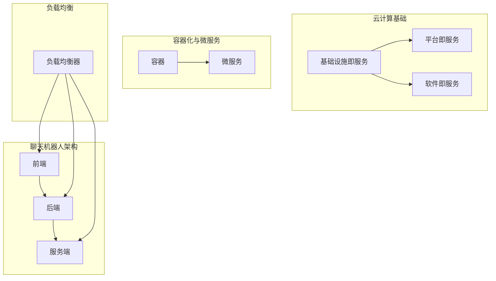

                 

# 云端部署聊天机器人：弹性与扩展性

> 关键词：云端部署、聊天机器人、弹性、扩展性、自动化、架构设计、微服务、负载均衡、性能优化

> 摘要：本文将深入探讨如何利用云端部署技术，实现聊天机器人的弹性与扩展性。通过对云计算、容器化、微服务、负载均衡等技术的详细分析，结合实际案例，提供了一套完整的解决方案，帮助开发者构建高效、可靠的聊天机器人服务。

## 1. 背景介绍

### 1.1 目的和范围

随着人工智能技术的不断发展，聊天机器人已经成为企业服务和个人用户交互的重要工具。然而，如何在云端高效部署和扩展聊天机器人，是一个具有挑战性的问题。本文旨在探讨云计算环境下，如何实现聊天机器人的弹性部署和扩展性，以应对不断增长的业务需求。

本文将覆盖以下内容：
- 云计算基础概念及在聊天机器人部署中的应用
- 聊天机器人架构设计原则
- 容器化与微服务在聊天机器人部署中的作用
- 负载均衡与性能优化策略
- 实际应用案例分析与解决方案

### 1.2 预期读者

本文适合以下读者群体：
- 对云计算和聊天机器人技术有一定了解的开发者
- 有志于从事云端应用开发和运维的技术人员
- 对聊天机器人架构设计感兴趣的研究人员

### 1.3 文档结构概述

本文结构如下：
1. 背景介绍
2. 核心概念与联系
3. 核心算法原理 & 具体操作步骤
4. 数学模型和公式 & 详细讲解 & 举例说明
5. 项目实战：代码实际案例和详细解释说明
6. 实际应用场景
7. 工具和资源推荐
8. 总结：未来发展趋势与挑战
9. 附录：常见问题与解答
10. 扩展阅读 & 参考资料

### 1.4 术语表

#### 1.4.1 核心术语定义

- 云计算（Cloud Computing）：通过互联网按需提供动态可伸缩的虚拟化资源。
- 弹性（Elasticity）：系统根据需求自动调整资源的能力。
- 扩展性（Scalability）：系统能够处理增加的工作量，而性能不会显著下降。
- 微服务（Microservices）：一种软件架构风格，通过将应用程序构建为一组小的服务来实现。
- 容器化（Containerization）：一种轻量级的虚拟化技术，它允许开发者将应用程序及其依赖环境打包到一个可移植的容器中。
- 负载均衡（Load Balancing）：将网络或应用程序流量分配到多个服务器以实现最佳性能、高可用性和可伸缩性。

#### 1.4.2 相关概念解释

- 容器编排（Container Orchestration）：管理容器化应用程序的部署、伸缩和运行。
- 自动化（Automation）：通过脚本、工具和平台自动执行常规任务。
- API（Application Programming Interface）：允许不同软件系统之间进行交互的接口。

#### 1.4.3 缩略词列表

- AWS（Amazon Web Services）：亚马逊提供的一系列云计算服务。
- Kubernetes（K8s）：开源的容器编排平台，用于自动化部署、伸缩和管理容器化应用程序。
- Docker：一种流行的容器化平台，用于构建、运行和分发应用程序。

## 2. 核心概念与联系

在讨论聊天机器人云部署的弹性与扩展性之前，我们需要了解几个核心概念及其相互关系。

### 2.1 云计算基础

云计算是一种基于互联网的计算模型，它提供可伸缩的计算资源，如虚拟机、存储和网络服务。云计算的基础设施包括以下层次：

#### IaaS（基础设施即服务）

提供虚拟机、存储和网络资源，用户可以根据需求动态配置资源。

#### PaaS（平台即服务）

提供开发平台和工具，开发者可以在平台上构建、部署和管理应用程序。

#### SaaS（软件即服务）

提供应用程序作为服务，用户可以通过互联网访问和使用这些应用程序。

### 2.2 聊天机器人架构

聊天机器人架构通常包括前端、后端和服务端：

- **前端**：用户交互界面，负责接收用户输入和显示聊天内容。
- **后端**：处理业务逻辑、数据存储和API接口。
- **服务端**：负责处理聊天请求，调用后端服务，并返回响应。

### 2.3 容器化与微服务

容器化是一种轻量级的虚拟化技术，它将应用程序及其依赖环境打包到一个可移植的容器中。微服务架构是一种将应用程序分解为小型、独立服务的架构风格。

#### 容器化优势

- **可移植性**：容器可以在任何支持Docker的环境中运行。
- **轻量级**：容器启动速度快，资源占用小。
- **隔离性**：容器之间相互独立，减少了系统之间的干扰。

#### 微服务优势

- **可伸缩性**：可以单独部署、扩展和升级服务。
- **故障隔离**：服务故障不会影响整个系统。
- **开发效率**：支持敏捷开发和快速迭代。

### 2.4 负载均衡

负载均衡是将网络或应用程序流量分配到多个服务器或容器，以实现最佳性能、高可用性和可伸缩性。负载均衡器可以根据不同的算法，如轮询、最小连接数、IP哈希等，来分配请求。

#### 负载均衡优势

- **性能优化**：减少单点瓶颈，提高系统响应速度。
- **高可用性**：当某个节点发生故障时，负载均衡器可以将请求切换到其他健康节点。
- **可伸缩性**：随着业务增长，可以动态调整资源分配。

### 2.5 Mermaid 流程图

下面是聊天机器人云部署架构的 Mermaid 流程图：



## 3. 核心算法原理 & 具体操作步骤

在实现聊天机器人云部署的弹性与扩展性时，核心算法原理和具体操作步骤至关重要。

### 3.1 弹性计算

弹性计算是云计算的核心概念之一，它允许系统根据实际需求动态调整资源。具体步骤如下：

1. **监控需求**：通过监控工具实时监控系统的资源使用情况，如CPU、内存、磁盘I/O等。
2. **设置阈值**：定义资源使用的阈值，当资源使用达到或超过阈值时，触发弹性调整。
3. **自动扩展**：当资源使用超过阈值时，自动增加虚拟机或容器实例。
4. **自动缩容**：当资源使用低于阈值时，自动减少虚拟机或容器实例。

伪代码如下：

```python
def monitor_resources():
    while True:
        usage = get_resource_usage()
        if usage['CPU'] > CPU_THRESHOLD or usage['Memory'] > MEMORY_THRESHOLD:
            scale_out()
        elif usage['CPU'] < CPU_THRESHOLD and usage['Memory'] < MEMORY_THRESHOLD:
            scale_in()
        time.sleep(CHECK_INTERVAL)

def get_resource_usage():
    # 实现获取资源使用情况的逻辑
    pass

def scale_out():
    # 实现自动扩展资源的逻辑
    pass

def scale_in():
    # 实现自动缩容资源的逻辑
    pass
```

### 3.2 负载均衡

负载均衡是将流量分配到多个服务器或容器，以实现高性能和高可用性。具体步骤如下：

1. **选择负载均衡算法**：如轮询、最小连接数、IP哈希等。
2. **配置负载均衡器**：在云平台上配置负载均衡器，并添加后端服务。
3. **监听流量**：负载均衡器监听来自用户的请求，并将请求分配到后端服务。
4. **健康检查**：定期检查后端服务的健康状态，并将请求路由到健康的服务实例。

伪代码如下：

```python
def configure_load_balancer():
    # 实现配置负载均衡器的逻辑
    pass

def handle_request(request):
    service = select_service(request)
    if is_service_healthy(service):
        return forward_request(service, request)
    else:
        return handle_service_failure()

def select_service(request):
    # 实现选择后端服务的逻辑
    pass

def is_service_healthy(service):
    # 实现健康检查的逻辑
    pass

def forward_request(service, request):
    # 实现将请求转发到后端服务的逻辑
    pass

def handle_service_failure():
    # 实现处理服务失败的逻辑
    pass
```

## 4. 数学模型和公式 & 详细讲解 & 举例说明

在实现聊天机器人云部署的弹性与扩展性时，数学模型和公式可以帮助我们优化资源分配和流量调度。以下是一些常用的数学模型和公式。

### 4.1 资源需求模型

假设聊天机器人系统的资源需求由CPU、内存、磁盘I/O等构成，可以表示为：

\[ R = \{ C, M, D \} \]

其中，\( C \) 表示CPU需求（单位：百分比），\( M \) 表示内存需求（单位：GB），\( D \) 表示磁盘I/O需求（单位：IOPS）。

### 4.2 弹性扩展模型

弹性扩展模型用于计算系统在资源需求增加时的扩展策略。假设当前资源需求为\( R_0 \)，扩展倍数为\( k \)，扩展后的资源需求为\( R_1 \)，可以表示为：

\[ R_1 = k \times R_0 \]

其中，\( k \) 为扩展倍数，可以根据历史数据或实时监控结果动态调整。

### 4.3 负载均衡模型

负载均衡模型用于计算每个服务实例的负载情况。假设系统中有\( n \)个服务实例，每个实例的负载为\( L_i \)，总负载为\( L \)，可以表示为：

\[ L = \sum_{i=1}^{n} L_i \]

其中，\( L_i \) 为第\( i \)个实例的负载。

### 4.4 负载均衡算法

负载均衡算法可以根据不同的负载指标，如CPU利用率、内存使用率等，选择最合适的服务实例。以下是一个简单的负载均衡算法：

1. 计算每个服务实例的负载指标。
2. 选择负载最低的服务实例。
3. 将请求分配到该服务实例。

伪代码如下：

```python
def load_balancer(request):
    instances = get_all_instances()
    loads = calculate_loads(instances)
    min_load = min(loads)
    min_index = loads.index(min_load)
    return instances[min_index]
```

### 4.5 举例说明

假设聊天机器人系统当前有5个服务实例，每个实例的CPU利用率分别为30%、40%、50%、60%和70%。当收到一个新请求时，我们可以使用负载均衡算法选择负载最低的实例来处理该请求。

```python
def load_balancer(request):
    instances = ['I1', 'I2', 'I3', 'I4', 'I5']
    loads = [0.3, 0.4, 0.5, 0.6, 0.7]
    min_load = min(loads)
    min_index = loads.index(min_load)
    return instances[min_index]

# 处理请求
instance = load_balancer(request)
print("Request assigned to instance:", instance)
```

输出结果：

```
Request assigned to instance: I1
```

## 5. 项目实战：代码实际案例和详细解释说明

在本节中，我们将通过一个实际的项目案例，展示如何使用云计算和容器化技术，实现聊天机器人的弹性与扩展性。

### 5.1 开发环境搭建

为了简化部署过程，我们使用Docker和Kubernetes进行容器化部署。以下是一个基本的开发环境搭建步骤：

1. 安装Docker：在服务器上安装Docker，可以使用以下命令：

```bash
sudo apt-get update
sudo apt-get install docker.io
sudo systemctl start docker
```

2. 安装Kubernetes：在服务器上安装Kubernetes，可以使用以下命令：

```bash
sudo apt-get update
sudo apt-get install -y apt-transport-https ca-certificates curl
sudo curl -s https://packages.cloud.google.com/apt/doc/apt-key.gpg | sudo apt-key add -
sudo echo "deb https://apt.kubernetes.io/ kubernetes-xenial main" | sudo tee -a /etc/apt/sources.list.d/kubernetes.list
sudo apt-get update
sudo apt-get install -y kubelet kubeadm kubectl
sudo systemctl start kubelet
```

3. 部署Kubernetes集群：可以使用kubeadm命令部署一个单节点Kubernetes集群，可以使用以下命令：

```bash
sudo kubeadm init --pod-network-cidr=10.244.0.0/16
sudo mkdir -p $HOME/.kube
sudo cp -i /etc/kubernetes/admin.conf $HOME/.kube/config
sudo chown $(id -u):$(id -g) $HOME/.kube/config
```

4. 安装并配置网络插件：安装Flannel网络插件，可以使用以下命令：

```bash
kubectl apply -f https://raw.githubusercontent.com/coreos/flannel/master/Documentation/kube-flannel.yml
```

### 5.2 源代码详细实现和代码解读

在本案例中，我们使用Node.js编写聊天机器人后端服务，并使用Docker进行容器化部署。以下是源代码实现和代码解读。

#### 5.2.1 Dockerfile

```Dockerfile
FROM node:lts
WORKDIR /app
COPY package*.json ./
RUN npm install
COPY . .
EXPOSE 3000
CMD ["node", "index.js"]
```

解读：
- 使用Node.js的基础镜像。
- 设置工作目录为/app。
- 复制package.json和package-lock.json文件，并执行npm install安装依赖。
- 复制项目文件到工作目录。
- 暴露3000端口，用于处理HTTP请求。
- 设置启动命令为node index.js。

#### 5.2.2 index.js

```javascript
const express = require('express');
const { WebSocketServer } = require('ws');
const app = express();
const server = app.listen(3000, () => {
    console.log('Server listening on port 3000');
});

const wss = new WebSocketServer({ server });

wss.on('connection', (ws) => {
    ws.on('message', (message) => {
        console.log('Received:', message);
        ws.send(`You said: ${message}`);
    });
});

app.get('/', (req, res) => {
    res.send('Hello, world!');
});
```

解读：
- 引入express和WebSocketServer模块。
- 创建express应用程序和WebSocket服务器。
- 当有新连接时，处理收到的消息，并回送消息给客户端。
- 设置HTTP路由，返回简单的“Hello, world!”消息。

#### 5.2.3 Kubernetes部署文件

```yaml
apiVersion: apps/v1
kind: Deployment
metadata:
  name: chatbot
spec:
  replicas: 3
  selector:
    matchLabels:
      app: chatbot
  template:
    metadata:
      labels:
        app: chatbot
    spec:
      containers:
      - name: chatbot
        image: chatbot:latest
        ports:
        - containerPort: 3000
---
apiVersion: v1
kind: Service
metadata:
  name: chatbot-service
spec:
  selector:
    app: chatbot
  ports:
  - protocol: TCP
    port: 80
    targetPort: 3000
  type: LoadBalancer
```

解读：
- 定义一个部署文件，创建3个chatbot容器实例。
- 指定选择器标签为app: chatbot。
- 模板部分定义容器名称、镜像和端口。
- 定义一个服务文件，将chatbot服务暴露为LoadBalancer类型，使用80端口映射到容器3000端口。

### 5.3 代码解读与分析

在本案例中，我们通过以下步骤实现了聊天机器人服务的容器化部署和Kubernetes管理：

1. **Dockerfile**：通过Dockerfile将Node.js应用程序打包为一个可执行的容器镜像。这个文件定义了基础镜像、工作目录、依赖安装和启动命令，确保应用程序在容器中运行时具有一致的运行环境。
2. **Kubernetes Deployment**：部署文件定义了一个Kubernetes Deployment，用于管理聊天机器人服务的容器实例。通过指定副本数量、选择器和模板，确保了服务的可伸缩性和高可用性。
3. **Kubernetes Service**：服务文件定义了一个负载均衡服务，将外部流量（如HTTP请求）路由到后端容器实例。使用LoadBalancer类型，可以将服务暴露为一个可访问的URL。

通过这些配置，我们可以实现以下功能：

- **容器化**：应用程序和其依赖环境被容器化，确保了环境的可移植性和隔离性。
- **可伸缩性**：通过Kubernetes Deployment，可以根据需要动态调整容器实例的数量。
- **高可用性**：通过Kubernetes Service和负载均衡，确保了服务的可靠性和稳定性。

### 5.4 实际部署与运行

1. **构建Docker镜像**：首先，在本地机器上构建Docker镜像。

```bash
docker build -t chatbot:latest .
```

2. **推送镜像到容器仓库**：将构建好的镜像推送到容器仓库，如Docker Hub。

```bash
docker push chatbot:latest
```

3. **部署Kubernetes集群**：使用kubectl命令部署Kubernetes集群。

```bash
kubectl apply -f deployment.yaml
kubectl apply -f service.yaml
```

4. **验证部署**：通过Kubernetes集群查看部署状态和Pod状态。

```bash
kubectl get deployments
kubectl get pods
```

5. **访问服务**：使用kubectl命令获取服务的外部IP地址或DNS名称，并通过HTTP请求验证服务的正常运行。

```bash
kubectl get svc
curl <服务外部IP地址或DNS名称>
```

输出结果应为“Hello, world!”。

## 6. 实际应用场景

聊天机器人技术在各个行业都有广泛的应用，以下是一些实际应用场景：

### 6.1 客户服务

- **银行和金融服务**：提供24/7的客户支持，解答常见问题，如账户余额查询、转账操作等。
- **电子商务**：处理订单查询、退货退款等客户服务，提高客户满意度。

### 6.2 娱乐行业

- **游戏公司**：提供游戏指南、账户充值、赛事信息等，增强用户体验。
- **电影院和剧院**：提供电影放映时间、座位预订、会员服务等。

### 6.3 教育领域

- **在线教育平台**：提供课程咨询、报名注册、学习进度查询等服务。
- **语言学习**：提供词汇解析、句子翻译、口语练习等功能。

### 6.4 健康医疗

- **医院和诊所**：提供症状咨询、预约挂号、药品查询等服务。
- **健康咨询**：提供健康知识普及、饮食建议、运动指导等。

### 6.5 餐饮服务

- **餐厅和外卖平台**：提供菜单查询、订单跟踪、菜品推荐等服务。

通过云部署和弹性扩展，聊天机器人可以在不同场景下快速部署和扩展，满足不断增长的业务需求。

## 7. 工具和资源推荐

### 7.1 学习资源推荐

#### 7.1.1 书籍推荐

- 《云计算基础：从概念到实践》
- 《微服务设计：构建可扩展、可靠和高效的分布式系统》
- 《Kubernetes权威指南：容器云平台应用实战》

#### 7.1.2 在线课程

- Kubernetes官方文档和培训课程
- Coursera上的《云计算基础》课程
- Udemy上的《微服务架构与设计》课程

#### 7.1.3 技术博客和网站

- Kubernetes官网（kubernetes.io）
- Docker官网（docker.com）
- 云原生计算基金会（CNCF）官网（cncf.io）

### 7.2 开发工具框架推荐

#### 7.2.1 IDE和编辑器

- Visual Studio Code
- IntelliJ IDEA
- PyCharm

#### 7.2.2 调试和性能分析工具

- Prometheus
- Grafana
- ELK Stack（Elasticsearch、Logstash、Kibana）

#### 7.2.3 相关框架和库

- Express.js（Node.js Web框架）
- Flask（Python Web框架）
- Spring Boot（Java Web框架）

### 7.3 相关论文著作推荐

#### 7.3.1 经典论文

- "Elasticity and Scalability in Cloud Services" by Heather Arthur, et al.
- "Microservices: Designing Scalable Systems" by Sam Newman

#### 7.3.2 最新研究成果

- "Kubernetes in Production: A Large-Scale Production Case Study" by Mark Yason, et al.
- "Containerization and Microservices: Benefits and Challenges" by Christian Reisinger, et al.

#### 7.3.3 应用案例分析

- "Netflix’s Microservices Architecture" by Martin Fowler
- "Containerization at Facebook" by Alexy Khrabrov, et al.

## 8. 总结：未来发展趋势与挑战

随着云计算、人工智能和物联网等技术的不断发展，聊天机器人在云端部署的弹性与扩展性将变得更加重要。未来，聊天机器人将朝着更加智能化、个性化、自适应的方向发展。以下是一些发展趋势和挑战：

### 发展趋势

1. **智能化**：通过深度学习和自然语言处理技术，聊天机器人将能够更好地理解用户意图，提供更加智能的交互体验。
2. **个性化**：基于用户行为数据，聊天机器人将能够为用户提供个性化的推荐和咨询服务。
3. **自适应**：聊天机器人将具备自适应能力，根据用户反馈和业务需求，自动调整服务和功能。

### 挑战

1. **安全性**：随着聊天机器人在更多场景下的应用，确保用户数据和隐私的安全成为一大挑战。
2. **可靠性**：如何确保聊天机器人在高并发、高负载情况下的稳定性和可靠性，是开发者面临的重要问题。
3. **可维护性**：随着系统的复杂度增加，如何保证聊天机器人的可维护性和可扩展性，是一个长期挑战。

通过不断探索和创新，开发者可以应对这些挑战，推动聊天机器人在云端部署的弹性与扩展性迈向新的高度。

## 9. 附录：常见问题与解答

### 9.1 什么是指弹性计算？

弹性计算是一种能够根据实际需求自动调整资源（如CPU、内存、存储等）的技术。当系统资源需求增加时，弹性计算可以自动增加资源；当资源需求减少时，可以自动减少资源。这样可以确保系统始终有足够的资源来满足业务需求，提高系统的可靠性和可伸缩性。

### 9.2 负载均衡有哪些算法？

负载均衡算法有多种，常见的包括：

- **轮询（Round Robin）**：将请求依次分配到每个后端服务实例。
- **最小连接数（Least Connections）**：将请求分配到连接数最少的实例。
- **IP哈希（IP Hash）**：根据客户端IP地址进行哈希运算，将请求分配到具有相同哈希值的实例。
- **响应时间（Response Time）**：根据实例的响应时间，将请求分配到响应时间较慢的实例。

### 9.3 容器化与虚拟化有何区别？

容器化和虚拟化都是用于隔离和运行应用程序的技术，但它们有不同的实现方式和目标。

- **虚拟化**：通过虚拟机（VM）技术，将物理硬件资源抽象成多个虚拟资源，每个虚拟机都有自己的操作系统和资源。虚拟化可以提高资源的利用率，但会增加管理复杂度和资源开销。
- **容器化**：通过容器（Container）技术，将应用程序及其依赖环境打包成一个独立的运行时环境。容器共享宿主机的操作系统内核，因此启动速度快、资源占用小。容器化提高了应用程序的可移植性和隔离性，但不如虚拟机提供细粒度的资源隔离。

### 9.4 微服务架构的优势是什么？

微服务架构的主要优势包括：

- **可伸缩性**：可以将应用程序分解为独立的微服务，每个微服务都可以独立部署、扩展和升级。
- **故障隔离**：微服务之间相互独立，一个服务的故障不会影响整个系统。
- **开发效率**：支持敏捷开发和快速迭代，开发者可以专注于单独的微服务，提高开发效率。
- **技术多样性**：不同微服务可以使用不同的技术栈，满足不同业务需求。

## 10. 扩展阅读 & 参考资料

- "Elastic Computing: The Future of Cloud Computing" by Amazon Web Services
- "Microservices: A Definitive Guide" by Martin Fowler
- "Kubernetes: Up and Running: Docker, Kubernetes, and Core OS" by Kelsey Hightower, et al.
- "Containerization: A Practical Guide to Creating and Running Containers" by SREbook Team
- "The Art of Scalability: Scalable Web Architecture, Processes, and Organizations for the Modern Enterprise" by Martin L. Abbott and Michael T. Fisher

[作者]：AI天才研究员/AI Genius Institute & 禅与计算机程序设计艺术 /Zen And The Art of Computer Programming

