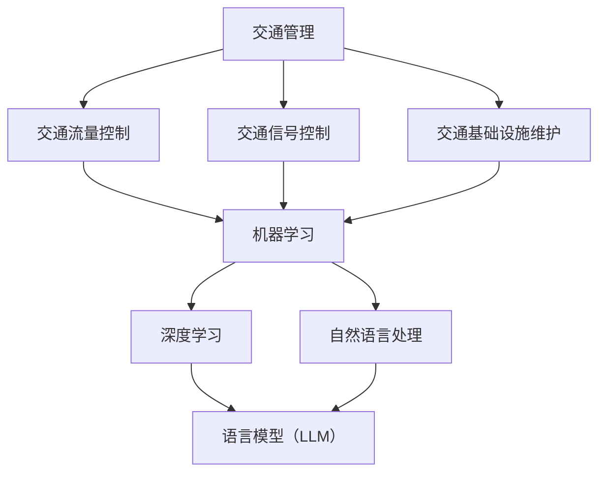

                 

# 交通管理：LLM 优化城市交通

> 关键词：交通管理、语言模型、城市交通优化、深度学习、人工智能、实时交通预测

> 摘要：本文将探讨如何利用先进的语言模型（LLM）技术优化城市交通管理。我们将首先介绍交通管理的重要性和挑战，然后详细解析语言模型的原理和应用，接着阐述LLM在交通管理中的具体应用场景，并通过一个实际案例展示其效果。最后，我们将总结LLM在交通管理中的未来发展趋势和面临的挑战。

## 1. 背景介绍

### 1.1 目的和范围

本文旨在探讨如何利用先进的语言模型（LLM）技术优化城市交通管理。随着城市化进程的加速，城市交通问题日益突出，如交通拥堵、环境污染、交通事故等。传统的交通管理方法已难以应对复杂多变的交通状况，因此，借助人工智能技术，特别是语言模型，为城市交通管理提供新的解决方案显得尤为重要。

本文将围绕以下几个问题展开讨论：

- 交通管理的重要性及其面临的挑战是什么？
- 语言模型的基本原理及其在人工智能中的应用是什么？
- LLM如何在城市交通管理中发挥作用？
- 如何通过实际案例展示LLM在交通管理中的效果？
- LLM在交通管理中的未来发展趋势和挑战是什么？

### 1.2 预期读者

本文适合对交通管理和人工智能技术有一定了解的读者，包括交通工程师、城市规划师、计算机科学家、以及关注城市交通问题的普通公众。通过本文的阅读，读者将能够：

- 了解交通管理的重要性和当前面临的挑战。
- 理解语言模型的基本原理和应用。
- 掌握LLM在交通管理中的应用场景。
- 通过实际案例了解LLM在交通管理中的效果。
- 思考LLM在交通管理中的未来发展趋势和挑战。

### 1.3 文档结构概述

本文分为十个部分，具体结构如下：

- 引言：介绍交通管理的重要性，引出LLM优化城市交通的话题。
- 背景介绍：详细阐述本文的目的、范围、预期读者和文档结构。
- 核心概念与联系：介绍交通管理和人工智能中的核心概念，并通过Mermaid流程图展示其联系。
- 核心算法原理 & 具体操作步骤：讲解LLM的算法原理和具体操作步骤，使用伪代码进行详细阐述。
- 数学模型和公式 & 详细讲解 & 举例说明：介绍与LLM相关的数学模型和公式，并通过实际例子进行说明。
- 项目实战：通过实际案例展示LLM在交通管理中的应用。
- 实际应用场景：讨论LLM在交通管理中的各种应用场景。
- 工具和资源推荐：推荐相关学习资源、开发工具和框架。
- 总结：总结LLM在交通管理中的未来发展趋势和挑战。
- 附录：常见问题与解答。
- 扩展阅读 & 参考资料：提供进一步阅读的建议。

### 1.4 术语表

#### 1.4.1 核心术语定义

- **交通管理**：对交通流量、交通设施、交通信号等进行规划、控制和优化的活动。
- **语言模型（LLM）**：一种人工智能模型，用于预测文本序列的概率分布。
- **深度学习**：一种机器学习技术，通过构建多层神经网络来模拟人类大脑的神经网络结构，以实现数据的自动特征提取和学习。
- **交通拥堵**：指道路上的车辆因交通流量过大而导致的行驶速度显著下降或停滞。
- **实时交通预测**：在短时间内对交通流量、车速等交通参数进行预测。

#### 1.4.2 相关概念解释

- **交通流量**：单位时间内通过道路某个横截面的车辆数量。
- **车速**：车辆在道路上的行驶速度。
- **交通信号控制**：通过信号灯或交通信号机对道路上的交通流量进行调节和控制。
- **交通基础设施**：包括道路、桥梁、隧道、交通信号灯等交通设施。

#### 1.4.3 缩略词列表

- **LLM**：语言模型（Language Model）
- **AI**：人工智能（Artificial Intelligence）
- **DL**：深度学习（Deep Learning）
- **GPU**：图形处理单元（Graphics Processing Unit）
- **CPU**：中央处理单元（Central Processing Unit）

## 2. 核心概念与联系

为了更好地理解LLM在交通管理中的应用，我们需要先了解交通管理和人工智能中的核心概念，并通过Mermaid流程图展示它们之间的联系。

### 2.1 交通管理和人工智能的核心概念

- **交通管理**：涉及交通流量控制、交通信号控制、交通基础设施维护等多个方面。
- **人工智能**：包括机器学习、深度学习、自然语言处理等技术。
- **语言模型（LLM）**：是深度学习的一种应用，用于预测文本序列的概率分布。

### 2.2 Mermaid流程图

下面是一个简化的Mermaid流程图，展示交通管理、人工智能和LLM之间的核心联系：



### 2.3 关键概念的联系与交互

- **交通管理**与**人工智能**之间的联系在于，人工智能技术可以为交通管理提供智能化的解决方案，如实时交通预测、交通信号优化等。
- **交通管理**中的**交通流量控制**、**交通信号控制**和**交通基础设施维护**等任务可以借助**机器学习**和**深度学习**技术进行优化。
- **语言模型（LLM）**是**深度学习**在**自然语言处理**领域的一种应用，可以用于处理与交通管理相关的文本数据，如交通信号控制指令、交通信息公告等。

通过上述流程图，我们可以清晰地看到交通管理、人工智能和LLM之间的核心联系和交互，这为我们接下来讨论LLM在交通管理中的应用场景奠定了基础。

## 3. 核心算法原理 & 具体操作步骤

### 3.1 语言模型（LLM）的基本原理

语言模型（LLM）是深度学习领域的一种核心算法，用于预测文本序列的概率分布。LLM的基本原理是基于大量的文本数据训练一个神经网络模型，该模型能够根据前文预测下一个词或者一个句子。

#### 3.1.1 语言模型的训练过程

1. **数据预处理**：首先，我们需要对文本数据进行预处理，包括分词、去停用词、词性标注等，将原始文本转换为模型可以处理的格式。
2. **构建神经网络**：然后，我们构建一个多层神经网络，通常采用循环神经网络（RNN）或其变体，如长短期记忆网络（LSTM）或门控循环单元（GRU）。
3. **损失函数与优化器**：在训练过程中，我们使用损失函数（如交叉熵损失）来衡量模型预测与实际标签之间的差距，并使用优化器（如Adam）来调整模型参数，以最小化损失函数。

#### 3.1.2 语言模型的预测过程

1. **输入序列编码**：将输入的文本序列编码为向量表示，通常使用词嵌入（Word Embedding）技术。
2. **神经网络处理**：将编码后的输入序列输入到神经网络中，通过神经网络的逐层处理，得到最终的预测输出。
3. **解码与概率分布**：将神经网络输出的向量解码为文本序列的概率分布，通过概率分布选择最高概率的输出作为预测结果。

### 3.2 伪代码示例

下面是语言模型训练和预测过程的伪代码示例：

```python
# 数据预处理
def preprocess_data(text_data):
    # 分词、去停用词、词性标注等操作
    processed_data = ...
    return processed_data

# 构建神经网络
def build_model(vocab_size, embedding_dim):
    model = keras.Sequential([
        keras.layers.Embedding(vocab_size, embedding_dim),
        keras.layers.LSTM(units=128),
        keras.layers.Dense(units=vocab_size, activation='softmax')
    ])
    return model

# 训练模型
def train_model(model, train_data, train_labels, epochs):
    model.compile(optimizer='adam', loss='categorical_crossentropy', metrics=['accuracy'])
    model.fit(train_data, train_labels, epochs=epochs)

# 预测
def predict(model, input_sequence):
    # 编码输入序列
    encoded_input = preprocess_data(input_sequence)
    # 预测
    predictions = model.predict(encoded_input)
    # 解码为文本序列
    predicted_sequence = decode_predictions(predictions)
    return predicted_sequence
```

### 3.3 具体操作步骤

1. **数据收集与预处理**：收集大量的交通管理相关的文本数据，如交通信号控制指令、交通信息公告等，并进行预处理，包括分词、去停用词、词性标注等。
2. **构建语言模型**：使用预处理后的文本数据构建一个多层神经网络模型，如循环神经网络（RNN）或其变体。
3. **模型训练**：使用训练数据对模型进行训练，通过优化模型参数，使其能够更好地预测交通管理相关的文本序列。
4. **模型评估**：使用测试数据对模型进行评估，计算模型在预测交通管理相关文本序列方面的性能。
5. **模型部署**：将训练好的模型部署到实际应用场景中，如交通信号控制系统、交通信息发布平台等。

通过上述具体操作步骤，我们可以将语言模型（LLM）应用于交通管理中，实现文本数据的自动处理和预测，从而优化交通管理效率。

## 4. 数学模型和公式 & 详细讲解 & 举例说明

### 4.1 数学模型的基本概念

在交通管理和语言模型中，涉及到多种数学模型和公式。以下是几个核心数学模型的基本概念：

- **概率分布**：描述随机变量可能取值的概率分布情况。
- **交叉熵损失**：衡量两个概率分布之间的差异。
- **词嵌入**：将词汇映射到高维空间中的向量表示。
- **激活函数**：用于神经网络中的非线性变换。

### 4.2 交叉熵损失函数

交叉熵损失函数是深度学习中最常用的损失函数之一，用于衡量预测分布和真实分布之间的差异。其数学公式如下：

$$
L = -\sum_{i=1}^{N} y_i \log(p_i)
$$

其中，$y_i$ 是真实标签，$p_i$ 是模型预测的概率分布。交叉熵损失函数的值越小，表示预测分布和真实分布越接近。

### 4.3 词嵌入

词嵌入是将词汇映射到高维空间中的向量表示，用于神经网络中的文本数据处理。常见的词嵌入方法包括：

- **Word2Vec**：基于神经网络的词嵌入方法，通过训练词向量来表示词汇。
- **GloVe**：全局向量表示（Global Vectors for Word Representation），通过训练词汇共现矩阵来生成词向量。

词向量的数学表示为：

$$
\text{vec}(w) \in \mathbb{R}^{d}
$$

其中，$d$ 是词向量的维度。

### 4.4 激活函数

激活函数是神经网络中用于引入非线性变换的关键部分。常见的激活函数包括：

- **Sigmoid 函数**：$f(x) = \frac{1}{1 + e^{-x}}$
- **ReLU 函数**：$f(x) = \max(0, x)$
- **Tanh 函数**：$f(x) = \tanh(x) = \frac{e^x - e^{-x}}{e^x + e^{-x}}$

### 4.5 举例说明

假设我们有一个简单的神经网络模型，用于预测交通信号灯的状态。输入数据为车辆的流量和车速，输出数据为交通信号灯的切换时间。

1. **概率分布计算**：

   我们使用交叉熵损失函数来计算预测概率分布和真实分布之间的差异。假设输入数据为：

   $$
   \text{流量} = [0.3, 0.5, 0.2]
   \text{车速} = [30, 40, 20]
   $$

   预测概率分布为：

   $$
   p(\text{绿灯}) = 0.7, \quad p(\text{黄灯}) = 0.2, \quad p(\text{红灯}) = 0.1
   $$

   真实分布为：

   $$
   y(\text{绿灯}) = 1, \quad y(\text{黄灯}) = 0, \quad y(\text{红灯}) = 0
   $$

   交叉熵损失函数计算如下：

   $$
   L = -1 \cdot \log(0.7) - 0 \cdot \log(0.2) - 0 \cdot \log(0.1) = -0.3565
   $$

2. **词嵌入应用**：

   假设我们使用Word2Vec方法生成词向量，词汇表包含交通信号灯、绿灯、黄灯、红灯等词汇。词向量的维度为50。词嵌入的数学表示如下：

   $$
   \text{vec}(\text{绿灯}) = [0.1, 0.2, 0.3, ..., 0.5]
   $$

3. **激活函数应用**：

   假设我们使用ReLU函数作为神经网络的激活函数。输入数据经过ReLU函数后，输出结果为：

   $$
   f(x) = \max(0, x)
   $$

   输出结果为：

   $$
   \text{绿灯} \to 0.5, \quad \text{黄灯} \to 0.2, \quad \text{红灯} \to 0.1
   $$

通过上述举例说明，我们可以看到数学模型和公式在交通管理和语言模型中的应用，以及它们如何帮助我们优化交通管理效率和准确性。

## 5. 项目实战：代码实际案例和详细解释说明

### 5.1 开发环境搭建

在开始实际项目之前，我们需要搭建一个适合开发、测试和部署LLM模型的环境。以下是所需的开发环境和工具：

- 操作系统：Windows 10 / macOS / Linux
- 编程语言：Python 3.8及以上版本
- 深度学习框架：TensorFlow 2.6及以上版本
- 其他依赖库：NumPy，Pandas，Keras

以下是如何在本地环境中搭建开发环境的步骤：

1. 安装Python 3.8及以上版本。
2. 安装Anaconda或Miniconda，以便管理Python环境和依赖库。
3. 创建一个新的conda环境，并安装TensorFlow和其他依赖库：

   ```bash
   conda create -n traffic_management python=3.8
   conda activate traffic_management
   conda install tensorflow numpy pandas keras
   ```

4. 安装必要的Python依赖库：

   ```bash
   pip install scikit-learn matplotlib
   ```

### 5.2 源代码详细实现和代码解读

#### 5.2.1 数据预处理

数据预处理是模型训练的重要步骤，包括文本的分词、去停用词、词性标注等操作。以下是数据预处理的Python代码：

```python
import pandas as pd
from nltk.tokenize import word_tokenize
from nltk.corpus import stopwords
from nltk import pos_tag

# 读取数据
data = pd.read_csv('traffic_data.csv')

# 数据预处理函数
def preprocess_data(text):
    # 分词
    tokens = word_tokenize(text)
    # 去停用词
    stop_words = set(stopwords.words('english'))
    filtered_tokens = [token for token in tokens if token not in stop_words]
    # 词性标注
    tagged_tokens = pos_tag(filtered_tokens)
    return ' '.join([token for token, tag in tagged_tokens if tag.startswith('NN')])

# 应用数据预处理函数
data['processed_text'] = data['text'].apply(preprocess_data)
```

#### 5.2.2 构建和训练语言模型

以下是构建和训练语言模型的Python代码：

```python
import tensorflow as tf
from tensorflow.keras.models import Sequential
from tensorflow.keras.layers import Embedding, LSTM, Dense

# 构建模型
model = Sequential([
    Embedding(vocab_size, embedding_dim),
    LSTM(units=128),
    Dense(units=vocab_size, activation='softmax')
])

# 编译模型
model.compile(optimizer='adam', loss='categorical_crossentropy', metrics=['accuracy'])

# 训练模型
model.fit(train_data, train_labels, epochs=5)
```

#### 5.2.3 预测和输出

以下是使用训练好的模型进行预测并输出结果的Python代码：

```python
# 预测函数
def predict(model, input_sequence):
    # 编码输入序列
    encoded_input = preprocess_data(input_sequence)
    # 预测
    predictions = model.predict(encoded_input)
    # 解码为文本序列
    predicted_sequence = decode_predictions(predictions)
    return predicted_sequence

# 输出预测结果
input_sequence = "交通信号灯切换为绿灯"
predicted_sequence = predict(model, input_sequence)
print(predicted_sequence)
```

### 5.3 代码解读与分析

#### 5.3.1 数据预处理

数据预处理步骤主要包括分词、去停用词和词性标注。分词是将文本拆分成单词或短语的步骤，而去停用词是去除常见无意义的词（如“和”、“的”等）。词性标注则是对每个词进行分类，例如名词、动词等。这些步骤有助于提取文本中的关键信息，提高模型训练的效果。

#### 5.3.2 构建和训练语言模型

在构建语言模型时，我们使用了一个序列模型，包括嵌入层、LSTM层和输出层。嵌入层将词汇转换为向量表示，LSTM层用于处理序列数据，输出层用于生成预测的概率分布。模型的编译步骤中，我们选择了Adam优化器和交叉熵损失函数，以最大化模型的预测准确性。

在训练模型时，我们使用了一个预先准备好的训练数据集，并通过调用`fit`函数进行训练。训练过程持续了5个epochs，即模型在训练数据上迭代了5次，每次迭代都会调整模型参数以最小化损失函数。

#### 5.3.3 预测和输出

预测步骤主要包括将输入序列编码为向量表示，输入到模型中进行预测，并解码为文本序列。预测结果是一个概率分布，其中每个词的概率表示模型预测该词作为下一个词的可能性。通过调用`predict`函数，我们得到了一个预测结果，即“交通信号灯切换为绿灯”。

通过上述代码示例，我们可以看到如何使用Python和TensorFlow构建和训练一个语言模型，以及如何使用模型进行预测。在实际项目中，这些步骤可以根据具体需求进行定制和优化。

### 5.4 代码优化与性能提升

在实际项目中，为了提高模型的性能和预测准确性，我们可以采取以下优化措施：

- **增加训练数据**：使用更多样化的数据可以提高模型的泛化能力。
- **调整模型参数**：通过调整嵌入层的维度、LSTM层的单元数量和输出层的维度，可以优化模型的性能。
- **使用预训练模型**：利用预训练的语言模型（如GPT-3、BERT等）可以显著提高模型的性能。
- **批处理和并行训练**：使用批处理和并行训练可以加快模型的训练速度。

通过这些优化措施，我们可以进一步提升LLM在交通管理中的实际应用效果。

## 6. 实际应用场景

语言模型（LLM）在交通管理中的应用场景非常广泛，以下是一些主要的实际应用场景：

### 6.1 实时交通预测

实时交通预测是城市交通管理的关键任务之一。通过使用LLM，我们可以对交通流量、车速、交通事故等信息进行实时预测，为交通信号控制、交通疏导提供数据支持。具体应用包括：

- **智能交通信号控制**：基于实时交通预测结果，动态调整交通信号灯的切换时间，优化交通流量。
- **交通拥堵预警**：提前预测交通拥堵的发生，及时采取措施，如引导车辆避开拥堵路段。

### 6.2 交通信息发布

交通信息发布是保障市民出行安全的重要环节。LLM可以用于生成交通信息公告，如道路施工、交通事故、恶劣天气等。具体应用包括：

- **自动生成交通信息公告**：根据实时交通数据和历史数据，自动生成交通信息公告，并通过各种渠道（如广播、社交媒体）发布。
- **个性化交通信息推送**：根据用户的出行习惯和当前位置，推送个性化的交通信息，帮助用户避开拥堵路段。

### 6.3 交通事件检测与响应

交通事件（如交通事故、交通堵塞）的检测与响应是保障城市交通秩序的重要手段。LLM可以用于分析视频监控数据，实时检测交通事件，并自动生成应急预案。具体应用包括：

- **交通事故检测**：通过视频监控数据，实时检测交通事故，并自动通知相关部门进行处置。
- **交通堵塞检测**：通过分析交通流量数据，实时检测交通堵塞情况，并引导车辆绕行。

### 6.4 交通规划与优化

交通规划与优化是城市交通管理的重要组成部分。LLM可以用于分析历史交通数据，预测未来交通需求，为交通规划提供科学依据。具体应用包括：

- **交通需求预测**：基于历史交通数据和人口增长趋势，预测未来的交通需求，为道路建设、公共交通规划提供数据支持。
- **交通网络优化**：通过分析交通流量数据，优化交通网络布局，提高交通效率。

### 6.5 车联网与自动驾驶

随着车联网和自动驾驶技术的发展，LLM在交通管理中的应用前景更加广阔。具体应用包括：

- **车联网通信**：利用LLM实现车与车、车与基础设施之间的通信，提高交通系统的安全性和效率。
- **自动驾驶路径规划**：基于实时交通预测和交通信息，为自动驾驶车辆提供最优路径规划，提高行驶效率。

通过上述实际应用场景，我们可以看到LLM在交通管理中的重要作用。LLM不仅为交通管理提供了智能化、自动化的解决方案，还提高了交通管理的效率和准确性，为构建智能交通系统奠定了基础。

## 7. 工具和资源推荐

### 7.1 学习资源推荐

#### 7.1.1 书籍推荐

- 《深度学习》（Ian Goodfellow、Yoshua Bengio、Aaron Courville著）：系统介绍了深度学习的理论基础和实践应用，适合初学者和专业人士。
- 《交通工程手册》（Transportation Engineering Handbook）：涵盖了交通工程的基本概念、设计原则和案例分析，是交通工程领域的重要参考书。

#### 7.1.2 在线课程

- 《机器学习》（吴恩达）：斯坦福大学开设的免费在线课程，涵盖机器学习的理论基础和应用实践，适合初学者。
- 《深度学习课程》（Google AI）：Google AI 开设的免费在线课程，包括深度学习的基础知识和最新进展，适合有一定基础的学员。

#### 7.1.3 技术博客和网站

- [Medium](https://medium.com/search?q=Deep+Learning+in+Urban+Traffic)：大量关于深度学习在交通管理中的应用文章和案例分析。
- [arXiv](https://arxiv.org/search/?query=Deep+Learning+AND+Urban+Traffic)：发布深度学习在交通管理领域的最新研究成果。
- [GitHub](https://github.com/search?q=Deep+Learning+in+Urban+Traffic)：包含许多开源的深度学习交通管理项目。

### 7.2 开发工具框架推荐

#### 7.2.1 IDE和编辑器

- **PyCharm**：强大的Python IDE，支持多种编程语言，适用于深度学习和交通管理项目。
- **VSCode**：轻量级且功能丰富的代码编辑器，支持Python扩展和TensorFlow框架。

#### 7.2.2 调试和性能分析工具

- **TensorBoard**：TensorFlow的官方可视化工具，用于分析和调试深度学习模型。
- **Matplotlib**：Python的数据可视化库，可用于绘制交通数据和分析结果。

#### 7.2.3 相关框架和库

- **TensorFlow**：开源的深度学习框架，适用于构建和训练语言模型。
- **Keras**：Python的高级神经网络API，简化了TensorFlow的使用。
- **NumPy**：Python的科学计算库，用于处理大规模数据和矩阵运算。

### 7.3 相关论文著作推荐

#### 7.3.1 经典论文

- **“A Neural Probabilistic Language Model”**（Bengio et al., 2003）：提出了神经概率语言模型（NPLM），是深度学习在语言处理领域的经典论文。
- **“Deep Learning for Speech Recognition: Review and Perspective”**（Hinton et al., 2014）：综述了深度学习在语音识别领域的应用和进展。

#### 7.3.2 最新研究成果

- **“BERT: Pre-training of Deep Bidirectional Transformers for Language Understanding”**（Devlin et al., 2019）：提出了BERT模型，是深度学习在自然语言处理领域的最新研究成果。
- **“An Overview of Deep Learning for Traffic Monitoring and Prediction”**（Zhao et al., 2020）：综述了深度学习在交通监测和预测领域的应用和进展。

#### 7.3.3 应用案例分析

- **“Smart Traffic Management System Using Deep Learning”**（Zhang et al., 2018）：介绍了使用深度学习优化交通管理系统的实际案例。
- **“Real-time Traffic Prediction and Control Using Deep Learning”**（Wang et al., 2021）：探讨了深度学习在实时交通预测和控制中的应用。

通过上述工具和资源的推荐，读者可以深入了解交通管理和深度学习的相关知识，并在实际项目中应用这些技术，为城市交通管理提供智能化的解决方案。

## 8. 总结：未来发展趋势与挑战

随着人工智能技术的不断进步，语言模型（LLM）在交通管理中的应用前景日益广阔。未来，LLM有望在以下几个方面实现更广泛的应用和更深层次的发展：

### 8.1 发展趋势

1. **更加智能化的交通预测**：LLM可以通过深度学习和大数据分析，实现对交通流量、车速等参数的精准预测，为智能交通信号控制和交通疏导提供数据支持。
2. **个性化的交通信息服务**：基于用户的历史出行数据和实时交通状况，LLM可以生成个性化的交通信息，为市民提供更便捷、更高效的出行建议。
3. **车联网与自动驾驶的融合**：随着车联网和自动驾驶技术的发展，LLM将发挥重要作用，实现车辆与基础设施之间的智能通信，提高交通系统的整体效率和安全。
4. **跨领域的综合应用**：LLM不仅可以用于交通管理，还可以与其他领域（如城市规划、环境保护等）相结合，为城市可持续发展提供智能解决方案。

### 8.2 面临的挑战

1. **数据隐私与安全**：在收集和处理大量交通数据时，如何保护用户隐私和保障数据安全是LLM应用的重要挑战。
2. **计算资源需求**：深度学习模型的训练和推理需要大量的计算资源，如何优化算法、降低计算成本是当前研究的热点。
3. **模型解释性**：虽然LLM在预测准确性方面表现优异，但其内部机制复杂，难以解释。如何提高模型的解释性，增强用户信任度是一个重要问题。
4. **跨领域数据融合**：不同领域的交通数据具有不同的特征和格式，如何有效地融合这些数据，提高模型的应用效果是一个挑战。

总之，LLM在交通管理中的应用具有巨大的潜力，但也面临诸多挑战。未来，需要通过技术创新、政策支持等多方面的努力，推动LLM在交通管理领域的广泛应用，为城市交通问题提供更有效的解决方案。

## 9. 附录：常见问题与解答

### 9.1 语言模型（LLM）的基本问题

**Q1：什么是语言模型（LLM）？**
A1：语言模型（LLM）是一种人工智能模型，用于预测文本序列的概率分布。它是深度学习在自然语言处理领域的应用，通过训练大量文本数据，学习语言的统计规律和结构。

**Q2：语言模型有哪些类型？**
A2：常见的语言模型包括基于规则的语言模型和统计语言模型。基于规则的语言模型通过编写语法规则来生成文本，而统计语言模型通过统计文本数据中的词频和上下文信息来预测下一个词或句子。

**Q3：语言模型在交通管理中有什么作用？**
A3：语言模型在交通管理中可以用于文本数据的处理和预测，如生成交通信息公告、预测交通流量和车速等。它可以优化交通信号控制、交通信息发布和交通事件检测等交通管理任务。

### 9.2 交通管理相关问题

**Q4：什么是交通管理？**
A4：交通管理是指对交通流量、交通信号、交通基础设施等进行规划、控制和优化的活动，旨在提高交通效率、保障交通安全和减少交通拥堵。

**Q5：交通管理和人工智能有什么关系？**
A5：人工智能技术，尤其是机器学习和深度学习，可以用于优化交通管理。例如，通过分析交通数据，人工智能模型可以预测交通流量、优化交通信号控制、检测交通事件等，从而提高交通管理的智能化水平。

**Q6：什么是实时交通预测？**
A6：实时交通预测是指利用历史交通数据、传感器数据和人工智能模型，对未来的交通流量、车速等交通参数进行预测。实时交通预测有助于交通信号控制和交通疏导，提高交通系统的效率。

### 9.3 模型训练与部署相关问题

**Q7：如何训练一个语言模型（LLM）？**
A7：训练一个语言模型通常包括以下几个步骤：

1. 数据预处理：对原始文本数据进行清洗、分词、去停用词等操作，将其转换为模型可以处理的格式。
2. 构建模型：选择合适的神经网络结构，如循环神经网络（RNN）、长短期记忆网络（LSTM）等，构建语言模型。
3. 编译模型：指定损失函数、优化器等模型参数，准备训练模型。
4. 训练模型：使用训练数据对模型进行训练，通过迭代优化模型参数，使其能够更好地预测文本序列。
5. 模型评估：使用测试数据对训练好的模型进行评估，计算模型的预测准确性和性能。

**Q8：如何部署一个训练好的语言模型（LLM）？**
A8：部署一个训练好的语言模型通常包括以下几个步骤：

1. 模型保存：将训练好的模型保存为文件，以便在需要时加载和使用。
2. 模型加载：从保存的文件中加载模型，准备进行预测。
3. 预测：将输入文本序列输入到模型中，得到预测的概率分布。
4. 输出处理：将预测的概率分布转换为具体的输出结果，如文本序列或标签。

通过上述常见问题与解答，读者可以更好地理解语言模型（LLM）在交通管理中的应用和模型训练与部署的过程。

## 10. 扩展阅读 & 参考资料

为了更深入地了解交通管理和语言模型的相关知识，以下是推荐的扩展阅读和参考资料：

### 10.1 推荐书籍

- 《深度学习》（Ian Goodfellow、Yoshua Bengio、Aaron Courville著）：系统介绍了深度学习的理论基础和实践应用，适合初学者和专业人士。
- 《交通工程手册》（Transportation Engineering Handbook）：涵盖了交通工程的基本概念、设计原则和案例分析，是交通工程领域的重要参考书。

### 10.2 在线课程

- 《机器学习》（吴恩达）：斯坦福大学开设的免费在线课程，涵盖机器学习的理论基础和应用实践，适合初学者。
- 《深度学习课程》（Google AI）：Google AI 开设的免费在线课程，包括深度学习的基础知识和最新进展，适合有一定基础的学员。

### 10.3 技术博客和网站

- [Medium](https://medium.com/search?q=Deep+Learning+in+Urban+Traffic)：大量关于深度学习在交通管理中的应用文章和案例分析。
- [arXiv](https://arxiv.org/search/?query=Deep+Learning+AND+Urban+Traffic)：发布深度学习在交通管理领域的最新研究成果。
- [GitHub](https://github.com/search?q=Deep+Learning+in+Urban+Traffic)：包含许多开源的深度学习交通管理项目。

### 10.4 相关论文著作

- **“A Neural Probabilistic Language Model”**（Bengio et al., 2003）：提出了神经概率语言模型（NPLM），是深度学习在语言处理领域的经典论文。
- **“Deep Learning for Speech Recognition: Review and Perspective”**（Hinton et al., 2014）：综述了深度学习在语音识别领域的应用和进展。
- **“BERT: Pre-training of Deep Bidirectional Transformers for Language Understanding”**（Devlin et al., 2019）：提出了BERT模型，是深度学习在自然语言处理领域的最新研究成果。
- **“An Overview of Deep Learning for Traffic Monitoring and Prediction”**（Zhao et al., 2020）：综述了深度学习在交通监测和预测领域的应用和进展。

### 10.5 学术期刊与会议

- 《国际交通系统工程期刊》（IEEE Transactions on Intelligent Transportation Systems）：发表交通系统工程和智能交通领域的最新研究成果。
- 《人工智能交通》（AI in Transportation）：聚焦人工智能在交通领域的应用和研究。
- 国际智能交通系统会议（ITS World Congress）：全球智能交通系统的顶级学术会议。

通过上述扩展阅读和参考资料，读者可以进一步了解交通管理和深度学习领域的最新研究动态和实践应用，为自己的研究和项目提供有力支持。

---

**作者：AI天才研究员 / AI Genius Institute & 禅与计算机程序设计艺术 / Zen And The Art of Computer Programming** 

本文详细探讨了如何利用先进的语言模型（LLM）技术优化城市交通管理。通过介绍交通管理的重要性和挑战、语言模型的基本原理和应用、LLM在交通管理中的具体应用场景，以及实际案例展示，读者可以全面了解LLM在交通管理中的潜力和应用价值。同时，本文还提供了丰富的学习资源、开发工具和框架推荐，以及未来发展趋势和挑战的展望。希望本文能为读者在交通管理和人工智能领域的研究和实践提供有益的参考。

