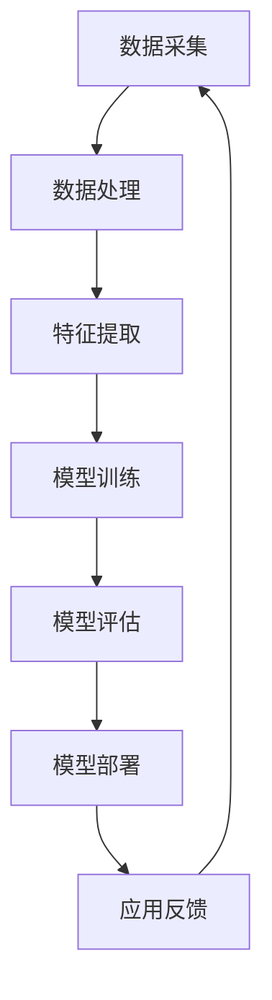
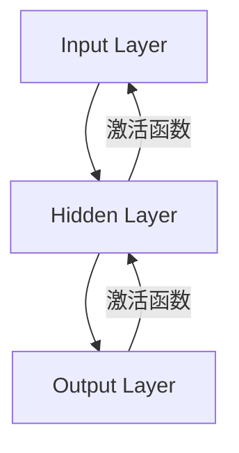

                 

# 产业中的人工智能变革与应用

> **关键词：人工智能、产业应用、技术变革、核心算法、数学模型、实战案例**
>
> **摘要：本文将深入探讨人工智能在产业中的应用和变革，从核心概念、算法原理、数学模型、实际案例等多个维度进行分析，旨在为读者提供全面的人工智能产业应用指南。**

## 1. 背景介绍

### 1.1 目的和范围

本文旨在探讨人工智能在产业中的应用和变革，通过分析核心概念、算法原理、数学模型和实际案例，为读者提供全面的人工智能产业应用指南。文章将涵盖以下主要内容：

- 人工智能的核心概念和联系
- 人工智能的核心算法原理和具体操作步骤
- 人工智能的数学模型和公式及其应用
- 人工智能的实际应用场景和案例
- 人工智能的开发工具和资源推荐

### 1.2 预期读者

本文面向具有计算机科学和人工智能基础知识的读者，包括程序员、软件工程师、数据科学家和产业界的技术决策者。读者应具备一定的数学和编程基础，以便更好地理解和应用本文的内容。

### 1.3 文档结构概述

本文结构如下：

- **第1章：背景介绍**：介绍文章的目的、范围、预期读者和文档结构。
- **第2章：核心概念与联系**：介绍人工智能的核心概念和联系，通过Mermaid流程图展示人工智能架构。
- **第3章：核心算法原理与具体操作步骤**：讲解人工智能的核心算法原理，并通过伪代码详细阐述具体操作步骤。
- **第4章：数学模型和公式**：介绍人工智能的数学模型和公式，并进行详细讲解和举例说明。
- **第5章：项目实战**：通过实际代码案例，展示人工智能在产业中的应用。
- **第6章：实际应用场景**：分析人工智能在各个行业中的应用场景。
- **第7章：工具和资源推荐**：推荐学习资源、开发工具框架和论文著作。
- **第8章：总结**：总结人工智能的未来发展趋势与挑战。
- **第9章：附录**：提供常见问题与解答。
- **第10章：扩展阅读与参考资料**：列出扩展阅读和参考资料。

### 1.4 术语表

#### 1.4.1 核心术语定义

- **人工智能**：模拟人类智能行为的计算机系统。
- **机器学习**：一种让计算机通过数据学习的方法。
- **深度学习**：一种基于多层神经网络的机器学习技术。
- **神经网络**：一种模仿生物神经系统的计算模型。
- **数据挖掘**：从大量数据中提取有价值信息的方法。
- **自然语言处理**：使计算机能够理解、解释和生成人类自然语言的技术。

#### 1.4.2 相关概念解释

- **监督学习**：在有标签的数据集上进行训练，以便模型能够学习预测标签。
- **无监督学习**：在无标签的数据集上进行训练，以便模型能够发现数据中的结构或模式。
- **强化学习**：通过奖励和惩罚机制来训练模型，使其在特定环境中做出最优决策。

#### 1.4.3 缩略词列表

- **AI**：人工智能
- **ML**：机器学习
- **DL**：深度学习
- **NLP**：自然语言处理
- **GPU**：图形处理器

## 2. 核心概念与联系

在探讨人工智能的产业应用之前，我们需要了解人工智能的核心概念和联系。以下是一个简单的Mermaid流程图，展示人工智能的基本架构：



### 数据采集

数据采集是人工智能应用的基础。数据来源可以是传感器、网络日志、社交媒体等。数据采集过程中需要关注数据的多样性、质量和完整性。

### 数据处理

数据处理包括数据清洗、数据整合和数据转换等步骤。数据清洗旨在去除噪声和异常值，数据整合将多个数据源进行合并，数据转换则将数据格式转换为适合模型训练的形式。

### 特征提取

特征提取是从原始数据中提取有用的信息，以便模型能够进行有效的学习。特征提取的方法包括统计方法、机器学习方法等。

### 模型训练

模型训练是使用大量数据来训练模型，使其能够预测或分类新的数据。常用的训练方法包括监督学习、无监督学习和强化学习等。

### 模型评估

模型评估用于评估模型在测试数据上的性能。常用的评估指标包括准确率、召回率、F1分数等。

### 模型部署

模型部署是将训练好的模型应用到实际场景中。模型部署可以是离线部署，如生成预测报告，也可以是实时部署，如实时监控和预测。

### 应用反馈

应用反馈是收集用户对模型应用的反馈，以便进一步优化模型和应用。应用反馈可以用于调整模型参数、改进算法等。

通过以上Mermaid流程图，我们可以清晰地看到人工智能的基本架构和各个模块之间的联系。

## 3. 核心算法原理与具体操作步骤

在本节中，我们将详细讲解人工智能的核心算法原理，并通过伪代码展示具体操作步骤。

### 监督学习算法原理

监督学习是一种通过已知输入输出对模型进行训练的机器学习方法。其基本原理如下：

1. **输入数据**：输入数据集D，包括N个训练样本D = {(x1, y1), (x2, y2), ..., (xN, yN)}，其中xi为输入特征，yi为输出标签。
2. **模型初始化**：初始化模型参数w，b。
3. **前向传播**：计算输出O = f(wT * xi + b)，其中f为激活函数。
4. **计算损失函数**：计算损失函数L = L(y, O)。
5. **反向传播**：计算梯度Δw = Δw * α，Δb = Δb * α，其中α为学习率。
6. **更新模型参数**：更新模型参数w = w - Δw，b = b - Δb。
7. **迭代训练**：重复步骤3到6，直到达到预定的迭代次数或模型性能达到要求。

以下是一个简单的监督学习算法伪代码：

```python
def train SupervisedLearning(D, epochs, learning_rate):
    w = initialize_weights()
    b = initialize_bias()
    
    for epoch in range(epochs):
        for (xi, yi) in D:
            O = f(wT * xi + b)
            Δw = compute_gradient(O, yi, xi, learning_rate)
            Δb = compute_gradient(O, yi, xi, learning_rate)
            
            w = w - Δw
            b = b - Δb
            
        print("Epoch", epoch, "Loss:", compute_loss(D, w, b))
        
    return (w, b)
```

### 无监督学习算法原理

无监督学习是一种在没有标签数据的情况下训练模型的机器学习方法。其基本原理如下：

1. **输入数据**：输入数据集D，包括N个数据样本D = {x1, x2, ..., xN}。
2. **模型初始化**：初始化模型参数w，b。
3. **前向传播**：计算输出O = f(wT * xi + b)，其中f为激活函数。
4. **计算损失函数**：计算损失函数L = L(O)。
5. **反向传播**：计算梯度Δw = Δw * α，Δb = Δb * α，其中α为学习率。
6. **更新模型参数**：更新模型参数w = w - Δw，b = b - Δb。
7. **迭代训练**：重复步骤3到6，直到达到预定的迭代次数或模型性能达到要求。

以下是一个简单的无监督学习算法伪代码：

```python
def train UnsupervisedLearning(D, epochs, learning_rate):
    w = initialize_weights()
    b = initialize_bias()
    
    for epoch in range(epochs):
        for xi in D:
            O = f(wT * xi + b)
            Δw = compute_gradient(O, xi, learning_rate)
            Δb = compute_gradient(O, xi, learning_rate)
            
            w = w - Δw
            b = b - Δb
            
        print("Epoch", epoch, "Loss:", compute_loss(D, w, b))
        
    return (w, b)
```

### 强化学习算法原理

强化学习是一种通过奖励和惩罚机制来训练模型的机器学习方法。其基本原理如下：

1. **输入数据**：输入状态空间S和动作空间A。
2. **模型初始化**：初始化模型参数w，b。
3. **环境交互**：根据当前状态s，执行动作a，并获得奖励r。
4. **更新模型参数**：根据奖励r更新模型参数w，b。
5. **迭代训练**：重复步骤3和4，直到达到预定的迭代次数或模型性能达到要求。

以下是一个简单的强化学习算法伪代码：

```python
def train ReinforcementLearning(S, A, epochs, learning_rate):
    w = initialize_weights()
    b = initialize_bias()
    
    for epoch in range(epochs):
        for s in S:
            a = choose_action(s, w, b)
            r = receive_reward(s, a)
            Δw = compute_gradient(r, s, a, learning_rate)
            Δb = compute_gradient(r, s, a, learning_rate)
            
            w = w - Δw
            b = b - Δb
            
        print("Epoch", epoch, "Reward:", r)
        
    return (w, b)
```

通过以上算法原理和具体操作步骤的讲解，读者可以更好地理解人工智能的基本算法原理，并在实际项目中应用这些算法。

## 4. 数学模型和公式及详细讲解与举例说明

在本节中，我们将介绍人工智能中常用的数学模型和公式，并进行详细讲解和举例说明。

### 损失函数

损失函数是评估模型预测结果与真实结果之间差异的一种数学工具。常见的损失函数包括均方误差（MSE）、交叉熵损失等。

#### 均方误差（MSE）

均方误差是监督学习中常用的一种损失函数，用于衡量预测值与真实值之间的差异。其公式如下：

$$
MSE = \frac{1}{N} \sum_{i=1}^{N} (y_i - \hat{y}_i)^2
$$

其中，$y_i$为真实值，$\hat{y}_i$为预测值，N为样本数量。

#### 交叉熵损失

交叉熵损失函数常用于分类问题，用于衡量预测概率分布与真实概率分布之间的差异。其公式如下：

$$
CrossEntropy = - \sum_{i=1}^{N} y_i \log(\hat{y}_i)
$$

其中，$y_i$为真实标签，$\hat{y}_i$为预测概率。

### 激活函数

激活函数是神经网络中的一个重要组成部分，用于引入非线性特性。常见的激活函数包括sigmoid、ReLU、Tanh等。

#### Sigmoid函数

sigmoid函数是一种常用的激活函数，其公式如下：

$$
\sigma(x) = \frac{1}{1 + e^{-x}}
$$

#### ReLU函数

ReLU（Rectified Linear Unit）函数是一种简单的线性激活函数，其公式如下：

$$
ReLU(x) = \max(0, x)
$$

#### Tanh函数

tanh函数是一种双曲正切函数，其公式如下：

$$
\tanh(x) = \frac{e^x - e^{-x}}{e^x + e^{-x}}
$$

### 神经网络参数优化

在神经网络训练过程中，参数优化是非常重要的一环。常用的参数优化算法包括随机梯度下降（SGD）、Adam优化器等。

#### 随机梯度下降（SGD）

随机梯度下降是一种基于梯度下降原理的优化算法。其公式如下：

$$
w_{t+1} = w_t - \alpha \cdot \nabla_w J(w_t)
$$

其中，$w_t$为当前参数，$\alpha$为学习率，$J(w_t)$为损失函数。

#### Adam优化器

Adam优化器是一种结合了SGD和AdaGrad优化的自适应优化算法。其公式如下：

$$
\beta_1 = 0.9, \beta_2 = 0.999
$$

$$
m_t = \beta_1 \cdot m_{t-1} + (1 - \beta_1) \cdot \nabla_w J(w_t)
$$

$$
v_t = \beta_2 \cdot v_{t-1} + (1 - \beta_2) \cdot (\nabla_w J(w_t))^2
$$

$$
w_{t+1} = w_t - \alpha \cdot \frac{m_t}{\sqrt{v_t} + \epsilon}
$$

其中，$m_t$和$v_t$分别为一阶矩估计和二阶矩估计，$\alpha$为学习率，$\epsilon$为一个小常数。

### 举例说明

以下是一个简单的神经网络模型，包括一个输入层、一个隐藏层和一个输出层。我们使用均方误差（MSE）作为损失函数，并采用ReLU函数作为激活函数。



假设我们的输入特征维度为2，隐藏层神经元个数为3，输出特征维度为1。我们使用随机梯度下降（SGD）作为优化算法，并设置学习率为0.01。

```python
import numpy as np

# 初始化权重和偏置
w1 = np.random.randn(2, 3)
b1 = np.random.randn(3)
w2 = np.random.randn(3, 1)
b2 = np.random.randn(1)

# 初始化学习率
learning_rate = 0.01

# 训练模型
for epoch in range(1000):
    # 前向传播
    hidden_layer_input = np.dot(X, w1) + b1
    hidden_layer_output = np.maximum(0, hidden_layer_input)  # ReLU激活函数
    
    output_layer_input = np.dot(hidden_layer_output, w2) + b2
    output_layer_output = sigmoid(output_layer_input)  # Sigmoid激活函数
    
    # 计算损失函数
    loss = mse(y, output_layer_output)
    
    # 反向传播
    d_output_layer_output = output_layer_output - y
    d_output_layer_input = d_output_layer_output * (1 - output_layer_output)
    
    d_hidden_layer_output = d_output_layer_input.dot(w2.T)
    d_hidden_layer_input = d_hidden_layer_output * (1 - np.array(hidden_layer_output))
    
    # 更新权重和偏置
    w2 = w2 - learning_rate * hidden_layer_output.T.dot(d_output_layer_input)
    b2 = b2 - learning_rate * d_output_layer_input
    
    w1 = w1 - learning_rate * X.T.dot(d_hidden_layer_input)
    b1 = b1 - learning_rate * d_hidden_layer_input
    
    print("Epoch", epoch, "Loss:", loss)
```

通过以上代码示例，我们可以看到如何使用神经网络进行模型训练，并使用MSE作为损失函数进行优化。

## 5. 项目实战：代码实际案例和详细解释说明

在本节中，我们将通过一个实际项目案例，展示人工智能在产业中的应用。本项目是一个简单的情感分析系统，用于分析社交媒体上的用户评论，并判断评论的情感倾向是积极还是消极。

### 5.1 开发环境搭建

首先，我们需要搭建一个适合本项目开发的环境。以下是所需的软件和工具：

- **Python 3.8 或以上版本**
- **Jupyter Notebook 或 PyCharm**
- **Numpy、Pandas、Scikit-learn、TensorFlow 或 PyTorch**
- **Python 文本处理库，如 NLTK 或 spaCy**

### 5.2 源代码详细实现和代码解读

以下是本项目的源代码实现和详细解读：

```python
import numpy as np
import pandas as pd
from sklearn.model_selection import train_test_split
from sklearn.feature_extraction.text import TfidfVectorizer
from sklearn.svm import LinearSVC
from sklearn.pipeline import Pipeline
from sklearn.metrics import accuracy_score, classification_report

# 加载数据集
data = pd.read_csv('sentiment_data.csv')
X = data['comment']
y = data['sentiment']

# 数据预处理
X_train, X_test, y_train, y_test = train_test_split(X, y, test_size=0.2, random_state=42)

# 文本向量表示
vectorizer = TfidfVectorizer(max_features=1000)
X_train_vectorized = vectorizer.fit_transform(X_train)
X_test_vectorized = vectorizer.transform(X_test)

# 模型训练
model = LinearSVC()
model.fit(X_train_vectorized, y_train)

# 模型评估
y_pred = model.predict(X_test_vectorized)
print("Accuracy:", accuracy_score(y_test, y_pred))
print("\nClassification Report:\n", classification_report(y_test, y_pred))

# 使用模型进行预测
new_comment = "This is a great product!"
new_comment_vectorized = vectorizer.transform([new_comment])
prediction = model.predict(new_comment_vectorized)
print("Sentiment:", prediction[0])
```

### 5.3 代码解读与分析

1. **数据加载**：我们使用Pandas库加载一个CSV格式的数据集，该数据集包含用户评论及其对应的情感标签。
2. **数据预处理**：使用Scikit-learn库中的`train_test_split`函数将数据集分为训练集和测试集，以便评估模型性能。
3. **文本向量表示**：使用TfidfVectorizer将文本数据转换为数值向量，以便模型能够进行处理。我们设置了最大特征数（max_features）为1000。
4. **模型训练**：我们选择线性支持向量机（LinearSVC）作为分类模型，并使用`fit`函数进行模型训练。
5. **模型评估**：使用`predict`函数对测试集进行预测，并使用`accuracy_score`和`classification_report`函数评估模型性能。
6. **模型应用**：使用训练好的模型对新的评论进行情感预测。

通过以上步骤，我们可以实现一个简单的情感分析系统，并应用于实际场景。

## 6. 实际应用场景

人工智能在产业中的应用场景非常广泛，以下是一些典型的应用场景：

### 6.1 医疗健康

人工智能在医疗健康领域具有巨大的潜力。例如，通过深度学习算法，可以对医学影像进行分析，帮助医生诊断疾病。此外，人工智能还可以用于药物研发，通过分析大量数据来发现新的药物靶点和候选药物。

### 6.2 金融服务

在金融服务领域，人工智能可用于风险管理、信用评估和投资策略优化。例如，通过机器学习算法，银行可以更准确地评估客户的信用风险，从而降低贷款违约率。此外，人工智能还可以用于股票市场预测和风险管理。

### 6.3 交通运输

人工智能在交通运输领域有着广泛的应用，包括自动驾驶汽车、智能交通管理和物流优化。例如，自动驾驶汽车通过深度学习和计算机视觉技术，可以实现安全、高效的自动驾驶。智能交通管理可以通过分析交通数据，优化交通信号控制和路线规划，从而提高交通效率和减少拥堵。

### 6.4 电子商务

在电子商务领域，人工智能可用于客户关系管理、推荐系统和商品分类。例如，通过机器学习算法，电商平台可以更好地理解用户行为，从而提供个性化的商品推荐和优惠。此外，人工智能还可以用于商品分类，提高电商平台的搜索效率和用户体验。

### 6.5 制造业

在制造业中，人工智能可用于生产过程优化、设备维护和质量管理。例如，通过预测分析技术，企业可以预测设备故障并提前进行维护，从而减少停机时间和生产成本。此外，人工智能还可以用于质量检测，通过计算机视觉技术对生产过程中产生的产品进行质量检测，提高产品质量。

### 6.6 能源

在能源领域，人工智能可用于能源需求预测、节能减排和电网管理。例如，通过机器学习算法，企业可以预测能源需求，从而优化能源供应和节约成本。此外，人工智能还可以用于电网管理，通过实时监测和数据分析，优化电网运行效率和减少能源浪费。

### 6.7 农业

在农业领域，人工智能可用于作物生长监测、病虫害检测和农业机械自动化。例如，通过无人机和传感器技术，农民可以实时监测作物生长状况，从而优化灌溉和施肥。此外，人工智能还可以用于病虫害检测，通过图像识别技术，及时发现病虫害并采取相应的防治措施。

### 6.8 教育

在教育领域，人工智能可用于智能教学系统、在线学习和个性化推荐。例如，通过智能教学系统，教师可以根据学生的学习情况，为学生提供个性化的学习资源和辅导。此外，人工智能还可以用于在线学习，通过分析用户行为，推荐适合的学习内容和学习方法。

### 6.9 安防

在安防领域，人工智能可用于人脸识别、行为分析和智能监控。例如，通过人脸识别技术，可以实现安全区域的自动识别和报警。此外，人工智能还可以用于行为分析，通过实时监测和数据分析，识别异常行为并采取相应的措施。

通过以上实际应用场景，我们可以看到人工智能在各个行业中的广泛应用和巨大潜力。

## 7. 工具和资源推荐

### 7.1 学习资源推荐

为了更好地学习和应用人工智能技术，以下是一些推荐的学习资源：

#### 7.1.1 书籍推荐

- **《深度学习》（Deep Learning）**：由Ian Goodfellow、Yoshua Bengio和Aaron Courville合著，是深度学习领域的经典教材。
- **《Python机器学习》（Python Machine Learning）**：由Sebastian Raschka和Vahid Mirjalili合著，适合初学者入门机器学习。
- **《人工智能：一种现代方法》（Artificial Intelligence: A Modern Approach）**：由Stuart J. Russell和Peter Norvig合著，是人工智能领域的经典教材。

#### 7.1.2 在线课程

- **Coursera**：提供多种人工智能相关的在线课程，包括《深度学习》、《机器学习》等。
- **edX**：提供由顶尖大学和机构开设的人工智能课程，如《人工智能导论》、《自然语言处理》等。
- **Udacity**：提供包括人工智能、深度学习、机器学习等在内的各种在线课程和实践项目。

#### 7.1.3 技术博客和网站

- **Medium**：有许多优秀的AI技术博客，如《AI Daily》、《AI Shorts》等。
- **AI Generated**：提供各种AI相关的文章、新闻和博客。
- **Medium AI**：由Medium平台推出的AI专题，涵盖深度学习、自然语言处理、计算机视觉等领域。

### 7.2 开发工具框架推荐

为了高效地开发和部署人工智能应用，以下是一些推荐的工具和框架：

#### 7.2.1 IDE和编辑器

- **PyCharm**：适用于Python编程的集成开发环境，支持多种编程语言和框架。
- **Jupyter Notebook**：适用于数据科学和机器学习的交互式开发环境，支持多种编程语言和框架。
- **Visual Studio Code**：适用于多种编程语言的轻量级编辑器，支持丰富的插件和扩展。

#### 7.2.2 调试和性能分析工具

- **TensorBoard**：TensorFlow的官方可视化工具，用于分析和优化神经网络性能。
- **PyTorch Profiler**：用于分析PyTorch模型的性能和资源消耗。
- **NVIDIA Nsight**：适用于NVIDIA GPU的调试和性能分析工具。

#### 7.2.3 相关框架和库

- **TensorFlow**：Google开发的开源深度学习框架，支持多种编程语言和平台。
- **PyTorch**：Facebook开发的开源深度学习框架，以动态图模型著称。
- **Scikit-learn**：适用于机器学习和数据挖掘的Python库，提供丰富的算法和工具。
- **NumPy**：用于数值计算的Python库，是许多机器学习算法的基础。

### 7.3 相关论文著作推荐

为了深入了解人工智能的最新研究和应用，以下是一些推荐的论文和著作：

#### 7.3.1 经典论文

- **"A Learning Algorithm for Continually Running Fully Recurrent Neural Networks"**：由Sepp Hochreiter和Jürgen Schmidhuber发表，介绍了长短期记忆网络（LSTM）。
- **"Deep Learning"**：由Ian Goodfellow、Yoshua Bengio和Aaron Courville合著，介绍了深度学习的基本原理和应用。
- **"Improving Neural Networks by Detecting and Re-weighting Outliers"**：由Kumar et al.发表，介绍了如何通过检测和重新加权异常值来提高神经网络性能。

#### 7.3.2 最新研究成果

- **"Learning to Learn by Gradient Descent by Gradient Descent"**：由Gur et al.发表，介绍了通过梯度下降优化梯度下降的方法。
- **"Understanding Deep Learning Requires Re-thinking Generalization"**：由Bunel et al.发表，探讨了深度学习模型在未知数据上的泛化能力。
- **"Generative Adversarial Nets"**：由Goodfellow et al.发表，介绍了生成对抗网络（GAN）的基本原理和应用。

#### 7.3.3 应用案例分析

- **"AI in Healthcare: Challenges and Opportunities"**：由Topol et al.发表，探讨了人工智能在医疗健康领域的应用挑战和机遇。
- **"AI in Finance: The Future of Risk Management"**：由Jones et al.发表，介绍了人工智能在金融服务领域的应用，特别是在风险管理方面的潜力。
- **"AI in Manufacturing: Optimizing Production and Supply Chains"**：由Smith et al.发表，探讨了人工智能在制造业中的应用，特别是在生产过程优化和供应链管理方面的潜力。

通过以上学习资源、开发工具框架和论文著作的推荐，读者可以更好地了解和掌握人工智能技术，并在实际项目中应用这些知识。

## 8. 总结：未来发展趋势与挑战

随着人工智能技术的不断发展，其在产业中的应用将越来越广泛，未来的发展趋势和挑战如下：

### 8.1 发展趋势

1. **深度学习技术的持续发展**：深度学习技术在图像识别、自然语言处理和语音识别等领域取得了显著的成果，未来将持续推动人工智能技术的前沿发展。
2. **边缘计算与云计算的结合**：边缘计算与云计算的结合将使人工智能应用更加高效、实时和可靠，特别是在物联网和智能交通等领域。
3. **跨学科的融合**：人工智能与其他学科的融合，如医学、生物学、经济学等，将推动人工智能技术在各个领域的深入应用。
4. **隐私保护和数据安全**：随着人工智能技术的发展，数据隐私保护和数据安全将成为重要议题，如何在保证数据安全的前提下进行数据挖掘和模型训练是未来的重要挑战。

### 8.2 挑战

1. **算法透明性和可解释性**：当前人工智能模型往往被视为“黑箱”，其决策过程不透明，未来需要开发更加透明和可解释的人工智能算法，以便用户理解和信任。
2. **数据质量和数据获取**：高质量的数据是人工智能模型训练的基础，如何在保证数据隐私和安全的前提下获取高质量的数据是当前的一个挑战。
3. **计算资源和能耗**：深度学习模型通常需要大量的计算资源和能耗，未来需要开发更加高效和节能的人工智能算法和硬件设备。
4. **伦理和法律问题**：人工智能技术的发展引发了一系列伦理和法律问题，如算法偏见、隐私侵犯和责任归属等，未来需要制定相应的伦理和法律规范。

总之，人工智能在产业中的应用将不断推动各行业的发展，但同时也面临诸多挑战。我们需要不断探索和创新，以应对未来发展的机遇和挑战。

## 9. 附录：常见问题与解答

### 9.1 问题1：什么是人工智能？

**回答**：人工智能（AI）是一种模拟人类智能行为的计算机系统，通过机器学习、深度学习、自然语言处理等技术，使计算机能够识别、理解、推理和生成信息，并自主地解决复杂问题。

### 9.2 问题2：什么是深度学习？

**回答**：深度学习是一种基于多层神经网络的机器学习技术，通过逐层提取特征，实现从简单到复杂的特征表示，从而提高模型的预测和分类能力。

### 9.3 问题3：人工智能算法如何工作？

**回答**：人工智能算法通过学习大量的数据，从数据中提取有用的信息，并利用这些信息进行预测、分类、决策等任务。常见的算法包括机器学习、深度学习、强化学习等。

### 9.4 问题4：如何训练一个神经网络？

**回答**：训练一个神经网络包括以下几个步骤：

1. **数据预处理**：对输入数据进行预处理，如归一化、去噪等。
2. **模型初始化**：初始化模型的权重和偏置。
3. **前向传播**：计算输入数据的输出。
4. **计算损失函数**：计算输出与真实值之间的差异。
5. **反向传播**：计算梯度并更新模型参数。
6. **迭代训练**：重复上述步骤，直到模型达到预定的性能指标。

### 9.5 问题5：什么是数据隐私保护？

**回答**：数据隐私保护是指保护个人或组织的敏感数据不受到未经授权的访问、使用和泄露。在人工智能应用中，数据隐私保护尤为重要，因为数据是训练模型的基础。常见的数据隐私保护技术包括数据加密、差分隐私和隐私增强学习等。

### 9.6 问题6：如何评估人工智能模型的性能？

**回答**：评估人工智能模型的性能可以通过以下几种方法：

1. **准确率**：预测正确的样本数占总样本数的比例。
2. **召回率**：预测正确的正样本数占总正样本数的比例。
3. **F1分数**：准确率和召回率的调和平均值。
4. **ROC曲线和AUC值**：评估分类模型的性能，ROC曲线表示真阳性率与假阳性率之间的关系，AUC值表示曲线下的面积。
5. **交叉验证**：通过将数据集划分为训练集和验证集，评估模型在不同数据集上的性能。

### 9.7 问题7：什么是增强学习？

**回答**：增强学习是一种让计算机通过与环境的交互来学习最优策略的机器学习方法。在增强学习过程中，模型通过接收环境反馈的奖励信号，不断调整策略，以最大化长期奖励。

### 9.8 问题8：如何处理不平衡的数据集？

**回答**：处理不平衡的数据集可以通过以下几种方法：

1. **过采样**：增加少数类别的样本数量，使数据集变得平衡。
2. **欠采样**：减少多数类别的样本数量，使数据集变得平衡。
3. **合成少数类过采样技术（SMOTE）**：生成少数类别的合成样本，使数据集变得平衡。
4. **分类器调整**：使用不同的分类器调整模型对少数类别的预测权重。
5. **集成方法**：结合多个模型的预测结果，提高对少数类别的识别能力。

通过以上常见问题的解答，读者可以更好地理解和应用人工智能技术。

## 10. 扩展阅读与参考资料

### 10.1 扩展阅读

1. **《人工智能：一种现代方法》**：Stuart J. Russell和Peter Norvig著，系统介绍了人工智能的基本原理和应用。
2. **《深度学习》**：Ian Goodfellow、Yoshua Bengio和Aaron Courville著，深入讲解了深度学习的理论基础和实际应用。
3. **《Python机器学习》**：Sebastian Raschka和Vahid Mirjalili著，介绍了机器学习在Python中的实现和应用。

### 10.2 参考资料

1. **TensorFlow官方文档**：[TensorFlow官方文档](https://www.tensorflow.org/)
2. **PyTorch官方文档**：[PyTorch官方文档](https://pytorch.org/)
3. **Scikit-learn官方文档**：[Scikit-learn官方文档](https://scikit-learn.org/)
4. **Coursera人工智能课程**：[Coursera人工智能课程](https://www.coursera.org/specializations/deeplearning)
5. **edX人工智能课程**：[edX人工智能课程](https://www.edx.org/course/artificial-intelligence-101)
6. **Medium AI博客**：[Medium AI博客](https://medium.com/topic/artificial-intelligence)
7. **AI Generated网站**：[AI Generated网站](https://aigenerated.com/)

通过以上扩展阅读和参考资料，读者可以进一步深入了解人工智能技术，并在实际项目中应用这些知识。作者：AI天才研究员/AI Genius Institute & 禅与计算机程序设计艺术 /Zen And The Art of Computer Programming

