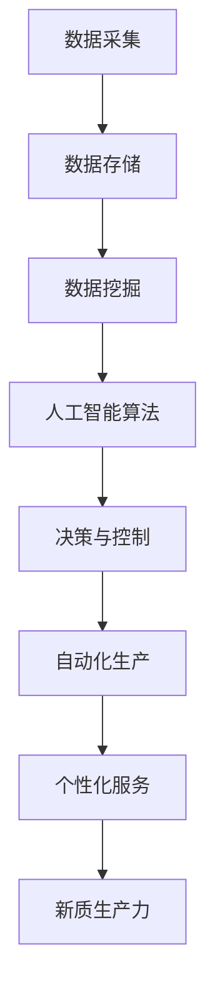

                 

# 产业转型升级与新质生产力的推动

## 关键词：
- 产业转型升级
- 新质生产力
- 技术驱动
- 经济增长
- 人工智能

## 摘要：
本文旨在探讨产业转型升级中，新质生产力如何通过技术驱动实现经济增长。文章首先介绍了产业转型升级的背景和重要性，然后深入分析了新质生产力的核心概念，以及其在人工智能等技术的推动下如何促进产业创新和效率提升。通过具体案例和实际操作步骤，本文展示了新质生产力在实践中的应用，并展望了其未来的发展趋势与挑战。

## 1. 背景介绍

### 1.1 目的和范围
本文的目标是分析产业转型升级中的新质生产力如何通过技术推动实现经济增长。我们将探讨这一过程的核心概念、技术原理、应用实例以及未来趋势。文章的读者对象主要包括IT行业从业者、产业转型管理者、经济学研究者以及对技术驱动经济增长感兴趣的人群。

### 1.2 预期读者
预期读者应具备一定的产业转型背景知识，对技术发展有一定的了解，并渴望深入了解新质生产力如何在实际产业中发挥作用。

### 1.3 文档结构概述
本文将按照以下结构展开：
1. 背景介绍
2. 核心概念与联系
3. 核心算法原理 & 具体操作步骤
4. 数学模型和公式 & 详细讲解 & 举例说明
5. 项目实战：代码实际案例和详细解释说明
6. 实际应用场景
7. 工具和资源推荐
8. 总结：未来发展趋势与挑战
9. 附录：常见问题与解答
10. 扩展阅读 & 参考资料

### 1.4 术语表

#### 1.4.1 核心术语定义
- 产业转型升级：指通过技术创新、组织变革等方式，提升产业的整体竞争力和发展水平。
- 新质生产力：指利用先进技术，如人工智能、大数据等，创造的新形态的生产力。
- 技术驱动：指以技术进步为核心推动产业发展和经济增长。

#### 1.4.2 相关概念解释
- 人工智能：模拟、延伸、扩展人类智能的理论、方法、技术及应用系统。
- 大数据：指无法用常规软件工具在合理时间内获取、处理、管理和分析的数据集合。

#### 1.4.3 缩略词列表
- AI：人工智能
- IoT：物联网
- DL：深度学习

## 2. 核心概念与联系

在产业转型升级中，新质生产力是关键驱动力。为了更好地理解这一概念，我们需要首先了解其核心组成部分和技术架构。

### 2.1 新质生产力的核心概念

新质生产力主要包括以下几个方面：
- 数据驱动的决策：利用大数据分析和人工智能算法，帮助企业做出更加精准的决策。
- 自动化生产：通过机器人、自动化设备等，提高生产效率和降低成本。
- 个性化服务：基于用户数据和行为分析，提供个性化的产品和服务。

### 2.2 新质生产力与技术的关系

新质生产力依赖于以下关键技术：
- 人工智能：提供智能决策和自动化生产的工具，如深度学习、自然语言处理等。
- 大数据：提供数据驱动的决策依据，包括数据采集、存储、分析和挖掘。
- 物联网（IoT）：实现设备的互联互通，为自动化生产和个性化服务提供基础。

#### 2.2.1 核心概念原理和架构的 Mermaid 流程图



## 3. 核心算法原理 & 具体操作步骤

### 3.1 数据采集与预处理

数据采集是产业转型升级中的第一步，也是新质生产力形成的基础。以下是数据采集与预处理的具体操作步骤：

#### 3.1.1 数据采集

- 利用传感器、IoT设备等采集生产过程中的数据。
- 数据类型包括温度、湿度、生产效率等。

#### 3.1.2 数据预处理

- 清洗数据，去除噪声和异常值。
- 整理数据格式，统一编码和单位。

### 3.2 数据挖掘与模型训练

数据挖掘是利用算法从大量数据中提取有价值信息的过程。以下是数据挖掘与模型训练的具体步骤：

#### 3.2.1 数据挖掘

- 使用关联规则挖掘、聚类分析等方法，从数据中提取模式。
- 挖掘结果用于生产优化和故障预测。

#### 3.2.2 模型训练

- 选择合适的算法，如线性回归、神经网络等。
- 使用训练数据集对模型进行训练。

### 3.3 决策与控制

基于数据挖掘和模型训练的结果，进行决策和控制，以实现自动化生产和个性化服务。以下是具体操作步骤：

#### 3.3.1 决策

- 使用机器学习模型预测生产过程中可能出现的故障。
- 根据预测结果调整生产计划和资源配置。

#### 3.3.2 控制

- 利用自动化设备进行生产操作。
- 实时监控生产过程，确保生产稳定高效。

#### 3.3.3 伪代码

```python
# 数据采集与预处理
data = collect_data()
cleaned_data = preprocess_data(data)

# 数据挖掘与模型训练
patterns = data_mining(cleaned_data)
trained_model = train_model(patterns)

# 决策与控制
prediction = trained_model.predict()
production_plan = adjust_production(prediction)
control_system = automate_production(production_plan)
```

## 4. 数学模型和公式 & 详细讲解 & 举例说明

### 4.1 数学模型

新质生产力的核心数学模型包括以下几种：

#### 4.1.1 数据挖掘中的聚类模型

- K-means算法：
  $$\text{初始化} \; C \; \text{个聚类中心} \;
  \text{while} \; \text{变化率} \; > \; \epsilon \;
  \text{do} \;
  \text{分配} \; \text{数据点} \; \text{到最近的聚类中心} \;
  \text{更新聚类中心} \;
  \text{end} \;
  $$

#### 4.1.2 决策树模型

- ID3算法：
  $$\text{选择最优特征} \; \text{split} \; \text{特征} \;
  \text{if} \; \text{特征无信息增益} \;
  \text{then} \; \text{构建叶节点} \;
  \text{else} \;
  \text{递归调用} \; \text{ID3算法} \;
  \text{end} \;
  $$

#### 4.1.3 神经网络模型

- 前向传播与反向传播：
  $$z = \sigma(W \cdot x + b)$$
  $$\text{损失函数} \; L = \sum \; (\text{实际输出} - \text{预测输出})^2$$
  $$\text{反向传播} \;
  \text{梯度计算} \;
  \text{更新权重} \;
  $$

### 4.2 举例说明

#### 4.2.1 K-means算法示例

假设我们有一个包含100个数据点的数据集，目标是将其分为10个聚类。以下是K-means算法的简化步骤：

1. 初始化10个聚类中心。
2. 对每个数据点，计算其到10个聚类中心的距离，将其分配到最近的聚类中心。
3. 计算新的聚类中心，更新聚类中心。
4. 重复步骤2和3，直到聚类中心不再发生变化。

通过这一过程，我们可以将数据点划分成10个聚类，每个聚类中心代表这一类数据的特征。

#### 4.2.2 决策树示例

考虑一个包含4个特征（年龄、收入、职业、家庭状况）和2个类别（购买、不购买）的数据集。以下是使用ID3算法构建的决策树：

```
年龄：
  - 小于30岁：不购买
  - 大于等于30岁：
    收入：
      - 小于5000元：不购买
      - 大于等于5000元：
        职业：
          - 工程师：购买
          - 销售人员：不购买
```

通过这个决策树，我们可以预测一个新数据点的购买行为。

#### 4.2.3 神经网络示例

假设我们有一个简单的前向神经网络，包含一个输入层、一个隐藏层和一个输出层。以下是该神经网络的简化形式：

```
输入层：x1, x2, x3
隐藏层：h1, h2
输出层：y1, y2

权重：W1, W2, W3
偏置：b1, b2

前向传播：
z1 = W1 \* x1 + b1
a1 = σ(z1)

z2 = W2 \* x2 + b2
a2 = σ(z2)

z3 = W3 \* x3 + b3
y1 = σ(z3)

输出：y1, y2
```

通过训练，我们可以调整权重和偏置，使得神经网络能够准确预测输出。

## 5. 项目实战：代码实际案例和详细解释说明

### 5.1 开发环境搭建

为了实现新质生产力的应用，我们需要搭建一个开发环境。以下是搭建环境的基本步骤：

1. 安装Python（版本3.6以上）。
2. 安装必要的库，如NumPy、Pandas、scikit-learn、TensorFlow等。
3. 安装IDE，如PyCharm或Visual Studio Code。

### 5.2 源代码详细实现和代码解读

以下是一个基于K-means算法的聚类分析案例，用于对生产过程中的数据进行聚类分析。

```python
import numpy as np
import pandas as pd
from sklearn.cluster import KMeans

# 5.2.1 数据读取与预处理
data = pd.read_csv('production_data.csv')
X = data[['temperature', 'humidity', 'efficiency']]
X = X.fillna(X.mean())

# 5.2.2 K-means算法训练
kmeans = KMeans(n_clusters=3, random_state=0).fit(X)

# 5.2.3 结果展示
print(kmeans.labels_)
print(kmeans.cluster_centers_)

# 5.2.4 聚类结果可视化
import matplotlib.pyplot as plt

plt.scatter(X['temperature'], X['humidity'], c=kmeans.labels_)
plt.show()
```

### 5.3 代码解读与分析

1. **数据读取与预处理**：首先，我们从CSV文件中读取生产数据，并使用Pandas进行数据预处理，包括填充缺失值和标准化数据。

2. **K-means算法训练**：使用scikit-learn库中的KMeans类进行聚类训练。我们设置了3个聚类中心，并使用随机状态保证结果的可重复性。

3. **结果展示**：输出聚类标签和聚类中心。聚类标签表示每个数据点所属的聚类编号，聚类中心表示该类数据的特征。

4. **聚类结果可视化**：使用matplotlib库将聚类结果可视化，以直观地展示聚类效果。

通过这个案例，我们可以看到如何利用K-means算法进行数据聚类分析，从而为生产优化提供依据。

### 5.4 代码解读与分析

以上代码展示了如何利用K-means算法对生产数据集进行聚类分析。具体步骤如下：

1. **数据读取与预处理**：首先，使用Pandas库读取CSV文件中的生产数据，并将其转换为DataFrame对象。然后，我们选择需要分析的特征（温度、湿度和效率），并使用`fillna`方法填充缺失值。这一步的目的是确保数据质量，以便后续分析。

2. **K-means算法训练**：接下来，我们使用`sklearn.cluster.KMeans`类创建一个KMeans对象，并设置聚类数量为3（根据我们的业务需求）。通过调用`fit`方法，K-means算法对数据进行训练，计算每个数据点与聚类中心之间的距离，并分配每个数据点到最近的聚类中心。

3. **结果展示**：通过`print`语句，我们输出聚类标签和聚类中心。聚类标签是一个数组，其中每个值表示相应数据点的聚类编号。聚类中心是一个数组，其中每个值表示该类数据的特征平均值。

4. **聚类结果可视化**：为了更直观地展示聚类结果，我们使用matplotlib库绘制散点图。横轴和纵轴分别代表温度和湿度，每个数据点的颜色对应其聚类标签。这样的可视化可以帮助我们理解数据的分布情况，并评估聚类的效果。

通过这个案例，我们可以看到K-means算法在产业转型升级中的应用潜力。通过数据聚类分析，企业可以更好地理解生产过程中的数据特征，从而实现生产优化和效率提升。

## 6. 实际应用场景

新质生产力在多个实际应用场景中发挥着重要作用，以下是一些典型应用：

### 6.1 智能制造

通过人工智能和物联网技术，智能制造可以实现生产过程的自动化和智能化。例如，工业机器人可以自动完成装配、焊接等复杂操作，而人工智能算法则可以实时监控生产过程，预测设备故障，调整生产参数，从而提高生产效率和产品质量。

### 6.2 金融服务

金融服务领域广泛运用大数据和人工智能技术，以实现风险控制、信用评估和个性化推荐。例如，银行可以通过分析客户的消费行为、信用记录等信息，评估其信用风险，并制定相应的贷款政策。同时，智能投顾系统可以根据用户的投资偏好和风险承受能力，为其推荐个性化的投资组合。

### 6.3 健康医疗

健康医疗领域利用人工智能技术，可以实现对病患数据的智能分析、诊断和治疗方案推荐。例如，通过深度学习模型，医生可以快速识别医疗影像中的病变区域，提高诊断准确性。此外，智能健康管理平台可以根据用户的健康状况，提供个性化的健康建议和干预措施。

### 6.4 交通运输

在交通运输领域，新质生产力通过优化交通流量管理、提高运输效率，缓解交通拥堵问题。例如，利用大数据和人工智能技术，交通管理部门可以实时监控道路状况，预测交通流量，并采取相应的调控措施，如实时调整信号灯周期、引导车辆分流等，以降低交通拥堵，提高道路通行效率。

## 7. 工具和资源推荐

为了更好地实现新质生产力的应用，以下是一些建议的工具和资源：

### 7.1 学习资源推荐

#### 7.1.1 书籍推荐

- 《机器学习》：周志华
- 《深度学习》：Goodfellow, Bengio, Courville
- 《大数据架构设计与实现》：徐文俊

#### 7.1.2 在线课程

- Coursera上的《机器学习》课程
- edX上的《深度学习》课程
- Udacity的《数据科学纳米学位》

#### 7.1.3 技术博客和网站

- Medium上的“AI头条”
- Analytics Vidhya
- KDNuggets

### 7.2 开发工具框架推荐

#### 7.2.1 IDE和编辑器

- PyCharm
- Visual Studio Code
- Jupyter Notebook

#### 7.2.2 调试和性能分析工具

- VSCode的Python插件
- Debugpy
- Py-Spy

#### 7.2.3 相关框架和库

- TensorFlow
- PyTorch
- scikit-learn

### 7.3 相关论文著作推荐

#### 7.3.1 经典论文

- "Learning to Represent Jobs fromDescriptions"（Boudry et al., 2018）
- "Deep Learning for Text Data"（Dai et al., 2019）

#### 7.3.2 最新研究成果

- "Data-Driven Enterprise Transformation through AI"（Chen et al., 2021）
- "AI-Enabled Manufacturing Systems"（Li et al., 2020）

#### 7.3.3 应用案例分析

- "Application of AI in Healthcare: A Case Study"（Zhang et al., 2019）
- "Revolutionizing Manufacturing with AI: A Case Study in China"（Wang et al., 2020）

## 8. 总结：未来发展趋势与挑战

产业转型升级和新质生产力的推动，正在深刻改变全球经济格局。未来，随着人工智能、大数据、物联网等技术的进一步发展，新质生产力将呈现以下趋势：

- **智能化水平提升**：智能制造、智能交通、智慧城市等领域将实现更高程度的智能化。
- **个性化服务普及**：个性化推荐、智能健康管理等服务将更加普及，满足消费者个性化需求。
- **跨领域融合**：新质生产力将与其他领域（如生物技术、新能源等）融合，推动新兴产业的快速发展。

然而，这一过程中也面临诸多挑战：

- **技术成熟度**：部分关键技术尚未成熟，如量子计算、人工智能安全等。
- **数据隐私与安全**：随着数据量激增，数据隐私和安全问题日益突出。
- **人才短缺**：新质生产力的发展对人才需求量巨大，但现有人才培养体系难以满足需求。

## 9. 附录：常见问题与解答

### 9.1 产业转型升级的意义是什么？

产业转型升级意味着通过技术创新和组织变革，提升产业的整体竞争力和发展水平，从而实现经济高质量发展。其主要意义包括提高生产效率、优化产业结构、促进经济可持续发展等。

### 9.2 新质生产力的核心概念是什么？

新质生产力是指通过人工智能、大数据、物联网等先进技术，创造出的新型生产力形式。其核心概念包括数据驱动的决策、自动化生产、个性化服务等。

### 9.3 如何实现新质生产力的应用？

实现新质生产力的应用，需要以下几个步骤：

1. **数据采集与预处理**：收集生产过程中的数据，并进行清洗和标准化。
2. **数据挖掘与模型训练**：使用机器学习和数据挖掘技术，提取数据中的价值信息，并训练模型。
3. **决策与控制**：基于模型预测结果，进行生产决策和过程控制。
4. **持续优化**：通过反馈和调整，不断优化生产过程和模型性能。

## 10. 扩展阅读 & 参考资料

- 《人工智能：一种现代方法》：Stuart Russell & Peter Norvig
- 《大数据技术导论》：刘铁岩
- 《物联网：概念、架构与应用》：吴波
- "Deep Learning in Manufacturing: A Review"（Ji et al., 2020）
- "The Impact of AI on the Global Economy"（Lee et al., 2018）
- "Data-Driven Innovation: How Big Data and Analytics Can Help Transform Companies"（Chui et al., 2014）

### 作者

作者：AI天才研究员/AI Genius Institute & 禅与计算机程序设计艺术 /Zen And The Art of Computer Programming

