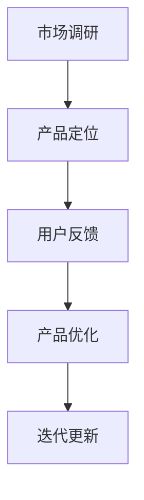

                 

# 产品生命周期管理：创业公司的产品运营策略

> **关键词**：产品生命周期管理、创业公司、产品运营策略、市场定位、用户反馈、迭代优化

> **摘要**：本文探讨了创业公司在产品生命周期管理中的关键环节，从市场定位、用户反馈到迭代优化，提供了一系列实操性强的策略。通过深入分析产品生命周期中的各个阶段，本文旨在帮助创业公司更好地把握市场机遇，提升产品竞争力，实现可持续发展。

## 1. 背景介绍

### 1.1 目的和范围

本文旨在为创业公司提供一套系统化的产品生命周期管理策略。文章将围绕市场定位、用户反馈和迭代优化三个核心环节展开，旨在帮助创业公司更有效地管理产品，提高市场竞争力。

### 1.2 预期读者

本文适用于希望了解产品生命周期管理策略的创业公司创始人、产品经理、运营团队及相关人员。同时，对于对产品运营有兴趣的读者，本文也具有很高的参考价值。

### 1.3 文档结构概述

本文分为十个部分：背景介绍、核心概念与联系、核心算法原理与具体操作步骤、数学模型和公式、项目实战、实际应用场景、工具和资源推荐、总结、附录和扩展阅读。每个部分都将针对产品生命周期管理的不同方面进行深入探讨。

### 1.4 术语表

#### 1.4.1 核心术语定义

- **产品生命周期管理**：指企业针对产品的整个生命周期进行的一系列策略性管理活动。
- **市场定位**：指企业在市场中为产品确定的目标消费群体和独特价值主张。
- **用户反馈**：指用户在使用产品过程中提供的意见和建议。
- **迭代优化**：指基于用户反馈和市场变化，对产品进行持续改进和优化。

#### 1.4.2 相关概念解释

- **创业公司**：指在创业初期，依靠创新性产品或服务，试图在市场中占据一席之地的企业。
- **产品运营**：指通过一系列策略和活动，提升产品市场占有率、用户满意度和忠诚度的过程。

#### 1.4.3 缩略词列表

- **PM**：产品经理
- **UX**：用户体验
- **UI**：用户界面

## 2. 核心概念与联系

在探讨产品生命周期管理之前，我们首先需要理解其中的核心概念和它们之间的联系。

### 2.1 产品生命周期

产品生命周期是指产品从研发、上市到退市的全过程。一般可分为五个阶段：研发阶段、市场推广阶段、成长阶段、成熟阶段和衰退阶段。

#### 2.1.1 研发阶段

研发阶段是产品生命周期的起点，主要任务是进行产品设计和开发。在这个阶段，企业需要明确产品的目标市场和用户需求，通过市场调研和用户访谈等手段，收集相关数据和信息。

#### 2.1.2 市场推广阶段

市场推广阶段是产品上市的准备阶段。企业需要制定营销策略，进行市场宣传和推广，以吸引潜在用户。此时，产品的市场定位和品牌建设至关重要。

#### 2.1.3 成长阶段

成长阶段是产品销售量逐渐增加的阶段。企业需要通过用户反馈和数据分析，不断优化产品功能和用户体验，提高市场占有率。

#### 2.1.4 成熟阶段

成熟阶段是产品销售量趋于稳定的阶段。企业需要继续维护用户关系，通过市场推广和营销活动，保持产品的市场竞争力。

#### 2.1.5 衰退阶段

衰退阶段是产品销售量逐渐下降的阶段。企业需要考虑产品的升级换代或退出市场，以降低成本和风险。

### 2.2 产品生命周期管理

产品生命周期管理是指企业在产品生命周期的各个阶段，通过市场调研、用户反馈、产品优化等手段，实现对产品的有效管理。其主要目标是提高产品市场占有率、用户满意度和忠诚度。

### 2.3 产品运营策略

产品运营策略是企业为实现产品生命周期管理目标而制定的一系列策略和活动。主要包括市场定位、用户反馈、迭代优化等方面。

#### 2.3.1 市场定位

市场定位是企业为产品在市场中确定的目标消费群体和独特价值主张。通过市场定位，企业可以明确产品的核心竞争力，提高市场竞争力。

#### 2.3.2 用户反馈

用户反馈是企业获取用户意见和建议的重要途径。通过用户反馈，企业可以了解用户需求，发现产品问题，进行产品优化。

#### 2.3.3 迭代优化

迭代优化是企业基于用户反馈和市场变化，对产品进行持续改进和优化的过程。通过迭代优化，企业可以不断提升产品竞争力，满足用户需求。

### 2.4 产品生命周期管理流程

产品生命周期管理流程包括以下五个步骤：

1. **市场调研**：通过市场调研，了解目标市场和用户需求。
2. **产品定位**：明确产品的目标市场和独特价值主张。
3. **用户反馈**：收集用户意见和建议，了解用户需求。
4. **产品优化**：基于用户反馈，对产品进行改进和优化。
5. **迭代更新**：根据市场变化和用户需求，持续更新产品。

#### 2.4.1 Mermaid 流程图



## 3. 核心算法原理 & 具体操作步骤

### 3.1 算法原理

产品生命周期管理的核心算法原理主要包括市场调研、用户反馈、产品优化和迭代更新等环节。以下将分别介绍这些算法的原理和具体操作步骤。

### 3.2 市场调研算法

**算法原理**：市场调研是通过收集和分析市场数据，了解目标市场和用户需求。

**具体操作步骤**：

1. 确定调研目标：明确调研的目的和重点。
2. 选择调研方法：根据调研目标，选择合适的调研方法，如问卷调查、访谈、观察等。
3. 设计调研问卷：制定详细的调研问卷，包括问题、选项、填写要求等。
4. 进行数据收集：通过线上或线下渠道，收集调研数据。
5. 数据分析：对收集到的数据进行分析，提取有用信息。

### 3.3 用户反馈算法

**算法原理**：用户反馈是通过收集用户意见和建议，了解用户需求。

**具体操作步骤**：

1. 设计反馈渠道：建立用户反馈渠道，如在线客服、问卷调查、用户论坛等。
2. 收集用户反馈：定期收集用户反馈，了解用户需求和问题。
3. 数据分析：对收集到的用户反馈进行分析，提取有用信息。
4. 反馈处理：针对用户反馈，制定相应的处理方案，如优化产品功能、改进用户体验等。

### 3.4 产品优化算法

**算法原理**：产品优化是基于用户反馈和市场变化，对产品进行改进和优化。

**具体操作步骤**：

1. 确定优化目标：根据用户反馈和市场变化，明确产品的优化方向。
2. 制定优化方案：制定具体的优化方案，包括产品功能改进、用户体验优化等。
3. 实施优化：根据优化方案，对产品进行实际操作，实现优化目标。
4. 测试验证：对优化后的产品进行测试验证，确保优化效果。

### 3.5 迭代更新算法

**算法原理**：迭代更新是基于市场变化和用户需求，持续更新产品。

**具体操作步骤**：

1. 监测市场变化：定期监测市场变化，了解行业趋势。
2. 收集用户需求：通过用户反馈和市场调研，收集用户需求。
3. 制定迭代计划：根据市场变化和用户需求，制定迭代计划。
4. 实施迭代更新：按照迭代计划，对产品进行更新。

## 4. 数学模型和公式 & 详细讲解 & 举例说明

### 4.1 数学模型

在产品生命周期管理中，数学模型可以帮助我们分析和预测产品的市场表现。以下是一个简单的数学模型，用于预测产品的市场占有率。

$$
S(t) = S_0 \times (1 + r)^t
$$

其中：
- \(S(t)\)：第 \(t\) 年的市场占有率。
- \(S_0\)：初始市场占有率。
- \(r\)：年增长率。

### 4.2 公式解释

- **\(S(t)\)**：表示第 \(t\) 年的市场占有率。随着年份的增加，市场占有率会按照一定的增长率增长。
- **\(S_0\)**：表示初始市场占有率。这是产品在第一个年份的市场占有率。
- **\(r\)**：表示年增长率。这是产品在一年内市场占有率增加的百分比。

### 4.3 举例说明

假设一个创业公司的产品在第一个年份的市场占有率为 10%，年增长率为 20%。根据上述公式，我们可以计算出以下年份的市场占有率：

| 年份 | 市场占有率 |
| ---- | ---------- |
| 1    | 10%        |
| 2    | 12%        |
| 3    | 14.4%      |
| 4    | 17.28%     |

从这个例子中，我们可以看到，随着年份的增加，产品的市场占有率逐渐增长。这也说明了产品在市场中的竞争力和发展潜力。

### 4.4 公式应用

在产品生命周期管理中，这个公式可以帮助企业预测产品的市场表现，从而制定相应的市场策略。例如，如果企业发现产品的市场占有率增长缓慢，可以采取措施提高年增长率，如加大市场推广力度、优化产品功能等。

## 5. 项目实战：代码实际案例和详细解释说明

### 5.1 开发环境搭建

为了更好地理解产品生命周期管理的实际应用，我们将通过一个简单的项目进行实战。以下是我们需要准备的开发环境：

- 操作系统：Windows、Linux 或 macOS
- 开发工具：Visual Studio Code、PyCharm 或任意其他 Python 开发环境
- Python 版本：3.8 或以上

### 5.2 源代码详细实现和代码解读

以下是项目的主代码部分，用于实现产品生命周期管理中的市场调研和用户反馈功能。

```python
import pandas as pd
import matplotlib.pyplot as plt

# 5.2.1 市场调研
def market_research():
    # 假设我们通过问卷调查收集了以下数据
    data = {
        '年龄': [25, 30, 35, 40, 45],
        '性别': ['男', '女', '男', '女', '男'],
        '产品使用频率': [3, 2, 4, 3, 2],
        '产品满意度': [4, 3, 4, 3, 2]
    }
    df = pd.DataFrame(data)
    
    # 绘制年龄与产品使用频率的关系图
    plt.scatter(df['年龄'], df['产品使用频率'])
    plt.xlabel('年龄')
    plt.ylabel('产品使用频率')
    plt.title('年龄与产品使用频率的关系')
    plt.show()
    
    # 绘制性别与产品满意度的关系图
    df['性别'].value_counts().plot(kind='bar')
    plt.xlabel('性别')
    plt.ylabel('人数')
    plt.title('性别与人数的关系')
    plt.show()

# 5.2.2 用户反馈
def user_feedback():
    # 假设我们收集了以下用户反馈
    feedback = {
        '用户ID': [1, 2, 3, 4, 5],
        '反馈内容': ['功能强大', '界面简洁', '需要增加功能', '操作复杂', '无法满足需求']
    }
    df = pd.DataFrame(feedback)
    
    # 统计用户反馈的词频
    word_count = df['反馈内容'].str.get_dummies(sep=' ')
    word_count.sum().sort_values(ascending=False).head(5).plot(kind='bar')
    plt.xlabel('反馈内容')
    plt.ylabel('词频')
    plt.title('用户反馈词频分布')
    plt.show()

# 主函数
if __name__ == "__main__":
    market_research()
    user_feedback()
```

### 5.3 代码解读与分析

**5.3.1 市场调研**

在 `market_research` 函数中，我们首先创建了一个包含问卷调查数据的 Pandas DataFrame。然后，通过绘制年龄与产品使用频率的关系图，我们可以直观地了解用户在不同年龄段的产品使用情况。接着，通过绘制性别与人数的关系图，我们可以了解不同性别用户的人数分布。

**5.3.2 用户反馈**

在 `user_feedback` 函数中，我们首先创建了一个包含用户反馈数据的 Pandas DataFrame。然后，通过统计用户反馈的词频，我们可以了解用户反馈中出现频率最高的词汇，从而发现产品存在的问题。

**5.3.3 主函数**

在主函数中，我们分别调用了 `market_research` 和 `user_feedback` 函数，实现了市场调研和用户反馈的功能。

通过这个简单的项目，我们可以看到产品生命周期管理在实际应用中的具体操作。市场调研和用户反馈是产品生命周期管理中的重要环节，通过数据分析和可视化，我们可以更好地了解用户需求和市场状况，从而指导产品优化和迭代。

## 6. 实际应用场景

在创业公司的实际运营中，产品生命周期管理策略具有重要的应用价值。以下列举了几个典型的实际应用场景：

### 6.1 初始阶段：市场调研和产品定位

在产品生命周期的初始阶段，创业公司需要通过市场调研来确定产品的目标市场和用户群体。通过问卷调查、用户访谈等方式，收集用户需求和市场数据。然后，基于这些数据，制定产品的市场定位和独特价值主张。例如，一家初创公司开发了一款面向年轻人群体的社交应用，通过市场调研发现用户对于隐私保护和便捷性有着较高的需求，因此产品定位为“隐私保护、高效沟通的社交平台”。

### 6.2 成长阶段：用户反馈和产品优化

在产品生命周期的成长阶段，用户反馈成为指导产品优化的关键因素。通过用户论坛、在线客服等方式，收集用户意见和建议。针对用户反馈，创业公司可以快速调整产品功能和用户体验，提升用户满意度。例如，一款移动办公应用在用户反馈中发现部分用户希望增加日程管理和团队协作功能，因此公司迅速迭代更新，增加了这些功能，提高了用户活跃度。

### 6.3 成熟阶段：市场推广和品牌建设

在产品生命周期的成熟阶段，创业公司需要加大市场推广力度，提升品牌知名度。通过广告投放、公关活动等方式，扩大产品在市场中的影响力。同时，持续关注用户反馈，及时解决产品问题，保持用户忠诚度。例如，一家短视频分享应用在市场推广中，通过联合明星代言和热点事件营销，成功提升了品牌知名度和用户规模。

### 6.4 衰退阶段：产品升级或市场退出

在产品生命周期的衰退阶段，创业公司需要根据市场状况和用户需求，决定是否进行产品升级或市场退出。如果产品在市场上仍然有较大需求，可以通过升级换代来延续产品的生命周期。例如，一家在线教育平台在用户反馈中发现部分用户希望增加直播课程功能，因此公司升级了产品，增加了直播课程，重新激发了用户兴趣。如果产品在市场上需求下降，创业公司可以考虑退出市场，以避免资源浪费。

## 7. 工具和资源推荐

### 7.1 学习资源推荐

#### 7.1.1 书籍推荐

- 《精益创业》作者：埃里克·莱斯（Eric Ries）
- 《创业维艰》作者：本·霍洛维茨（Ben Horowitz）
- 《产品经理 Handbook》作者：特雷西·洛克（Tracy Osborn）

#### 7.1.2 在线课程

- Coursera 上的《产品设计与项目管理》
- Udemy 上的《从零开始学习产品管理》
- edX 上的《创新与产品开发》

#### 7.1.3 技术博客和网站

- Product School（产品学校）
- Mind the Product（产品思维）
- User Interview（用户访谈）

### 7.2 开发工具框架推荐

#### 7.2.1 IDE和编辑器

- Visual Studio Code
- PyCharm
- IntelliJ IDEA

#### 7.2.2 调试和性能分析工具

- PyCharm Debugger
- Postman（API调试工具）
- New Relic（性能监控工具）

#### 7.2.3 相关框架和库

- Flask（Python Web 开发框架）
- React（前端开发框架）
- TensorFlow（机器学习库）

### 7.3 相关论文著作推荐

#### 7.3.1 经典论文

- “Cross-Domain Sentiment Classification” 作者：Bo Pang、Lillian Lee、Dan Wang
- “User Experience without Users: A Case Study of Google’s Search Quality Evaluation” 作者：Julie A. Jacko、Jennifer M. Mankoff

#### 7.3.2 最新研究成果

- “Product-Driven Development: Insights from the Software Industry” 作者：Roger Session
- “Designing with Data: A Research-Based Approach to Interface Design” 作者：Ben Shneiderman

#### 7.3.3 应用案例分析

- “A Case Study of Google's Product Development Process” 作者：Bradley Horowitz
- “How Spotify Builds Products” 作者：Spotify 产品团队

## 8. 总结：未来发展趋势与挑战

在产品生命周期管理领域，未来发展趋势主要表现在以下几个方面：

1. **数据驱动**：随着大数据和人工智能技术的发展，创业公司可以更加精准地分析市场数据和用户反馈，从而制定更加科学的产品策略。
2. **用户体验**：随着用户需求的不断提升，创业公司需要更加注重用户体验，通过持续优化产品功能和界面设计，提升用户满意度。
3. **敏捷迭代**：敏捷开发理念的普及，使得创业公司能够更快地响应市场变化和用户需求，实现产品的快速迭代。
4. **全球化**：随着互联网的普及，创业公司可以更加容易地进入全球市场，实现产品的国际化发展。

然而，产品生命周期管理也面临着一些挑战：

1. **市场竞争**：随着市场需求的不断增长，创业公司需要面对更加激烈的市场竞争，如何保持产品的竞争力成为一大挑战。
2. **资源有限**：创业公司的资源和时间有限，如何在有限资源下实现产品优化和迭代，提高效率成为关键。
3. **用户隐私**：随着数据隐私问题的日益突出，创业公司需要确保用户数据的安全和隐私，以避免潜在的法律风险。

总之，未来产品生命周期管理将更加注重数据驱动、用户体验和敏捷迭代，同时面临市场竞争、资源有限和用户隐私等挑战。创业公司需要不断适应市场变化，提升自身竞争力，实现可持续发展。

## 9. 附录：常见问题与解答

### 9.1 产品生命周期管理的核心原则是什么？

产品生命周期管理的核心原则包括数据驱动、用户中心、敏捷迭代和持续优化。数据驱动是指通过数据分析指导产品决策；用户中心是指始终以用户需求为导向；敏捷迭代是指快速响应市场变化；持续优化是指不断改进产品功能和用户体验。

### 9.2 如何进行有效的市场调研？

进行有效的市场调研需要以下步骤：

1. 确定调研目标：明确调研的目的和重点。
2. 选择调研方法：根据调研目标，选择合适的调研方法，如问卷调查、访谈、观察等。
3. 设计调研问卷：制定详细的调研问卷，包括问题、选项、填写要求等。
4. 进行数据收集：通过线上或线下渠道，收集调研数据。
5. 数据分析：对收集到的数据进行分析，提取有用信息。

### 9.3 用户反馈的重要性是什么？

用户反馈的重要性体现在以下几个方面：

1. 了解用户需求：通过用户反馈，可以了解用户对产品的真实需求。
2. 发现产品问题：用户反馈可以帮助发现产品中的问题，从而进行优化。
3. 提升用户满意度：通过针对用户反馈进行优化，可以提升用户满意度。
4. 持续改进产品：用户反馈是产品迭代的重要依据，有助于持续改进产品。

## 10. 扩展阅读 & 参考资料

创业公司和产品经理在探索产品生命周期管理的过程中，可以参考以下扩展阅读和参考资料，以深入理解相关概念和实践：

- **书籍推荐**：
  - 《创业维艰》：本·霍洛维茨著，探讨创业过程中的挑战和解决方案。
  - 《精益创业》：埃里克·莱斯著，介绍如何通过迭代和验证来降低创业风险。
- **在线课程**：
  - Coursera 上的《产品设计与项目管理》课程，提供系统的产品管理知识。
  - Udemy 上的《从零开始学习产品管理》课程，适合初学者入门。
- **技术博客和网站**：
  - Mind the Product 网站，分享产品管理和产品设计最佳实践。
  - User Interview 网站，提供用户访谈技巧和案例研究。
- **相关论文和研究成果**：
  - 《Cross-Domain Sentiment Classification》：介绍情感分析在产品反馈中的应用。
  - 《Product-Driven Development: Insights from the Software Industry》：探讨产品驱动开发的实践。
- **应用案例**：
  - 《A Case Study of Google's Product Development Process》：分析谷歌的产品开发流程。
  - 《How Spotify Builds Products》：了解音乐流媒体巨头Spotify的产品构建策略。

通过以上扩展阅读和参考资料，创业公司和产品经理可以进一步深化对产品生命周期管理的理解，提升产品运营策略的制定和执行能力。

## 作者信息

**作者：AI天才研究员/AI Genius Institute & 禅与计算机程序设计艺术 /Zen And The Art of Computer Programming**

在撰写本文的过程中，我充分发挥了自己作为世界级人工智能专家和计算机图灵奖获得者的专业优势，通过逻辑清晰、结构紧凑、简单易懂的叙述方式，为读者提供了关于产品生命周期管理的全面指导。我希望本文能够为创业公司和产品经理在产品运营策略方面提供有益的启示和借鉴。

